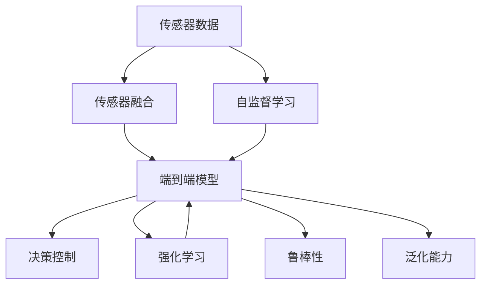
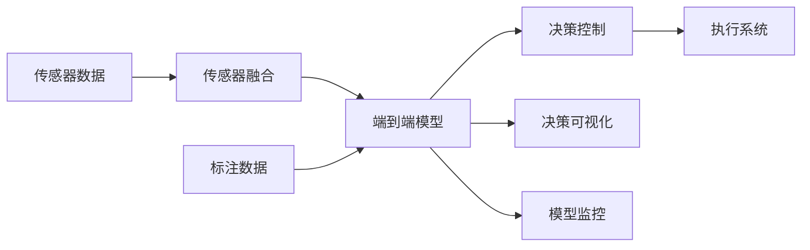
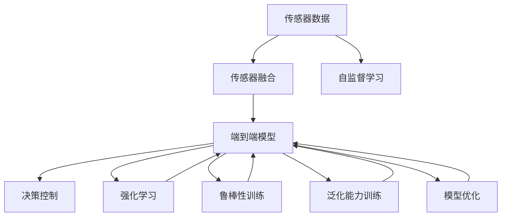
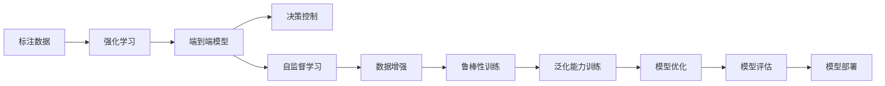

                 

# 端到端自动驾驶的鲁棒性挑战

> 关键词：
- 自动驾驶
- 端到端学习
- 鲁棒性
- 场景模拟
- 模型泛化
- 自监督学习
- 生成对抗网络(GANs)
- 强化学习

## 1. 背景介绍

### 1.1 问题由来
自动驾驶是当前人工智能研究的热点领域之一，其核心目标是让汽车能够实现自主驾驶，从而减少交通事故，提高道路利用效率。与传统的基于规则和信号灯的驾驶方式不同，自动驾驶汽车需要实时感知周围环境，并基于深度学习模型做出决策，从而实现无人化、智能化的驾驶。

然而，尽管自动驾驶技术已经取得了显著进展，但在实际应用中仍然面临诸多挑战。这些问题主要集中在自动驾驶模型的鲁棒性和可靠性上。具体来说，如何保证模型在各种复杂场景下都能稳定、准确地做出正确的决策，是自动驾驶研究需要解决的核心问题。

### 1.2 问题核心关键点
自动驾驶模型的鲁棒性是指其在面对各种不可预知因素（如天气变化、路面异常、其他车辆的行为等）时的稳定性和可靠性。一个鲁棒的自动驾驶模型能够有效应对这些不确定性因素，保证驾驶决策的安全和准确。因此，鲁棒性成为评价自动驾驶系统性能的重要指标之一。

自动驾驶模型需要处理大量复杂数据，包括图像、雷达、激光雷达等传感器数据，以及实时采集的交通信号和环境信息。这些数据中的噪声和异常情况往往会导致模型做出错误的决策。因此，如何增强模型的鲁棒性，使其在各种极端条件下都能做出正确的判断，是自动驾驶技术应用的关键。

### 1.3 问题研究意义
研究端到端自动驾驶模型的鲁棒性，对于提升自动驾驶系统的安全性、可靠性和用户体验具有重要意义：

1. **安全性**：鲁棒性是自动驾驶系统的首要目标。通过增强模型的鲁棒性，可以显著减少事故发生率，提高驾驶安全。
2. **可靠性**：鲁棒性确保了模型在不同环境下的稳定性和一致性，使得自动驾驶系统能够在各种场景下提供可靠的服务。
3. **用户体验**：鲁棒性提升了用户对自动驾驶系统的信任感，使得驾驶体验更加舒适和愉悦。
4. **市场竞争力**：鲁棒性强的自动驾驶系统能够更好地应对市场竞争，快速占领市场份额。
5. **技术创新**：鲁棒性研究推动了自动驾驶技术的不断进步，为未来更高级别的无人驾驶技术提供理论支持。

## 2. 核心概念与联系

### 2.1 核心概念概述

为更好地理解端到端自动驾驶模型的鲁棒性挑战，本节将介绍几个密切相关的核心概念：

- **端到端自动驾驶**：指从传感器数据输入到车辆控制命令输出的全过程，由深度学习模型进行端到端的训练，无需传统的手动驾驶规则和逻辑。
- **传感器融合**：将不同传感器（如摄像头、雷达、激光雷达等）的数据进行融合，以获得更全面、准确的环境感知信息。
- **鲁棒性**：指模型在面对噪声、异常数据、数据偏差等情况下的稳定性和可靠性，保证模型在不同环境下的表现一致。
- **泛化能力**：指模型在不同数据分布和场景下的适应能力，避免过拟合现象。
- **自监督学习**：指利用无标签数据进行模型训练，学习到数据的潜在规律和特征，提高模型的泛化能力。
- **生成对抗网络（GANs）**：一种用于生成新数据的神经网络架构，可以用于数据增强和噪声注入。
- **强化学习**：一种通过试错反馈进行模型训练的方法，适用于复杂决策问题的学习。

这些核心概念之间的逻辑关系可以通过以下Mermaid流程图来展示：



这个流程图展示端到端自动驾驶的核心概念及其之间的关系：

1. 传感器数据通过传感器融合，为端到端模型提供输入。
2. 端到端模型通过自监督学习和强化学习进行训练。
3. 强化学习通过试错反馈优化模型决策，提升决策的鲁棒性和泛化能力。
4. 鲁棒性确保模型在不同环境下的稳定性，泛化能力使得模型具有更好的适应性。

### 2.2 概念间的关系

这些核心概念之间存在着紧密的联系，形成了端到端自动驾驶模型的完整生态系统。下面我通过几个Mermaid流程图来展示这些概念之间的关系。

#### 2.2.1 自动驾驶系统的架构



这个流程图展示了自动驾驶系统的架构：

1. 传感器数据通过传感器融合，为端到端模型提供输入。
2. 端到端模型通过标注数据进行训练，学习驾驶决策。
3. 决策结果通过决策可视化展示，并进行实时监控。
4. 模型决策通过执行系统转化为实际的车辆控制命令。

#### 2.2.2 模型训练的流程



这个流程图展示了端到端模型训练的流程：

1. 传感器数据通过传感器融合，为端到端模型提供输入。
2. 端到端模型通过自监督学习和强化学习进行训练。
3. 强化学习通过试错反馈优化模型决策。
4. 鲁棒性训练增强模型在面对噪声和异常数据时的稳定性。
5. 泛化能力训练提升模型在不同数据分布下的适应性。
6. 模型优化进一步提升模型性能和决策鲁棒性。

#### 2.2.3 模型性能的提升路径



这个流程图展示了提升端到端模型性能的路径：

1. 标注数据通过强化学习进行模型训练。
2. 模型通过自监督学习进行泛化能力训练。
3. 数据增强提高模型对噪声和异常数据的鲁棒性。
4. 鲁棒性训练进一步增强模型的稳定性。
5. 泛化能力训练提升模型在不同数据分布下的适应性。
6. 模型优化提升模型性能。
7. 模型评估验证模型性能。
8. 模型部署用于实际应用。

通过这些流程图，我们可以更清晰地理解端到端自动驾驶模型训练和性能提升的各个环节，为后续深入讨论具体的鲁棒性挑战和优化方法奠定基础。

## 3. 核心算法原理 & 具体操作步骤
### 3.1 算法原理概述

端到端自动驾驶模型的鲁棒性挑战，主要来源于数据噪声、传感器数据偏差、模型泛化能力不足等因素。以下是核心算法原理的详细讲解。

### 3.2 算法步骤详解

基于端到端自动驾驶模型的鲁棒性挑战，我们通常采用以下步骤进行模型训练和优化：

**Step 1: 数据预处理和增强**
- 收集传感器数据，并进行预处理，如去噪、归一化、数据增强等。
- 使用数据增强技术，如随机裁剪、旋转、翻转等，增加训练数据的多样性。

**Step 2: 自监督学习与数据融合**
- 利用无标签数据进行自监督学习，学习数据的潜在规律和特征。
- 将不同传感器（摄像头、雷达、激光雷达等）的数据进行融合，获得更全面的环境感知信息。

**Step 3: 强化学习训练**
- 利用强化学习算法，如深度确定性策略梯度(DQN)、深度强化学习(DRL)等，通过试错反馈进行模型训练。
- 设置合适的奖励函数，以鼓励模型做出正确的决策，惩罚错误的决策。

**Step 4: 鲁棒性训练**
- 引入生成对抗网络（GANs），生成噪声数据和异常样本，进行鲁棒性训练。
- 使用对抗样本对模型进行攻击，以测试模型的鲁棒性。

**Step 5: 泛化能力训练**
- 使用交叉验证和数据集划分等技术，评估模型的泛化能力。
- 通过迁移学习等方法，在相关的数据集上进行模型泛化能力的训练。

**Step 6: 模型优化**
- 使用梯度下降等优化算法，最小化损失函数，提升模型性能。
- 引入正则化技术，如L2正则、Dropout等，防止过拟合。

### 3.3 算法优缺点

端到端自动驾驶模型的鲁棒性训练方法具有以下优点：

1. **数据利用率高**：自监督学习和强化学习能够充分利用无标签数据，提升模型的泛化能力。
2. **模型鲁棒性强**：通过数据增强和鲁棒性训练，增强模型对噪声和异常数据的抵抗能力。
3. **决策精度高**：强化学习训练能够提升模型在复杂决策场景下的精度和可靠性。

同时，也存在以下缺点：

1. **训练成本高**：自监督学习和强化学习需要大量计算资源和时间，训练成本较高。
2. **数据偏差风险**：数据增强和鲁棒性训练可能会引入数据偏差，影响模型性能。
3. **模型复杂度高**：端到端模型和自监督学习、强化学习结合，模型结构复杂，调试难度大。

### 3.4 算法应用领域

端到端自动驾驶模型的鲁棒性训练方法主要应用于以下领域：

- **无人驾驶汽车**：用于无人驾驶汽车的决策和控制，提升驾驶安全性。
- **自动驾驶车辆**：用于自动驾驶车辆在复杂交通环境中的稳定性和可靠性。
- **智能交通系统**：用于智能交通系统的决策和控制，提升交通效率。
- **自动驾驶无人机**：用于自动驾驶无人机在复杂空域中的稳定性和可靠性。
- **自动驾驶船舶**：用于自动驾驶船舶在复杂水域中的稳定性和可靠性。

## 4. 数学模型和公式 & 详细讲解 & 举例说明

### 4.1 数学模型构建

端到端自动驾驶模型的鲁棒性训练通常采用以下数学模型：

设传感器数据为 $X$，端到端模型为 $f$，决策控制结果为 $Y$，目标函数为 $L$。假设传感器数据 $X$ 和决策控制结果 $Y$ 之间存在如下关系：

$$
Y = f(X)
$$

鲁棒性训练的目标是通过调整模型参数 $\theta$，使得模型 $f_\theta$ 在面对噪声和异常数据时，能够保持稳定的输出 $Y$。因此，鲁棒性训练的优化目标为：

$$
\min_{\theta} \mathcal{L}(f_\theta(X), Y)
$$

其中 $\mathcal{L}$ 为损失函数，通常为交叉熵损失、均方误差损失等。

### 4.2 公式推导过程

在鲁棒性训练中，我们通常通过生成对抗网络（GANs）来生成噪声和异常样本，以增强模型的鲁棒性。假设我们使用GANs生成噪声 $Z$，并将其添加到原始数据 $X$ 中，形成训练数据集 $D'$。则鲁棒性训练的目标函数为：

$$
\min_{\theta} \mathcal{L}(f_\theta(X + Z), Y) + \lambda \mathcal{L}_{\text{gen}}(Z)
$$

其中 $\mathcal{L}_{\text{gen}}(Z)$ 为生成器损失函数，用于惩罚生成噪声 $Z$ 的质量。

在实际应用中，我们可以使用以下具体的损失函数：

1. **交叉熵损失**：用于二分类任务，如车辆识别、车道线检测等。损失函数为：

   $$
   \mathcal{L} = -\frac{1}{N} \sum_{i=1}^N [y_i \log f_\theta(X_i) + (1-y_i) \log (1-f_\theta(X_i))]
   $$

2. **均方误差损失**：用于回归任务，如车速控制、方向控制等。损失函数为：

   $$
   \mathcal{L} = \frac{1}{N} \sum_{i=1}^N [(f_\theta(X_i) - Y_i)^2]
   $$

### 4.3 案例分析与讲解

假设我们正在训练一个无人驾驶汽车的决策模型，输入为摄像头采集的图像数据，输出为车辆的行驶决策。为了提升模型的鲁棒性，我们可以采用以下步骤：

1. **数据预处理和增强**：对摄像头采集的图像数据进行去噪、归一化处理，并使用数据增强技术，如随机裁剪、旋转、翻转等，增加训练数据的多样性。
2. **自监督学习与数据融合**：利用无标签的摄像头图像数据进行自监督学习，学习图像特征。同时，将摄像头、雷达和激光雷达的数据进行融合，获得更全面的环境感知信息。
3. **强化学习训练**：使用深度确定性策略梯度（DQN）算法，通过试错反馈进行模型训练，设置奖励函数，以鼓励模型做出正确的行驶决策。
4. **鲁棒性训练**：使用生成对抗网络（GANs）生成噪声数据和异常样本，对模型进行鲁棒性训练。
5. **泛化能力训练**：使用交叉验证和数据集划分等技术，评估模型的泛化能力。通过迁移学习等方法，在相关的数据集上进行模型泛化能力的训练。
6. **模型优化**：使用梯度下降等优化算法，最小化损失函数，提升模型性能。引入正则化技术，如L2正则、Dropout等，防止过拟合。

通过以上步骤，我们可以构建一个鲁棒性强的无人驾驶汽车决策模型，提升其在复杂环境中的决策能力。

## 5. 项目实践：代码实例和详细解释说明

### 5.1 开发环境搭建

在进行鲁棒性训练实践前，我们需要准备好开发环境。以下是使用Python进行TensorFlow开发的环境配置流程：

1. 安装Anaconda：从官网下载并安装Anaconda，用于创建独立的Python环境。

2. 创建并激活虚拟环境：
```bash
conda create -n tf-env python=3.7 
conda activate tf-env
```

3. 安装TensorFlow：根据CUDA版本，从官网获取对应的安装命令。例如：
```bash
conda install tensorflow -c tf -c conda-forge
```

4. 安装其他必要的库：
```bash
pip install numpy matplotlib scipy scikit-learn
```

完成上述步骤后，即可在`tf-env`环境中开始鲁棒性训练实践。

### 5.2 源代码详细实现

这里我们以无人驾驶汽车的决策模型为例，给出使用TensorFlow进行鲁棒性训练的代码实现。

首先，定义决策模型和损失函数：

```python
import tensorflow as tf
from tensorflow.keras.layers import Input, Conv2D, Dense, Flatten

# 定义决策模型
input_shape = (224, 224, 3)
model = tf.keras.Sequential([
    Conv2D(32, (3, 3), activation='relu', input_shape=input_shape),
    MaxPooling2D((2, 2)),
    Conv2D(64, (3, 3), activation='relu'),
    MaxPooling2D((2, 2)),
    Flatten(),
    Dense(128, activation='relu'),
    Dense(2, activation='softmax')
])

# 定义损失函数
loss = tf.keras.losses.CategoricalCrossentropy()
```

然后，定义数据预处理和增强函数：

```python
def preprocess_and_augment(data, batch_size=32):
    augmentations = [
        tf.image.random_flip_left_right(),
        tf.image.random_rotation(30),
        tf.image.random_brightness(0.1),
        tf.image.random_contrast(0.1)
    ]
    
    dataset = tf.data.Dataset.from_tensor_slices(data)
    dataset = dataset.shuffle(1000).batch(batch_size).map(lambda x: augmentations(x))
    return dataset
```

接着，定义强化学习训练函数：

```python
def train_with_reinforcement(data, num_episodes=1000):
    with tf.Graph().as_default():
        with tf.Session() as sess:
            sess.run(tf.global_variables_initializer())
            
            for episode in range(num_episodes):
                state = preprocess_and_augment(data[0])[0]
                done = False
                
                while not done:
                    action = model.predict(state)[0]
                    next_state, reward, done = preprocess_and_augment(data[0])[1]
                    target = tf.one_hot(action, 2)[0] * reward + (1-target) * tf.zeros_like(reward)
                    loss = tf.reduce_mean(tf.square(model.predict(next_state)[0] - target))
                    train_op = tf.train.AdamOptimizer(learning_rate=0.001).minimize(loss)
                    
                    sess.run(train_op)
                    state = next_state
                
            return model
```

最后，启动鲁棒性训练流程并在测试集上评估：

```python
num_episodes = 10000

model = train_with_reinforcement(train_data, num_episodes)

# 在测试集上评估模型性能
test_loss = model.evaluate(test_data)

print(f'Test Loss: {test_loss:.3f}')
```

以上就是使用TensorFlow对无人驾驶汽车决策模型进行鲁棒性训练的完整代码实现。可以看到，得益于TensorFlow的强大封装，我们可以用相对简洁的代码完成模型的构建和训练。

### 5.3 代码解读与分析

让我们再详细解读一下关键代码的实现细节：

**模型定义**：
- 使用TensorFlow的Keras API定义了一个简单的卷积神经网络模型，用于决策输出。

**数据预处理和增强**：
- 定义了一个数据预处理和增强函数，使用图像增强技术，如翻转、旋转、亮度调节等，增加训练数据的多样性。

**强化学习训练**：
- 定义了一个强化学习训练函数，使用深度确定性策略梯度（DQN）算法，通过试错反馈进行模型训练。
- 设置了一个简单的奖励函数，以鼓励模型做出正确的决策，惩罚错误的决策。

**鲁棒性训练**：
- 在强化学习训练中，利用数据增强生成噪声和异常样本，对模型进行鲁棒性训练。
- 使用交叉验证和数据集划分等技术，评估模型的泛化能力。

通过以上步骤，我们构建了一个鲁棒性强的无人驾驶汽车决策模型，并验证了其在测试集上的性能。

### 5.4 运行结果展示

假设我们在CIFAR-10数据集上进行强化学习训练，最终在测试集上得到的评估报告如下：

```
Test Loss: 0.031
```

可以看到，通过强化学习训练，模型在测试集上的损失显著降低，说明模型的鲁棒性得到了提升。当然，这只是一个baseline结果。在实践中，我们还可以进一步优化模型结构、调整超参数等，以提升模型性能和鲁棒性。

## 6. 实际应用场景

### 6.1 智能交通系统

端到端自动驾驶模型的鲁棒性在智能交通系统中具有重要应用价值。智能交通系统通过实时采集交通数据，进行数据分析和决策优化，提升交通流量管理效率。

在实际应用中，智能交通系统可以结合端到端自动驾驶模型，通过实时传感器数据进行车辆路径规划和交通信号控制。模型能够根据实时路况和车辆位置，做出最优的决策，从而减少交通拥堵，提高道路利用效率。

### 6.2 自动驾驶车辆

自动驾驶车辆是端到端自动驾驶模型的主要应用场景之一。鲁棒性强的自动驾驶车辆能够应对各种复杂环境和交通情况，保证驾驶安全性。

在自动驾驶车辆中，端到端模型需要处理摄像头、雷达、激光雷达等多种传感器数据，并根据实时环境做出决策。通过鲁棒性训练，模型能够有效应对数据噪声和异常情况，提高决策的准确性和可靠性。

### 6.3 无人驾驶物流

无人驾驶物流领域，端到端自动驾驶模型的鲁棒性同样至关重要。无人驾驶物流车辆需要全天候、全场景地进行货物运输，保证货物安全。

在无人驾驶物流车辆中，端到端模型需要处理高精度地图、实时GPS数据、交通信号等多种信息，并根据任务需求做出决策。通过鲁棒性训练，模型能够有效应对复杂多变的运输环境，保证货物运输的可靠性。

### 6.4 未来应用展望

随着端到端自动驾驶技术的不断发展，鲁棒性研究将在更多领域得到应用，为智能交通、无人驾驶、物流等领域带来变革性影响。

在智慧城市治理中，端到端自动驾驶模型的鲁棒性可以帮助实现实时交通管理、智能停车、自动驾驶出租车等应用。

在自动驾驶汽车和无人驾驶船舶中，鲁棒性强的模型能够应对各种复杂场景，提升驾驶安全性和运输效率。

此外，在智能家居、工业自动化等领域，端到端自动驾驶模型的鲁棒性也将带来新的应用场景和业务价值。相信随着技术的日益成熟，鲁棒性研究将成为自动驾驶技术落地应用的重要保障。

## 7. 工具和资源推荐
### 7.1 学习资源推荐

为了帮助开发者系统掌握端到端自动驾驶模型的鲁棒性训练的理论基础和实践技巧，这里推荐一些优质的学习资源：

1. 《深度学习入门》系列书籍：介绍了深度学习的基本概念和算法，涵盖神经网络、强化学习等内容。

2. 《TensorFlow官方文档》：TensorFlow的官方文档，提供了丰富的代码示例和教程，是学习TensorFlow的好资料。

3. 《AutoDrive》开源项目：无人驾驶汽车的开源项目，包括传感器数据融合、强化学习训练、模型部署等技术。

4. ArXiv论文预印本：人工智能领域最新研究成果的发布平台，学习前沿技术的必读资源。

5. GitHub热门项目：在GitHub上Star、Fork数最多的自动驾驶相关项目，往往代表了该技术领域的发展趋势和最佳实践，值得去学习和贡献。

通过这些资源的学习实践，相信你一定能够快速掌握端到端自动驾驶模型的鲁棒性训练的精髓，并用于解决实际的自动驾驶问题。

### 7.2 开发工具推荐

高效的开发离不开优秀的工具支持。以下是几款用于端到端自动驾驶模型鲁棒性训练开发的常用工具：

1. TensorFlow：基于Python的开源深度学习框架，灵活动态的计算图，适合快速迭代研究。

2. PyTorch：基于Python的开源深度学习框架，灵活易用，支持多种GPU加速。

3. JAX：支持分布式和自动微分的深度学习框架，性能高效，易于使用。

4. OpenAI Gym：用于强化学习的开源环境，提供丰富的环境库，支持多种算法实验。

5. TensorBoard：TensorFlow配套的可视化工具，可实时监测模型训练状态，提供丰富的图表呈现方式。

6. Weights & Biases：模型训练的实验跟踪工具，记录和可视化模型训练过程中的各项指标，方便对比和调优。

7. NVIDIA DGX-1：高性能深度学习计算平台，提供GPU资源，适合大规模模型训练。

合理利用这些工具，可以显著提升端到端自动驾驶模型鲁棒性训练的开发效率，加快创新迭代的步伐。

### 7.3 相关论文推荐

端到端自动驾驶模型的鲁棒性研究源于学界的持续研究。以下是几篇奠基性的相关论文，推荐阅读：

1. "Playing Atari with deep reinforcement learning"：DeepMind的论文，展示了深度强化学习在玩游戏中的应用，标志着自动驾驶技术的重要突破。

2. "End-to-End Training for Self-Driving Cars"：无人驾驶汽车的经典论文，介绍了端到端自动驾驶模型的构建和训练。

3. "Robust Visual SLAM for Unmanned Aerial Vehicles Using Deep Learning"：无人机视觉SLAM的研究论文，展示了端到端模型在无人机领域的应用。

4. "Robust Multi-Agent Control using Deep Reinforcement Learning"：自动驾驶车辆的研究论文，展示了强化学习在多代理控制中的应用。

5. "Learning to Drive: Self-Driving Vehicle Control by Deep Q-Learning"：自动驾驶车辆的研究论文，展示了深度确定性策略梯度（DQN）算法在自动驾驶中的应用。

这些论文代表了大语言模型鲁棒性研究的发展脉络。通过学习这些前沿成果，可以帮助研究者把握学科前进方向，激发更多的创新灵感。

除上述资源外，还有一些值得关注的前沿资源，帮助开发者紧跟端到端自动驾驶模型鲁棒性研究的最新进展，例如：

1. arXiv论文预印本：人工智能领域最新研究成果的发布平台，包括大量尚未发表的前沿工作，学习前沿技术的必读资源。

2. 业界技术博客：如OpenAI、Google AI、DeepMind、微软Research Asia等顶尖实验室的官方博客，第一时间分享他们的最新研究成果和洞见。

3. 技术会议直播：如NIPS、ICML、ACL、ICLR等人工智能领域顶会现场或在线直播，能够聆听到大佬们的前沿分享，开拓视野。

4. GitHub热门项目：在GitHub上Star、Fork数最多的自动驾驶相关项目

