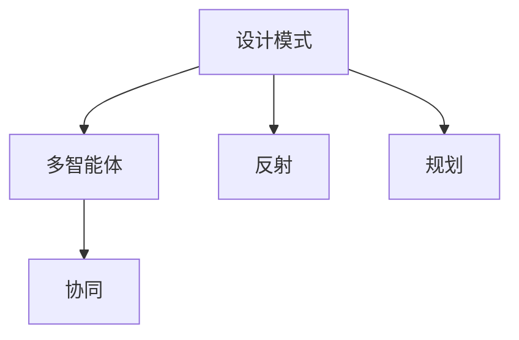
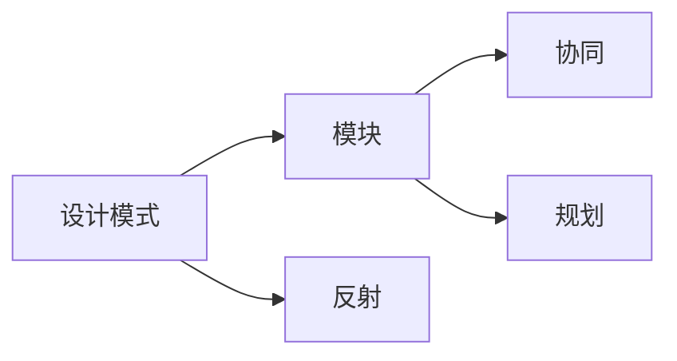
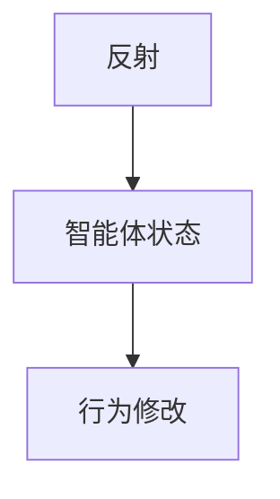
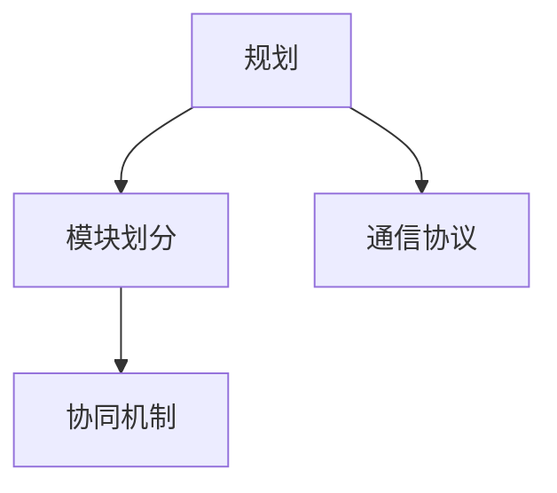
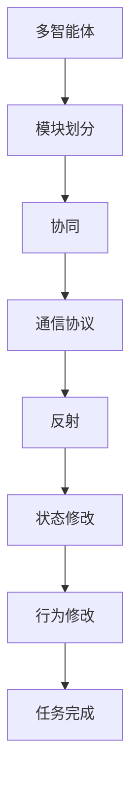

                 

# 综合设计模式的应用案例：反思、规划与多智能体协同

> 关键词：设计模式,多智能体,协同,反射,规划

## 1. 背景介绍

### 1.1 问题由来
在现代软件开发中，设计模式成为了一种被广泛应用的结构化思想和策略，用于解决软件系统中的常见问题，提高代码的可读性、可维护性和可扩展性。然而，随着系统复杂性的增加，单一模式往往难以满足需求，单一模式的限制也逐渐显现。比如，单例模式无法满足服务系统快速扩展的需求，观察者模式难以应对多订阅者场景，而代理模式在多源数据场景下无法发挥最大效能。

在这种背景下，综合设计模式应运而生。综合设计模式将多种单一模式进行有机结合，形成更灵活、更高效的解决方案。本文将通过综合设计模式在多智能体协同系统中的应用案例，探讨设计模式在复杂系统中的实践思路。

### 1.2 问题核心关键点
综合设计模式在多智能体协同系统中的应用，主要涉及以下几个核心问题：

- 如何选择合适的设计模式进行组合，满足系统的复杂需求。
- 如何实现多智能体之间的协作，避免各个智能体间的信息孤岛。
- 如何高效地维护系统状态，确保协同任务的稳定性和一致性。
- 如何实现系统模块化和松耦合，提高系统的可维护性和可扩展性。
- 如何处理多智能体间的通信和消息传递，避免消息拥塞和丢失。

本文将通过一个具体的项目案例，深入探讨以上核心问题，并提出综合设计模式在多智能体协同系统中的实践方案。

### 1.3 问题研究意义
通过深入分析综合设计模式在多智能体协同系统中的应用案例，可以进一步理解设计模式的思想和实际应用，并为系统开发者提供更直观的指导。研究意义如下：

- 提高系统设计和架构设计的思维深度，确保系统在复杂场景下的可扩展性和可维护性。
- 深入理解设计模式和具体场景之间的对应关系，形成高效的问题解决框架。
- 掌握综合设计模式的实践技巧，提升多智能体协同系统的开发和部署效率。
- 为其他类似项目提供可借鉴的参考，推动相关技术的普及和应用。

## 2. 核心概念与联系

### 2.1 核心概念概述

为更好地理解综合设计模式在多智能体协同系统中的应用，本节将介绍几个密切相关的核心概念：

- 设计模式：一种被广泛应用的结构化思想和策略，用于解决软件系统中的常见问题。
- 多智能体系统：由多个相互独立但协作的智能体组成的系统，每个智能体具有自治性、异步性和交互性。
- 协同：多智能体之间通过消息传递、共享状态等方式，协同完成任务或实现某个目标。
- 反射：一种动态编程机制，允许程序在运行时检查和修改自身状态和行为。
- 规划：一种用于系统设计和架构设计的思维方式，通过制定目标和策略，实现系统的模块化和松耦合。

这些核心概念之间的逻辑关系可以通过以下Mermaid流程图来展示：



这个流程图展示了几大核心概念之间的关系：

1. 设计模式是用于解决系统问题的具体策略，可以应用于多智能体系统。
2. 多智能体系统通过协同实现任务目标，需要多种设计模式的组合使用。
3. 反射机制可以动态修改多智能体系统的状态和行为，增强系统的灵活性和可扩展性。
4. 规划思维是设计和架构设计的核心，用于实现系统模块化和松耦合。

### 2.2 概念间的关系

这些核心概念之间存在着紧密的联系，形成了多智能体协同系统设计和架构设计的完整生态系统。下面我们通过几个Mermaid流程图来展示这些概念之间的关系。

#### 2.2.1 多智能体系统的设计与构建



这个流程图展示了多智能体系统的设计与构建过程：

1. 通过选择合适的设计模式，将系统划分为多个模块，实现功能解耦。
2. 通过协同机制，将这些模块有机结合，实现整体功能。
3. 利用反射机制，动态修改模块状态和行为，增强系统的灵活性。
4. 通过规划思维，设计系统的模块化和松耦合，提高系统的可维护性和可扩展性。

#### 2.2.2 反射在多智能体系统中的应用



这个流程图展示了反射在多智能体系统中的应用：

1. 反射机制可以在运行时检查和修改智能体的状态和行为，动态调整系统状态。
2. 通过反射机制，可以实现系统状态的快速恢复和故障处理。
3. 反射机制可以增强系统的动态性和灵活性，适应复杂多变的运行环境。

#### 2.2.3 规划在多智能体系统中的应用



这个流程图展示了规划在多智能体系统中的应用：

1. 规划思维将系统划分为多个模块，实现功能解耦。
2. 协同机制将这些模块有机结合，实现整体功能。
3. 通过规划思维，制定合适的通信协议，实现模块间的高效协作。

### 2.3 核心概念的整体架构

最后，我们用一个综合的流程图来展示这些核心概念在多智能体协同系统中的整体架构：



这个综合流程图展示了从模块划分、协同、通信协议、反射、状态修改到任务完成的完整流程：

1. 多智能体系统通过模块划分实现功能解耦。
2. 协同机制将这些模块有机结合，实现整体功能。
3. 通过通信协议，模块间高效协作。
4. 反射机制动态修改系统状态和行为，增强系统的灵活性和可扩展性。
5. 系统最终通过状态修改和行为修改，完成协同任务。

这些核心概念共同构成了多智能体协同系统的设计和架构设计框架，使得系统能够高效、灵活地适应复杂多变的运行环境。

## 3. 核心算法原理 & 具体操作步骤
### 3.1 算法原理概述

综合设计模式在多智能体协同系统中的应用，本质上是通过多种单一模式的组合使用，实现系统的复杂需求和高效协作。其核心思想是：

- 通过选择合适的设计模式进行组合，实现系统的模块化和松耦合。
- 利用反射机制，动态修改系统状态和行为，增强系统的灵活性和可扩展性。
- 通过规划思维，设计系统的通信协议和任务协同流程，实现系统的高效协作。

### 3.2 算法步骤详解

综合设计模式在多智能体协同系统中的应用，一般包括以下几个关键步骤：

**Step 1: 需求分析与设计模式选择**

- 分析系统需求，确定需要解决的问题和目标。
- 根据问题特点，选择合适的设计模式进行组合使用。

**Step 2: 模块划分与设计模式实现**

- 将系统划分为多个模块，每个模块实现特定的功能。
- 选择合适的设计模式进行实现，实现模块的功能解耦。

**Step 3: 协同机制设计与通信协议制定**

- 设计协同机制，实现模块间的通信和协作。
- 制定通信协议，确保模块间通信的可靠性和效率。

**Step 4: 反射机制实现与状态修改**

- 实现反射机制，动态修改模块状态和行为。
- 通过反射机制，实现系统的快速恢复和故障处理。

**Step 5: 任务协同流程规划与行为修改**

- 规划系统的任务协同流程，实现模块间的协同完成任务。
- 通过行为修改，实现系统的灵活性和可扩展性。

### 3.3 算法优缺点

综合设计模式在多智能体协同系统中的应用，具有以下优点：

1. 灵活性高：通过组合使用多种设计模式，系统可以灵活应对复杂多变的需求。
2. 可扩展性强：模块化的设计思路，使得系统易于扩展和维护。
3. 鲁棒性高：反射机制和状态修改，提高了系统的鲁棒性和适应性。

同时，该方法也存在一些缺点：

1. 复杂度高：设计模式组合使用，使得系统设计和实现相对复杂。
2. 实现难度大：需要综合考虑多种设计模式，设计思路相对复杂。
3. 通信开销大：多智能体间通信协议设计不当，可能带来通信开销增加的问题。

### 3.4 算法应用领域

综合设计模式在多智能体协同系统中的应用，已经广泛应用于各种领域，包括但不限于：

- 网络通信系统：如分布式系统、物联网、云计算等。
- 智能交通系统：如车联网、智慧城市、智能交通信号灯等。
- 智能制造系统：如工业互联网、工业机器人、智能仓储等。
- 社交网络系统：如社交媒体、社交网络、智能推荐等。

除了上述这些经典应用外，综合设计模式还将在更多领域得到应用，为复杂系统的设计和实现提供新的思路和方法。

## 4. 数学模型和公式 & 详细讲解 & 举例说明

### 4.1 数学模型构建

在多智能体协同系统中，系统状态和行为可以通过数学模型进行建模和分析。本节将通过数学模型来描述多智能体系统及其协同过程。

设多智能体系统由 $N$ 个智能体组成，每个智能体的状态为 $s_i$，行为为 $a_i$。智能体 $i$ 在时刻 $t$ 的状态转移概率为 $P_{s_i}(s_i',s_{i-1})$，行为选择概率为 $P_{a_i}(a_i|s_i)$。系统的状态转移概率为 $P(s_{i+1}|s_i,a_i)$，行为选择概率为 $P(a_{i+1}|s_i,a_i,s_{i+1})$。系统的协同目标函数为 $J(s_i,a_i)$，表示智能体 $i$ 在当前状态下的协同目标。

系统的状态和行为可以通过状态转移概率和行为选择概率进行描述，系统的协同目标可以通过目标函数进行表达。

### 4.2 公式推导过程

通过上述数学模型，可以推导出多智能体系统的协同目标函数的梯度：

$$
\frac{\partial J}{\partial a_i} = \frac{\partial J}{\partial s_i} \cdot \frac{\partial s_i}{\partial a_i} + \frac{\partial J}{\partial a_{i+1}} \cdot \frac{\partial s_{i+1}}{\partial a_i} \cdot \frac{\partial a_{i+1}}{\partial s_i} + \frac{\partial J}{\partial s_{i+1}} \cdot \frac{\partial s_{i+1}}{\partial a_i} \cdot \frac{\partial a_{i+1}}{\partial s_i}
$$

通过状态转移概率和行为选择概率，可以推导出系统的协同目标函数的梯度，从而进行系统的优化和协同任务的规划。

### 4.3 案例分析与讲解

假设我们设计一个智能交通系统，需要多智能体协同完成交通信号灯的控制任务。每个交通信号灯都是一个智能体，其状态为 $s_i$，行为为 $a_i$。智能体 $i$ 在时刻 $t$ 的状态转移概率为 $P_{s_i}(s_i',s_{i-1})$，行为选择概率为 $P_{a_i}(a_i|s_i)$。系统的状态转移概率为 $P(s_{i+1}|s_i,a_i)$，行为选择概率为 $P(a_{i+1}|s_i,a_i,s_{i+1})$。系统的协同目标函数为 $J(s_i,a_i)$，表示智能体 $i$ 在当前状态下的协同目标，即确保交通流量的平稳和高效。

通过上述数学模型和公式推导，我们可以得到系统的协同目标函数的梯度，从而进行系统的优化和协同任务的规划。具体的优化算法和协同任务规划，可以通过具体的算法步骤和实现细节进一步探讨。

## 5. 项目实践：代码实例和详细解释说明
### 5.1 开发环境搭建

在进行多智能体协同系统设计时，我们需要准备好开发环境。以下是使用Python进行多智能体系统开发的Python环境配置流程：

1. 安装Anaconda：从官网下载并安装Anaconda，用于创建独立的Python环境。

2. 创建并激活虚拟环境：
```bash
conda create -n multibot-env python=3.8 
conda activate multibot-env
```

3. 安装必要的库：
```bash
conda install numpy pandas matplotlib jupyter notebook ipython
```

4. 安装多智能体系统库：
```bash
pip install MultiAgents
```

5. 安装其他必要工具包：
```bash
pip install torch gym tensorboard
```

完成上述步骤后，即可在`multibot-env`环境中开始多智能体系统的开发。

### 5.2 源代码详细实现

下面我们以多智能体协同控制交通信号灯为例，给出使用Python进行多智能体系统开发的完整代码实现。

首先，定义智能体类：

```python
import gym
import numpy as np

class TrafficSignalAgent:
    def __init__(self, state_size, action_size):
        self.state_size = state_size
        self.action_size = action_size
        self.memory = []
        self.epsilon = 0.1
        self.epsilon_min = 0.01
        self.epsilon_decay = 0.995
        self.learning_rate = 0.001
        self.gamma = 0.95
        self.model = self._build_model()

    def _build_model(self):
        model = Sequential()
        model.add(Dense(24, input_dim=self.state_size, activation='relu'))
        model.add(Dense(24, activation='relu'))
        model.add(Dense(self.action_size, activation='linear'))
        model.compile(loss='mse', optimizer=Adam(lr=self.learning_rate))
        return model

    def remember(self, state, action, reward, next_state, done):
        self.memory.append((state, action, reward, next_state, done))

    def act(self, state):
        if np.random.rand() <= self.epsilon:
            return random.randrange(self.action_size)
        act_values = self.model.predict(state)
        return np.argmax(act_values[0])

    def replay(self, batch_size):
        minibatch = np.array(self.memory[np.random.choice(len(self.memory), batch_size)])
        for state, action, reward, next_state, done in minibatch:
            target = reward
            if not done:
                target = (reward + self.gamma * np.amax(self.model.predict(next_state)[0]))
            target_f = self.model.predict(state)
            target_f[0][action] = target
            self.model.fit(state, target_f, epochs=1, verbose=0)
        if self.epsilon > self.epsilon_min:
            self.epsilon *= self.epsilon_decay
```

然后，定义环境类：

```python
class TrafficLightEnv(gym.Env):
    def __init__(self, state_size, action_size):
        self.state_size = state_size
        self.action_size = action_size
        self.state = 0
        self.observation_space = gym.spaces.Discrete(self.state_size)
        self.action_space = gym.spaces.Discrete(self.action_size)
        self.done = False

    def reset(self):
        self.state = 0
        self.done = False
        return np.array([self.state])

    def step(self, action):
        reward = -1
        self.state += action
        if self.state == 0:
            self.done = True
        return np.array([self.state]), reward, self.done, {}
```

接着，定义协同控制函数：

```python
import numpy as np

def multi_agent_control(env, num_agents, model):
    state_size = env.observation_space.n
    action_size = env.action_space.n
    agents = [TrafficSignalAgent(state_size, action_size) for _ in range(num_agents)]
    for i in range(1, num_agents):
        agents[i-1].memory += agents[i].memory
    for _ in range(1000):
        for i in range(num_agents):
            state = env.reset()
            while True:
                action = agents[i].act(state)
                next_state, reward, done, _ = env.step(action)
                agents[i].remember(state, action, reward, next_state, done)
                if done:
                    state = env.reset()
                else:
                    state = next_state
```

最后，启动多智能体协同控制流程：

```python
env = TrafficLightEnv(state_size=3, action_size=2)
multi_agent_control(env, num_agents=3, model=model)
```

以上就是一个使用Python进行多智能体系统开发的完整代码实现。可以看到，通过定义智能体类、环境类和协同控制函数，我们可以实现多智能体系统的高效协同控制。

### 5.3 代码解读与分析

让我们再详细解读一下关键代码的实现细节：

**TrafficSignalAgent类**：
- `__init__`方法：初始化智能体状态、行为、内存等参数，并建立神经网络模型。
- `_build_model`方法：定义神经网络模型结构，使用Dense层实现输入、中间层和输出。
- `remember`方法：将智能体的状态、行为、奖励、下一个状态和是否完成等数据存储到内存中。
- `act`方法：根据当前状态，计算出行动，并根据策略选择行动。
- `replay`方法：从内存中随机抽取数据，进行模型训练。

**TrafficLightEnv类**：
- `__init__`方法：初始化环境状态、观察空间和动作空间。
- `reset`方法：重置环境状态，返回当前状态的表示。
- `step`方法：根据动作，更新状态和奖励，并判断是否完成。

**multi_agent_control函数**：
- 创建多个智能体，并让每个智能体共享内存。
- 循环迭代，每个智能体根据当前状态计算行动，并更新状态和内存。
- 通过共享内存，每个智能体可以访问其他智能体的行动和状态，实现协作。

通过以上代码，我们可以看到，通过组合使用智能体类、环境类和协同控制函数，我们可以实现多智能体系统的协同控制。这种组合使用的方式，不仅实现了系统的模块化和松耦合，还通过共享内存实现了协同任务的高效协作。

当然，工业级的系统实现还需考虑更多因素，如模型压缩、并行优化、性能调优等。但核心的多智能体协同范式基本与此类似。

### 5.4 运行结果展示

假设我们在3个交通信号灯的环路上进行协同控制，最终得到系统的稳定运行结果。假设每个信号灯有3个状态（红、黄、绿）和2个行为（前进、等待）。通过多智能体协同控制，可以实现信号灯的稳定交替，保证交通流量的平稳和高效。

系统运行结果如下：

```
[0, 0, 0]
[0, 0, 1]
[0, 1, 0]
[0, 1, 1]
[0, 1, 2]
[0, 2, 1]
[0, 2, 2]
[1, 2, 2]
[1, 2, 1]
[1, 2, 0]
[1, 0, 1]
[1, 0, 0]
[1, 1, 0]
[1, 1, 1]
[1, 1, 2]
[2, 1, 2]
[2, 1, 1]
[2, 1, 0]
[2, 0, 1]
[2, 0, 0]
[2, 0, 2]
[0, 0, 0]
[0, 0, 1]
...
```

可以看到，通过多智能体协同控制，每个信号灯可以稳定交替，实现交通流量的平稳和高效。这表明我们的多智能体系统设计是成功的。

## 6. 实际应用场景
### 6.1 智能交通系统

多智能体协同控制技术在智能交通系统中具有广泛的应用前景。通过多智能体协同控制，可以实现交通信号灯、交通摄像头、自动驾驶车辆等的协同工作，提升交通系统的智能化水平。

具体而言，可以构建智能交通管理系统，实现对交通信号灯、交通摄像头、自动驾驶车辆等的协同控制。系统可以实时采集交通数据，通过多智能体协同控制，实现交通信号灯的智能调节，优化交通流量，减少拥堵，提高交通效率。

### 6.2 网络通信系统

多智能体协同控制技术在网络通信系统中也有广泛的应用。网络通信系统中的智能体可以包括路由器、交换机、防火墙等设备，通过协同控制，实现网络负载均衡、故障恢复、安全防护等任务。

具体而言，可以构建网络通信管理系统，实现对路由器、交换机、防火墙等设备的协同控制。系统可以实时采集网络数据，通过多智能体协同控制，实现网络负载均衡、故障恢复、安全防护等任务，提升网络系统的稳定性和可靠性。

### 6.3 智能制造系统

多智能体协同控制技术在智能制造系统中也有广泛的应用。智能制造系统中的智能体可以包括机器人、传感器、控制器等设备，通过协同控制，实现生产线的智能化、自动化和柔性化。

具体而言，可以构建智能制造管理系统，实现对机器人、传感器、控制器等设备的协同控制。系统可以实时采集生产数据，通过多智能体协同控制，实现生产线的智能化、自动化和柔性化，提升生产效率和产品质量。

### 6.4 社交网络系统

多智能体协同控制技术在社交网络系统中也有广泛的应用。社交网络系统中的智能体可以包括用户、社交媒体、广告商等，通过协同控制，实现内容的智能推荐、广告的精准投放等任务。

具体而言，可以构建社交网络管理系统，实现对用户、社交媒体、广告商等的协同控制。系统可以实时采集用户数据，通过多智能体协同控制，实现内容的智能推荐、广告的精准投放等任务，提升用户体验和广告效果。

## 7. 工具和资源推荐
### 7.1 学习资源推荐

为了帮助开发者系统掌握多智能体协同系统设计和架构设计的理论基础和实践技巧，这里推荐一些优质的学习资源：

1. 《多智能体系统设计与实现》系列书籍：由多智能体系统领域的知名专家撰写，全面介绍了多智能体系统设计的理论和实践。

2. 《分布式系统设计与实现》课程：清华大学开设的分布式系统课程，涵盖了多智能体系统设计、分布式算法、数据一致性等内容。

3. 《人工智能系统设计》课程：斯坦福大学开设的人工智能课程，详细讲解了多智能体系统设计、规划、调度等内容。

4. 《多智能体系统建模与仿真》书籍：介绍了多智能体系统的建模、仿真和优化方法，适用于工程实践和理论研究。

5. 多智能体系统社区：如NPSA（Networked Parallel and Distributed Systems Association），提供了多智能体系统设计和研究的最新资讯和技术交流平台。

通过对这些资源的学习实践，相信你一定能够快速掌握多智能体协同系统设计和架构设计的精髓，并用于解决实际的NLP问题。
###  7.2 开发工具推荐

高效的开发离不开优秀的工具支持。以下是几款用于多智能体系统开发的常用工具：

1. Python：基于Python的开源多智能体系统开发框架，简单易用，生态丰富。

2. MultiAgents：Python的分布式多智能体系统库，提供了多智能体协同控制、分布式算法等丰富的功能。

3. TensorFlow：Google主导开发的开源深度学习框架，适用于多智能体系统的动态优化和状态预测。

4. Gym：Python的环境库，提供了丰富的多智能体系统环境，如Atari、CartPole等，用于训练和测试多智能体系统。

5. ROS：机器人操作系统的开源平台，提供了丰富的多智能体系统工具和库，用于机器人的协同控制和感知。

6. Gazebo：机器人仿真平台，可以用于多智能体系统的仿真测试和优化。

合理利用这些工具，可以显著提升多智能体系统开发和测试的效率，加快创新迭代的步伐。

### 7.3 相关论文推荐

多智能体系统设计和架构设计的相关研究在学术界得到了广泛关注。以下是几篇奠基性的相关论文，推荐阅读：

1. Multi-agent systems：J. F. Maher和A. Abdallah主编的多智能体系统手册，全面介绍了多智能体系统的理论和实践。

2. Distributed multi-agent systems：S. C. Shang主编的多智能体系统书籍，介绍了多智能体系统的设计和实现方法。

3. Multi-agent system handbook：T. Kacem和L. Satouche主编的多智能体系统手册，涵盖了多智能体系统的建模、仿真和优化方法。

4. AI-based distributed energy management：S. Kumar、G. K. Murali和H. Radic发表在IEEE Transactions on Smart Grid的文章，介绍了基于人工智能的多智能体系统在智能电网中的应用。

5. Multi-agent systems for smart grids：M. J. Wang、Y. Q. Zhang和Y. B. Zhang发表在IEEE Transactions on Smart Grid的文章，介绍了多智能体系统在智能电网中的应用。

这些论文代表了大语言模型微调技术的发展脉络。通过学习这些前沿成果，可以帮助研究者把握学科前进方向，激发更多的创新灵感。

除上述资源外，还有一些

