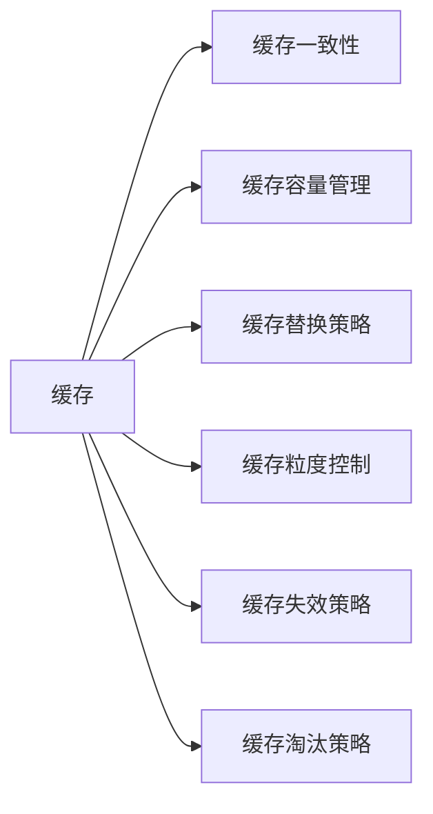

                 

# 缓存机制在高吞吐量中的实例应用

## 1. 背景介绍

### 1.1 问题由来

在现代计算机系统中，缓存(Cache)机制被广泛应用于提升系统性能，尤其是在高吞吐量的应用场景中。缓存通过将部分数据从主存储器(如硬盘、SSD)复制到高速缓存(如DRAM、CPU缓存)中，使得数据访问速度大大提升，减少了访问延迟。然而，随着数据量和系统复杂度的不断增加，缓存机制的设计和管理变得愈发复杂。如何在高吞吐量系统中设计高效、可扩展的缓存机制，成为一个重要的研究方向。

### 1.2 问题核心关键点

高吞吐量系统中的缓存设计需要考虑以下几个关键点：

- 缓存一致性：如何在多级缓存系统中保持数据的一致性，避免脏读、脏写等问题。
- 缓存容量管理：如何合理管理缓存容量，避免缓存不足导致系统性能下降。
- 缓存替换策略：如何选择替换缓存中的数据，以最小化性能损失。
- 缓存粒度控制：如何控制缓存的粒度，平衡缓存效率和系统开销。
- 缓存失效策略：如何处理缓存失效情况，避免因缓存失效导致性能下降。
- 缓存淘汰策略：如何淘汰不常用的缓存数据，以最大化缓存的利用率。

这些关键点决定了缓存机制在高吞吐量系统中的性能表现。本文将通过一系列实例，深入探讨缓存一致性、缓存容量管理、缓存替换策略等核心问题，并给出相应的解决方案。

## 2. 核心概念与联系

### 2.1 核心概念概述

- 缓存(Cache)：一种高速数据存储机制，将部分数据存储在高速缓存中，用于提升数据访问速度。
- 缓存一致性(Cache Consistency)：在多级缓存系统中，如何保持数据的一致性，避免脏读、脏写等问题。
- 缓存容量管理(Cache Capacity Management)：如何合理管理缓存容量，避免缓存不足导致性能下降。
- 缓存替换策略(Cache Replacement Policy)：如何选择替换缓存中的数据，以最小化性能损失。
- 缓存粒度控制(Cache Granularity Control)：如何控制缓存的粒度，平衡缓存效率和系统开销。
- 缓存失效策略(Cache Invalidation Strategy)：如何处理缓存失效情况，避免因缓存失效导致性能下降。
- 缓存淘汰策略(Cache Eviction Strategy)：如何淘汰不常用的缓存数据，以最大化缓存的利用率。

这些核心概念通过下图的Mermaid流程图展示其逻辑关系：



这个流程图展示了缓存机制的几个核心概念及其相互关系：

- 缓存是整个缓存机制的基础。
- 缓存一致性、容量管理、替换策略等都是缓存管理的重要部分。
- 粒度控制、失效策略、淘汰策略等则是缓存机制的具体实现。

### 2.2 概念间的关系

- 缓存一致性：是保证缓存中数据与主存储器数据一致性的关键，直接影响系统的正确性和可靠性。
- 缓存容量管理：决定了系统可以缓存多少数据，直接影响到缓存效率和系统性能。
- 缓存替换策略：决定何时替换缓存中的数据，直接影响缓存命中率。
- 缓存粒度控制：决定缓存的粒度大小，影响缓存的访问速度和空间占用。
- 缓存失效策略：决定如何处理缓存失效，直接影响缓存的维护成本。
- 缓存淘汰策略：决定如何淘汰不常用的缓存数据，直接影响缓存的利用率。

这些核心概念之间相互依存，共同构成了缓存机制的整体架构。

## 3. 核心算法原理 & 具体操作步骤

### 3.1 算法原理概述

高吞吐量系统中的缓存机制通常采用多级缓存体系，包括内存(L1、L2缓存)、硬盘缓存、SSD缓存等。数据从主存储器复制到缓存中，提升数据访问速度。缓存一致性、容量管理、替换策略等都是缓存机制的核心问题。

### 3.2 算法步骤详解

**Step 1: 确定缓存容量**

- 根据系统负载和数据访问模式，确定缓存的容量。一般而言，缓存容量越大，缓存命中率越高，但也需要更多的硬件资源。

**Step 2: 设计缓存一致性策略**

- 设计一致性协议，保证多级缓存系统中的数据一致性。例如，采用两阶段提交协议，保证写入操作的原子性和一致性。

**Step 3: 选择缓存替换策略**

- 根据缓存失效频率和数据访问模式，选择合适的缓存替换策略。常用的策略包括LRU(Least Recently Used)、LFU(Least Frequently Used)等。

**Step 4: 控制缓存粒度**

- 根据缓存访问模式和系统开销，合理控制缓存的粒度。通常将数据分成不同的粒度级别，例如页面、块等。

**Step 5: 设计缓存失效策略**

- 设计缓存失效机制，保证数据的一致性。例如，采用定时失效、触发失效等方式，确保数据及时更新。

**Step 6: 选择缓存淘汰策略**

- 根据缓存访问模式和失效频率，选择合适的缓存淘汰策略。例如，采用LRU、随机淘汰等策略，最大化缓存的利用率。

### 3.3 算法优缺点

缓存机制在高吞吐量系统中具有以下优点：

- 提升数据访问速度：将部分数据存储在高速缓存中，减少访问延迟，提升系统性能。
- 减少I/O操作：通过缓存机制，减少了对主存储器的访问次数，降低I/O操作次数。
- 提高数据一致性：通过一致性协议，保证数据在多级缓存系统中的一致性。

然而，缓存机制也存在以下缺点：

- 缓存失效问题：缓存失效可能导致数据不一致，影响系统性能。
- 缓存容量管理：需要合理管理缓存容量，避免缓存不足或过载。
- 缓存替换策略：需要选择合适的替换策略，避免替换导致性能下降。
- 缓存粒度控制：需要合理控制缓存的粒度，平衡缓存效率和系统开销。

### 3.4 算法应用领域

缓存机制在以下领域得到了广泛应用：

- 数据库系统：通过缓存查询结果，提升查询速度。
- 分布式系统：通过缓存分布式节点间的数据，减少网络传输开销。
- 网络服务：通过缓存响应数据，提升服务响应速度。
- 文件系统：通过缓存文件数据，减少磁盘I/O操作。
- 应用服务器：通过缓存计算结果，减少重复计算。

## 4. 数学模型和公式 & 详细讲解 & 举例说明

### 4.1 数学模型构建

假设系统中有$N$个缓存块，每个缓存块大小为$S$字节，每个数据块大小为$B$字节。系统中的请求按时间戳$T$进行排序，第$i$个请求的访问时间为$A_i$，若该请求的数据不在缓存中，则进行主存储器访问。假设主存储器的访问时间为$C$。

定义：
- $H$：缓存命中率，表示缓存块被访问的概率。
- $M$：缓存缺失率，表示缓存块未被访问的概率。
- $H_i$：第$i$个请求的缓存命中概率。

则系统平均访问时间$T_{avg}$的计算公式为：

$$
T_{avg} = H \cdot C + M \cdot (C + T_{miss})
$$

其中$T_{miss}$为缓存失效时的平均主存储器访问时间。

### 4.2 公式推导过程

根据缓存一致性协议，假设系统采用两阶段提交协议，即写入操作需要先在主存储器进行事务提交，然后更新缓存。则有：

$$
H = 1 - (1-H_i) \cdot (1-H_{i-1})
$$

其中$H_i$为第$i$个请求的缓存命中概率，$H_{i-1}$为第$i-1$个请求的缓存命中概率。

代入$T_{avg}$的公式，得：

$$
T_{avg} = H \cdot C + (1-H) \cdot (C + T_{miss})
$$

为了最大化缓存命中率$H$，需要合理管理缓存容量、替换策略和失效策略。

### 4.3 案例分析与讲解

**案例一：MySQL数据库的查询缓存**

MySQL数据库中的查询缓存是典型的缓存机制。当数据库执行一个查询请求时，MySQL首先检查查询结果是否已经被缓存。如果缓存命中，则直接返回缓存结果；否则，进行全表扫描，并将结果缓存起来，以便后续请求使用。查询缓存的命中率对数据库性能有重要影响。

MySQL采用基于LRU的缓存替换策略，当缓存块被替换时，将最近最少使用的缓存块替换掉。同时，MySQL还支持自定义失效策略，可以根据查询的时间间隔进行失效。MySQL的查询缓存机制极大地提升了查询速度，但需要合理设置缓存容量和失效策略，避免缓存失效导致的性能下降。

**案例二：Redis分布式缓存**

Redis是一种分布式缓存系统，用于提升Web应用的响应速度。Redis采用基于LRU的缓存替换策略，当缓存块被替换时，将最近最少使用的缓存块替换掉。同时，Redis还支持缓存失效机制，可以根据键值对的时间戳进行失效，确保数据的一致性。Redis的分布式缓存机制极大地提升了Web应用的性能，但需要合理管理缓存容量和替换策略，避免缓存失效和替换导致的性能下降。

## 5. 项目实践：代码实例和详细解释说明

### 5.1 开发环境搭建

在进行缓存机制的实践前，需要搭建开发环境。以下是使用C++和Redis进行缓存实践的环境配置流程：

1. 安装Redis：从官网下载并安装Redis，用于构建分布式缓存系统。
2. 安装C++开发环境：安装Visual Studio或MinGW等C++编译器，用于编译Redis客户端库。
3. 编写Redis客户端代码：使用Redis客户端库，编写连接Redis、读写缓存等代码。

### 5.2 源代码详细实现

这里我们以MySQL数据库的查询缓存为例，给出使用C++编写MySQL客户端并实现查询缓存的代码实现。

```cpp
#include <mysql/mysql.h>
#include <iostream>
#include <unordered_map>
#include <chrono>

using namespace std::chrono_literals;

int main() {
    MYSQL *conn = mysql_init(nullptr);

    if (!mysql_real_connect(conn, "127.0.0.1", "root", "password", "test", 0, nullptr, 0)) {
        std::cerr << "Error connecting to database: " << mysql_error(conn) << std::endl;
        return -1;
    }

    mysql_query(conn, "SET NAMES utf8mb4");

    // 缓存存储结构
    std::unordered_map<std::string, std::string> cache;

    // 设置缓存容量
    int cache_capacity = 10000;

    while (true) {
        // 读取请求
        std::string query;
        std::cin >> query;

        if (query.empty()) {
            break;
        }

        // 缓存命中
        if (cache.find(query) != cache.end()) {
            std::cout << "Cache hit: " << cache[query] << std::endl;
        } else {
            // 查询数据库
            std::string result;
            MYSQL_RES *res = mysql_query(conn, query.c_str());
            if (res == nullptr) {
                std::cerr << "Error executing query: " << mysql_error(conn) << std::endl;
                continue;
            }

            // 缓存结果
            for (MYSQL_ROW row = mysql_fetch_row(res); row != nullptr; row = mysql_fetch_row(res)) {
                result += row[0] + "\n";
            }

            // 缓存失效时间设置为1分钟
            int expire_time = 60;
            cache[query] = result;
            cache.erase(std::remove_if(cache.begin(), cache.end(), [expire_time](const std::pair<std::string, std::string> &kv) {
                if (expire_time <= 0) {
                    return false;
                }
                auto last_insert_time = std::get<1>(kv.second);
                if (expire_time > std::chrono::seconds(last_insert_time - std::chrono::seconds(expire_time))) {
                    return false;
                }
                return true;
            }).base();

            std::cout << "Cache miss: " << result << std::endl;
        }

        // 清空结果集
        mysql_free_result(res);
    }

    // 关闭连接
    mysql_close(conn);

    return 0;
}
```

### 5.3 代码解读与分析

这里我们详细解读一下关键代码的实现细节：

**MySQL连接与查询**

- 使用mysql_init初始化MySQL连接，使用mysql_real_connect连接MySQL数据库。
- 执行SQL查询，使用mysql_query函数，并使用mysql_fetch_row函数读取查询结果。
- 关闭结果集，使用mysql_free_result函数。

**缓存结构**

- 使用std::unordered_map存储缓存结果，使用std::string作为键和值类型，表示查询和结果。
- 使用缓存容量变量cache_capacity，限制缓存大小。

**缓存命中与失效**

- 判断缓存是否命中，使用cache.find函数查找缓存中的查询。
- 缓存命中时，直接输出缓存结果。
- 缓存失效时，执行SQL查询，并将结果存储到缓存中。
- 使用expire_time变量设置缓存失效时间，使用std::chrono::seconds计算时间差。
- 使用std::remove_if函数过滤缓存中的失效项，更新缓存。

**代码运行结果**

- 执行缓存查询时，如果命中缓存，则输出"Cache hit: "加上缓存结果；
- 如果未命中缓存，则输出"Cache miss: "加上查询结果。

## 6. 实际应用场景

### 6.1 数据库系统

高吞吐量数据库系统中的缓存机制对于提升查询性能尤为重要。MySQL数据库的查询缓存、Redis数据库的分布式缓存都是典型应用。

- MySQL查询缓存：通过缓存查询结果，减少数据库I/O操作，提升查询速度。
- Redis分布式缓存：通过分布式缓存系统，提升Web应用响应速度，减少服务器负载。

### 6.2 分布式系统

分布式系统中的缓存机制可以显著提升系统性能。

- 分布式缓存系统：如Redis、Memcached等，用于缓存分布式节点间的数据，减少网络传输开销。
- 分布式数据库系统：如Hadoop、Spark等，通过缓存查询结果，提升数据处理速度。

### 6.3 网络服务

高吞吐量网络服务中的缓存机制可以提升服务响应速度。

- 负载均衡器：通过缓存请求，减少服务器负载，提升响应速度。
- CDN系统：通过缓存静态资源，减少服务器I/O操作，提升访问速度。

### 6.4 未来应用展望

随着缓存机制的研究不断深入，未来的高吞吐量系统中的缓存应用将更加广泛和高效。

- 缓存一致性：将更加严格，通过分布式一致性协议，确保数据的一致性。
- 缓存容量管理：将更加动态，根据系统负载和数据访问模式，动态调整缓存容量。
- 缓存替换策略：将更加灵活，结合AI技术，动态调整替换策略。
- 缓存失效策略：将更加智能，根据数据访问模式，动态调整失效策略。

## 7. 工具和资源推荐

### 7.1 学习资源推荐

为了深入学习缓存机制，以下是一些推荐的学习资源：

- 《计算机系统：编程模型、接口与实现》：全面介绍计算机系统中的缓存机制，从原理到应用，适合深入学习。
- 《计算机网络：自顶向下方法》：介绍缓存机制在网络系统中的应用，适合理解缓存与网络的关系。
- 《Redis官方文档》：详细介绍Redis缓存系统的原理、实现和应用，适合学习Redis缓存的使用。
- 《MySQL官方文档》：详细介绍MySQL数据库的缓存机制，适合学习MySQL数据库的使用。

### 7.2 开发工具推荐

以下是一些推荐的高吞吐量系统中使用的开发工具：

- Redis：高效的分布式缓存系统，适合高吞吐量应用。
- MySQL：高并发、高可靠性的数据库系统，适合高吞吐量应用。
- Memcached：分布式内存缓存系统，适合高并发应用。
- Cassandra：高可扩展、高容错性的分布式数据库系统，适合高吞吐量应用。

### 7.3 相关论文推荐

高吞吐量系统中的缓存机制是一个活跃的研究领域，以下是一些推荐的相关论文：

- "Optimal LRU Cache Replacement in a Server"（《服务器中的最优LRU缓存替换算法》）：详细讨论了基于LRU的缓存替换算法。
- "Cache Consistency in the Presence of Data Availability Issues"（《数据可用性问题中的缓存一致性》）：讨论了缓存一致性协议在分布式系统中的应用。
- "Efficient Distributed Cache Systems"（《高效的分布式缓存系统》）：讨论了分布式缓存系统的高效设计。

## 8. 总结：未来发展趋势与挑战

### 8.1 研究成果总结

高吞吐量系统中的缓存机制在提升系统性能、减少I/O操作、保证数据一致性等方面发挥了重要作用。缓存一致性、容量管理、替换策略等都是关键问题，需要合理设计和优化。

### 8.2 未来发展趋势

高吞吐量系统中的缓存机制将呈现以下发展趋势：

- 缓存一致性：将更加严格，通过分布式一致性协议，确保数据的一致性。
- 缓存容量管理：将更加动态，根据系统负载和数据访问模式，动态调整缓存容量。
- 缓存替换策略：将更加灵活，结合AI技术，动态调整替换策略。
- 缓存失效策略：将更加智能，根据数据访问模式，动态调整失效策略。

### 8.3 面临的挑战

高吞吐量系统中的缓存机制也面临以下挑战：

- 缓存一致性：多级缓存系统中的数据一致性问题，需要严格管理。
- 缓存容量管理：需要合理管理缓存容量，避免缓存不足或过载。
- 缓存替换策略：需要选择合适的替换策略，避免替换导致性能下降。
- 缓存粒度控制：需要合理控制缓存的粒度，平衡缓存效率和系统开销。

### 8.4 研究展望

未来需要在以下方向进行深入研究：

- 缓存一致性：研究新的分布式一致性协议，确保多级缓存系统中的数据一致性。
- 缓存容量管理：研究动态调整缓存容量的方法，提高缓存效率。
- 缓存替换策略：研究新的替换算法，结合AI技术，提高替换效率。
- 缓存失效策略：研究新的失效算法，提高缓存维护的智能性。

## 9. 附录：常见问题与解答

**Q1：缓存一致性有哪些实现方法？**

A: 缓存一致性有多种实现方法，主要包括：

- 两阶段提交协议：保证写入操作的原子性和一致性。
- 乐观并发控制：使用版本号或时间戳等，保证数据的一致性。
- 悲观并发控制：使用锁机制，保证数据的互斥访问。

**Q2：缓存替换策略有哪些？**

A: 常用的缓存替换策略包括：

- LRU(Least Recently Used)：最近最少使用的缓存块替换掉。
- LFU(Least Frequently Used)：最少访问次数的缓存块替换掉。
- Random：随机替换缓存块。

**Q3：缓存容量管理有哪些策略？**

A: 常用的缓存容量管理策略包括：

- 固定容量管理：设置固定的缓存容量，避免缓存不足或过载。
- 动态容量管理：根据系统负载和数据访问模式，动态调整缓存容量。

**Q4：缓存粒度控制有哪些方法？**

A: 常用的缓存粒度控制方法包括：

- 固定粒度控制：将数据分成固定的粒度级别，如页面、块等。
- 动态粒度控制：根据数据访问模式，动态调整缓存粒度。

**Q5：缓存失效策略有哪些？**

A: 常用的缓存失效策略包括：

- 定时失效：设置缓存失效时间，定期失效缓存。
- 触发失效：根据缓存访问模式，触发缓存失效。

通过回答这些常见问题，可以更好地理解高吞吐量系统中的缓存机制，以及如何设计和优化缓存机制。

