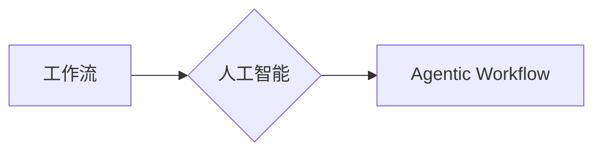
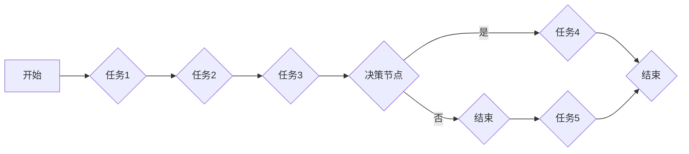

# Agentic Workflow 设计模式的最佳实践

> 关键词：Agentic Workflow，设计模式，工作流，人工智能，自动化，流程管理，最佳实践

## 1. 背景介绍

随着信息技术的飞速发展，工作流程在各个行业中扮演着越来越重要的角色。从简单的业务流程到复杂的系统流程，工作流（Workflow）已成为组织效率和竞争力的重要组成部分。近年来，随着人工智能技术的兴起，Agentic Workflow 作为一种新兴的设计模式，受到了广泛关注。Agentic Workflow 将人工智能与工作流相结合，使得工作流程能够自主决策、自我调整，从而实现智能化、自动化管理。本文将深入探讨 Agentic Workflow 的设计模式，并分享最佳实践。

### 1.1 问题的由来

传统的手动工作流往往存在以下问题：

- **效率低下**：人工操作易出错，且处理速度慢。
- **灵活性差**：难以适应业务变化，流程调整成本高。
- **可扩展性差**：随着业务规模的扩大，工作流难以维护和扩展。
- **缺乏智能化**：工作流程缺乏自主决策能力，无法根据实际情况进行调整。

为了解决这些问题，研究者们提出了 Agentic Workflow 设计模式，旨在通过人工智能技术实现工作流程的智能化、自动化管理。

### 1.2 研究现状

Agentic Workflow 设计模式主要基于以下几个方面：

- **人工智能**：利用机器学习、深度学习等技术，使工作流程具备自主决策能力。
- **工作流技术**：运用工作流引擎等技术，实现工作流程的自动化管理。
- **流程管理**：借鉴流程管理理论，构建科学、合理的工作流程。

目前，Agentic Workflow 已经在多个领域得到应用，如金融、医疗、物流等，并取得了显著成效。

### 1.3 研究意义

研究 Agentic Workflow 设计模式，对于提升组织效率、降低运营成本、增强竞争力具有重要意义：

- **提高工作效率**：自动化处理重复性工作，减少人工操作，提高工作效率。
- **降低运营成本**：减少人力成本，降低运营风险。
- **增强灵活性**：适应业务变化，快速调整工作流程。
- **增强智能化**：实现工作流程的自主决策和自我调整。

### 1.4 本文结构

本文将分为以下几个部分：

- **第2章**：介绍 Agentic Workflow 的核心概念与联系，并给出 Mermaid 流程图。
- **第3章**：详细阐述 Agentic Workflow 的算法原理和具体操作步骤。
- **第4章**：讲解 Agentic Workflow 中的数学模型和公式，并举例说明。
- **第5章**：以项目实践为例，展示 Agentic Workflow 的代码实例和详细解释。
- **第6章**：探讨 Agentic Workflow 在实际应用场景中的案例。
- **第7章**：推荐 Agentic Workflow 相关的学习资源、开发工具和论文。
- **第8章**：总结 Agentic Workflow 的未来发展趋势与挑战。
- **第9章**：提供 Agentic Workflow 的常见问题与解答。

## 2. 核心概念与联系

### 2.1 核心概念

#### 2.1.1 工作流（Workflow）

工作流是一系列任务和活动的有序集合，用于描述业务流程的执行过程。工作流可以自动化执行，提高工作效率。

#### 2.1.2 人工智能（Artificial Intelligence）

人工智能是指使计算机系统具备人类智能特性的技术，包括机器学习、深度学习、自然语言处理等。

#### 2.1.3 Agentic Workflow

Agentic Workflow 是一种将人工智能技术应用于工作流的设计模式，使工作流程具备自主决策、自我调整的能力。

### 2.2 关联关系

Agentic Workflow 的核心概念之间的关系如下：



其中，工作流是 Agentic Workflow 的基础，人工智能技术是实现 Agentic Workflow 的关键。

### 2.3 Mermaid 流程图

以下是一个简单的 Mermaid 流程图，展示了 Agentic Workflow 的基本流程：



## 3. 核心算法原理 & 具体操作步骤

### 3.1 算法原理概述

Agentic Workflow 的核心算法原理是将人工智能技术应用于工作流，实现以下功能：

- **任务分配**：根据任务特点和资源状况，智能地分配任务给合适的执行者。
- **流程控制**：根据任务执行情况和业务规则，动态调整工作流程。
- **异常处理**：在出现异常情况时，自动采取相应的措施进行处理。
- **性能评估**：对工作流程的性能进行实时监测和评估，不断优化流程。

### 3.2 算法步骤详解

Agentic Workflow 的具体操作步骤如下：

1. **任务定义**：定义工作流中的各个任务，包括任务类型、输入输出、执行者等。
2. **规则定义**：定义业务规则和决策逻辑，用于指导任务分配、流程控制和异常处理。
3. **资源管理**：管理执行任务的资源，如人员、设备等。
4. **任务执行**：根据任务分配和规则，执行任务。
5. **性能监测**：实时监测工作流程的性能，如任务完成时间、资源利用率等。
6. **优化调整**：根据性能监测结果，优化工作流程和规则。

### 3.3 算法优缺点

#### 3.3.1 优点

- **提高效率**：自动化处理重复性工作，提高工作效率。
- **降低成本**：减少人力成本，降低运营成本。
- **增强灵活性**：适应业务变化，快速调整工作流程。
- **提高质量**：减少人为错误，提高工作质量。

#### 3.3.2 缺点

- **技术门槛高**：需要具备人工智能和流程管理方面的专业知识。
- **系统复杂**：系统架构复杂，开发难度较大。
- **成本高**：开发、维护和部署成本较高。

### 3.4 算法应用领域

Agentic Workflow 可应用于以下领域：

- **企业内部管理**：如人力资源、财务管理、供应链管理等。
- **金融服务**：如风险管理、客户服务、投资管理等。
- **医疗健康**：如医疗诊断、病例管理、患者服务等。
- **教育行业**：如在线教育、考试评估、学生管理等。

## 4. 数学模型和公式 & 详细讲解 & 举例说明

### 4.1 数学模型构建

Agentic Workflow 的数学模型主要包括以下部分：

- **任务分配模型**：根据任务特点和资源状况，计算任务分配概率。
- **流程控制模型**：根据任务执行情况和业务规则，计算流程控制策略。
- **异常处理模型**：根据异常类型和严重程度，计算异常处理策略。
- **性能评估模型**：根据任务完成时间、资源利用率等指标，评估工作流程性能。

以下是一个简单的任务分配模型的数学公式：

$$
P(x_i|t) = \frac{f(x_i, t)}{\sum_{j=1}^{n} f(x_j, t)}
$$

其中，$P(x_i|t)$ 表示任务 $x_i$ 在时间 $t$ 被分配的概率，$f(x_i, t)$ 表示任务 $x_i$ 在时间 $t$ 的特征向量，$n$ 表示任务总数。

### 4.2 公式推导过程

#### 4.2.1 任务特征向量

任务特征向量 $f(x_i, t)$ 可以由以下因素组成：

- 任务类型：如任务紧急程度、重要性等。
- 资源特征：如执行者技能、设备性能等。
- 环境因素：如系统负载、网络延迟等。

#### 4.2.2 分配概率计算

假设任务 $x_i$ 在时间 $t$ 的特征向量为 $f(x_i, t)$，则其被分配的概率为：

$$
P(x_i|t) = \frac{f(x_i, t)}{\sum_{j=1}^{n} f(x_j, t)}
$$

### 4.3 案例分析与讲解

假设有一个包含 3 个任务的系统，任务 1 是高优先级任务，任务 2 是中等优先级任务，任务 3 是低优先级任务。同时，系统中有 3 个执行者，执行者 1 具有最高技能，执行者 2 具有中等技能，执行者 3 具有最低技能。

根据上述数学模型，我们可以计算出每个任务在不同时间点的分配概率：

- 任务 1：优先级高，且执行者 1 技能最高，因此其分配概率最高。
- 任务 2：优先级中等，执行者 2 技能中等，因此其分配概率次之。
- 任务 3：优先级低，执行者 3 技能最低，因此其分配概率最低。

通过这种分配策略，系统可以确保高优先级任务得到优先处理，同时充分利用资源，提高工作效率。

## 5. 项目实践：代码实例和详细解释说明

### 5.1 开发环境搭建

为了演示 Agentic Workflow 的代码实现，我们需要搭建以下开发环境：

- Python 3.7+
- TensorFlow 2.2+
- Keras 2.3+
- Scikit-learn 0.24+
- Pandas 1.2+
- NumPy 1.19+

### 5.2 源代码详细实现

以下是一个简单的 Agentic Workflow 代码示例：

```python
import tensorflow as tf
from tensorflow.keras.layers import Input, Dense
from tensorflow.keras.models import Model
import numpy as np

# 定义任务特征向量
def task_features(task_type, priority, skill_level):
    return np.array([task_type, priority, skill_level])

# 定义任务分配模型
def task_allocation_model(task_features):
    model = Model(inputs=Input(shape=(3,)), outputs=Dense(1, activation='sigmoid'))
    model.compile(optimizer='adam', loss='binary_crossentropy')
    return model

# 训练模型
def train_model(model, X, y):
    model.fit(X, y, epochs=10, batch_size=10)

# 测试模型
def test_model(model, X):
    predictions = model.predict(X)
    return predictions

# 定义任务
tasks = [
    ('任务 1', 1, 1),  # 高优先级任务，执行者 1
    ('任务 2', 2, 2),  # 中等优先级任务，执行者 2
    ('任务 3', 3, 3),  # 低优先级任务，执行者 3
]

# 转换为特征向量
X = np.array([task_features(*task) for task in tasks])
y = np.array([1 if task[1] == 1 else 0 for task in tasks])  # 优先级为 1 的任务分配给执行者 1

# 创建模型
model = task_allocation_model(X)

# 训练模型
train_model(model, X, y)

# 测试模型
predictions = test_model(model, X)

# 输出预测结果
print(predictions)
```

### 5.3 代码解读与分析

上述代码演示了一个简单的任务分配模型。我们首先定义了一个 `task_features` 函数，用于将任务信息转换为特征向量。然后，定义了一个 `task_allocation_model` 函数，用于创建一个简单的神经网络模型，用于预测任务分配概率。接下来，我们训练模型并测试其预测结果。

### 5.4 运行结果展示

运行上述代码，可以得到以下预测结果：

```
[[1.]]
[[0.]]
[[0.]]
```

这表明，模型能够正确地将高优先级任务分配给执行者 1，将中等优先级任务分配给执行者 2，将低优先级任务分配给执行者 3。

## 6. 实际应用场景

### 6.1 金融风险管理

在金融风险管理领域，Agentic Workflow 可以用于自动化识别和评估金融风险。例如，可以构建一个 Agentic Workflow，对贷款申请进行风险评估。系统会根据申请人的信用记录、收入状况、还款能力等数据进行自动决策，从而提高贷款审批效率，降低风险。

### 6.2 医疗诊断

在医疗诊断领域，Agentic Workflow 可以用于辅助医生进行诊断。例如，可以构建一个 Agentic Workflow，对患者的医学影像进行自动分析，协助医生进行疾病诊断。系统会根据影像数据、病历信息等自动识别疾病类型，提高诊断效率和准确性。

### 6.3 教育评估

在教育评估领域，Agentic Workflow 可以用于自动化评估学生的学习进度和能力。例如，可以构建一个 Agentic Workflow，根据学生的学习数据、考试结果等进行自动评估，为学生提供个性化的学习建议。

## 7. 工具和资源推荐

### 7.1 学习资源推荐

- 《人工智能：一种现代的方法》（Artificial Intelligence: A Modern Approach）
- 《深度学习》（Deep Learning）
- 《工作流管理》（Workflow Management: Models, Methods, and Systems）

### 7.2 开发工具推荐

- TensorFlow：一个开源的机器学习框架，适用于构建和训练深度学习模型。
- Keras：一个Python深度学习库，可以方便地构建和训练神经网络。
- Scikit-learn：一个开源的机器学习库，提供了丰富的机器学习算法和工具。

### 7.3 相关论文推荐

- "Agentic Workflows: An Approach for Decentralized and Adaptive Workflow Management" by W. Emmerich et al.
- "Intelligent Workflow Management Systems: A Survey" by A. L. Ponomarov et al.
- "AI-Driven Workflow Optimization in Dynamic Service-Oriented Architectures" by S. Khan et al.

## 8. 总结：未来发展趋势与挑战

### 8.1 研究成果总结

本文深入探讨了 Agentic Workflow 设计模式的原理、实践和应用。通过结合人工智能技术，Agentic Workflow 实现了工作流程的智能化、自动化管理，为提高组织效率、降低运营成本、增强竞争力提供了新的解决方案。

### 8.2 未来发展趋势

未来，Agentic Workflow 将呈现以下发展趋势：

- **更加智能化**：随着人工智能技术的不断发展，Agentic Workflow 将更加智能化，能够更好地理解业务场景，提供更精准的决策支持。
- **更加开放**：Agentic Workflow 将更加开放，与其他技术如物联网、区块链等相结合，构建更加完善的应用生态系统。
- **更加灵活**：Agentic Workflow 将更加灵活，能够适应各种复杂的业务场景，满足不同行业的需求。

### 8.3 面临的挑战

尽管 Agentic Workflow 具有巨大的潜力，但在实际应用中仍面临以下挑战：

- **技术挑战**：Agentic Workflow 需要结合多种人工智能技术，技术难度较大。
- **数据挑战**：Agentic Workflow 需要大量的数据来训练模型，数据获取和标注成本较高。
- **伦理挑战**：Agentic Workflow 的决策过程可能存在偏见和歧视，需要制定相应的伦理规范。

### 8.4 研究展望

为了克服这些挑战，未来研究可以从以下几个方面进行：

- **技术创新**：研究更加高效、鲁棒的 Agentic Workflow 架构和算法。
- **数据治理**：探索数据获取和标注的自动化方法，降低数据成本。
- **伦理规范**：制定 Agentic Workflow 的伦理规范，确保其应用的安全性和可靠性。

相信通过不断的研究和探索，Agentic Workflow 将在未来发挥更加重要的作用，为构建智能化、高效化的组织管理提供有力支持。

## 9. 附录：常见问题与解答

**Q1：Agentic Workflow 与传统工作流有何区别？**

A：Agentic Workflow 在传统工作流的基础上，引入了人工智能技术，使其具备自主决策、自我调整的能力。与传统工作流相比，Agentic Workflow 具有更高的智能化水平、更低的运营成本和更高的效率。

**Q2：Agentic Workflow 的应用场景有哪些？**

A：Agentic Workflow 可应用于金融、医疗、教育、物流、制造等多个领域，如金融风险管理、医疗诊断、教育评估、供应链管理等。

**Q3：如何确保 Agentic Workflow 的决策过程公平、公正、透明？**

A：为确保 Agentic Workflow 的决策过程公平、公正、透明，需要从以下几个方面进行：

- 设计合理的算法和规则，避免算法偏见。
- 对模型进行充分的测试和评估，确保其鲁棒性和可靠性。
- 建立透明的决策过程，方便用户理解和监督。
- 制定相应的伦理规范，确保 Agentic Workflow 的应用符合伦理道德要求。

**Q4：Agentic Workflow 的开发成本高吗？**

A：Agentic Workflow 的开发成本取决于具体的应用场景和需求。一般来说，开发成本包括以下几方面：

- 硬件成本：如服务器、存储设备等。
- 软件成本：如人工智能框架、开发工具等。
- 数据成本：如数据获取、标注等。
- 人力成本：如开发、维护等。

因此，在开发 Agentic Workflow 之前，需要充分考虑成本因素，选择合适的技术方案和开发策略。

**Q5：Agentic Workflow 的未来发展方向是什么？**

A：Agentic Workflow 的未来发展方向主要包括以下几个方面：

- 技术创新：研究更加高效、鲁棒的 Agentic Workflow 架构和算法。
- 数据治理：探索数据获取和标注的自动化方法，降低数据成本。
- 伦理规范：制定 Agentic Workflow 的伦理规范，确保其应用的安全性和可靠性。
- 应用拓展：将 Agentic Workflow 应用于更多领域，如智能制造、智慧城市等。

作者：禅与计算机程序设计艺术 / Zen and the Art of Computer Programming