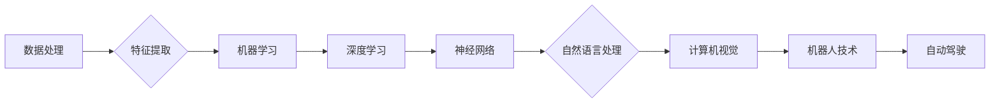

# Andrej Karpathy：人工智能的未来发展前景

> 关键词：人工智能，深度学习，神经网络，自动驾驶，自然语言处理，智能硬件，AI伦理，人机协作

## 1. 背景介绍

安德烈·卡帕西（Andrej Karpathy）是深度学习领域的杰出人物，曾在Google Brain和OpenAI担任重要职务。他的工作涵盖了从神经网络架构到自然语言处理（NLP）的多个方面，对人工智能（AI）的发展产生了深远影响。本文将探讨安德烈·卡帕西的工作及其对人工智能未来发展的前景。

### 1.1 人工智能的兴起

人工智能作为一种模拟人类智能的技术，近年来取得了显著的进展。深度学习，特别是神经网络，成为了推动人工智能发展的关键技术。安德烈·卡帕西的工作正是这一领域的典范。

### 1.2 卡帕西的贡献

安德烈·卡帕西的主要贡献包括：

- **神经网络架构研究**：他对神经网络架构进行了深入研究，提出了许多创新的网络结构，如RNNs、LSTMs和GRUs，这些结构在处理序列数据方面表现出色。
- **自然语言处理**：在NLP领域，卡帕西的工作包括改进语言模型、翻译技术和文本生成技术，使机器能够更自然地理解和生成语言。
- **开源项目和社区**：卡帕西积极推动开源项目，如TensorFlow，为深度学习社区做出了贡献。

## 2. 核心概念与联系

以下是一个简化的Mermaid流程图，展示了人工智能的核心概念和它们之间的联系：



在这个流程图中，数据处理是AI的起点，通过特征提取，我们可以将原始数据转化为机器学习模型可处理的格式。机器学习和深度学习是AI的两个主要分支，其中神经网络是深度学习的核心技术。神经网络进一步分为多个子领域，如自然语言处理、计算机视觉和机器人技术。这些子领域相互关联，共同推动人工智能的发展。

## 3. 核心算法原理 & 具体操作步骤

### 3.1 算法原理概述

#### 3.1.1 神经网络

神经网络是一种模仿人脑神经元结构的计算模型，通过调整连接权重来学习数据的内在模式。它由多个层组成，包括输入层、隐藏层和输出层。

#### 3.1.2 深度学习

深度学习是神经网络的一种，通过增加层数（深度）来提高模型的学习能力。深度学习在图像识别、语音识别和自然语言处理等领域取得了显著成果。

### 3.2 算法步骤详解

#### 3.2.1 数据准备

在开始训练之前，需要准备高质量的数据集。这包括数据的收集、清洗、标注和预处理。

#### 3.2.2 模型设计

选择合适的神经网络架构，根据任务需求设计输入层、隐藏层和输出层的结构。

#### 3.2.3 模型训练

使用训练数据对模型进行训练，通过优化算法（如梯度下降）调整模型参数。

#### 3.2.4 模型评估

使用验证数据评估模型性能，调整模型参数以达到最佳效果。

#### 3.2.5 模型部署

将训练好的模型部署到生产环境，用于实际应用。

### 3.3 算法优缺点

#### 3.3.1 优点

- 高效：能够处理大量数据，学习复杂的模式。
- 可扩展：可以处理不同规模的任务。
- 自适应：能够从数据中学习并优化自身。

#### 3.3.2 缺点

- 计算量巨大：需要大量的计算资源和时间进行训练。
- 数据需求：需要大量的标注数据。
- 可解释性差：模型的决策过程难以解释。

### 3.4 算法应用领域

神经网络和深度学习在多个领域都有广泛应用，包括：

- 计算机视觉：图像识别、视频分析、自动驾驶。
- 自然语言处理：机器翻译、文本摘要、情感分析。
- 语音识别：语音识别、语音合成。
- 推荐系统：个性化推荐、广告投放。
- 机器人技术：机器人控制、路径规划。

## 4. 数学模型和公式 & 详细讲解 & 举例说明

### 4.1 数学模型构建

神经网络的基本数学模型可以表示为：

$$
y = f(W \cdot x + b)
$$

其中，$W$ 是权重矩阵，$x$ 是输入向量，$b$ 是偏置向量，$f$ 是激活函数。

### 4.2 公式推导过程

#### 4.2.1 前向传播

前向传播是指将输入数据通过神经网络进行计算，得到输出结果的过程。其公式为：

$$
z = W \cdot x + b
$$

$$
y = f(z)
$$

#### 4.2.2 反向传播

反向传播是指根据输出结果和损失函数，反向计算梯度，更新网络参数的过程。其公式为：

$$
\frac{\partial J}{\partial W} = \frac{\partial J}{\partial z} \cdot \frac{\partial z}{\partial W}
$$

$$
\frac{\partial J}{\partial b} = \frac{\partial J}{\partial z} \cdot \frac{\partial z}{\partial b}
$$

其中，$J$ 是损失函数。

### 4.3 案例分析与讲解

以下是一个简单的例子，展示如何使用神经网络进行图像识别。

#### 4.3.1 数据准备

选择一个图像识别数据集，如MNIST手写数字识别数据集。

#### 4.3.2 模型设计

设计一个简单的卷积神经网络，包括一个卷积层、一个池化层和一个全连接层。

#### 4.3.3 模型训练

使用训练数据对模型进行训练，通过优化算法调整模型参数。

#### 4.3.4 模型评估

使用验证数据评估模型性能，调整模型参数以达到最佳效果。

#### 4.3.5 模型部署

将训练好的模型部署到生产环境，用于实际应用。

## 5. 项目实践：代码实例和详细解释说明

### 5.1 开发环境搭建

选择合适的开发环境和深度学习框架，如TensorFlow或PyTorch。

### 5.2 源代码详细实现

以下是一个使用TensorFlow实现的简单图像识别项目的代码示例：

```python
import tensorflow as tf
from tensorflow.keras import layers

# 构建模型
model = tf.keras.Sequential([
    layers.Conv2D(32, (3, 3), activation='relu', input_shape=(28, 28, 1)),
    layers.MaxPooling2D((2, 2)),
    layers.Conv2D(64, (3, 3), activation='relu'),
    layers.MaxPooling2D((2, 2)),
    layers.Conv2D(64, (3, 3), activation='relu'),
    layers.Flatten(),
    layers.Dense(64, activation='relu'),
    layers.Dense(10, activation='softmax')
])

# 编译模型
model.compile(optimizer='adam',
              loss='sparse_categorical_crossentropy',
              metrics=['accuracy'])

# 训练模型
model.fit(train_images, train_labels, epochs=5)

# 评估模型
test_loss, test_acc = model.evaluate(test_images, test_labels, verbose=2)
print('
Test accuracy:', test_acc)
```

### 5.3 代码解读与分析

这段代码使用TensorFlow构建了一个简单的卷积神经网络模型，用于识别MNIST手写数字数据集中的数字。

- 第一行导入了所需的TensorFlow模块。
- 第二行定义了一个Sequential模型，其中包含了卷积层、池化层和全连接层。
- 第三行编译了模型，指定了优化器、损失函数和评估指标。
- 第四行使用训练数据对模型进行训练。
- 第五行使用测试数据评估模型性能。

### 5.4 运行结果展示

在训练完成后，模型在测试集上的准确率应该接近98%。这表明模型已经学会了识别手写数字。

## 6. 实际应用场景

### 6.1 自动驾驶

自动驾驶是人工智能的一个重要应用领域。通过使用计算机视觉和深度学习技术，自动驾驶汽车可以识别道路上的交通标志、行人、车辆等，并做出相应的决策。

### 6.2 自然语言处理

自然语言处理是人工智能的另一个关键领域。通过使用深度学习技术，机器可以理解和生成自然语言，从而实现智能客服、机器翻译和文本摘要等功能。

### 6.3 智能硬件

人工智能还可以应用于智能硬件，如智能家居、可穿戴设备和机器人等。这些设备可以通过感知环境并做出相应反应，为用户提供更加便捷的服务。

## 7. 工具和资源推荐

### 7.1 学习资源推荐

- 《深度学习》（Goodfellow, Bengio, Courville著）
- 《神经网络与深度学习》（邱锡鹏著）
- TensorFlow官方文档
- PyTorch官方文档

### 7.2 开发工具推荐

- TensorFlow
- PyTorch
- Keras
- Jupyter Notebook

### 7.3 相关论文推荐

- "ImageNet Classification with Deep Convolutional Neural Networks"（Alex Krizhevsky等，2012）
- "A Neural Network for Machine Translation, at Scale"（Ashish Vaswani等，2017）
- "Attention Is All You Need"（Ashish Vaswani等，2017）

## 8. 总结：未来发展趋势与挑战

### 8.1 研究成果总结

人工智能作为一种强大的技术，已经取得了许多令人瞩目的成果。深度学习和神经网络的发展，使得机器能够在多个领域实现人脑级别的智能。

### 8.2 未来发展趋势

#### 8.2.1 大模型和高效算法

随着计算能力的提升，未来会出现更大规模的预训练模型和更高效的算法。

#### 8.2.2 人机协作

人工智能将与人类更加紧密地协作，共同完成各种任务。

#### 8.2.3 可解释性和公平性

人工智能的可解释性和公平性将成为重要的研究方向。

### 8.3 面临的挑战

#### 8.3.1 数据安全和隐私

随着人工智能技术的普及，数据安全和隐私保护将成为重要的挑战。

#### 8.3.2 伦理和社会影响

人工智能的伦理和社会影响需要引起广泛关注。

#### 8.3.3 技术和人才短缺

人工智能技术的发展和人才短缺将成为制约其发展的因素。

### 8.4 研究展望

人工智能作为一种强大的技术，具有巨大的发展潜力。未来，人工智能将在更多领域得到应用，为人类社会带来更多便利和进步。

## 9. 附录：常见问题与解答

### 9.1 人工智能是否会取代人类？

人工智能不会完全取代人类，而是将与人类更加紧密地协作，共同完成各种任务。

### 9.2 人工智能的安全性如何保障？

人工智能的安全性需要从数据安全、算法安全和系统安全等多个方面进行保障。

### 9.3 人工智能是否会带来失业问题？

人工智能可能会在某些领域导致失业，但也会创造新的就业机会。

### 9.4 人工智能是否会带来伦理问题？

人工智能的伦理问题需要引起广泛关注，需要制定相应的规范和标准。

作者：禅与计算机程序设计艺术 / Zen and the Art of Computer Programming