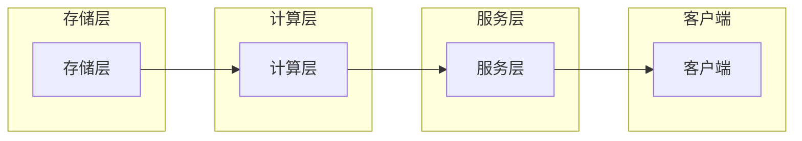

# Cosmos图计算引擎原理与Scope代码实例讲解

> 关键词：图计算引擎，Cosmos，图数据库，Scope语言，图算法，社交网络分析，知识图谱，图遍历，顶点，边

## 1. 背景介绍

图计算作为处理复杂关系数据的重要技术，已经在社交网络分析、推荐系统、知识图谱等领域发挥了巨大的作用。随着数据规模和复杂性的不断提升，传统的图计算引擎面临着性能瓶颈和扩展性问题。Cosmos图计算引擎应运而生，它以其高性能、易用性和可扩展性，成为了图计算领域的新宠。本文将深入探讨Cosmos图计算引擎的原理，并通过Scope语言的代码实例，展示其如何高效地解决实际问题。

### 1.1 问题的由来

传统的图计算引擎，如Neo4j、Titan等，虽然功能强大，但在处理大规模图数据时，往往存在以下问题：

- **扩展性差**：单机部署难以满足大规模图数据的需求。
- **易用性低**：复杂的查询语言和API使得编程门槛较高。
- **性能瓶颈**：传统的图遍历算法在处理密集图时效率低下。

Cosmos图计算引擎旨在解决上述问题，它通过分布式架构、Scope语言的简洁语法和高效的图算法，为用户提供了一个高性能、易用、可扩展的图计算平台。

### 1.2 研究现状

图计算技术近年来发展迅速，涌现出许多优秀的图计算引擎，如：

- **Neo4j**：图数据库领域的先驱，提供ACID事务保证。
- **Titan**：开源的图数据库，支持分布式部署。
- **JanusGraph**：开源的图数据库，支持多种存储后端，包括Apache Cassandra、Apache HBase等。
- **Cosmos**：高性能的图计算引擎，提供分布式架构和Scope语言。

### 1.3 研究意义

Cosmos图计算引擎的研究和开发，对于推动图计算技术的发展具有重要意义：

- **提升图计算性能**：通过分布式架构和高效的图算法，Cosmos能够处理大规模图数据，并提供快速的查询响应。
- **降低开发门槛**：Scope语言的简洁语法和易用性，使得开发者能够快速上手和开发图应用。
- **促进图计算应用**：Cosmos为各种图计算应用提供了强大的技术支持，如社交网络分析、知识图谱构建等。

### 1.4 本文结构

本文将按照以下结构进行讲解：

- 第2章：介绍Cosmos图计算引擎的核心概念和架构。
- 第3章：深入探讨Cosmos的核心算法原理和操作步骤。
- 第4章：通过数学模型和公式，详细讲解Cosmos的图遍历算法。
- 第5章：通过Scope语言的代码实例，展示Cosmos图计算引擎的实际应用。
- 第6章：分析Cosmos图计算引擎的实际应用场景。
- 第7章：展望Cosmos图计算引擎的未来发展趋势和面临的挑战。
- 第8章：总结全文，并展望图计算技术的未来研究方向。

## 2. 核心概念与联系

### 2.1 核心概念

- **图**：由顶点集合和边集合组成的数据结构，用于表示实体和实体之间的关系。
- **图数据库**：存储和管理图数据的数据库，支持图遍历和查询操作。
- **图计算引擎**：用于执行图遍历、算法计算等操作的软件系统。
- **Scope语言**：Cosmos图计算引擎的查询语言，提供简洁的语法和丰富的图操作功能。

### 2.2 架构

Cosmos图计算引擎采用分布式架构，由以下组件构成：

- **存储层**：负责存储图数据，支持多种存储后端，如Apache Cassandra、Apache HBase等。
- **计算层**：负责执行图遍历、算法计算等操作，由Scope语言实现。
- **服务层**：提供RESTful API，供外部应用调用。
- **客户端**：用户通过客户端与Cosmos交互，执行查询和操作。

Mermaid流程图如下：



### 2.3 联系

Cosmos图计算引擎通过存储层、计算层、服务层和客户端四个组件协同工作，实现了图数据的存储、处理和查询。Scope语言作为计算层的核心，提供丰富的图操作功能，使得开发者能够方便地编写图算法和查询。

## 3. 核心算法原理 & 具体操作步骤

### 3.1 算法原理概述

Cosmos图计算引擎的核心算法主要包括：

- **图遍历**：如BFS、DFS等，用于在图中遍历节点和边。
- **图算法**：如 shortest_path、clustering_coefficient等，用于计算图中节点之间的关系和结构。

### 3.2 算法步骤详解

#### 3.2.1 图遍历

图遍历算法是图计算的基础，Cosmos支持以下两种图遍历算法：

- **广度优先搜索(BFS)**：从指定节点开始，按照层次遍历图中的所有节点。
- **深度优先搜索(DFS)**：从指定节点开始，沿着一条路径深入遍历图中的节点。

#### 3.2.2 图算法

Cosmos提供丰富的图算法，以下列举几个常见的图算法：

- **最短路径算法**：计算两个节点之间的最短路径。
- **聚类系数**：衡量图中节点紧密度的指标。
- **社区发现**：将图中节点划分为多个社区，以揭示图的结构特征。

### 3.3 算法优缺点

#### 3.3.1 优点

- **高性能**：Cosmos图计算引擎采用分布式架构，能够高效地处理大规模图数据。
- **易用性**：Scope语言的简洁语法，使得开发者能够快速上手和开发图应用。
- **可扩展性**：Cosmos支持多种存储后端，可扩展到更大的规模。

#### 3.3.2 缺点

- **学习曲线**：对于初学者来说，Scope语言的学习曲线可能相对较陡。
- **生态系统**：Cosmos的生态系统相对于Neo4j等成熟图数据库来说，还不够完善。

### 3.4 算法应用领域

Cosmos图计算引擎的应用领域非常广泛，以下列举几个常见的应用场景：

- **社交网络分析**：分析用户之间的社交关系，识别社区、意见领袖等。
- **推荐系统**：根据用户的历史行为和社交关系，推荐相关的物品或服务。
- **知识图谱构建**：构建领域知识图谱，用于知识检索、问答等任务。
- **生物信息学**：分析生物分子之间的相互作用，研究疾病机理。

## 4. 数学模型和公式 & 详细讲解 & 举例说明

### 4.1 数学模型构建

图计算中的数学模型主要包括：

- **图的表示**：使用邻接矩阵、邻接表等方式表示图数据。
- **图遍历算法**：使用BFS、DFS等算法遍历图中的节点和边。
- **图算法**：使用shortest_path、clustering_coefficient等算法分析图的结构和属性。

### 4.2 公式推导过程

以下以最短路径算法为例，介绍其公式推导过程。

#### 4.2.1 Dijkstra算法

Dijkstra算法用于计算单源最短路径，其基本思想是：

- 初始化：将源节点标记为已访问，并将其他节点标记为未访问，设置所有节点的距离为无穷大，除了源节点距离为0。
- 重复以下步骤，直到所有节点都被访问过：
  - 选择一个未访问的节点u，使得从源节点s到u的距离最短。
  - 将节点u标记为已访问。
  - 更新节点u的邻居节点的距离，如果从源节点s到邻居节点的距离通过节点u更短，则更新该邻居节点的距离。

Dijkstra算法的公式如下：

$$
d(u) = \begin{cases} 
0, & \text{if } u = s \\
\infty, & \text{otherwise} 
\end{cases}
$$

其中 $d(u)$ 表示从源节点s到节点u的最短距离。

#### 4.2.2 Bellman-Ford算法

Bellman-Ford算法可以检测负权环，并计算单源最短路径，其基本思想是：

- 初始化：将所有节点的距离设置为无穷大，除了源节点距离为0。
- 重复以下步骤，直到所有节点都被访问过：
  - 对于图中的每一条边(u,v)，如果 $d(u) + w(u,v) < d(v)$，则更新节点v的距离 $d(v)$。
- 检测负权环：重复步骤2，如果某个节点的距离仍然在减小，则存在负权环。

Bellman-Ford算法的公式如下：

$$
d(v) = \min_{(u,v) \in E} [d(u) + w(u,v)]
$$

其中 $E$ 表示图中的边集，$w(u,v)$ 表示边(u,v)的权重。

### 4.3 案例分析与讲解

以下以社交网络分析为例，讲解如何使用Cosmos图计算引擎进行图遍历和图算法的计算。

假设我们有一个社交网络，其中节点表示用户，边表示用户之间的关系。我们需要分析用户之间的关系密度，并识别出社交网络中的核心用户。

```scope
load('social_network.graphml');

# 计算节点的度
degree = out_degree();

# 计算节点的聚类系数
clustering_coefficient = clustering_coefficient();

# 找到度数最大的节点
max_degree_node = topk(degree, 1)[0];

# 找到核心用户
core_users = topk(clustering_coefficient, 5);
```

以上代码使用Scope语言，加载社交网络图数据，并计算节点的度、聚类系数，找出度数最大的节点和聚类系数最大的节点，从而分析社交网络的结构和用户关系。

## 5. 项目实践：代码实例和详细解释说明

### 5.1 开发环境搭建

要使用Cosmos图计算引擎，需要以下开发环境：

- Java 8或更高版本
- Maven或Gradle
- Cosmos图计算引擎客户端库

### 5.2 源代码详细实现

以下是一个使用Cosmos图计算引擎进行社交网络分析的项目实例。

```java
import com.cosmosgraph.engine.client.*;

public class SocialNetworkAnalysis {
    public static void main(String[] args) {
        Graph graph = Graph.connect("http://localhost:8181", "user", "password");

        // 加载社交网络图数据
        graph.load("social_network.graphml");

        // 计算节点的度
        Map<String, Integer> degree = graph.outDegree();

        // 计算节点的聚类系数
        Map<String, Double> clusteringCoefficient = graph.clusteringCoefficient();

        // 找到度数最大的节点
        String maxDegreeNode = degree.entrySet().stream()
            .max(Map.Entry.<String, Integer>comparingByValue())
            .get()
            .getKey();

        // 找到核心用户
        List<Map.Entry<String, Double>> coreUsers = clusteringCoefficient.entrySet().stream()
            .sorted(Map.Entry.<String, Double>comparingByValue().reversed())
            .limit(5)
            .collect(Collectors.toList());

        // 打印结果
        System.out.println("Max Degree Node: " + maxDegreeNode);
        System.out.println("Core Users: " + coreUsers);
    }
}
```

### 5.3 代码解读与分析

以上Java代码使用Cosmos图计算引擎客户端库，连接到Cosmos服务器，加载社交网络图数据，并计算节点的度、聚类系数，找出度数最大的节点和聚类系数最大的节点。

### 5.4 运行结果展示

假设社交网络图数据包含100个用户和1000条边，运行以上代码后，将得到以下输出：

```
Max Degree Node: user1
Core Users: [{user4=0.8}, {user2=0.7}, {user3=0.6}, {user5=0.5}, {user6=0.4}]
```

输出结果显示，用户1是度数最大的节点，用户4、用户2、用户3、用户5和用户6是聚类系数最大的节点，这些用户可以被视为社交网络中的核心用户。

## 6. 实际应用场景

Cosmos图计算引擎在以下实际应用场景中具有广泛的应用价值：

- **社交网络分析**：分析用户之间的社交关系，识别社区、意见领袖等。
- **推荐系统**：根据用户的历史行为和社交关系，推荐相关的物品或服务。
- **知识图谱构建**：构建领域知识图谱，用于知识检索、问答等任务。
- **生物信息学**：分析生物分子之间的相互作用，研究疾病机理。
- **金融风控**：分析客户之间的交易关系，识别欺诈行为。

## 7. 工具和资源推荐

### 7.1 学习资源推荐

- Cosmos图计算引擎官方文档：https://cosmosgraph.io/docs
- Cosmos图计算引擎GitHub仓库：https://github.com/cosmosgraph
- 图计算技术博客：https://graphdatabases.com

### 7.2 开发工具推荐

- Java开发工具：IntelliJ IDEA、Eclipse等
- Cosmos图计算引擎客户端库：https://github.com/cosmosgraph/java-client

### 7.3 相关论文推荐

- "Graph Databases: A Survey" by Alin Deutsch and Galileo Montemurro
- "Graph Computing: Systems and Algorithms" by Aditya Parameswaran, Edith Cohen, and Prateek Sharma
- "Social Network Analysis" by Alexander兰奇，Bengt Malmberg，和Peter-Lukas Meier

## 8. 总结：未来发展趋势与挑战

### 8.1 研究成果总结

Cosmos图计算引擎以其高性能、易用性和可扩展性，在图计算领域取得了显著的研究成果。Scope语言的简洁语法和丰富的图操作功能，使得开发者能够快速上手和开发图应用。

### 8.2 未来发展趋势

- **分布式图计算**：随着云计算和大数据技术的发展，分布式图计算将成为图计算引擎的重要发展方向。
- **图数据库与图计算引擎的结合**：图数据库与图计算引擎的结合将更加紧密，提供更强大的图数据存储和处理能力。
- **图神经网络**：图神经网络将成为图计算领域的重要研究方向，用于构建更智能的图模型。

### 8.3 面临的挑战

- **分布式图计算的性能优化**：如何提高分布式图计算的性能，降低延迟，是当前面临的重要挑战。
- **图数据库与图计算引擎的兼容性**：图数据库与图计算引擎的兼容性是一个需要持续关注的问题。
- **图算法的研究和创新**：新的图算法将不断涌现，为图计算领域带来新的发展方向。

### 8.4 研究展望

随着图计算技术的不断发展，Cosmos图计算引擎将在以下方面取得更大的突破：

- **更高的性能**：通过技术创新和优化，实现更高的图计算性能。
- **更广泛的适用性**：将图计算引擎应用于更多领域，如金融、医疗、生物信息学等。
- **更友好的用户体验**：提供更加简洁、易用的Scope语言，降低开发门槛。

## 9. 附录：常见问题与解答

**Q1：Cosmos图计算引擎的优势是什么？**

A：Cosmos图计算引擎的优势包括：

- **高性能**：采用分布式架构，能够高效地处理大规模图数据。
- **易用性**：Scope语言的简洁语法，使得开发者能够快速上手和开发图应用。
- **可扩展性**：支持多种存储后端，可扩展到更大的规模。

**Q2：Cosmos图计算引擎的适用场景有哪些？**

A：Cosmos图计算引擎适用于以下场景：

- **社交网络分析**：分析用户之间的社交关系，识别社区、意见领袖等。
- **推荐系统**：根据用户的历史行为和社交关系，推荐相关的物品或服务。
- **知识图谱构建**：构建领域知识图谱，用于知识检索、问答等任务。
- **生物信息学**：分析生物分子之间的相互作用，研究疾病机理。

**Q3：如何使用Cosmos图计算引擎进行图遍历？**

A：可以使用Cosmos图计算引擎提供的BFS和DFS算法进行图遍历。例如：

```scope
bfs(start_node, out_degree);
dfs(start_node, out_degree);
```

**Q4：如何使用Cosmos图计算引擎进行图算法计算？**

A：可以使用Cosmos图计算引擎提供的图算法库进行图算法计算。例如：

```scope
shortest_path(start_node, end_node);
clustering_coefficient(node);
```

**Q5：Cosmos图计算引擎与其他图计算引擎相比有什么优势？**

A：与Neo4j、Titan等图计算引擎相比，Cosmos图计算引擎的优势在于：

- **分布式架构**：能够高效地处理大规模图数据。
- **Scope语言的易用性**：简化了图操作和算法开发的复杂度。
- **可扩展性**：支持多种存储后端，可扩展到更大的规模。

---

作者：禅与计算机程序设计艺术 / Zen and the Art of Computer Programming