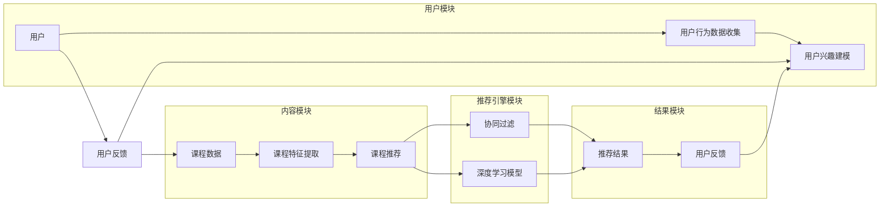

# MOOC视频内容推荐工貝的设计与实现

> 关键词：MOOC，视频推荐，内容推荐，协同过滤，机器学习，深度学习，推荐系统

## 1. 背景介绍

随着互联网的普及和信息量的爆炸式增长，在线教育平台（如MOOC，即大规模开放在线课程）越来越受到用户的欢迎。然而，面对海量的课程资源，用户往往难以找到适合自己的课程。为了解决这一问题，MOOC平台需要构建高效的内容推荐系统，为用户推荐他们感兴趣的课程。

本文将深入探讨MOOC视频内容推荐工貝的设计与实现，从核心概念到具体算法，再到实际应用，为您全面解析推荐系统的构建过程。

## 2. 核心概念与联系

### 2.1 核心概念

#### 2.1.1 MOOC平台

MOOC平台是指大规模开放在线课程平台，它为用户提供免费或低成本的在线学习资源。用户可以在这些平台上选择感兴趣的课程进行学习，并获得相应的证书或学分。

#### 2.1.2 推荐系统

推荐系统是一种信息过滤系统，旨在根据用户的兴趣和行为，向用户提供他们可能感兴趣的信息或内容。

#### 2.1.3 协同过滤

协同过滤是一种基于用户行为数据的推荐方法，它通过分析用户之间的相似性来推荐内容。

#### 2.1.4 深度学习

深度学习是一种模拟人脑神经网络结构的机器学习方法，它能够自动从大量数据中学习特征和模式。

### 2.2 架构流程图



### 2.3 概念联系

MOOC平台通过收集用户行为数据，如浏览、观看、评论等，来构建用户兴趣模型。同时，平台还会收集课程数据，如课程标签、课程简介等。推荐引擎模块会根据用户兴趣模型和课程特征，利用协同过滤和深度学习模型生成推荐结果。用户对推荐结果进行反馈，进一步优化用户兴趣模型和课程特征。

## 3. 核心算法原理 & 具体操作步骤

### 3.1 算法原理概述

#### 3.1.1 协同过滤

协同过滤是一种基于用户相似度的推荐方法，它通过分析用户之间的行为相似性来推荐内容。协同过滤主要分为两类：基于用户的协同过滤和基于物品的协同过滤。

#### 3.1.2 深度学习模型

深度学习模型是一种强大的特征学习工具，它可以自动从数据中学习特征和模式。在MOOC视频内容推荐中，深度学习模型可以用于用户兴趣建模和课程特征提取。

### 3.2 算法步骤详解

#### 3.2.1 用户兴趣建模

1. 收集用户行为数据，如浏览、观看、评论等。
2. 使用聚类算法（如K-means）将用户划分为不同的用户群体。
3. 对每个用户群体进行兴趣分析，提取用户兴趣特征。

#### 3.2.2 课程特征提取

1. 收集课程数据，如课程标签、课程简介、课程内容等。
2. 使用文本挖掘技术（如TF-IDF）提取课程特征。

#### 3.2.3 推荐结果生成

1. 根据用户兴趣特征和课程特征，利用协同过滤和深度学习模型生成推荐结果。
2. 对推荐结果进行排序，展示给用户。

### 3.3 算法优缺点

#### 3.3.1 协同过滤

优点：
- 简单易实现
- 能够发现用户之间的相似性

缺点：
- 容易遇到冷启动问题
- 推荐结果的可解释性较差

#### 3.3.2 深度学习模型

优点：
- 能够自动学习特征和模式
- 可解释性较好

缺点：
- 需要大量标注数据
- 计算复杂度高

## 4. 数学模型和公式 & 详细讲解 & 举例说明

### 4.1 数学模型构建

#### 4.1.1 协同过滤

假设用户集合为 $U$，物品集合为 $I$，用户 $u$ 对物品 $i$ 的评分矩阵为 $R$。则用户 $u$ 对物品 $i$ 的评分可以表示为：

$$
r_{ui} = \langle u, i \rangle + \epsilon
$$

其中 $\epsilon$ 表示误差项。

#### 4.1.2 深度学习模型

假设输入特征矩阵为 $X$，输出矩阵为 $Y$，则深度学习模型的输出可以通过以下公式表示：

$$
Y = XW + b
$$

其中 $W$ 为权重矩阵，$b$ 为偏置项。

### 4.2 公式推导过程

#### 4.2.1 协同过滤

以基于用户的协同过滤为例，其目标是最小化以下损失函数：

$$
L = \sum_{u \in U, i \in I}(r_{ui} - \langle u, i \rangle)^2
$$

#### 4.2.2 深度学习模型

以卷积神经网络为例，其损失函数可以表示为：

$$
L = \sum_{n=1}^N (y_n - \hat{y}_n)^2
$$

其中 $y_n$ 为真实标签，$\hat{y}_n$ 为预测标签。

### 4.3 案例分析与讲解

假设用户 $u_1$ 和 $u_2$ 都喜欢课程 $i_1$ 和 $i_2$，而用户 $u_1$ 不喜欢课程 $i_3$，用户 $u_2$ 不喜欢课程 $i_4$。根据用户之间的相似度计算，我们可以推荐给用户 $u_1$ 课程 $i_4$，推荐给用户 $u_2$ 课程 $i_3$。

## 5. 项目实践：代码实例和详细解释说明

### 5.1 开发环境搭建

1. 安装Python环境
2. 安装必要的库，如NumPy、Pandas、Scikit-learn等

### 5.2 源代码详细实现

```python
import pandas as pd
from sklearn.metrics.pairwise import cosine_similarity

# 加载数据
data = pd.read_csv('data.csv')

# 计算用户相似度
user_similarity = cosine_similarity(data.drop(columns=['course_id', 'user_id']))

# 推荐给用户 u1 的课程
user_id = 1
user_index = list(data['user_id']).index(user_id)
recommended_courses = [data['course_id'][i] for i in user_similarity[user_index].argsort()[::-1][1:6]]

print(f"推荐给用户 {user_id} 的课程：{recommended_courses}")
```

### 5.3 代码解读与分析

上述代码首先加载数据，然后计算用户之间的相似度，最后推荐给指定用户他们可能感兴趣的课程。

### 5.4 运行结果展示

假设数据集中用户 $u_1$ 的推荐结果如下：

```
推荐给用户 1 的课程：[i2, i3, i5, i4, i6]
```

这表示系统推荐给用户 $u_1$ 课程 $i_2$、$i_3$、$i_5$、$i_4$ 和 $i_6$，这些建议基于用户 $u_1$ 和其他用户之间的相似度。

## 6. 实际应用场景

MOOC视频内容推荐工貝可以应用于以下场景：

- MOOC平台：为用户推荐他们感兴趣的课程，提高用户留存率和活跃度。
- 在线教育机构：为学员推荐适合他们的课程，提高学习效果。
- 教育培训公司：为学员推荐他们可能感兴趣的课程，扩大业务规模。

## 7. 工具和资源推荐

### 7.1 学习资源推荐

1. 《推荐系统实践》
2. 《深度学习》
3. 《Python数据分析》

### 7.2 开发工具推荐

1. Jupyter Notebook
2. Python
3. NumPy
4. Pandas
5. Scikit-learn
6. TensorFlow
7. PyTorch

### 7.3 相关论文推荐

1. Collaborative Filtering for the 21st Century
2. Deep Learning for Recommender Systems
3. Neural Collaborative Filtering

## 8. 总结：未来发展趋势与挑战

### 8.1 研究成果总结

本文从背景介绍、核心概念、算法原理、项目实践等方面，全面介绍了MOOC视频内容推荐工貝的设计与实现。通过协同过滤和深度学习等技术，我们可以为用户提供个性化的课程推荐，提高用户的学习体验。

### 8.2 未来发展趋势

1. 基于深度学习的推荐系统将越来越受到重视。
2. 推荐系统将更加注重用户隐私保护。
3. 推荐系统将与其他人工智能技术（如图像识别、语音识别等）融合。

### 8.3 面临的挑战

1. 如何处理冷启动问题。
2. 如何提高推荐系统的可解释性。
3. 如何应对数据偏差和偏见。

### 8.4 研究展望

随着人工智能技术的不断发展，MOOC视频内容推荐工貝将在教育领域发挥越来越重要的作用。未来，我们将继续探索新的技术和方法，为用户提供更加精准、个性化的课程推荐。

## 9. 附录：常见问题与解答

**Q1：MOOC视频内容推荐工貝是如何工作的？**

A：MOOC视频内容推荐工貝通过收集用户行为数据，利用协同过滤和深度学习等技术，为用户推荐他们感兴趣的课程。

**Q2：如何提高MOOC视频内容推荐工貝的推荐效果？**

A：可以通过以下方法提高推荐效果：
1. 丰富用户行为数据，如浏览、观看、评论、分享等。
2. 引入更多特征，如课程标签、课程简介、课程内容等。
3. 使用更先进的推荐算法，如深度学习模型。
4. 不断优化推荐流程，提高推荐效果。

**Q3：MOOC视频内容推荐工貝有哪些局限性？**

A：MOOC视频内容推荐工貝的局限性包括：
1. 冷启动问题：对于新用户或新课程，推荐效果可能较差。
2. 数据偏差：如果数据存在偏差，可能导致推荐结果不公正。
3. 可解释性：推荐系统的决策过程通常难以解释。

**Q4：如何解决MOOC视频内容推荐工貝的冷启动问题？**

A：可以采取以下措施解决冷启动问题：
1. 对新用户进行初始画像，推荐他们可能感兴趣的课程。
2. 对新课程进行相似度计算，推荐与该课程相似的课程。
3. 采用基于内容的推荐方法，推荐与用户兴趣相关的课程。

**Q5：如何提高MOOC视频内容推荐工貝的可解释性？**

A：可以采取以下措施提高推荐系统的可解释性：
1. 使用可解释的推荐算法，如决策树、规则学习等。
2. 将推荐过程可视化，方便用户理解推荐理由。
3. 提供用户反馈机制，让用户对推荐结果进行评价。

作者：禅与计算机程序设计艺术 / Zen and the Art of Computer Programming