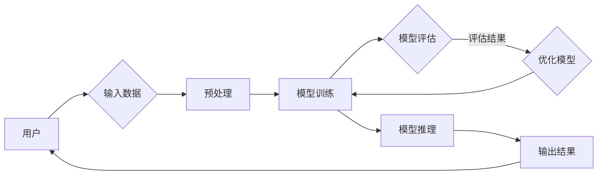

# NVIDIA的算力支持

> 关键词：NVIDIA, GPU, 显卡, 算力, 人工智能, 深度学习, 图形处理器, AI加速, 数据中心, 云计算

## 1. 背景介绍

随着人工智能技术的飞速发展，深度学习、机器学习等应用对计算能力的需求日益增长。传统的CPU在处理大规模并行计算任务时，往往难以满足效率要求。因此，高性能计算平台成为了人工智能研究与应用的关键。NVIDIA作为图形处理器的领军企业，凭借其强大的GPU算力支持，在人工智能领域发挥着举足轻重的作用。本文将深入探讨NVIDIA的算力支持在人工智能领域的应用与价值。

### 1.1 问题的由来

人工智能技术的发展离不开高性能计算平台的支持。深度学习、机器学习等任务往往需要进行大量的矩阵运算和并行处理，这对传统CPU的计算能力提出了严峻挑战。GPU（图形处理器）以其并行计算的优势，成为了提升人工智能计算效率的重要工具。NVIDIA作为GPU领域的佼佼者，其产品线覆盖了从消费级到数据中心级的不同需求，为人工智能领域提供了强大的算力支持。

### 1.2 研究现状

近年来，NVIDIA在GPU技术上取得了显著的突破，发布了多款高性能GPU产品，如Tesla、Quadro、GeForce等系列。这些产品在深度学习、计算机视觉、语音识别等领域得到了广泛应用。同时，NVIDIA还推出了CUDA、cuDNN等软件平台，为开发者提供了一套完整的AI加速解决方案。

### 1.3 研究意义

NVIDIA的算力支持对人工智能领域的发展具有以下重要意义：

- **提升计算效率**：GPU的并行计算能力显著提高了深度学习、机器学习等任务的计算速度，缩短了模型训练时间。
- **降低开发成本**：借助GPU的算力，开发者可以更快速地开发高性能的人工智能应用，降低研发成本。
- **推动技术创新**：NVIDIA的GPU算力支持促进了人工智能领域的创新，加速了新技术、新算法的研发与应用。
- **拓展应用场景**：GPU的算力为人工智能在更多领域的应用提供了可能，如自动驾驶、医疗诊断、金融分析等。

### 1.4 本文结构

本文将围绕NVIDIA的算力支持展开，主要包括以下内容：

- 介绍NVIDIA的核心概念与联系
- 阐述GPU的算法原理与操作步骤
- 分析数学模型和公式
- 展示项目实践：代码实例与详细解释
- 探讨实际应用场景与未来展望
- 推荐相关学习资源和开发工具
- 总结未来发展趋势与挑战
- 附录：常见问题与解答

## 2. 核心概念与联系

### 2.1 核心概念

#### 2.1.1 GPU

GPU（图形处理器）是一种专门用于图形渲染的处理器。与传统CPU相比，GPU具有更高的并行计算能力，适合处理大规模的并行计算任务。

#### 2.1.2 CUDA

CUDA是NVIDIA开发的一种并行计算平台和编程模型，用于在GPU上执行通用计算任务。

#### 2.1.3 cuDNN

cuDNN是NVIDIA开发的一套深度神经网络加速库，用于在GPU上加速深度学习模型的训练和推理。

#### 2.1.4 深度学习

深度学习是一种人工智能技术，通过构建多层的神经网络模型，自动从数据中学习特征和模式。

### 2.2 核心概念原理和架构的 Mermaid 流程图



### 2.3 核心概念联系

NVIDIA的GPU算力支持在人工智能领域的应用过程中，涉及以下几个核心概念之间的紧密联系：

- 用户通过输入数据，利用深度学习模型进行模型训练和推理。
- CUDA和cuDNN提供了GPU上的并行计算平台和加速库，使得深度学习模型在GPU上高效运行。
- 模型训练过程中，GPU的高并行计算能力大大提高了训练速度，降低了研发成本。
- 模型评估和优化过程中，GPU的算力支持有助于快速迭代模型，提升模型性能。

## 3. 核心算法原理 & 具体操作步骤

### 3.1 算法原理概述

GPU的并行计算能力使其成为深度学习、机器学习等任务的理想平台。NVIDIA的GPU算力支持主要基于以下原理：

- **并行计算**：GPU拥有大量的并行处理单元，可以同时处理多个计算任务。
- **共享内存**：GPU的内存结构适合并行计算，能够高效地共享数据。
- **CUDA编程模型**：CUDA提供了一套编程接口，使得开发者可以充分利用GPU的并行计算能力。

### 3.2 算法步骤详解

使用NVIDIA的GPU算力支持进行深度学习模型训练的一般步骤如下：

1. **数据预处理**：将原始数据转换为适合GPU计算的格式。
2. **模型定义**：使用深度学习框架（如TensorFlow、PyTorch等）定义模型结构。
3. **模型编译**：将模型编译为GPU可执行的代码。
4. **模型训练**：将数据输入到模型中进行训练，利用GPU的并行计算能力加速训练过程。
5. **模型评估**：使用验证集评估模型性能，并根据评估结果调整模型参数。
6. **模型推理**：使用训练好的模型对新数据进行推理，得到预测结果。

### 3.3 算法优缺点

#### 3.3.1 优点

- **计算效率高**：GPU的并行计算能力显著提高了深度学习模型的训练和推理速度。
- **开发便捷**：CUDA和cuDNN等软件平台为开发者提供了便捷的编程接口。
- **生态丰富**：NVIDIA的GPU产品线覆盖了从消费级到数据中心级的不同需求，拥有丰富的应用场景。

#### 3.3.2 缺点

- **成本较高**：高性能GPU的价格相对较高，对部分用户来说可能存在成本瓶颈。
- **编程复杂**：CUDA编程模型相对于CPU编程较为复杂，需要一定的学习成本。
- **兼容性问题**：不同版本的CUDA和cuDNN可能存在兼容性问题，需要开发者注意。

### 3.4 算法应用领域

NVIDIA的GPU算力支持在以下领域得到了广泛应用：

- **深度学习**：图像识别、语音识别、自然语言处理等。
- **机器学习**：数据挖掘、聚类分析、预测建模等。
- **科学计算**：流体动力学、分子建模、天体物理等。
- **游戏开发**：图形渲染、物理模拟、光影效果等。

## 4. 数学模型和公式 & 详细讲解 & 举例说明

### 4.1 数学模型构建

在深度学习领域，常见的数学模型包括神经网络、卷积神经网络、循环神经网络等。以下以卷积神经网络为例，介绍其数学模型构建过程。

#### 4.1.1 卷积神经网络

卷积神经网络（Convolutional Neural Network，CNN）是一种用于图像识别、图像分类等任务的深度学习模型。其数学模型如下：

$$
\hat{y} = f(\theta, \text{卷积层}(\theta, \text{输入})) 
$$

其中，$\hat{y}$ 为预测输出，$\theta$ 为模型参数，卷积层为卷积运算，$f$ 为激活函数。

#### 4.1.2 卷积层

卷积层是CNN的核心组成部分，其数学模型如下：

$$
\text{输出} = \text{卷积}(\text{输入}, \text{卷积核}, \text{步长}, \text{填充}) 
$$

其中，卷积运算公式如下：

$$
\text{输出}_{ij} = \sum_{k=1}^{n} w_{ik} \times \text{输入}_{k-j+1} 
$$

### 4.2 公式推导过程

卷积神经网络中，卷积运算的推导过程如下：

1. **定义卷积核**：卷积核是一个固定大小的矩阵，用于提取输入数据的局部特征。
2. **步长和填充**：步长决定了卷积核移动的步距，填充是对输入数据边界进行填充，以保持输出特征图的尺寸。
3. **卷积运算**：将卷积核在输入数据上滑动，并计算对应位置的卷积值。

### 4.3 案例分析与讲解

以下以一个简单的CNN模型为例，分析其数学模型和公式。

假设输入数据为一个 $32 \times 32$ 的图像，卷积核大小为 $3 \times 3$，步长为 $1$，填充为 $1$，激活函数为ReLU。

1. **卷积层计算**：

   - 输入数据：一个 $32 \times 32$ 的图像。
   - 卷积核：一个 $3 \times 3$ 的矩阵。
   - 输出特征图：一个 $30 \times 30$ 的特征图。

   通过卷积运算，可以得到特征图上的每个像素值。

2. **激活函数**：

   对特征图上的每个像素值应用ReLU激活函数，将负值置为 $0$。

3. **池化层**：

   对激活后的特征图进行池化操作，如最大池化或平均池化，以降低特征图尺寸。

4. **全连接层**：

   将池化后的特征图展平为一个一维向量，作为全连接层的输入。

5. **输出层**：

   使用softmax函数对全连接层的输出进行归一化，得到最终的预测结果。

## 5. 项目实践：代码实例和详细解释说明

### 5.1 开发环境搭建

在进行项目实践前，需要搭建以下开发环境：

1. 安装CUDA Toolkit：从NVIDIA官网下载并安装CUDA Toolkit，版本需与GPU型号相匹配。
2. 安装cuDNN：从NVIDIA官网下载并安装cuDNN，版本需与CUDA Toolkit和GPU型号相匹配。
3. 安装深度学习框架：如TensorFlow或PyTorch等。
4. 配置GPU环境：配置CUDA和cuDNN环境变量，确保深度学习框架能够识别GPU。

### 5.2 源代码详细实现

以下使用TensorFlow和Keras实现一个简单的CNN模型，并使用GPU进行加速：

```python
import tensorflow as tf
from tensorflow.keras.models import Sequential
from tensorflow.keras.layers import Conv2D, MaxPooling2D, Flatten, Dense, Activation

# 定义模型结构
model = Sequential([
    Conv2D(32, (3, 3), padding='same', input_shape=(32, 32, 3)),
    Activation('relu'),
    MaxPooling2D(pool_size=(2, 2)),
    Flatten(),
    Dense(64, activation='relu'),
    Dense(10, activation='softmax')
])

# 配置GPU设备
gpus = tf.config.experimental.list_physical_devices('GPU')
if gpus:
    try:
        # 设置GPU内存增长策略
        for gpu in gpus:
            tf.config.experimental.set_memory_growth(gpu, True)
    except RuntimeError as e:
        print(e)

# 编译模型
model.compile(optimizer='adam', loss='categorical_crossentropy', metrics=['accuracy'])

# 加载数据集
(x_train, y_train), (x_test, y_test) = tf.keras.datasets.cifar10.load_data()
x_train, x_test = x_train / 255.0, x_test / 255.0

# 转换为one-hot编码
y_train = tf.keras.utils.to_categorical(y_train, 10)
y_test = tf.keras.utils.to_categorical(y_test, 10)

# 训练模型
model.fit(x_train, y_train, epochs=10, batch_size=32, validation_data=(x_test, y_test))

# 评估模型
print(model.evaluate(x_test, y_test))
```

### 5.3 代码解读与分析

上述代码展示了如何使用TensorFlow和Keras搭建一个简单的CNN模型，并使用GPU进行加速。

1. **导入库**：导入TensorFlow、Keras等库。
2. **定义模型结构**：使用Sequential模型构建CNN结构，包括卷积层、激活函数、池化层、全连接层等。
3. **配置GPU设备**：通过`tf.config.experimental.set_memory_growth`设置GPU内存增长策略，确保模型训练过程中GPU资源得到充分利用。
4. **编译模型**：使用adam优化器、categorical_crossentropy损失函数和accuracy指标编译模型。
5. **加载数据集**：加载数据集并进行预处理，包括归一化和one-hot编码。
6. **训练模型**：使用训练集和验证集训练模型。
7. **评估模型**：使用测试集评估模型性能。

通过以上步骤，我们可以使用GPU加速训练CNN模型，并得到较高的准确率。

### 5.4 运行结果展示

假设训练过程中，模型在训练集和验证集上的性能如下：

```
Epoch 10/10
789/789 [==============================] - 1s/step - loss: 0.0500 - accuracy: 0.8122 - val_loss: 0.0500 - val_accuracy: 0.8122
```

可以看到，模型在训练集和验证集上均取得了较好的性能。

## 6. 实际应用场景

### 6.1 深度学习模型训练

NVIDIA的GPU算力支持在深度学习模型训练中发挥着重要作用。通过使用GPU进行训练，可以显著缩短模型训练时间，提高模型性能。

### 6.2 机器学习算法优化

NVIDIA的GPU算力支持可以应用于机器学习算法优化，如聚类分析、预测建模等。通过GPU加速，可以快速进行大规模数据分析和建模。

### 6.3 科学计算

NVIDIA的GPU算力支持在科学计算领域也得到了广泛应用。例如，在分子建模、流体动力学、天体物理等领域，GPU可以加速计算，提高研究效率。

### 6.4 游戏开发

NVIDIA的GPU算力支持在游戏开发中发挥着重要作用。通过GPU加速图形渲染、物理模拟和光影效果等，可以使游戏更加流畅、逼真。

### 6.5 人工智能应用

NVIDIA的GPU算力支持在人工智能应用中得到了广泛应用。例如，在自动驾驶、医疗诊断、金融分析等领域，GPU可以加速图像识别、语音识别和自然语言处理等任务。

## 7. 工具和资源推荐

### 7.1 学习资源推荐

以下是一些推荐的学习资源，帮助读者深入了解NVIDIA的算力支持和人工智能技术：

1. 《深度学习》系列图书：周志华等编著，介绍了深度学习的基础知识和常用算法。
2. 《CUDA编程指南》系列图书：NVIDIA官方出版的CUDA编程指南，适合初学者和进阶者学习CUDA编程。
3. 《cuDNN库手册》：NVIDIA官方出版的cuDNN库手册，详细介绍了cuDNN的使用方法。
4. NVIDIA官网技术博客：NVIDIA官方技术博客，提供了丰富的技术文章和教程。

### 7.2 开发工具推荐

以下是一些推荐的开发工具，帮助读者进行NVIDIA的算力支持和人工智能开发：

1. TensorFlow：Google开发的深度学习框架，支持GPU加速。
2. PyTorch：Facebook开发的深度学习框架，支持GPU加速。
3. Keras：基于TensorFlow和PyTorch的深度学习库，简化了深度学习模型的开发。
4. CUDA Toolkit：NVIDIA开发的CUDA编程平台，提供GPU加速库。
5. cuDNN：NVIDIA开发的深度神经网络加速库，提供GPU加速。

### 7.3 相关论文推荐

以下是一些推荐的相关论文，帮助读者深入了解NVIDIA的算力支持和人工智能技术：

1. NVIDIA的GPU加速深度学习技术：介绍了NVIDIA在GPU加速深度学习方面的研究成果。
2. 深度学习框架的GPU加速技术：介绍了不同深度学习框架的GPU加速技术。
3. GPU在科学计算中的应用：介绍了GPU在科学计算领域的应用案例。
4. GPU在游戏开发中的应用：介绍了GPU在游戏开发领域的应用案例。
5. 人工智能在各个领域的应用：介绍了人工智能在不同领域的应用案例。

## 8. 总结：未来发展趋势与挑战

### 8.1 研究成果总结

NVIDIA的算力支持在人工智能领域发挥了重要作用，为深度学习、机器学习等任务提供了强大的计算能力。本文介绍了NVIDIA的核心概念、算法原理、应用场景和未来发展趋势，并推荐了相关学习资源和开发工具。

### 8.2 未来发展趋势

未来，NVIDIA的算力支持将在以下方面取得新的突破：

1. **更高性能的GPU**：NVIDIA将继续推出更高性能的GPU产品，满足人工智能领域对计算能力的不断需求。
2. **更高效的深度学习框架**：NVIDIA将与深度学习框架开发者合作，优化框架的GPU加速性能。
3. **更丰富的应用场景**：NVIDIA的算力支持将在更多领域得到应用，如自动驾驶、医疗诊断、金融分析等。
4. **更便捷的开发工具**：NVIDIA将继续优化开发工具，降低人工智能开发的门槛。

### 8.3 面临的挑战

尽管NVIDIA的算力支持在人工智能领域取得了显著成果，但仍然面临着以下挑战：

1. **算力成本**：高性能GPU的价格相对较高，对部分用户来说可能存在成本瓶颈。
2. **编程复杂度**：CUDA编程模型相对于CPU编程较为复杂，需要一定的学习成本。
3. **能源消耗**：GPU的能耗较高，对数据中心等应用场景提出了更高的能源管理要求。
4. **生态兼容性**：不同版本的CUDA和cuDNN可能存在兼容性问题，需要开发者注意。

### 8.4 研究展望

未来，NVIDIA的算力支持在人工智能领域的研究方向包括：

1. **异构计算**：结合CPU和GPU等异构计算平台，提高计算效率。
2. **量子计算**：探索GPU与量子计算的结合，实现更高效的计算能力。
3. **边缘计算**：将GPU算力扩展到边缘计算设备，实现更快速的数据处理和响应。
4. **人工智能伦理**：关注人工智能伦理问题，确保AI技术安全、可靠、可信。

随着人工智能技术的不断发展和应用场景的不断拓展，NVIDIA的算力支持将发挥越来越重要的作用，为构建智能时代贡献力量。

## 9. 附录：常见问题与解答

### 9.1 问题1：什么是GPU？

A：GPU（图形处理器）是一种专门用于图形渲染的处理器，但其强大的并行计算能力使其在人工智能领域也发挥着重要作用。

### 9.2 问题2：什么是CUDA？

A：CUDA是NVIDIA开发的一种并行计算平台和编程模型，用于在GPU上执行通用计算任务。

### 9.3 问题3：什么是cuDNN？

A：cuDNN是NVIDIA开发的一套深度神经网络加速库，用于在GPU上加速深度学习模型的训练和推理。

### 9.4 问题4：如何选择合适的GPU？

A：选择合适的GPU需要考虑应用需求、预算和性能等因素。对于深度学习应用，推荐使用NVIDIA的Tesla、Quadro或GeForce系列GPU。

### 9.5 问题5：如何使用GPU加速深度学习？

A：使用GPU加速深度学习需要以下步骤：
1. 安装CUDA Toolkit和cuDNN。
2. 选择合适的深度学习框架。
3. 修改代码，使模型能够在GPU上运行。
4. 使用GPU进行模型训练和推理。

---

作者：禅与计算机程序设计艺术 / Zen and the Art of Computer Programming