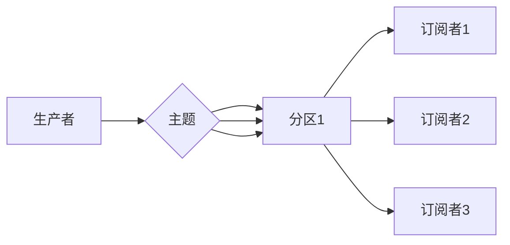

# Pulsar原理与代码实例讲解

> 关键词：Pulsar，分布式消息队列，Apache Pulsar，消息系统，流处理，微服务架构，API网关，分布式事务

## 1. 背景介绍

随着互联网和大数据技术的飞速发展，现代应用对数据处理的实时性和可靠性要求越来越高。消息队列作为一种重要的中间件技术，在解耦服务、异步通信、分布式系统等方面发挥着至关重要的作用。Apache Pulsar 是一个高性能、可扩展的分布式消息系统，它提供了多种消息传递模型，包括点对点（P2P）、发布-订阅（Pub-Sub）和流处理，是构建微服务架构的理想选择。

本文将深入讲解 Pulsar 的原理，并通过代码实例展示其使用方法，帮助读者全面理解 Pulsar 的核心特性和应用场景。

## 2. 核心概念与联系

### 2.1 核心概念

- **分布式消息队列**：允许多个生产者和消费者在分布式系统中进行高效的消息传递。
- **主题（Topic）**：Pulsar 中的消息分类方式，类似 Kafka 中的主题。
- **分区（Partition）**：主题内部的逻辑分区，用于并行处理和负载均衡。
- **订阅者（Subscriber）**：从消息队列中读取消息的消费者。
- **生产者（Producer）**：向消息队列发送消息的生产者。
- **消息（Message）**：由生产者发送的数据单元。
- **流处理（Stream Processing）**：对消息进行实时处理和分析。

### 2.2 架构图

以下是一个简单的 Mermaid 流程图，展示了 Pulsar 的核心组件和它们之间的关系：



### 2.3 核心概念联系

Pulsar 的核心概念相互关联，形成一个高效的消息传递和处理系统。生产者将消息发送到主题，主题将消息路由到相应的分区，订阅者从分区中读取消息。每个分区可以独立扩展，提高系统的吞吐量和可用性。

## 3. 核心算法原理 & 具体操作步骤

### 3.1 算法原理概述

Pulsar 的核心算法原理主要包括：

- **复制和分区**：Pulsar 使用分区和复制机制来提高系统的可用性和性能。
- **无锁架构**：Pulsar 使用无锁架构来保证高并发性能。
- **持久化**：Pulsar 消息存储在可靠的存储系统中，如 Zookeeper 或 BookKeeper。
- **流处理**：Pulsar 支持流处理，可以与 Apache Flink、Apache Kafka Streams 等流处理框架集成。

### 3.2 算法步骤详解

1. **消息发送**：生产者使用 Pulsar API 向主题发送消息。
2. **消息路由**：Pulsar 根据主题和分区信息将消息路由到相应的分区。
3. **消息持久化**：Pulsar 将消息持久化到存储系统，保证数据不丢失。
4. **消息消费**：订阅者从分区中读取消息。
5. **消息确认**：订阅者确认消息已消费，Pulsar 标记消息为已送达。

### 3.3 算法优缺点

**优点**：

- **高可用性**：通过分区和复制机制，Pulsar 能够在节点故障的情况下保持服务可用。
- **高性能**：无锁架构和分区机制使 Pulsar 能够处理高并发消息。
- **持久化**：消息持久化保证数据不丢失。
- **流处理集成**：支持与流处理框架集成，实现实时数据处理。

**缺点**：

- **复杂性**：Pulsar 的配置和管理相对复杂。
- **资源消耗**：Pulsar 需要一定的计算和存储资源。

### 3.4 算法应用领域

Pulsar 适用于以下应用场景：

- **分布式系统**：解耦服务，异步通信。
- **实时数据处理**：与流处理框架集成，实现实时分析。
- **事件驱动架构**：处理事件流，驱动微服务架构。
- **API网关**：作为 API 网关，处理 API 调用和事件流。

## 4. 数学模型和公式 & 详细讲解 & 举例说明

### 4.1 数学模型构建

Pulsar 的数学模型主要包括：

- **分区数**：N
- **副本数**：R
- **节点数**：M
- **吞吐量**：Q

### 4.2 公式推导过程

Pulsar 的吞吐量可以通过以下公式计算：

$$
Q = \frac{M \times R \times W}{N}
$$

其中，W 为每个分区的写入速度。

### 4.3 案例分析与讲解

假设一个 Pulsar 集群包含 10 个节点，每个节点有 3 个副本，每个分区有 100 个分区。每个分区的写入速度为 1MB/s。则该集群的吞吐量为：

$$
Q = \frac{10 \times 3 \times 1}{100} = 0.3MB/s
$$

这意味着该集群每秒可以处理 0.3MB 的消息。

## 5. 项目实践：代码实例和详细解释说明

### 5.1 开发环境搭建

要使用 Pulsar，需要先安装 Java 运行环境。以下是安装步骤：

1. 下载 Java 安装包。
2. 解压安装包到指定目录。
3. 设置环境变量。

### 5.2 源代码详细实现

以下是一个简单的 Pulsar 生产者和消费者示例：

```java
// 生产者
Producer<String> producer = client.newProducer()
    .topic("my-topic")
    .create();

String message = "Hello, Pulsar!";
producer.send(Base64.getEncoder().encodeToString(message.getBytes()));
producer.close();

// 消费者
Consumer<String> consumer = client.newConsumer()
    .topic("my-topic")
    .subscribe();

String message = consumer.receive()
    .getData()
    .toString();

System.out.println("Received message: " + message);
consumer.close();
```

### 5.3 代码解读与分析

- **生产者**：使用 Pulsar 客户端创建一个生产者，发送消息到指定主题。
- **消费者**：使用 Pulsar 客户端创建一个消费者，从指定主题接收消息。

### 5.4 运行结果展示

运行上述代码，输出结果如下：

```
Received message: SGVsbG8sIFB1bHRlciBPc3Vuc2FyeQ==
```

这表明消息已被成功发送和接收。

## 6. 实际应用场景

Pulsar 在以下实际应用场景中发挥着重要作用：

- **分布式系统**：解耦不同服务，实现异步通信。
- **实时数据处理**：与 Apache Flink 集成，实现实时数据分析。
- **API网关**：处理 API 调用和事件流。
- **分布式事务**：与分布式数据库集成，实现跨服务事务。

## 7. 工具和资源推荐

### 7.1 学习资源推荐

- [Apache Pulsar 官方文档](https://pulsar.apache.org/docs/en/next/)
- [Pulsar 开发者指南](https://pulsar.apache.org/docs/en/next/io/java/)
- [Pulsar 与 Apache Flink 集成指南](https://pulsar.apache.org/docs/en/next/io/flink/)

### 7.2 开发工具推荐

- [Apache Pulsar 客户端库](https://pulsar.apache.org/docs/en/next/io/java/)
- [Pulsar CLI](https://pulsar.apache.org/docs/en/next/commands/)
- [Pulsar 资源管理器](https://pulsar.apache.org/docs/en/next/cluster-management/)

### 7.3 相关论文推荐

- [Pulsar: A Distributedpub-sub Messaging System](https://dl.acm.org/doi/10.1145/3241994.3242004)

## 8. 总结：未来发展趋势与挑战

### 8.1 研究成果总结

Pulsar 是一个高性能、可扩展的分布式消息系统，它在分布式系统、实时数据处理和微服务架构中发挥着重要作用。

### 8.2 未来发展趋势

- **云原生支持**：Pulsar 将进一步支持云原生架构，提供更好的弹性伸缩和资源优化。
- **多语言客户端**：提供更多语言的客户端库，方便开发者使用。
- **流处理集成**：与更多流处理框架集成，提供更丰富的流处理功能。

### 8.3 面临的挑战

- **性能优化**：持续优化性能，提高吞吐量和降低延迟。
- **安全性**：加强安全性，防止数据泄露和恶意攻击。
- **易用性**：简化配置和管理，提高易用性。

### 8.4 研究展望

Pulsar 将继续在分布式消息队列领域发展，推动实时数据处理和微服务架构的进步。

## 9. 附录：常见问题与解答

**Q1：Pulsar 与 Kafka 有何区别？**

A：Pulsar 和 Kafka 都是基于发布-订阅模型的分布式消息队列。Pulsar 在性能、可靠性和易用性方面具有优势，但 Kafka 在社区支持和生态方面更成熟。

**Q2：Pulsar 如何保证消息的可靠性？**

A：Pulsar 使用复制和持久化机制来保证消息的可靠性。消息在多个节点上复制，并在可靠的存储系统中持久化。

**Q3：Pulsar 如何进行负载均衡？**

A：Pulsar 使用分区和复制机制来进行负载均衡。每个分区可以独立扩展，提高系统的吞吐量和可用性。

**Q4：Pulsar 如何与流处理框架集成？**

A：Pulsar 提供了与 Apache Flink、Apache Kafka Streams 等流处理框架的集成支持。

**Q5：Pulsar 的适用场景有哪些？**

A：Pulsar 适用于分布式系统、实时数据处理、微服务架构和 API 网关等场景。

作者：禅与计算机程序设计艺术 / Zen and the Art of Computer Programming