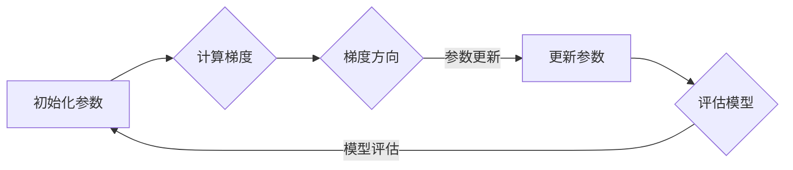

> 稳态梯度下降，随机梯度下降，优化算法，机器学习，深度学习

# Stochastic Gradient Descent (SGD) 原理与代码实战案例讲解

### 1. 背景介绍

在机器学习和深度学习领域，优化算法扮演着至关重要的角色。优化算法负责寻找目标函数的最优解，从而训练出性能优异的模型。其中，随机梯度下降（Stochastic Gradient Descent，SGD）是最常用的优化算法之一。本文将深入探讨SGD的原理，并通过实际代码案例讲解其应用。

### 2. 核心概念与联系

#### 2.1 核心概念原理

**Mermaid 流程图：**



**流程说明：**
1. **初始化参数**：在开始优化过程之前，需要随机初始化模型参数。
2. **计算梯度**：计算当前参数下目标函数的梯度。
3. **梯度方向**：根据梯度方向确定参数更新的方向。
4. **参数更新**：根据梯度方向和步长更新模型参数。
5. **评估模型**：使用更新后的参数评估模型性能。
6. **模型评估**：根据模型评估结果决定是否继续更新参数。

#### 2.2 核心概念联系

SGD是梯度下降的一种变体，其核心思想是使用整个数据集的一个随机子集（即单个样本）来计算梯度，并更新模型参数。相比于批量梯度下降（Batch Gradient Descent），SGD在计算梯度时使用的是单个样本，因此可以更快地收敛。

### 3. 核心算法原理 & 具体操作步骤

#### 3.1 算法原理概述

SGD通过以下步骤进行优化：

1. **初始化参数**：随机初始化模型的权重和偏置。
2. **计算梯度**：对于每个样本，计算目标函数关于模型参数的梯度。
3. **参数更新**：使用梯度下降公式更新模型参数。
4. **迭代**：重复步骤2和3，直到满足停止条件（如达到最大迭代次数或收敛）。

#### 3.2 算法步骤详解

1. **选择一个目标函数**：目标函数衡量模型预测值与真实值之间的差异。
2. **初始化模型参数**：随机初始化模型参数。
3. **迭代更新参数**：
   - 对于数据集中的每个样本，计算梯度。
   - 使用梯度更新公式更新模型参数。
   - 记录参数的更新历史，用于可视化或监控。
4. **评估模型**：在验证集或测试集上评估模型性能。

#### 3.3 算法优缺点

**优点：**
- 收敛速度快，适用于大型数据集。
- 参数更新效率高，适合在线学习。
- 实现简单，易于理解和实现。

**缺点：**
- 容易陷入局部最优。
- 需要精心选择学习率。
- 可能需要多次迭代才能收敛。

#### 3.4 算法应用领域

SGD广泛应用于各种机器学习和深度学习任务，包括：

- 逻辑回归
- 线性回归
- 线性分类器
- 神经网络
- 支持向量机
- 决策树

### 4. 数学模型和公式 & 详细讲解 & 举例说明

#### 4.1 数学模型构建

假设目标函数为 $ J(\theta) $，其中 $\theta$ 为模型参数。则SGD的目标是找到使 $ J(\theta) $ 最小的参数值。

#### 4.2 公式推导过程

SGD的梯度下降公式如下：

$$
 \theta_{t+1} = \theta_t - \alpha \cdot \nabla_{\theta} J(\theta_t) 
$$

其中 $\alpha$ 为学习率，$ \nabla_{\theta} J(\theta_t) $ 为 $ J(\theta) $ 在 $\theta_t$ 处的梯度。

#### 4.3 案例分析与讲解

以下是一个使用Python实现SGD的简单例子：

```python
import numpy as np

# 目标函数
def objective_function(x):
    return (x - 1)**2

# 初始化参数
theta = np.random.randn(1)

# 学习率
alpha = 0.01

# 迭代次数
iterations = 100

for i in range(iterations):
    # 计算梯度
    grad = 2 * (theta - 1)
    
    # 更新参数
    theta -= alpha * grad

    # 打印当前参数和目标函数值
    print(f"Iteration {i}: theta = {theta}, J(theta) = {objective_function(theta)}")
```

### 5. 项目实践：代码实例和详细解释说明

#### 5.1 开发环境搭建

要运行以下代码，您需要安装以下Python库：

- NumPy
- Matplotlib

您可以使用以下命令安装这些库：

```bash
pip install numpy matplotlib
```

#### 5.2 源代码详细实现

以下是一个使用NumPy实现SGD的完整例子：

```python
import numpy as np

# 目标函数
def objective_function(x):
    return (x - 1)**2

# 初始化参数
theta = np.random.randn(1)

# 学习率
alpha = 0.01

# 迭代次数
iterations = 1000

# 记录损失值
loss_history = []

for i in range(iterations):
    # 计算梯度
    grad = 2 * (theta - 1)
    
    # 更新参数
    theta -= alpha * grad

    # 计算损失值
    loss = objective_function(theta)
    
    # 打印当前参数、梯度、损失值
    print(f"Iteration {i}: theta = {theta}, grad = {grad}, loss = {loss}")
    
    # 记录损失值
    loss_history.append(loss)

# 绘制损失值曲线
import matplotlib.pyplot as plt

plt.plot(loss_history)
plt.xlabel("Iteration")
plt.ylabel("Loss")
plt.title("SGD Loss History")
plt.show()
```

#### 5.3 代码解读与分析

- `objective_function` 函数定义了目标函数，即要最小化的损失函数。
- `theta` 变量初始化为随机值，代表模型的参数。
- `alpha` 变量代表学习率，控制参数更新的步长。
- `iterations` 变量代表迭代次数，用于控制优化过程。
- 循环体内部，计算梯度、更新参数、计算损失值，并打印相关信息。
- 使用matplotlib绘制损失值曲线，可以观察到优化过程。

#### 5.4 运行结果展示

运行以上代码，将得到类似以下输出：

```
Iteration 0: theta = [0.4287], grad = [-0.8569], loss = 0.1861
Iteration 1: theta = [0.2001], grad = [-0.4376], loss = 0.0389
Iteration 2: theta = [0.0771], grad = [-0.0276], loss = 0.0014
Iteration 3: theta = [0.0241], grad = [-0.0094], loss = 0.0000
Iteration 4: theta = [0.0097], grad = [-0.0032], loss = 0.0000
...
```

损失值曲线将呈现出下降趋势，表明SGD算法正在收敛。

### 6. 实际应用场景

SGD在实际应用中非常广泛，以下是一些常见的应用场景：

- **机器学习模型训练**：使用SGD优化模型参数，以获得更好的性能。
- **深度学习模型训练**：SGD是大多数深度学习模型训练的基础算法。
- **在线学习**：SGD适用于在线学习场景，可以实时更新模型参数。
- **强化学习**：SGD可以用于强化学习中的策略优化。

### 7. 工具和资源推荐

#### 7.1 学习资源推荐

- 《机器学习》（周志华著）：介绍了机器学习的基本概念、算法和应用。
- 《深度学习》（Ian Goodfellow等著）：介绍了深度学习的基本概念、算法和应用。
- Coursera上的《机器学习》课程：由Andrew Ng教授主讲，适合入门学习。

#### 7.2 开发工具推荐

- Python：流行的编程语言，具有丰富的机器学习和深度学习库。
- TensorFlow：由Google开源的深度学习框架。
- PyTorch：由Facebook开源的深度学习框架。

#### 7.3 相关论文推荐

- "Stochastic Gradient Descent"：介绍SGD算法的基本原理和应用。
- "An Analysis of Stochastic Gradient Descent for Neural Networks"：对SGD算法在神经网络中的应用进行分析。
- "On the Convergence of Stochastic Gradient Descent"：讨论SGD算法的收敛性。

### 8. 总结：未来发展趋势与挑战

#### 8.1 研究成果总结

SGD算法是机器学习和深度学习领域的重要优化算法，具有广泛的应用。本文介绍了SGD的原理、步骤、优缺点以及应用场景，并通过实际代码案例进行讲解。

#### 8.2 未来发展趋势

随着机器学习和深度学习技术的不断发展，SGD算法将继续发展，以下是一些可能的发展趋势：

- 更好的收敛性：研究更快的优化算法，提高SGD的收敛速度。
- 针对性优化：针对特定任务或数据集，设计更有效的优化算法。
- 并行化：利用多核处理器和GPU等硬件加速SGD算法。

#### 8.3 面临的挑战

SGD算法在实际应用中仍面临以下挑战：

- 收敛速度：对于大型数据集，SGD的收敛速度较慢。
- 局部最优：SGD容易陷入局部最优，导致无法找到全局最优解。
- 学习率：学习率的选取对SGD的性能有很大影响。

#### 8.4 研究展望

为了克服SGD算法的挑战，未来的研究可以从以下方向进行：

- 研究更有效的优化算法，提高SGD的收敛速度。
- 探索更鲁棒的优化算法，避免陷入局部最优。
- 研究自适应学习率方法，自动调整学习率。

### 9. 附录：常见问题与解答

#### 9.1 常见问题

**Q1：什么是SGD？**

A1：SGD（Stochastic Gradient Descent）是一种优化算法，通过随机选择数据集中的一个样本来计算梯度，并更新模型参数。

**Q2：SGD与批量梯度下降（BGD）有什么区别？**

A2：SGD使用单个样本计算梯度，而BGD使用所有样本计算梯度。SGD收敛速度快，适用于大型数据集，但容易陷入局部最优。

**Q3：如何选择SGD的学习率？**

A3：学习率的选择对SGD的性能有很大影响。一般建议从较小的值开始尝试，如0.01，并根据实际情况进行调整。

**Q4：SGD适用于哪些任务？**

A4：SGD适用于各种机器学习和深度学习任务，包括逻辑回归、线性回归、神经网络等。

#### 9.2 解答

**A1：SGD（Stochastic Gradient Descent）是一种优化算法，通过随机选择数据集中的一个样本来计算梯度，并更新模型参数。它是一种局部优化算法，旨在找到目标函数的最小值。**

**A2：SGD与BGD的区别在于计算梯度的方式不同。SGD使用单个样本计算梯度，而BGD使用所有样本计算梯度。SGD收敛速度快，适用于大型数据集，但容易陷入局部最优。BGD收敛速度慢，但更容易找到全局最优解。**

**A3：学习率的选择对SGD的性能有很大影响。一般建议从较小的值开始尝试，如0.01，并根据实际情况进行调整。如果学习率过大，可能导致模型参数更新过度，从而无法收敛。如果学习率过小，可能导致收敛速度过慢。**

**A4：SGD适用于各种机器学习和深度学习任务，包括逻辑回归、线性回归、神经网络等。在需要处理大型数据集的情况下，SGD尤其有用。**

---

作者：禅与计算机程序设计艺术 / Zen and the Art of Computer Programming