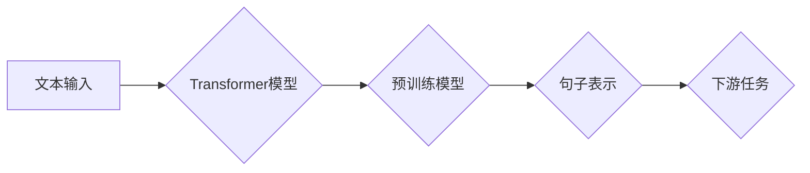

> 关键词：Transformer，sentence-transformers，语义相似度，文本表示，预训练模型，深度学习，自然语言处理

# Transformer大模型实战 sentence-transformers库

近年来，随着深度学习在自然语言处理（NLP）领域的迅猛发展，Transformer模型因其出色的性能和灵活性而成为NLP领域的明星技术。sentence-transformers库作为Transformer在文本表示领域的应用，以其简单易用和高效性著称。本文将深入探讨sentence-transformers库的原理、应用以及未来发展趋势，帮助读者全面了解和掌握这一强大的NLP工具。

## 1. 背景介绍

### 1.1 问题的由来

在NLP任务中，文本表示是一个核心问题。如何将无结构的文本数据转化为有意义的向量表示，以便进行后续的语义分析、相似度计算等操作，一直是研究者关注的焦点。传统的文本表示方法，如词袋模型、TF-IDF等，往往无法捕捉到文本中的深层语义信息。

随着深度学习技术的兴起，基于神经网络的文本表示方法逐渐成为主流。Word2Vec、GloVe等词向量模型通过学习词的上下文分布，能够较好地捕捉词语的语义信息。然而，这些模型在处理句子级别任务时，往往需要将句子拆分为单词，然后对单词进行向量表示，再进行拼接，效率较低。

Transformer模型的出现，为文本表示带来了革命性的变化。它能够直接对句子进行编码，生成句子级别的向量表示，极大地提高了文本处理的效率和精度。

### 1.2 研究现状

sentence-transformers库是基于Transformer模型的一系列开源工具，旨在为研究者提供方便快捷的文本表示解决方案。该库提供了丰富的预训练模型和便捷的API，能够轻松实现文本向量化、语义相似度计算、句子分类等任务。

sentence-transformers库的流行，得益于其以下特点：

- **预训练模型丰富**：sentence-transformers库提供了多种预训练模型，涵盖多种语言和任务，如BERT、DistilBERT、Roberta等。
- **易于使用**：sentence-transformers库的API简单易懂，只需几行代码即可实现文本向量化。
- **高效性**：sentence-transformers库在保证性能的同时，具有高效的计算速度。
- **可扩展性**：sentence-transformers库支持自定义预训练模型和微调模型，以满足不同任务的需求。

### 1.3 研究意义

sentence-transformers库在NLP领域具有重要的研究意义：

- **简化NLP任务**：sentence-transformers库能够简化NLP任务的实现，降低开发难度。
- **提高效率**：sentence-transformers库能够提高文本处理的效率，缩短研发周期。
- **促进创新**：sentence-transformers库为研究者提供了强大的工具，有助于推动NLP技术的创新和发展。

### 1.4 本文结构

本文将围绕sentence-transformers库展开，主要包括以下内容：

- 核心概念与联系
- 核心算法原理与操作步骤
- 数学模型和公式
- 项目实践
- 实际应用场景
- 工具和资源推荐
- 总结与展望

## 2. 核心概念与联系

### 2.1 核心概念

- **Transformer模型**：Transformer模型是一种基于自注意力机制的深度神经网络，能够捕捉长距离依赖关系，在NLP任务中表现出色。
- **句子表示**：句子表示是指将句子转化为向量表示，以便进行后续的语义分析、相似度计算等操作。
- **预训练模型**：预训练模型是指在大规模无标注数据上训练的模型，能够学习到通用的语言知识。
- **微调模型**：微调模型是指在预训练模型的基础上，在特定任务上进行训练的模型，以适应特定任务的需求。

### 2.2 架构流程图

以下是sentence-transformers库的核心概念和架构流程图：



在这个流程图中，文本输入经过Transformer模型转化为句子表示，然后用于下游任务，如语义相似度计算、句子分类等。

## 3. 核心算法原理 & 具体操作步骤

### 3.1 算法原理概述

sentence-transformers库基于Transformer模型，通过以下步骤实现文本表示：

1. **预训练**：在大规模无标注数据上训练预训练模型，学习通用的语言知识。
2. **微调**：在特定任务上对预训练模型进行微调，以适应特定任务的需求。
3. **文本表示**：将文本输入送入模型，得到句子表示。
4. **下游任务**：利用句子表示进行下游任务，如语义相似度计算、句子分类等。

### 3.2 算法步骤详解

1. **预训练**：sentence-transformers库提供了多种预训练模型，如BERT、DistilBERT、Roberta等。这些模型在大规模无标注数据上进行了预训练，学习到了通用的语言知识。

2. **微调**：在特定任务上，可以使用sentence-transformers库提供的微调接口对预训练模型进行微调。微调过程通常只需要很少的标注数据，即可显著提高模型在特定任务上的性能。

3. **文本表示**：将文本输入送入模型，得到句子表示。sentence-transformers库提供了多种文本表示方法，如CLIP、Mean、Sum、Max、pooler等。

4. **下游任务**：利用句子表示进行下游任务，如语义相似度计算、句子分类等。

### 3.3 算法优缺点

**优点**：

- **高效性**：sentence-transformers库在保证性能的同时，具有高效的计算速度。
- **易用性**：sentence-transformers库的API简单易懂，易于使用。
- **可扩展性**：sentence-transformers库支持自定义预训练模型和微调模型，以满足不同任务的需求。

**缺点**：

- **资源消耗**：预训练模型的训练和微调需要大量的计算资源和存储空间。
- **模型大小**：预训练模型通常较大，可能导致内存消耗过高。

### 3.4 算法应用领域

sentence-transformers库在以下领域具有广泛的应用：

- **语义相似度计算**：用于比较两个文本的相似度，如文本检索、知识图谱构建等。
- **句子分类**：用于对句子进行分类，如情感分析、主题分类等。
- **文本生成**：用于生成文本摘要、对话生成等。

## 4. 数学模型和公式 & 详细讲解 & 举例说明

### 4.1 数学模型构建

sentence-transformers库的核心模型是基于Transformer的，其数学模型如下：

$$
\text{Output} = \text{Transformer}(\text{Input}, \text{Mask}, \text{Segment}) = \text{Multi-Head Attention}(\text{Self-Attention}(\text{Input}, \text{Mask}, \text{Segment})) \cdot \text{Feed-Forward Network}
$$

其中，`Input`是输入序列，`Mask`是掩码，用于指定输入序列中可用的位置，`Segment`是段序列，用于区分不同句子。

### 4.2 公式推导过程

以下是Transformer模型中自注意力机制的计算公式：

$$
Q = \text{Linear}(W_Q Q) 
$$
$$
K = \text{Linear}(W_K K) 
$$
$$
V = \text{Linear}(W_V V) 
$$
$$
\text{Scores} = \frac{QK^T}{\sqrt{d_k}} 
$$
$$
\text{Attention} = \text{Softmax}(\text{Scores}) 
$$
$$
\text{Output} = \text{Attention}V 
$$

其中，$W_Q, W_K, W_V$ 分别是查询、键、值矩阵，$d_k$ 是键和值的维度。

### 4.3 案例分析与讲解

以下是一个使用sentence-transformers库进行语义相似度计算的案例：

```python
from sentence_transformers import SentenceTransformer

# 加载预训练模型
model = SentenceTransformer('bert-base-nli-mean-tokens')

# 计算句子表示
query = "这是一个关于机器学习的查询句子。"
document = "这是一个关于机器学习的文档句子。"
query_embedding = model.encode(query)
document_embedding = model.encode(document)

# 计算相似度
similarity = query_embedding.cosine_similarity(document_embedding)

# 打印相似度
print(f"相似度: {similarity}")
```

在这个例子中，我们首先加载了一个预训练模型`bert-base-nli-mean-tokens`，然后分别对查询和文档进行了句子表示，最后计算了它们的相似度。

## 5. 项目实践：代码实例和详细解释说明

### 5.1 开发环境搭建

为了使用sentence-transformers库，需要以下开发环境：

- Python 3.6+
- PyTorch 1.6+
- sentence-transformers

### 5.2 源代码详细实现

以下是一个使用sentence-transformers库进行文本分类的代码示例：

```python
from sentence_transformers import SentenceTransformer, SentenceTransformerTrainer, SentenceTransformerConfig

# 定义模型配置
config = SentenceTransformerConfig()

# 定义训练数据
train_data = [
    {"sentence": "这是一个正面的评论。", "label": 1},
    {"sentence": "这是一个负面的评论。", "label": 0},
    # ... 更多数据
]

# 创建模型
model = SentenceTransformerTrainer(train_data, config=config)

# 训练模型
model.fit()

# 保存模型
model.save_pretrained("my_model")
```

在这个例子中，我们首先定义了模型配置，然后定义了训练数据，包括文本和对应的标签。接着，我们创建了一个模型实例，并使用训练数据进行训练。最后，我们将训练好的模型保存到本地。

### 5.3 代码解读与分析

在这个代码示例中，我们使用了sentence-transformers库的`SentenceTransformerTrainer`类进行模型训练。这个类封装了模型的训练过程，使得模型训练更加简单。

`train_data`是一个列表，其中包含训练数据。每个元素是一个字典，包含文本和标签。

`SentenceTransformerTrainer`构造函数接收训练数据和模型配置作为参数，创建模型实例。

`fit`方法用于训练模型。

`save_pretrained`方法用于保存训练好的模型。

## 6. 实际应用场景

sentence-transformers库在以下场景中具有广泛的应用：

- **语义搜索**：用于搜索与特定查询最相似的文档或句子。
- **推荐系统**：用于根据用户历史行为推荐相关内容。
- **情感分析**：用于分析文本的情感倾向。
- **文本摘要**：用于生成文本摘要。

## 7. 工具和资源推荐

### 7.1 学习资源推荐

- **sentence-transformers官方文档**：https://github.com/UKPLab/sentence-transformers
- **Transformer原理与实现**：https://arxiv.org/abs/1706.03762
- **自然语言处理实战**：https://www.tensorflow.org/tutorials/text

### 7.2 开发工具推荐

- **PyTorch**：https://pytorch.org/
- **Transformers库**：https://github.com/huggingface/transformers
- **sentence-transformers库**：https://github.com/UKPLab/sentence-transformers

### 7.3 相关论文推荐

- **Attention is All You Need**：https://arxiv.org/abs/1706.03762
- **BERT: Pre-training of Deep Bidirectional Transformers for Language Understanding**：https://arxiv.org/abs/1810.04805
- **DistilBERT, a Distilled Version of BERT**: https://arxiv.org/abs/1904.04561

## 8. 总结：未来发展趋势与挑战

### 8.1 研究成果总结

sentence-transformers库作为Transformer模型在文本表示领域的应用，为NLP任务提供了强大的工具。它以其简单易用、高效性、可扩展性等特点，在NLP领域得到了广泛的应用。

### 8.2 未来发展趋势

- **多模态表示**：将文本表示与其他模态数据进行融合，如图像、视频等，以生成更全面的语义表示。
- **动态表示**：根据上下文动态生成文本表示，以适应不同的应用场景。
- **知识增强**：将知识图谱等外部知识引入文本表示，以增强语义理解能力。

### 8.3 面临的挑战

- **计算效率**：随着模型规模的扩大，计算效率成为了一个挑战。
- **模型可解释性**：如何解释模型决策过程，是一个重要的研究方向。
- **数据偏见**：如何避免模型学习到数据中的偏见，是一个需要解决的问题。

### 8.4 研究展望

sentence-transformers库将继续发展，为NLP领域的研究和应用提供更强大的支持。相信在不久的将来，基于Transformer的文本表示技术将会在更多领域得到应用，推动NLP技术的进一步发展。

## 9. 附录：常见问题与解答

**Q1：sentence-transformers库与BERT有什么区别？**

A：sentence-transformers库是基于BERT模型的一系列工具，用于文本表示。BERT是一个预训练模型，而sentence-transformers库则提供了BERT在文本表示领域的应用。

**Q2：如何选择合适的预训练模型？**

A：选择预训练模型时，需要考虑以下因素：

- **任务类型**：不同的任务可能需要不同的预训练模型。
- **数据量**：数据量较大的任务可以使用更大的预训练模型。
- **计算资源**：预训练模型的大小会影响计算资源的需求。

**Q3：如何自定义预训练模型？**

A：sentence-transformers库提供了自定义预训练模型的功能，可以使用自定义的数据集和模型配置进行预训练。

**Q4：如何进行模型微调？**

A：sentence-transformers库提供了微调接口，可以将预训练模型应用于特定任务进行微调。

**Q5：如何计算句子之间的相似度？**

A：可以使用sentence-transformers库提供的`cosine_similarity`函数计算句子之间的相似度。

---

作者：禅与计算机程序设计艺术 / Zen and the Art of Computer Programming