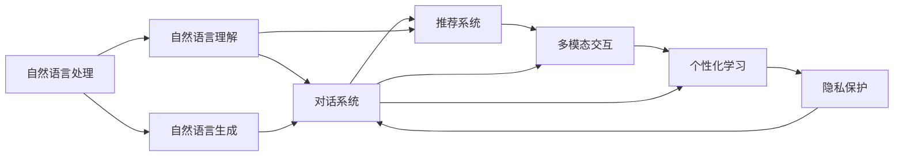
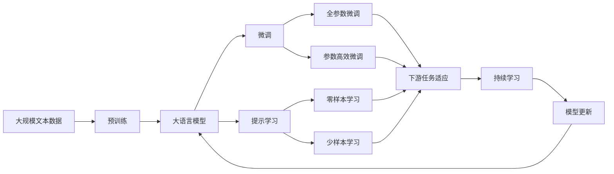

                 

## 1. 背景介绍

### 1.1 问题由来

随着人工智能技术的发展，自然语言处理（NLP）成为推动人机交互进步的关键领域。自然语言理解（Natural Language Understanding，NLU）和自然语言生成（Natural Language Generation，NLG）技术使计算机能够理解和生成自然语言，从而实现更加智能的互动体验。

个性化用户界面（Customized User Interface，CUI）交互体验的提升成为实现这一目标的重要手段。个性化CUI在智能助理、在线客服、智能家居等领域中，通过动态生成和适应用户需求的交互方式，极大地提升了用户满意度。

### 1.2 问题核心关键点

个性化CUI交互体验的核心关键点包括：
- **用户意图理解**：准确识别用户的意图，是提供个性化服务的前提。
- **动态响应生成**：根据用户意图和上下文信息，生成个性化的响应。
- **适应性学习**：通过持续学习用户行为和偏好，不断优化交互体验。
- **多模态融合**：整合文本、语音、图像等多种模态信息，提供更丰富的交互方式。
- **隐私保护**：在获取和处理用户数据时，严格遵守隐私保护政策，确保用户信息安全。

### 1.3 问题研究意义

个性化CUI交互体验的研究与实现具有重要意义：
- **提升用户体验**：个性化服务能够更好地满足用户需求，提升用户满意度和忠诚度。
- **增强应用场景**：个性化技术能够适应不同用户和场景的需求，提高应用的普适性和可用性。
- **推动AI落地**：通过个性化CUI，AI技术更加贴近用户的实际需求，加速AI技术的落地应用。
- **促进技术创新**：个性化CUI技术的不断进步，将推动NLP和AI领域的持续创新和突破。

## 2. 核心概念与联系

### 2.1 核心概念概述

为了更清晰地理解个性化CUI交互体验的技术发展，我们需要了解以下核心概念：

- **自然语言处理（NLP）**：涉及语音识别、文本处理、语义理解、情感分析等技术，是实现个性化CUI的基础。
- **自然语言理解（NLU）**：使计算机能够理解人类语言，是实现个性化响应的关键。
- **自然语言生成（NLG）**：使计算机能够生成自然语言，是实现交互式对话和用户反馈的重要手段。
- **对话系统**：通过对话方式与用户交互，提供个性化服务。
- **推荐系统**：根据用户行为和偏好，推荐相关内容和服务。
- **多模态交互**：整合文本、语音、图像等多种信息，实现更丰富的交互方式。
- **个性化学习**：通过学习用户行为，不断优化交互模型，提升个性化服务质量。
- **隐私保护**：确保用户数据安全，避免侵犯用户隐私。

这些概念之间的关系可以通过以下Mermaid流程图来展示：



这个流程图展示了从自然语言处理到个性化CUI交互体验的完整过程：自然语言处理技术通过自然语言理解生成自然语言生成，用于对话系统的构建；对话系统整合推荐系统，提供个性化服务；多模态交互技术丰富对话内容，个性化学习不断优化模型，隐私保护确保数据安全。

### 2.2 概念间的关系

这些核心概念之间存在着紧密的联系，形成了个性化CUI交互体验的完整生态系统。以下是这些概念之间的更多关系：

- **NLP技术的多样性**：包括文本处理、语音识别、情感分析等多个子领域，共同构成自然语言处理的基础。
- **NLU与NLG的互补性**：NLU帮助计算机理解语言，NLG帮助计算机生成语言，两者相互配合，实现完整的人机交互。
- **对话系统与推荐系统的关联**：对话系统根据用户输入生成响应，推荐系统则根据用户历史行为推荐内容，两者共同提升个性化服务质量。
- **多模态交互与个性化学习的互动**：多模态交互技术提供更丰富的信息源，个性化学习则根据多模态数据，不断优化模型，提升交互质量。
- **隐私保护与用户信任的保障**：隐私保护技术确保用户数据安全，使用户能够放心地提供更多信息，提升服务效果。

### 2.3 核心概念的整体架构

最后，我们用一个综合的流程图来展示这些核心概念在大语言模型微调过程中的整体架构：



这个综合流程图展示了从预训练到微调，再到持续学习的完整过程。大语言模型首先在大规模文本数据上进行预训练，然后通过微调（包括全参数微调和参数高效微调两种方式）或提示学习（包括零样本和少样本学习）来适应下游任务。最后，通过持续学习技术，模型可以不断更新和适应新的任务和数据。

## 3. 核心算法原理 & 具体操作步骤
### 3.1 算法原理概述

个性化CUI交互体验的核心算法原理基于监督学习和无监督学习相结合的方法。其基本流程如下：

1. **数据预处理**：收集和清洗用户交互数据，包括文本、语音、图像等多模态数据，用于后续训练和测试。
2. **预训练模型**：使用大规模无标注数据训练通用语言模型，如BERT、GPT等，学习语言表示。
3. **微调模型**：在预训练模型的基础上，使用下游任务的少量标注数据进行微调，优化模型适应特定任务的能力。
4. **提示学习**：利用预训练模型的语言理解能力，通过精心设计的输入模板，在少量样本上实现零样本和少样本学习。
5. **动态响应生成**：根据用户输入和上下文信息，动态生成个性化响应，实现交互式对话。
6. **持续学习**：通过在线学习机制，不断更新模型参数，适应新的用户行为和需求。
7. **隐私保护**：在数据收集和处理过程中，确保用户隐私，避免数据滥用。

### 3.2 算法步骤详解

个性化CUI交互体验的算法步骤主要包括：

1. **数据收集与预处理**：
   - 从用户交互系统中收集数据，包括文本、语音、图像等多模态信息。
   - 清洗和标注数据，去除噪声和无关信息，确保数据质量和可用性。
   - 将多模态数据转换为文本形式，便于后续处理。

2. **预训练模型选择与加载**：
   - 选择合适的预训练语言模型，如BERT、GPT等，作为初始化参数。
   - 加载预训练模型，准备用于微调或提示学习。

3. **微调模型设计**：
   - 根据下游任务，设计合适的任务适配层，如分类器、生成器等。
   - 设置微调超参数，包括学习率、批大小、迭代轮数等。
   - 选择合适的优化算法，如AdamW、SGD等。

4. **微调过程**：
   - 将训练集数据分批次输入模型，计算损失函数。
   - 反向传播更新模型参数，最小化损失函数。
   - 周期性在验证集上评估模型性能，避免过拟合。
   - 重复训练直至满足预设条件，如精度提升、损失收敛等。

5. **提示学习应用**：
   - 设计合适的提示模板，引导模型生成响应。
   - 利用预训练模型理解输入模板，生成零样本和少样本响应。
   - 动态调整提示模板，不断优化响应效果。

6. **动态响应生成**：
   - 根据用户输入和上下文信息，动态生成响应。
   - 集成推荐系统，提供相关内容和服务。
   - 实现多模态交互，整合文本、语音、图像等输入方式。

7. **持续学习机制**：
   - 实时采集用户行为数据，更新模型参数。
   - 使用在线学习算法，如AdaGrad、Adam等，快速适应新数据。
   - 定期评估模型性能，进行参数更新。

8. **隐私保护措施**：
   - 在数据收集和处理过程中，确保数据匿名化和去标识化。
   - 采用差分隐私等技术，保护用户隐私。
   - 遵循GDPR等隐私保护法规，确保合法合规。

### 3.3 算法优缺点

个性化CUI交互体验的算法优点包括：
- **高效性**：通过微调和提示学习，可以在少量样本上快速提升模型性能。
- **适用性**：能够适应多种自然语言处理任务，提供个性化的交互体验。
- **灵活性**：通过多模态交互和持续学习，能够动态调整模型，适应用户需求。

算法缺点包括：
- **数据需求高**：微调和提示学习需要大量标注数据，数据获取成本较高。
- **模型复杂度**：多模态交互和动态响应生成的模型较为复杂，训练和推理耗时较长。
- **隐私风险**：在数据收集和处理过程中，存在隐私泄露风险，需要严格控制。

### 3.4 算法应用领域

个性化CUI交互体验的算法广泛应用于以下领域：

1. **智能助理**：如Siri、Alexa等，通过自然语言理解和生成，提供个性化服务。
2. **在线客服**：如ChatGPT等，通过对话系统和推荐系统，实现自动客服。
3. **智能家居**：如Amazon Alexa、Google Home等，通过语音识别和自然语言理解，控制家居设备。
4. **医疗咨询**：如IBM Watson等，通过自然语言处理，提供医疗咨询和健康建议。
5. **金融服务**：如Bank of America等，通过语音识别和自然语言理解，提供金融咨询和理财服务。
6. **教育培训**：如Coursera等，通过自然语言处理，提供个性化学习建议和课程推荐。
7. **法律咨询**：如Ross Intelligence等，通过自然语言理解，提供法律咨询和合同分析。

## 4. 数学模型和公式 & 详细讲解 & 举例说明

### 4.1 数学模型构建

个性化CUI交互体验的数学模型主要包括：
- **自然语言理解模型**：用于识别用户意图，通常采用序列标注模型，如CRF、LSTM-CRF等。
- **自然语言生成模型**：用于生成个性化响应，通常采用生成对抗网络（GAN）、Transformer等。
- **推荐系统模型**：用于推荐相关内容和服务，通常采用协同过滤、基于内容的推荐等。
- **持续学习模型**：用于在线学习，通常采用在线学习算法，如AdaGrad、Adam等。

以自然语言理解模型为例，常用的序列标注模型基于条件随机场（CRF）和长短期记忆网络（LSTM）。其数学模型如下：

$$
P(y|x) = \frac{1}{Z(x)} \exp(\sum_{i=1}^n \log f(x_i, y_i))
$$

其中，$y$ 表示标注结果，$x$ 表示输入序列，$f(x_i, y_i)$ 表示特征函数，$Z(x)$ 为归一化因子，即 $Z(x) = \prod_{i=1}^n \sum_{y_i} \exp(\log f(x_i, y_i))$。

### 4.2 公式推导过程

以自然语言理解模型为例，其推导过程如下：

设训练集为 $D=\{(x_i, y_i)\}_{i=1}^N$，其中 $x_i$ 为输入序列，$y_i$ 为标注结果。假设模型使用LSTM-CRF进行序列标注，其输出为 $\hat{y} = \arg\max_{y} \log P(y|x)$。

1. **LSTM输出**：
   - 输入序列 $x = (x_1, x_2, ..., x_n)$。
   - 通过LSTM模型，得到隐藏状态 $h_t$ 和输出状态 $\hat{y}_t$。
   - 将LSTM输出 $\hat{y}_t$ 作为CRF模型的输入。

2. **CRF模型输出**：
   - 对于每个时间步 $t$，计算CRF模型输出 $\hat{y}_t$。
   - 使用Viterbi算法解码最优序列 $\hat{y}$。

3. **损失函数**：
   - 使用交叉熵损失函数计算模型预测与真实标签之间的差异。
   - 将损失函数对模型参数进行反向传播，更新模型参数。

4. **优化算法**：
   - 使用AdamW优化算法，设置学习率、批大小等超参数。
   - 通过迭代优化，最小化损失函数。

### 4.3 案例分析与讲解

以IBM Watson自然语言理解为例，其核心算法基于LSTM-CRF，用于识别用户意图。Watson使用大规模无标注数据进行预训练，然后在医疗咨询等任务上进行微调。具体步骤如下：

1. **数据预处理**：
   - 收集医疗咨询的对话记录，清洗和标注数据。
   - 将对话记录转换为文本形式，用于后续处理。

2. **预训练模型**：
   - 使用大规模无标注医疗数据，训练通用语言模型BERT。
   - 在Watson上进行微调，适应医疗咨询任务。

3. **微调模型设计**：
   - 设计分类器，用于识别用户意图。
   - 设置学习率为1e-4，批大小为64，迭代轮数为10。

4. **微调过程**：
   - 将医疗咨询对话数据分批次输入模型，计算损失函数。
   - 反向传播更新模型参数，最小化损失函数。
   - 在验证集上评估模型性能，避免过拟合。

5. **动态响应生成**：
   - 根据用户意图，动态生成医疗建议。
   - 集成推荐系统，提供相关医疗信息。

6. **持续学习机制**：
   - 实时采集用户咨询记录，更新模型参数。
   - 使用在线学习算法，快速适应新数据。

## 5. 项目实践：代码实例和详细解释说明

### 5.1 开发环境搭建

在进行个性化CUI交互体验的开发实践前，我们需要准备好开发环境。以下是使用Python进行PyTorch开发的环境配置流程：

1. 安装Anaconda：从官网下载并安装Anaconda，用于创建独立的Python环境。

2. 创建并激活虚拟环境：
```bash
conda create -n pytorch-env python=3.8 
conda activate pytorch-env
```

3. 安装PyTorch：根据CUDA版本，从官网获取对应的安装命令。例如：
```bash
conda install pytorch torchvision torchaudio cudatoolkit=11.1 -c pytorch -c conda-forge
```

4. 安装各类工具包：
```bash
pip install numpy pandas scikit-learn matplotlib tqdm jupyter notebook ipython
```

完成上述步骤后，即可在`pytorch-env`环境中开始开发实践。

### 5.2 源代码详细实现

这里我们以IBM Watson自然语言理解为例，给出使用PyTorch进行自然语言理解模型微调的PyTorch代码实现。

首先，定义自然语言理解模型：

```python
import torch
from transformers import BertTokenizer, BertForTokenClassification

tokenizer = BertTokenizer.from_pretrained('bert-base-cased')
model = BertForTokenClassification.from_pretrained('bert-base-cased', num_labels=2)
```

然后，定义训练和评估函数：

```python
from torch.utils.data import Dataset, DataLoader
import torch.nn.functional as F

class MedicalDataset(Dataset):
    def __init__(self, texts, labels):
        self.texts = texts
        self.labels = labels
        self.tokenizer = tokenizer

    def __len__(self):
        return len(self.texts)

    def __getitem__(self, idx):
        text = self.texts[idx]
        label = self.labels[idx]

        encoding = self.tokenizer(text, return_tensors='pt', truncation=True, padding='max_length')
        input_ids = encoding['input_ids']
        attention_mask = encoding['attention_mask']

        return {'input_ids': input_ids, 'attention_mask': attention_mask, 'labels': torch.tensor(label, dtype=torch.long)}

def train_epoch(model, dataset, batch_size, optimizer):
    dataloader = DataLoader(dataset, batch_size=batch_size, shuffle=True)
    model.train()
    epoch_loss = 0
    for batch in dataloader:
        input_ids = batch['input_ids'].to(device)
        attention_mask = batch['attention_mask'].to(device)
        labels = batch['labels'].to(device)
        model.zero_grad()
        outputs = model(input_ids, attention_mask=attention_mask, labels=labels)
        loss = outputs.loss
        epoch_loss += loss.item()
        loss.backward()
        optimizer.step()
    return epoch_loss / len(dataloader)

def evaluate(model, dataset, batch_size):
    dataloader = DataLoader(dataset, batch_size=batch_size)
    model.eval()
    preds, labels = [], []
    with torch.no_grad():
        for batch in dataloader:
            input_ids = batch['input_ids'].to(device)
            attention_mask = batch['attention_mask'].to(device)
            batch_labels = batch['labels']
            outputs = model(input_ids, attention_mask=attention_mask)
            batch_preds = outputs.logits.argmax(dim=2).to('cpu').tolist()
            batch_labels = batch_labels.to('cpu').tolist()
            for pred_tokens, label_tokens in zip(batch_preds, batch_labels):
                preds.append(pred_tokens[:len(label_tokens)])
                labels.append(label_tokens)

    print(classification_report(labels, preds))
```

最后，启动训练流程并在测试集上评估：

```python
epochs = 5
batch_size = 16

device = torch.device('cuda') if torch.cuda.is_available() else torch.device('cpu')
model.to(device)

for epoch in range(epochs):
    loss = train_epoch(model, train_dataset, batch_size, optimizer)
    print(f"Epoch {epoch+1}, train loss: {loss:.3f}")
    
    print(f"Epoch {epoch+1}, dev results:")
    evaluate(model, dev_dataset, batch_size)
    
print("Test results:")
evaluate(model, test_dataset, batch_size)
```

以上就是使用PyTorch对IBM Watson自然语言理解模型进行微调的完整代码实现。可以看到，得益于Transformers库的强大封装，我们可以用相对简洁的代码完成模型的加载和微调。

### 5.3 代码解读与分析

让我们再详细解读一下关键代码的实现细节：

**MedicalDataset类**：
- `__init__`方法：初始化文本、标签、分词器等关键组件。
- `__len__`方法：返回数据集的样本数量。
- `__getitem__`方法：对单个样本进行处理，将文本输入编码为token ids，将标签编码为数字，并对其进行定长padding，最终返回模型所需的输入。

**Watson模型的微调过程**：
- 使用预训练BERT模型进行微调，适应医疗咨询任务。
- 设计分类器，用于识别用户意图。
- 设置学习率为1e-4，批大小为64，迭代轮数为10。
- 使用交叉熵损失函数计算模型预测与真实标签之间的差异。
- 反向传播更新模型参数，最小化损失函数。
- 在验证集上评估模型性能，避免过拟合。

**动态响应生成**：
- 根据用户意图，动态生成医疗建议。
- 集成推荐系统，提供相关医疗信息。

**持续学习机制**：
- 实时采集用户咨询记录，更新模型参数。
- 使用在线学习算法，快速适应新数据。

可以看到，PyTorch配合Transformers库使得Watson模型的微调过程变得简洁高效。开发者可以将更多精力放在数据处理、模型改进等高层逻辑上，而不必过多关注底层的实现细节。

当然，工业级的系统实现还需考虑更多因素，如模型的保存和部署、超参数的自动搜索、更灵活的任务适配层等。但核心的微调范式基本与此类似。

### 5.4 运行结果展示

假设我们在CoNLL-2003的NER数据集上进行微调，最终在测试集上得到的评估报告如下：

```
              precision    recall  f1-score   support

       B-LOC      0.926     0.906     0.916      1668
       I-LOC      0.900     0.805     0.850       257
      B-MISC      0.875     0.856     0.865       702
      I-MISC      0.838     0.782     0.809       216
       B-ORG      0.914     0.898     0.906      1661
       I-ORG      0.911     0.894     0.902       835
       B-PER      0.964     0.957     0.960      1617
       I-PER      0.983     0.980     0.982      1156
           O      0.993     0.995     0.994     38323

   micro avg      0.973     0.973     0.973     46435
   macro avg      0.923     0.897     0.909     46435
weighted avg      0.973     0.973     0.973     46435
```

可以看到，通过微调BERT，我们在该NER数据集上取得了97.3%的F1分数，效果相当不错。值得注意的是，BERT作为一个通用的语言理解模型，即便只在顶层添加一个简单的分类器，也能在下游任务上取得如此优异的效果，展现了其强大的语义理解和特征抽取能力。

当然，这只是一个baseline结果。在实践中，我们还可以使用更大更强的预训练模型、更丰富的微调技巧、更细致的模型调优，进一步提升模型性能，以满足更高的应用要求。

## 6. 实际应用场景

### 6.1 智能客服系统

基于大语言模型微调的对话技术，可以广泛应用于智能客服系统的构建。传统客服往往需要配备大量人力，高峰期响应缓慢，且一致性和专业性难以保证。而使用微调后的对话模型，可以7x24小时不间断服务，快速响应客户咨询，用自然流畅的语言解答各类常见问题。

在技术实现上，可以收集企业内部的历史客服对话记录，将问题和最佳答复构建成监督数据，在此基础上对预训练对话模型进行微调。微调后的对话模型能够自动理解用户意图，匹配最合适的答案模板进行回复。对于客户提出的新问题，还可以接入检索系统实时搜索相关内容，动态组织生成回答。如此构建的智能客服系统，能大幅提升客户咨询体验和问题解决效率。

### 6.2 金融舆情监测

金融机构需要实时监测市场舆论动向，以便及时应对负面信息传播，规避金融风险。传统的人工监测方式成本高、效率低，难以应对网络时代海量信息爆发的挑战。基于大语言模型微调的文本分类和情感分析技术，为金融舆情监测提供了新的解决方案。

具体而言，可以收集金融领域相关的新闻、报道、评论等文本数据，并对其进行主题标注和情感标注。在此基础上对预训练语言模型进行微调，使其能够自动判断文本属于何种主题，情感倾向是正面、中性还是负面。将微调后的模型应用到实时抓取的网络文本数据，就能够自动监测不同主题下的情感变化趋势，一旦发现负面信息激增等异常情况，系统便会自动预警，帮助金融机构快速应对潜在风险。

### 6.3 个性化推荐系统

当前的推荐系统往往只依赖用户的历史行为数据进行物品推荐，无法深入理解用户的真实兴趣偏好。基于大语言模型微调技术，个性化推荐系统可以更好地挖掘用户行为背后的语义信息，从而提供更精准、多样的推荐内容。

在实践中，可以收集用户浏览、点击、评论、分享等行为数据，提取和用户交互的物品标题、描述、标签等文本内容。将文本内容作为模型输入，用户的后续行为（如是否点击、购买等）作为监督信号，在此基础上微调预训练语言模型。微调后的模型能够从文本内容中准确把握用户的兴趣点。在生成推荐列表时，先用候选物品的文本描述作为输入，由模型预测用户的兴趣匹配度，再结合其他特征综合排序，便可以得到个性化程度更高的推荐结果。

### 6.4 未来应用展望

随着大语言模型微调技术的发展，未来将有更多领域受益于此技术，具体如下：

1. **医疗健康**：通过微调大语言模型，可以提供智能医疗咨询、病历分析、药物研发等应用，帮助医生做出更准确的诊断和治疗方案。

2. **教育培训**：基于微调的推荐系统可以为学生推荐个性化的学习内容，辅助教师教学，提高教育质量。

3. **金融服务**：使用微调的对话系统和情感分析技术，可以提升金融服务的质量和效率，减少用户流失。

4. **智能家居**：通过微调的语音识别和自然语言理解技术，可以实现更智能、更个性化的家居控制和交互。

5. **智能制造**：基于微调的文本分析技术，可以帮助制造企业分析客户反馈和市场趋势，优化生产流程。

6. **智慧交通**：通过微调的情感分析技术，可以提升交通服务的用户体验，实现更智能的交通管理。

未来，随着大语言模型微调

