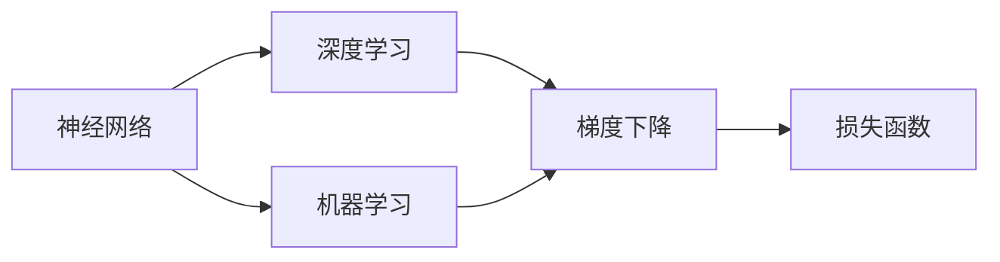

                 

# 人工智能数学基础原理与代码实战案例讲解

> 关键词：人工智能,数学基础,深度学习,机器学习,神经网络,优化算法,梯度下降

## 1. 背景介绍

人工智能（AI）是现代科技发展的重要方向之一，通过模拟人类智能，实现复杂问题的自动化解决。在AI的核心技术中，数学基础占据着重要地位，特别是深度学习、机器学习、神经网络等领域。本文将详细介绍人工智能中的数学基础，并通过实际案例讲解如何将其应用到神经网络中的代码实现。

## 2. 核心概念与联系

### 2.1 核心概念概述

在人工智能领域，以下核心概念对理解其数学基础至关重要：

- 神经网络（Neural Network）：模拟人脑的神经元处理信息的一种网络结构，由大量节点（神经元）通过连接构成。
- 深度学习（Deep Learning）：一种基于神经网络的学习范式，通过多个层次的神经元，可以自动提取数据中的特征。
- 机器学习（Machine Learning）：使计算机系统通过数据自动学习并改进的方法，不依赖人工干预。
- 梯度下降（Gradient Descent）：一种常用的优化算法，通过计算损失函数的梯度来最小化误差，使模型参数逐步优化。
- 损失函数（Loss Function）：衡量模型预测结果与真实值之间差异的函数，通过最小化损失函数可以优化模型性能。

这些概念之间的逻辑关系可以通过以下Mermaid流程图来展示：



该流程图展示了神经网络与深度学习的关系，以及它们与机器学习、梯度下降和损失函数的关系。深度学习通过多个层次的神经网络实现特征提取，机器学习通过优化损失函数，梯度下降算法通过计算梯度来最小化损失，而损失函数则是衡量模型预测与真实值差异的关键指标。

### 2.2 概念间的关系

这些核心概念之间存在紧密的联系，共同构成了人工智能技术的数学基础：

- 神经网络是深度学习的基础，通过多层次的神经元实现复杂的特征提取。
- 深度学习是机器学习的一种特殊形式，通过神经网络自动学习数据特征。
- 梯度下降算法是优化损失函数的有效方法，通过计算梯度来最小化损失。
- 损失函数是衡量模型性能的关键指标，通过最小化损失来优化模型。

以下是一个具体的例子来说明这些概念之间的关系：

1. **神经网络**：我们设计一个神经网络，其中包含输入层、隐藏层和输出层，网络中的每个节点都有一个权重和一个偏差。
2. **深度学习**：我们使用深度学习算法，如反向传播算法（Backpropagation），来训练神经网络，使得网络能够自动从数据中学习特征。
3. **梯度下降**：在训练过程中，我们使用梯度下降算法来最小化损失函数，通过计算梯度来更新神经网络的权重和偏差。
4. **损失函数**：我们定义一个损失函数（如均方误差、交叉熵等），来衡量模型预测值与真实值之间的差异。

## 3. 核心算法原理 & 具体操作步骤

### 3.1 算法原理概述

深度学习中，神经网络的训练是通过反向传播算法（Backpropagation）和梯度下降算法实现的。反向传播算法通过计算损失函数对神经网络各层参数的梯度，并反向传递回输入层，以便更新权重和偏差。梯度下降算法则通过迭代优化损失函数，逐步逼近最优解。

在实际应用中，深度学习模型通常包含多个层次的神经元，每个神经元都有多个输入和多个输出。模型的目标是通过训练，使得预测结果与真实值之间的损失最小化。

### 3.2 算法步骤详解

以下是一个简单的深度学习模型的训练步骤：

1. **数据准备**：收集训练数据，并将数据进行预处理，如归一化、分批处理等。
2. **模型定义**：定义神经网络的架构，包括输入层、隐藏层和输出层的神经元数、激活函数等。
3. **损失函数选择**：选择合适的损失函数，如均方误差、交叉熵等。
4. **反向传播算法**：使用反向传播算法计算损失函数对每个神经元参数的梯度。
5. **梯度下降算法**：使用梯度下降算法更新神经网络参数，最小化损失函数。
6. **迭代训练**：重复以上步骤，直到模型收敛或达到预设的迭代次数。

### 3.3 算法优缺点

深度学习的优点在于其强大的特征提取能力和泛化能力，可以自动学习数据中的复杂模式。缺点在于其对数据量和计算资源的需求较大，训练过程容易过拟合。

### 3.4 算法应用领域

深度学习在计算机视觉、自然语言处理、语音识别等多个领域都有广泛应用。以下是一个简单的实例，说明如何在计算机视觉中应用深度学习：

假设我们要训练一个图像分类模型，用于识别不同种类的水果。首先，我们需要收集大量的水果图像，并将图像进行预处理，如归一化、裁剪、旋转等。然后，定义一个卷积神经网络（Convolutional Neural Network，CNN）模型，包括卷积层、池化层和全连接层。在训练过程中，我们使用反向传播算法和梯度下降算法来最小化损失函数，逐步优化模型参数。最后，我们将训练好的模型应用于新的水果图像分类任务，并评估其性能。

## 4. 数学模型和公式 & 详细讲解 & 举例说明

### 4.1 数学模型构建

在深度学习中，数学模型通常包括以下几个部分：

- 输入层：包含输入数据的特征向量。
- 隐藏层：包含多个神经元，用于提取特征。
- 输出层：包含神经元的线性组合，用于输出预测结果。

假设我们有一个包含 $n$ 个样本的数据集，每个样本包含 $d$ 个特征。我们定义一个 $h$ 层的神经网络，其中每层包含 $n_h$ 个神经元。

在训练过程中，我们使用反向传播算法来计算损失函数对每个神经元参数的梯度。设第 $i$ 层第 $j$ 个神经元的权重为 $w_{ij}$，偏差为 $b_i$，输出为 $a_{ij}$。则第 $i$ 层到第 $i+1$ 层的梯度计算公式为：

$$
\frac{\partial L}{\partial w_{ij}} = \frac{\partial L}{\partial a_{i+1,j}} \frac{\partial a_{i+1,j}}{\partial z_{ij}} \frac{\partial z_{ij}}{\partial w_{ij}}
$$

其中，$L$ 为损失函数，$z_{ij}$ 为第 $i$ 层第 $j$ 个神经元的加权和。

### 4.2 公式推导过程

以下是深度学习中梯度下降算法的推导过程：

设目标函数为 $f(x)$，其中 $x$ 为模型参数。我们希望通过梯度下降算法最小化 $f(x)$。梯度下降算法的更新公式为：

$$
x \leftarrow x - \eta \nabla f(x)
$$

其中 $\eta$ 为学习率。在神经网络中，我们通常使用均方误差作为损失函数。对于单层神经网络，均方误差的梯度公式为：

$$
\frac{\partial L}{\partial w} = \frac{1}{n}\sum_{i=1}^n (\hat{y_i} - y_i) \frac{\partial \hat{y_i}}{\partial w}
$$

其中 $\hat{y_i}$ 为模型的预测值，$y_i$ 为真实值。

### 4.3 案例分析与讲解

以下是一个简单的手写数字识别案例，说明如何在TensorFlow中使用深度学习模型：

首先，我们定义一个卷积神经网络模型，包含卷积层、池化层和全连接层。然后，我们使用TensorFlow的框架进行模型训练，最小化损失函数。最后，我们评估模型的性能，并在新的手写数字图片上测试模型的泛化能力。

```python
import tensorflow as tf
from tensorflow.keras import layers

# 定义模型
model = tf.keras.Sequential([
    layers.Conv2D(32, (3,3), activation='relu', input_shape=(28, 28, 1)),
    layers.MaxPooling2D((2,2)),
    layers.Flatten(),
    layers.Dense(10, activation='softmax')
])

# 编译模型
model.compile(optimizer='adam',
              loss=tf.keras.losses.SparseCategoricalCrossentropy(from_logits=True),
              metrics=['accuracy'])

# 训练模型
model.fit(x_train, y_train, epochs=10, validation_data=(x_val, y_val))

# 评估模型
test_loss, test_acc = model.evaluate(x_test, y_test)

# 测试模型
predictions = model.predict(x_test)
```

在上述代码中，我们首先定义了一个包含卷积层、池化层和全连接层的神经网络模型。然后，我们使用TensorFlow的编译方法，指定了优化器、损失函数和评估指标。在训练过程中，我们使用均方误差作为损失函数，并使用Adam优化器进行优化。在测试过程中，我们评估了模型的准确率，并在新的手写数字图片上进行了预测。

## 5. 项目实践：代码实例和详细解释说明

### 5.1 开发环境搭建

在使用深度学习进行项目实践时，我们需要搭建相应的开发环境。以下是在Python中使用TensorFlow和Keras搭建深度学习模型的环境配置流程：

1. 安装Python：从官网下载并安装Python，推荐使用Anaconda进行环境管理。
2. 安装TensorFlow和Keras：通过pip安装TensorFlow和Keras库。
```bash
pip install tensorflow keras
```

3. 准备数据集：收集和预处理训练数据集，如MNIST手写数字数据集。

4. 编写代码：使用TensorFlow和Keras库编写深度学习模型的代码，并进行训练和测试。

### 5.2 源代码详细实现

以下是一个简单的手写数字识别案例，使用Keras框架实现：

```python
import tensorflow as tf
from tensorflow.keras import layers, models

# 定义模型
model = models.Sequential([
    layers.Flatten(input_shape=(28, 28)),
    layers.Dense(128, activation='relu'),
    layers.Dense(10, activation='softmax')
])

# 编译模型
model.compile(optimizer='adam',
              loss=tf.keras.losses.SparseCategoricalCrossentropy(from_logits=True),
              metrics=['accuracy'])

# 训练模型
model.fit(train_images, train_labels, epochs=10, validation_data=(val_images, val_labels))

# 评估模型
test_loss, test_acc = model.evaluate(test_images, test_labels)

# 测试模型
predictions = model.predict(test_images)
```

### 5.3 代码解读与分析

在上述代码中，我们首先定义了一个包含两个全连接层的神经网络模型。然后，我们使用Keras的编译方法，指定了优化器、损失函数和评估指标。在训练过程中，我们使用均方误差作为损失函数，并使用Adam优化器进行优化。在测试过程中，我们评估了模型的准确率，并在新的手写数字图片上进行了预测。

## 6. 实际应用场景

深度学习已经在许多实际应用场景中得到广泛应用，以下是一些典型的应用场景：

### 6.1 计算机视觉

计算机视觉是深度学习的一个重要应用领域，包括图像分类、目标检测、图像分割等任务。在图像分类任务中，我们通常使用卷积神经网络（CNN）模型，对图像进行特征提取和分类。

### 6.2 自然语言处理

自然语言处理是深度学习的另一个重要应用领域，包括文本分类、情感分析、机器翻译等任务。在文本分类任务中，我们通常使用循环神经网络（RNN）或长短期记忆网络（LSTM）模型，对文本进行序列建模和分类。

### 6.3 语音识别

语音识别是深度学习在语音处理领域的应用，包括语音识别、语音合成等任务。在语音识别任务中，我们通常使用卷积神经网络（CNN）或循环神经网络（RNN）模型，对音频信号进行特征提取和识别。

### 6.4 未来应用展望

未来，深度学习将在更多领域得到应用，为各个行业带来变革性影响。在医疗、金融、教育等领域，深度学习技术将广泛应用于图像分析、风险评估、个性化推荐等任务，提升效率和准确率。

## 7. 工具和资源推荐

### 7.1 学习资源推荐

为了帮助开发者系统掌握深度学习的基础知识和实践技能，以下是一些优质的学习资源：

1. 《深度学习》课程：斯坦福大学开设的深度学习课程，涵盖了深度学习的基本概念、算法和应用。
2. 《TensorFlow官方文档》：TensorFlow的官方文档，提供了详细的API介绍和实际应用案例。
3. 《Keras官方文档》：Keras的官方文档，提供了简单易用的API接口和实际应用案例。
4. 《动手学深度学习》：由深度学习专家李沐等所著，详细讲解了深度学习的基础知识和实践技能。

### 7.2 开发工具推荐

以下是一些常用的深度学习开发工具：

1. TensorFlow：由Google开发和维护的深度学习框架，支持分布式计算和GPU加速。
2. Keras：一个高层次的深度学习API，支持TensorFlow、Theano等后端。
3. PyTorch：由Facebook开发和维护的深度学习框架，支持动态图和GPU加速。
4. Caffe：一个基于C++的深度学习框架，支持卷积神经网络等模型。
5. MXNet：由Amazon开发和维护的深度学习框架，支持分布式计算和GPU加速。

### 7.3 相关论文推荐

以下是几篇具有代表性的深度学习论文，推荐阅读：

1. 《ImageNet Classification with Deep Convolutional Neural Networks》：AlexNet论文，首次展示了卷积神经网络在图像分类任务中的巨大潜力。
2. 《Long Short-Term Memory》：LSTM论文，提出了长短期记忆网络模型，解决了RNN中的梯度消失问题。
3. 《TensorFlow: A System for Large-Scale Machine Learning》：TensorFlow论文，详细介绍了TensorFlow框架的设计和实现。
4. 《Keras: Deep Learning for Humans》：Keras官方文档，详细介绍了Keras框架的使用和API接口。
5. 《Dynamic Neural Network Architecture》：动态神经网络架构论文，提出了动态神经网络模型，支持动态图和分布式计算。

## 8. 总结：未来发展趋势与挑战

### 8.1 总结

本文详细介绍了人工智能中的数学基础，并通过实际案例讲解了如何在神经网络中进行深度学习模型的训练和测试。通过对这些核心概念的深入了解，我们能够更好地设计和优化深度学习模型，实现高效的特征提取和分类。

### 8.2 未来发展趋势

未来，深度学习将在更多领域得到应用，为各个行业带来变革性影响。以下是对未来深度学习发展的几个趋势：

1. 大规模模型的应用：随着算力成本的下降和数据规模的扩大，未来深度学习模型将更加庞大，具有更强的特征提取和泛化能力。
2. 自监督学习的应用：自监督学习将成为深度学习的重要研究方向，通过无标签数据的自动标注，实现更高效的模型训练。
3. 多模态学习的兴起：未来深度学习将更多地应用到多模态数据，如图像、音频、文本等，提升跨模态信息融合的能力。
4. 深度学习与人工智能的融合：深度学习将与自然语言处理、计算机视觉、语音识别等人工智能技术进行更深入的融合，提升智能系统的整体性能。

### 8.3 面临的挑战

尽管深度学习已经取得了巨大的成功，但在其发展和应用过程中仍面临一些挑战：

1. 模型规模和计算资源的需求：大规模深度学习模型的训练和推理需要大量的计算资源，如何提高模型训练和推理的效率是一个重要问题。
2. 数据质量和标注成本的问题：深度学习模型的性能很大程度上依赖于数据的质量和标注成本，如何降低对标注数据的依赖，提高模型的泛化能力是一个重要研究方向。
3. 模型的可解释性和透明性：深度学习模型通常是"黑盒"系统，缺乏可解释性和透明性，如何提升模型的可解释性和透明性是一个重要课题。
4. 模型的鲁棒性和泛化能力：深度学习模型容易受到输入数据的干扰，如何提高模型的鲁棒性和泛化能力是一个重要研究方向。
5. 数据隐私和安全问题：深度学习模型通常需要大量的数据进行训练，如何保护数据隐私和安全是一个重要问题。

### 8.4 研究展望

未来，深度学习研究将集中在以下几个方向：

1. 模型压缩和优化：如何提高深度学习模型的压缩率和效率，降低对计算资源的需求。
2. 自监督学习和弱监督学习：如何利用无标签数据和弱标签数据进行深度学习模型的训练。
3. 跨模态学习和多模态融合：如何提升跨模态数据的信息融合能力，实现更高效的多模态学习。
4. 深度学习和人工智能的融合：如何将深度学习与自然语言处理、计算机视觉、语音识别等人工智能技术进行更深入的融合，提升智能系统的整体性能。
5. 深度学习和伦理道德的结合：如何在深度学习模型中加入伦理道德的约束，避免模型的误用和滥用。

## 9. 附录：常见问题与解答

**Q1: 深度学习模型中梯度消失的问题如何解决？**

A: 梯度消失问题可以通过以下方法解决：

1. 使用更好的激活函数，如ReLU、LeakyReLU等。
2. 使用批量归一化（Batch Normalization），使数据在每个批次中的分布更加稳定。
3. 使用残差连接（Residual Connection），减少梯度传播的路径。
4. 使用梯度裁剪（Gradient Clipping），限制梯度的大小。

**Q2: 深度学习模型中过拟合的问题如何解决？**

A: 过拟合问题可以通过以下方法解决：

1. 使用正则化（Regularization）方法，如L2正则化、Dropout等。
2. 使用数据增强（Data Augmentation）技术，扩充训练数据集。
3. 使用更复杂的模型结构，如深度神经网络。
4. 使用早停法（Early Stopping），防止模型过度拟合训练数据。

**Q3: 如何选择合适的深度学习模型？**

A: 选择合适的深度学习模型需要考虑以下几个因素：

1. 数据集的规模和类型。如大规模图像数据集通常使用卷积神经网络，大规模文本数据集通常使用循环神经网络。
2. 任务的类型和需求。如分类任务通常使用全连接神经网络，生成任务通常使用生成对抗网络（GAN）。
3. 计算资源的限制。如计算资源有限时，可以选择更小规模的模型。

**Q4: 如何优化深度学习模型的训练过程？**

A: 优化深度学习模型的训练过程需要考虑以下几个因素：

1. 选择更合适的优化器，如Adam、SGD等。
2. 设置合适的学习率，避免学习率过大或过小。
3. 使用适当的正则化方法，如L2正则化、Dropout等。
4. 使用合适的数据增强技术，扩充训练数据集。
5. 使用GPU加速，提高训练效率。

**Q5: 如何提高深度学习模型的泛化能力？**

A: 提高深度学习模型的泛化能力需要考虑以下几个因素：

1. 收集更多的训练数据，使模型更好地理解数据分布。
2. 使用更复杂的模型结构，提高模型的表达能力。
3. 使用正则化方法，避免模型过拟合。
4. 使用数据增强技术，扩充训练数据集。
5. 使用更好的优化器，提高训练效率和收敛速度。

以上是深度学习中的一些常见问题及其解答。通过对这些问题的深入理解，我们能够更好地设计和优化深度学习模型，实现高效的特征提取和分类。

