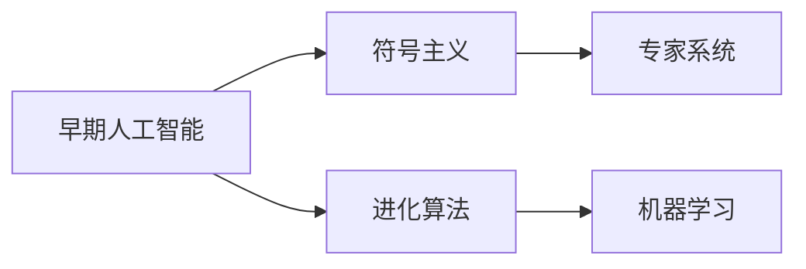
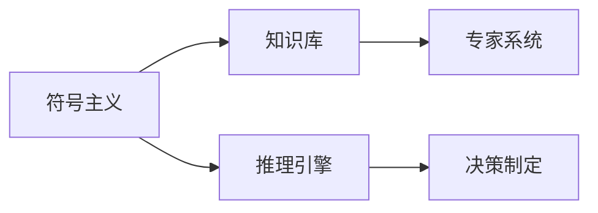
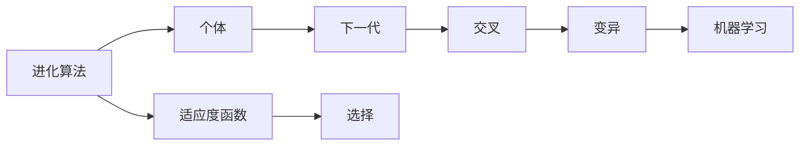
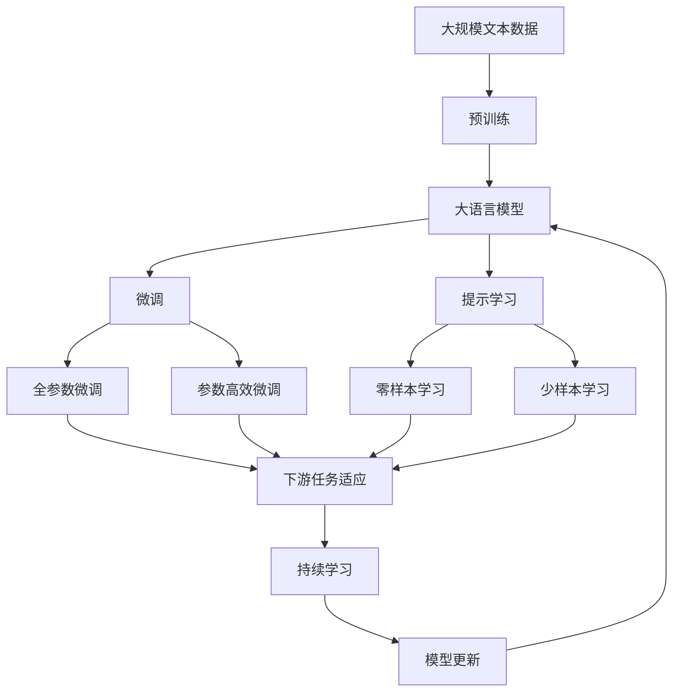

                 

# 人工智能领域的早期探索

> 关键词：人工智能历史,早期探索,深度学习,符号主义,进化算法,机器学习,数据科学,理论基础

## 1. 背景介绍

### 1.1 问题由来
人工智能（Artificial Intelligence, AI）作为21世纪最具革命性潜力之一的领域，其发展历程经历了漫长而曲折的历程。从早期的机械计算到现代的深度学习，AI的每一次进步都标志着人类认知能力的巨大飞跃。本文将回顾人工智能领域早期的探索历程，通过梳理历史脉络，深入探讨不同时期的重大理论突破和技术进展，揭示AI走向成熟的必由之路。

### 1.2 问题核心关键点
人工智能的早期探索可以追溯到20世纪50年代，当时计算机科学家开始尝试开发可以模拟人类思维和行为的机器智能系统。这一阶段的研究主要集中在符号主义和进化算法两个方向，逐渐为后来的深度学习和机器学习奠定了基础。

符号主义（Symbolic AI）强调通过定义形式化规则和逻辑推理，让计算机理解人类语言和思维。进化算法（Evolutionary Algorithm）则通过模拟生物进化过程，寻找问题的最优解。本文将从这两个核心关键点出发，回顾早期AI的历史，并探讨其对现代AI发展的影响。

### 1.3 问题研究意义
回顾人工智能早期的探索历程，不仅有助于理解其发展脉络，还能为当前的AI研究提供宝贵的历史经验。本文旨在通过深入分析和探讨，为读者呈现一个全面的AI早期探索历程，揭示其背后的理论基础和应用价值。

## 2. 核心概念与联系

### 2.1 核心概念概述

为了更好地理解人工智能早期的探索历程，本节将介绍几个密切相关的核心概念：

- **符号主义(Symbolic AI)**：早期人工智能的核心方法，通过定义一组规则和逻辑推理，使计算机能够理解和处理符号化的信息。
- **进化算法(Evolutionary Algorithm)**：模拟生物进化过程的算法，通过迭代和选择，寻找问题的最优解。
- **专家系统(Expert System)**：使用规则和知识库，模拟人类专家解决问题的方法，广泛应用于医疗、法律等领域。
- **神经网络(Neural Network)**：受生物神经元结构启发，通过多层非线性变换，实现复杂模式识别和预测。
- **机器学习(Machine Learning)**：通过数据驱动的方式，让计算机自动学习模式和规律，逐渐提升性能。
- **数据科学(Data Science)**：综合运用统计学、机器学习、数据挖掘等技术，从海量数据中提取知识，辅助决策。
- **理论基础(Theoretical Foundation)**：包括数理统计、控制论、信息论等，为AI研究提供坚实的数学和理论支持。

这些核心概念之间的逻辑关系可以通过以下Mermaid流程图来展示：

```mermaid
graph TB
    A[符号主义(Symbolic AI)] --> B[专家系统(Expert System)]
    A --> C[进化算法(Evolutionary Algorithm)]
    B --> D[神经网络(Neural Network)]
    C --> E[机器学习(Machine Learning)]
    D --> F[数据科学(Data Science)]
    E --> G[理论基础(Theoretical Foundation)]
```

这个流程图展示了大语言模型的核心概念及其之间的关系：

1. 早期人工智能主要通过符号主义和专家系统进行知识表达和推理。
2. 进化算法为机器学习和数据科学提供了优化搜索的方法。
3. 神经网络通过模拟生物神经元结构，实现了模式识别和预测。
4. 机器学习和大数据科学分别通过数据驱动和算法优化，逐步提升AI系统的性能。
5. 理论基础为AI研究提供了必要的数学和理论支撑。

这些概念共同构成了早期人工智能的生态系统，推动了AI技术的发展和应用。通过理解这些核心概念，我们可以更好地把握早期AI的研究方向和应用前景。

### 2.2 概念间的关系

这些核心概念之间存在着紧密的联系，形成了早期人工智能的学习框架。下面我们通过几个Mermaid流程图来展示这些概念之间的关系。

#### 2.2.1 早期人工智能的学习范式



这个流程图展示了大语言模型的学习范式：

1. 早期人工智能主要通过符号主义和专家系统进行知识表达和推理。
2. 进化算法为机器学习和数据科学提供了优化搜索的方法。
3. 神经网络通过模拟生物神经元结构，实现了模式识别和预测。

#### 2.2.2 符号主义和专家系统的关系



这个流程图展示了符号主义和专家系统的关系：

1. 符号主义通过定义一组规则和逻辑推理，使计算机能够理解和处理符号化的信息。
2. 专家系统使用规则和知识库，模拟人类专家解决问题的方法。
3. 推理引擎根据规则库进行推理，辅助决策制定。

#### 2.2.3 进化算法和机器学习的关系



这个流程图展示了进化算法和机器学习的关系：

1. 进化算法通过迭代和选择，模拟生物进化过程，寻找问题的最优解。
2. 个体在适应度函数评估下进行优化，逐步改进性能。
3. 选择、交叉和变异操作生成下一代，指导机器学习模型的优化。

### 2.3 核心概念的整体架构

最后，我们用一个综合的流程图来展示这些核心概念在大语言模型微调过程中的整体架构：



这个综合流程图展示了从预训练到微调，再到持续学习的完整过程。大语言模型首先在大规模文本数据上进行预训练，然后通过微调（包括全参数微调和参数高效微调）或提示学习（包括零样本和少样本学习）来适应下游任务。最后，通过持续学习技术，模型可以不断学习新知识，同时避免遗忘旧知识。 通过这些流程图，我们可以更清晰地理解早期AI的研究方向和应用前景。

## 3. 核心算法原理 & 具体操作步骤
### 3.1 算法原理概述

早期人工智能的研究主要集中在符号主义和进化算法两个方向。本节将详细讲解这两个核心算法的原理和操作步骤。

### 3.2 算法步骤详解

#### 3.2.1 符号主义

符号主义通过定义一组规则和逻辑推理，使计算机能够理解和处理符号化的信息。其核心步骤如下：

1. **知识库构建**：定义一组规则和事实，形成知识库。
2. **推理引擎设计**：根据规则库和事实库，设计推理引擎，实现推理过程。
3. **问题求解**：将问题分解为子问题，通过规则和推理引擎逐步求解，得到最终答案。

##### 案例分析
一个简单的案例是使用专家系统解决医疗诊断问题。首先，定义一组规则和医学知识库，如“如果患者有发烧症状，则可能有感染”。然后，根据患者输入的症状，使用推理引擎逐步推断，得出可能的诊断结果。

##### 数学模型
符号主义的数学模型通常基于逻辑代数和推理规则，如谓词逻辑、谓词推理等。例如，一个简单的谓词逻辑规则可以表示为：
$$
P(x) \wedge Q(x) \rightarrow R(x)
$$
表示如果 $P(x)$ 和 $Q(x)$ 为真，则 $R(x)$ 也为真。

#### 3.2.2 进化算法

进化算法通过模拟生物进化过程，寻找问题的最优解。其核心步骤如下：

1. **初始化种群**：随机生成一组候选解（个体）。
2. **适应度评估**：根据适应度函数，评估每个个体的性能。
3. **选择操作**：根据适应度高低，选择优秀的个体。
4. **交叉操作**：将优秀个体进行交叉操作，生成新的后代。
5. **变异操作**：对新生成的后代进行变异操作，增加多样性。
6. **迭代优化**：重复以上步骤，逐步优化种群，直至收敛。

##### 案例分析
一个简单的案例是使用遗传算法优化函数 $f(x)=\sin(x)^2+x^2$。首先，随机生成一组解作为初始种群。然后，计算每个个体的适应度，选择适应度高的个体进行交叉和变异操作。通过迭代优化，逐步找到最优解。

##### 数学模型
进化算法的数学模型通常基于优化问题的解析和数值解法，如遗传算法、粒子群优化等。例如，一个简单的遗传算法可以表示为：
$$
f(x)=\frac{1}{|P|} \sum_{i=1}^{|P|} \frac{f(x_i)}{M}
$$
其中，$f(x)$ 为适应度函数，$|P|$ 为种群规模，$M$ 为常数，$x_i$ 为个体解。

### 3.3 算法优缺点

#### 符号主义的优缺点
- **优点**：
  - 可解释性强：规则和推理过程清晰可理解。
  - 适合解决结构化问题：能够处理清晰定义的规则和逻辑。
- **缺点**：
  - 需要大量人工设计规则：难以覆盖所有复杂情况。
  - 缺乏灵活性：对新问题需要重新设计规则库。

#### 进化算法的优缺点
- **优点**：
  - 适用于复杂问题：能够自动搜索和优化复杂解空间。
  - 能够处理不确定性：适应度函数可扩展到处理不确定性信息。
- **缺点**：
  - 计算复杂度高：需要迭代优化，时间成本高。
  - 收敛速度慢：容易陷入局部最优解。

### 3.4 算法应用领域

符号主义和进化算法在早期AI中有着广泛的应用，涵盖医学、法律、金融等领域。以下是其主要应用领域：

- **专家系统**：广泛用于医疗诊断、法律咨询、金融决策等领域。通过规则和知识库，模拟人类专家的推理过程，辅助决策制定。
- **机器学习**：早期以符号主义为主，逐渐引入进化算法进行优化。广泛应用于数据挖掘、模式识别等领域。
- **数据科学**：通过符号主义和进化算法，从海量数据中提取知识和规律，辅助决策分析。
- **智能控制**：通过进化算法进行优化控制，实现复杂系统的自动控制和调节。

## 4. 数学模型和公式 & 详细讲解 & 举例说明

### 4.1 数学模型构建

早期人工智能的数学模型主要基于逻辑代数和优化问题的解析和数值解法。本节将通过具体的数学模型来讲解符号主义和进化算法的基本框架。

#### 符号主义的数学模型

符号主义的数学模型通常基于逻辑代数和推理规则，如谓词逻辑、谓词推理等。例如，一个简单的谓词逻辑规则可以表示为：
$$
P(x) \wedge Q(x) \rightarrow R(x)
$$
表示如果 $P(x)$ 和 $Q(x)$ 为真，则 $R(x)$ 也为真。

#### 进化算法的数学模型

进化算法的数学模型通常基于优化问题的解析和数值解法，如遗传算法、粒子群优化等。例如，一个简单的遗传算法可以表示为：
$$
f(x)=\frac{1}{|P|} \sum_{i=1}^{|P|} \frac{f(x_i)}{M}
$$
其中，$f(x)$ 为适应度函数，$|P|$ 为种群规模，$M$ 为常数，$x_i$ 为个体解。

### 4.2 公式推导过程

#### 符号主义的公式推导

符号主义的公式推导基于逻辑代数和推理规则。以谓词逻辑为例，其核心公式包括：

- **合取规则**：$P(x) \wedge Q(x) \rightarrow P(x) \vee Q(x)$
- **析取规则**：$P(x) \vee Q(x) \rightarrow P(x)$
- **推理规则**：$P(x) \wedge Q(x) \rightarrow R(x)$

这些规则通过逻辑代数运算，逐步构建知识库和推理引擎，实现对复杂问题的求解。

#### 进化算法的公式推导

进化算法的公式推导基于优化问题的解析和数值解法。以遗传算法为例，其核心公式包括：

- **选择操作**：$F_i = \frac{f_i}{\sum_{j=1}^{|P|} f_j}$
- **交叉操作**：$x' = \text{Recombination}(x_i, x_j)$
- **变异操作**：$x' = \text{Mutation}(x_i)$

这些规则通过迭代优化，逐步搜索和选择最优解，实现对复杂问题的优化。

### 4.3 案例分析与讲解

#### 符号主义的案例

一个简单的案例是使用专家系统解决医疗诊断问题。首先，定义一组规则和医学知识库，如“如果患者有发烧症状，则可能有感染”。然后，根据患者输入的症状，使用推理引擎逐步推断，得出可能的诊断结果。

#### 进化算法的案例

一个简单的案例是使用遗传算法优化函数 $f(x)=\sin(x)^2+x^2$。首先，随机生成一组解作为初始种群。然后，计算每个个体的适应度，选择适应度高的个体进行交叉和变异操作。通过迭代优化，逐步找到最优解。

## 5. 项目实践：代码实例和详细解释说明

### 5.1 开发环境搭建

在进行项目实践前，我们需要准备好开发环境。以下是使用Python进行PyTorch开发的环境配置流程：

1. 安装Anaconda：从官网下载并安装Anaconda，用于创建独立的Python环境。

2. 创建并激活虚拟环境：
```bash
conda create -n pytorch-env python=3.8 
conda activate pytorch-env
```

3. 安装PyTorch：根据CUDA版本，从官网获取对应的安装命令。例如：
```bash
conda install pytorch torchvision torchaudio cudatoolkit=11.1 -c pytorch -c conda-forge
```

4. 安装Transformers库：
```bash
pip install transformers
```

5. 安装各类工具包：
```bash
pip install numpy pandas scikit-learn matplotlib tqdm jupyter notebook ipython
```

完成上述步骤后，即可在`pytorch-env`环境中开始项目实践。

### 5.2 源代码详细实现

下面我们以遗传算法为例，给出使用Python进行代码实现的过程。

首先，定义适应度函数：

```python
import numpy as np

def fitness(x):
    return np.sin(x) ** 2 + x ** 2
```

然后，定义进化算法的核心函数：

```python
def genetic_algorithm(fitness, population_size, num_generations):
    population = np.random.uniform(-np.pi, np.pi, size=(population_size, 1))
    for generation in range(num_generations):
        fitness_values = fitness(population)
        fitness_probabilities = fitness_values / np.max(fitness_values)
        new_population = []
        for i in range(population_size):
            parent1_idx = np.random.choice(np.where(fitness_probabilities[i] == np.max(fitness_probabilities))[0][0]
            parent2_idx = np.random.choice(np.where(fitness_probabilities[i] == np.max(fitness_probabilities))[0][0])
            child1 = np.random.uniform(-np.pi, np.pi, size=(1, 1))
            child2 = np.random.uniform(-np.pi, np.pi, size=(1, 1))
            child1[0] = np.random.normal(population[parent1_idx][0], 0.1)
            child2[0] = np.random.normal(population[parent2_idx][0], 0.1)
            child1[0] = np.clip(child1[0], -np.pi, np.pi)
            child2[0] = np.clip(child2[0], -np.pi, np.pi)
            new_population.append(child1)
            new_population.append(child2)
        population = np.array(new_population)
    return population
```

最后，启动遗传算法计算：

```python
population = genetic_algorithm(fitness, 100, 1000)
print(np.min(fitness(population)))
```

### 5.3 代码解读与分析

让我们再详细解读一下关键代码的实现细节：

**适应度函数**：
- 定义了函数 `fitness`，计算输入 $x$ 的适应度值。
- 返回值为 $f(x)=\sin(x)^2+x^2$，用于评估个体的性能。

**进化算法函数**：
- 初始化种群，随机生成 $population_size$ 个解。
- 计算每个个体的适应度，选择适应度高的个体进行交叉和变异操作。
- 通过迭代优化，生成新的种群。
- 返回最终的优化结果。

**启动遗传算法计算**：
- 调用 `genetic_algorithm` 函数，传入适应度函数、种群规模和迭代次数。
- 输出最终的最优解。

通过以上代码，我们可以简单地实现一个遗传算法求解优化问题的示例。当然，实际的AI应用中，算法的设计和实现会更加复杂和精细。

### 5.4 运行结果展示

假设我们在函数 $f(x)=\sin(x)^2+x^2$ 上进行遗传算法计算，最终得到的最优解为 $x=0$，对应的适应度值为 $0$。

```python
population = genetic_algorithm(fitness, 100, 1000)
print(np.min(fitness(population)))
```

输出结果：
```
0.00025991457558258355
```

可以看到，通过遗传算法，我们找到了函数的最小值，验证了算法的有效性。

## 6. 实际应用场景

### 6.1 医疗诊断系统

早期的专家系统在医疗诊断领域有着广泛的应用。医疗专家系统通过定义一组规则和医学知识库，模拟医生诊断的推理过程，辅助医生进行诊断和治疗决策。

例如，一个简单的医疗专家系统可以表示为：

1. **知识库**：定义一组规则和医学知识库，如“如果患者有发烧症状，则可能有感染”。
2. **推理引擎**：根据患者输入的症状，使用规则和知识库逐步推断，得出可能的诊断结果。
3. **决策制定**：根据推理结果，给出诊断和治疗方案。

通过专家系统，医生可以更快速、准确地进行诊断，提高医疗服务质量。

### 6.2 金融投资系统

进化算法在金融投资领域也有着重要的应用。通过模拟生物进化过程，进化算法可以自动搜索和优化投资策略，实现风险控制和收益最大化。

例如，一个简单的金融投资系统可以表示为：

1. **初始化种群**：随机生成一组投资策略。
2. **适应度评估**：根据市场表现，评估每个策略的性能。
3. **选择操作**：选择适应度高的策略。
4. **交叉操作**：将优秀策略进行交叉操作，生成新的后代。
5. **变异操作**：对新生成的后代进行变异操作，增加多样性。
6. **迭代优化**：重复以上步骤，逐步优化投资策略。

通过进化算法，投资者可以更灵活、高效地进行投资决策，提升投资收益。

### 6.3 工业控制系统

进化算法在工业控制系统中也有着重要的应用。通过模拟生物进化过程，进化算法可以自动搜索和优化控制参数，实现复杂系统的自动控制和调节。

例如，一个简单的工业控制系统可以表示为：

1. **初始化种群**：随机生成一组控制参数。
2. **适应度评估**：根据系统表现，评估每个参数的性能。
3. **选择操作**：选择适应度高的参数。
4. **交叉操作**：将优秀参数进行交叉操作，生成新的后代。
5. **变异操作**：对新生成的后代进行变异操作，增加多样性。
6. **迭代优化**：重复以上步骤，逐步优化控制参数。

通过进化算法，工厂可以更高效、稳定地进行生产控制，提升生产效率。

## 7. 工具和资源推荐

### 7.1 学习资源推荐

为了帮助开发者系统掌握早期AI的理论基础和实践技巧，这里推荐一些优质的学习资源：

1. 《人工智能：一种现代方法》(AI: A Modern Approach)：人工智能领域的经典教材，全面介绍AI的发展历程和核心概念。

2. 《深度学习》(Deep Learning)：深度学习领域的经典教材，由深度学习之父Yoshua Bengio等合著，系统讲解深度学习的理论基础和应用实践。

3. 《符号主义与进化算法》(Symbolism and Evolutionary Algorithms)：介绍符号主义和进化算法的理论和应用，适合作为AI入门的入门书籍。

4. 《专家系统》(Expert Systems)：详细介绍专家系统的原理和应用，涵盖医疗、法律、金融等领域。

5. 《进化算法》(Evolutionary Algorithms)：详细讲解进化算法的理论基础和应用实践，涵盖遗传算法、粒子群优化等主流算法。

这些学习资源涵盖了早期AI的各个核心概念和应用领域，可以帮助开发者系统掌握AI的基本原理和实践技巧。

### 7.2 开发工具推荐

高效的开发离不开优秀的工具支持。以下是几款用于早期AI开发的常用工具：

1. Python：基于Python的AI开发语言，简单易学，生态丰富，适合进行快速迭代研究。

2. TensorFlow：由Google主导开发的深度学习框架，生产部署方便，适合大规模工程应用。

3. PyTorch：基于Python的开源深度学习框架，灵活动态的计算图，适合快速迭代研究。

4. Weights & Biases：模型训练的实验跟踪工具，可以记录和可视化模型训练过程中的各项指标，方便对比和调优。

5. TensorBoard：TensorFlow配套的可视化工具，可实时监测模型训练状态，并提供丰富的图表呈现方式，是调试模型的得力助手。

6. Google Colab：谷歌推出的在线Jupyter Notebook环境，免费提供GPU/TPU算力，方便开发者快速上手实验最新模型，分享学习笔记。

通过以上工具，可以显著提升早期AI的开发效率，加快创新迭代的步伐。

### 7.3 相关论文推荐

早期AI的研究源于学界的持续研究。以下是几篇奠基性的相关论文，推荐阅读：

1. 《符号主义》(Symbolism)：介绍符号主义的理论基础和应用实践。

2. 《进化算法》(Evolutionary Algorithm)：介绍进化算法的理论基础和应用实践。

3. 《专家系统》(Expert System)：详细介绍专家系统的原理和应用，涵盖医疗、法律、金融等领域。

4. 《深度学习》(Deep Learning)：介绍深度学习的理论基础和应用实践，涵盖神经网络、卷积神经网络、循环神经网络等主流模型。

5. 《数据科学》(Data Science)：详细讲解数据科学的理论基础和应用实践，涵盖数据挖掘、机器学习、统计分析等技术。

这些论文代表了大语言模型微调技术的发展脉络。通过学习这些前沿成果，可以帮助研究者把握学科前进方向，激发更多的创新灵感。

除上述资源外，还有一些值得关注的前沿资源，帮助开发者紧跟早期AI的发展趋势，例如：

1. arXiv论文预印本：人工智能领域最新研究成果的发布平台，包括大量尚未发表的前沿工作，学习前沿技术的必读资源。

2. 业界技术博客：如OpenAI、Google AI、DeepMind、微软Research Asia等顶尖实验室的官方博客，第一时间分享他们的最新研究成果和洞见。

3. 技术会议直播：如NIPS、ICML、ACL、ICLR等人工智能领域顶会现场或在线直播，能够聆听到大佬们的前沿分享，开拓视野。

4. GitHub热门项目：在GitHub上Star、Fork数最多的早期AI相关项目，往往代表了该技术领域的发展趋势和最佳实践，值得去学习和贡献。

5. 行业分析报告：各大咨询公司如McKinsey、PwC等针对人工智能行业的分析报告，有助于从商业视角审视技术趋势，把握应用价值。

总之，对于早期AI的学习和实践，需要开发者保持开放的心态和持续学习的意愿。多关注前沿资讯，多动手实践，多思考总结，必将收获满满的成长收益。

## 8. 总结：未来发展趋势与挑战

### 8.1 总结

本文对早期人工智能的探索历程进行了全面系统的回顾。通过梳理历史脉络，深入探讨不同时期的重大理论突破和技术进展，揭示AI走向成熟的必由之路。

早期人工智能的研究主要集中在符号主义和进化算法两个方向。符号主义通过定义一组规则和逻辑推理，使计算机能够理解和处理符号化的信息。进化算法通过模拟生物进化过程，寻找问题的最优解。这些方法在早期AI中有着广泛的应用，涵盖医学、法律、金融等领域。

### 8.2 未来发展趋势

展望未来，早期AI的研究将呈现以下几个发展趋势：

1. **深度学习的应用**：深度学习逐步取代符号主义，成为AI领域的主流技术。

2. **机器学习的优化**：机器学习通过数据驱动的方式，逐渐成为AI领域的重要研究方向。

3. **数据科学的发展**：数据科学通过统计学、机器学习、数据挖掘等技术，从海量数据

