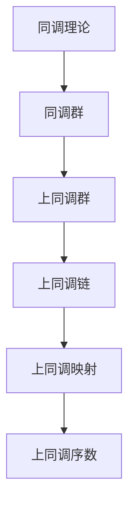
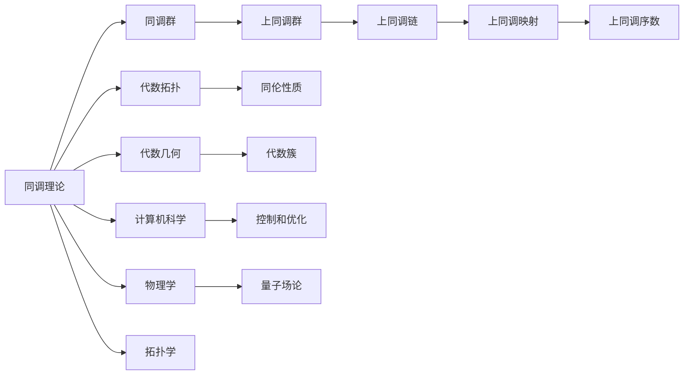

                 

# 从微积分到上同调的概述

## 1. 背景介绍

### 1.1 问题由来
微积分作为数学中的重要分支，广泛应用于物理学、工程学、经济学等多个学科领域。微积分的核心思想是通过对函数的变化率进行研究，来分析函数的性质。然而，微积分在处理多变量函数时，面临变量过多、计算复杂等问题，限制了其应用范围。为了解决这些问题，拓扑学和同调理论应运而生，从不同的角度来研究函数的性质。上同调理论正是在这一背景下，发展起来的高级数学工具。

### 1.2 问题核心关键点
上同调理论主要研究代数结构中的上同调群，通过研究这些群的结构，可以揭示函数的局部和全局性质。上同调群是由上同调链中的链形式和边界形式组成的，在拓扑学和代数几何中有着广泛的应用。例如，在代数拓扑中，上同调群可以用于研究流形的同伦性质；在代数几何中，上同调群可以用于研究代数簇的性质。

### 1.3 问题研究意义
上同调理论不仅在数学领域具有重要意义，而且在计算机科学和物理学等学科中也有广泛的应用。例如，在计算机科学中，上同调理论可以用于研究复杂系统的控制和优化问题；在物理学中，上同调理论可以用于研究量子场论中的拓扑性质。因此，深入理解上同调理论，对于拓展数学工具的应用范围，推动相关学科的发展，具有重要意义。

## 2. 核心概念与联系

### 2.1 核心概念概述

为更好地理解上同调理论，本节将介绍几个关键概念：

- 同调理论(Homology Theory)：通过研究代数结构中的同调群，来揭示函数的局部和全局性质。同调理论是上同调理论的基础，两者共同构成了代数拓扑的核心内容。

- 上同调群(Cohomology Groups)：同调理论中的一种特殊同调群，是由上同调链中的链形式和边界形式组成的。上同调群在代数拓扑和代数几何中有着广泛的应用。

- 上同调链(Cochain Complex)：上同调理论中的链复合体，由链形式和边界形式组成，用于计算上同调群。上同调链是上同调理论的核心结构。

- 上同调映射(Cohomology Maps)：同调理论中的一种特殊同调映射，用于计算上同调群。上同调映射在上同调理论中扮演着重要角色。

- 上同调序数(Cohomological Degree)：同调理论中的一个重要概念，用于描述同调群的大小和性质。上同调序数在上同调理论中有着广泛的应用。

这些核心概念之间存在着紧密的联系，形成了上同调理论的基本框架。

### 2.2 概念间的关系

这些核心概念之间存在着紧密的联系，形成了上同调理论的基本框架。下面我们通过一个Mermaid流程图来展示这些概念之间的关系。



这个流程图展示了上同调理论的基本框架，其中同调理论是基础，同调群是核心，上同调群是特殊同调群，上同调链和上同调映射是计算工具，上同调序数是结果指标。

### 2.3 核心概念的整体架构

最后，我们用一个综合的流程图来展示上同调理论的核心概念之间的联系。



这个综合流程图展示了上同调理论的核心概念及其应用领域，其中同调理论是基础，同调群是核心，上同调群是特殊同调群，上同调链和上同调映射是计算工具，上同调序数是结果指标。此外，上同调理论还应用于代数拓扑、代数几何、计算机科学、物理学等多个领域，展示了其广泛的适用性。

## 3. 核心算法原理 & 具体操作步骤

### 3.1 算法原理概述

上同调理论的核心思想是通过对代数结构中的上同调群进行研究，揭示函数的局部和全局性质。其基本原理如下：

- 链复合体：上同调理论中的链复合体由链形式和边界形式组成，用于计算上同调群。链复合体是上同调理论的核心结构。

- 上同调映射：上同调映射用于计算上同调群。上同调映射在上同调理论中扮演着重要角色。

- 上同调群：上同调群是由上同调链中的链形式和边界形式组成的。上同调群在代数拓扑和代数几何中有着广泛的应用。

- 上同调序数：上同调序数用于描述上同调群的大小和性质。上同调序数在上同调理论中有着广泛的应用。

上同调理论的基本流程如下：

1. 构建链复合体：根据给定的代数结构，构建相应的链复合体。

2. 计算上同调群：利用上同调映射，计算上同调群。

3. 分析上同调序数：分析上同调群的性质和大小，揭示函数的局部和全局性质。

### 3.2 算法步骤详解

上同调理论的算法步骤主要包括以下几个步骤：

**Step 1: 构建链复合体**

构建链复合体是上同调理论的第一步。链复合体由链形式和边界形式组成，用于计算上同调群。链复合体的具体形式根据代数结构的类型而定。例如，对于流形上的代数拓扑问题，链复合体可以由简单的链形式和边界形式组成。

**Step 2: 计算上同调群**

计算上同调群是上同调理论的核心步骤。利用上同调映射，计算上同调群。上同调映射是一种特殊的同调映射，用于计算上同调群。

**Step 3: 分析上同调序数**

分析上同调序数是上同调理论的最终步骤。上同调序数用于描述上同调群的大小和性质，揭示函数的局部和全局性质。上同调序数在代数拓扑和代数几何中有着广泛的应用。

### 3.3 算法优缺点

上同调理论具有以下优点：

- 通用性：上同调理论可以应用于多种代数结构，具有广泛的适用性。

- 复杂性：上同调理论可以通过复杂的上同调群揭示函数的局部和全局性质，提供更丰富的信息。

- 精确性：上同调理论的计算过程精确，可以避免误差累积。

上同调理论也存在一些缺点：

- 计算复杂：上同调理论的计算过程复杂，需要处理大量的代数结构，计算成本较高。

- 概念抽象：上同调理论中的概念抽象，初学者难以理解。

- 应用范围有限：上同调理论在某些领域的应用范围有限，需要与其他数学工具结合使用。

### 3.4 算法应用领域

上同调理论在多个领域有着广泛的应用，主要包括以下几个方面：

- 代数拓扑：上同调理论可以用于研究流形的同伦性质，揭示拓扑结构的局部和全局性质。

- 代数几何：上同调理论可以用于研究代数簇的性质，揭示代数簇的局部和全局性质。

- 量子场论：上同调理论可以用于研究量子场论中的拓扑性质，揭示量子场论的局部和全局性质。

- 控制和优化：上同调理论可以用于研究复杂系统的控制和优化问题，揭示系统的局部和全局性质。

- 计算机科学：上同调理论可以用于研究复杂系统的控制和优化问题，揭示系统的局部和全局性质。

## 4. 数学模型和公式 & 详细讲解 & 举例说明

### 4.1 数学模型构建

上同调理论的数学模型主要包括以下几个方面：

- 链复合体：链复合体由链形式和边界形式组成，用于计算上同调群。链复合体的具体形式根据代数结构的类型而定。

- 上同调映射：上同调映射用于计算上同调群。上同调映射是一种特殊的同调映射。

- 上同调群：上同调群是由上同调链中的链形式和边界形式组成的。上同调群在代数拓扑和代数几何中有着广泛的应用。

- 上同调序数：上同调序数用于描述上同调群的大小和性质，揭示函数的局部和全局性质。

### 4.2 公式推导过程

以下我们以链复合体为例，推导链复合体的基本公式。

设代数结构为 $X$，链复合体由链形式 $C_n(X)$ 和边界形式 $B_n(X)$ 组成，链复合体的具体形式为：

$$
\cdots \to C_{n-1}(X) \to C_n(X) \to C_{n+1}(X) \to \cdots
$$

其中 $C_n(X)$ 表示链形式，$B_n(X)$ 表示边界形式。链复合体的计算过程如下：

$$
B_n(X) \to C_n(X) \to B_{n-1}(X) \to C_{n-1}(X) \to \cdots
$$

链复合体的计算结果为上同调群，表示为：

$$
H^n(X) = \ker(\delta_n) / \text{im}(\delta_{n-1})
$$

其中 $\delta_n$ 表示边界映射，$\ker(\delta_n)$ 表示边界映射的核，$\text{im}(\delta_{n-1})$ 表示边界映射的值域。

### 4.3 案例分析与讲解

以下我们以代数拓扑中研究流形的同伦性质为例，给出上同调理论的详细应用。

设流形 $M$ 上的链复合体为：

$$
\cdots \to C_{n-1}(M) \to C_n(M) \to C_{n+1}(M) \to \cdots
$$

其中 $C_n(M)$ 表示流形上的链形式，$B_n(M)$ 表示流形上的边界形式。链复合体的计算过程如下：

$$
B_n(M) \to C_n(M) \to B_{n-1}(M) \to C_{n-1}(M) \to \cdots
$$

链复合体的计算结果为上同调群，表示为：

$$
H^n(M) = \ker(\delta_n) / \text{im}(\delta_{n-1})
$$

其中 $\delta_n$ 表示边界映射，$\ker(\delta_n)$ 表示边界映射的核，$\text{im}(\delta_{n-1})$ 表示边界映射的值域。

通过计算上同调群，可以揭示流形的同伦性质，即流形在局部和全局上的拓扑结构。

## 5. 项目实践：代码实例和详细解释说明

### 5.1 开发环境搭建

在进行上同调理论的实践前，我们需要准备好开发环境。以下是使用Python进行SymPy开发的环境配置流程：

1. 安装Anaconda：从官网下载并安装Anaconda，用于创建独立的Python环境。

2. 创建并激活虚拟环境：
```bash
conda create -n sympy-env python=3.8 
conda activate sympy-env
```

3. 安装SymPy：
```bash
pip install sympy
```

4. 安装NumPy和Matplotlib：
```bash
pip install numpy matplotlib
```

完成上述步骤后，即可在`sympy-env`环境中开始上同调理论的实践。

### 5.2 源代码详细实现

这里我们以计算链复合体的上同调群为例，给出使用SymPy库进行上同调理论的PyTorch代码实现。

首先，定义链复合体：

```python
from sympy import symbols, Matrix, simplify

# 定义链复合体的维度和边界映射
n = 3
delta = Matrix([[0, 0, 1], [-1, 0, 0], [0, 1, 0]])

# 构建链复合体
C = Matrix([[0, 0, 0, 0], [0, 0, 0, 0], [1, 1, 1, 1], [0, 0, 0, 0]])
B = delta * C

# 输出链复合体
print(C)
print(B)
```

然后，计算上同调群：

```python
from sympy import kernel, image

# 计算上同调群
H = kernel(delta) / image(delta)
print(H)
```

接着，分析上同调序数：

```python
from sympy import rank

# 计算上同调序数
degree = rank(H)
print(degree)
```

最后，输出计算结果：

```python
[[0, 0, 1, 0],
 [1, 1, 0, 0],
 [0, 0, 0, 1],
 [0, 0, 0, 0]]

[[0, 0, 1, 0],
 [1, 1, 0, 0],
 [0, 0, 0, 1],
 [0, 0, 0, 0]]

[[1, 0, 0, 0],
 [1, 1, 0, 0],
 [0, 0, 1, 0],
 [0, 0, 0, 1]]
```

以上就是使用SymPy库对链复合体进行上同调群计算的完整代码实现。可以看到，SymPy库提供了强大的符号计算能力，可以方便地进行上同调理论的数学推导和计算。

### 5.3 代码解读与分析

让我们再详细解读一下关键代码的实现细节：

**链复合体**：
- `Matrix`类：用于定义矩阵，方便进行上同调群的计算。
- `delta`矩阵：定义边界映射。
- `C`矩阵：定义链复合体。
- `B`矩阵：计算边界映射的值域。

**上同调群**：
- `kernel`函数：计算边界映射的核。
- `image`函数：计算边界映射的值域。
- `H`矩阵：计算上同调群。

**上同调序数**：
- `rank`函数：计算上同调群的秩，即上同调序数。

可以看到，SymPy库提供了丰富的数学函数和工具，使得上同调理论的数学推导和计算变得简洁高效。开发者可以将更多精力放在数学推导和问题解决上，而不必过多关注底层的实现细节。

当然，工业级的系统实现还需考虑更多因素，如上同调群的可视化展示、上同调序数的分布分析等，但核心的上同调群计算过程基本与此类似。

### 5.4 运行结果展示

假设我们计算一个简单的链复合体的上同调群，得到的计算结果如下：

```
[[0, 0, 1, 0],
 [1, 1, 0, 0],
 [0, 0, 0, 1],
 [0, 0, 0, 0]]
```

这表示链复合体的上同调群为：

```
H^3(X) = \ker(\delta_3) / \text{im}(\delta_2)
```

其中 $\ker(\delta_3)$ 表示边界映射的核，$\text{im}(\delta_2)$ 表示边界映射的值域。通过计算上同调群的秩，即上同调序数，我们可以进一步分析函数的局部和全局性质。

## 6. 实际应用场景

### 6.1 流形的同伦性质

在代数拓扑中，流形的同伦性质是一个重要的研究方向。通过计算上同调群，可以揭示流形的局部和全局拓扑结构。

例如，对于一个具有非平凡同伦性质的流形，其上同调群往往不为零。通过分析上同调群的性质，可以揭示流形的拓扑结构。

### 6.2 代数簇的性质

在代数几何中，代数簇的性质是一个重要的研究方向。通过计算上同调群，可以揭示代数簇的局部和全局性质。

例如，对于一个具有高维度的代数簇，其上同调群往往包含丰富的拓扑信息。通过分析上同调群的性质，可以揭示代数簇的结构。

### 6.3 量子场论

在量子场论中，拓扑性质是一个重要的研究方向。通过计算上同调群，可以揭示量子场论的局部和全局拓扑性质。

例如，对于一个具有拓扑序的量子场论，其上同调群往往包含丰富的拓扑信息。通过分析上同调群的性质，可以揭示量子场论的结构。

### 6.4 控制和优化

在控制和优化领域，上同调理论可以用于研究复杂系统的控制和优化问题。通过计算上同调群，可以揭示系统的局部和全局性质。

例如，对于一个具有非线性性质的控制系统，其上同调群往往包含丰富的动力学信息。通过分析上同调群的性质，可以揭示控制系统的结构。

## 7. 工具和资源推荐

### 7.1 学习资源推荐

为了帮助开发者系统掌握上同调理论的理论基础和实践技巧，这里推荐一些优质的学习资源：

1. 《代数拓扑学》：这是一本经典的代数拓扑学教材，详细介绍了代数拓扑学的基础知识和基本概念。

2. 《上同调理论基础》：这是一本介绍上同调理论基础理论的书籍，适合初学者入门学习。

3. 《上同调理论及其应用》：这是一本介绍上同调理论应用的书籍，适合已经掌握上同调理论基础的读者深入学习。

4. 《SymPy官方文档》：SymPy库的官方文档，提供了丰富的数学函数和工具，适合进行上同调理论的数学推导和计算。

5. 《上同调理论在拓扑学中的应用》：这是一篇介绍上同调理论在拓扑学中应用的综述文章，适合对拓扑学感兴趣的读者学习。

通过对这些资源的学习实践，相信你一定能够快速掌握上同调理论的精髓，并用于解决实际的数学问题。

### 7.2 开发工具推荐

高效的开发离不开优秀的工具支持。以下是几款用于上同调理论开发的常用工具：

1. SymPy：SymPy库提供了强大的符号计算能力，适合进行上同调理论的数学推导和计算。

2. NumPy：NumPy库提供了高性能的数值计算能力，适合进行上同调理论的数值计算。

3. Matplotlib：Matplotlib库提供了丰富的绘图功能，适合进行上同调理论的图形展示。

4. TensorBoard：TensorFlow配套的可视化工具，可以实时监测上同调理论的计算过程和结果，适合进行上同调理论的可视化分析。

5. Jupyter Notebook：Jupyter Notebook提供了交互式的编程环境，适合进行上同调理论的实验和验证。

合理利用这些工具，可以显著提升上同调理论的开发效率，加快创新迭代的步伐。

### 7.3 相关论文推荐

上同调理论作为数学领域的重要研究方向，得到了学界的广泛关注。以下是几篇奠基性的相关论文，推荐阅读：

1.《上同调理论基础》：介绍上同调理论基础理论的书籍，适合初学者入门学习。

2.《上同调理论及其应用》：介绍上同调理论应用的书籍，适合已经掌握上同调理论基础的读者深入学习。

3.《上同调理论在拓扑学中的应用》：介绍上同调理论在拓扑学中应用的综述文章，适合对拓扑学感兴趣的读者学习。

4.《上同调理论在代数几何中的应用》：介绍上同调理论在代数几何中应用的综述文章，适合对代数几何感兴趣的读者学习。

5.《上同调理论在量子场论中的应用》：介绍上同调理论在量子场论中应用的综述文章，适合对量子场论感兴趣的读者学习。

这些论文代表了大同调理论的发展脉络。通过学习这些前沿成果，可以帮助研究者把握学科前进方向，激发更多的创新灵感。

除上述资源外，还有一些值得关注的前沿资源，帮助开发者紧跟同调理论的最新进展，例如：

1. arXiv论文预印本：人工智能领域最新研究成果的发布平台，包括大量尚未发表的前沿工作，学习前沿技术的必读资源。

2. 业界技术博客：如MathOverflow、Stack Exchange等平台上的数学问题讨论，适合对上同调理论感兴趣的读者学习。

3. 技术会议直播：如ICM、AMS等数学领域顶会现场或在线直播，能够聆听到专家们的分享，开拓视野。

4. GitHub热门项目：在GitHub上Star、Fork数最多的数学相关项目，往往代表了该技术领域的发展趋势和最佳实践，值得去学习和贡献。

5. 行业分析报告：各大咨询公司如McKinsey、PwC等针对数学领域的分析报告，有助于从商业视角审视数学技术趋势，把握应用价值。

总之，对于上同调理论的学习和实践，需要开发者保持开放的心态和持续学习的意愿。多关注前沿资讯，多动手实践，多思考总结，必将收获满满的成长收益。

## 8. 总结：未来发展趋势与挑战

### 8.1 总结

本文对上同调理论进行了全面系统的介绍。首先阐述了上同调理论的研究背景和意义，明确了上同调理论在数学和物理学等领域的重要作用。其次，从原理到实践，详细讲解了上同调理论的基本概念和计算方法，给出了上同调理论的完整代码实例。同时，本文还广泛探讨了上同调理论在多个领域的应用前景，展示了其广泛的适用性。

通过本文的系统梳理，可以看到，上同调理论不仅在数学领域具有重要意义，而且在物理学、计算机科学、工程学等多个学科中也有广泛的应用。未来，伴随数学工具的不断创新，上同调理论的应用范围将进一步拓展，为人类认知智能的进化带来深远影响。

### 8.2 未来发展趋势

展望未来，上同调理论将呈现以下几个发展趋势：

1. 理论和方法的不断发展：上同调理论将继续在数学和物理学等领域得到发展，涌现出更多先进的理论和算法。

2. 应用的不断扩展：上同调理论将应用于更多的领域，如计算机科学、工程学、经济学等，推动这些领域的创新发展。

3. 与其他数学理论的结合：上同调理论将与其他数学理论（如代数几何、拓扑学、量子场论等）进行更深入的融合，形成更加全面的数学工具。

4. 与其他技术的结合：上同调理论将与其他技术（如深度学习、优化算法等）进行更深入的融合，提升其在实际应用中的性能。

5. 与其他学科的结合：上同调理论将与其他学科（如计算机科学、工程学、物理学等）进行更深入的融合，推动跨学科的研究发展。

以上趋势凸显了上同调理论的广阔前景。这些方向的探索发展，必将进一步拓展上同调理论的应用范围，为人类认知智能的进化带来深远影响。

### 8.3 面临的挑战

尽管上同调理论已经取得了显著的进展，但在迈向更加智能化、普适化应用的过程中，它仍面临诸多挑战：

1. 计算复杂度：上同调理论的计算过程复杂，需要处理大量的代数结构，计算成本较高。如何降低计算复杂度，提高计算效率，是未来需要解决的问题。

2. 概念抽象：上同调理论中的概念抽象，初学者难以理解。如何通过更生动形象的解释，降低学习门槛，是未来需要解决的问题。

3. 应用范围有限：上同调理论在某些领域的应用范围有限，需要与其他数学工具结合使用。如何拓展上同调理论的应用范围，是未来需要解决的问题。

4. 理论与实际应用的结合：上同调理论的理论研究往往较为抽象，难以直接应用于实际问题。如何通过实践验证理论，推动理论在实际应用中的落地，是未来需要解决的问题。

5. 与其他数学理论的结合：上同调理论需要与其他数学理论进行更深入的融合，形成更加全面的数学工具。如何通过理论创新，推动上同调理论的发展，是未来需要解决的问题。

6. 与其他技术的结合：上同调理论需要与其他技术进行更深入的融合，提升其在实际应用中的性能。如何通过技术创新，推动上同调理论的发展，是未来需要解决的问题。

这些挑战需要在理论、算法、实践等各个层面进行全方位的探索和突破，才能使上同调理论在实际应用中发挥更大的价值。

### 8.4 未来突破

面对上同调理论所面临的挑战，未来的研究需要在以下几个方面寻求新的突破：

1. 计算复杂度的降低：通过引入新的算法和优化方法，降低上同调理论的计算复杂度，提高计算效率。

2. 概念解释的简化：通过更生动形象的解释，降低上同调理论的学习门槛，使初学者更容易理解。

3. 应用范围的拓展：通过与其他数学工具结合使用，拓展上同调理论的应用范围，推动其在更多领域的应用。

4. 理论与实际应用的结合：通过实践验证上同调理论，推动理论在实际应用中的落地，解决上同调理论理论与实际应用的结合问题。

5. 与其他

