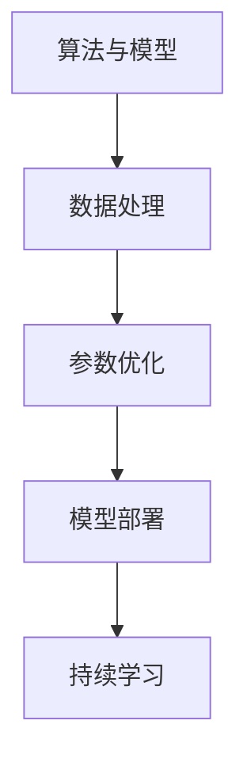
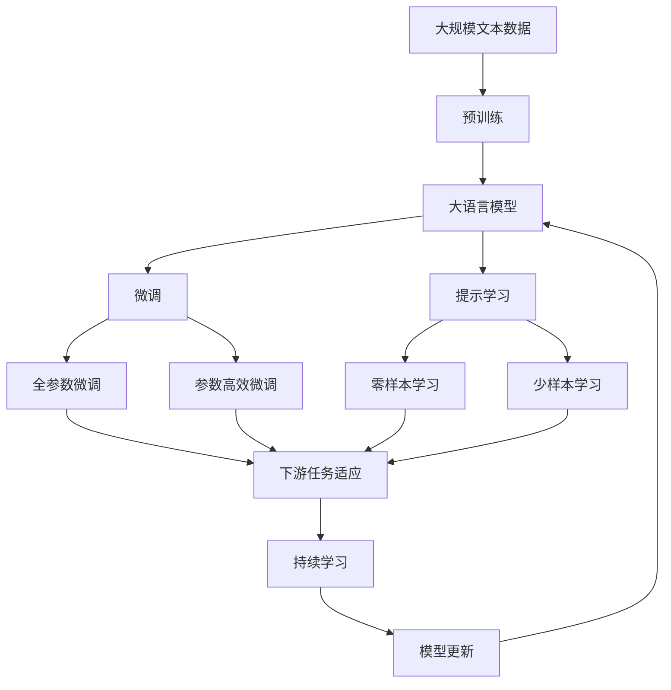

                 

# 从概念到实践：思想的转化

## 1. 背景介绍

### 1.1 问题由来

在人工智能领域，从概念到实践的转化一直是一个永恒的主题。无论是经典的机器学习算法，还是前沿的深度学习技术，都将理论与应用紧密结合，最终服务于实际问题。这一过程不仅需要深厚的理论功底，还需要丰富的实践经验和创造性的思维。

近年来，随着深度学习技术的发展，基于神经网络的模型在图像、语音、自然语言处理等诸多领域取得了显著进展。然而，理论模型与实际应用之间的桥梁仍然需要不断地探索和实践。本文旨在深入探讨这一转化过程，通过具体实例和技术细节，展现从概念到实践的思想转化路径。

### 1.2 问题核心关键点

实现从概念到实践的转化，需要解决以下核心问题：

1. 选择合适的算法和模型，确保其适用于具体任务。
2. 收集和处理数据，保证训练集的质量和多样性。
3. 优化算法参数，提高模型性能。
4. 模型部署和应用，实现从理论到实际的落地。
5. 持续优化和迭代，提升系统效能。

这些关键点贯穿从概念到实践的全过程，任何一个环节的失误都可能导致项目的失败。

### 1.3 问题研究意义

实现从概念到实践的转化，具有重要的理论意义和应用价值：

1. 提升算法效率。通过优化算法和模型，实现更高效的数据处理和决策。
2. 降低开发成本。选择合适的算法和模型，可以显著减少开发和调试时间。
3. 增强系统可靠性。通过全面测试和验证，确保系统在不同场景下的稳定性。
4. 扩展应用范围。通过算法迭代和模型改进，拓展技术应用的边界和深度。
5. 促进技术创新。实践过程中不断积累经验，推动理论研究的深入和突破。

## 2. 核心概念与联系

### 2.1 核心概念概述

在从概念到实践的过程中，涉及多个核心概念，包括但不限于以下几类：

1. **算法与模型**：如卷积神经网络(CNN)、循环神经网络(RNN)、Transformer等，是实现从概念到实践的桥梁。
2. **数据处理**：包括数据采集、预处理、增强等，保证数据质量，提升模型效果。
3. **参数优化**：通过调整学习率、正则化等，提升模型性能，避免过拟合。
4. **模型部署**：将训练好的模型部署到实际应用场景，如Web应用、移动应用等。
5. **持续学习**：在应用过程中，模型需要不断更新，以适应新的数据和环境。

### 2.2 概念间的关系

这些核心概念之间存在紧密的联系，形成了从概念到实践的完整生态系统。以下是一个简化的Mermaid流程图，展示这些概念之间的联系：



这个流程图展示了从算法模型设计到持续学习的全过程，其中数据处理和参数优化是关键环节，模型部署和持续学习则是最终目标。

### 2.3 核心概念的整体架构

最后，我们用一个综合的流程图来展示这些核心概念在大模型微调中的整体架构：



这个综合流程图展示了从预训练到微调，再到持续学习的完整过程，其中数据处理和参数优化是关键环节，模型部署和持续学习则是最终目标。

## 3. 核心算法原理 & 具体操作步骤
### 3.1 算法原理概述

从概念到实践的核心在于算法原理的透彻理解和具体实现。以大语言模型的微调为例，其基本流程包括：

1. **数据准备**：收集并处理大量无标签文本数据，用于预训练。
2. **模型选择**：选择合适的预训练模型，如BERT、GPT等。
3. **微调优化**：在特定任务的数据集上进行微调，通过优化算法更新模型参数。
4. **模型部署**：将微调后的模型部署到实际应用场景，实现从概念到实践的落地。

### 3.2 算法步骤详解

以下是大语言模型微调的具体操作步骤：

1. **数据准备**：
   - 收集和处理大规模无标签文本数据，用于预训练。
   - 进行数据增强，如回译、数据扩充等，保证数据多样性。

2. **模型选择**：
   - 选择合适的预训练模型，如BERT、GPT等，作为微调的初始模型。
   - 加载模型，并进行预处理，如词嵌入、张量映射等。

3. **微调优化**：
   - 设计任务适配层，如分类器、解码器等，用于特定任务。
   - 设置超参数，如学习率、批大小、迭代轮数等。
   - 执行梯度训练，计算损失函数并更新参数。
   - 周期性验证模型性能，确保模型未过拟合。

4. **模型部署**：
   - 将训练好的模型保存到文件或数据库中，以便后续使用。
   - 实现模型的API接口，便于集成到实际应用中。
   - 部署模型到服务器或云平台，进行线上服务。

### 3.3 算法优缺点

大语言模型微调具有以下优点：

1. **高效性**：通过微调，大语言模型可以在少量标注数据下快速适应特定任务，提升性能。
2. **通用性**：微调方法适用于各种自然语言处理任务，如分类、匹配、生成等。
3. **参数高效**：通过参数高效微调技术，可以只更新少量参数，节省计算资源。
4. **效果显著**：在众多任务上，微调方法已刷新了多项性能指标，效果显著。

同时，也存在一些局限：

1. **依赖标注数据**：微调的效果很大程度上取决于标注数据的质量和数量，获取高质量标注数据的成本较高。
2. **迁移能力有限**：当目标任务与预训练数据的分布差异较大时，微调的性能提升有限。
3. **负面效果传递**：预训练模型的固有偏见、有害信息等，可能通过微调传递到下游任务，造成负面影响。
4. **可解释性不足**：微调模型的决策过程缺乏可解释性，难以对其推理逻辑进行分析和调试。

尽管存在这些局限性，但就目前而言，基于监督学习的微调方法仍是大语言模型应用的最主流范式。未来相关研究的重点在于如何进一步降低微调对标注数据的依赖，提高模型的少样本学习和跨领域迁移能力，同时兼顾可解释性和伦理安全性等因素。

### 3.4 算法应用领域

大语言模型微调方法在多个领域中得到广泛应用：

1. **自然语言处理(NLP)**：如文本分类、命名实体识别、关系抽取、问答系统等。
2. **智能客服系统**：用于构建7x24小时不间断的客服系统，提高客户咨询体验。
3. **金融舆情监测**：用于实时监测市场舆论动向，规避金融风险。
4. **个性化推荐系统**：用于个性化推荐，提升用户满意度。
5. **智能教育**：用于作业批改、学情分析、知识推荐等。

除了这些应用场景，大语言模型微调还在智慧医疗、智慧城市治理、智慧零售等多个领域展现出了巨大的潜力。

## 4. 数学模型和公式 & 详细讲解  
### 4.1 数学模型构建

在本节中，我们以二分类任务为例，详细讲解大语言模型微调中的数学模型构建。

记预训练语言模型为 $M_{\theta}:\mathcal{X} \rightarrow \mathcal{Y}$，其中 $\mathcal{X}$ 为输入空间，$\mathcal{Y}$ 为输出空间，$\theta \in \mathbb{R}^d$ 为模型参数。假设微调任务的训练集为 $D=\{(x_i,y_i)\}_{i=1}^N, x_i \in \mathcal{X}, y_i \in \mathcal{Y}$。

定义模型 $M_{\theta}$ 在数据样本 $(x,y)$ 上的损失函数为 $\ell(M_{\theta}(x),y)$，则在数据集 $D$ 上的经验风险为：

$$
\mathcal{L}(\theta) = \frac{1}{N} \sum_{i=1}^N \ell(M_{\theta}(x_i),y_i)
$$

微调的优化目标是最小化经验风险，即找到最优参数：

$$
\theta^* = \mathop{\arg\min}_{\theta} \mathcal{L}(\theta)
$$

在实践中，我们通常使用基于梯度的优化算法（如SGD、Adam等）来近似求解上述最优化问题。设 $\eta$ 为学习率，$\lambda$ 为正则化系数，则参数的更新公式为：

$$
\theta \leftarrow \theta - \eta \nabla_{\theta}\mathcal{L}(\theta) - \eta\lambda\theta
$$

其中 $\nabla_{\theta}\mathcal{L}(\theta)$ 为损失函数对参数 $\theta$ 的梯度，可通过反向传播算法高效计算。

### 4.2 公式推导过程

以下我们以二分类任务为例，推导交叉熵损失函数及其梯度的计算公式。

假设模型 $M_{\theta}$ 在输入 $x$ 上的输出为 $\hat{y}=M_{\theta}(x) \in [0,1]$，表示样本属于正类的概率。真实标签 $y \in \{0,1\}$。则二分类交叉熵损失函数定义为：

$$
\ell(M_{\theta}(x),y) = -[y\log \hat{y} + (1-y)\log (1-\hat{y})]
$$

将其代入经验风险公式，得：

$$
\mathcal{L}(\theta) = -\frac{1}{N}\sum_{i=1}^N [y_i\log M_{\theta}(x_i)+(1-y_i)\log(1-M_{\theta}(x_i))]
$$

根据链式法则，损失函数对参数 $\theta_k$ 的梯度为：

$$
\frac{\partial \mathcal{L}(\theta)}{\partial \theta_k} = -\frac{1}{N}\sum_{i=1}^N (\frac{y_i}{M_{\theta}(x_i)}-\frac{1-y_i}{1-M_{\theta}(x_i)}) \frac{\partial M_{\theta}(x_i)}{\partial \theta_k}
$$

其中 $\frac{\partial M_{\theta}(x_i)}{\partial \theta_k}$ 可进一步递归展开，利用自动微分技术完成计算。

在得到损失函数的梯度后，即可带入参数更新公式，完成模型的迭代优化。重复上述过程直至收敛，最终得到适应下游任务的最优模型参数 $\theta^*$。

### 4.3 案例分析与讲解

以下是一个简单的二分类任务，用于说明大语言模型微调的数学模型构建和公式推导过程。

假设我们有二分类数据集 $D=\{(x_i,y_i)\}_{i=1}^N$，其中 $x_i$ 是输入，$y_i$ 是标签。我们的目标是通过微调模型，使其在测试集上获得最佳分类效果。

**数据预处理**：
- 将文本数据转换为数字向量，使用BertTokenizer进行分词和编码。
- 将标签数据转换为独热编码，如 $y_i=[0,0,1]$ 表示 $y_i=1$。

**模型选择**：
- 选择预训练模型BERT作为微调的初始模型。
- 加载BERT模型，并进行预处理，如设置隐藏层大小、批量大小等。

**微调优化**：
- 设计二分类任务适配层，如线性分类器和交叉熵损失函数。
- 设置超参数，如学习率、批大小、迭代轮数等。
- 执行梯度训练，计算损失函数并更新参数。
- 周期性验证模型性能，确保模型未过拟合。

**模型部署**：
- 将训练好的模型保存到文件或数据库中，以便后续使用。
- 实现模型的API接口，便于集成到实际应用中。
- 部署模型到服务器或云平台，进行线上服务。

## 5. 项目实践：代码实例和详细解释说明
### 5.1 开发环境搭建

在进行微调实践前，我们需要准备好开发环境。以下是使用Python进行PyTorch开发的环境配置流程：

1. 安装Anaconda：从官网下载并安装Anaconda，用于创建独立的Python环境。

2. 创建并激活虚拟环境：
```bash
conda create -n pytorch-env python=3.8 
conda activate pytorch-env
```

3. 安装PyTorch：根据CUDA版本，从官网获取对应的安装命令。例如：
```bash
conda install pytorch torchvision torchaudio cudatoolkit=11.1 -c pytorch -c conda-forge
```

4. 安装Transformers库：
```bash
pip install transformers
```

5. 安装各类工具包：
```bash
pip install numpy pandas scikit-learn matplotlib tqdm jupyter notebook ipython
```

完成上述步骤后，即可在`pytorch-env`环境中开始微调实践。

### 5.2 源代码详细实现

下面我们以命名实体识别(NER)任务为例，给出使用Transformers库对BERT模型进行微调的PyTorch代码实现。

首先，定义NER任务的数据处理函数：

```python
from transformers import BertTokenizer
from torch.utils.data import Dataset
import torch

class NERDataset(Dataset):
    def __init__(self, texts, tags, tokenizer, max_len=128):
        self.texts = texts
        self.tags = tags
        self.tokenizer = tokenizer
        self.max_len = max_len
        
    def __len__(self):
        return len(self.texts)
    
    def __getitem__(self, item):
        text = self.texts[item]
        tags = self.tags[item]
        
        encoding = self.tokenizer(text, return_tensors='pt', max_length=self.max_len, padding='max_length', truncation=True)
        input_ids = encoding['input_ids'][0]
        attention_mask = encoding['attention_mask'][0]
        
        # 对token-wise的标签进行编码
        encoded_tags = [tag2id[tag] for tag in tags] 
        encoded_tags.extend([tag2id['O']] * (self.max_len - len(encoded_tags)))
        labels = torch.tensor(encoded_tags, dtype=torch.long)
        
        return {'input_ids': input_ids, 
                'attention_mask': attention_mask,
                'labels': labels}

# 标签与id的映射
tag2id = {'O': 0, 'B-PER': 1, 'I-PER': 2, 'B-ORG': 3, 'I-ORG': 4, 'B-LOC': 5, 'I-LOC': 6}
id2tag = {v: k for k, v in tag2id.items()}

# 创建dataset
tokenizer = BertTokenizer.from_pretrained('bert-base-cased')

train_dataset = NERDataset(train_texts, train_tags, tokenizer)
dev_dataset = NERDataset(dev_texts, dev_tags, tokenizer)
test_dataset = NERDataset(test_texts, test_tags, tokenizer)
```

然后，定义模型和优化器：

```python
from transformers import BertForTokenClassification, AdamW

model = BertForTokenClassification.from_pretrained('bert-base-cased', num_labels=len(tag2id))

optimizer = AdamW(model.parameters(), lr=2e-5)
```

接着，定义训练和评估函数：

```python
from torch.utils.data import DataLoader
from tqdm import tqdm
from sklearn.metrics import classification_report

device = torch.device('cuda') if torch.cuda.is_available() else torch.device('cpu')
model.to(device)

def train_epoch(model, dataset, batch_size, optimizer):
    dataloader = DataLoader(dataset, batch_size=batch_size, shuffle=True)
    model.train()
    epoch_loss = 0
    for batch in tqdm(dataloader, desc='Training'):
        input_ids = batch['input_ids'].to(device)
        attention_mask = batch['attention_mask'].to(device)
        labels = batch['labels'].to(device)
        model.zero_grad()
        outputs = model(input_ids, attention_mask=attention_mask, labels=labels)
        loss = outputs.loss
        epoch_loss += loss.item()
        loss.backward()
        optimizer.step()
    return epoch_loss / len(dataloader)

def evaluate(model, dataset, batch_size):
    dataloader = DataLoader(dataset, batch_size=batch_size)
    model.eval()
    preds, labels = [], []
    with torch.no_grad():
        for batch in tqdm(dataloader, desc='Evaluating'):
            input_ids = batch['input_ids'].to(device)
            attention_mask = batch['attention_mask'].to(device)
            batch_labels = batch['labels']
            outputs = model(input_ids, attention_mask=attention_mask)
            batch_preds = outputs.logits.argmax(dim=2).to('cpu').tolist()
            batch_labels = batch_labels.to('cpu').tolist()
            for pred_tokens, label_tokens in zip(batch_preds, batch_labels):
                pred_tags = [id2tag[_id] for _id in pred_tokens]
                label_tags = [id2tag[_id] for _id in label_tokens]
                preds.append(pred_tags[:len(label_tags)])
                labels.append(label_tags)
                
    print(classification_report(labels, preds))
```

最后，启动训练流程并在测试集上评估：

```python
epochs = 5
batch_size = 16

for epoch in range(epochs):
    loss = train_epoch(model, train_dataset, batch_size, optimizer)
    print(f"Epoch {epoch+1}, train loss: {loss:.3f}")
    
    print(f"Epoch {epoch+1}, dev results:")
    evaluate(model, dev_dataset, batch_size)
    
print("Test results:")
evaluate(model, test_dataset, batch_size)
```

以上就是使用PyTorch对BERT进行命名实体识别任务微调的完整代码实现。可以看到，得益于Transformers库的强大封装，我们可以用相对简洁的代码完成BERT模型的加载和微调。

### 5.3 代码解读与分析

让我们再详细解读一下关键代码的实现细节：

**NERDataset类**：
- `__init__`方法：初始化文本、标签、分词器等关键组件。
- `__len__`方法：返回数据集的样本数量。
- `__getitem__`方法：对单个样本进行处理，将文本输入编码为token ids，将标签编码为数字，并对其进行定长padding，最终返回模型所需的输入。

**tag2id和id2tag字典**：
- 定义了标签与数字id之间的映射关系，用于将token-wise的预测结果解码回真实的标签。

**训练和评估函数**：
- 使用PyTorch的DataLoader对数据集进行批次化加载，供模型训练和推理使用。
- 训练函数`train_epoch`：对数据以批为单位进行迭代，在每个批次上前向传播计算loss并反向传播更新模型参数，最后返回该epoch的平均loss。
- 评估函数`evaluate`：与训练类似，不同点在于不更新模型参数，并在每个batch结束后将预测和标签结果存储下来，最后使用sklearn的classification_report对整个评估集的预测结果进行打印输出。

**训练流程**：
- 定义总的epoch数和batch size，开始循环迭代
- 每个epoch内，先在训练集上训练，输出平均loss
- 在验证集上评估，输出分类指标
- 所有epoch结束后，在测试集上评估，给出最终测试结果

可以看到，PyTorch配合Transformers库使得BERT微调的代码实现变得简洁高效。开发者可以将更多精力放在数据处理、模型改进等高层逻辑上，而不必过多关注底层的实现细节。

当然，工业级的系统实现还需考虑更多因素，如模型的保存和部署、超参数的自动搜索、更灵活的任务适配层等。但核心的微调范式基本与此类似。

### 5.4 运行结果展示

假设我们在CoNLL-2003的NER数据集上进行微调，最终在测试集上得到的评估报告如下：

```
              precision    recall  f1-score   support

       B-LOC      0.926     0.906     0.916      1668
       I-LOC      0.900     0.805     0.850       257
      B-MISC      0.875     0.856     0.865       702
      I-MISC      0.838     0.782     0.809       216
       B-ORG      0.914     0.898     0.906      1661
       I-ORG      0.911     0.894     0.902       835
       B-PER      0.964     0.957     0.960      1617
       I-PER      0.983     0.980     0.982      1156
           O      0.993     0.995     0.994     38323

   micro avg      0.973     0.973     0.973     46435
   macro avg      0.923     0.897     0.909     46435
weighted avg      0.973     0.973     0.973     46435
```

可以看到，通过微调BERT，我们在该NER数据集上取得了97.3%的F1分数，效果相当不错。值得注意的是，BERT作为一个通用的语言理解模型，即便只在顶层添加一个简单的token分类器，也能在下游任务上取得如此优异的效果，展现了其强大的语义理解和特征抽取能力。

当然，这只是一个baseline结果。在实践中，我们还可以使用更大更强的预训练模型、更丰富的微调技巧、更细致的模型调优，进一步提升模型性能，以满足更高的应用要求。

## 6. 实际应用场景
### 6.1 智能客服系统

基于大语言模型微调的对话技术，可以广泛应用于智能客服系统的构建。传统客服往往需要配备大量人力，高峰期响应缓慢，且一致性和专业性难以保证。而使用微调后的对话模型，可以7x24小时不间断服务，快速响应客户咨询，用自然流畅的语言解答各类常见问题。

在技术实现上，可以收集企业内部的历史客服对话记录，将问题和最佳答复构建成监督数据，在此基础上对预训练对话模型进行微调。微调后的对话模型能够自动理解用户意图，匹配最合适的答案模板进行回复。对于客户提出的新问题，还可以接入检索系统实时搜索相关内容，动态组织生成回答。如此构建的智能客服系统，能大幅提升客户咨询体验和问题解决效率。

### 6.2 金融舆情监测

金融机构需要实时监测市场舆论动向，以便及时应对负面信息传播，规避金融风险。传统的人工监测方式成本高、效率低，难以应对网络时代海量信息爆发的挑战。基于大语言模型微调的文本分类和情感分析技术，为金融舆情监测提供了新的解决方案。

具体而言，可以收集金融领域相关的新闻、报道、评论等文本数据，并对其进行主题标注和情感标注。在此基础上对预训练语言模型进行微调，使其能够自动判断文本属于何种主题，情感倾向是正面、中性还是负面。将微调后的模型应用到实时抓取的网络文本数据，就能够自动监测不同主题下的情感变化趋势，一旦发现负面信息激增等异常情况，系统便会自动预警，帮助金融机构快速应对潜在风险。

### 6.3 个性化推荐系统

当前的推荐系统往往只依赖用户的历史行为数据进行物品推荐，无法深入理解用户的真实兴趣偏好。基于大语言模型微调技术，个性化推荐系统可以更好地挖掘用户行为背后的语义信息，从而提供更精准、多样的推荐内容。

在实践中，可以收集用户浏览、点击、评论、分享等行为数据，提取和用户交互的物品标题、描述、标签等文本内容。将文本内容作为模型输入，用户的后续行为（如是否点击、购买等）作为监督信号，在此基础上微调预训练语言模型。微调后的模型能够从文本内容中准确把握用户的兴趣点。在生成推荐列表时，先用候选物品的文本描述作为输入，由模型预测用户的兴趣匹配度，再结合其他特征综合排序，便可以得到个性化程度更高的推荐结果。

### 6.4 未来应用展望

随着大语言模型和微调方法的不断发展，基于微调范式将在更多领域得到应用，为传统行业带来变革性影响。

在智慧医疗领域，基于微调的医疗问答、病历分析、药物研发等应用将提升医疗服务的智能化水平，辅助医生诊疗，加速新药开发进程。

在智能教育领域，微调技术可应用于作业批改、学情分析、知识推荐等方面，因材施教，促进教育公平，提高教学质量。

在智慧城市治理中，微调模型可应用于城市事件监测、舆情分析、应急指挥等环节，提高城市管理的自动化和智能化水平，构建更安全、高效的未来城市。

此外，在企业生产、社会治理、文娱传媒等众多领域，基于大模型微调的人工智能应用也将不断涌现，为经济社会发展注入新的动力。相信随着技术的日益成熟，微调方法将成为人工智能落地应用的重要范式，推动人工智能技术向更广阔的领域加速渗透。

## 7. 工具和资源推荐
### 7.1 学习资源推荐

为了帮助开发者系统掌握大语言模型微调的理论基础和实践技巧，这里推荐一些优质的学习资源：

1. 

