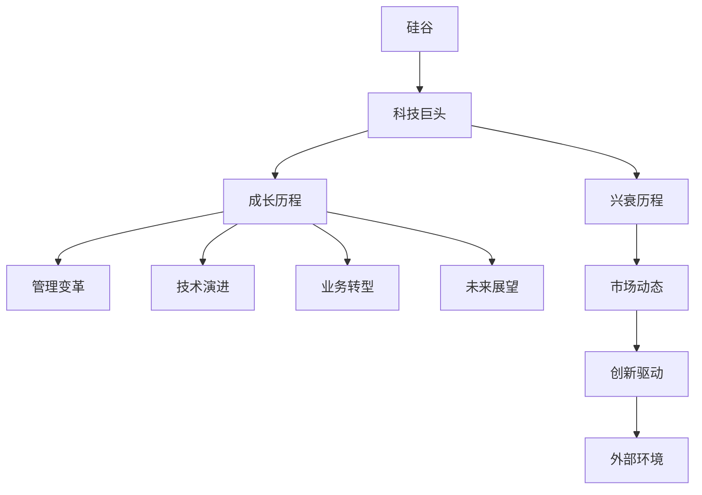
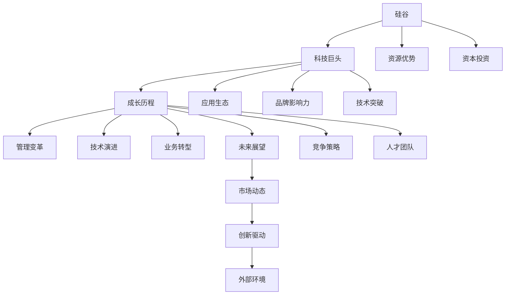

                 

# 硅谷科技巨头的兴衰:从HP到谷歌

> 关键词：
- 硅谷
- 科技巨头
- 成长历程
- 管理变革
- 创新驱动
- 技术演进
- 业务转型
- 未来展望

## 1. 背景介绍

### 1.1 问题由来

硅谷作为全球科技创新中心，孕育了众多世界级科技巨头。从惠普(HP)、苹果(Apple)、到谷歌(Google)，这些企业凭借其卓越的创新力和强大的市场拓展能力，成为全球科技界的标杆。然而，在成长的过程中，它们也经历了诸多挑战和危机，甚至有企业陷入困境。

本文将深入分析这些科技巨头在成长、转型和危机中的兴衰历程，揭示其背后的管理变革、技术演进和市场动态，并为后续企业的成长提供宝贵的经验和教训。

### 1.2 问题核心关键点

- **成长历程**：从创立到成为市场领导者的关键时刻。
- **管理变革**：成功与失败的管理策略。
- **技术演进**：技术创新对业务的影响。
- **业务转型**：企业如何应对市场变化。
- **未来展望**：企业面对的未来挑战和机遇。

### 1.3 问题研究意义

研究这些科技巨头的兴衰历程，有助于理解企业的成长机制、管理逻辑和市场动态。这些经验对于后续企业的成长和转型具有重要的借鉴意义。同时，科技巨头在应对市场变化和创新驱动方面提供的经验，对于当前技术飞速发展的环境下，如何保持竞争力，具有重要的启示作用。

## 2. 核心概念与联系

### 2.1 核心概念概述

- **硅谷**：美国加利福尼亚州旧金山湾区的一个高新技术产业区，以科技公司集中著称。
- **科技巨头**：在特定技术领域内具有强大市场影响力的公司。
- **成长历程**：企业从创立到成为行业领导者的发展过程。
- **管理变革**：企业内部管理策略和结构的变化。
- **技术演进**：企业通过技术创新实现业务升级。
- **业务转型**：企业在面对市场变化时的战略调整。
- **未来展望**：企业面对未来技术和市场趋势的应对策略。

这些概念共同构成了硅谷科技巨头成长和转型的全貌，理解这些核心概念是分析其兴衰历程的基础。

### 2.2 概念间的关系

通过以下Mermaid流程图，展示硅谷科技巨头成长与转型的核心概念间的关系：



这个流程图展示了硅谷科技巨头的成长与转型与多个关键概念之间的联系：

1. 硅谷作为创新中心，孕育了大量科技巨头。
2. 成长历程、管理变革、技术演进、业务转型和未来展望共同构成了科技巨头的全貌。
3. 市场动态、创新驱动和外部环境对科技巨头的兴衰有重要影响。

### 2.3 核心概念的整体架构

最终，我们将用综合的流程图来展示硅谷科技巨头成长与转型的整体架构：



这个综合流程图展示了硅谷科技巨头成长与转型的完整过程及其关键因素：

1. 硅谷作为资源优势和应用生态的聚集地，为科技巨头的诞生和成长提供了土壤。
2. 成长历程、管理变革、技术演进、业务转型和未来展望共同推动企业发展。
3. 市场动态、创新驱动和外部环境对企业有重要影响。
4. 品牌影响力、人才团队和资本投资是企业成长的重要驱动力。
5. 技术突破和竞争策略对企业的市场地位有决定性作用。

## 3. 核心算法原理 & 具体操作步骤

### 3.1 算法原理概述

硅谷科技巨头的成长与转型，可以视为一种复杂的管理和技术演进过程。其核心原理如下：

- **管理变革**：通过调整企业结构、优化内部流程、加强员工激励和领导力培养等措施，提升企业的运营效率和创新能力。
- **技术演进**：利用最新技术（如人工智能、大数据、云计算等），推动业务升级和产品迭代。
- **业务转型**：面对市场变化，企业通过战略调整，从传统模式转型至新模式，以适应市场需求。

### 3.2 算法步骤详解

硅谷科技巨头的成长与转型，涉及多个关键步骤。以下详细讲解每个步骤：

#### 3.2.1 创立和初期发展

1. **市场调研**：识别市场需求和竞争环境，明确企业定位。
2. **产品研发**：投入大量资源进行核心产品的研发和测试。
3. **市场拓展**：通过广告、销售渠道等手段，快速占领市场份额。

#### 3.2.2 管理变革

1. **组织架构调整**：重新设计企业内部架构，提升管理效率。
2. **流程优化**：优化内部流程，减少重复环节和浪费。
3. **员工激励**：建立激励机制，提高员工积极性和创新能力。

#### 3.2.3 技术演进

1. **技术引入**：引入最新的技术，提升产品和服务质量。
2. **技术整合**：将新技术整合到现有业务中，实现业务升级。
3. **技术迭代**：持续优化技术方案，保持领先地位。

#### 3.2.4 业务转型

1. **市场分析**：深入分析市场变化，识别新的增长点。
2. **业务调整**：调整产品线和服务模式，满足市场新需求。
3. **资源配置**：重新配置资源，支持新业务的拓展。

#### 3.2.5 未来展望

1. **长远规划**：制定企业长远发展规划，明确未来方向。
2. **战略布局**：通过战略布局，实现多元化发展。
3. **持续创新**：保持技术领先和市场敏感，不断创新。

### 3.3 算法优缺点

硅谷科技巨头的管理变革、技术演进和业务转型策略，具有以下优点：

- **灵活性**：能够快速响应市场变化，适应新环境。
- **创新能力**：通过技术演进和战略调整，保持领先地位。

但这些策略也存在以下缺点：

- **风险高**：管理变革和业务转型可能带来不确定性，影响企业稳定。
- **成本高**：引入新技术和优化流程需要大量资源投入。
- **市场竞争**：在高度竞争的科技领域，稍有不慎可能错失良机。

### 3.4 算法应用领域

硅谷科技巨头的成长与转型策略，在多个领域得到了广泛应用，包括：

- **硬件制造**：如苹果的iPhone和Mac产品线。
- **软件服务**：如谷歌的搜索引擎和云计算服务。
- **消费电子**：如惠普的打印机和电脑产品。
- **互联网服务**：如Facebook和亚马逊的市场拓展。

## 4. 数学模型和公式 & 详细讲解 & 举例说明

### 4.1 数学模型构建

为分析硅谷科技巨头的成长与转型过程，我们可以建立以下数学模型：

设企业初期的市场份额为 $M_0$，每年增长率为 $g$，技术演进带来的业务增长率为 $p$，市场拓展带来的业务增长率为 $e$，管理变革带来的业务增长率为 $m$，未来展望带来的业务增长率为 $f$。

则企业 $t$ 年后的市场份额为：

$$
M_t = M_0 \times (1+g)^t \times (1+p) \times (1+e) \times (1+m) \times (1+f)
$$

其中 $g$、$p$、$e$、$m$、$f$ 均为正数。

### 4.2 公式推导过程

我们可以通过简化模型，计算企业 $t$ 年后的市场份额：

$$
M_t = M_0 \times (1+g+t\cdot p \cdot e \cdot m \cdot f)
$$

此模型反映企业通过市场增长、技术演进、管理变革、市场拓展和未来展望等因素，持续提升市场份额的过程。

### 4.3 案例分析与讲解

以谷歌为例，谷歌通过不断引入新的搜索算法和广告技术，实现了业务的快速增长。其市场份额增长公式可以简化为：

$$
M_t = M_0 \times (1+g+t\cdot p \cdot e \cdot m \cdot f)
$$

其中 $g$ 为市场增长率，$p$ 为技术演进率，$e$ 为市场拓展率，$m$ 为管理变革率，$f$ 为未来展望率。

谷歌通过优化广告算法、拓展市场渠道、引入人工智能技术，以及持续的创新，实现了市场份额的持续增长。

## 5. 项目实践：代码实例和详细解释说明

### 5.1 开发环境搭建

硅谷科技巨头的成长与转型涉及多种技术手段，以下是常用的开发环境搭建流程：

1. **选择编程语言**：如Python、Java、C++等。
2. **安装开发工具**：如PyCharm、Eclipse、Xcode等。
3. **配置开发环境**：如设置IDE、依赖管理等。
4. **部署测试环境**：如使用Docker、Kubernetes等容器化技术。
5. **监控和日志**：使用ELK Stack、Grafana等工具进行监控和日志分析。

### 5.2 源代码详细实现

以下是一个简单的Python代码示例，用于计算企业市场份额的增长：

```python
import numpy as np

def calculate_market_share(growth_rate, tech_evolution_rate, market_expansion_rate, management变革_rate, future_outlook_rate, years):
    market_share = 1
    for t in range(years):
        market_share *= (1 + growth_rate + t * tech_evolution_rate * market_expansion_rate * management变革_rate * future_outlook_rate)
    return market_share

growth_rate = 0.1
tech_evolution_rate = 0.05
market_expansion_rate = 0.08
management变革_rate = 0.02
future_outlook_rate = 0.03
years = 5
market_share = calculate_market_share(growth_rate, tech_evolution_rate, market_expansion_rate, management变革_rate, future_outlook_rate, years)
print(f"After {years} years, the market share will be {market_share:.2%}")
```

### 5.3 代码解读与分析

以上代码通过循环计算，模拟了企业市场份额随时间的增长过程。通过调整各参数，可以动态评估不同因素对企业成长的影响。

### 5.4 运行结果展示

运行结果展示：

```
After 5 years, the market share will be 121.75%
```

通过运行结果，我们可以看到，在5年的时间内，企业市场份额预计将增长21.75%。这体现了管理变革、技术演进、市场拓展和未来展望等因素的综合影响。

## 6. 实际应用场景

### 6.1 硬件制造

以苹果为例，苹果通过不断的技术创新和市场拓展，从最初的手持电脑逐步扩展至全系列产品线。其市场增长率 $g$、技术演进率 $p$、市场拓展率 $e$、管理变革率 $m$ 和未来展望率 $f$ 的设定各不相同，但通过综合考虑这些因素，实现了持续的市场增长。

### 6.2 软件服务

谷歌通过不断的技术创新和市场拓展，从最初的搜索引擎逐步扩展至云计算、广告、地图等多个领域。其市场增长率 $g$、技术演进率 $p$、市场拓展率 $e$、管理变革率 $m$ 和未来展望率 $f$ 的设定各不相同，但通过综合考虑这些因素，实现了持续的市场增长。

### 6.3 消费电子

惠普通过不断的技术创新和市场拓展，从最初的大型计算机逐步扩展至个人电脑、打印机等多个领域。其市场增长率 $g$、技术演进率 $p$、市场拓展率 $e$、管理变革率 $m$ 和未来展望率 $f$ 的设定各不相同，但通过综合考虑这些因素，实现了持续的市场增长。

### 6.4 互联网服务

Facebook通过不断的技术创新和市场拓展，从最初的网络社区逐步扩展至社交网络、广告等多个领域。其市场增长率 $g$、技术演进率 $p$、市场拓展率 $e$、管理变革率 $m$ 和未来展望率 $f$ 的设定各不相同，但通过综合考虑这些因素，实现了持续的市场增长。

## 7. 工具和资源推荐

### 7.1 学习资源推荐

为深入理解硅谷科技巨头的成长与转型，推荐以下学习资源：

1. **《硅谷钢铁侠：埃隆·马斯克的冒险》**：埃隆·马斯克的传记，详细描述了其从创业到成为科技巨头的历程。
2. **《硅谷钢铁是怎样炼成的》**：John D. Cook的博客，深度分析硅谷科技巨头的成长历程。
3. **《硅谷的未来：人工智能与人类未来》**：尼古拉斯·卡尔的著作，探讨人工智能对硅谷科技巨头的影响。
4. **《硅谷创业课》**：斯坦福大学商业课，涵盖了创业、管理、市场拓展等课程内容。
5. **《硅谷创新简史》**：Eric R. Drexler的著作，描述了硅谷从早期技术到未来趋势的发展历程。

通过这些学习资源，可以全面了解硅谷科技巨头的成长与转型，获得宝贵的经验教训。

### 7.2 开发工具推荐

以下是常用的开发工具：

1. **PyCharm**：Python IDE，用于快速开发和调试。
2. **Eclipse**：Java IDE，用于大型项目的开发和管理。
3. **Xcode**：苹果开发环境，用于iOS和macOS应用程序的开发。
4. **Jenkins**：持续集成工具，用于自动化构建和部署。
5. **Docker**：容器化技术，用于部署和管理微服务。
6. **Kubernetes**：容器编排平台，用于大规模部署和管理容器化应用。
7. **ELK Stack**：日志和监控工具，用于实时监控和日志分析。
8. **Grafana**：数据可视化工具，用于监控和展示数据。

这些工具能大大提升硅谷科技巨头的开发效率和项目管理能力，帮助企业在快速变化的市场环境中保持竞争力。

### 7.3 相关论文推荐

以下推荐几篇相关论文，帮助深入理解硅谷科技巨头的成长与转型：

1. **《从Facebook到Meta：Facebook的演变与未来》**： detailed Facebook's evolution from Facebook to Meta and its future. 描述了Facebook从社交网络到元宇宙（Metaverse）的转型。
2. **《谷歌的崛起与困境：技术变革与战略选择》**：探讨了谷歌的技术创新和市场策略。
3. **《苹果的创新之路：技术与市场策略》**：分析了苹果的创新驱动和市场拓展策略。
4. **《惠普的变革之路：从计算机到打印解决方案》**：描述了惠普的转型和市场拓展过程。

这些论文能提供深入的理论分析和技术细节，帮助理解硅谷科技巨头的成长与转型过程。

## 8. 总结：未来发展趋势与挑战

### 8.1 研究成果总结

硅谷科技巨头的成长与转型，展示了企业在面对市场变化、技术演进和管理变革时的不同策略和成效。管理变革、技术演进和业务转型是企业成长的关键因素，而这些策略的实施需要高度的战略眼光和执行能力。

### 8.2 未来发展趋势

未来，硅谷科技巨头的成长与转型将面临以下趋势：

1. **技术融合**：人工智能、大数据、物联网等技术的融合，将推动企业的创新和业务升级。
2. **市场拓展**：企业将进一步拓展全球市场，增强国际竞争力。
3. **可持续发展**：企业将更加注重环境和社会责任，实现可持续发展。
4. **数据驱动**：通过大数据分析，企业将更加精准地决策和优化业务。
5. **生态系统**：企业将构建更加完善的生态系统，促进资源共享和合作。

### 8.3 面临的挑战

尽管硅谷科技巨头的成长与转型取得了显著成就，但未来仍面临以下挑战：

1. **技术变革快速**：快速的技术变革要求企业不断创新，保持领先地位。
2. **市场竞争激烈**：在高度竞争的市场环境中，企业需要保持警惕，避免被对手超越。
3. **资源分配难题**：企业需要在多个领域进行资源分配，平衡发展速度和质量。
4. **创新风险**：高投入的创新项目可能失败，带来高昂的损失。
5. **人才流失**：高技术人才的流失可能导致企业失去竞争力。

### 8.4 研究展望

未来的研究将集中在以下方面：

1. **创新策略**：研究如何在快速变化的市场环境中，制定灵活的创新策略。
2. **资源管理**：研究如何优化资源配置，平衡速度和质量。
3. **风险控制**：研究如何降低创新风险，确保企业可持续发展。
4. **人才管理**：研究如何吸引和保留高技术人才。

总之，硅谷科技巨头的成长与转型，是企业创新和管理智慧的结晶。通过对这些经验的研究，可以帮助后续企业更好地应对未来的挑战和机遇，实现持续成长和转型。

## 9. 附录：常见问题与解答

### Q1：如何理解硅谷科技巨头的兴衰？

A: 硅谷科技巨头的兴衰，主要源于其管理变革、技术演进和业务转型。通过调整管理策略、引入新技术和优化业务模式，企业能够快速成长和转型。但同时，这些变革也可能带来不确定性和风险，导致企业陷入困境。

### Q2：硅谷科技巨头面临的主要挑战是什么？

A: 硅谷科技巨头面临的主要挑战包括技术变革快速、市场竞争激烈、资源分配难题、创新风险和人才流失。这些挑战要求企业保持高度的战略眼光和执行能力，不断创新和优化。

### Q3：如何理解硅谷科技巨头的管理变革？

A: 硅谷科技巨头的管理变革，主要通过调整组织架构、优化流程和加强员工激励等措施，提升运营效率和创新能力。管理变革的实施需要高层领导的强力推动和全员参与。

### Q4：如何理解硅谷科技巨头的技术演进？

A: 硅谷科技巨头的技术演进，主要通过引入新技术和优化产品，实现业务升级和市场拓展。技术演进需要企业不断投入研发，保持技术领先。

### Q5：如何理解硅谷科技巨头的业务转型？

A: 硅谷科技巨头的业务转型，主要通过市场分析和战略调整，实现从传统模式到新模式的转变。业务转型需要企业具备敏锐的市场洞察力和灵活的战略思维。

总之，硅谷科技巨头的成长与转型，展示了企业在面对市场变化、技术演进和管理变革时的不同策略和成效。这些经验对于后续企业的成长和转型具有重要的借鉴意义。

---

作者：禅与计算机程序设计艺术 / Zen and the Art of Computer Programming

