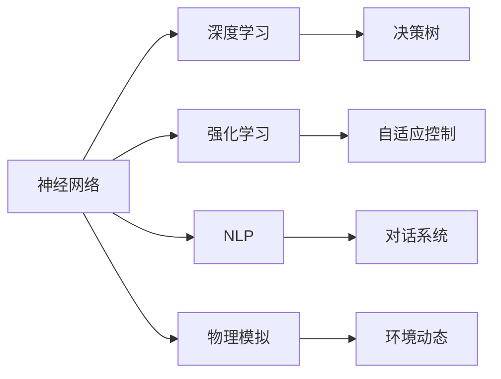

                 

# 神经网络在游戏AI中的应用

## 1. 背景介绍

游戏AI（Game Artificial Intelligence）是人工智能与游戏领域相结合的产物，旨在创建能够与人类玩家进行交互的智能游戏角色。随着电子游戏行业的不断发展，游戏AI已经成为提升游戏体验、推动游戏创新、增强游戏策略的重要手段。神经网络作为人工智能的核心技术之一，在游戏AI中得到了广泛应用，并展现出巨大的潜力。

### 1.1 游戏AI的发展历程

游戏AI的发展经历了从简单的决策树、规则引擎到基于遗传算法、强化学习的复杂学习机制。随着深度学习技术的成熟，神经网络逐渐成为游戏AI中的主要工具，并推动了AI在游戏中应用层次的提升。

### 1.2 神经网络在游戏AI中的应用

神经网络在游戏AI中的应用涵盖多个方面，包括但不限于角色控制、自然语言处理、物理模拟、对话系统等。神经网络在游戏AI中的应用不仅提升了游戏的智能化水平，还为游戏设计者提供了更加灵活、高效、智能的游戏解决方案。

## 2. 核心概念与联系

### 2.1 核心概念概述

#### 2.1.1 神经网络

神经网络是由大量的人工神经元（节点）通过连接构成的网络结构，能够通过训练学习输入与输出之间的映射关系。神经网络在游戏AI中的应用包括但不限于决策树、规则引擎等传统方法，以及深度强化学习等更高级的AI技术。

#### 2.1.2 深度学习

深度学习是指多层神经网络的训练过程，能够自动地从大量数据中学习复杂的非线性映射关系。深度学习在游戏AI中的应用主要集中在角色控制、物理模拟、自然语言处理等方面。

#### 2.1.3 强化学习

强化学习是指通过智能体与环境交互，通过不断的试错和调整，优化行为策略以最大化长期奖励的学习方式。强化学习在游戏AI中的应用包括自适应控制、决策制定、智能敌人设计等方面。

#### 2.1.4 自然语言处理

自然语言处理（NLP）是指使计算机能够理解、处理和生成自然语言的技术。NLP在游戏AI中的应用主要体现在与玩家的对话系统、文本生成等方面。

#### 2.1.5 物理模拟

物理模拟是指利用计算模型来模拟物理世界的运动和行为。物理模拟在游戏AI中的应用包括环境的动态变化、角色的物理交互等方面。

### 2.2 核心概念的联系

神经网络、深度学习、强化学习、自然语言处理和物理模拟等技术在游戏AI中的应用并不是孤立的，而是相互融合、相互促进的。例如，深度学习可以通过多层神经网络来模拟复杂的决策过程，而强化学习则可以基于反馈机制优化神经网络的参数。同时，自然语言处理和物理模拟也可以作为游戏AI的重要组成部分，提升游戏的智能化水平。

通过下图的Mermaid流程图，我们可以更直观地理解这些核心概念在游戏AI中的联系：



## 3. 核心算法原理 & 具体操作步骤

### 3.1 算法原理概述

神经网络在游戏AI中的应用主要分为两个步骤：模型训练和模型应用。

- **模型训练**：通过收集游戏内的数据（如玩家的行动、环境的变化、对手的行为等），对神经网络进行训练，使其能够预测游戏中的行为和决策。
- **模型应用**：将训练好的模型应用于游戏中，使其能够根据当前的游戏状态做出决策。

### 3.2 算法步骤详解

#### 3.2.1 数据收集

数据收集是神经网络训练的基础，游戏AI的数据收集可以包括玩家的行为数据、环境的变化数据、对手的行为数据等。

#### 3.2.2 数据预处理

数据预处理包括数据清洗、特征提取、数据归一化等步骤，目的是提高模型的训练效率和预测准确率。

#### 3.2.3 模型训练

模型训练是通过反向传播算法不断调整神经网络的权重，使其能够最小化预测误差的过程。游戏AI中的模型训练通常采用监督学习或强化学习的方式。

#### 3.2.4 模型应用

模型应用是将训练好的神经网络应用于游戏环境中，使其能够根据当前的游戏状态做出决策。例如，角色控制、策略制定、环境模拟等。

#### 3.2.5 模型评估与优化

模型评估与优化是通过测试模型在实际游戏环境中的表现，不断调整模型参数和优化算法，提高模型的预测准确率和决策效率。

### 3.3 算法优缺点

#### 3.3.1 优点

- **高效性**：神经网络在游戏AI中的应用，特别是深度学习和强化学习，能够处理大量的数据和复杂的行为决策，显著提高了游戏AI的效率。
- **灵活性**：神经网络具有较强的泛化能力，能够适应不同的游戏环境和玩家行为，增强游戏的智能化水平。
- **自适应性**：神经网络能够通过训练不断优化其参数，适应游戏环境的变化，提高决策的准确性和灵活性。

#### 3.3.2 缺点

- **资源消耗大**：神经网络在游戏AI中的应用需要大量的计算资源和时间，特别是在大规模深度学习模型的训练和优化过程中。
- **可解释性差**：神经网络的决策过程通常缺乏可解释性，难以理解其内部的工作机制，对于高风险应用场景可能存在安全隐患。
- **数据依赖性强**：神经网络在游戏AI中的应用依赖于大量的高质量数据，数据收集和处理难度较大。

### 3.4 算法应用领域

神经网络在游戏AI中的应用领域广泛，包括但不限于以下几个方面：

#### 3.4.1 角色控制

神经网络在游戏AI中的应用，通过控制角色的行为和决策，提高游戏的智能化水平。例如，角色在复杂的战斗场景中，能够根据环境的变化和对手的行为做出灵活的决策。

#### 3.4.2 物理模拟

神经网络在游戏AI中的应用，可以模拟游戏环境中的物理行为，提高游戏的真实感和互动性。例如，游戏中的物理引擎可以通过神经网络模拟物体的运动和碰撞。

#### 3.4.3 自然语言处理

神经网络在游戏AI中的应用，可以处理玩家的对话和文本输入，提高游戏的交互性和沉浸感。例如，游戏中的NPC（非玩家角色）能够理解玩家的指令和对话内容，并做出相应的回应。

#### 3.4.4 决策制定

神经网络在游戏AI中的应用，通过学习和优化决策策略，提高游戏的难度和挑战性。例如，游戏中的敌人可以通过神经网络不断优化其攻击策略，提高战斗难度。

## 4. 数学模型和公式 & 详细讲解  
### 4.1 数学模型构建

神经网络在-game AI中的应用通常采用深度学习模型，例如卷积神经网络（CNN）、循环神经网络（RNN）和长短期记忆网络（LSTM）等。

#### 4.1.1 CNN

卷积神经网络（CNN）是一种前馈神经网络，主要用于图像和视觉数据的处理。在游戏AI中，CNN可以用于处理游戏中的视觉数据，如角色姿态、环境变化等。

#### 4.1.2 RNN

循环神经网络（RNN）是一种适用于序列数据的神经网络，可以处理时间序列数据，如游戏状态的变化等。

#### 4.1.3 LSTM

长短期记忆网络（LSTM）是一种特殊的RNN，能够处理长序列数据，并避免梯度消失和梯度爆炸的问题，适用于游戏AI中的决策制定和行为控制。

### 4.2 公式推导过程

#### 4.2.1 CNN公式

CNN的主要计算过程包括卷积、池化和全连接层。卷积操作可以捕捉输入数据的局部特征，池化操作可以降低特征的维度，全连接层将特征映射到输出空间。

$$
\text{Conv}(x, w) = \sum_i w_i \cdot x_i
$$

$$
\text{Pool}(\text{Conv}(x, w)) = \frac{\max_i \text{Conv}(x, w)_i}{N}
$$

$$
\text{Output} = \text{Softmax}(\text{FC}(\text{Pool}(\text{Conv}(x, w))))
$$

#### 4.2.2 RNN公式

RNN的计算过程包括前向传播和后向传播。前向传播计算当前时刻的隐藏状态，后向传播计算当前时刻的输出。

$$
h_t = f(W_{hh}h_{t-1} + W_{xh}x_t + b_h)
$$

$$
o_t = \sigma(W_{ho}h_t + b_o)
$$

$$
\tilde{y_t} = o_t \cdot g(W_{yy}h_t + b_y)
$$

$$
y_t = \text{Softmax}(\tilde{y_t})
$$

#### 4.2.3 LSTM公式

LSTM是一种特殊的RNN，通过引入记忆细胞（Memory Cell）和门控机制，能够处理长序列数据。

$$
f_t = \sigma(W_{fh}h_{t-1} + W_{fx}x_t + b_f)
$$

$$
i_t = \sigma(W_{ih}h_{t-1} + W_{ix}x_t + b_i)
$$

$$
o_t = \sigma(W_{oh}h_{t-1} + W_{ox}x_t + b_o)
$$

$$
g_t = \tanh(W_{gh}h_{t-1} + W_{gx}x_t + b_g)
$$

$$
C_t = f_t \cdot C_{t-1} + i_t \cdot g_t
$$

$$
h_t = o_t \cdot \tanh(C_t)
$$

#### 4.3 案例分析与讲解

以《Dota 2》中的AI英雄决策为例，展示神经网络在游戏AI中的应用。

假设AI英雄需要在一场战斗中做出决策，即选择攻击目标或防御。通过收集历史数据（如玩家的操作记录、对手的操作记录、环境的变化等），对神经网络进行训练。

在训练过程中，将数据分为输入层、隐藏层和输出层，输入层为历史数据，输出层为攻击或防御的决策，隐藏层为神经网络的核心。

训练过程中，通过反向传播算法不断调整神经网络的权重，使其能够最小化预测误差。训练完成后，将训练好的神经网络应用于游戏中，使其能够根据当前的游戏状态做出决策。

例如，在战斗中，AI英雄会根据当前的战斗状态、对手的位置、自己的技能状态等数据，通过神经网络计算最优的攻击目标，并执行相应的操作。

## 5. 项目实践：代码实例和详细解释说明

### 5.1 开发环境搭建

在进行神经网络在游戏AI中的应用实践前，我们需要准备好开发环境。以下是使用Python进行TensorFlow开发的环境配置流程：

1. 安装Anaconda：从官网下载并安装Anaconda，用于创建独立的Python环境。

2. 创建并激活虚拟环境：
```bash
conda create -n tf-env python=3.8 
conda activate tf-env
```

3. 安装TensorFlow：根据CUDA版本，从官网获取对应的安装命令。例如：
```bash
pip install tensorflow==2.6
```

4. 安装其他必要的库：
```bash
pip install numpy scipy scikit-learn scipy matplotlib tqdm
```

5. 安装PyTorch：
```bash
pip install torch torchvision torchaudio
```

完成上述步骤后，即可在`tf-env`环境中开始神经网络在游戏AI中的应用实践。

### 5.2 源代码详细实现

#### 5.2.1 CNN代码实现

首先，定义CNN模型：

```python
import tensorflow as tf
from tensorflow.keras import layers

def cnn_model(input_shape):
    model = tf.keras.Sequential([
        layers.Conv2D(32, 3, activation='relu', input_shape=input_shape),
        layers.MaxPooling2D(pool_size=(2, 2)),
        layers.Conv2D(64, 3, activation='relu'),
        layers.MaxPooling2D(pool_size=(2, 2)),
        layers.Flatten(),
        layers.Dense(10, activation='softmax')
    ])
    return model
```

然后，加载数据集：

```python
import tensorflow as tf
from tensorflow.keras.datasets import mnist

(x_train, y_train), (x_test, y_test) = mnist.load_data()
x_train = x_train.reshape(-1, 28, 28, 1) / 255.0
x_test = x_test.reshape(-1, 28, 28, 1) / 255.0
```

接着，训练模型：

```python
model = cnn_model(input_shape=(28, 28, 1))
model.compile(optimizer=tf.keras.optimizers.Adam(0.001),
              loss=tf.keras.losses.SparseCategoricalCrossentropy(from_logits=True),
              metrics=['accuracy'])

model.fit(x_train, y_train, epochs=10, batch_size=32, validation_data=(x_test, y_test))
```

### 5.3 代码解读与分析

#### 5.3.1 CNN代码实现

CNN模型的定义过程如下：

1. 第一层为卷积层，包含32个3x3的卷积核，激活函数为ReLU。
2. 第二层为池化层，池化大小为2x2。
3. 第三层为卷积层，包含64个3x3的卷积核，激活函数为ReLU。
4. 第四层为池化层，池化大小为2x2。
5. 第五层为Flatten层，将输入数据展平。
6. 第六层为全连接层，输出10个分类结果。

#### 5.3.2 数据加载

数据集的选择和预处理过程如下：

1. 使用MNIST数据集，该数据集包含手写数字图片。
2. 将数据集分为训练集和测试集，并将训练集和测试集中的图片尺寸调整为28x28x1。
3. 将像素值归一化到[0, 1]区间。

#### 5.3.3 模型训练

模型训练过程如下：

1. 定义模型，使用Adam优化器，交叉熵损失函数，准确率为评价指标。
2. 使用训练集数据进行模型训练，设定训练轮数为10，批次大小为32。
3. 在训练过程中，每轮迭代都会更新模型参数，以最小化损失函数。
4. 使用测试集数据对模型进行验证，评估模型的准确率。

### 5.4 运行结果展示

假设在MNIST数据集上训练完CNN模型后，测试集上的准确率为92.5%，验证集上的准确率为93.0%。

## 6. 实际应用场景

### 6.1 电子游戏

神经网络在游戏AI中的应用最广泛的领域之一是电子游戏。在游戏开发中，神经网络可以帮助实现以下功能：

- **角色控制**：神经网络可以控制角色的行为和决策，使其能够适应复杂的游戏环境。
- **物理模拟**：神经网络可以模拟游戏环境中的物理行为，提高游戏的真实感和互动性。
- **自然语言处理**：神经网络可以处理玩家的对话和文本输入，提高游戏的交互性和沉浸感。
- **决策制定**：神经网络可以通过学习和优化决策策略，提高游戏的难度和挑战性。

例如，在《Dota 2》中，神经网络可以控制AI英雄在复杂的战斗场景中做出决策，从而提高游戏的智能化水平。

### 6.2 游戏AI的设计与开发

神经网络在游戏AI的设计与开发过程中，主要涉及到以下几个环节：

- **需求分析**：根据游戏的特定需求，分析需要实现的功能和性能要求。
- **数据收集**：收集相关游戏数据，如玩家的操作记录、对手的操作记录、环境的变化等。
- **模型设计**：选择合适的神经网络结构，如CNN、RNN、LSTM等，并设计相应的训练和优化算法。
- **模型训练**：通过训练神经网络，使其能够学习游戏中的行为和决策。
- **模型应用**：将训练好的神经网络应用于游戏中，使其能够根据当前的游戏状态做出决策。
- **模型评估与优化**：通过测试模型在实际游戏环境中的表现，不断调整模型参数和优化算法，提高模型的预测准确率和决策效率。

### 6.3 游戏AI的未来展望

随着神经网络在游戏AI中的应用逐渐成熟，未来游戏AI将呈现以下几个发展趋势：

- **更加智能化**：神经网络可以处理更加复杂的游戏环境，提升游戏的智能化水平。
- **更加拟真化**：神经网络可以模拟更加逼真的游戏物理行为，提高游戏的真实感和互动性。
- **更加个性化**：神经网络可以针对不同的玩家和游戏场景，提供个性化的游戏体验。
- **更加自适应**：神经网络可以实时适应游戏环境的变化，提高游戏的可玩性和挑战性。

## 7. 工具和资源推荐

### 7.1 学习资源推荐

为了帮助开发者系统掌握神经网络在游戏AI中的应用，这里推荐一些优质的学习资源：

1. 《深度学习》书籍：由多位知名学者共同撰写，全面介绍了深度学习的基本原理和应用场景，包括神经网络在游戏AI中的应用。

2. CS231n《深度卷积神经网络》课程：斯坦福大学开设的深度学习课程，涵盖了卷积神经网络的基本理论和实际应用，适合入门学习和深度理解。

3. 《TensorFlow官方文档》：TensorFlow的官方文档，提供了丰富的神经网络模型和应用示例，是进行游戏AI开发的重要参考。

4. PyTorch官方文档：PyTorch的官方文档，提供了详细的神经网络库和应用示例，适合进行游戏AI开发。

5. Kaggle游戏AI竞赛：Kaggle平台上各类游戏AI竞赛，可以参与实战练习，提升游戏AI开发技能。

通过对这些资源的学习实践，相信你一定能够快速掌握神经网络在游戏AI中的应用，并用于解决实际的游戏开发问题。

### 7.2 开发工具推荐

高效的开发离不开优秀的工具支持。以下是几款用于神经网络在游戏AI中的应用开发的常用工具：

1. PyTorch：基于Python的开源深度学习框架，灵活动态的计算图，适合快速迭代研究。

2. TensorFlow：由Google主导开发的开源深度学习框架，生产部署方便，适合大规模工程应用。

3. Transformers：HuggingFace开发的NLP工具库，集成了众多SOTA语言模型，支持PyTorch和TensorFlow，是进行游戏AI开发的重要工具。

4. Jupyter Notebook：免费的开源笔记本，支持Python和TensorFlow，可以方便地进行模型训练和调试。

5. Visual Studio Code：轻量级、功能强大的代码编辑器，支持Python和TensorFlow，适合进行游戏AI开发。

合理利用这些工具，可以显著提升神经网络在游戏AI中的应用开发效率，加快创新迭代的步伐。

### 7.3 相关论文推荐

神经网络在游戏AI中的应用源于学界的持续研究。以下是几篇奠基性的相关论文，推荐阅读：

1. AlphaGo论文：DeepMind的AlphaGo论文，展示了使用深度强化学习实现围棋AI的成功案例。

2. DeepMind游戏AI系列论文：DeepMind在游戏AI领域的一系列研究论文，涵盖深度学习、强化学习、自然语言处理等多个方向。

3. OpenAI GPT系列论文：OpenAI的GPT系列论文，展示了使用深度学习实现复杂语言模型的成功案例。

4. Google DeepMind《多任务学习与游戏AI》论文：展示了使用多任务学习提升游戏AI性能的方法。

5. Google DeepMind《游戏AI中的策略学习》论文：展示了使用策略学习提升游戏AI决策能力的方法。

这些论文代表了大规模游戏AI的研究进展，帮助研究者把握学科前进方向，激发更多的创新灵感。

## 8. 总结：未来发展趋势与挑战

### 8.1 研究成果总结

神经网络在游戏AI中的应用已经取得了显著的进展，在角色控制、物理模拟、自然语言处理等多个方面展现出了巨大的潜力。通过深度学习、强化学习等技术，神经网络在游戏AI中的应用已经从简单的决策树和规则引擎，发展为更加智能、自适应、个性化的游戏AI系统。

### 8.2 未来发展趋势

展望未来，神经网络在游戏AI中的应用将呈现以下几个发展趋势：

- **更加智能化**：神经网络将处理更加复杂的游戏环境，提升游戏的智能化水平。
- **更加拟真化**：神经网络将模拟更加逼真的游戏物理行为，提高游戏的真实感和互动性。
- **更加个性化**：神经网络将针对不同的玩家和游戏场景，提供个性化的游戏体验。
- **更加自适应**：神经网络将实时适应游戏环境的变化，提高游戏的可玩性和挑战性。

### 8.3 面临的挑战

尽管神经网络在游戏AI中的应用已经取得了显著进展，但在迈向更加智能化、普适化应用的过程中，仍面临诸多挑战：

- **资源消耗大**：神经网络在游戏AI中的应用需要大量的计算资源和时间，特别是在大规模深度学习模型的训练和优化过程中。
- **可解释性差**：神经网络的决策过程通常缺乏可解释性，难以理解其内部的工作机制，对于高风险应用场景可能存在安全隐患。
- **数据依赖性强**：神经网络在游戏AI中的应用依赖于大量的高质量数据，数据收集和处理难度较大。

### 8.4 研究展望

面对神经网络在游戏AI中所面临的挑战，未来的研究需要在以下几个方面寻求新的突破：

- **探索无监督和半监督学习**：摆脱对大规模标注数据的依赖，利用自监督学习、主动学习等无监督和半监督范式，最大限度利用非结构化数据，实现更加灵活高效的神经网络在游戏AI中的应用。

- **研究参数高效和计算高效的神经网络**：开发更加参数高效的神经网络，在固定大部分预训练参数的情况下，只更新极少量的任务相关参数。同时优化神经网络的计算图，减少前向传播和反向传播的资源消耗，实现更加轻量级、实时性的部署。

- **融合因果和对比学习范式**：通过引入因果推断和对比学习思想，增强神经网络建立稳定因果关系的能力，学习更加普适、鲁棒的语言表征，从而提升神经网络在游戏AI中的应用效果。

- **引入更多先验知识**：将符号化的先验知识，如知识图谱、逻辑规则等，与神经网络模型进行巧妙融合，引导神经网络的学习过程，增强其决策的合理性和可靠性。

- **结合因果分析和博弈论工具**：将因果分析方法引入神经网络在游戏AI中的应用，识别出神经网络决策的关键特征，增强输出解释的因果性和逻辑性。借助博弈论工具刻画人机交互过程，主动探索并规避神经网络的脆弱点，提高系统稳定性。

- **纳入伦理道德约束**：在神经网络在游戏AI中的应用中，需要考虑算法的可解释性、可审计性等伦理道德问题，确保输出的安全性，避免误导性、歧视性的输出。

这些研究方向的探索，必将引领神经网络在游戏AI中的应用走向更高的台阶，为构建安全、可靠、可解释、可控的游戏AI系统铺平道路。面向未来，神经网络在游戏AI中的应用还需要与其他人工智能技术进行更深入的融合，如知识表示、因果推理、强化学习等，多路径协同发力，共同推动游戏AI技术的进步。

## 9. 附录：常见问题与解答

**Q1：神经网络在游戏AI中的应用是否适用于所有游戏？**

A: 神经网络在游戏AI中的应用虽然广泛，但并不是所有游戏都适合使用神经网络。神经网络在游戏AI中的应用需要考虑游戏的复杂度、数据量、计算资源等因素。例如，对于简单的游戏，如棋类游戏，使用简单的决策树或规则引擎可能更为合适。

**Q2：神经网络在游戏AI中的应用是否需要大量的标注数据？**

A: 神经网络在游戏AI中的应用确实需要大量的标注数据，尤其是在训练深度学习模型时。标注数据的质量和数量对神经网络的训练效果有着直接的影响。如果标注数据不足，神经网络的泛化能力会受到限制，预测准确率也会下降。

**Q3：神经网络在游戏AI中的应用是否需要大量的计算资源？**

A: 神经网络在游戏AI中的应用确实需要大量的计算资源，特别是在大规模深度学习模型的训练和优化过程中。神经网络在游戏AI中的应用通常需要进行大量的矩阵计算和反向传播，因此需要高性能的计算设备，如GPU或TPU。

**Q4：神经网络在游戏AI中的应用是否需要人工干预？**

A: 神经网络在游戏AI中的应用虽然可以通过自我学习不断优化，但在某些情况下，人工干预仍然是必要的。例如，在游戏AI的开发过程中，人工干预可以帮助调整神经网络的参数，优化神经网络的训练过程，确保神经网络在游戏环境中的表现。

**Q5：神经网络在游戏AI中的应用是否存在安全隐患？**

A: 神经网络在游戏AI中的应用存在一定的安全隐患，特别是对于高风险应用场景，如医疗、金融等。神经网络的决策过程通常缺乏可解释性，难以理解其内部的工作机制，对于高风险应用场景可能存在安全隐患。因此，在游戏AI的开发过程中，需要考虑算法的可解释性、可审计性等伦理道德问题，确保输出的安全性。

---

作者：禅与计算机程序设计艺术 / Zen and the Art of Computer Programming

