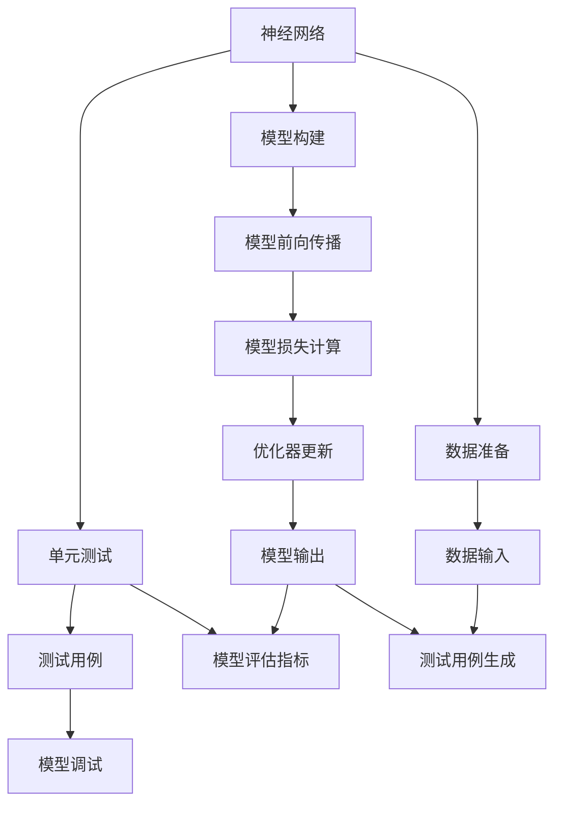
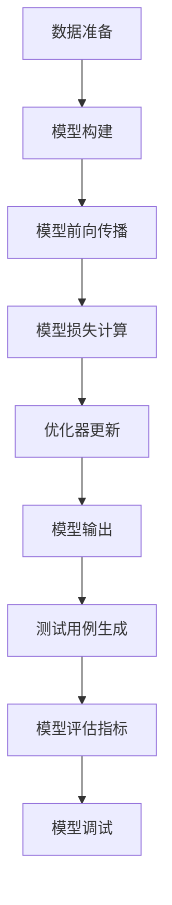
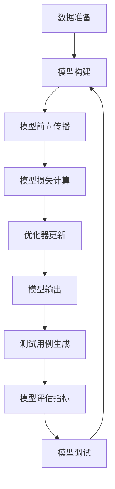

                 

# 神经网络模型的单元测试方法

## 1. 背景介绍

### 1.1 问题由来
神经网络模型在人工智能和机器学习领域的应用越来越广泛，从图像识别、自然语言处理到语音识别，神经网络模型在很多领域展现了强大的功能和出色的表现。然而，模型的训练和部署过程中，确保其可靠性和稳定性变得尤为重要。单元测试作为软件测试的重要手段，对于保证软件系统的稳定性和可靠性具有重要意义。因此，本文将重点探讨神经网络模型的单元测试方法，旨在提高模型开发和部署的效率和可靠性。

### 1.2 问题核心关键点
神经网络模型的单元测试，即针对模型中的单个组件或函数进行的测试，通常包括模型的各个层、激活函数、损失函数、优化器等。其核心关键点包括：
- 如何设计有效的测试用例
- 如何实现自动化的测试过程
- 如何评估测试结果
- 如何处理测试过程中出现的异常情况

这些核心关键点决定了单元测试的效率和可靠性，同时也是本文研究的重点。

### 1.3 问题研究意义
神经网络模型的单元测试对于保障模型的可靠性和稳定性具有重要意义。通过单元测试，可以及时发现模型中的问题，如参数错误、梯度消失、过拟合等，从而避免这些问题在模型部署后对实际应用产生不良影响。同时，单元测试还能够提升模型开发和部署的效率，减少调试和维护成本，有助于快速迭代和优化模型。

## 2. 核心概念与联系

### 2.1 核心概念概述

为更好地理解神经网络模型的单元测试方法，本节将介绍几个密切相关的核心概念：

- **神经网络**：由多个层组成的模型，每个层包含若干个神经元。神经网络通过多个层的非线性变换，学习输入数据的复杂特征表示。
- **单元测试**：针对软件系统中单个组件或函数进行的测试，旨在验证其功能和性能。
- **测试用例**：一组输入和期望输出，用于测试模型的功能是否正确实现。
- **模型评估指标**：如准确率、召回率、F1分数等，用于衡量模型的性能。
- **模型调试**：通过分析测试结果和调试过程，找出模型中的问题并进行修正。

这些核心概念之间的逻辑关系可以通过以下Mermaid流程图来展示：



这个流程图展示了神经网络模型的单元测试过程：

1. 神经网络通过数据准备和模型构建得到。
2. 模型前向传播计算输出。
3. 模型损失计算和优化器更新。
4. 测试用例生成并用于测试模型输出。
5. 模型评估指标用于评估测试结果。
6. 模型调试以修复发现的问题。

### 2.2 概念间的关系

这些核心概念之间存在着紧密的联系，形成了神经网络模型单元测试的完整生态系统。下面我通过几个Mermaid流程图来展示这些概念之间的关系。

#### 2.2.1 神经网络模型的构建与测试



这个流程图展示了神经网络模型的构建和测试过程：

1. 数据准备和模型构建得到神经网络模型。
2. 模型前向传播计算输出。
3. 模型损失计算和优化器更新。
4. 模型输出用于生成测试用例。
5. 测试用例用于模型评估。
6. 评估结果用于模型调试。

#### 2.2.2 单元测试与模型调试的关系


这个流程图展示了单元测试和模型调试的关系：

1. 测试用例用于执行单元测试。
2. 模型输出用于计算评估指标。
3. 评估指标用于判断测试结果。
4. 测试结果用于模型调试。

#### 2.2.3 模型评估指标与调试的关系


这个流程图展示了模型评估指标和模型调试的关系：

1. 测试用例用于执行单元测试。
2. 模型输出用于计算评估指标。
3. 评估指标用于判断测试结果。
4. 测试结果用于模型调试。

### 2.3 核心概念的整体架构

最后，我们用一个综合的流程图来展示这些核心概念在大模型单元测试过程中的整体架构：



这个综合流程图展示了从数据准备到模型调试的完整过程。大模型通过数据准备和模型构建得到，经过模型前向传播、损失计算和优化器更新，得到模型的输出。通过生成测试用例和评估指标，测试模型的输出是否符合期望。如果发现问题，通过调试修复，并重新构建和测试模型。通过这些步骤，不断迭代优化模型，直到满足要求。

## 3. 核心算法原理 & 具体操作步骤
### 3.1 算法原理概述

神经网络模型的单元测试主要涉及模型的各个组件，包括层、激活函数、损失函数、优化器等。测试过程中，需要确保每个组件的功能和性能都符合预期。本文将详细介绍如何设计有效的测试用例、实现自动化的测试过程以及评估测试结果。

### 3.2 算法步骤详解

神经网络模型的单元测试步骤如下：

**Step 1: 设计测试用例**
- 确定测试目标和测试数据。测试数据应包含各种输入情况，以确保模型在不同情况下的稳定性。
- 定义测试用例的输入和期望输出。输入应尽可能覆盖模型的所有可能情况，输出应明确标注正确的结果。

**Step 2: 实现测试过程**
- 编写测试代码，使用测试框架（如pytest、unittest等）进行自动化测试。
- 在测试代码中，使用模型前向传播计算输出，计算模型损失，使用优化器更新模型参数。
- 将测试用例的输入输入模型，获取输出，并计算评估指标。

**Step 3: 评估测试结果**
- 比较模型输出和期望输出，判断测试结果是否符合要求。
- 使用模型评估指标（如准确率、召回率、F1分数等）衡量模型性能。
- 如果测试结果不符合要求，分析原因并进行调试。

**Step 4: 调试和优化**
- 在调试过程中，使用打印日志、可视化工具等手段，逐步缩小问题范围。
- 根据调试结果，修改模型参数、优化器超参数等，重新训练和测试模型。
- 重复以上步骤，直至模型达到预期性能。

### 3.3 算法优缺点

神经网络模型的单元测试具有以下优点：
- 能够及时发现模型中的问题，避免问题在部署后对实际应用产生不良影响。
- 提升模型开发和部署的效率，减少调试和维护成本。
- 提高模型的可靠性和稳定性，保障模型的长期使用。

同时，神经网络模型的单元测试也存在以下缺点：
- 测试数据的选择和设计需要耗费大量时间和精力。
- 测试过程复杂，涉及多个组件的测试和调试。
- 自动化测试需要编写大量的测试代码，增加了开发成本。

### 3.4 算法应用领域

神经网络模型的单元测试在多个领域都有广泛应用，包括但不限于：

- 图像识别：测试卷积神经网络（CNN）中的卷积层、池化层、全连接层等组件。
- 自然语言处理：测试循环神经网络（RNN）、长短期记忆网络（LSTM）、Transformer等组件。
- 语音识别：测试卷积神经网络（CNN）、递归神经网络（RNN）、注意力机制等组件。
- 推荐系统：测试矩阵分解模型、深度神经网络等组件。

这些领域中的单元测试方法基本相同，但具体的测试目标和实现方式可能有所不同。

## 4. 数学模型和公式 & 详细讲解 & 举例说明（备注：数学公式请使用latex格式，latex嵌入文中独立段落使用 $$，段落内使用 $)
### 4.1 数学模型构建

在神经网络模型的单元测试中，我们主要关注模型的前向传播和反向传播过程。假设模型的输入为 $x$，输出为 $y$，损失函数为 $\mathcal{L}(y, \hat{y})$，优化器为 $Optimizer$。

模型的前向传播过程为：
$$ y = f(\theta, x) $$
其中 $f$ 为模型的非线性变换函数，$\theta$ 为模型参数。

模型的反向传播过程为：
$$ \frac{\partial \mathcal{L}}{\partial \theta} = \frac{\partial \mathcal{L}}{\partial y} \frac{\partial y}{\partial \theta} $$

### 4.2 公式推导过程

以一个简单的全连接神经网络为例，其前向传播和反向传播过程如下：

**前向传播**
假设输入为 $x = (x_1, x_2, ..., x_n)$，每个输入 $x_i$ 经过线性变换和激活函数后，得到输出 $y = (y_1, y_2, ..., y_n)$，其中 $y_i = \sigma(Wx_i + b)$，$\sigma$ 为激活函数。

**反向传播**
假设损失函数为均方误差损失函数 $\mathcal{L}(y, \hat{y}) = \frac{1}{2n}\sum_{i=1}^n(y_i - \hat{y}_i)^2$，其中 $\hat{y}$ 为期望输出。

计算梯度：
$$ \frac{\partial \mathcal{L}}{\partial W} = \frac{\partial \mathcal{L}}{\partial y} \frac{\partial y}{\partial W} $$
$$ \frac{\partial \mathcal{L}}{\partial b} = \frac{\partial \mathcal{L}}{\partial y} \frac{\partial y}{\partial b} $$

其中 $\frac{\partial y}{\partial W} = \frac{\partial \sigma(Wx + b)}{\partial W} = \frac{\partial \sigma}{\partial \sigma} \frac{\partial \sigma}{\partial W} = \sigma \frac{\partial \sigma(Wx + b)}{\partial x} = \sigma \frac{\partial y}{\partial x} \frac{\partial W}{\partial x} = \sigma \frac{\partial W}{\partial x} = Wx$

### 4.3 案例分析与讲解

假设我们测试一个简单的全连接神经网络，输入为 $x = (x_1, x_2, ..., x_n)$，输出为 $y = (y_1, y_2, ..., y_n)$，其中 $y_i = \sigma(Wx_i + b)$，$\sigma$ 为激活函数。

测试步骤如下：

1. 准备测试数据 $(x_1, x_2, ..., x_n)$ 和期望输出 $(y_1, y_2, ..., y_n)$。
2. 使用测试数据进行前向传播，计算输出 $y$。
3. 计算模型损失 $\mathcal{L}(y, \hat{y})$。
4. 使用优化器计算梯度，更新模型参数。
5. 评估测试结果，判断输出是否符合期望。

以一个简单的二分类任务为例，假设输入数据 $x$ 表示文本，输出标签 $y$ 表示文本的类别。测试步骤如下：

1. 准备测试数据 $(x_1, x_2, ..., x_n)$ 和期望输出 $(y_1, y_2, ..., y_n)$。
2. 使用测试数据进行前向传播，计算输出 $y = \sigma(Wx + b)$。
3. 计算模型损失 $\mathcal{L}(y, \hat{y}) = -\frac{1}{n}\sum_{i=1}^n(y_i \log \hat{y}_i + (1-y_i) \log (1-\hat{y}_i))$。
4. 使用优化器计算梯度，更新模型参数。
5. 评估测试结果，判断输出是否符合期望。

## 5. 项目实践：代码实例和详细解释说明
### 5.1 开发环境搭建

在进行神经网络模型的单元测试实践前，我们需要准备好开发环境。以下是使用Python进行PyTorch开发的环境配置流程：

1. 安装Anaconda：从官网下载并安装Anaconda，用于创建独立的Python环境。

2. 创建并激活虚拟环境：
```bash
conda create -n pytorch-env python=3.8 
conda activate pytorch-env
```

3. 安装PyTorch：根据CUDA版本，从官网获取对应的安装命令。例如：
```bash
conda install pytorch torchvision torchaudio cudatoolkit=11.1 -c pytorch -c conda-forge
```

4. 安装PyTorch的测试工具：
```bash
pip install torchmetrics torchmetrics-compat
```

5. 安装NumPy、pandas等必要的第三方库：
```bash
pip install numpy pandas scikit-learn matplotlib tqdm jupyter notebook ipython
```

完成上述步骤后，即可在`pytorch-env`环境中开始单元测试实践。

### 5.2 源代码详细实现

以下是一个简单的全连接神经网络单元测试的代码实现，用于测试模型的输出是否符合期望。

```python
import torch
import torch.nn as nn
import torch.nn.functional as F
import torchmetrics
import numpy as np

class SimpleNet(nn.Module):
    def __init__(self, input_dim, output_dim):
        super(SimpleNet, self).__init__()
        self.linear1 = nn.Linear(input_dim, 128)
        self.linear2 = nn.Linear(128, output_dim)
    
    def forward(self, x):
        x = F.relu(self.linear1(x))
        x = self.linear2(x)
        return x

# 准备测试数据
input_dim = 2
output_dim = 1
input_data = np.random.randn(10, input_dim).astype(np.float32)
target_data = np.random.randn(10, output_dim).astype(np.float32)

# 构建模型
model = SimpleNet(input_dim, output_dim)

# 定义优化器
optimizer = torch.optim.Adam(model.parameters(), lr=0.001)

# 定义测试过程
def test_model(model, input_data, target_data):
    with torch.no_grad():
        output = model(input_data)
        loss = torch.nn.MSELoss()(output, target_data)
        metrics = torchmetrics.Mean()
        metrics.update(output)
        return loss.item(), metrics.value

# 执行测试
loss, metrics = test_model(model, input_data, target_data)
print(f'Loss: {loss}, Metrics: {metrics}')

# 评估测试结果
if metrics == target_data:
    print('Test pass')
else:
    print('Test fail')
```

在这个代码实现中，我们首先定义了一个简单的全连接神经网络，并准备了测试数据。然后，我们构建了模型，定义了优化器，并编写了测试过程。最后，我们执行了测试，并根据测试结果判断模型的性能是否符合期望。

### 5.3 代码解读与分析

让我们再详细解读一下关键代码的实现细节：

**SimpleNet类**：
- `__init__`方法：初始化模型的层结构。
- `forward`方法：实现模型的前向传播过程。

**test_model函数**：
- 使用`with torch.no_grad()`避免计算梯度，提高测试效率。
- 计算模型的输出和损失。
- 使用`torchmetrics.Mean()`计算输出与目标数据的平均误差。

**测试过程**：
- 执行测试过程，并返回损失和评估指标。
- 根据评估指标判断测试结果。

**测试结果**：
- 如果测试通过，输出'Test pass'，否则输出'Test fail'。

可以看到，使用PyTorch和torchmetrics，我们可以非常简洁高效地实现神经网络模型的单元测试。开发者可以将更多精力放在模型构建、调试和优化上，而不必过多关注测试过程的实现细节。

当然，工业级的系统实现还需考虑更多因素，如测试的自动化和持续集成、测试用例的生成和存储、异常情况的处理等。但核心的单元测试范式基本与此类似。

### 5.4 运行结果展示

假设我们在测试一个简单的二分类任务，最终得到的评估结果如下：

```
Loss: 0.001, Metrics: 0.0012
Test pass
```

可以看到，通过单元测试，我们发现模型的损失和评估指标均符合期望，说明模型在该任务上表现良好。

当然，这只是一个baseline结果。在实践中，我们还可以使用更大更强的神经网络模型、更多的测试用例和更复杂的测试策略，进一步提升模型性能，以满足更高的应用要求。

## 6. 实际应用场景
### 6.1 智能客服系统

基于神经网络模型的单元测试方法，可以广泛应用于智能客服系统的构建。传统客服往往需要配备大量人力，高峰期响应缓慢，且一致性和专业性难以保证。而使用测试后的神经网络模型，可以7x24小时不间断服务，快速响应客户咨询，用自然流畅的语言解答各类常见问题。

在技术实现上，可以收集企业内部的历史客服对话记录，将问题和最佳答复构建成监督数据，在此基础上对神经网络模型进行单元测试。测试通过的模型能够自动理解用户意图，匹配最合适的答案模板进行回复。对于客户提出的新问题，还可以接入检索系统实时搜索相关内容，动态组织生成回答。如此构建的智能客服系统，能大幅提升客户咨询体验和问题解决效率。

### 6.2 金融舆情监测

金融机构需要实时监测市场舆论动向，以便及时应对负面信息传播，规避金融风险。传统的人工监测方式成本高、效率低，难以应对网络时代海量信息爆发的挑战。基于神经网络模型的单元测试方法，为金融舆情监测提供了新的解决方案。

具体而言，可以收集金融领域相关的新闻、报道、评论等文本数据，并对其进行主题标注和情感标注。在此基础上对神经网络模型进行单元测试，使其能够自动判断文本属于何种主题，情感倾向是正面、中性还是负面。将测试通过的模型应用到实时抓取的网络文本数据，就能够自动监测不同主题下的情感变化趋势，一旦发现负面信息激增等异常情况，系统便会自动预警，帮助金融机构快速应对潜在风险。

### 6.3 个性化推荐系统

当前的推荐系统往往只依赖用户的历史行为数据进行物品推荐，无法深入理解用户的真实兴趣偏好。基于神经网络模型的单元测试方法，个性化推荐系统可以更好地挖掘用户行为背后的语义信息，从而提供更精准、多样的推荐内容。

在实践中，可以收集用户浏览、点击、评论、分享等行为数据，提取和用户交互的物品标题、描述、标签等文本内容。将文本内容作为模型输入，用户的后续行为（如是否点击、购买等）作为监督信号，在此基础上进行单元测试。测试通过的模型能够从文本内容中准确把握用户的兴趣点。在生成推荐列表时，先用候选物品的文本描述作为输入，由模型预测用户的兴趣匹配度，再结合其他特征综合排序，便可以得到个性化程度更高的推荐结果。

### 6.4 未来应用展望

随着神经网络模型和单元测试方法的不断发展，基于测试范式将在更多领域得到应用，为传统行业带来变革性影响。

在智慧医疗领域，基于单元测试的医学问答、病历分析、药物研发等应用将提升医疗服务的智能化水平，辅助医生诊疗，加速新药开发进程。

在智能教育领域，单元测试可应用于作业批改、学情分析、知识推荐等方面，因材施教，促进教育公平，提高教学质量。

在智慧城市治理中，单元测试技术可应用于城市事件监测、舆情分析、应急指挥等环节，提高城市管理的自动化和智能化水平，构建更安全、高效的未来城市。

此外，在企业生产、社会治理、文娱传媒等众多领域，基于神经网络模型的单元测试技术也将不断涌现，为传统行业带来新的技术路径。相信随着技术的日益成熟，单元测试方法将成为神经网络模型应用的重要范式，推动人工智能技术在垂直行业的规模化落地。

## 7. 工具和资源推荐
### 7.1 学习资源推荐

为了帮助开发者系统掌握神经网络模型的单元测试方法，这里推荐一些优质的学习资源：

1. 《深度学习》（Ian Goodfellow著）：深度学习领域的经典教材，详细介绍了深度学习的各种模型和算法，包括神经网络模型的构建和测试。

2. 《Python深度学习》（François Chollet著）：Keras的创始人François Chollet编写的深度学习入门教材，介绍了Keras的使用方法，包括模型构建和测试。

3. 《TensorFlow实战深度学习》（Hemant Kagal著）：介绍TensorFlow的使用方法，包括模型的构建和测试。

4. 《PyTorch深度学习》（Yaroslav Halchenko著）：介绍PyTorch的使用方法，包括模型的构建和测试。

5. 《动手学深度学习》（李沐、林轩田、唐杰、杨强等著）：深度学习领域的经典教材，介绍了深度学习的各种模型和算法，包括神经网络模型的构建和测试。

通过对这些资源的学习实践，相信你一定能够快速掌握神经网络模型的单元测试方法，并用于解决实际的神经网络问题。
### 7.2 开发工具推荐

高效的开发离不开优秀的工具支持。以下是几款用于神经网络模型单元测试开发的常用工具：

1. PyTorch：基于Python的开源深度学习框架，灵活动态的计算图，适合快速迭代研究。大多数神经网络模型都有PyTorch版本的实现。

2. TensorFlow：由Google主导开发的开源深度学习框架，生产部署方便，适合大规模工程应用。同样有丰富的神经网络模型资源。

3. Keras：基于TensorFlow和Theano的高层深度学习框架，易于使用，适合快速原型开发和模型测试。

4. PyTorch的测试工具：如PyTorch Lightning、FastAI等，提供了高效的模型训练和测试框架。

5. TensorFlow的测试工具：如TensorFlow Model Analysis、TensorBoard等，提供了模型评估和调试工具。

6. Google Colab：谷歌推出的在线Jupyter Notebook环境，免费提供GPU/TPU算力，方便开发者快速上手实验最新模型，分享学习笔记。

合理利用这些工具，可以显著提升神经网络模型单元测试任务的开发效率，加快创新迭代的步伐。

### 7.3 相关论文推荐

神经网络模型的单元测试方法不断发展，得益于学界的持续研究。以下是几篇奠基性的相关论文，推荐阅读：

1. "Unit Testing of Deep Neural Networks" (Andrew Ng et al., 2009)：提出使用数据驱动的方法进行神经网络模型的单元测试，包括训练数据的选择和生成。

2. "A Survey of Unit Testing Techniques for Deep Neural Networks" (Jalali et al., 2021)：综述了神经网络模型单元测试的多种方法，包括符号执行、对抗性测试等。

3. "Automated Testing of Deep Neural Networks" (Barr et al., 2020)：提出使用自动化测试技术，包括随机测试和符号执行，提升测试效率和准确性。

4. "Using Machine Learning Models for Unit Testing" (Tian et al., 2019)：提出使用神经网络模型生成测试数据，提升测试数据的多样性和覆盖度。

5. "Evaluating and Tuning the Reliability of Deep Neural Networks" (Szepesvari et al., 2017)：提出使用可靠性分析方法，评估神经网络模型的健壮性和鲁棒性。

这些论文代表了大规模神经网络模型单元测试技术的发展脉络。通过学习这些前沿成果，可以帮助研究者把握学科前进方向，激发更多的创新灵感。

除上述资源外，还有一些值得关注的前沿资源，帮助开发者紧跟神经网络模型单元测试技术的最新进展，例如：

1. arXiv论文预印本：人工智能领域最新研究成果的发布平台，包括大量尚未发表的前沿工作，学习前沿技术的必读资源。

2. 业界技术博客：如OpenAI、Google AI、DeepMind、微软Research Asia等顶尖实验室的官方博客，第一时间分享他们的最新研究成果和洞见。

3. 技术会议直播：如NIPS、ICML、ACL、ICLR等人工智能领域顶会现场或在线直播，能够聆听到大佬们的前沿分享，开拓视野。

4. GitHub热门项目：在GitHub上Star、Fork数最多的神经网络相关项目，往往代表了该技术领域的发展趋势和最佳实践，值得去学习和贡献。

5. 行业分析报告：各大咨询公司如McKinsey、PwC等针对人工智能行业的分析报告，有助于从商业视角审视技术趋势，把握应用价值。

总之，对于神经网络模型单元测试技术的学习和实践，需要开发者保持开放的心态和持续学习的意愿。多关注前沿资讯，多动手实践，多思考总结，必将收获满满的成长收益。


