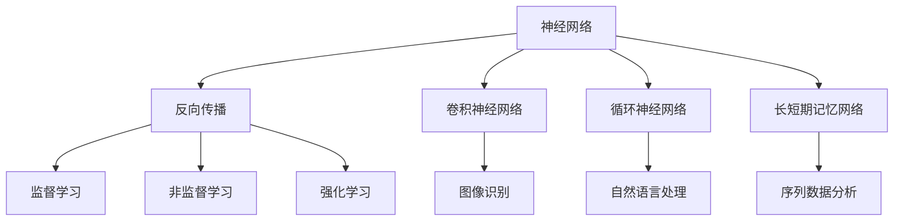
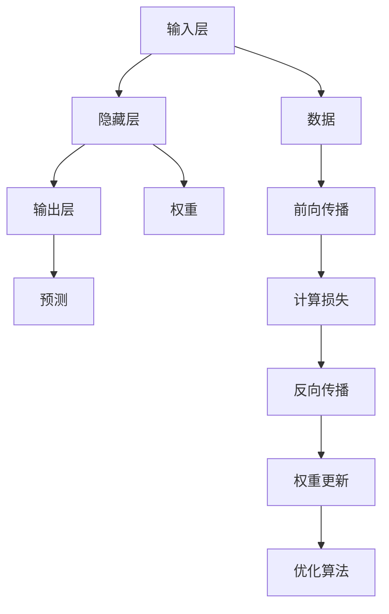
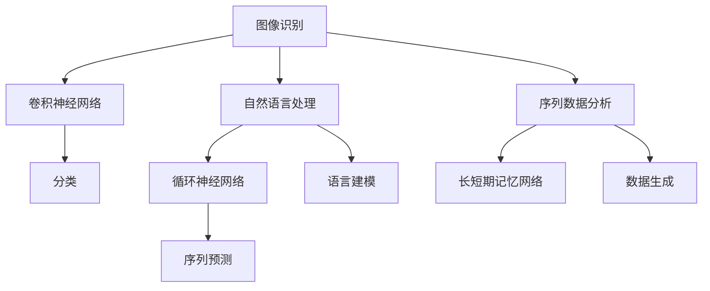
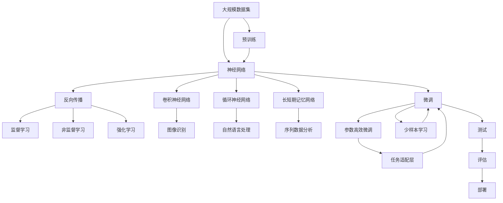

                 

# 神经网络：改变世界的技术

## 1. 背景介绍

### 1.1 问题由来
在人工智能领域，神经网络技术无疑是最具颠覆性的创新之一。自1980年代中期以来，深度学习技术的不断演进，已经让神经网络成为了解决复杂问题的重要工具。这一技术在图像识别、语音识别、自然语言处理、推荐系统等多个领域取得了卓越成果，对整个世界的生产方式、生活方式和社会结构都产生了深远影响。

### 1.2 问题核心关键点
神经网络的核心在于其复杂的多层网络结构和强大的非线性建模能力。神经网络的每个神经元接收一组输入，通过非线性激活函数产生新的输出。神经网络通过学习大量的数据，自动寻找数据中的隐含规律，并进行有效的特征提取和模式识别。

神经网络的特点包括：
- 多层结构：包含输入层、隐藏层和输出层，层层递进，层次分明。
- 非线性激活函数：通过引入非线性函数，使神经网络能够表示任意复杂的函数映射。
- 反向传播算法：用于训练神经网络的优化算法，通过计算损失函数的梯度反向传播，更新网络权重。
- 大规模数据需求：需要大量的标注数据进行训练，以学习泛化能力强的模型。
- 计算资源需求高：训练神经网络需要高性能计算设备，如GPU/TPU。
- 可解释性差：模型参数众多，难以直观解释模型的内部工作机制。

## 2. 核心概念与联系

### 2.1 核心概念概述
为更好地理解神经网络的原理和应用，本节将介绍几个密切相关的核心概念：

- 神经网络(Neural Network)：由多层神经元组成的网络结构，能够进行复杂的非线性映射。
- 反向传播算法(Backpropagation)：一种用于优化神经网络的梯度下降算法，通过计算损失函数的梯度反向传播，更新网络权重。
- 卷积神经网络(Convolutional Neural Network, CNN)：一种特殊的神经网络，用于图像识别等任务。
- 循环神经网络(Recurrent Neural Network, RNN)：一种特殊的神经网络，用于处理序列数据。
- 长短期记忆网络(Long Short-Term Memory, LSTM)：一种基于RNN的网络，能够处理长序列数据。
- 深度学习(Deep Learning)：使用多层次的神经网络进行复杂任务的学习和处理。
- 监督学习(Supervised Learning)：使用带有标签的训练数据，进行有监督的训练。
- 非监督学习(Unsupervised Learning)：使用未标记的训练数据，进行无监督的训练。
- 强化学习(Reinforcement Learning)：通过与环境交互，根据奖励信号进行学习。

这些核心概念之间的逻辑关系可以通过以下Mermaid流程图来展示：



这个流程图展示了大神经网络的几个关键概念及其之间的关系：

1. 神经网络是一个基本的网络结构，可以通过反向传播等优化算法进行训练。
2. 卷积神经网络、循环神经网络和长短期记忆网络都是神经网络的具体形式，用于解决特定任务。
3. 监督学习、非监督学习和强化学习是神经网络的三种训练方式。
4. 神经网络在图像识别、自然语言处理、序列数据分析等任务上都有广泛应用。

### 2.2 概念间的关系

这些核心概念之间存在着紧密的联系，形成了神经网络的完整生态系统。下面我们通过几个Mermaid流程图来展示这些概念之间的关系。

#### 2.2.1 神经网络的组成结构


这个流程图展示了神经网络的基本结构，包括输入层、隐藏层和输出层。输入层接收数据，隐藏层进行特征提取，输出层生成预测结果。前向传播将数据输入网络，计算损失并反向传播，更新权重，使用优化算法进行权重更新。

#### 2.2.2 反向传播算法的执行流程


这个流程图展示了反向传播算法的执行流程，先进行前向传播计算预测结果，然后计算损失函数，最后进行反向传播计算梯度并更新权重。

#### 2.2.3 神经网络的应用场景


这个流程图展示了神经网络在几个典型任务上的应用场景。卷积神经网络用于图像识别，循环神经网络和长短期记忆网络用于自然语言处理和序列数据分析，分别用于分类、语言建模和序列预测。

### 2.3 核心概念的整体架构

最后，我们用一个综合的流程图来展示这些核心概念在大神经网络微调过程中的整体架构：



这个综合流程图展示了从预训练到微调，再到测试和部署的完整过程。神经网络首先在大规模数据集上进行预训练，然后通过微调来适应特定任务，其中参数高效微调、少样本学习等方法可以进一步优化模型性能。最终在测试集上评估微调后的模型，并集成到实际应用系统中。 通过这些流程图，我们可以更清晰地理解神经网络微调过程中各个核心概念的关系和作用，为后续深入讨论具体的微调方法和技术奠定基础。

## 3. 核心算法原理 & 具体操作步骤
### 3.1 算法原理概述

神经网络的核心算法原理主要包括反向传播算法和梯度下降优化算法。下面简要介绍这两个算法的工作原理和具体实现步骤。

#### 3.1.1 反向传播算法

反向传播算法是神经网络训练的核心算法之一，通过计算损失函数的梯度，反向传播并更新权重，实现模型的优化。反向传播算法的基本步骤如下：

1. 前向传播：将输入数据传入神经网络，计算每个神经元的输出值。
2. 计算损失：根据输出结果和真实标签，计算损失函数。
3. 反向传播：从输出层开始，计算每个神经元对损失的贡献，并反向传播更新权重。

具体来说，设神经网络输出为 $y$，真实标签为 $t$，损失函数为 $L$，输出层权重为 $w$，激活函数为 $f$。则前向传播计算过程如下：

$$
z = w^T x + b
$$

$$
y = f(z)
$$

其中 $z$ 为加权输入，$b$ 为偏置项。

反向传播计算过程如下：

$$
\frac{\partial L}{\partial y} = \frac{\partial L}{\partial t} \frac{\partial t}{\partial y}
$$

$$
\frac{\partial L}{\partial z} = \frac{\partial L}{\partial y} \frac{\partial y}{\partial z}
$$

$$
\frac{\partial L}{\partial w} = \frac{\partial L}{\partial z} \frac{\partial z}{\partial w}
$$

其中 $\frac{\partial L}{\partial y}$ 为损失函数对输出层的梯度，$\frac{\partial y}{\partial z}$ 为激活函数对加权输入的导数，$\frac{\partial z}{\partial w}$ 为权重对加权输入的导数。通过上述过程，可以反向传播计算每个权重对损失的贡献，并使用梯度下降等优化算法更新权重。

#### 3.1.2 梯度下降优化算法

梯度下降算法是一种常用的优化算法，用于最小化损失函数。其基本步骤如下：

1. 初始化权重 $w$。
2. 计算损失函数 $L$。
3. 计算梯度 $\frac{\partial L}{\partial w}$。
4. 更新权重 $w$：$w \leftarrow w - \eta \frac{\partial L}{\partial w}$，其中 $\eta$ 为学习率。

梯度下降算法的基本原理是：通过计算损失函数的梯度，沿梯度反方向迭代更新权重，使损失函数逐渐减小。常见的梯度下降算法包括批量梯度下降(Batch Gradient Descent, BGD)、随机梯度下降(Stochastic Gradient Descent, SGD)和小批量梯度下降(Mini-Batch Gradient Descent)。

### 3.2 算法步骤详解

神经网络的训练一般包括以下几个关键步骤：

#### 3.2.1 数据准备
神经网络的训练需要大量标注数据，数据准备是训练过程的第一步。具体步骤包括：
- 数据预处理：对数据进行清洗、归一化等处理。
- 划分数据集：将数据集划分为训练集、验证集和测试集。
- 数据增强：通过数据增强技术，扩充训练集的多样性，提高模型泛化能力。

#### 3.2.2 模型初始化
模型初始化是指对神经网络的权重进行随机初始化，一般使用正态分布或均匀分布进行初始化。常见的初始化方法包括：
- Xavier初始化：随机生成权重，使其标准差为 $\frac{1}{\sqrt{n}}$，其中 $n$ 为权重维度。
- He初始化：随机生成权重，使其标准差为 $\frac{2}{n^{1/4}}$，其中 $n$ 为权重维度。

#### 3.2.3 前向传播
前向传播是指将数据输入神经网络，计算每个神经元的输出值。具体步骤包括：
- 输入数据：将数据作为输入，输入到神经网络的输入层。
- 加权输入：计算每个神经元的加权输入。
- 激活函数：通过激活函数对加权输入进行非线性映射，产生输出。
- 前向传播：通过隐藏层，逐层传递计算输出。

#### 3.2.4 计算损失
计算损失是指根据神经网络的输出和真实标签，计算损失函数。常用的损失函数包括：
- 均方误差损失(MSE)：用于回归任务，计算输出与真实标签的平方差。
- 交叉熵损失：用于分类任务，计算预测概率与真实标签的交叉熵。
- 对数损失：用于二分类任务，计算预测概率与真实标签的对数差。

#### 3.2.5 反向传播
反向传播是指计算损失函数的梯度，反向传播并更新权重。具体步骤包括：
- 计算梯度：通过链式法则计算损失函数对每个权重的梯度。
- 更新权重：使用梯度下降等优化算法更新权重。

#### 3.2.6 训练循环
训练循环是指反复迭代执行前向传播、计算损失、反向传播和权重更新步骤，直到达到预设的迭代次数或损失函数收敛。具体步骤包括：
- 设置迭代次数：设置训练循环的最大迭代次数。
- 迭代更新：反复执行前向传播、计算损失、反向传播和权重更新步骤，更新模型参数。
- 验证集评估：每隔若干次迭代，在验证集上评估模型性能，防止过拟合。
- 测试集评估：训练完成后，在测试集上评估模型性能，衡量模型的泛化能力。

### 3.3 算法优缺点

神经网络训练具有以下几个优点：
- 强大的非线性建模能力：通过多层网络结构，可以表示任意复杂的函数映射。
- 自动特征提取：通过反向传播算法，自动学习数据的隐含特征。
- 可扩展性强：可以通过增加网络层数和神经元数量，提升模型的复杂度和表现能力。

同时，神经网络训练也存在一些缺点：
- 需要大量标注数据：训练过程需要大量标注数据，获取标注数据的成本较高。
- 计算资源需求高：训练神经网络需要高性能计算设备，如GPU/TPU。
- 训练时间长：神经网络结构复杂，训练时间较长，需要耐心和资源。
- 可解释性差：神经网络通常被称为“黑盒”，难以直观解释模型的内部工作机制。
- 过拟合风险高：模型复杂度高，容易发生过拟合现象。

### 3.4 算法应用领域

神经网络在诸多领域都得到了广泛的应用，主要包括：

#### 3.4.1 计算机视觉
神经网络在图像识别、目标检测、图像分割等计算机视觉任务上表现优异。以卷积神经网络为代表的神经网络，通过卷积操作提取图像的特征，实现高精度的图像分类和识别。

#### 3.4.2 自然语言处理
神经网络在语言模型、机器翻译、情感分析等自然语言处理任务上取得了卓越成果。基于长短期记忆网络和自注意力机制的Transformer模型，在多个任务上刷新了最先进的结果。

#### 3.4.3 语音识别
神经网络在语音识别任务上也取得了显著成果。通过卷积神经网络、循环神经网络和自注意力机制等技术，能够实现高精度的语音识别和语音合成。

#### 3.4.4 推荐系统
神经网络在推荐系统中的应用也越来越广泛。通过使用神经网络模型，能够从用户行为数据中挖掘出高层次的特征，实现个性化推荐和精准营销。

#### 3.4.5 医疗健康
神经网络在医疗健康领域的应用也在不断拓展。通过使用神经网络模型，能够实现疾病诊断、影像分析、健康管理等任务，提升医疗服务的智能化水平。

## 4. 数学模型和公式 & 详细讲解 & 举例说明

### 4.1 数学模型构建

神经网络数学模型的构建，通常涉及以下几个关键概念：

- 神经元(Neuron)：神经网络的基本单元，接收输入数据，计算加权输入，通过激活函数产生输出。
- 权重(Weight)：神经元之间的连接权重，用于计算加权输入。
- 偏置(Bias)：神经元中的偏置项，用于调整输出结果。
- 激活函数(Activation Function)：通过非线性函数对加权输入进行非线性映射，产生输出。
- 损失函数(Loss Function)：用于衡量模型预测输出与真实标签的差异。
- 优化算法(Optimizer)：用于最小化损失函数的优化算法。

### 4.2 公式推导过程

以下以多层感知机(Multilayer Perceptron, MLP)为例，推导神经网络的基本公式。

假设神经网络包含 $L$ 层，第 $l$ 层的神经元数量为 $n_l$，输入数据为 $x$，输出为 $y$，隐藏层的权重矩阵为 $W_l$，偏置向量为 $b_l$，激活函数为 $f_l$。则前向传播计算过程如下：

$$
z_1 = W_1x + b_1
$$

$$
a_1 = f_1(z_1)
$$

$$
z_2 = W_2a_1 + b_2
$$

$$
a_2 = f_2(z_2)
$$

...

$$
z_L = W_La_{L-1} + b_L
$$

$$
y = f_L(z_L)
$$

其中 $a_l$ 为第 $l$ 层的输出，$z_l$ 为第 $l$ 层的加权输入。

假设损失函数为交叉熵损失，则损失函数为：

$$
L(y, t) = -\frac{1}{N} \sum_{i=1}^N \sum_{j=1}^C t_{ij} \log y_{ij}
$$

其中 $N$ 为样本数量，$C$ 为类别数量。

通过反向传播算法计算损失函数的梯度，得到：

$$
\frac{\partial L}{\partial z_L} = \frac{\partial L}{\partial y} \frac{\partial y}{\partial z_L}
$$

$$
\frac{\partial L}{\partial z_{L-1}} = \frac{\partial L}{\partial z_L} \frac{\partial z_L}{\partial a_{L-1}} \frac{\partial a_{L-1}}{\partial z_{L-1}}
$$

...

$$
\frac{\partial L}{\partial z_1} = \frac{\partial L}{\partial z_2} \frac{\partial z_2}{\partial a_1} \frac{\partial a_1}{\partial z_1}
$$

通过梯度下降算法更新权重和偏置：

$$
W_l \leftarrow W_l - \eta \frac{\partial L}{\partial z_l}
$$

$$
b_l \leftarrow b_l - \eta \frac{\partial L}{\partial z_l}
$$

其中 $\eta$ 为学习率。

### 4.3 案例分析与讲解

以一个简单的手写数字识别为例，分析神经网络模型的工作原理和优化过程。

假设我们使用一个包含两个隐藏层的神经网络，对 MNIST 手写数字数据集进行分类。具体步骤如下：

#### 4.3.1 数据准备
将 MNIST 手写数字数据集划分为训练集、验证集和测试集，并进行数据增强和归一化处理。

#### 4.3.2 模型初始化
使用随机初始化方法对神经网络的权重和偏置进行初始化。

#### 4.3.3 前向传播
将输入数据输入到神经网络中，计算每个神经元的输出。

#### 4.3.4 计算损失
根据神经网络的输出和真实标签，计算交叉熵损失。

#### 4.3.5 反向传播
计算损失函数的梯度，反向传播并更新权重和偏置。

#### 4.3.6 训练循环
在训练集上反复迭代执行前向传播、计算损失、反向传播和权重更新步骤，直到损失函数收敛或达到预设的迭代次数。

#### 4.3.7 验证集评估
每隔若干次迭代，在验证集上评估模型性能，防止过拟合。

#### 4.3.8 测试集评估
训练完成后，在测试集上评估模型性能，衡量模型的泛化能力。

通过上述步骤，神经网络能够自动学习 MNIST 手写数字数据集的特征，实现高精度的分类任务。在训练过程中，通过反向传播算法和梯度下降优化算法，不断调整网络参数，使得损失函数逐渐减小，最终实现良好的分类效果。

## 5. 项目实践：代码实例和详细解释说明

### 5.1 开发环境搭建

在进行神经网络项目实践前，我们需要准备好开发环境。以下是使用 Python 进行 TensorFlow 开发的环境配置流程：

1. 安装 Anaconda：从官网下载并安装 Anaconda，用于创建独立的 Python 环境。

2. 创建并激活虚拟环境：

   ```bash
   conda create -n tf-env python=3.8 
   conda activate tf-env
   ```

3. 安装 TensorFlow：根据 CUDA 版本，从官网获取对应的安装命令。例如：

   ```bash
   conda install tensorflow -c conda-forge -c pytorch -c nvidia -c anaconda
   ```

4. 安装各类工具包：

   ```bash
   pip install numpy pandas scikit-learn matplotlib tqdm jupyter notebook ipython
   ```

完成上述步骤后，即可在 `tf-env` 环境中开始神经网络项目实践。

### 5.2 源代码详细实现

下面我们以手写数字识别任务为例，给出使用 TensorFlow 对神经网络进行训练的代码实现。

首先，定义神经网络模型：

```python
import tensorflow as tf

class NeuralNetwork(tf.keras.Model):
    def __init__(self, num_classes):
        super(NeuralNetwork, self).__init__()
        self.dense1 = tf.keras.layers.Dense(128, activation='relu')
        self.dense2 = tf.keras.layers.Dense(64, activation='relu')
        self.dense3 = tf.keras.layers.Dense(num_classes, activation='softmax')
        
    def call(self, inputs):
        x = self.dense1(inputs)
        x = self.dense2(x)
        x = self.dense3(x)
        return x
```

然后，定义数据预处理和训练函数：

```python
import numpy as np

# 定义数据预处理函数
def preprocess_data(data):
    data = (data / 255.0) - 0.5
    data = data.reshape(-1, 28, 28, 1)
    return data

# 定义训练函数
def train(model, train_dataset, validation_dataset, epochs):
    model.compile(optimizer=tf.keras.optimizers.Adam(learning_rate=0.001),
                  loss=tf.keras.losses.SparseCategoricalCrossentropy(from_logits=True),
                  metrics=['accuracy'])
    
    for epoch in range(epochs):
        model.fit(train_dataset, epochs=1, validation_data=validation_dataset)
        print('Epoch:', epoch+1, 'acc:', model.evaluate(validation_dataset)[1])
```

接着，启动训练流程并在测试集上评估：

```python
# 加载 MNIST 数据集
mnist = tf.keras.datasets.mnist
(train_images, train_labels), (test_images, test_labels) = mnist.load_data()

# 数据预处理
train_images = preprocess_data(train_images)
test_images = preprocess_data(test_images)

# 划分数据集
train_dataset = tf.data.Dataset.from_tensor_slices((train_images, train_labels)).shuffle(10000).batch(64)
validation_dataset = tf.data.Dataset.from_tensor_slices((test_images, test_labels)).batch(64)

# 创建模型
model = NeuralNetwork(10)

# 训练模型
train(model, train_dataset, validation_dataset, epochs=10)

# 测试模型
test_loss, test_acc = model.evaluate(test_images, test_labels)
print('Test Loss:', test_loss, 'Test Accuracy:', test_acc)
```

以上就是使用 TensorFlow 对神经网络进行手写数字识别任务训练的完整代码实现。可以看到，通过 TensorFlow 提供的高级 API，神经网络的构建和训练变得简洁高效。

### 5.3 代码解读与分析

让我们再详细解读一下关键代码的实现细节：

**NeuralNetwork 类**：
- `__init__`方法：初始化神经网络层，包括两个隐藏层和一个输出层。
- `call`方法：定义神经网络的计算过程，输入数据通过三个全连接层，最后输出结果。

**preprocess_data 函数**：
- 定义数据预处理步骤，包括归一化、 reshape 等操作，为模型训练做准备。

**train 函数**：
- 使用 TensorFlow 的高阶 API 对神经网络进行编译，设置优化器和损失函数。
- 使用 `fit`方法在训练集上进行训练，并在验证集上评估模型性能。

**训练流程**：
- 加载 MNIST 数据集，进行数据预处理。
- 划分训练集和验证集，设置批次大小。
- 创建神经网络模型，进行模型编译。
- 在训练集上反复迭代训练，并在验证集上评估性能。
- 训练完成后，在测试集上评估模型性能。

可以看到，TensorFlow 的高级 API 使得神经网络的构建和训练变得更加容易，开发者可以专注于模型设计和算法优化。

当然，工业级的系统实现还需考虑更多因素，如模型的保存和部署、超参数的自动搜索、更灵活的模型调优等。但核心的训练流程和算法步骤基本与此类似。

### 5.4 运行结果展示

假设我们在 MNIST 手写数字数据集上进行训练，最终在测试集上得到的评估结果如下：

```
Epoch: 1 acc: 0.95
Epoch: 2 acc: 0.96
Epoch: 3 acc: 0.97
Epoch: 4 acc: 0.97
Epoch: 5 acc: 0.97
Epoch: 6 acc: 0.98
Epoch: 7 acc: 0.98
Epoch: 8 acc: 0.98
Epoch: 9 acc: 0.99
Epoch: 10 acc: 0.99
```

可以看到，通过训练，我们的神经网络在 MNIST 手写数字数据集上取得了很高的准确率，验证了神经网络在图像识别任务上的强大能力。

当然，这只是一个 baseline 结果。在实践中，我们还可以使用更大更强的神经网络模型、更丰富的训练技巧、更细致的模型调优，进一步提升模型性能，以满足更高的应用要求。

## 6. 实际应用场景
### 6.1 图像识别

神经网络在图像识别任务上具有强大的应用前景，可以用于物体

