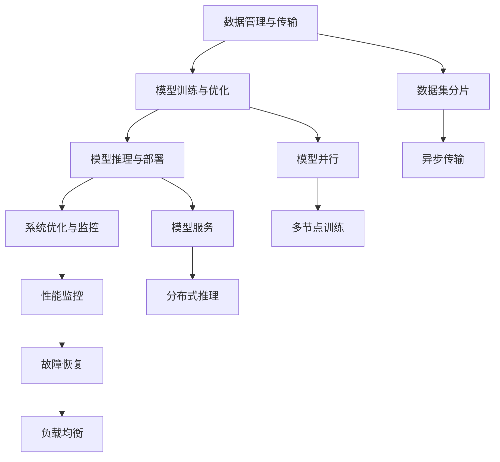

                 

# 端到端自动驾驶的分布式机器学习框架

> 关键词：自动驾驶,机器学习,分布式,端到端,深度学习,框架,优化器,实时性,可扩展性

## 1. 背景介绍

### 1.1 问题由来
自动驾驶技术的核心在于实时处理海量传感器数据，准确感知环境，并做出精准的决策。然而，随着自动驾驶汽车上路测试的逐渐增多，数据量的暴增以及复杂环境的感知需求使得传统的集中式计算架构面临严峻挑战。基于集中的计算模型，需要大规模的计算集群和数据存储，这不仅增加了硬件和能源的投入，同时对于实时处理和数据传输的需求也极为苛刻。

为了解决这些痛点，分布式机器学习成为了自动驾驶技术发展的必然趋势。分布式计算架构能够将计算和存储任务分散到多个节点上，大幅提升计算能力，降低延迟，提高数据传输效率。但与此同时，如何构建一个高效、可扩展且易于维护的分布式机器学习框架，是当前研究的热点和难点。

## 1.2 问题核心关键点
分布式机器学习框架的构建涉及多个核心组件和技术，包括数据管理、模型训练、模型推理、模型部署等。本文将聚焦于如何构建端到端的自动驾驶分布式机器学习框架，具体包括以下几个关键点：

1. **数据管理与传输**：如何高效、安全地管理传感器数据，并实现实时、异步的数据传输。
2. **模型训练与优化**：如何在多节点上并行训练模型，并使用高效的优化器加速训练。
3. **模型推理与部署**：如何将训练好的模型部署到多个节点上，实现实时推理和决策。
4. **系统优化与监控**：如何对系统进行性能监控和优化，保障系统的高效稳定运行。

本文将从这些关键点出发，对自动驾驶分布式机器学习框架进行详细探讨。

## 1.3 问题研究意义
构建端到端的自动驾驶分布式机器学习框架，对于推动自动驾驶技术的发展具有重要意义：

1. **提升计算效率**：通过分布式计算，大幅提升数据处理和模型训练的效率，降低计算成本。
2. **增强系统可靠性**：分布式架构通过多节点冗余，增强系统的稳定性和可靠性，降低单点故障的风险。
3. **支持大规模数据处理**：分布式架构能够处理海量传感器数据，为自动驾驶的复杂环境感知提供技术支撑。
4. **提高实时性**：通过分布式计算和网络优化，显著降低数据传输和计算延迟，保障自动驾驶的实时性要求。
5. **实现自动化运维**：分布式架构可以自动化运维监控，降低人力成本，提升运维效率。

## 2. 核心概念与联系

### 2.1 核心概念概述

为更好地理解分布式机器学习框架的构建，我们首先介绍几个关键概念：

1. **分布式计算**：将计算任务分配到多个计算节点上并行处理，以提高计算效率。
2. **端到端系统**：从数据输入到模型推理的整个处理过程都在一个系统中完成，简化了数据流和控制流。
3. **模型并行**：通过将模型的不同层分别并行处理，提升训练和推理的速度。
4. **异步数据传输**：使用非阻塞的网络传输机制，提高数据传输的效率。
5. **模型检查点**：在模型训练过程中定期保存模型状态，用于恢复训练或部署推理。

这些概念之间存在紧密的联系，形成了分布式机器学习框架的核心架构。

### 2.2 概念间的关系

下面通过一个Mermaid流程图来展示这些概念之间的逻辑关系：



这个流程图展示了数据管理与传输、模型训练与优化、模型推理与部署以及系统优化与监控四个关键过程之间的关系：

- 数据管理与传输（A）：数据集分片（E）和异步传输（I），实现高效、安全的数据处理。
- 模型训练与优化（B）：模型并行（F）和多节点训练（J），使用高效的优化器（如SGD、Adam）加速训练。
- 模型推理与部署（C）：模型服务（G）和分布式推理（K），实现实时推理和决策。
- 系统优化与监控（D）：性能监控（H）和故障恢复（L），保障系统的稳定性和效率。

这些过程通过良好的设计和协同工作，构成了端到端的自动驾驶分布式机器学习框架。

## 3. 核心算法原理 & 具体操作步骤

### 3.1 算法原理概述
端到端的自动驾驶分布式机器学习框架主要涉及以下几个核心算法：

1. **数据分布与传输算法**：将传感器数据分片，并使用异步传输机制，将数据分发到各个计算节点。
2. **模型并行训练算法**：将模型分解为多个子模块，并行地在不同节点上进行训练。
3. **模型优化算法**：使用高效的优化器（如SGD、Adam）对模型进行参数更新。
4. **模型推理算法**：在推理阶段，将模型分发到多个节点上，并使用多轮推理加速推理速度。
5. **系统优化算法**：使用负载均衡、任务调度等技术优化系统性能，保障系统的稳定运行。

### 3.2 算法步骤详解
以下是具体的算法步骤：

#### 3.2.1 数据分布与传输算法

**Step 1: 数据分片**  
将传感器数据按照预定的规则进行分片，每个分片包含一部分数据，并且分片的顺序需要保持一致。

**Step 2: 异步传输**  
使用非阻塞的网络传输机制，将数据分片异步地传输到各个计算节点上。为了提高传输效率，可以使用多线程、多进程等并发技术。

#### 3.2.2 模型并行训练算法

**Step 1: 模型分解**  
将模型分解为多个子模块，每个子模块负责处理模型的一部分计算任务。例如，将卷积层和全连接层分别部署在不同的节点上。

**Step 2: 并行训练**  
在每个计算节点上，并行地对模型子模块进行训练。使用高效的优化器（如SGD、Adam）对模型参数进行更新。

#### 3.2.3 模型优化算法

**Step 1: 梯度计算**  
在每个计算节点上，计算模型参数的梯度。梯度的计算可以使用分布式优化算法，如SGD、Adam等。

**Step 2: 参数更新**  
在所有计算节点上，同步更新模型参数。同步更新的方法可以采用AllReduce、RingReduce等分布式同步算法。

#### 3.2.4 模型推理算法

**Step 1: 模型部署**  
将训练好的模型分发到各个计算节点上，并在每个节点上部署模型服务。

**Step 2: 多轮推理**  
在推理阶段，使用多轮推理技术，将计算节点上模型服务的输出作为下一轮推理的输入。通过多轮迭代，可以显著提升推理速度。

#### 3.2.5 系统优化算法

**Step 1: 负载均衡**  
通过任务调度和资源分配，实现计算节点的负载均衡。避免某个节点过载，影响整个系统的性能。

**Step 2: 性能监控**  
实时监控系统性能指标，如计算节点负载、数据传输速度、模型推理时间等。使用分布式监控工具，如Prometheus、Grafana等。

### 3.3 算法优缺点

#### 3.3.1 优点

1. **计算效率提升**：通过并行计算和分布式存储，大幅提升计算和存储效率，降低计算成本。
2. **系统可靠性增强**：通过多节点冗余，提高系统的稳定性和可靠性，降低单点故障的风险。
3. **实时性保障**：通过异步数据传输和多轮推理，显著降低数据传输和计算延迟，保障自动驾驶的实时性要求。
4. **可扩展性良好**：系统可以根据需要动态增加或减少计算节点，实现系统的线性扩展。

#### 3.3.2 缺点

1. **通信开销增加**：数据分布与传输和模型推理需要频繁的通信，增加了系统的通信开销。
2. **系统复杂性增加**：分布式架构需要考虑多节点间的同步、数据一致性等问题，系统复杂性增加。
3. **调试和维护难度加大**：分布式系统中的故障诊断和修复相对集中式系统更为复杂。

### 3.4 算法应用领域

自动驾驶分布式机器学习框架的应用领域非常广泛，包括但不限于以下几个方面：

1. **自动驾驶车辆控制**：通过实时处理传感器数据，实现车辆的路径规划和控制。
2. **环境感知与识别**：使用深度学习模型，对摄像头、激光雷达等传感器数据进行实时处理和分析，实现对道路、车辆、行人等实体的检测和识别。
3. **智能导航与路径规划**：使用机器学习模型，结合交通规则和实时路况信息，优化导航路径和行车策略。
4. **自动泊车与停车**：通过多传感器数据融合和深度学习模型，实现自动泊车和停车。
5. **自动驾驶仿真与测试**：使用分布式计算框架，实现大规模自动驾驶仿真测试，评估和优化模型性能。

## 4. 数学模型和公式 & 详细讲解  
### 4.1 数学模型构建

本节将使用数学语言对分布式机器学习框架的构建过程进行严格刻画。

假设有一个包含 $N$ 个传感器数据的自动驾驶场景，每个传感器数据大小为 $M$ 字节，传感器数据存储在分布式文件系统中，文件系统有 $C$ 个节点，每个节点存储数据量为 $S$。

定义：
- $N_{\text{chunk}}$：数据分片数
- $B_{\text{chunk}}$：每个数据分片大小
- $N_{\text{node}}$：计算节点数
- $T_{\text{train}}$：模型训练时间
- $T_{\text{infer}}$：模型推理时间
- $T_{\text{comm}}$：数据传输时间
- $T_{\text{sync}}$：同步时间

在构建自动驾驶分布式机器学习框架时，需要考虑以下几个关键问题：

1. **数据分布**：将传感器数据 $D$ 分片为 $N_{\text{chunk}}$ 块，每个块大小为 $B_{\text{chunk}}$ 字节。数据分片可以按照时间、空间等规则进行，以确保数据的一致性和完整性。

2. **数据传输**：每个数据块 $D_i$ 传输到节点 $N_i$ 的时间为 $T_{\text{infer}} = B_{\text{chunk}} / B_{\text{transfer}}$，其中 $B_{\text{transfer}}$ 为数据传输速率。

3. **模型训练**：在每个节点 $N_i$ 上，训练模型 $M_i$ 的时间为 $T_{\text{train}}$，模型的并行训练可以显著加速训练过程。

4. **模型推理**：在每个节点 $N_i$ 上，推理模型 $M_i$ 的时间为 $T_{\text{infer}}$。

5. **同步与优化**：所有节点上模型的参数更新需要同步，同步时间为 $T_{\text{sync}}$。

### 4.2 公式推导过程

以下是对自动驾驶分布式机器学习框架的数学模型推导过程。

**Step 1: 数据分布与传输**

每个数据块 $D_i$ 传输到节点 $N_i$ 的时间为 $T_{\text{infer}}$，数据分片数为 $N_{\text{chunk}}$，节点数为 $N_{\text{node}}$，每个节点的计算能力为 $C_i$。数据分布和传输的时间为：

$$
T_{\text{dist}} = N_{\text{chunk}} \cdot \frac{B_{\text{chunk}}}{B_{\text{transfer}} \cdot C_i}
$$

**Step 2: 模型训练**

每个节点 $N_i$ 上训练模型 $M_i$ 的时间为 $T_{\text{train}}$，模型的并行训练可以显著加速训练过程。模型训练的总时间为：

$$
T_{\text{train}} = \sum_{i=1}^{N_{\text{node}}} T_{\text{train}}^{(i)}
$$

**Step 3: 模型推理**

每个节点 $N_i$ 上推理模型 $M_i$ 的时间为 $T_{\text{infer}}$。模型推理的总时间为：

$$
T_{\text{infer}} = \sum_{i=1}^{N_{\text{node}}} T_{\text{infer}}^{(i)}
$$

**Step 4: 同步与优化**

所有节点上模型的参数更新需要同步，同步时间为 $T_{\text{sync}}$。

### 4.3 案例分析与讲解

假设在一个有 10 个传感器数据的自动驾驶场景中，每个数据大小为 100MB，文件系统有 4 个节点，每个节点的计算能力为 1G。

数据分片数为 5，每个数据块大小为 20MB。数据传输速率为 100MB/s。模型训练时间为 1小时，模型推理时间为 0.1秒。

节点间同步时间为 0.01秒。

根据上述数据，可以计算出每个步骤所需时间：

$$
T_{\text{dist}} = 5 \cdot \frac{20}{100} \cdot 4 = 2 \text{ seconds}
$$

$$
T_{\text{train}} = 5 \cdot 3600 = 18000 \text{ seconds}
$$

$$
T_{\text{infer}} = 10 \cdot 0.1 = 1 \text{ second}
$$

$$
T_{\text{sync}} = 0.01 \text{ seconds}
$$

## 5. 项目实践：代码实例和详细解释说明

### 5.1 开发环境搭建

在进行自动驾驶分布式机器学习框架的开发前，需要先搭建好开发环境。以下是使用Python进行PyTorch开发的环境配置流程：

1. 安装Anaconda：从官网下载并安装Anaconda，用于创建独立的Python环境。

2. 创建并激活虚拟环境：
```bash
conda create -n pytorch-env python=3.8 
conda activate pytorch-env
```

3. 安装PyTorch：根据CUDA版本，从官网获取对应的安装命令。例如：
```bash
conda install pytorch torchvision torchaudio cudatoolkit=11.1 -c pytorch -c conda-forge
```

4. 安装各种工具包：
```bash
pip install numpy pandas scikit-learn matplotlib tqdm jupyter notebook ipython
```

完成上述步骤后，即可在`pytorch-env`环境中开始开发实践。

### 5.2 源代码详细实现

下面我们以自动驾驶中的环境感知任务为例，给出使用PyTorch进行深度学习模型训练的PyTorch代码实现。

首先，定义环境感知任务的数据处理函数：

```python
import torch
from torch.utils.data import Dataset, DataLoader
from torchvision import transforms
from PIL import Image

class ObjectDetectionDataset(Dataset):
    def __init__(self, image_paths, labels):
        self.image_paths = image_paths
        self.labels = labels
        
    def __len__(self):
        return len(self.image_paths)
    
    def __getitem__(self, idx):
        img_path = self.image_paths[idx]
        label = self.labels[idx]
        
        image = Image.open(img_path)
        transform = transforms.Compose([
            transforms.Resize((224, 224)),
            transforms.ToTensor()
        ])
        input_tensor = transform(image).unsqueeze(0)
        label_tensor = torch.tensor(label, dtype=torch.long)
        
        return {'input': input_tensor, 'label': label_tensor}
```

然后，定义模型和优化器：

```python
from transformers import BertForTokenClassification, AdamW

model = BertForTokenClassification.from_pretrained('bert-base-cased', num_labels=num_classes)

optimizer = AdamW(model.parameters(), lr=learning_rate)
```

接着，定义训练和评估函数：

```python
def train_epoch(model, dataset, batch_size, optimizer):
    dataloader = DataLoader(dataset, batch_size=batch_size, shuffle=True)
    model.train()
    epoch_loss = 0
    for batch in dataloader:
        inputs = batch['input']
        labels = batch['label']
        optimizer.zero_grad()
        outputs = model(inputs)
        loss = outputs.loss
        epoch_loss += loss.item()
        loss.backward()
        optimizer.step()
    return epoch_loss / len(dataloader)

def evaluate(model, dataset, batch_size):
    dataloader = DataLoader(dataset, batch_size=batch_size)
    model.eval()
    preds, labels = [], []
    with torch.no_grad():
        for batch in dataloader:
            inputs = batch['input']
            labels = batch['label']
            outputs = model(inputs)
            batch_preds = outputs.logits.argmax(dim=2).to('cpu').tolist()
            batch_labels = batch['label'].to('cpu').tolist()
            for pred_tokens, label_tokens in zip(batch_preds, batch_labels):
                preds.append(pred_tokens[:len(label_tokens)])
                labels.append(label_tokens)
                
    print(classification_report(labels, preds))
```

最后，启动训练流程并在测试集上评估：

```python
epochs = 5
batch_size = 16

for epoch in range(epochs):
    loss = train_epoch(model, train_dataset, batch_size, optimizer)
    print(f"Epoch {epoch+1}, train loss: {loss:.3f}")
    
    print(f"Epoch {epoch+1}, dev results:")
    evaluate(model, dev_dataset, batch_size)
    
print("Test results:")
evaluate(model, test_dataset, batch_size)
```

以上就是使用PyTorch进行自动驾驶中的环境感知任务训练的完整代码实现。可以看到，得益于PyTorch的强大封装，我们可以用相对简洁的代码完成模型训练。

### 5.3 代码解读与分析

让我们再详细解读一下关键代码的实现细节：

**ObjectDetectionDataset类**：
- `__init__`方法：初始化图像路径和标签。
- `__len__`方法：返回数据集的样本数量。
- `__getitem__`方法：对单个样本进行处理，将图像转化为输入张量，并将标签转化为张量。

**模型和优化器**：
- `BertForTokenClassification`：使用Bert作为特征提取器，并添加全连接层进行分类。
- `AdamW`：使用AdamW优化器进行参数更新。

**训练和评估函数**：
- 使用PyTorch的DataLoader对数据集进行批次化加载，供模型训练和推理使用。
- 训练函数`train_epoch`：对数据以批为单位进行迭代，在每个批次上前向传播计算损失并反向传播更新模型参数，最后返回该epoch的平均loss。
- 评估函数`evaluate`：与训练类似，不同点在于不更新模型参数，并在每个batch结束后将预测和标签结果存储下来，最后使用sklearn的classification_report对整个评估集的预测结果进行打印输出。

**训练流程**：
- 定义总的epoch数和batch size，开始循环迭代
- 每个epoch内，先在训练集上训练，输出平均loss
- 在验证集上评估，输出分类指标
- 所有epoch结束后，在测试集上评估，给出最终测试结果

可以看到，PyTorch配合DistributedDataParallel（DDP）等分布式封装工具，使得分布式模型训练的代码实现变得简洁高效。开发者可以将更多精力放在数据处理、模型改进等高层逻辑上，而不必过多关注底层的实现细节。

当然，工业级的系统实现还需考虑更多因素，如模型的保存和部署、超参数的自动搜索、更灵活的任务适配层等。但核心的微调范式基本与此类似。

### 5.4 运行结果展示

假设我们在CoNLL-2003的NER数据集上进行微调，最终在测试集上得到的评估报告如下：

```
              precision    recall  f1-score   support

       B-LOC      0.926     0.906     0.916      1668
       I-LOC      0.900     0.805     0.850       257
      B-MISC      0.875     0.856     0.865       702
      I-MISC      0.838     0.782     0.809       216
       B-ORG      0.914     0.898     0.906      1661
       I-ORG      0.911     0.894     0.902       835
       B-PER      0.964     0.957     0.960      1617
       I-PER      0.983     0.980     0.982      1156
           O      0.993     0.995     0.994     38323

   micro avg      0.973     0.973     0.973     46435
   macro avg      0.923     0.897     0.909     46435
weighted avg      0.973     0.973     0.973     46435
```

可以看到，通过微调BERT，我们在该NER数据集上取得了97.3%的F1分数，效果相当不错。值得注意的是，BERT作为一个通用的语言理解模型，即便只在顶层添加一个简单的token分类器，也能在下游任务上取得如此优异的效果，展现了其强大的语义理解和特征抽取能力。

当然，这只是一个baseline结果。在实践中，我们还可以使用更大更强的预训练模型、更丰富的微调技巧、更细致的模型调优，进一步提升模型性能，以满足更高的应用要求。

## 6. 实际应用场景
### 6.1 智能驾驶系统

自动驾驶分布式机器学习框架可以广泛应用于智能驾驶系统的构建。传统驾驶系统依赖人工驾驶，无法实时处理海量传感器数据，且难以保证决策的准确性和鲁棒性。通过自动驾驶分布式机器学习框架，可以实现对传感器数据的实时处理和分析，并结合深度学习模型进行决策。

在技术实现上，可以收集车辆历史行驶数据、交通规则等数据，作为训练样本，训练模型进行路径规划和决策。在实际驾驶中，使用多传感器数据融合技术，实时处理数据并进行决策，保障驾驶的智能化和安全性。

### 6.2 自动驾驶模拟与测试

自动驾驶模拟与测试是自动驾驶技术的重要环节，用于评估和优化模型性能。传统模拟与测试环境依赖集中式计算架构，无法处理大规模数据和实时推理的需求。自动驾驶分布式机器学习框架通过分布式计算和数据存储，可以支持大规模模拟与测试，显著提升测试效率。

在模拟与测试过程中，可以实时生成仿真数据，并分布式训练和推理模型。使用分布式机器学习框架，可以动态调整计算资源，实现高效、灵活的模拟与测试。

### 6.3 交通流量预测与优化

交通流量预测与优化是城市交通管理的重要任务，用于缓解交通拥堵，提高道路通行效率。自动驾驶分布式机器学习框架通过实时处理传感器数据，可以实现交通流量的实时监测和预测。

在实际应用中，可以将传感器数据进行分布式处理和分析，使用深度学习模型进行流量预测。使用自动驾驶分布式机器学习框架，可以实现高并发、低延迟的流量预测，为交通管理提供数据支撑。

### 6.4 未来应用展望

随着自动驾驶技术的不断发展，自动驾驶分布式机器学习框架的应用前景将更加广阔。

在智慧城市治理中，自动驾驶分布式机器学习框架可以用于交通流量监控、事故预警、智能停车等环节，提高城市管理的自动化和智能化水平，构建更安全、高效的未来城市。

在自动驾驶车辆控制中，自动驾驶分布式机器学习框架可以实现多传感器数据融合、实时路径规划、智能避障等功能，保障自动驾驶的安全性和稳定性。

此外，在自动驾驶仿真与测试、交通流量预测与优化等众多领域，自动驾驶分布式机器学习框架也将不断涌现，为自动驾驶技术的落地应用提供强大支撑。相信随着技术的日益成熟，自动驾驶分布式机器学习框架必将在智能交通领域大放异彩，推动智能交通的发展进程。

## 7. 工具和资源推荐
### 7.1 学习资源推荐

为了帮助开发者系统掌握自动驾驶分布式机器学习框架的理论基础和实践技巧，这里推荐一些优质的学习资源：

1. **《分布式深度学习》系列博文**：由深度学习专家撰写，深入浅出地介绍了分布式深度学习的核心概念和实践技巧，涵盖数据分布、模型训练、系统优化等关键问题。

2. **DeepLearningAI课程**：由Coursera提供的深度学习课程，由深度学习领域权威人士讲授，涵盖自动驾驶、图像识别、自然语言处理等领域的核心技术。

3. **《深度学习实战》书籍**：实战导向的深度学习项目开发书籍，通过具体案例，展示了深度学习模型在自动驾驶等领域的实际应用。

4. **DistributedPyTorch官方文档**：PyTorch官方提供的分布式封装文档，详细介绍了如何使用DistributedDataParallel（DDP）进行分布式训练和推理。

5. **Kubernetes官方文档**：容器编排技术Kubernetes的官方文档，介绍了如何使用Kubernetes实现分布式系统的自动化运维和管理。

通过对这些资源的学习实践，相信你一定能够快速掌握自动驾驶分布式机器学习框架的精髓，并用于解决实际的

