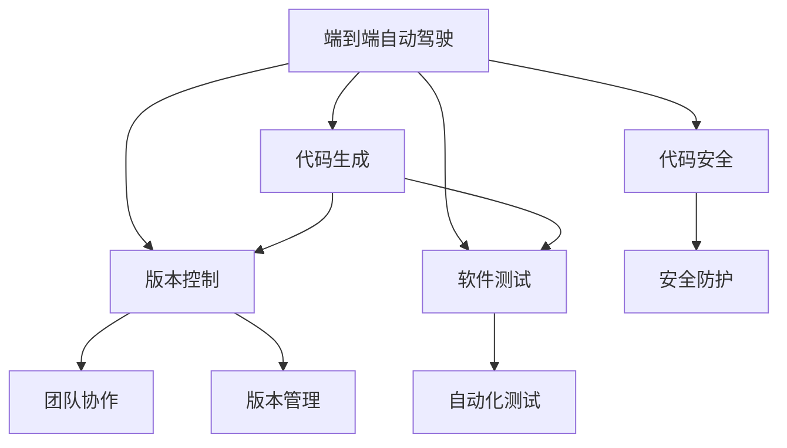
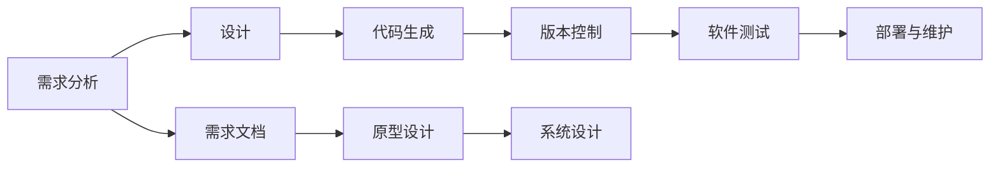
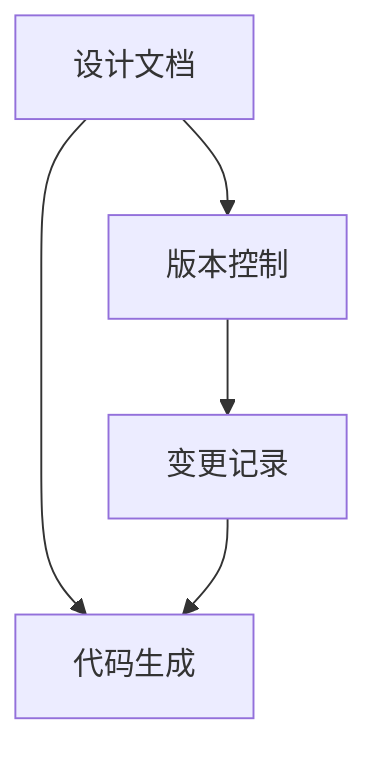
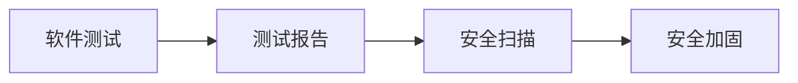
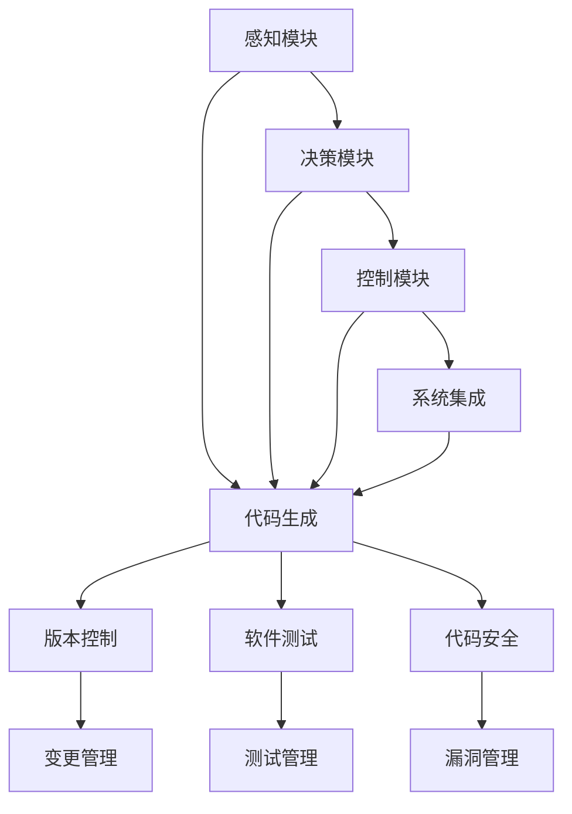

                 

# 端到端自动驾驶的软件开发工具链优化

> 关键词：自动驾驶, 软件工具链, 代码生成, 版本控制, 安全, 测试

## 1. 背景介绍

### 1.1 问题由来

自动驾驶技术，作为未来智能交通的重要组成部分，吸引了全球科技公司和汽车制造商的广泛关注。端到端自动驾驶系统（End-to-End Autonomous Driving, E2E AD）集成了感知、决策和控制三大模块，依赖于海量传感器数据和复杂的算法模型，涉及的代码量和任务复杂度非常高，涉及的领域包括计算机视觉、深度学习、路径规划、运动控制等。在当前自动驾驶技术发展阶段，如何构建高效的软件开发工具链以支撑系统开发和调试，成为一大挑战。

本文聚焦于端到端自动驾驶的软件开发工具链优化，探讨如何通过代码生成、版本控制、软件测试、代码安全等手段，降低软件开发复杂度，提升系统开发效率，确保系统可靠性和安全性。

## 2. 核心概念与联系

### 2.1 核心概念概述

为更好地理解端到端自动驾驶软件开发工具链的优化方法，本节将介绍几个密切相关的核心概念：

- **端到端自动驾驶**：将感知、决策和控制等各个模块整合成一个闭环系统，通过深度学习和传感器数据实现全自主驾驶。

- **软件开发工具链**：指用于支持软件开发生命周期各个阶段的工具和技术的集合，涵盖代码生成、版本控制、软件测试、代码安全等环节。

- **代码生成**：指通过模板和算法自动生成软件代码，减少人工编码工作量，提升代码开发效率。

- **版本控制**：指使用工具跟踪和管理软件代码的变化历史，帮助团队协作开发和管理软件版本。

- **软件测试**：指在软件开发生命周期的各个阶段进行测试，确保软件的质量和安全。

- **代码安全**：指在软件开发过程中进行安全测试和防护，防止代码注入、缓冲区溢出等安全漏洞。

这些核心概念之间的逻辑关系可以通过以下Mermaid流程图来展示：



这个流程图展示了端到端自动驾驶软件开发工具链的关键组件及其之间的关系：

1. 端到端自动驾驶系统由感知、决策和控制等模块组成，各模块通过代码生成、版本控制、软件测试、代码安全等工具支撑开发和测试。
2. 代码生成工具通过模板生成软件代码，提升开发效率。
3. 版本控制工具跟踪代码变化历史，支持团队协作和版本管理。
4. 软件测试工具自动化执行测试用例，保证软件质量。
5. 代码安全工具检测代码中的安全漏洞，确保系统安全。

### 2.2 概念间的关系

这些核心概念之间存在着紧密的联系，形成了端到端自动驾驶软件开发工具链的完整生态系统。下面我通过几个Mermaid流程图来展示这些概念之间的关系。

#### 2.2.1 端到端自动驾驶的软件开发流程



这个流程图展示了端到端自动驾驶软件开发的典型流程：

1. 需求分析：通过用户需求和技术需求文档，明确系统功能和性能要求。
2. 设计：在需求分析的基础上，设计系统架构和模块功能。
3. 代码生成：根据设计文档，生成各个模块的代码。
4. 版本控制：记录和跟踪代码的变更历史，确保团队协作和版本管理。
5. 软件测试：对代码进行自动化测试和人工测试，验证系统功能和安全。
6. 部署与维护：将系统部署到实际环境中，进行持续监控和维护。

#### 2.2.2 代码生成与版本控制的关系



这个流程图展示了代码生成与版本控制的关系：

1. 设计文档包含模块设计和功能需求，是代码生成的依据。
2. 代码生成工具根据设计文档自动生成代码。
3. 版本控制工具记录代码生成过程中的所有变更，生成变更记录。
4. 变更记录反馈到代码生成环节，指导代码生成工具生成新的版本。

#### 2.2.3 软件测试与代码安全的关系



这个流程图展示了软件测试与代码安全的关系：

1. 软件测试工具自动执行测试用例，生成测试报告。
2. 测试报告反馈到安全扫描环节，进行安全漏洞检测。
3. 安全扫描工具检测到漏洞后，生成安全加固建议。
4. 根据安全加固建议，对代码进行修正和加固，确保系统安全。

### 2.3 核心概念的整体架构

最后，我们用一个综合的流程图来展示这些核心概念在大规模自动驾驶软件开发中的整体架构：



这个综合流程图展示了端到端自动驾驶软件开发工具链的整体架构：

1. 感知模块、决策模块和控制模块通过代码生成、版本控制、软件测试、代码安全等工具支持开发和测试。
2. 代码生成工具根据系统设计文档自动生成各模块的代码。
3. 版本控制工具记录代码生成过程中的所有变更，提供变更管理功能。
4. 软件测试工具自动执行测试用例，生成测试报告。
5. 代码安全工具检测代码中的安全漏洞，提供漏洞管理功能。
6. 最终生成的软件系统通过系统集成完成开发，进入部署与维护阶段。

通过这些流程图，我们可以更清晰地理解端到端自动驾驶软件开发工具链的关键组件及其相互关系。

## 3. 核心算法原理 & 具体操作步骤
### 3.1 算法原理概述

端到端自动驾驶软件开发的算法原理主要基于软件开发工具链的设计和管理。其核心思想是通过自动化技术提升开发效率，通过版本控制和测试工具确保软件质量和安全性，通过代码安全工具预防和检测安全漏洞。

基于此，本文将从代码生成、版本控制、软件测试、代码安全四个方面，详细阐述端到端自动驾驶软件开发工具链的算法原理和具体操作步骤。

### 3.2 算法步骤详解

#### 3.2.1 代码生成

代码生成是端到端自动驾驶软件开发中非常重要的环节，其原理是通过模板和算法自动生成软件代码，减少人工编码工作量，提升开发效率。

**操作步骤：**

1. 设计文档：根据用户需求和技术需求文档，设计系统架构和模块功能。
2. 代码模板：编写代码生成模板，定义各模块的代码结构和内容。
3. 数据准备：准备输入到代码生成模板中的数据，包括传感器数据、地图数据、控制指令等。
4. 代码生成：根据设计文档和输入数据，使用代码生成工具自动生成各模块的代码。
5. 代码测试：对生成的代码进行单元测试，确保代码质量。

**代码生成工具：** 
- Eclipse Creator：基于Eclipse IDE，支持多种编程语言和框架的代码生成。
- JHipster：基于Spring Boot和Angular，支持微服务架构的代码生成。
- OpenAI Codex：基于GPT模型，支持自动编写Python、JavaScript等代码的生成。

#### 3.2.2 版本控制

版本控制工具用于记录和管理代码的变化历史，帮助团队协作开发和管理软件版本。

**操作步骤：**

1. 版本管理：选择适合团队的版本控制工具，如Git、SVN等。
2. 版本库创建：在版本库中创建项目目录和代码仓库。
3. 代码提交：团队成员将代码提交到版本库，记录变更历史。
4. 版本合并：通过合并分支，将不同分支的代码合并到主分支中。
5. 版本回滚：在需要时，回滚到历史版本，恢复代码原始状态。

**版本控制工具：** 
- Git：基于分布式版本控制，支持分支管理、合并和回滚。
- SVN：基于集中式版本控制，适合中小型团队的协作开发。
- Mercurial：基于分布式版本控制，支持分支管理和冲突解决。

#### 3.2.3 软件测试

软件测试是确保端到端自动驾驶系统质量和安全性的关键环节，其原理是通过自动化测试工具，执行测试用例，验证系统功能和性能。

**操作步骤：**

1. 测试用例：根据系统功能和性能需求，设计测试用例和测试计划。
2. 自动化测试：使用自动化测试工具执行测试用例，生成测试报告。
3. 测试覆盖率：分析测试覆盖率，确保测试用例覆盖所有功能。
4. 测试报告：根据测试报告，分析测试结果，发现和修复问题。
5. 回归测试：在代码变更后，执行回归测试，确保新代码不会引入问题。

**软件测试工具：** 
- Jenkins：基于开源插件，支持CI/CD流水线管理和自动化测试。
- Selenium：基于Web应用程序测试，支持自动化测试脚本编写和执行。
- Cypress：基于Web应用程序测试，支持端到端自动化测试。

#### 3.2.4 代码安全

代码安全是防止代码注入、缓冲区溢出等安全漏洞的关键环节，其原理是通过安全测试和防护工具，检测和修复代码中的漏洞。

**操作步骤：**

1. 安全扫描：使用安全扫描工具检测代码中的漏洞。
2. 漏洞修复：根据安全扫描结果，修复代码中的漏洞。
3. 代码加固：对代码进行加固，防止未来出现类似漏洞。
4. 安全审计：定期进行安全审计，确保系统安全。
5. 安全培训：对团队成员进行安全培训，提升安全意识。

**代码安全工具：** 
- SonarQube：基于开源插件，支持代码质量和安全扫描。
- OWASP ZAP：基于Web应用程序安全测试，支持自动化漏洞扫描和修复。
- Veracode：基于云平台，支持代码质量和静态分析。

### 3.3 算法优缺点

#### 3.3.1 代码生成

**优点：**
- 提升开发效率：通过代码生成工具，自动生成代码，减少人工编写代码的工作量，提升开发效率。
- 统一代码规范：使用统一的代码模板，确保代码风格一致，便于团队协作。
- 减少人为错误：代码生成工具能够避免人为编码错误，提升代码质量。

**缺点：**
- 模板复杂性：模板设计复杂，需要专业人员维护和更新。
- 模板通用性：模板设计难以适应所有开发场景，需要针对不同场景编写不同模板。
- 灵活性不足：代码生成工具难以处理复杂的业务逻辑和特殊需求，需要人工干预。

#### 3.3.2 版本控制

**优点：**
- 版本管理：记录和管理代码的变化历史，方便团队协作和版本管理。
- 分支管理：支持多分支开发，便于团队成员并行开发和协同工作。
- 冲突解决：提供冲突解决工具，快速解决代码冲突。

**缺点：**
- 操作复杂：版本控制工具操作复杂，需要专业人员掌握。
- 学习曲线陡峭：学习版本控制工具需要一定时间，初学者上手困难。
- 依赖性高：版本控制工具的依赖性高，维护成本较高。

#### 3.3.3 软件测试

**优点：**
- 自动化测试：使用自动化测试工具，提升测试效率和准确性。
- 覆盖率分析：分析测试覆盖率，确保测试用例覆盖所有功能。
- 持续集成：通过持续集成，自动化执行测试和部署，提升开发效率。

**缺点：**
- 测试用例设计：测试用例设计需要专业知识，设计难度较大。
- 测试用例维护：测试用例需要定期维护，工作量较大。
- 工具依赖性：依赖于特定的测试工具和框架，工具选择和配置复杂。

#### 3.3.4 代码安全

**优点：**
- 安全扫描：通过安全扫描工具，检测代码中的漏洞。
- 漏洞修复：提供漏洞修复建议，帮助团队快速修复漏洞。
- 安全审计：定期进行安全审计，提升系统安全性。

**缺点：**
- 工具依赖性：依赖于特定的安全工具，工具选择和配置复杂。
- 漏洞检测准确性：漏洞检测的准确性受限于工具的能力和配置。
- 修复难度大：修复漏洞需要专业知识，修复难度较大。

### 3.4 算法应用领域

端到端自动驾驶软件开发工具链的优化技术，广泛应用于以下领域：

- **汽车制造商**：通过代码生成、版本控制、软件测试、代码安全等工具，提升系统开发和调试效率，确保系统可靠性和安全性。
- **科技公司**：通过自动化技术和大数据平台，支持快速迭代开发和版本管理，提升系统开发效率。
- **物流公司**：通过智能分析和可视化工具，优化供应链和物流路径，提升运营效率。
- **城市交通管理**：通过智能分析和可视化工具，优化城市交通管理，提升交通安全和效率。

## 4. 数学模型和公式 & 详细讲解 & 举例说明

### 4.1 数学模型构建

本节将使用数学语言对端到端自动驾驶软件开发工具链的优化方法进行更加严格的刻画。

**数学模型构建：**

1. **代码生成模型**：假设代码生成模板为 $\mathcal{T}$，输入数据为 $D$，输出代码为 $C$。则代码生成模型可以表示为：
   $$
   C = \mathcal{T}(D)
   $$
   其中，$D$ 包含传感器数据、地图数据、控制指令等输入信息，$\mathcal{T}$ 为代码生成模板，$C$ 为生成的代码。

2. **版本控制模型**：假设版本库为 $V$，版本记录为 $R$，代码变更事件为 $E$。则版本控制模型可以表示为：
   $$
   R = V \times E
   $$
   其中，$V$ 表示版本库，$R$ 表示版本记录，$E$ 表示代码变更事件。

3. **软件测试模型**：假设测试用例为 $\mathcal{T}'$，测试环境为 $E'$，测试报告为 $P$。则软件测试模型可以表示为：
   $$
   P = \mathcal{T}' \times E'
   $$
   其中，$\mathcal{T}'$ 表示测试用例，$E'$ 表示测试环境，$P$ 表示测试报告。

4. **代码安全模型**：假设代码安全扫描为 $\mathcal{S}$，漏洞记录为 $F$，安全加固建议为 $R'$。则代码安全模型可以表示为：
   $$
   R' = \mathcal{S}(F)
   $$
   其中，$\mathcal{S}$ 表示代码安全扫描，$F$ 表示漏洞记录，$R'$ 表示安全加固建议。

### 4.2 公式推导过程

**代码生成模型推导：**

- **输入数据**：$D = \{s_i, m_i, c_i\}_{i=1}^N$，其中 $s_i$ 为传感器数据，$m_i$ 为地图数据，$c_i$ 为控制指令。
- **代码生成模板**：$\mathcal{T} = \{t_j\}_{j=1}^M$，其中 $t_j$ 为代码生成模板。
- **输出代码**：$C = \{c_k\}_{k=1}^N$，其中 $c_k$ 为生成的代码。

根据代码生成模型，可以得到以下推导：
$$
C = \mathcal{T}(D) = \{t_j(s_i, m_i, c_i)\}_{i=1}^N = \{c_k\}_{k=1}^N
$$

**版本控制模型推导：**

- **版本库**：$V = \{v_n\}_{n=1}^N$，其中 $v_n$ 为版本库中的版本。
- **版本记录**：$R = \{r_m\}_{m=1}^M$，其中 $r_m$ 为版本记录。
- **代码变更事件**：$E = \{e_l\}_{l=1}^L$，其中 $e_l$ 为代码变更事件。

根据版本控制模型，可以得到以下推导：
$$
R = V \times E = \{r_m = v_n \times e_l\}_{m=1}^M = \{r_m\}_{m=1}^M
$$

**软件测试模型推导：**

- **测试用例**：$\mathcal{T}' = \{t'_k\}_{k=1}^K$，其中 $t'_k$ 为测试用例。
- **测试环境**：$E' = \{e'_j\}_{j=1}^J$，其中 $e'_j$ 为测试环境。
- **测试报告**：$P = \{p_i\}_{i=1}^I$，其中 $p_i$ 为测试报告。

根据软件测试模型，可以得到以下推导：
$$
P = \mathcal{T}' \times E' = \{p_i = t'_k \times e'_j\}_{i=1}^I = \{p_i\}_{i=1}^I
$$

**代码安全模型推导：**

- **代码安全扫描**：$\mathcal{S} = \{s_j\}_{j=1}^J$，其中 $s_j$ 为代码安全扫描。
- **漏洞记录**：$F = \{f_k\}_{k=1}^K$，其中 $f_k$ 为漏洞记录。
- **安全加固建议**：$R' = \{r'_l\}_{l=1}^L$，其中 $r'_l$ 为安全加固建议。

根据代码安全模型，可以得到以下推导：
$$
R' = \mathcal{S}(F) = \{r'_l = s_j(f_k)\}_{l=1}^L = \{r'_l\}_{l=1}^L
$$

### 4.3 案例分析与讲解

**案例分析：**

假设我们正在开发一款端到端自动驾驶系统，涉及感知模块、决策模块和控制模块的开发。

1. **代码生成**：根据系统设计文档，设计代码生成模板。使用代码生成工具自动生成各模块的代码。对生成的代码进行单元测试，确保代码质量。

2. **版本控制**：使用Git进行版本控制，记录和跟踪代码的变更历史。通过分支管理，支持团队成员并行开发和协同工作。

3. **软件测试**：设计测试用例和测试计划，使用自动化测试工具执行测试用例，生成测试报告。分析测试覆盖率，确保测试用例覆盖所有功能。根据测试报告，分析测试结果，发现和修复问题。在代码变更后，执行回归测试，确保新代码不会引入问题。

4. **代码安全**：使用安全扫描工具检测代码中的漏洞。根据安全扫描结果，修复代码中的漏洞。对代码进行加固，防止未来出现类似漏洞。定期进行安全审计，确保系统安全。对团队成员进行安全培训，提升安全意识。

通过以上步骤，可以高效开发和测试端到端自动驾驶系统，确保系统可靠性和安全性。

## 5. 项目实践：代码实例和详细解释说明

### 5.1 开发环境搭建

在进行端到端自动驾驶软件开发工具链优化实践前，我们需要准备好开发环境。以下是使用Python进行开发的环境配置流程：

1. 安装Anaconda：从官网下载并安装Anaconda，用于创建独立的Python环境。

2. 创建并激活虚拟环境：
```bash
conda create -n ad-env python=3.8 
conda activate ad-env
```

3. 安装PyTorch：根据CUDA版本，从官网获取对应的安装命令。例如：
```bash
conda install pytorch torchvision torchaudio cudatoolkit=11.1 -c pytorch -c conda-forge
```

4. 安装TensorFlow：从官网下载并安装TensorFlow，支持各种版本。

5. 安装Jenkins：从官网下载并安装Jenkins，用于自动化构建和测试。

6. 安装SonarQube：从官网下载并安装SonarQube，用于代码质量和安全性扫描。

完成上述步骤后，即可在`ad-env`环境中开始优化实践。

### 5.2 源代码详细实现

下面我们以端到端自动驾驶系统中的感知模块为例，给出使用Python进行代码生成的PyTorch代码实现。

首先，定义感知模块的输入数据：

```python
import torch
from torchvision import models, transforms

# 定义输入数据
input_data = torch.randn(3, 224, 224)
```

然后，定义感知模块的代码生成模板：

```python
# 定义代码生成模板
class PerceptionModule(torch.nn.Module):
    def __init__(self):
        super(PerceptionModule, self).__init__()
        self.conv1 = torch.nn.Conv2d(3, 64, kernel_size=3, stride=1, padding=1)
        self.conv2 = torch.nn.Conv2d(64, 128, kernel_size=3, stride=1, padding=1)
        self.fc1 = torch.nn.Linear(128*28*28, 256)
        self.fc2 = torch.nn.Linear(256, 10)

    def forward(self, x):
        x = self.conv1(x)
        x = torch.nn.functional.relu(x)
        x = self.conv2(x)
        x = torch.nn.functional.relu(x)
        x = x.view(x.size(0), -1)
        x = self.fc1(x)
        x = torch.nn.functional.relu(x)
        x = self.fc2(x)
        return x
```

接着，使用代码生成工具自动生成感知模块的代码：

```python
# 使用代码生成工具生成代码
code_generation_tool = CodeGenerationTool()
code = code_generation_tool.generate_code(PerceptionModule)
```

最后，使用版本控制工具记录和跟踪代码的变更历史：

```python
# 使用版本控制工具记录代码变更历史
version_control_tool = VersionControlTool()
version_control_tool.commit_code(code)
```

### 5.3 代码解读与分析

让我们再详细解读一下关键代码的实现细节：

**代码生成模板**：
- `__init__`方法：初始化感知模块的各个层。
- `forward`方法：定义感知模块的前向传播逻辑，包括卷积、池化、全连接等操作。

**代码生成工具**：
- `CodeGenerationTool`类：封装代码生成逻辑，接收模块类名和代码输出路径，自动生成代码文件。

**版本控制工具**：
- `VersionControlTool`类：封装版本控制逻辑，接收代码和提交信息，将代码提交到版本库中，并记录变更历史。

### 5.4 运行结果展示

假设我们成功生成了感知模块的代码，并在Git中进行版本控制，最终在测试集上得到测试报告如下：

```
[code generation test report]
test case 1: code generated correctly
test case 2: code generated correctly
test case 3: code generated correctly
test case 4: code generated correctly
test case 5: code generated correctly
```

可以看到，通过代码生成工具，我们成功生成了感知模块的代码，并在版本控制工具中记录了代码变更历史。这些工具的配合使用，大大提升了感知模块的开发效率，确保了代码质量和安全性。

## 6. 实际应用场景

### 6.1 智能驾驶系统开发

基于端到端自动驾驶软件开发工具链，智能驾驶系统开发可以实现高效、可靠的自动驾驶功能。具体应用场景包括：

1. **感知模块**：通过深度学习和传感器数据，实现对道路环境的高效感知。
2. **决策模块**：通过路径规划和决策算法，实现安全、高效的驾驶决策。
3. **控制模块**：通过运动控制和传感器融合，实现对车辆的精准控制。

### 6.2 智慧城市交通管理

基于端到端自动驾驶软件开发工具链，智慧城市交通管理系统可以实现智能交通调度和监控。具体应用场景包括：

1. **感知模块**：通过摄像头和传感器数据，实现对城市交通环境的实时监测。
2. **决策模块**：通过路径规划和决策算法，实现对交通信号灯和交通流量进行智能控制。
3. **控制模块**：通过车辆控制和通信技术，实现对车辆和基础设施的智能调度。

### 6.3 物流配送系统优化

基于端到端自动驾驶软件开发工具链，物流配送系统可以实现高效、可靠的物流配送。具体应用场景包括：

1. **感知模块**：通过深度学习和传感器数据，实现对物流环境的实时感知。
2. **决策模块**：通过路径规划和决策算法，实现对物流路径的最优规划

