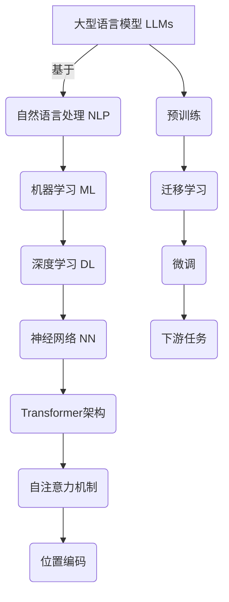
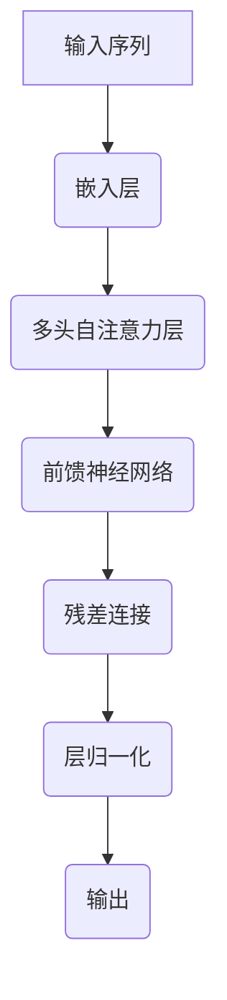

# 大语言模型应用指南：达特茅斯会议

## 1. 背景介绍

### 1.1 问题的由来

在过去的几年里，大型语言模型(Large Language Models, LLMs)在自然语言处理(NLP)领域取得了令人瞩目的进展。这些模型通过在海量文本数据上进行预训练,展现出惊人的语言理解和生成能力。然而,尽管取得了巨大成功,但LLMs在实际应用中仍然面临诸多挑战和局限性。

### 1.2 研究现状

目前,LLMs已经被广泛应用于各种NLP任务,如机器翻译、文本摘要、问答系统等。但同时,也存在一些明显的缺陷,例如:

- 缺乏常识推理能力
- 容易产生不一致和矛盾的输出
- 存在潜在的安全和隐私风险
- 对特定领域知识的掌握有限
- 难以解释模型的内部决策过程

为了解决这些问题,研究人员一直在努力探索LLMs的应用场景、改进模型架构、优化训练策略等多个方面。

### 1.3 研究意义

达特茅斯会议(Dartmouth Workshop)是人工智能领域的一个里程碑事件,会议旨在探讨LLMs在各个领域的应用前景和挑战,为未来的研究方向提供指导。会议将汇聚来自世界各地的顶尖学者、行业专家和创新者,共同探讨LLMs的发展趋势和实践经验。

通过这次会议,我们希望能够:

1. 总结LLMs在不同领域的应用实践
2. 分享LLMs的最新研究进展和创新技术
3. 探讨LLMs在安全性、可解释性和可靠性方面的挑战
4. 制定LLMs未来发展的路线图和研究重点

### 1.4 本文结构

本文将全面介绍达特茅斯会议的主要内容,包括:

1. 核心概念与联系
2. 核心算法原理与具体操作步骤
3. 数学模型和公式详细讲解与案例分析
4. 项目实践:代码实例和详细解释
5. 实际应用场景和未来展望
6. 工具和资源推荐
7. 总结:未来发展趋势与挑战
8. 附录:常见问题与解答

## 2. 核心概念与联系

在探讨LLMs的应用之前,我们需要先了解一些核心概念及其相互关系。

上图展示了LLMs及其相关概念的关系。我们可以看到,LLMs是建立在NLP、ML、DL等技术基础之上的。其中,Transformer架构、自注意力机制和位置编码是LLMs的核心组成部分。

另一个重要概念是预训练(Pre-training)。LLMs通过在大规模语料库上进行预训练,学习到丰富的语言知识和模式。然后,通过迁移学习(Transfer Learning)和微调(Fine-tuning)技术,将预训练模型应用于特定的下游任务(Downstream Tasks),如机器翻译、文本摘要等。

## 3. 核心算法原理与具体操作步骤

### 3.1 算法原理概述

LLMs的核心算法是基于Transformer架构的自注意力机制(Self-Attention Mechanism)。自注意力机制允许模型捕捉输入序列中任意两个位置之间的依赖关系,从而更好地建模长距离依赖。

上图展示了Transformer的基本架构。输入序列首先通过嵌入层(Embedding Layer)转换为向量表示,然后经过多个编码器层(Encoder Layer)的处理。每个编码器层包含多头自注意力子层(Multi-Head Attention Sublayer)和前馈神经网络子层(Feed-Forward Neural Network Sublayer),并使用残差连接(Residual Connection)和层归一化(Layer Normalization)来提高模型性能和稳定性。

### 3.2 算法步骤详解

1. **嵌入层(Embedding Layer)**

   将输入序列中的每个词元(Token)映射为一个固定长度的向量表示,称为词嵌入(Word Embedding)。这些向量捕捉了词元在语料库中的语义和上下文信息。

2. **位置编码(Positional Encoding)**

   由于Transformer没有像RNN那样的递归结构,因此需要一种机制来捕捉序列中词元的位置信息。位置编码是一种将位置信息注入到词嵌入中的方法。

3. **多头自注意力层(Multi-Head Attention Layer)**

   这是Transformer的核心部分。自注意力机制允许模型在计算目标词元的表示时,关注到输入序列中的所有其他词元,并根据它们的重要性赋予不同的权重。多头自注意力是将多个注意力计算并行执行,然后将结果拼接在一起。

   具体来说,对于每个目标词元,自注意力机制会计算三个向量:查询向量(Query)、键向量(Key)和值向量(Value),它们都是通过线性变换得到的。然后,查询向量与所有键向量进行点积,经过软最大值归一化后,得到注意力权重。最后,将注意力权重与值向量相乘并求和,得到目标词元的新表示。

4. **前馈神经网络(Feed-Forward Neural Network)**

   自注意力层的输出将被馈送到前馈神经网络中进行进一步的非线性变换,以捕捉更复杂的特征。

5. **残差连接(Residual Connection)和层归一化(Layer Normalization)**

   为了缓解深层网络的梯度消失/爆炸问题,Transformer采用了残差连接和层归一化技术。残差连接将输入和输出相加,而层归一化则对每一层的输出进行归一化,使其均值为0,方差为1。

上述步骤在Transformer的编码器和解码器中都会重复执行多次,直到输出最终的序列表示。

### 3.3 算法优缺点

**优点:**

- 并行计算能力强,能够有效利用GPU/TPU等硬件加速
- 捕捉长距离依赖关系的能力优于RNN
- 无固有的偏置,适用于各种序列到序列的任务

**缺点:**

- 计算复杂度较高,对内存和计算资源要求较大
- 对长序列的建模能力仍有限制
- 缺乏显式的层次结构和逻辑推理能力

### 3.4 算法应用领域

Transformer及其变体已经在多个NLP任务中取得了卓越的表现,包括但不限于:

- 机器翻译
- 文本摘要
- 问答系统
- 自然语言理解
- 文本生成
- 代码生成
- 知识图谱构建

## 4. 数学模型和公式详细讲解与举例说明

### 4.1 数学模型构建

自注意力机制是Transformer的核心,我们将详细介绍其数学模型。

给定一个长度为 $n$ 的输入序列 $X = (x_1, x_2, \dots, x_n)$,我们的目标是计算一个长度相同的输出序列 $Y = (y_1, y_2, \dots, y_n)$,其中每个输出向量 $y_i$ 是输入序列中所有向量的加权和:

$$y_i = \sum_{j=1}^n \alpha_{ij}(x_j)$$

其中,权重 $\alpha_{ij}$ 表示输入向量 $x_j$ 对输出向量 $y_i$ 的重要性。这些权重是通过自注意力机制学习得到的。

### 4.2 公式推导过程

自注意力机制的计算过程可以分为以下几个步骤:

1. **计算查询(Query)、键(Key)和值(Value)向量**

   $$\begin{aligned}
   Q &= XW^Q\
   K &= XW^K\
   V &= XW^V
   \end{aligned}$$

   其中, $W^Q$、$W^K$ 和 $W^V$ 分别是可学习的查询、键和值的线性变换矩阵。

2. **计算注意力权重**

   $$\alpha_{ij} = \mathrm{softmax}\left(\frac{q_i^Tk_j}{\sqrt{d_k}}\right)$$

   其中, $q_i$ 和 $k_j$ 分别是查询向量 $Q$ 和键向量 $K$ 的第 $i$ 行和第 $j$ 行。$d_k$ 是键向量的维度,用于缩放点积的值。

3. **计算输出向量**

   $$y_i = \sum_{j=1}^n \alpha_{ij}v_j$$

   其中, $v_j$ 是值向量 $V$ 的第 $j$ 行。

上述过程可以并行计算,从而充分利用现代硬件的并行能力。

### 4.3 案例分析与讲解

为了更好地理解自注意力机制,让我们来看一个具体的例子。假设我们有一个长度为 4 的输入序列 $X = (x_1, x_2, x_3, x_4)$,我们希望计算第二个输出向量 $y_2$。

1. 首先,我们计算查询、键和值向量:

   $$\begin{aligned}
   Q &= \begin{bmatrix}
   q_1\
   q_2\
   q_3\
   q_4
   \end{bmatrix}, &
   K = \begin{bmatrix}
   k_1\
   k_2\
   k_3\
   k_4
   \end{bmatrix}, &
   V = \begin{bmatrix}
   v_1\
   v_2\
   v_3\
   v_4
   \end{bmatrix}
   \end{aligned}$$

2. 计算注意力权重:

   $$\begin{aligned}
   \alpha_{21} &= \mathrm{softmax}\left(\frac{q_2^Tk_1}{\sqrt{d_k}}\right)\
   \alpha_{22} &= \mathrm{softmax}\left(\frac{q_2^Tk_2}{\sqrt{d_k}}\right)\
   \alpha_{23} &= \mathrm{softmax}\left(\frac{q_2^Tk_3}{\sqrt{d_k}}\right)\
   \alpha_{24} &= \mathrm{softmax}\left(\frac{q_2^Tk_4}{\sqrt{d_k}}\right)
   \end{aligned}$$

   这些权重表示了输入向量 $x_1$、$x_2$、$x_3$ 和 $x_4$ 对输出向量 $y_2$ 的重要性。

3. 计算输出向量 $y_2$:

   $$y_2 = \alpha_{21}v_1 + \alpha_{22}v_2 + \alpha_{23}v_3 + \alpha_{24}v_4$$

通过这个例子,我们可以看到自注意力机制如何捕捉输入序列中不同位置之间的依赖关系,并将这些信息融合到输出向量中。

### 4.4 常见问题解答

**Q: 为什么需要缩放点积 $\frac{1}{\sqrt{d_k}}$?**

A: 这是为了防止点积的值过大或过小,从而导致梯度的不稳定性。当向量维度 $d_k$ 较大时,点积的值会变得很大,通过除以 $\sqrt{d_k}$ 可以将其缩放到合适的范围内。

**Q: 自注意力机制如何捕捉序列的位置信息?**

A: 虽然自注意力机制本身不直接编码位置信息,但是通过位置编码(Positional Encoding)技术,可以将位置信息注入到输入向量中。常见的位置编码方法包括正弦/余弦编码、学习的位置嵌入等。

**Q: 多头自注意力(Multi-Head Attention)的作用是什么?**

A: 多头自注意力是将多个独立的自注意力计算并行执行,然后将它们的结果拼接在一起。这样可以允许模型从不同的表示子空间中捕捉不同的信息,提高模型的表达能力