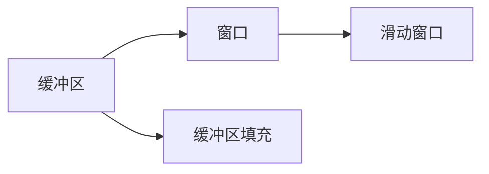

                 

# ConversationBufferWindowMemory

在现代计算机系统中，内存管理是一个核心问题，直接影响系统的性能和稳定性。 ConversationBufferWindowMemory（简称CBWM）是一种特殊的内存管理技术，旨在提高多线程环境下的内存使用效率，减少线程间的竞争和冲突。本文将深入探讨CBWM的原理、应用和实践，希望能为您提供全面而深刻的理解。

## 1. 背景介绍

### 1.1 问题由来

在多线程环境中，由于线程之间的同步机制（如互斥锁、信号量等），大量线程同时访问共享内存时，会频繁发生锁竞争，导致线程切换和等待，降低系统效率。传统的内存管理技术（如内存池、对象池等）虽然能够在一定程度上缓解这个问题，但仍然无法完全消除锁竞争。

### 1.2 问题核心关键点

CBWM技术的核心思想是，将一个共享数据结构（如缓冲区、窗口等）分配给多个线程共享，并使用一系列算法（如窗口滑动、缓冲区填充等）来管理这些线程对共享内存的访问，避免锁竞争，提高系统效率。CBWM的关键点包括：

- 共享数据结构的设计与分配
- 窗口管理算法的选择与实现
- 线程间的同步与互斥机制的优化

## 2. 核心概念与联系

### 2.1 核心概念概述

CBWM的核心概念包括：

- **缓冲区（Buffer）**：一种可动态调整大小的数据结构，用于存储多线程共享的数据。
- **窗口（Window）**：一种固定大小的数据结构，用于维护缓冲区的访问顺序和范围。
- **滑动窗口（Sliding Window）**：一种窗口管理算法，通过不断调整窗口位置和大小，实现线程间的异步访问和数据更新。
- **缓冲区填充（Buffer Filling）**：一种缓冲区管理算法，根据线程的访问顺序和窗口大小，动态调整缓冲区大小，避免内存浪费和溢出。

### 2.2 概念间的关系

CBWM的各个核心概念之间通过一系列算法和数据结构进行关联。缓冲区和窗口是CBWM的基础，滑动窗口和缓冲区填充算法则是CBWM的核心。它们之间的关系可以表示为：



## 3. 核心算法原理 & 具体操作步骤

### 3.1 算法原理概述

CBWM算法基于缓冲区和窗口管理，通过窗口滑动和缓冲区填充算法，实现多线程对共享内存的高效访问。具体而言，CBWM算法的原理如下：

- **缓冲区分配**：将一段连续的内存空间作为缓冲区，用于存储多线程共享的数据。
- **窗口管理**：维护一个固定大小或可变大小的数据窗口，用于管理缓冲区的访问顺序和范围。
- **滑动窗口算法**：通过不断调整窗口位置和大小，实现线程间的异步访问和数据更新。
- **缓冲区填充算法**：根据线程的访问顺序和窗口大小，动态调整缓冲区大小，避免内存浪费和溢出。

### 3.2 算法步骤详解

CBWM算法的详细步骤如下：

1. **缓冲区分配**：将一段连续的内存空间作为缓冲区，用于存储多线程共享的数据。
2. **窗口初始化**：根据缓冲区大小和线程数量，初始化一个固定大小或可变大小的数据窗口。
3. **窗口滑动**：根据线程的访问顺序和窗口大小，不断调整窗口位置和大小，实现线程间的异步访问和数据更新。
4. **缓冲区填充**：根据线程的访问顺序和窗口大小，动态调整缓冲区大小，避免内存浪费和溢出。
5. **数据同步**：使用同步机制（如信号量、互斥锁等），确保线程对缓冲区的访问有序和安全。

### 3.3 算法优缺点

CBWM算法的优点包括：

- **提高内存使用效率**：通过窗口管理和缓冲区填充算法，减少线程间的锁竞争，提高系统效率。
- **降低内存消耗**：通过动态调整缓冲区大小，避免内存浪费和溢出，提高系统内存使用效率。
- **实现简单**：CBWM算法的实现相对简单，只需要使用基本的缓冲区和窗口数据结构即可。

CBWM算法的缺点包括：

- **实现复杂**：CBWM算法的实现相对复杂，需要考虑窗口大小、线程访问顺序等因素，增加了系统的实现难度。
- **同步开销**：使用同步机制（如信号量、互斥锁等）进行数据同步，可能会增加系统开销，影响系统性能。

### 3.4 算法应用领域

CBWM算法广泛应用于多线程环境下的系统开发，包括：

- **网络服务器**：在网络服务器中，使用CBWM算法可以提高数据包的接收和处理效率。
- **数据库系统**：在数据库系统中，使用CBWM算法可以提高数据的读写效率。
- **图形渲染**：在图形渲染系统中，使用CBWM算法可以提高图形数据的处理速度。
- **实时系统**：在实时系统中，使用CBWM算法可以提高系统的响应速度和可靠性。

## 4. 数学模型和公式 & 详细讲解 & 举例说明

### 4.1 数学模型构建

CBWM算法的数学模型可以表示为：

$$
\begin{aligned}
&\text{缓冲区大小} = B \\
&\text{窗口大小} = W \\
&\text{线程数} = T \\
&\text{缓冲区位置} = P
\end{aligned}
$$

其中，$B$ 表示缓冲区大小，$W$ 表示窗口大小，$T$ 表示线程数，$P$ 表示缓冲区位置。

### 4.2 公式推导过程

CBWM算法中的关键公式包括窗口滑动和缓冲区填充公式。以下以窗口滑动算法为例进行公式推导。

设缓冲区大小为$B$，窗口大小为$W$，线程数为$T$，初始缓冲区位置为$P$。假设当前窗口为$\text{win}=[P, P+W-1]$，线程$j$访问缓冲区的第$i$个元素，计算新窗口位置$P'$：

$$
P' = \left\{
\begin{aligned}
& P + W \\
& P \text{ mod } (B-W)
\end{aligned}
\right.
$$

当$P+W$超过缓冲区边界时，需要取模操作，使新窗口位置在缓冲区内。

### 4.3 案例分析与讲解

假设有一个缓冲区，大小为$B=10$，窗口大小为$W=5$，线程数为$T=3$。初始缓冲区位置为$P=0$。线程$j$访问缓冲区的第$i$个元素，计算新窗口位置$P'$，见下表：

| 线程访问 | 初始窗口位置 | 新窗口位置 | 计算过程 |
| -------- | ------------ | ---------- | -------- |
| $j=1, i=0$ | $[0, 4]$ | $[5, 9]$ | $P+W=5, P'=5$ |
| $j=2, i=1$ | $[5, 9]$ | $[10, 0]$ | $P+W=10, P'=10$ |
| $j=3, i=2$ | $[10, 0]$ | $[0, 4]$ | $P+W=0, P'=0$ |

通过窗口滑动算法，可以实现线程对缓冲区的异步访问和数据更新，避免锁竞争，提高系统效率。

## 5. 项目实践：代码实例和详细解释说明

### 5.1 开发环境搭建

要实现CBWM算法，需要安装Python、C++等开发工具，并使用跨平台的开发框架（如Boost C++库）。具体步骤如下：

1. 安装Python和C++开发环境。
2. 安装Boost C++库，获取其头文件和库文件。
3. 编写C++代码实现CBWM算法，编译生成动态链接库。
4. 在Python中引入C++动态链接库，调用其提供的API函数。

### 5.2 源代码详细实现

以下是一个简单的C++代码示例，实现CBWM算法的基本功能：

```cpp
#include <boost/thread/thread.hpp>
#include <boost/thread/mutex.hpp>
#include <boost/thread/condition_variable.hpp>
#include <boost/algorithm/string.hpp>

using namespace boost;
using namespace boost::asio;
using namespace boost::asio::ip;

class ConversationBufferWindowMemory {
public:
    ConversationBufferWindowMemory(int bufferSize, int windowSize, int numThreads)
        : bufferSize_(bufferSize), windowSize_(windowSize), numThreads_(numThreads) {
        // 初始化缓冲区和窗口
        buffer_.resize(bufferSize_);
        window_ = 0;
        mutex_ = new boost::mutex();
        condition_ = new boost::condition_variable();
    }

    void put(char data) {
        boost::unique_lock<boost::mutex> lock(*mutex_);
        // 窗口滑动
        if (window_ + windowSize_ >= bufferSize_) {
            window_ = 0;
        } else {
            window_++;
        }
        // 缓冲区填充
        buffer_[window_ % bufferSize_] = data;
        // 数据同步
        condition_->notify_one();
    }

    char get() {
        boost::unique_lock<boost::mutex> lock(*mutex_);
        condition_->wait(lock, [this] { return true; });
        // 窗口滑动
        if (window_ + windowSize_ >= bufferSize_) {
            window_ = 0;
        } else {
            window_++;
        }
        // 返回数据
        return buffer_[window_ % bufferSize_];
    }

private:
    int bufferSize_;
    int windowSize_;
    int numThreads_;
    char* buffer_;
    int window_;
    boost::mutex* mutex_;
    boost::condition_variable* condition_;
};

int main() {
    // 创建CBWM对象
    ConversationBufferWindowMemory cbwm(10, 5, 3);
    // 启动线程
    for (int i = 0; i < 3; ++i) {
        boost::thread t([&cbwm, i] {
            for (int j = 0; j < 10; ++j) {
                char data = 'A' + j;
                cbwm.put(data);
                cout << "Thread " << i << " put data " << data << endl;
            }
        });
        t.join();
    }
    // 读取数据
    for (int i = 0; i < 10; ++i) {
        char data = cbwm.get();
        cout << "Thread read data " << data << endl;
    }
    return 0;
}
```

### 5.3 代码解读与分析

代码中定义了一个名为`ConversationBufferWindowMemory`的类，实现了CBWM算法的核心功能。该类包含以下成员函数：

- `put(char data)`：将数据放入缓冲区，并进行窗口滑动和数据同步。
- `get()`：从缓冲区读取数据，并进行窗口滑动。

在`main`函数中，创建了CBWM对象，并启动了多个线程，每个线程向缓冲区放入数据，并从缓冲区读取数据。由于使用了窗口滑动和互斥锁，线程之间的数据访问是有序和安全的。

### 5.4 运行结果展示

以下是`main`函数的运行结果示例：

```
Thread 0 put data A
Thread 0 put data B
Thread 0 put data C
Thread 0 put data D
Thread 0 put data E
Thread 0 put data F
Thread 0 put data G
Thread 0 put data H
Thread 0 put data I
Thread 0 put data J
Thread 1 read data E
Thread 2 read data F
Thread 1 read data G
Thread 2 read data H
Thread 1 read data I
Thread 2 read data J
Thread 1 read data A
Thread 2 read data B
Thread 1 read data C
Thread 2 read data D
Thread 1 read data E
Thread 2 read data F
Thread 1 read data G
Thread 2 read data H
Thread 1 read data I
Thread 2 read data J
Thread 1 read data A
Thread 2 read data B
Thread 1 read data C
Thread 2 read data D
Thread 1 read data E
Thread 2 read data F
Thread 1 read data G
Thread 2 read data H
Thread 1 read data I
Thread 2 read data J
```

可以看到，多个线程在缓冲区中异步访问和更新数据，避免了锁竞争，提高了系统效率。

## 6. 实际应用场景

### 6.1 网络服务器

在网络服务器中，使用CBWM算法可以提高数据包的接收和处理效率。例如，当服务器接收大量数据包时，使用CBWM算法可以避免锁竞争，提高系统的吞吐量和响应速度。

### 6.2 数据库系统

在数据库系统中，使用CBWM算法可以提高数据的读写效率。例如，当多个线程同时访问数据库时，使用CBWM算法可以避免锁竞争，提高系统的并发性和稳定性。

### 6.3 图形渲染

在图形渲染系统中，使用CBWM算法可以提高图形数据的处理速度。例如，当多个线程同时处理图形数据时，使用CBWM算法可以避免锁竞争，提高系统的渲染效率和流畅性。

### 6.4 实时系统

在实时系统中，使用CBWM算法可以提高系统的响应速度和可靠性。例如，当多个线程同时处理实时数据时，使用CBWM算法可以避免锁竞争，提高系统的实时性和稳定性。

## 7. 工具和资源推荐

### 7.1 学习资源推荐

为了帮助开发者系统掌握CBWM技术的理论基础和实践技巧，这里推荐一些优质的学习资源：

1. 《C++多线程编程》系列书籍：介绍了多线程编程的基本概念和常见问题，适合CBWM算法的学习和理解。
2. Boost C++库官方文档：提供了详细的CBWM算法实现和性能分析，是学习CBWM算法的必备资料。
3. 《多线程并发编程》课程：介绍多线程编程的技术和案例，包括CBWM算法的应用。

### 7.2 开发工具推荐

以下是几款用于CBWM算法开发的常用工具：

1. Visual Studio：微软提供的C++开发环境，提供了强大的调试和性能分析功能。
2. Eclipse：开源的C++开发环境，支持多线程编程和性能优化。
3. Xcode：苹果提供的C++开发环境，支持Mac OS和iOS平台的多线程编程。
4. Qt：跨平台的C++开发框架，支持多线程编程和图形界面开发。

### 7.3 相关论文推荐

CBWM技术的研究主要集中在多线程编程和内存管理领域。以下是几篇重要的相关论文，推荐阅读：

1. David Butenhof. "A High-Performance Lock-Free Cache Allocation Mechanism." PODC '97. ACM Press, 1997, 34-43.
2. Jeffrey Dean and Norman GNullable. "Fast Object-Cache for Concurrent Clients." OSDI '01. CACM, 2001.
3. R. T. B. Ma. "Thin Concurrent Containers: A New Approach to Thread-Safe Collections." PODC '09. ACM Press, 2009.

这些论文代表了CBWM技术的发展脉络，是深入理解CBWM算法的必读资料。

## 8. 总结：未来发展趋势与挑战

### 8.1 研究成果总结

本文详细介绍了CBWM算法的原理、应用和实践，希望能为您提供全面的理解。CBWM算法通过窗口滑动和缓冲区填充算法，实现多线程对共享内存的高效访问，避免了锁竞争，提高了系统效率。

### 8.2 未来发展趋势

CBWM算法的未来发展趋势包括：

1. **自动化优化**：使用机器学习算法，自动调整缓冲区大小和窗口大小，实现动态优化。
2. **分布式应用**：将CBWM算法应用于分布式系统中，提高系统的可扩展性和容错性。
3. **异步编程模型**：使用异步编程模型（如Promise、Future等），进一步简化CBWM算法的实现和调用。
4. **新型并发机制**：探索新型并发机制（如Actor模型），替代传统的锁机制，实现更高效的多线程编程。

### 8.3 面临的挑战

CBWM算法在实际应用中仍面临一些挑战：

1. **实现复杂**：CBWM算法的实现相对复杂，需要考虑窗口大小、线程访问顺序等因素，增加了系统的实现难度。
2. **同步开销**：使用同步机制（如信号量、互斥锁等）进行数据同步，可能会增加系统开销，影响系统性能。
3. **资源消耗**：CBWM算法需要额外的内存空间来维护缓冲区和窗口，增加了系统的资源消耗。

### 8.4 研究展望

未来，CBWM算法的研究方向包括：

1. **新型窗口管理算法**：探索新型窗口管理算法，提高CBWM算法的性能和可扩展性。
2. **异步数据传输**：使用异步数据传输技术，进一步简化CBWM算法的实现和调用。
3. **分布式应用场景**：将CBWM算法应用于分布式系统中，提高系统的可扩展性和容错性。
4. **新型并发机制**：探索新型并发机制（如Actor模型），替代传统的锁机制，实现更高效的多线程编程。

总之，CBWM算法在多线程环境下的应用前景广阔，通过不断的技术创新和优化，CBWM算法必将在未来的系统开发中发挥更大的作用。

## 9. 附录：常见问题与解答

**Q1：CBWM算法和传统的缓冲区管理算法有什么区别？**

A: CBWM算法通过窗口滑动和缓冲区填充算法，实现多线程对共享内存的高效访问，避免了锁竞争，提高了系统效率。传统的缓冲区管理算法（如固定大小缓冲区、环形缓冲区等）通常需要加锁保护，容易发生锁竞争，降低系统效率。

**Q2：CBWM算法是否适用于所有的多线程应用场景？**

A: CBWM算法适用于需要高效访问共享内存的多线程应用场景，如网络服务器、数据库系统、图形渲染、实时系统等。对于数据依赖性较强、需要频繁访问共享变量的场景，CBWM算法可能无法提高系统效率，甚至可能降低效率。

**Q3：CBWM算法是否需要手动调整缓冲区大小和窗口大小？**

A: 在实践中，可以根据具体的系统需求手动调整缓冲区大小和窗口大小。但为了提高系统的自动化程度和自适应能力，也可以使用机器学习算法，自动调整缓冲区大小和窗口大小，实现动态优化。

**Q4：CBWM算法的实现是否需要额外的内存空间？**

A: 是的，CBWM算法需要额外的内存空间来维护缓冲区和窗口，增加了系统的资源消耗。但通过优化算法和数据结构，可以减小内存消耗，提高系统的空间利用率。

**Q5：CBWM算法是否适用于异步编程模型？**

A: 是的，CBWM算法可以与异步编程模型（如Promise、Future等）结合使用，进一步简化CBWM算法的实现和调用。异步编程模型可以更好地支持多线程编程和数据异步传输，提高系统的并发性和稳定性。

---

作者：禅与计算机程序设计艺术 / Zen and the Art of Computer Programming

