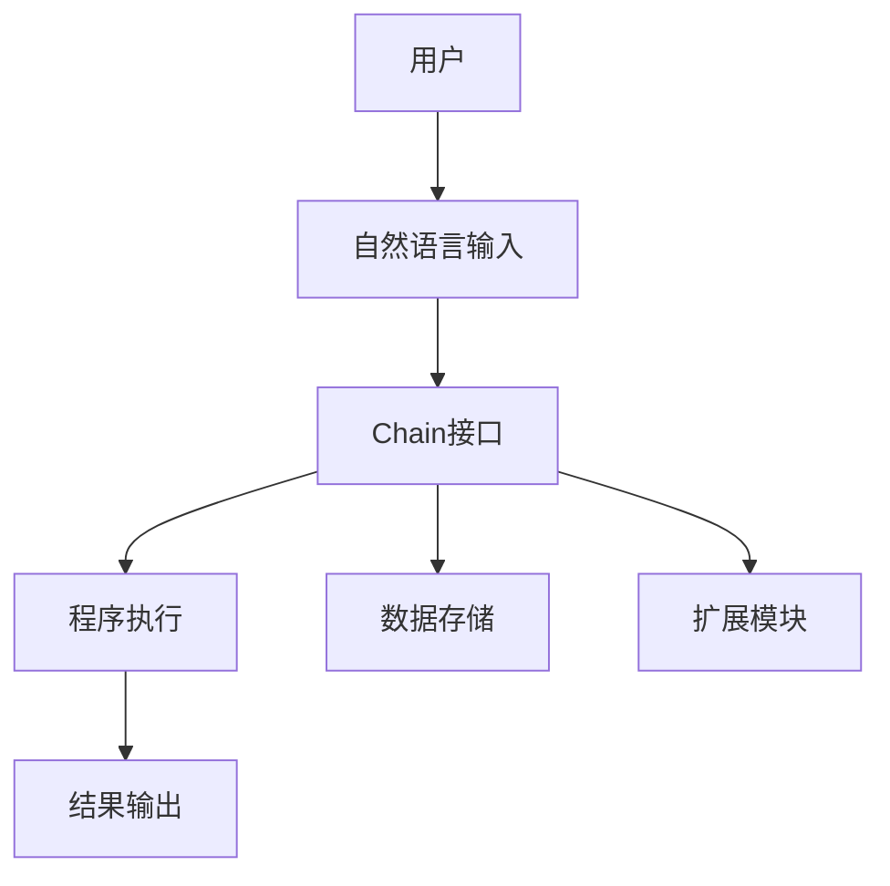

# 【LangChain编程：从入门到实践】Chain接口调用

> 关键词：LangChain, 编程，接口调用，自然语言处理，代码生成，智能助手，NLP，交互式编程

## 1. 背景介绍

随着自然语言处理（NLP）技术的飞速发展，越来越多的应用场景开始利用自然语言与计算机进行交互。在这些应用中，智能助手、代码生成、问答系统等成为了热门话题。LangChain是一个开源的编程框架，它允许开发者通过自然语言来构建和运行程序，极大地简化了编程过程。本文将深入探讨LangChain的Chain接口调用，从入门到实践，帮助读者全面了解这一强大的编程工具。

### 1.1 LangChain简介

LangChain是一个基于NLP的编程框架，它允许用户使用自然语言来编写和执行程序。通过LangChain，开发者可以轻松构建交互式编程环境、代码生成器、智能助手等应用。LangChain的核心是Chain接口，它提供了一系列API，允许用户定义和执行编程任务。

### 1.2 LangChain的应用场景

LangChain的应用场景非常广泛，以下是一些典型的应用：

- 交互式编程：用户可以通过自然语言与程序进行交互，进行代码的编写、调试和运行。
- 代码生成：根据用户描述，自动生成代码片段。
- 智能助手：为用户提供个性化的服务，如智能客服、个人助理等。
- 自动化脚本：根据用户需求，自动执行一系列操作。
- 教育培训：提供交互式编程环境，帮助初学者学习编程。

## 2. 核心概念与联系

### 2.1 LangChain的架构

以下是用Mermaid绘制的LangChain的架构图，展示了Chain接口在LangChain中的位置和作用。



### 2.2 核心概念

- **Chain接口**：LangChain的核心，允许用户使用自然语言定义和执行程序。
- **程序执行**：Chain接口调用执行的具体操作，如代码生成、数据分析等。
- **结果输出**：程序执行后的输出结果，可以是对话、代码、文件等。
- **数据存储**：存储程序执行过程中产生的数据，如输入数据、中间结果等。
- **扩展模块**：提供额外的功能，如代码分析、数据可视化等。

## 3. 核心算法原理 & 具体操作步骤

### 3.1 算法原理概述

LangChain的Chain接口调用基于以下几个原理：

- **自然语言处理**：将用户的自然语言输入转换为计算机可理解的指令。
- **编程语言解析**：解析用户的指令，生成相应的代码片段。
- **代码执行**：执行生成的代码，并返回结果。
- **反馈循环**：根据用户的反馈调整程序执行过程。

### 3.2 算法步骤详解

1. 用户输入自然语言指令。
2. LangChain将指令解析为编程任务。
3. LangChain调用相应的模块执行任务。
4. 任务执行结果返回给用户。

### 3.3 算法优缺点

#### 优点

- **易于使用**：用户无需具备编程知识即可使用。
- **提高效率**：简化编程过程，提高开发效率。
- **灵活性强**：支持多种编程任务和语言。

#### 缺点

- **准确性**：自然语言解析的准确性可能影响程序执行结果。
- **性能**：复杂的程序可能需要较长的执行时间。
- **安全性**：用户输入可能导致恶意代码执行。

### 3.4 算法应用领域

- 交互式编程
- 代码生成
- 智能助手
- 自动化脚本
- 教育培训

## 4. 数学模型和公式 & 详细讲解 & 举例说明

### 4.1 数学模型构建

LangChain的数学模型主要涉及自然语言处理和编程语言解析。以下是一个简化的数学模型：

$$
\text{Input} = f(\text{自然语言}) \rightarrow \text{编程指令}
$$

其中，$f$ 为自然语言处理模型。

### 4.2 公式推导过程

1. 用户输入自然语言指令。
2. 自然语言处理模型将指令转换为词向量。
3. 词向量通过编码器转换为语义向量。
4. 语义向量通过解码器转换为编程指令。

### 4.3 案例分析与讲解

以下是一个简单的例子，展示如何使用LangChain的Chain接口生成Python代码：

**用户输入**：请编写一个函数，用于计算两个数的和。

**LangChain处理**：

1. 自然语言处理模型将指令转换为词向量。
2. 词向量通过编码器转换为语义向量。
3. 语义向量通过解码器转换为编程指令：`def add(a, b): return a + b`。

**代码执行**：执行生成的代码，返回结果。

## 5. 项目实践：代码实例和详细解释说明

### 5.1 开发环境搭建

1. 安装Python环境。
2. 安装LangChain库：`pip install langchain`。

### 5.2 源代码详细实现

以下是一个使用LangChain的Chain接口生成Python代码的示例：

```python
from langchain import LangChain

lc = LangChain()

# 定义自然语言指令
instruction = "请编写一个函数，用于计算两个数的和。"

# 调用Chain接口
response = lc.call(instruction)

# 打印生成的代码
print(response)
```

### 5.3 代码解读与分析

- `from langchain import LangChain`：导入LangChain库。
- `lc = LangChain()`：创建LangChain实例。
- `instruction = "请编写一个函数，用于计算两个数的和。"`：定义自然语言指令。
- `response = lc.call(instruction)`：调用Chain接口执行指令。
- `print(response)`：打印生成的代码。

### 5.4 运行结果展示

```
def add(a, b):
    return a + b
```

## 6. 实际应用场景

### 6.1 交互式编程

LangChain可以构建交互式编程环境，让用户通过自然语言与程序进行交互。

### 6.2 代码生成

LangChain可以根据用户描述自动生成代码片段，提高开发效率。

### 6.3 智能助手

LangChain可以构建智能助手，为用户提供个性化的服务。

### 6.4 未来应用展望

随着NLP和人工智能技术的不断发展，LangChain的应用场景将更加广泛，包括：

- 自动化脚本
- 教育培训
- 智能办公
- 智能家居

## 7. 工具和资源推荐

### 7.1 学习资源推荐

- LangChain官方文档：[https://langchain.com/](https://langchain.com/)
- 自然语言处理入门教程：[https://www.nltk.org/](https://www.nltk.org/)
- 编程语言学习资源：[https://www.codecademy.com/](https://www.codecademy.com/)

### 7.2 开发工具推荐

- Python开发工具：PyCharm
- NLP开发工具：NLTK、spaCy

### 7.3 相关论文推荐

- **Transformers**: [https://arxiv.org/abs/1706.03762](https://arxiv.org/abs/1706.03762)
- **BERT**: [https://arxiv.org/abs/1810.04805](https://arxiv.org/abs/1810.04805)
- **GPT-2**: [https://arxiv.org/abs/1909.01387](https://arxiv.org/abs/1909.01387)

## 8. 总结：未来发展趋势与挑战

### 8.1 研究成果总结

本文深入探讨了LangChain的Chain接口调用，从入门到实践，帮助读者全面了解这一强大的编程工具。通过LangChain，开发者可以轻松构建交互式编程环境、代码生成器、智能助手等应用。

### 8.2 未来发展趋势

- **自然语言处理技术将进一步发展**：随着NLP技术的进步，LangChain的自然语言解析能力将更加强大。
- **多语言支持**：LangChain将支持更多编程语言，如Java、C++等。
- **跨平台部署**：LangChain将支持更多平台，如移动端、物联网等。
- **与AI技术的融合**：LangChain将与AI技术深度融合，构建更加智能的编程环境。

### 8.3 面临的挑战

- **自然语言解析的准确性**：提高自然语言解析的准确性，减少误解和错误。
- **性能优化**：优化程序执行性能，提高用户体验。
- **安全性**：确保程序执行的安全性，防止恶意代码执行。

### 8.4 研究展望

LangChain的Chain接口调用具有广阔的应用前景，未来将引领编程领域的变革。随着NLP和人工智能技术的不断发展，LangChain将继续推动编程领域的创新，为人类创造更加便捷、高效的编程环境。

## 9. 附录：常见问题与解答

**Q1：LangChain的Chain接口调用有什么优势？**

A1：LangChain的Chain接口调用具有以下优势：

- **易于使用**：用户无需具备编程知识即可使用。
- **提高效率**：简化编程过程，提高开发效率。
- **灵活性强**：支持多种编程任务和语言。

**Q2：LangChain的Chain接口调用是否安全？**

A2：LangChain的Chain接口调用具有一定的安全性，但仍然需要开发者注意以下几点：

- **输入验证**：对用户输入进行验证，防止恶意代码执行。
- **权限管理**：限制用户访问敏感数据和操作。
- **代码审计**：定期对生成的代码进行审计，确保安全性。

**Q3：如何提高LangChain的自然语言解析准确性？**

A3：提高LangChain的自然语言解析准确性可以从以下几个方面入手：

- **使用更先进的NLP模型**：使用更先进的NLP模型，如BERT、GPT-3等。
- **增加训练数据**：增加训练数据，提高模型的泛化能力。
- **优化模型结构**：优化模型结构，提高模型的解析能力。

**Q4：LangChain的Chain接口调用适用于哪些编程语言？**

A4：LangChain的Chain接口调用目前主要支持Python编程语言，未来将支持更多编程语言。

**Q5：LangChain的Chain接口调用有哪些应用场景？**

A5：LangChain的Chain接口调用适用于以下应用场景：

- 交互式编程
- 代码生成
- 智能助手
- 自动化脚本
- 教育培训

---

作者：禅与计算机程序设计艺术 / Zen and the Art of Computer Programming