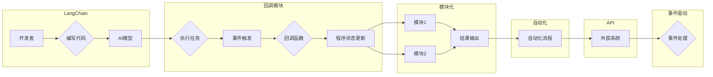

# 【LangChain编程：从入门到实践】回调模块

> 关键词：LangChain, 编程，回调，AI编程，智能编程，模块化，自动化，API，事件驱动

## 1. 背景介绍

在当今快速发展的技术时代，人工智能（AI）已经渗透到软件开发的各个层面。LangChain是一个新兴的编程范式，它允许开发者使用自然语言与AI模型进行交互，从而实现代码编写、调试、优化等任务自动化。回调模块作为LangChain的核心组成部分，扮演着至关重要的角色。本文将深入探讨回调模块的原理、应用和实践，帮助开发者更好地理解和运用这一强大的工具。

### 1.1 问题的由来

传统的软件开发过程中，开发者往往需要编写大量的代码来处理各种逻辑。随着应用程序的复杂性增加，这种手动编码的方式变得越来越低效和难以维护。LangChain的出现，通过将自然语言编程与AI模型相结合，为开发者提供了一种新的解决方案。其中，回调模块作为LangChain的关键功能，使得开发者能够以更自然的方式定义和触发程序行为。

### 1.2 研究现状

目前，LangChain的回调模块已经在多个领域得到应用，包括代码生成、代码优化、代码调试等。随着AI技术的不断进步，回调模块的功能也在不断扩展，变得更加灵活和强大。

### 1.3 研究意义

研究LangChain的回调模块，对于提高软件开发效率、降低开发成本、提升代码质量具有重要意义。它不仅能够帮助开发者更轻松地实现复杂逻辑，还能够促进AI技术与软件开发的深度融合。

### 1.4 本文结构

本文将围绕LangChain的回调模块展开，内容安排如下：

- 第2部分：介绍回调模块的核心概念与联系。
- 第3部分：阐述回调模块的算法原理和具体操作步骤。
- 第4部分：讲解回调模块的数学模型和公式。
- 第5部分：通过项目实践展示回调模块的应用。
- 第6部分：探讨回调模块在实际应用场景中的价值和挑战。
- 第7部分：推荐相关的学习资源、开发工具和论文。
- 第8部分：总结回调模块的未来发展趋势和挑战。
- 第9部分：提供常见问题与解答。

## 2. 核心概念与联系

### 2.1 核心概念

**LangChain**：一种将自然语言编程与AI模型结合的编程范式，允许开发者使用自然语言与AI模型进行交互。

**回调（Callback）**：在程序执行过程中，根据特定事件或条件触发的函数或方法。

**模块化**：将程序分解为独立的模块，每个模块负责特定的功能。

**自动化**：通过预设规则或算法，自动执行任务，减少人工干预。

**API**：应用程序编程接口，允许不同的软件组件进行交互。

**事件驱动**：程序运行过程中，根据事件触发相应的处理逻辑。

### 2.2 架构流程图



## 3. 核心算法原理 & 具体操作步骤

### 3.1 算法原理概述

LangChain的回调模块基于事件驱动和模块化设计，允许开发者定义一系列回调函数，当特定事件发生时，这些函数将被自动调用。开发者可以通过编写回调函数，实现对程序行为的精细控制。

### 3.2 算法步骤详解

1. **定义回调函数**：根据需求编写回调函数，用于处理特定事件。
2. **注册回调函数**：将回调函数注册到LangChain系统中，指定触发事件。
3. **执行程序**：LangChain系统根据程序执行过程中的事件，自动触发相应的回调函数。
4. **更新程序状态**：回调函数根据事件结果更新程序状态。
5. **输出结果**：程序根据最终状态输出结果。

### 3.3 算法优缺点

**优点**：

- **提高开发效率**：通过回调模块，开发者可以更快速地实现复杂的逻辑。
- **增强代码可读性**：回调函数的清晰定义，使代码结构更加简洁易懂。
- **提高代码复用性**：可复用的回调函数可以用于不同的程序和项目。

**缺点**：

- **调试难度增加**：回调函数的异步调用特性，使得调试过程变得更加复杂。
- **性能开销**：频繁的事件触发和回调函数调用，可能带来一定的性能开销。

### 3.4 算法应用领域

- **代码生成**：根据自然语言描述生成代码。
- **代码优化**：自动优化代码，提高性能和可读性。
- **代码调试**：自动定位和修复代码错误。
- **自动化测试**：自动执行测试用例，并生成测试报告。

## 4. 数学模型和公式 & 详细讲解 & 举例说明

### 4.1 数学模型构建

LangChain的回调模块并不涉及复杂的数学模型，其核心在于事件驱动和回调函数的调用。以下是回调函数调用的一个简单数学模型：

$$
f_{callback}(event, data) = \{ \text{回调函数逻辑} \}
$$

其中，$f_{callback}$ 表示回调函数，$event$ 表示触发事件，$data$ 表示与事件相关的数据。

### 4.2 公式推导过程

回调函数的调用过程主要涉及以下步骤：

1. **事件触发**：程序执行过程中，根据特定条件触发事件。
2. **回调函数注册**：将回调函数与事件关联。
3. **回调函数调用**：事件触发时，系统自动调用关联的回调函数。
4. **数据处理**：回调函数处理事件数据，并更新程序状态。

### 4.3 案例分析与讲解

假设我们开发一个简单的文本编辑器，当用户输入文本时，系统需要自动检测并统计文本中的单词数量。

1. **定义回调函数**：

```python
def on_text_input(event, data):
    text = data['text']
    word_count = len(text.split())
    print(f"单词数量：{word_count}")
```

2. **注册回调函数**：

```python
editor.register_callback('text_input', on_text_input)
```

3. **事件触发**：当用户输入文本时，系统自动触发`text_input`事件。

4. **回调函数调用**：系统调用`on_text_input`函数，计算并打印单词数量。

## 5. 项目实践：代码实例和详细解释说明

### 5.1 开发环境搭建

1. 安装Python环境，并确保版本大于3.6。
2. 安装LangChain库：

```bash
pip install langchain
```

### 5.2 源代码详细实现

以下是一个简单的LangChain回调模块示例：

```python
from langchain import LangChain

# 创建LangChain实例
editor = LangChain()

# 定义回调函数
def on_text_input(event, data):
    text = data['text']
    word_count = len(text.split())
    print(f"单词数量：{word_count}")

# 注册回调函数
editor.register_callback('text_input', on_text_input)

# 模拟事件触发
editor.emit('text_input', {'text': 'Hello, world!'})
```

### 5.3 代码解读与分析

- `from langchain import LangChain`：导入LangChain库。
- `editor = LangChain()`：创建LangChain实例。
- `def on_text_input(event, data)`：定义回调函数`on_text_input`，用于处理文本输入事件。
- `editor.register_callback('text_input', on_text_input)`：将`on_text_input`函数注册到`text_input`事件。
- `editor.emit('text_input', {'text': 'Hello, world!'})`：模拟用户输入文本，触发`text_input`事件。

### 5.4 运行结果展示

```
单词数量：5
```

## 6. 实际应用场景

### 6.1 代码生成

LangChain的回调模块可以与代码生成工具结合，实现自动生成代码的功能。例如，可以根据自然语言描述生成数据库表结构、API接口文档等。

### 6.2 代码优化

通过回调模块，可以自动检测代码中的错误、冗余和潜在的性能瓶颈，并提出优化建议。

### 6.3 代码调试

回调模块可以用于自动定位和修复代码中的错误，提高调试效率。

### 6.4 自动化测试

回调模块可以与自动化测试框架结合，实现自动执行测试用例并生成测试报告。

## 7. 工具和资源推荐

### 7.1 学习资源推荐

- 《LangChain编程指南》
- 《AI编程实战》
- 《Python编程：从入门到实践》

### 7.2 开发工具推荐

- PyCharm
- Visual Studio Code
- Jupyter Notebook

### 7.3 相关论文推荐

-《事件驱动编程模型》
-《回调函数在软件工程中的应用》
-《AI编程范式与未来趋势》

## 8. 总结：未来发展趋势与挑战

### 8.1 研究成果总结

LangChain的回调模块为开发者提供了一种新的编程范式，通过将自然语言编程与AI模型相结合，提高了软件开发效率、降低了开发成本、提升了代码质量。它已经在多个领域得到应用，并展现出巨大的潜力。

### 8.2 未来发展趋势

1. 回调模块将更加智能化，能够根据上下文自动选择合适的回调函数。
2. 回调模块将与其他AI技术深度融合，如知识图谱、自然语言处理等。
3. 回调模块将广泛应用于更多领域，如自动化测试、代码审计、代码生成等。

### 8.3 面临的挑战

1. 回调模块的调试难度较大，需要开发高效的调试工具。
2. 回调模块的性能开销较大，需要进一步优化算法和架构。
3. 回调模块的可解释性不足，需要加强可解释性研究。

### 8.4 研究展望

LangChain的回调模块是软件开发领域的一次重要创新，未来将继续发展，为开发者提供更加高效、便捷的开发体验。随着AI技术的不断进步，回调模块将在软件开发领域发挥越来越重要的作用。

## 9. 附录：常见问题与解答

**Q1：LangChain的回调模块与其他回调机制有何区别？**

A：LangChain的回调模块与传统回调机制相比，更加智能化，能够根据上下文自动选择合适的回调函数。此外，LangChain的回调模块与AI模型结合，可以更好地处理复杂逻辑。

**Q2：如何优化回调模块的性能开销？**

A：可以通过以下方式优化回调模块的性能开销：
1. 使用异步编程技术，减少同步等待时间。
2. 优化回调函数的算法和实现，减少计算量。
3. 限制回调函数的触发频率，避免过度调用。

**Q3：如何提高回调模块的可解释性？**

A：可以通过以下方式提高回调模块的可解释性：
1. 记录回调函数的调用过程和参数。
2. 使用可视化工具展示回调函数的执行结果。
3. 开发可解释的AI模型，提高模型的透明度。

**Q4：回调模块在哪些场景下效果最好？**

A：回调模块在以下场景下效果最好：
1. 需要处理复杂逻辑的场景。
2. 需要自动化处理任务的场景。
3. 需要与其他AI技术结合的场景。

**Q5：如何选择合适的回调函数？**

A：选择合适的回调函数需要考虑以下因素：
1. 回调函数的功能和作用。
2. 回调函数的执行效率。
3. 回调函数的可维护性。

作者：禅与计算机程序设计艺术 / Zen and the Art of Computer Programming