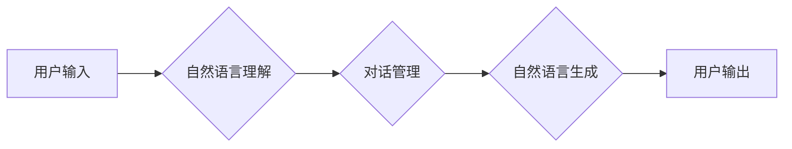

# 从ChatGPT到未来AI助手

> 关键词：ChatGPT, GPT-3, AI助手, 自然语言处理, 人工智能, 聊天机器人, 智能交互, 机器学习

## 1. 背景介绍

近年来，人工智能技术取得了突飞猛进的进展，其中自然语言处理（NLP）领域尤为引人注目。从最初的规则引擎到深度学习时代的突破，再到如今大型语言模型的崛起，NLP技术正在改变着人类与机器交互的方式。ChatGPT作为OpenAI在2022年推出的革命性产品，标志着自然语言处理和人工智能交互的新里程碑。本文将探讨从ChatGPT到未来AI助手的演变过程，分析其核心概念、算法原理、应用场景和未来发展趋势。

### 1.1 ChatGPT的诞生

ChatGPT是OpenAI于2022年11月推出的一个人工智能聊天机器人程序，基于GPT-3.5语言模型。该模型在人类反馈强化学习（RLHF）的基础上，通过在大量人类反馈数据上训练，实现了与人类更加自然、流畅的对话。

### 1.2 研究现状

ChatGPT的推出引发了全球范围内的关注，众多企业和研究机构纷纷跟进，推出各自的AI聊天机器人产品。当前，AI聊天机器人的研究主要集中在以下几个方面：

1. **预训练语言模型**：通过在大量无标签文本数据上训练，学习通用的语言表示和知识。
2. **人类反馈强化学习**：利用人类提供的反馈数据，优化模型在特定任务上的性能。
3. **多模态交互**：将文本交互与其他模态（如语音、图像）结合，提升交互体验。
4. **知识图谱**：利用知识图谱构建领域知识库，增强AI助手的问答能力和知识储备。
5. **人机协同**：结合人类专家的智慧和AI助手的能力，实现更加智能化的服务。

### 1.3 研究意义

AI聊天机器人的发展，不仅能够提升用户与机器的交互体验，还能在多个领域带来颠覆性的变革：

1. **客服与支持**：提供24/7的智能客服服务，降低企业运营成本。
2. **教育辅助**：辅助学生学习，提供个性化的学习方案。
3. **健康医疗**：协助医生进行诊断和治疗，提高医疗服务的效率和质量。
4. **金融服务**：提供智能投资建议，帮助用户进行理财。
5. **娱乐与游戏**：为用户提供更加丰富的娱乐体验。

### 1.4 本文结构

本文将围绕以下内容展开：

- 核心概念与联系：介绍AI聊天机器人的核心概念和流程。
- 核心算法原理与操作步骤：阐述AI聊天机器人的算法原理和实现方法。
- 数学模型与公式：讲解AI聊天机器人的数学模型和公式。
- 项目实践：提供AI聊天机器人的代码实例和详细解释。
- 实际应用场景：分析AI聊天机器人在各个领域的应用。
- 未来应用展望：探讨AI聊天机器人的未来发展趋势。

## 2. 核心概念与联系

### 2.1 核心概念

1. **自然语言处理（NLP）**：研究如何使计算机能够理解、解释和生成人类语言的技术。
2. **预训练语言模型**：在大规模无标签文本数据上预训练的语言模型，如GPT、BERT等。
3. **人类反馈强化学习**：利用人类反馈数据优化模型性能的技术。
4. **聊天机器人**：模拟人类语言进行对话的软件程序。
5. **知识图谱**：描述实体、关系和属性的图结构数据。

### 2.2 架构流程

以下是AI聊天机器人的典型架构流程：



- **自然语言理解（NLU）**：将用户输入的文本转换为机器可以理解的结构化数据。
- **对话管理（DM）**：根据上下文信息，决定下一轮对话的行动。
- **自然语言生成（NLG）**：根据对话管理生成的行动，生成自然语言回复。
- **用户输出**：将回复发送给用户。

## 3. 核心算法原理 & 具体操作步骤

### 3.1 算法原理概述

AI聊天机器人的核心算法通常包括以下几个步骤：

1. **预训练语言模型**：在无标签文本数据上预训练，学习通用的语言表示。
2. **自然语言理解（NLU）**：将用户输入的文本转换为机器可以理解的结构化数据。
3. **对话管理（DM）**：根据上下文信息，决定下一轮对话的行动。
4. **自然语言生成（NLG）**：根据对话管理生成的行动，生成自然语言回复。

### 3.2 算法步骤详解

1. **预训练语言模型**：

   - 收集大规模无标签文本数据。
   - 设计预训练任务，如掩码语言模型（MLM）或旋转语言模型（Rouge）。
   - 使用梯度下降算法优化模型参数。

2. **自然语言理解（NLU）**：

   - 使用预训练语言模型对用户输入进行编码。
   - 根据编码结果，提取文本特征，如词向量、词性标注等。
   - 使用分类算法（如分类器、序列标注器等）对提取的特征进行分类。

3. **对话管理（DM）**：

   - 根据NLU的输出，确定对话状态和上下文信息。
   - 使用状态机或神经网络模型生成对话动作。

4. **自然语言生成（NLG）**：

   - 根据对话管理生成的动作，选择合适的回复模板。
   - 使用预训练语言模型生成自然语言回复。

### 3.3 算法优缺点

**优点**：

- **通用性**：预训练语言模型具有通用性，可以应用于不同的NLP任务。
- **高效性**：使用预训练语言模型可以显著提高NLU和NLG的效率。
- **灵活性**：可以根据不同的需求调整对话管理策略。

**缺点**：

- **可解释性**：预训练语言模型的决策过程难以解释。
- **数据依赖性**：预训练语言模型的效果很大程度上取决于训练数据的数量和质量。
- **计算资源消耗**：预训练语言模型需要大量的计算资源。

### 3.4 算法应用领域

AI聊天机器人可以应用于以下领域：

- **客服与支持**：提供24/7的智能客服服务，降低企业运营成本。
- **教育辅助**：辅助学生学习，提供个性化的学习方案。
- **健康医疗**：协助医生进行诊断和治疗，提高医疗服务的效率和质量。
- **金融服务**：提供智能投资建议，帮助用户进行理财。
- **娱乐与游戏**：为用户提供更加丰富的娱乐体验。

## 4. 数学模型和公式 & 详细讲解 & 举例说明

### 4.1 数学模型构建

AI聊天机器人的核心数学模型通常包括以下部分：

1. **预训练语言模型**：如GPT、BERT等，使用深度神经网络进行编码和解码。
2. **自然语言理解（NLU）**：使用分类器或序列标注器进行文本分类或词性标注。
3. **对话管理（DM）**：使用状态机或神经网络模型进行动作生成。
4. **自然语言生成（NLG）**：使用预训练语言模型生成自然语言回复。

### 4.2 公式推导过程

以下以GPT模型为例，简要介绍其数学模型和公式推导过程：

1. **预训练语言模型**：

   - 输入序列 $x = [x_1, x_2, \ldots, x_n]$
   - 预训练语言模型输出序列 $y = [y_1, y_2, \ldots, y_n]$

   $$ y_i = \text{softmax}(W_y^T \cdot \text{Tanh}(W_x \cdot x + b_x) + b_y) $$

   其中 $W_x$ 和 $W_y$ 分别为输入和输出矩阵，$b_x$ 和 $b_y$ 分别为输入和输出偏置项。

2. **自然语言理解（NLU）**：

   - 假设文本为 $x = [x_1, x_2, \ldots, x_n]$
   - 使用分类器进行文本分类

   $$ P(y|x) = \text{softmax}(W_y^T \cdot \text{Tanh}(W_x \cdot x + b_x) + b_y) $$

   其中 $W_x$ 和 $W_y$ 分别为输入和输出矩阵，$b_x$ 和 $b_y$ 分别为输入和输出偏置项。

3. **对话管理（DM）**：

   - 假设对话状态为 $s = [s_1, s_2, \ldots, s_n]$
   - 使用状态机或神经网络模型生成动作

   $$ P(a|s) = \text{softmax}(W_a^T \cdot \text{Tanh}(W_s \cdot s + b_s) + b_a) $$

   其中 $W_s$ 和 $W_a$ 分别为状态和动作矩阵，$b_s$ 和 $b_a$ 分别为状态和动作偏置项。

4. **自然语言生成（NLG）**：

   - 假设回复模板为 $y = [y_1, y_2, \ldots, y_n]$
   - 使用预训练语言模型生成自然语言回复

   $$ y_i = \text{softmax}(W_y^T \cdot \text{Tanh}(W_x \cdot x + b_x) + b_y) $$

   其中 $W_x$ 和 $W_y$ 分别为输入和输出矩阵，$b_x$ 和 $b_y$ 分别为输入和输出偏置项。

### 4.3 案例分析与讲解

以下以情感分析任务为例，分析AI聊天机器人的应用：

1. **预训练语言模型**：使用GPT模型在情感语料上预训练。
2. **自然语言理解（NLU）**：使用GPT模型对用户输入进行编码，提取情感特征。
3. **对话管理（DM）**：根据情感特征，判断用户情感，并生成相应的回复动作。
4. **自然语言生成（NLG）**：使用GPT模型生成情感回复。

## 5. 项目实践：代码实例和详细解释说明

### 5.1 开发环境搭建

1. 安装Python环境，版本要求为Python 3.8及以上。
2. 安装transformers库和torch库。

```bash
pip install transformers torch
```

### 5.2 源代码详细实现

以下是一个简单的AI聊天机器人代码实例：

```python
from transformers import pipeline

# 加载预训练模型
model = pipeline('text-generation', model='gpt2')

# 对话
while True:
    user_input = input("您：")
    if user_input.lower() == '退出':
        break
    response = model(user_input, max_length=50, num_return_sequences=1)
    print("AI：", response[0]['generated_text'])
```

### 5.3 代码解读与分析

1. **加载预训练模型**：使用pipeline函数加载GPT-2预训练模型。
2. **对话**：循环接收用户输入，如果用户输入"退出"，则结束对话。
3. **生成回复**：使用模型生成回复，输出回复内容。

### 5.4 运行结果展示

假设用户输入"你好"，模型会输出如下回复：

```
AI：你好！很高兴见到你！有什么可以帮助你的吗？
```

## 6. 实际应用场景

### 6.1 客服与支持

AI聊天机器人可以应用于客服领域，提供24/7的智能客服服务，降低企业运营成本。例如，用户可以通过聊天机器人咨询产品信息、售后服务等。

### 6.2 教育辅助

AI聊天机器人可以应用于教育领域，辅助学生学习，提供个性化的学习方案。例如，学生可以通过聊天机器人进行课后答疑、作业批改等。

### 6.3 健康医疗

AI聊天机器人可以应用于健康医疗领域，协助医生进行诊断和治疗，提高医疗服务的效率和质量。例如，患者可以通过聊天机器人进行病情咨询、预约挂号等。

### 6.4 金融服务

AI聊天机器人可以应用于金融服务领域，提供智能投资建议，帮助用户进行理财。例如，用户可以通过聊天机器人获取股票、基金等投资信息。

### 6.5 娱乐与游戏

AI聊天机器人可以应用于娱乐与游戏领域，为用户提供更加丰富的娱乐体验。例如，用户可以通过聊天机器人进行游戏、娱乐互动等。

## 7. 工具和资源推荐

### 7.1 学习资源推荐

1. 《深度学习自然语言处理》
2. 《自然语言处理入门》
3. Hugging Face官网

### 7.2 开发工具推荐

1. PyTorch
2. TensorFlow
3. Transformers库

### 7.3 相关论文推荐

1. Attention is All You Need
2. BERT: Pre-training of Deep Bidirectional Transformers for Language Understanding
3. GPT-3: Language Models are few-shot learners

## 8. 总结：未来发展趋势与挑战

### 8.1 研究成果总结

从ChatGPT到未来AI助手，人工智能交互技术正在经历翻天覆地的变化。预训练语言模型、人类反馈强化学习等技术不断突破，使得AI助手能够更加自然、流畅地与人类进行对话。未来，AI助手将在更多领域得到应用，为人类生活带来便利。

### 8.2 未来发展趋势

1. **多模态交互**：将文本、语音、图像等多种模态信息融合，提供更加丰富的交互体验。
2. **个性化推荐**：根据用户兴趣和需求，提供个性化的内容和服务。
3. **知识图谱**：利用知识图谱构建领域知识库，增强AI助手的问答能力和知识储备。
4. **人机协同**：结合人类专家的智慧和AI助手的能力，实现更加智能化的服务。

### 8.3 面临的挑战

1. **数据隐私**：如何保护用户隐私，防止数据泄露。
2. **可解释性**：如何提高AI助手的可解释性，让用户信任AI助手。
3. **道德伦理**：如何确保AI助手的行为符合道德伦理标准。
4. **技术融合**：如何将AI技术与其他领域（如医疗、教育、金融等）融合，创造新的应用场景。

### 8.4 研究展望

未来，AI助手将在更多领域得到应用，为人类生活带来便利。同时，研究者需要关注数据隐私、可解释性、道德伦理等问题，确保AI助手的安全、可靠和可信。相信随着技术的不断发展，AI助手将会成为人类生活不可或缺的一部分。

## 9. 附录：常见问题与解答

**Q1：ChatGPT是如何工作的？**

A：ChatGPT是基于GPT-3.5语言模型开发的聊天机器人程序，通过在大量人类反馈数据上训练，实现了与人类更加自然、流畅的对话。

**Q2：如何提高AI助手的可解释性？**

A：提高AI助手的可解释性可以从以下几个方面入手：

1. **使用可解释的模型**：如LIME、SHAP等可解释模型。
2. **可视化**：将AI助手的决策过程可视化，方便用户理解。
3. **解释性增强**：通过解释性增强技术，提高AI助手对用户反馈的理解。

**Q3：如何确保AI助手的道德伦理？**

A：确保AI助手的道德伦理需要从以下几个方面入手：

1. **设计伦理标准**：制定AI助手的设计伦理标准。
2. **监管机制**：建立AI助手的监管机制，确保其行为符合伦理标准。
3. **用户教育**：提高用户对AI助手的认知，使其正确使用AI助手。

**Q4：AI助手有哪些应用场景？**

A：AI助手可以应用于以下场景：

1. 客服与支持
2. 教育辅助
3. 健康医疗
4. 金融服务
5. 娱乐与游戏

**Q5：如何降低AI助手的成本？**

A：降低AI助手的成本可以从以下几个方面入手：

1. **模型压缩**：通过模型压缩技术，减小模型尺寸，降低计算资源消耗。
2. **量化**：将浮点模型转换为定点模型，降低存储和计算资源消耗。
3. **分布式训练**：使用分布式训练技术，降低训练成本。

作者：禅与计算机程序设计艺术 / Zen and the Art of Computer Programming