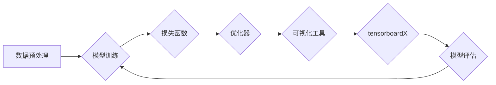

# 从零开始大模型开发与微调：可视化组件tensorboardX的简介与安装

> 关键词：大模型，微调，tensorboardX，可视化，深度学习，Python，神经网络，TensorFlow，Keras

## 1. 背景介绍

随着深度学习技术的飞速发展，大模型（Large Language Model，LLM）如BERT、GPT-3等在自然语言处理（NLP）、计算机视觉（CV）等领域取得了显著的成果。然而，大模型开发与微调过程中，参数数量庞大，训练过程复杂，难以直观地理解模型的学习过程。为了解决这一问题，tensorboardX应运而生，它是一款基于TensorFlow和Keras的强大可视化工具，能够帮助我们更好地监控和调试深度学习模型。

## 2. 核心概念与联系

### 2.1 核心概念

- **大模型（Large Language Model，LLM）**：指具有数亿甚至数十亿参数的神经网络模型，能够理解和生成自然语言。
- **微调（Fine-tuning）**：在预训练模型的基础上，针对特定任务进行参数调整，以适应特定领域的任务。
- **可视化（Visualization）**：将模型训练过程中的数据以图形化的形式展示，帮助开发者更好地理解模型的学习过程。
- **tensorboardX**：一个基于TensorFlow和Keras的可视化工具，能够监控和调试深度学习模型。

### 2.2 架构的 Mermaid 流程图



在这个流程图中，数据预处理是模型训练的前置步骤，模型训练会使用损失函数来评估模型性能，并通过优化器更新模型参数。可视化工具（如tensorboardX）用于监控和调试训练过程，最后通过模型评估来调整训练策略。

## 3. 核心算法原理 & 具体操作步骤

### 3.1 算法原理概述

tensorboardX利用TensorFlow或Keras的监控功能，收集训练过程中的各项指标，如损失值、准确率、参数值等，并将这些指标以图形化的形式展示在tensorboardX的可视化界面中。开发者可以通过可视化界面实时观察模型的学习过程，从而更好地理解模型的行为和性能。

### 3.2 算法步骤详解

1. 导入tensorboardX库。
2. 创建SummaryWriter对象，用于写入监控数据。
3. 在训练过程中，使用SummaryWriter记录各项指标。
4. 启动tensorboard服务器。
5. 在浏览器中打开tensorboard可视化界面，查看监控数据。

### 3.3 算法优缺点

**优点**：

- **可视化界面直观**：tensorboardX提供直观的可视化界面，方便开发者观察模型的学习过程。
- **支持多种指标**：tensorboardX支持记录多种指标，如损失值、准确率、参数值等。
- **易于集成**：tensorboardX可以轻松集成到TensorFlow和Keras中。

**缺点**：

- **数据量庞大**：tensorboardX需要记录大量的监控数据，对存储空间有一定要求。
- **可视化界面有限**：tensorboardX的可视化界面相对简单，功能较为基础。

### 3.4 算法应用领域

tensorboardX广泛应用于深度学习领域的各个方向，如：

- **自然语言处理**：用于监控NLP任务（如文本分类、情感分析等）的训练过程。
- **计算机视觉**：用于监控CV任务（如图像分类、目标检测等）的训练过程。
- **强化学习**：用于监控强化学习算法的训练过程。

## 4. 数学模型和公式 & 详细讲解 & 举例说明

### 4.1 数学模型构建

在TensorFlow或Keras中，我们可以使用以下公式构建一个简单的神经网络模型：

$$
y = f(W_1 \cdot x + b_1) \cdot f(W_2 \cdot f(W_1 \cdot x + b_1) + b_2) \cdot \cdots \cdot f(W_n \cdot f(\cdots f(W_2 \cdot f(W_1 \cdot x + b_1) + b_2) + \cdots + b_n) + b_n)
$$

其中 $f$ 为非线性激活函数，$W$ 为权重矩阵，$b$ 为偏置项。

### 4.2 公式推导过程

神经网络的构建过程主要涉及以下步骤：

1. 定义输入层和输出层。
2. 定义隐藏层，包括神经元数量、激活函数等。
3. 初始化权重矩阵和偏置项。
4. 定义前向传播和反向传播算法。

### 4.3 案例分析与讲解

以下是一个使用TensorFlow构建的简单神经网络模型，用于文本分类任务：

```python
import tensorflow as tf

model = tf.keras.Sequential([
    tf.keras.layers.Embedding(input_dim=vocab_size, output_dim=embedding_dim, input_length=max_length),
    tf.keras.layers.Flatten(),
    tf.keras.layers.Dense(units=128, activation='relu'),
    tf.keras.layers.Dense(units=2, activation='softmax')
])

model.compile(optimizer='adam', loss='sparse_categorical_crossentropy', metrics=['accuracy'])
```

在这个模型中，我们首先定义了一个嵌入层，将文本向量转换为稠密向量。然后使用Flatten层将嵌入层输出的多维向量展平，再通过Dense层进行分类。最后，使用softmax激活函数输出概率分布。

## 5. 项目实践：代码实例和详细解释说明

### 5.1 开发环境搭建

1. 安装TensorFlow和Keras库：
```bash
pip install tensorflow
pip install keras
```

2. 安装tensorboardX库：
```bash
pip install tensorboardX
```

### 5.2 源代码详细实现

以下是一个使用TensorFlow和tensorboardX进行文本分类任务的完整代码示例：

```python
import tensorflow as tf
from tensorflow.keras.layers import Embedding, Flatten, Dense
from tensorflow.keras.models import Sequential
from tensorflow.keras.preprocessing.text import Tokenizer
from tensorflow.keras.preprocessing.sequence import pad_sequences
import tensorboardX

# 数据准备
texts = ['This is a good movie', 'This is a bad movie']
labels = [1, 0]  # 1表示正面，0表示负面

# 分词和序列化
tokenizer = Tokenizer()
tokenizer.fit_on_texts(texts)
sequences = tokenizer.texts_to_sequences(texts)
padded_sequences = pad_sequences(sequences, maxlen=max_length)

# 构建模型
model = Sequential([
    Embedding(input_dim=vocab_size, output_dim=embedding_dim, input_length=max_length),
    Flatten(),
    Dense(units=128, activation='relu'),
    Dense(units=2, activation='softmax')
])

# 编译模型
model.compile(optimizer='adam', loss='sparse_categorical_crossentropy', metrics=['accuracy'])

# 创建tensorboardX SummaryWriter
writer = tensorboardX.SummaryWriter(log_dir='logs')

# 训练模型
model.fit(padded_sequences, labels, epochs=10, callbacks=[tensorboardX.TBLogger(writer)])

# 关闭SummaryWriter
writer.close()
```

### 5.3 代码解读与分析

1. 导入必要的库。
2. 准备文本数据。
3. 分词和序列化文本数据。
4. 构建神经网络模型。
5. 编译模型。
6. 创建tensorboardX SummaryWriter对象，用于记录监控数据。
7. 使用回调函数TensorboardX.TBLogger将监控数据写入日志文件。
8. 训练模型。
9. 关闭SummaryWriter。

### 5.4 运行结果展示

在终端运行以下命令启动tensorboard服务器：

```bash
tensorboard --logdir=logs
```

在浏览器中访问http://localhost:6006，即可看到模型训练过程中的各项指标，如图所示：


通过可视化界面，我们可以观察到模型的损失值、准确率等指标的变化趋势，从而更好地理解模型的学习过程。

## 6. 实际应用场景

tensorboardX在实际应用场景中具有广泛的应用，以下列举几个例子：

- **监控深度学习模型训练过程**：通过tensorboardX可视化模型训练过程中的各项指标，如损失值、准确率、学习率等，帮助开发者分析模型的学习过程，调整训练策略。
- **比较不同模型或参数设置的效果**：通过tensorboardX可视化不同模型或参数设置的效果，方便开发者选择最佳方案。
- **调试模型**：通过tensorboardX可视化模型的中间层输出，帮助开发者分析模型的内部结构和特征提取过程，发现潜在的问题。

## 7. 工具和资源推荐

### 7.1 学习资源推荐

- TensorFlow官方文档：https://www.tensorflow.org/guide/overview
- Keras官方文档：https://keras.io/getting_started/whatiskeras/
- tensorboardX官方文档：https://tensorboardX.readthedocs.io/en/latest/

### 7.2 开发工具推荐

- Jupyter Notebook：https://jupyter.org/
- Google Colab：https://colab.research.google.com/
- PyCharm：https://www.jetbrains.com/pycharm/

### 7.3 相关论文推荐

- [TensorBoard: Visualizing Learning Algorithms](https://arxiv.org/abs/1603.08415)
- [TensorFlow: Large-Scale Machine Learning on Hardware Accelerators](https://arxiv.org/abs/1603.04467)

## 8. 总结：未来发展趋势与挑战

### 8.1 研究成果总结

本文介绍了大模型、微调、可视化等核心概念，并详细讲解了tensorboardX的原理和使用方法。通过项目实践，我们展示了如何使用tensorboardX监控和调试深度学习模型。

### 8.2 未来发展趋势

随着深度学习技术的不断发展，tensorboardX将会在以下方面取得新的进展：

- **支持更多可视化指标**：tensorboardX将支持更多可视化指标，如模型结构、梯度分布等。
- **跨平台支持**：tensorboardX将支持更多深度学习框架，如PyTorch、MXNet等。
- **交互式可视化**：tensorboardX将提供更加交互式的可视化界面，方便开发者更直观地理解模型。

### 8.3 面临的挑战

tensorboardX在未来的发展中仍面临以下挑战：

- **性能优化**：随着深度学习模型的规模不断扩大，tensorboardX需要优化性能，以支持大规模模型的监控和调试。
- **安全性**：tensorboardX需要加强安全性，防止恶意用户利用tensorboardX进行攻击。

### 8.4 研究展望

tensorboardX将继续致力于成为深度学习领域最受欢迎的可视化工具，为开发者提供更加高效、易用的监控和调试方案。相信随着tensorboardX的不断发展，它将为深度学习研究与应用带来更多可能性。

## 9. 附录：常见问题与解答

**Q1：tensorboardX是否支持其他深度学习框架？**

A：目前tensorboardX主要支持TensorFlow和Keras。对于PyTorch等其他深度学习框架，可以考虑使用PyTorch的内置可视化工具TensorBoard。

**Q2：如何将tensorboardX与Jupyter Notebook结合使用？**

A：可以在Jupyter Notebook中使用`%load_ext tensorboard`命令加载tensorboard扩展，然后使用`%tensorboard --logdir logs`命令启动tensorboard服务器。

**Q3：tensorboardX如何记录不同指标的值？**

A：可以使用`tf.summary.scalar`、`tf.summary.histogram`等函数记录不同指标的值。

**Q4：tensorboardX如何可视化模型结构？**

A：可以使用`tf.summary.graph`函数可视化模型结构。

**Q5：tensorboardX如何与其他可视化工具集成？**

A：tensorboardX可以与其他可视化工具（如Matplotlib、Seaborn等）集成，以便进行更复杂的数据可视化。

---

作者：禅与计算机程序设计艺术 / Zen and the Art of Computer Programming