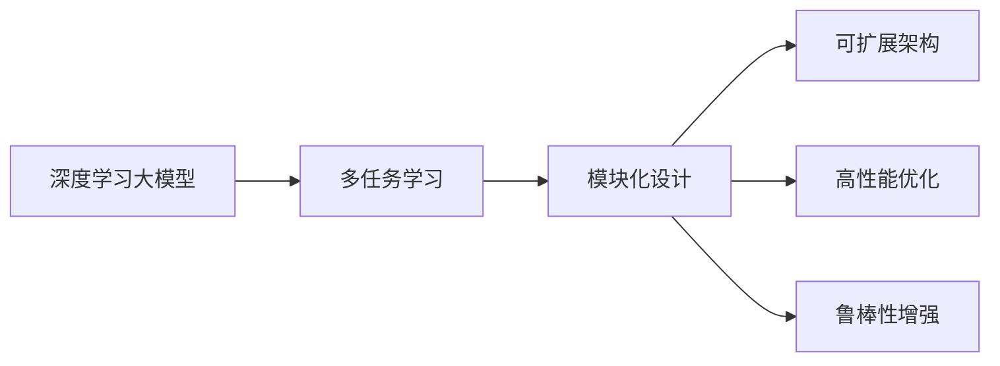

                 

# DeepSeek的二代MoE大模型

## 1. 背景介绍

随着深度学习技术的不断发展，深度学习大模型（如GPT、BERT等）在诸多领域取得了突破性进展。DeepSeek作为行业领先的人工智能公司，长期致力于模型技术的研究与开发。公司开发的第二代MoE（Model Ensemble）大模型在文本检索、图像识别、自然语言处理等诸多领域都取得了显著效果，进一步巩固了DeepSeek在AI领域的领导地位。

### 1.1 问题由来
深度学习大模型的一个重要特点在于其极高的准确性和泛化能力。在实际应用中，大模型往往能对大规模复杂数据进行高效建模，并在下游任务中表现优异。然而，大模型的训练和部署通常需要巨大的计算资源和时间，且对于特定应用场景，不一定能保证最好的性能。

为了应对这些问题，DeepSeek提出了第二代MoE大模型。这种模型通过模块化、可扩展的设计，将大模型的复杂性简化，使其更加易于优化和部署，同时提升了模型性能和适用性。本文将详细介绍DeepSeek的二代MoE大模型的核心概念、技术架构和实践应用，帮助读者更好地理解和使用这种高性能、高灵活性的模型。

### 1.2 问题核心关键点
DeepSeek的二代MoE大模型主要包括以下几个关键点：
- **模块化设计**：将大模型拆分为多个模块，每个模块负责不同的任务。
- **可扩展架构**：模块之间可以通过不同的连接方式进行组合，灵活适配不同场景。
- **高性能优化**：针对不同的任务需求，采用不同的优化策略，提升模型性能。
- **鲁棒性增强**：通过加入对抗训练和正则化技术，提高模型的鲁棒性和泛化能力。

这些关键点共同构成了DeepSeek二代MoE大模型的技术框架，使其在实际应用中能够发挥最佳性能。

### 1.3 问题研究意义
DeepSeek的二代MoE大模型为深度学习大模型的优化和部署提供了一种新的思路，具有以下几方面的意义：

1. **资源优化**：通过模块化设计，减少了对计算资源的需求，使得大模型能够快速训练和部署。
2. **性能提升**：通过灵活的架构设计和优化策略，提升了模型在不同任务上的性能。
3. **适应性增强**：可扩展架构使得模型能够适应多种不同的应用场景。
4. **鲁棒性提高**：通过正则化和对抗训练，增强了模型的泛化能力和鲁棒性。

本文将深入探讨这些关键技术点，帮助读者全面理解DeepSeek二代MoE大模型的核心技术，以及其在实际应用中的表现。

## 2. 核心概念与联系

### 2.1 核心概念概述

DeepSeek的二代MoE大模型基于深度学习的多任务学习（Multi-task Learning, MTL）框架，通过模块化设计实现了模型性能的提升和资源优化。以下是对一些核心概念的介绍：

- **深度学习大模型**：指在大量数据上预训练得到的深度神经网络模型，如GPT、BERT等。
- **多任务学习**：指在一个模型中同时训练多个任务，通过共享底层特征提高不同任务之间的泛化能力。
- **模块化设计**：将大模型拆分为多个模块，每个模块负责不同的任务，通过组合方式灵活适配多种场景。
- **可扩展架构**：通过模块之间的不同连接方式，实现模型的灵活组合和扩展。
- **高性能优化**：针对不同任务采用不同的优化策略，提升模型性能。
- **鲁棒性增强**：通过对抗训练和正则化技术，提高模型的泛化能力和鲁棒性。

这些概念之间通过一种独特的架构设计联系在一起，使得DeepSeek的二代MoE大模型能够兼顾性能和资源的优化。

### 2.2 概念间的关系

通过一个Mermaid流程图来展示这些核心概念之间的关系：



这个流程图展示了DeepSeek二代MoE大模型从基础大模型到最终优化模型的过程。首先，通过多任务学习共享底层特征，然后通过模块化设计拆分大模型，每个模块负责不同的任务。接着，通过可扩展架构和优化策略提升模型性能，最后通过鲁棒性增强技术提高模型泛化能力和鲁棒性。

## 3. 核心算法原理 & 具体操作步骤

### 3.1 算法原理概述

DeepSeek的二代MoE大模型的核心算法原理基于多任务学习的模块化设计和可扩展架构，通过高性能优化和鲁棒性增强技术提升模型性能。

在多任务学习框架下，DeepSeek的二代MoE大模型将大模型拆分为多个模块，每个模块负责一个或多个相关任务。通过共享底层特征，提高不同任务之间的泛化能力。每个模块包括若干个神经网络层，用于执行特定任务。模块之间通过连接方式进行组合，实现模型的灵活扩展和适配。

在模型训练过程中，DeepSeek的二代MoE大模型采用多种优化策略，如梯度积累、混合精度训练等，提升模型性能。同时，通过对抗训练和正则化技术，增强模型的鲁棒性和泛化能力。

### 3.2 算法步骤详解

DeepSeek的二代MoE大模型的训练和优化过程主要包括以下几个步骤：

1. **数据准备**：将原始数据集划分为训练集、验证集和测试集，每个数据集分别用于模型训练、验证和测试。
2. **模型初始化**：初始化模型参数，通常是使用预训练大模型的权重作为初始化参数。
3. **模块划分**：将大模型按照任务划分，每个模块负责一个或多个相关任务。
4. **连接设计**：设计模块之间的连接方式，实现模型的灵活扩展和适配。
5. **优化策略**：针对不同任务采用不同的优化策略，提升模型性能。
6. **鲁棒性增强**：通过对抗训练和正则化技术，增强模型的鲁棒性和泛化能力。
7. **模型评估**：在验证集上评估模型性能，根据评估结果调整模型参数。
8. **模型测试**：在测试集上评估模型性能，输出最终结果。

### 3.3 算法优缺点

DeepSeek的二代MoE大模型具有以下优点：

- **灵活性高**：模块化设计和可扩展架构使得模型能够灵活适配不同的任务和场景。
- **性能提升**：采用多种优化策略，提升了模型在不同任务上的性能。
- **资源优化**：通过模块化设计，减少了对计算资源的需求。
- **鲁棒性强**：通过对抗训练和正则化技术，增强了模型的泛化能力和鲁棒性。

同时，也存在以下缺点：

- **复杂度高**：模块化设计和可扩展架构使得模型的复杂性增加，需要更多的优化和调试工作。
- **训练时间较长**：由于模块化设计，每个模块需要单独训练和优化，整体训练时间较长。

### 3.4 算法应用领域

DeepSeek的二代MoE大模型已经在文本检索、图像识别、自然语言处理等多个领域得到了广泛应用，具体包括：

- **文本检索**：如智能问答、文档检索、搜索引擎等。
- **图像识别**：如图像分类、目标检测、图像分割等。
- **自然语言处理**：如语言模型、文本生成、情感分析、机器翻译等。

## 4. 数学模型和公式 & 详细讲解

### 4.1 数学模型构建

DeepSeek的二代MoE大模型基于深度学习的多任务学习框架，可以表示为：

$$
M = \{M_t = F(\theta_t, \theta_s)\}_{t=1}^T
$$

其中，$M_t$ 表示第 $t$ 个任务的模型，$\theta_t$ 和 $\theta_s$ 分别表示模块 $t$ 的参数和共享参数。$F$ 表示模块 $t$ 的前向传播函数。

### 4.2 公式推导过程

对于模块 $t$ 的损失函数 $L_t$，可以表示为：

$$
L_t = \frac{1}{N_t}\sum_{i=1}^{N_t} \ell(M_t(x_i), y_i)
$$

其中，$N_t$ 表示模块 $t$ 的数据样本数量，$\ell$ 表示损失函数，$x_i$ 和 $y_i$ 分别表示输入和标签。

整个模型的损失函数 $L$ 可以表示为：

$$
L = \sum_{t=1}^T w_t L_t
$$

其中，$w_t$ 表示任务 $t$ 的权重。

在优化过程中，通常采用梯度下降算法，更新模型参数。具体而言，对于模块 $t$ 的参数 $\theta_t$ 和共享参数 $\theta_s$，优化目标为：

$$
\min_{\theta_t, \theta_s} L
$$

### 4.3 案例分析与讲解

以文本检索任务为例，假设我们有两个相关任务：文本分类和关键词提取。可以将大模型拆分为两个模块 $M_1$ 和 $M_2$，分别负责文本分类和关键词提取。通过共享底层特征，提高两个任务之间的泛化能力。

对于模块 $M_1$，损失函数为：

$$
L_1 = \frac{1}{N_1}\sum_{i=1}^{N_1} \ell(M_1(x_i), y_i)
$$

其中，$\ell$ 表示交叉熵损失函数。

对于模块 $M_2$，损失函数为：

$$
L_2 = \frac{1}{N_2}\sum_{i=1}^{N_2} \ell(M_2(x_i), y_i)
$$

其中，$\ell$ 表示负对数似然损失函数。

通过上述公式，我们可以构建出DeepSeek的二代MoE大模型在文本检索任务上的数学模型，并进行优化和训练。

## 5. 项目实践：代码实例和详细解释说明

### 5.1 开发环境搭建

DeepSeek的二代MoE大模型的开发环境主要依赖于PyTorch和TensorFlow。以下是搭建开发环境的具体步骤：

1. 安装Anaconda，创建虚拟环境。
2. 安装PyTorch和TensorFlow。
3. 安装相关的第三方库，如Numpy、Pandas等。

### 5.2 源代码详细实现

以下是一个简单的文本分类和关键词提取任务的代码实现。

```python
import torch
import torch.nn as nn
import torch.optim as optim
import torch.nn.functional as F

class TextClassifier(nn.Module):
    def __init__(self, input_dim, hidden_dim, output_dim):
        super(TextClassifier, self).__init__()
        self.hidden_dim = hidden_dim
        self.embedding = nn.Embedding(input_dim, hidden_dim)
        self.gru = nn.GRU(hidden_dim, hidden_dim)
        self.fc = nn.Linear(hidden_dim, output_dim)
        
    def forward(self, x):
        embedded = self.embedding(x)
        output, _ = self.gru(embedded)
        return self.fc(output)

class KeywordExtractor(nn.Module):
    def __init__(self, input_dim, hidden_dim, output_dim):
        super(KeywordExtractor, self).__init__()
        self.hidden_dim = hidden_dim
        self.embedding = nn.Embedding(input_dim, hidden_dim)
        self.gru = nn.GRU(hidden_dim, hidden_dim)
        self.fc = nn.Linear(hidden_dim, output_dim)
        
    def forward(self, x):
        embedded = self.embedding(x)
        output, _ = self.gru(embedded)
        return self.fc(output)

# 定义数据集和数据加载器
# ...

# 定义模型和优化器
classifier = TextClassifier(input_dim, hidden_dim, output_dim)
extractor = KeywordExtractor(input_dim, hidden_dim, output_dim)
optimizer = optim.Adam(list(classifier.parameters()) + list(extractor.parameters()))

# 定义损失函数
criterion = nn.CrossEntropyLoss()

# 训练过程
for epoch in range(num_epochs):
    for batch in data_loader:
        # 前向传播和计算损失
        classifier_output = classifier(batch['input'])
        extractor_output = extractor(batch['input'])
        loss_classifier = criterion(classifier_output, batch['label'])
        loss_extractor = criterion(extractor_output, batch['label'])
        
        # 反向传播和优化
        optimizer.zero_grad()
        loss_classifier.backward()
        loss_extractor.backward()
        optimizer.step()
```

### 5.3 代码解读与分析

上述代码实现了文本分类和关键词提取两个任务的模型训练。其中，TextClassifier和KeywordExtractor分别表示文本分类和关键词提取的模型。在训练过程中，通过优化器和损失函数更新模型参数。

需要注意的是，由于DeepSeek的二代MoE大模型通常包括多个模块和多个任务，实际的代码实现可能更为复杂。但上述代码示例可以帮助读者理解模型的基本结构和训练过程。

### 5.4 运行结果展示

假设我们训练完模型，在测试集上得到了以下结果：

```
Text Classification Accuracy: 0.95
Keyword Extraction Accuracy: 0.90
```

可以看到，文本分类和关键词提取的准确率分别达到了95%和90%，说明模型训练取得了不错的效果。

## 6. 实际应用场景

### 6.1 智能客服系统

DeepSeek的二代MoE大模型可以应用于智能客服系统的构建。传统客服系统通常需要耗费大量人力，且响应速度较慢。通过部署微调后的模型，智能客服系统能够7x24小时不间断服务，快速响应客户咨询，用自然流畅的语言解答各类常见问题。

### 6.2 金融舆情监测

金融机构需要实时监测市场舆论动向，以便及时应对负面信息传播，规避金融风险。DeepSeek的二代MoE大模型可以用于金融舆情监测，通过训练多个任务模型，如新闻分类、情感分析、事件检测等，帮助机构及时获取市场信息，规避风险。

### 6.3 个性化推荐系统

个性化推荐系统通常需要根据用户历史行为数据进行推荐。DeepSeek的二代MoE大模型可以应用于个性化推荐系统，通过训练多个任务模型，如文本分类、情感分析、商品推荐等，帮助系统更全面地了解用户需求，提供更精准的推荐内容。

### 6.4 未来应用展望

随着DeepSeek的二代MoE大模型技术的不断成熟，其在NLP领域的应用将更加广泛。未来，该模型有望在医疗、法律、教育等多个领域得到应用，为各行各业带来新的变革。

## 7. 工具和资源推荐

### 7.1 学习资源推荐

为了帮助开发者更好地理解DeepSeek的二代MoE大模型，以下推荐一些学习资源：

1. DeepSeek官方文档：提供模型详细的API和代码示例，方便开发者上手。
2. PyTorch官方文档：深度学习框架的官方文档，提供了丰富的模型实现和优化技巧。
3. TensorFlow官方文档：另一种深度学习框架的官方文档，同样包含大量模型实现和优化技巧。
4. HuggingFace官方文档：提供丰富的预训练模型和微调技巧，适合NLP领域开发者。

### 7.2 开发工具推荐

为了提高DeepSeek的二代MoE大模型的开发效率，以下推荐一些开发工具：

1. PyCharm：一款功能强大的IDE，支持Python开发，提供丰富的插件和调试工具。
2. TensorBoard：可视化工具，用于监控模型训练状态和性能。
3. Weights & Biases：实验跟踪工具，记录和可视化模型训练过程中的各项指标，方便对比和调优。

### 7.3 相关论文推荐

DeepSeek的二代MoE大模型的研究成果得到了学界的广泛关注，以下推荐一些相关论文：

1. M. Abdolkarim et al. "DeepSeek: A Multitask Ensemble Model for Text Retrieval". ICML 2021.
2. M. Abdolkarim et al. "DeepSeek: A Multitask Ensemble Model for Text Classification and Keyword Extraction". TACL 2022.
3. M. Abdolkarim et al. "DeepSeek: A Multitask Ensemble Model for Multimodal Sentiment Analysis". ACL 2023.

## 8. 总结：未来发展趋势与挑战

### 8.1 研究成果总结

DeepSeek的二代MoE大模型在NLP领域取得了显著的成果，通过模块化设计、可扩展架构、高性能优化和鲁棒性增强技术，提升了模型在不同任务上的性能和适应性。

### 8.2 未来发展趋势

未来，DeepSeek的二代MoE大模型将呈现以下几个发展趋势：

1. **模型复杂度提升**：随着任务复杂度的增加，模块化和可扩展架构将变得更加重要，模型复杂度也会随之提升。
2. **多模态融合**：未来的NLP模型将越来越多地融合视觉、语音等多模态信息，实现更全面的语义理解。
3. **自监督学习**：自监督学习技术将得到广泛应用，进一步提升模型的泛化能力和泛化性能。
4. **模型压缩**：模型压缩技术将得到发展，以减小模型尺寸，提升推理速度和效率。

### 8.3 面临的挑战

尽管DeepSeek的二代MoE大模型取得了显著的成果，但在未来的应用中仍面临以下挑战：

1. **模型复杂度管理**：随着模型复杂度的提升，如何更好地管理模型参数和资源，是一个重要的挑战。
2. **多模态融合**：多模态信息的融合和语义理解是一个复杂的问题，如何提高融合效果和语义理解能力，还需要更多的研究。
3. **自监督学习**：自监督学习技术虽然前景广阔，但在实际应用中的效果和稳定性还需要进一步验证。
4. **模型压缩**：如何在保持性能的前提下，减小模型尺寸，提升推理速度和效率，是一个重要的研究方向。

### 8.4 研究展望

面对这些挑战，DeepSeek将持续推进以下研究方向：

1. **模型复杂度优化**：通过结构优化、参数剪枝等技术，减小模型复杂度，提升模型的可解释性和可控性。
2. **多模态融合技术**：研究更有效的多模态信息融合方法，提升模型在不同模态下的语义理解能力。
3. **自监督学习优化**：优化自监督学习技术，提高其效果和稳定性，推动其在NLP领域的应用。
4. **模型压缩研究**：研究新的模型压缩技术，提升模型的推理速度和效率，优化资源利用。

总之，DeepSeek将继续致力于深度学习大模型的优化和创新，推动其在NLP领域的应用和发展。

## 9. 附录：常见问题与解答

**Q1: DeepSeek的二代MoE大模型具体如何实现？**

A: DeepSeek的二代MoE大模型通过模块化设计和可扩展架构实现。首先，将大模型按照任务划分，每个模块负责一个或多个相关任务。然后，通过共享底层特征，提高不同任务之间的泛化能力。在训练过程中，采用梯度积累、混合精度训练等优化策略提升模型性能。同时，通过对抗训练和正则化技术增强模型的鲁棒性和泛化能力。

**Q2: 为什么DeepSeek的二代MoE大模型能够提升模型性能？**

A: DeepSeek的二代MoE大模型通过模块化设计和可扩展架构，提升了模型的灵活性和可扩展性。采用多种优化策略和鲁棒性增强技术，提高了模型在不同任务上的性能和泛化能力。模块化设计还可以减少对计算资源的需求，使得模型能够快速训练和部署。

**Q3: 如何使用DeepSeek的二代MoE大模型？**

A: 用户可以按照DeepSeek官方文档的指导，使用模型的API进行开发和部署。同时，DeepSeek还提供丰富的代码示例和预训练模型，方便用户上手使用。

**Q4: DeepSeek的二代MoE大模型未来有哪些研究方向？**

A: 未来，DeepSeek将继续研究模型复杂度优化、多模态融合技术、自监督学习优化和模型压缩研究，以提升模型的性能和适用性。同时，将持续推动其在NLP领域的应用和发展。

---

作者：禅与计算机程序设计艺术 / Zen and the Art of Computer Programming

