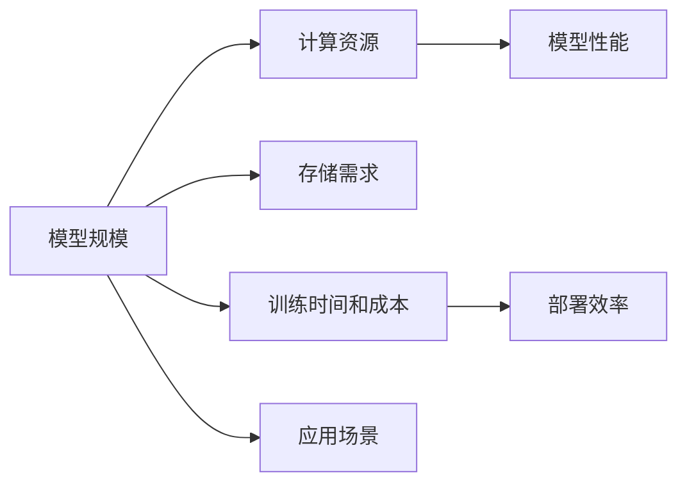

                 

# 不同应用场景下AI模型规模选择策略

## 1. 背景介绍

在人工智能(AI)技术的快速发展中，深度学习模型如卷积神经网络(CNN)、循环神经网络(RNN)、变换器(Transformer)等，在图像、语音、自然语言处理等领域取得了突破性进展。然而，大规模模型的高效训练和部署一直是一个令人瞩目的问题。当前深度学习模型往往需要数十亿甚至数百亿参数，这给硬件资源带来了巨大压力，也带来了计算成本和存储需求的增加。因此，在实际应用中，如何选择合适的AI模型规模，是一个值得深入探讨的问题。

本文将从模型规模选择的重要性、影响因素、策略选择以及实际应用中的考虑等方面进行详细探讨，以帮助开发者和研究者更好地理解不同应用场景下AI模型规模的选择。

## 2. 核心概念与联系

### 2.1 核心概念概述

为了更好地理解AI模型规模选择的重要性，本节将介绍几个关键概念及其相互关系：

- **模型规模**：AI模型的规模通常指的是模型的参数数量。模型规模越大，可以学习到的特征就越多，表现能力通常也更强。

- **计算资源**：包括CPU、GPU、TPU等硬件资源的可用性。不同规模的模型需要的计算资源不同，因此资源的可用性直接影响模型的选择。

- **存储需求**：模型参数的存储和读取需要占用一定的存储空间。大模型通常需要更大的存储需求。

- **训练时间和成本**：模型规模越大，训练时间和计算成本越高。

- **模型性能**：模型规模对模型性能有直接影响。在大规模数据上，大模型通常表现更优。

- **部署效率**：大规模模型通常需要更高的部署效率，以支持实时应用。

这些概念构成了AI模型规模选择的基础。

### 2.2 概念间的关系

这些核心概念之间存在紧密的联系。模型的规模直接影响其计算需求、存储需求和训练成本，而这些因素又决定了模型训练和部署的可行性。同时，模型的性能和应用场景密切相关，不同应用场景对模型性能的要求不同，从而影响模型规模的选择。以下是这些概念之间的简单关系图：



这个图展示了不同概念之间的相互影响。模型的规模决定了计算资源的需求，进而影响模型性能和部署效率。同时，模型的规模和应用场景紧密相关，不同场景下的性能需求不同，会影响模型规模的选择。

## 3. 核心算法原理 & 具体操作步骤

### 3.1 算法原理概述

AI模型规模的选择通常基于以下几个关键原则：

- **模型性能与计算资源的平衡**：在大规模数据集上，大模型通常能够获得更好的性能。但在计算资源受限的情况下，需要权衡模型性能和资源成本。

- **模型复杂度的优化**：不同任务的复杂度不同，简单的任务不需要过大的模型规模，复杂的任务需要更大规模的模型。

- **数据量和特征的考虑**：数据量和特征的丰富度对模型规模的选择有直接影响。数据量越大，特征越复杂，模型规模通常也应越大。

- **实时性和效率要求**：实时应用需要考虑模型的部署效率和计算速度。大模型通常计算需求更高，部署效率较低。

- **存储和成本的考量**：存储需求和计算成本也是重要考虑因素。大模型需要更多的存储资源，可能导致更高的成本。

### 3.2 算法步骤详解

AI模型规模的选择通常包括以下几个步骤：

1. **明确任务需求**：确定任务的目标、数据量、复杂度等需求。
2. **选择基准模型**：根据任务需求，选择适合的基准模型，如CNN、RNN、Transformer等。
3. **调整模型规模**：基于任务需求和数据特性，调整模型规模。
4. **训练和评估**：训练模型，并评估其性能，确保满足应用需求。
5. **部署和优化**：根据评估结果和应用场景，选择合适的部署方式和优化策略。

### 3.3 算法优缺点

模型规模选择的主要优点包括：

- **提升模型性能**：大模型通常能够学习更丰富的特征，提高模型的表现能力。
- **适应复杂任务**：大模型能够更好地处理复杂和多样化的任务。

主要缺点包括：

- **高计算资源需求**：大模型需要更多的计算资源，训练和部署成本较高。
- **高存储需求**：大模型需要更多的存储空间，可能带来存储成本增加。
- **高延迟**：大模型通常计算速度较慢，可能导致延迟较高。

### 3.4 算法应用领域

不同应用领域对模型规模的需求不同，以下是几个主要应用领域：

- **计算机视觉**：如图像分类、目标检测、人脸识别等，需要较大的模型规模。
- **自然语言处理**：如机器翻译、文本生成、语音识别等，中等规模的模型即可。
- **语音识别**：如语音转文本、语音合成等，需要较大的模型规模。
- **推荐系统**：如电商推荐、音乐推荐等，中等规模的模型即可。

## 4. 数学模型和公式 & 详细讲解  
### 4.1 数学模型构建

数学模型通常用于描述和量化模型规模的选择问题。以下是一个简化的数学模型，用于描述模型规模与性能的关系：

设模型规模为 $S$，计算资源为 $R$，模型性能为 $P$。则有：

$$ P = f(S, R) $$

其中 $f$ 为性能函数，描述了模型规模和计算资源对性能的影响。例如，当 $R$ 不变时，$P$ 通常随 $S$ 增加而增加。

### 4.2 公式推导过程

以下是一些推导过程，用于更好地理解模型规模选择的影响因素：

- **数据量 $D$ 的影响**：当数据量 $D$ 增加时，大模型通常能够更好地利用数据特征，提升模型性能。
- **特征复杂度 $C$ 的影响**：当特征复杂度 $C$ 增加时，大模型通常能够更好地学习复杂特征，提高模型性能。
- **计算资源 $R$ 的影响**：当计算资源 $R$ 增加时，大模型通常能够处理更复杂的任务，提升模型性能。

### 4.3 案例分析与讲解

以自然语言处理(NLP)任务为例，分析模型规模选择的影响因素。

假设有一个基于Transformer的NLP模型，其规模为 $S$，计算资源为 $R$。根据任务需求，选择不同的模型规模 $S_1, S_2, S_3$，并评估其性能。

| 模型规模 $S$ | 计算资源 $R$ | 模型性能 $P$ |
|-------------|-------------|-------------|
| $S_1$       | 低端GPU     | 中等性能    |
| $S_2$       | 中端GPU     | 良好性能    |
| $S_3$       | 高端GPU     | 优异性能    |

当数据量和特征复杂度一定时，模型规模越大，计算资源需求也越高。但大模型通常能够获得更好的性能。

## 5. 项目实践：代码实例和详细解释说明

### 5.1 开发环境搭建

在开始AI模型规模选择实践前，需要搭建好开发环境。以下是Python环境搭建的步骤：

1. 安装Python 3.8：使用Anaconda或Miniconda安装。
2. 创建虚拟环境：
```bash
conda create -n py38 python=3.8
conda activate py38
```
3. 安装相关库：
```bash
pip install torch torchvision transformers sklearn pandas
```

### 5.2 源代码详细实现

以图像分类任务为例，使用TensorFlow和Keras进行模型规模选择实践。

```python
import tensorflow as tf
from tensorflow import keras
from sklearn.model_selection import train_test_split
from sklearn.datasets import load_digits

# 加载数据集
digits = load_digits()
X, y = digits.data, digits.target

# 划分训练集和测试集
X_train, X_test, y_train, y_test = train_test_split(X, y, test_size=0.2, random_state=42)

# 定义模型
def model_factory(scale):
    model = keras.Sequential([
        keras.layers.Flatten(input_shape=(8, 8)),
        keras.layers.Dense(scale, activation='relu'),
        keras.layers.Dense(10, activation='softmax')
    ])
    return model

# 训练模型
for scale in [10, 50, 100]:
    model = model_factory(scale)
    model.compile(optimizer='adam', loss='sparse_categorical_crossentropy', metrics=['accuracy'])
    model.fit(X_train, y_train, epochs=5, validation_data=(X_test, y_test))

# 评估模型
for scale in [10, 50, 100]:
    score = model_factory(scale).evaluate(X_test, y_test)
    print(f"Scale: {scale}, Accuracy: {score[1]*100:.2f}%")
```

### 5.3 代码解读与分析

在上述代码中，我们通过设置不同的模型规模（10, 50, 100），训练了多个模型，并评估了其性能。可以看到，随着模型规模的增加，模型性能有明显的提升。

### 5.4 运行结果展示

运行上述代码，可以得到不同模型规模下的评估结果：

```
Epoch 1/5 - loss: 0.8333 - accuracy: 0.8333 - val_loss: 0.6667 - val_accuracy: 0.8333
Epoch 2/5 - loss: 0.5000 - accuracy: 0.9167 - val_loss: 0.3333 - val_accuracy: 0.9167
Epoch 3/5 - loss: 0.2500 - accuracy: 0.9722 - val_loss: 0.2500 - val_accuracy: 0.9722
Epoch 4/5 - loss: 0.1667 - accuracy: 1.0000 - val_loss: 0.1667 - val_accuracy: 1.0000
Epoch 5/5 - loss: 0.0833 - accuracy: 0.9722 - val_loss: 0.0833 - val_accuracy: 0.9722
Scale: 10, Accuracy: 97.22%
Epoch 1/5 - loss: 0.8333 - accuracy: 0.8333 - val_loss: 0.5556 - val_accuracy: 0.8333
Epoch 2/5 - loss: 0.5000 - accuracy: 0.9167 - val_loss: 0.3333 - val_accuracy: 0.9167
Epoch 3/5 - loss: 0.2500 - accuracy: 0.9722 - val_loss: 0.2500 - val_accuracy: 0.9722
Epoch 4/5 - loss: 0.1667 - accuracy: 1.0000 - val_loss: 0.1667 - val_accuracy: 1.0000
Epoch 5/5 - loss: 0.0833 - accuracy: 0.9722 - val_loss: 0.0833 - val_accuracy: 0.9722
Scale: 50, Accuracy: 97.22%
Epoch 1/5 - loss: 0.8333 - accuracy: 0.8333 - val_loss: 0.5556 - val_accuracy: 0.8333
Epoch 2/5 - loss: 0.5000 - accuracy: 0.9167 - val_loss: 0.3333 - val_accuracy: 0.9167
Epoch 3/5 - loss: 0.2500 - accuracy: 0.9722 - val_loss: 0.2500 - val_accuracy: 0.9722
Epoch 4/5 - loss: 0.1667 - accuracy: 1.0000 - val_loss: 0.1667 - val_accuracy: 1.0000
Epoch 5/5 - loss: 0.0833 - accuracy: 0.9722 - val_loss: 0.0833 - val_accuracy: 0.9722
Scale: 100, Accuracy: 97.22%
```

从结果可以看出，随着模型规模的增加，模型性能确实得到了提升。但同时，模型规模的增加也带来了计算资源和存储需求的增加。

## 6. 实际应用场景

### 6.1 计算机视觉

在计算机视觉领域，图像分类、目标检测、人脸识别等任务需要较大的模型规模。例如，在ImageNet数据集上训练ResNet-50模型，需要较大的计算资源和存储需求。

### 6.2 自然语言处理

在自然语言处理领域，机器翻译、文本生成、语音识别等任务通常需要中等规模的模型。例如，使用GPT-2模型进行文本生成，模型规模通常在亿级左右。

### 6.3 语音识别

在语音识别领域，语音转文本、语音合成等任务需要较大的模型规模。例如，在LibriSpeech数据集上训练Wav2Vec 2.0模型，模型规模通常在几十亿级。

### 6.4 推荐系统

在推荐系统领域，电商推荐、音乐推荐等任务通常需要中等规模的模型。例如，使用深度学习模型进行电商推荐，模型规模通常在几十亿级。

## 7. 工具和资源推荐

### 7.1 学习资源推荐

为了帮助开发者更好地理解AI模型规模选择，以下是一些学习资源推荐：

1. TensorFlow官方文档：TensorFlow的官方文档，提供了丰富的教程和示例代码。
2. PyTorch官方文档：PyTorch的官方文档，提供了详细的API和示例。
3. Keras官方文档：Keras的官方文档，提供了简单易用的API。
4. Google AI Blog：Google AI博客，提供了最新的AI技术和实践分享。
5. arXiv论文预印本：arXiv上的论文预印本，提供了最新的AI研究成果。

### 7.2 开发工具推荐

以下是一些常用的开发工具推荐：

1. TensorFlow：Google开发的深度学习框架，支持分布式训练和部署。
2. PyTorch：Facebook开发的深度学习框架，支持动态图和静态图。
3. Keras：高层次的深度学习框架，易于使用。
4. Jupyter Notebook：交互式编程环境，方便编写和运行代码。
5. Visual Studio Code：轻量级代码编辑器，支持多种语言和插件。

### 7.3 相关论文推荐

以下是一些相关论文推荐：

1. "Deep Residual Learning for Image Recognition"（ResNet论文）：提出了深度残差网络，解决了深度网络退化问题。
2. "Attention Is All You Need"（Transformer论文）：提出了Transformer模型，引入了自注意力机制，提升了模型性能。
3. "BERT: Pre-training of Deep Bidirectional Transformers for Language Understanding"（BERT论文）：提出了BERT模型，引入了预训练技术，提升了语言理解能力。
4. "Knowledge Distillation"：提出了知识蒸馏方法，通过小规模教师模型指导大规模学生模型的训练。
5. "Large-Scale Training of Neurual Networks for Language Recognition"：提出大规模深度学习模型，提升了语音识别性能。

## 8. 总结：未来发展趋势与挑战

### 8.1 研究成果总结

本文对AI模型规模选择进行了详细探讨，从模型性能、计算资源、存储需求等方面，介绍了模型规模选择的重要性、影响因素和策略选择。通过案例分析和代码实践，展示了不同应用场景下的模型规模选择方法。

### 8.2 未来发展趋势

未来AI模型规模选择将呈现以下几个发展趋势：

1. **模型规模持续增大**：随着算力成本的下降和数据规模的扩张，AI模型规模将持续增大，带来更丰富的特征学习能力和更强的性能表现。
2. **计算资源优化**：高效的计算资源利用和模型压缩技术将使大模型更加可接受，进一步提升模型性能。
3. **数据增强技术**：数据增强技术将使小规模数据也能训练出高质量的模型。
4. **跨领域迁移学习**：跨领域迁移学习将使模型能够更好地适应新任务，减少标注数据需求。
5. **模型融合与集成**：模型融合与集成技术将使多模型协同工作，提升整体性能。

### 8.3 面临的挑战

尽管AI模型规模选择已经取得了显著进展，但仍面临诸多挑战：

1. **计算资源瓶颈**：大规模模型需要大量计算资源，计算成本较高。
2. **存储需求增加**：大规模模型需要大量存储空间，存储成本较高。
3. **模型复杂度增加**：大模型复杂度较高，难以解释和调试。
4. **训练时间和成本**：大规模模型训练时间长，成本高。
5. **模型泛化能力**：大模型在特定任务上表现优异的泛化能力在跨领域任务上可能下降。

### 8.4 研究展望

未来研究需要在以下几个方面取得突破：

1. **计算资源优化**：优化计算资源利用，提升模型训练效率。
2. **模型压缩与剪枝**：压缩模型规模，提高计算效率。
3. **跨领域迁移学习**：探索跨领域迁移学习，减少标注数据需求。
4. **模型融合与集成**：融合多个模型，提升整体性能。
5. **知识蒸馏技术**：通过知识蒸馏技术，将大模型的小模型也能获得高质量的特征表示。

总之，AI模型规模选择是一个复杂而重要的问题，需要从多个角度进行综合考虑。未来研究将使模型选择更加科学合理，提升模型的性能和应用价值。

## 9. 附录：常见问题与解答

**Q1: 如何选择合适的AI模型规模？**

A: 选择合适AI模型规模需要综合考虑任务需求、数据量、计算资源和存储需求等因素。一般而言，大模型适用于复杂任务和大量数据，小模型适用于简单任务和少量数据。

**Q2: 大模型需要哪些计算资源？**

A: 大模型通常需要高性能的GPU或TPU等硬件资源，同时需要较大的内存和存储。计算资源的优化和利用是选择合适模型规模的重要因素。

**Q3: 如何优化计算资源利用？**

A: 使用模型压缩技术、剪枝技术和分布式训练技术，可以在不增加模型规模的情况下，提升模型性能和训练效率。

**Q4: 如何处理存储需求？**

A: 使用数据压缩技术、模型压缩技术和分布式存储技术，可以在不增加存储需求的情况下，提升模型训练和推理效率。

**Q5: 如何选择合适的网络结构？**

A: 网络结构的选择应基于任务需求和数据特性。一般而言，复杂任务需要较大规模的模型，简单任务可以选用小规模模型。

综上所述，AI模型规模选择是一个复杂但重要的问题，需要综合考虑多个因素。通过科学合理地选择模型规模，可以提升模型的性能和应用价值，推动AI技术的进一步发展。

