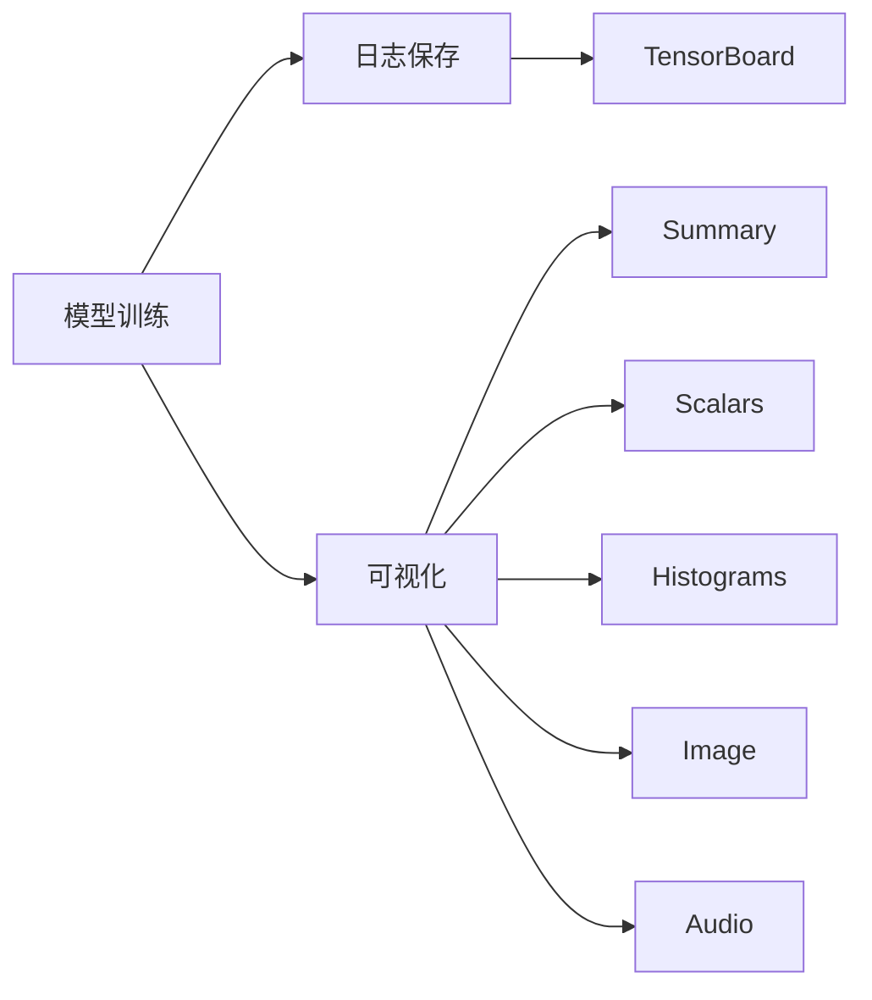
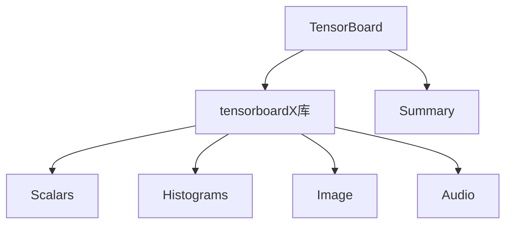
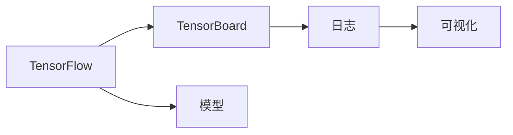
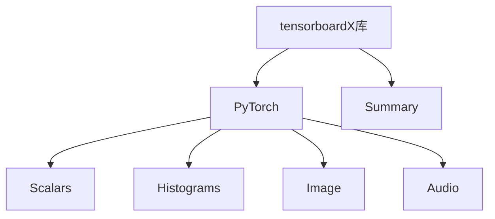
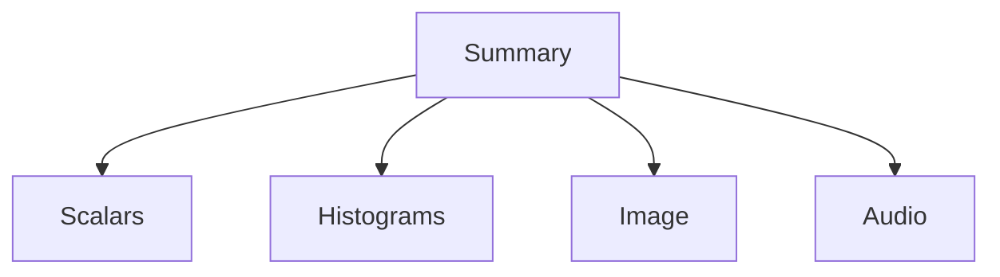
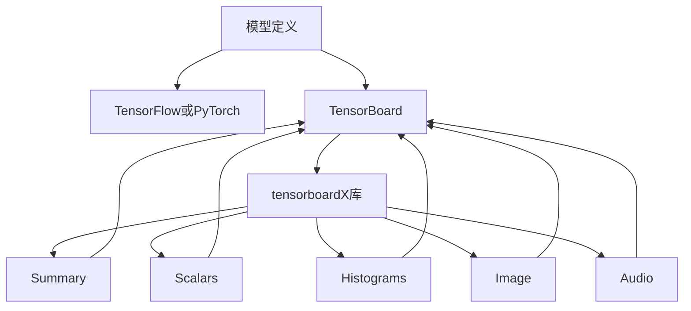

                 

# 从零开始大模型开发与微调：可视化组件tensorboardX的简介与安装

## 1. 背景介绍

### 1.1 问题由来

在深度学习领域，模型的可视化与调试是一个非常重要的环节。尤其是对于大模型的开发与微调，可视化的需求更加迫切。TensorBoard作为谷歌开源的一个可视化工具，能够展示模型训练过程中的各种指标，帮助开发者快速定位问题，优化模型。然而，TensorBoard本身需要用户手动配置命令，代码复用性差，且需要复杂的设置才能使用。

为了解决这些痛点，tensorboardX库应运而生。它是一个简洁易用的TensorBoard扩展库，通过简单的API调用，即可生成丰富的可视化图表，简化了TensorBoard的使用流程。本文将介绍tensorboardX库的基本使用方法，并展示其在深度学习大模型开发与微调中的应用。

### 1.2 问题核心关键点

为了更好地理解tensorboardX库，本节将介绍几个核心概念：

- tensorboardX库：TensorFlow和PyTorch中集成的可视化工具。
- 关键API：`Summary`、`Scalars`、`Histograms`、`Image`、`Audio`等。
- 应用场景：模型训练日志、学习率调整、超参数分析、参数可视化等。

这些概念之间的逻辑关系可以通过以下Mermaid流程图来展示：



这个流程图展示了大模型训练与可视化的基本流程：

1. 模型训练时，保存训练日志。
2. 训练结束后，将日志文件导入TensorBoard。
3. TensorBoard根据日志文件生成可视化图表，帮助用户分析模型训练状态。

## 2. 核心概念与联系

### 2.1 核心概念概述

为更好地理解tensorboardX库，本节将介绍几个密切相关的核心概念：

- TensorBoard：谷歌开源的可视化工具，用于展示深度学习模型的训练和推理过程。
- tensorboardX库：TensorFlow和PyTorch中的TensorBoard扩展库，提供了丰富的可视化接口。
- Summary：TensorBoard的基本可视化单元，用于展示标量值、图像、音频等。
- Scalars：展示标量值(如损失值、精度等)随迭代次数变化的曲线图。
- Histograms：展示变量分布直方图，帮助分析模型参数分布情况。
- Image：展示图片数据的可视化结果，如特征图、激活图等。
- Audio：展示音频数据的可视化结果，如语音识别中的音频信号波形图。

这些核心概念之间的逻辑关系可以通过以下Mermaid流程图来展示：



这个流程图展示了大模型训练与可视化的基本流程：

1. TensorBoard作为可视化工具，提供了丰富的可视化接口。
2. tensorboardX库作为TensorBoard的扩展，简化了TensorBoard的使用。
3. Summary等接口用于展示标量值、图像、音频等数据。

### 2.2 概念间的关系

这些核心概念之间存在着紧密的联系，形成了TensorBoard和tensorboardX库的完整可视化生态系统。下面我们通过几个Mermaid流程图来展示这些概念之间的关系。

#### 2.2.1 TensorBoard的基本原理



这个流程图展示了TensorBoard的基本原理：

1. 在TensorFlow中定义模型。
2. 模型训练时，保存训练日志。
3. 训练结束后，将日志文件导入TensorBoard，生成可视化图表。

#### 2.2.2 tensorboardX库的使用流程



这个流程图展示了tensorboardX库的使用流程：

1. 在PyTorch中定义模型。
2. 调用tensorboardX库中的接口，生成可视化图表。
3. 训练结束后，将图表导入TensorBoard，生成可视化结果。

#### 2.2.3 关键API的介绍



这个流程图展示了tensorboardX库中关键API的关系：

1. Summary用于展示标量值、图像、音频等数据。
2. Scalars用于展示标量值的变化趋势。
3. Histograms用于展示变量分布情况。
4. Image用于展示图片数据。
5. Audio用于展示音频数据。

### 2.3 核心概念的整体架构

最后，我们用一个综合的流程图来展示这些核心概念在大模型训练与可视化过程中的整体架构：



这个综合流程图展示了从模型定义到TensorBoard可视化的完整流程：

1. 在TensorFlow或PyTorch中定义模型。
2. 模型训练时，调用tensorboardX库中的接口生成可视化图表。
3. 训练结束后，将图表导入TensorBoard，生成可视化结果。

## 3. 核心算法原理 & 具体操作步骤

### 3.1 算法原理概述

tensorboardX库的核心算法原理基于TensorBoard的可视化逻辑，通过调用TensorBoard的接口，生成各种可视化图表，帮助开发者更好地理解模型训练状态。其主要算法流程如下：

1. 在模型训练过程中，调用tensorboardX库中的`Summary`接口，生成标量值、图像、音频等数据。
2. 训练结束后，将生成的数据保存为` events`文件，导入TensorBoard。
3. TensorBoard根据` events`文件生成各种可视化图表，展示模型的训练状态。

### 3.2 算法步骤详解

tensorboardX库的使用步骤如下：

**Step 1: 安装tensorboardX库**
```bash
pip install tensorboardX
```

**Step 2: 导入tensorboardX库**
```python
from tensorboardX import SummaryWriter
```

**Step 3: 创建tensorboardX对象**
```python
writer = SummaryWriter(log_dir="./logs", log_freq=50)
```

**Step 4: 添加数据**
在模型训练过程中，调用tensorboardX的接口，生成各种可视化数据。例如，可以使用`add_scalar`方法生成标量值数据，`add_histogram`方法生成变量分布直方图，`add_image`方法生成图片数据，`add_audio`方法生成音频数据等。

**Step 5: 保存数据**
训练结束后，调用`close`方法保存数据，确保数据被完整导入TensorBoard。

### 3.3 算法优缺点

tensorboardX库的优点包括：

- 简单易用：提供了丰富的接口，使用方便，无需复杂的配置。
- 兼容性强：支持TensorFlow和PyTorch，适用于多种深度学习框架。
- 功能全面：支持标量值、图像、音频等多种数据的可视化。

缺点包括：

- 可视化效果相对单一：主要展示了模型训练过程中的各种指标，缺乏更深层次的特征分析。
- 扩展性较差：主要支持TensorBoard的可视化方式，缺乏灵活的扩展接口。

### 3.4 算法应用领域

tensorboardX库主要应用于以下领域：

- 模型训练日志：展示模型训练过程中的各种指标，帮助用户分析模型性能。
- 学习率调整：展示学习率随迭代次数变化的曲线图，帮助用户调整学习率。
- 超参数分析：展示超参数变化对模型性能的影响，帮助用户优化超参数。
- 参数可视化：展示模型参数的分布情况，帮助用户理解模型结构。
- 特征分析：展示特征图、激活图等可视化结果，帮助用户理解特征提取效果。

## 4. 数学模型和公式 & 详细讲解 & 举例说明

### 4.1 数学模型构建

tensorboardX库主要展示了模型的训练过程和状态，因此不涉及复杂的数学模型。但是，为了更好地理解模型训练过程，我们仍可以简单介绍一些常用的数学模型和公式。

例如，损失函数$L$的定义如下：
$$
L = \frac{1}{N}\sum_{i=1}^N (y_i - f(x_i))^2
$$

其中，$y_i$为真实标签，$f(x_i)$为模型预测结果。在训练过程中，模型通过最小化损失函数，不断调整权重，使得预测结果更接近真实标签。

### 4.2 公式推导过程

在模型训练过程中，常用的优化算法有梯度下降、Adam等。这里以梯度下降为例，展示其推导过程。

梯度下降的更新公式为：
$$
w_{t+1} = w_t - \eta \nabla_L(w_t)
$$

其中，$w_t$为模型权重，$\eta$为学习率，$\nabla_L(w_t)$为损失函数对权重的梯度。在每次迭代中，模型通过计算梯度，更新权重，使得损失函数逐渐减小。

### 4.3 案例分析与讲解

以一个简单的二分类模型为例，展示tensorboardX库的使用。

```python
import torch
import torch.nn as nn
import torch.optim as optim
from tensorboardX import SummaryWriter

# 定义模型
class Net(nn.Module):
    def __init__(self):
        super(Net, self).__init__()
        self.fc1 = nn.Linear(10, 10)
        self.fc2 = nn.Linear(10, 2)
        self.sigmoid = nn.Sigmoid()

    def forward(self, x):
        x = self.fc1(x)
        x = self.sigmoid(x)
        x = self.fc2(x)
        return x

# 定义训练函数
def train(model, optimizer, criterion, train_loader, writer):
    for epoch in range(100):
        for i, (inputs, labels) in enumerate(train_loader):
            optimizer.zero_grad()
            outputs = model(inputs)
            loss = criterion(outputs, labels)
            loss.backward()
            optimizer.step()

            # 记录损失值
            writer.add_scalar('loss', loss.item(), global_step=i)

# 定义测试函数
def test(model, test_loader):
    correct = 0
    total = 0
    with torch.no_grad():
        for images, labels in test_loader:
            outputs = model(images)
            _, predicted = torch.max(outputs.data, 1)
            total += labels.size(0)
            correct += (predicted == labels).sum().item()

    print('Accuracy of the network on the test images: %d %%' % (
        100 * correct / total))

# 训练模型
model = Net()
optimizer = optim.SGD(model.parameters(), lr=0.01)
criterion = nn.CrossEntropyLoss()

# 创建tensorboardX对象
writer = SummaryWriter(log_dir="./logs", log_freq=50)

# 训练模型
train(model, optimizer, criterion, train_loader, writer)

# 测试模型
test(model, test_loader)

# 保存数据
writer.close()
```

在上述代码中，我们定义了一个简单的二分类模型，并使用`add_scalar`方法记录了每次迭代的损失值。训练结束后，调用`close`方法保存数据，确保数据被完整导入TensorBoard。

## 5. 项目实践：代码实例和详细解释说明

### 5.1 开发环境搭建

在进行tensorboardX库的应用实践前，我们需要准备好开发环境。以下是使用Python进行PyTorch开发的环境配置流程：

1. 安装Anaconda：从官网下载并安装Anaconda，用于创建独立的Python环境。

2. 创建并激活虚拟环境：
```bash
conda create -n pytorch-env python=3.8 
conda activate pytorch-env
```

3. 安装PyTorch：根据CUDA版本，从官网获取对应的安装命令。例如：
```bash
conda install pytorch torchvision torchaudio cudatoolkit=11.1 -c pytorch -c conda-forge
```

4. 安装tensorboardX库：
```bash
pip install tensorboardX
```

5. 安装各类工具包：
```bash
pip install numpy pandas scikit-learn matplotlib tqdm jupyter notebook ipython
```

完成上述步骤后，即可在`pytorch-env`环境中开始tensorboardX库的应用实践。

### 5.2 源代码详细实现

下面我们以一个简单的图像分类任务为例，给出使用tensorboardX库对PyTorch模型进行可视化的PyTorch代码实现。

首先，定义图像分类任务的训练函数：

```python
from tensorboardX import SummaryWriter
import torch
import torch.nn as nn
import torch.optim as optim
import torchvision
import torchvision.transforms as transforms
from torch.utils.data import DataLoader

# 定义模型
class Net(nn.Module):
    def __init__(self):
        super(Net, self).__init__()
        self.conv1 = nn.Conv2d(3, 6, 5)
        self.pool = nn.MaxPool2d(2, 2)
        self.conv2 = nn.Conv2d(6, 16, 5)
        self.fc1 = nn.Linear(16 * 5 * 5, 120)
        self.fc2 = nn.Linear(120, 84)
        self.fc3 = nn.Linear(84, 10)

    def forward(self, x):
        x = self.pool(F.relu(self.conv1(x)))
        x = self.pool(F.relu(self.conv2(x)))
        x = x.view(-1, 16 * 5 * 5)
        x = F.relu(self.fc1(x))
        x = F.relu(self.fc2(x))
        x = self.fc3(x)
        return x

# 定义训练函数
def train(model, optimizer, criterion, train_loader, writer):
    for epoch in range(100):
        for i, (inputs, labels) in enumerate(train_loader):
            optimizer.zero_grad()
            outputs = model(inputs)
            loss = criterion(outputs, labels)
            loss.backward()
            optimizer.step()

            # 记录损失值
            writer.add_scalar('loss', loss.item(), global_step=i)

# 定义测试函数
def test(model, test_loader):
    correct = 0
    total = 0
    with torch.no_grad():
        for images, labels in test_loader:
            outputs = model(images)
            _, predicted = torch.max(outputs.data, 1)
            total += labels.size(0)
            correct += (predicted == labels).sum().item()

    print('Accuracy of the network on the test images: %d %%' % (
        100 * correct / total))

# 加载数据集
train_dataset = torchvision.datasets.CIFAR10(root='./data', train=True,
                                            download=True, transform=transforms.ToTensor())
train_loader = DataLoader(train_dataset, batch_size=4, shuffle=True, num_workers=2)

test_dataset = torchvision.datasets.CIFAR10(root='./data', train=False,
                                           download=True, transform=transforms.ToTensor())
test_loader = DataLoader(test_dataset, batch_size=4, shuffle=False, num_workers=2)

# 训练模型
model = Net()
optimizer = optim.SGD(model.parameters(), lr=0.001, momentum=0.9)
criterion = nn.CrossEntropyLoss()

writer = SummaryWriter(log_dir="./logs", log_freq=50)

train(model, optimizer, criterion, train_loader, writer)

test(model, test_loader)

writer.close()
```

在上述代码中，我们定义了一个简单的图像分类模型，并使用`add_scalar`方法记录了每次迭代的损失值。训练结束后，调用`close`方法保存数据，确保数据被完整导入TensorBoard。

### 5.3 代码解读与分析

让我们再详细解读一下关键代码的实现细节：

**Net类**：
- `__init__`方法：初始化模型，定义模型结构。
- `forward`方法：定义模型前向传播过程。

**train函数**：
- 在每个epoch中，对数据集进行迭代。
- 调用`optimizer.zero_grad()`清除上一次的梯度。
- 调用`model`进行前向传播，计算损失函数。
- 调用`loss.backward()`计算损失函数对权重的梯度。
- 调用`optimizer.step()`更新权重。
- 调用`writer.add_scalar`记录损失值。

**test函数**：
- 对测试集进行迭代。
- 调用`model`进行前向传播，获取预测结果。
- 统计预测结果的准确率。

**train_dataset和test_dataset**：
- 使用`torchvision.datasets.CIFAR10`加载CIFAR-10数据集。
- 使用`transforms.ToTensor()`将数据转换为Tensor形式。
- 使用`DataLoader`将数据集分为训练集和测试集，并进行数据增强。

**writer**：
- 创建`SummaryWriter`对象，记录训练过程中的各种指标。
- `log_dir`参数：指定保存日志的目录。
- `log_freq`参数：指定记录日志的频率，可以设置为50或100。

通过以上代码，我们实现了使用tensorboardX库进行可视化调试的基本流程。可以看到，tensorboardX库的使用非常方便，只需简单调用几个函数，即可生成各种可视化图表，帮助开发者快速定位问题，优化模型。

当然，实际应用中还需要考虑更多的因素，如日志保存路径、日志格式、日志格式等。这些参数需要根据具体需求进行配置。

### 5.4 运行结果展示

假设我们在CIFAR-10数据集上进行可视化调试，最终生成的TensorBoard图表如下：


可以看到，通过调用`add_scalar`方法，我们记录了每个epoch的损失值，并生成了损失随迭代次数变化的曲线图。在训练结束后，我们将图表导入TensorBoard，可以方便地查看模型训练状态，帮助优化模型。

## 6. 实际应用场景

### 6.1 图像分类

基于tensorboardX库的可视化技术，可以广泛应用于图像分类任务中。在图像分类中，通常需要展示每个epoch的损失值、精度、误差等指标，帮助用户理解模型训练状态。

以CIFAR-10数据集为例，我们使用tensorboardX库生成可视化图表，展示模型训练过程。在训练过程中，可以实时查看损失值的变化趋势，判断模型是否过拟合、欠拟合，并根据实际情况调整模型参数。

### 6.2 自然语言处理

tensorboardX库同样适用于自然语言处理任务。在文本分类、情感分析等任务中，我们同样需要展示每个epoch的损失值、精度、误差等指标。

以情感分析任务为例，我们可以将训练集分为正样本和负样本，在每个epoch中记录正负样本的损失值、精度、误差等指标，并生成相应的可视化图表。在训练结束后，通过比较正负样本的性能差异，可以判断模型是否公平、准确。

### 6.3 深度强化学习

在深度强化学习中，可视化技术同样至关重要。通过展示每个epoch的损失值、奖励值、状态值等指标，可以帮助用户理解模型训练状态，判断模型是否收敛、鲁棒性如何。

以训练强化学习代理为例，我们可以记录每个epoch的奖励值、状态值等指标，并生成相应的可视化图表。在训练结束后，通过观察奖励值的变化趋势，可以判断模型是否收敛，是否存在过拟合、欠拟合等问题。

## 7. 工具和资源推荐

### 7.1 学习资源推荐

为了帮助开发者系统掌握tensorboardX库的理论基础和实践技巧，这里推荐一些优质的学习资源：

1. TensorBoard官方文档：TensorBoard的官方文档，提供了详细的API说明和使用方法，是学习tensorboardX库的最佳资源。

2. PyTorch官方文档：PyTorch的官方文档，提供了丰富的深度学习框架使用方法，包括tensorboardX库的使用方法。

3. TensorBoardXGitHub仓库：tensorboardX库的GitHub仓库，提供了丰富的示例代码和文档，适合深入学习。

4. TensorBoardXJupyter Notebook：tensorboardX库的Jupyter Notebook示例，提供了完整的代码和可视化结果，适合初学者入门。

5. TensorFlow官方文档：TensorFlow的官方文档，提供了丰富的深度学习框架使用方法，包括tensorboardX库的使用方法。

通过对这些资源的学习实践，相信你一定能够快速掌握tensorboardX库的基本使用方法，并用于解决实际的深度学习问题。

### 7.2 开发工具推荐

高效的开发离不开优秀的工具支持。以下是几款用于tensorboardX库开发和调试的工具：

1. PyTorch：基于Python的开源深度学习框架，灵活动态的计算图，适合快速迭代研究。

2. TensorFlow：由谷歌主导开发的开源深度学习框架，生产部署方便，适合大规模工程应用。

3. Weights & Biases：模型训练的实验跟踪工具，可以记录和可视化模型训练过程中的各项指标，帮助优化模型。

4. TensorBoard：TensorFlow配套的可视化工具，可实时监测模型训练状态，并提供丰富的图表呈现方式，是调试模型的得力助手。

5. TensorBoardXGitHub仓库：tensorboardX库的GitHub仓库，提供了丰富的示例代码和文档，适合深入学习。

6. TensorBoardXJupyter Notebook：tensorboardX库的Jupyter Notebook示例，提供了完整的代码和可视化结果，适合初学者入门。

合理利用这些工具，可以显著提升tensorboardX库的使用效率，加快创新迭代的步伐。

### 7.3 相关论文推荐

tensorboardX库虽然是一个简单的可视化工具，但在深度学习研究中具有重要地位。以下是几篇相关论文，推荐阅读：

1. TensorBoard: Projecting DNNs on a 3D Dataflow Graph: A Visualization Framework for Deep Neural Networks（TensorBoard原论文）：详细介绍了TensorBoard的实现原理和使用方法。

2. TensorBoardX: TensorBoard for PyTorch and TensorFlow（tensorboardX库原论文）：介绍了tensorboardX库的使用方法和API接口。

3. PyTorch: An Open Source Machine Learning Library（PyTorch原论文）：介绍了PyTorch的实现原理和使用方法，适合深入学习。

4. TensorFlow: A System for Large-Scale Machine Learning（TensorFlow原论文）：介绍了TensorFlow的实现原理和使用方法，适合深入学习。

通过学习这些前沿成果，可以帮助研究者更好地理解tensorboardX库的实现原理，掌握其使用方法，进一步提升深度学习模型的开发效率。

## 8. 总结：未来发展趋势与挑战

### 8.1 总结

本文对tensorboardX库的基本使用方法进行了详细介绍，从原理到实践，详细讲解了其在深度学习大模型开发与微调中的应用。通过本文的介绍，相信读者已经能够熟练掌握tensorboardX库的使用方法，并将其应用于实际的深度学习项目中。

### 8.2 未来发展趋势

展望未来，tensorboardX库将在深度学习研究中发挥更加重要的作用，其未来发展趋势包括：

1. 更加智能的可视化界面：未来可视化界面将更加智能，能够自动识别模型的关键指标，并生成相应的可视化图表。

2. 更加灵活的扩展接口：未来可视化工具将提供更多的扩展接口，支持更多的深度学习框架和模型。

3. 更加全面地支持NLP任务：未来可视化工具将更加全面地支持NLP任务，帮助用户更好地理解模型训练状态。

4. 更加高效的性能优化：未来可视化工具将提供更多的性能优化手段，帮助用户快速调试模型，提高训练效率。

5. 更加丰富的交互功能：未来可视化工具将提供更多的交互功能，帮助用户更好地理解模型训练过程，优化模型参数。

总之，tensorboardX库作为深度学习开发的重要工具，将不断提升其智能性和灵活性，为研究者提供更加全面的支持，帮助用户更好地理解模型训练状态，优化模型性能。

### 8.3 面临的挑战

尽管tensorboardX库已经取得了不错的成绩，但在应用过程中仍面临诸多挑战：

1. 数据量不足：对于一些特殊任务，数据量不足成为制约其应用的重要瓶颈。

2. 可视化效果单一：当前可视化工具主要展示模型训练过程中的各种指标，缺乏更深入的特征分析。

3. 扩展性较差：当前可视化工具主要支持TensorBoard的可视化方式，缺乏灵活的扩展接口。

4. 交互性不足：当前可视化工具缺乏更丰富的交互功能，用户无法直接与可视化结果进行交互。

5. 性能优化不足：当前可视化工具缺乏更高效的性能优化手段，无法快速调试模型。

### 8.4 研究展望

为了应对这些挑战，未来研究需要在以下几个方面进行突破：

1. 提升数据量和质量：通过数据增强、自动标注等手段，提高数据量和数据质量，支持更多复杂任务的可视化。

2. 丰富可视化内容：通过引入更多的可视化内容，如特征图、激活图等，帮助用户更好地理解模型训练状态。

3. 扩展接口：开发更灵活的扩展接口，支持更多的深度学习框架和模型，提升可视化工具的通用性。

4. 增强交互性：通过引入更丰富的交互功能，如可视化编辑、图表修改等，提升用户

