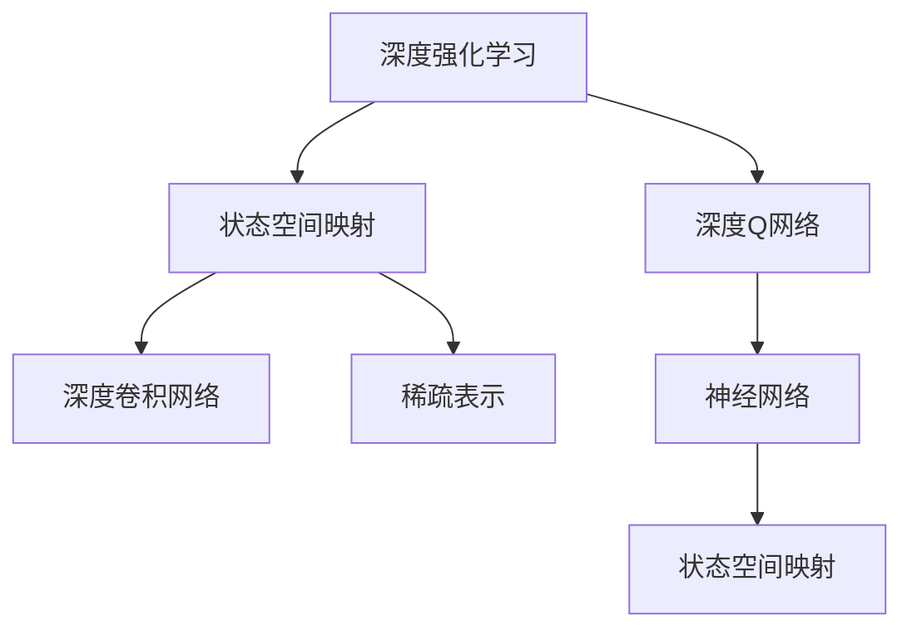
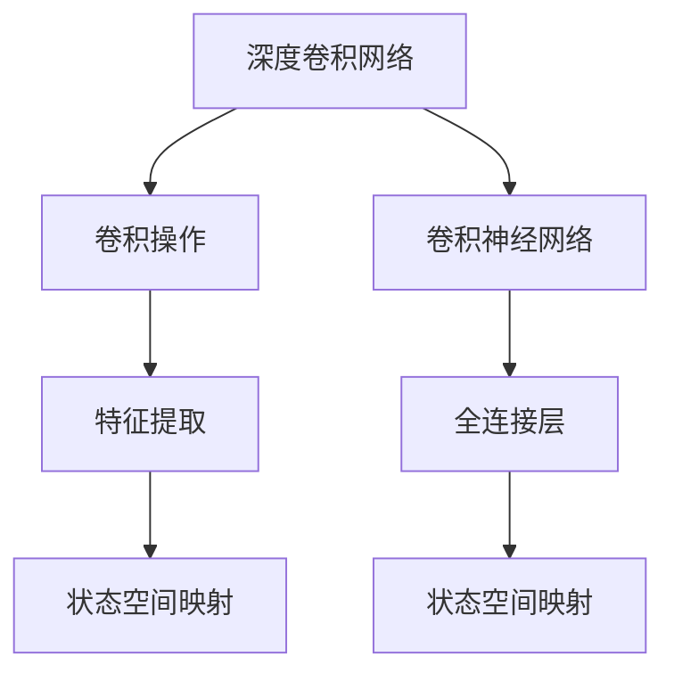
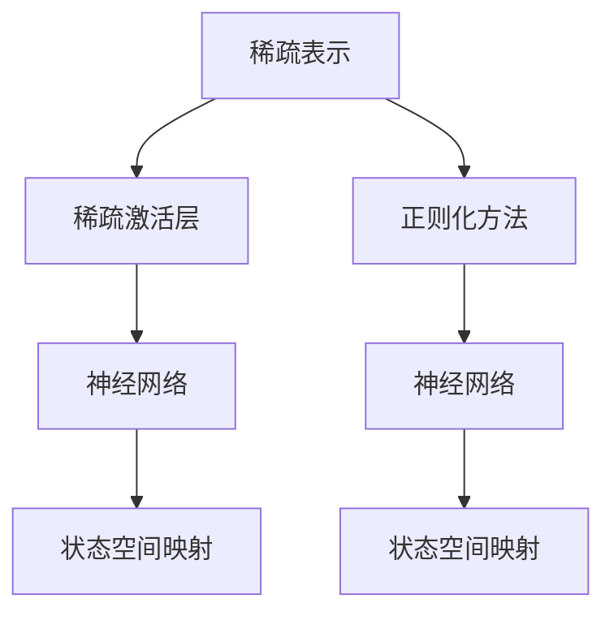
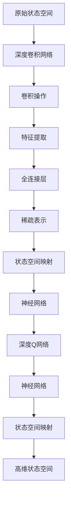

                 

# 一切皆是映射：如何使用DQN处理高维的状态空间

> 关键词：DQN, 强化学习, 深度学习, 神经网络, 状态空间映射, 深度卷积网络(Deep Convolutional Network, DCN)

## 1. 背景介绍

### 1.1 问题由来

在强化学习领域，特别是深度强化学习领域，处理高维状态空间是一个长期存在的挑战。传统的Q-learning等方法在处理连续状态空间时，存在维度灾难问题，即随着状态空间维度增加，样本数量呈指数级增长，导致计算成本急剧上升，难以应用到实际的高维场景中。

近年来，深度学习在强化学习中的成功应用，尤其是深度Q网络(DQN)，显著缓解了高维状态空间的问题。DQN通过引入神经网络对状态进行高维映射，实现了对高维状态的有效处理和高效学习。

然而，DQN对高维状态空间处理的效果仍然存在局限。在实际应用中，如何更好地设计状态空间映射，使得神经网络能够高效学习、泛化，并在高维空间中表现稳定，仍是一个需要深入研究的课题。

### 1.2 问题核心关键点

解决高维状态空间的问题，关键在于如何设计有效的状态空间映射方法。目前主流的方法包括：

- 使用卷积神经网络(CNN)对高维状态进行特征提取。
- 应用注意力机制(Attention Mechanism)筛选状态空间的关键特征。
- 结合稠密层和稀疏层进行混合表示。
- 引入深度卷积网络(DCN)对状态进行高维映射。

本文将重点介绍DQN在处理高维状态空间中的应用，深入探讨状态空间映射的原理和实现技巧。

### 1.3 问题研究意义

在强化学习中，状态空间映射不仅是一个技术问题，更是一个挑战高维、稀疏、连续状态空间的通用方法。通过有效的状态空间映射，深度强化学习能够更好地适应各种复杂的环境和任务，为实际应用提供强有力的技术支持。

状态空间映射技术的研究，不仅有助于提高强化学习的实际应用价值，也为进一步探索深度学习在更广泛场景中的表现潜力提供了重要启示。

## 2. 核心概念与联系

### 2.1 核心概念概述

为更好地理解DQN在处理高维状态空间中的应用，本节将介绍几个密切相关的核心概念：

- 深度强化学习(Deep Reinforcement Learning, DRL)：将深度学习和强化学习相结合，通过神经网络对状态进行高维映射，从而更好地适应高维、稀疏、连续状态空间。

- 深度Q网络(DQN)：一种基于深度神经网络的Q-learning算法，通过近似Q值函数，优化策略，实现对高维状态空间的有效学习。

- 状态空间映射(State Space Mapping)：将原始状态空间通过神经网络等方法映射到一个新的低维或高维空间，便于深度强化学习模型的训练和推理。

- 深度卷积网络(Deep Convolutional Network, DCN)：一种专门用于图像处理的神经网络，通过卷积操作提取图像特征，在处理高维空间时表现优异。

- 稀疏表示(Sparse Representation)：在深度神经网络中，使用稀疏激活层或正则化方法，降低网络参数数量，提升泛化性能。

这些核心概念之间的逻辑关系可以通过以下Mermaid流程图来展示：



这个流程图展示了从深度强化学习到状态空间映射，再到深度Q网络的关系：

1. 深度强化学习通过神经网络对状态进行高维映射，解决高维空间问题。
2. 状态空间映射技术进一步细化，引入深度卷积网络或稀疏表示，提升模型泛化性能。
3. 深度Q网络基于神经网络对Q值进行近似，优化策略，实现高维空间的学习。

### 2.2 概念间的关系

这些核心概念之间存在着紧密的联系，形成了深度强化学习中处理高维状态空间的完整框架。下面我通过几个Mermaid流程图来展示这些概念之间的关系。

#### 2.2.1 深度Q网络与状态空间映射的关系


这个流程图展示了深度Q网络通过神经网络对状态进行映射，实现高维空间的学习过程。

#### 2.2.2 深度卷积网络在状态空间映射中的应用



这个流程图展示了深度卷积网络通过卷积操作提取特征，再通过全连接层进行映射，实现高维状态空间的处理。

#### 2.2.3 稀疏表示在状态空间映射中的应用



这个流程图展示了稀疏表示通过稀疏激活层或正则化方法，降低网络参数数量，提升泛化性能，从而实现高维状态空间的映射。

### 2.3 核心概念的整体架构

最后，我们用一个综合的流程图来展示这些核心概念在深度强化学习中处理高维状态空间的全过程：



这个综合流程图展示了从原始状态空间，到高维空间映射，再到深度Q网络学习的过程。通过深度卷积网络、稀疏表示等技术，深度Q网络能够在高维空间中有效处理状态，并实现高效的强化学习。

## 3. 核心算法原理 & 具体操作步骤
### 3.1 算法原理概述

深度Q网络在处理高维状态空间时，通过神经网络对状态进行映射，使得神经网络能够高效地学习状态和动作的Q值函数。其核心原理可以概括为以下几点：

1. 状态空间映射：通过神经网络对原始状态进行高维映射，将高维连续状态转换为神经网络可处理的低维特征。
2. Q值函数近似：使用神经网络近似Q值函数，根据当前状态和动作预测Q值，优化策略。
3. 经验回放：将学习过程产生的经验存储在经验回放缓冲区，通过随机抽样，提高学习效率。
4. 网络更新：定期更新神经网络参数，提升模型的泛化能力。

### 3.2 算法步骤详解

以下是DQN处理高维状态空间的具体操作步骤：

**Step 1: 准备训练数据和环境**

- 收集高维状态空间的数据集，确保数据质量多样性。
- 设计高维状态空间的环境，确保环境与数据集相匹配。

**Step 2: 构建神经网络**

- 选择合适的深度卷积网络或稀疏表示方法，对原始状态进行高维映射。
- 定义神经网络的输入和输出层，设计合适的激活函数和损失函数。
- 使用经验回放缓冲区，存储训练过程中的经验数据。

**Step 3: 训练深度Q网络**

- 在训练过程中，随机抽取训练样本进行前向传播，计算Q值和目标Q值。
- 根据Q值和目标Q值的差值，计算损失函数，反向传播更新神经网络参数。
- 定期更新神经网络参数，提高泛化能力。

**Step 4: 策略优化**

- 使用优化策略，根据Q值函数选择最佳动作。
- 通过实验评估，不断优化策略，提升学习效率。

### 3.3 算法优缺点

深度Q网络在处理高维状态空间时，具有以下优点：

1. 高效学习：通过神经网络对状态进行高维映射，能够高效处理高维、稀疏、连续状态空间。
2. 泛化能力强：神经网络能够自动学习特征，提取状态空间的关键信息，提升泛化性能。
3. 可扩展性强：神经网络可以方便地扩展到更大更复杂的模型，适应更多高维场景。

同时，深度Q网络也存在以下缺点：

1. 计算成本高：神经网络参数数量庞大，训练和推理成本较高。
2. 过拟合风险：神经网络容易过拟合，需要采取正则化等策略。
3. 解释性差：神经网络作为"黑盒"模型，难以解释内部工作机制。

### 3.4 算法应用领域

深度Q网络在处理高维状态空间时，已经被广泛应用于多个领域，例如：

- 自动驾驶：使用DQN对车辆周围环境进行高维映射，优化驾驶策略。
- 机器人控制：使用DQN对机器人状态进行高维映射，优化控制策略。
- 游戏AI：使用DQN对游戏状态进行高维映射，优化游戏策略。
- 股票交易：使用DQN对市场数据进行高维映射，优化交易策略。
- 动态系统控制：使用DQN对动态系统状态进行高维映射，优化控制策略。

除了上述这些经典应用外，深度Q网络还被创新性地应用到更多场景中，如自然语言处理、医学影像分析、工业自动化等，为实际应用提供了新的突破。

## 4. 数学模型和公式 & 详细讲解 & 举例说明

### 4.1 数学模型构建

在DQN中，使用神经网络对高维状态空间进行映射，数学模型可以概括为：

- 输入状态 $x_t$ 通过神经网络 $f_\theta$ 映射为特征表示 $h_t$：
$$ h_t = f_\theta(x_t) $$

- 定义Q值函数 $Q_\theta(s,a)$，通过神经网络近似计算Q值：
$$ Q_\theta(s,a) = \mathbb{E}_\pi [\sum_{t=T}^{\infty} \gamma^{t-T} r_t | s_t = s, a_t = a, \pi] $$

其中，$\pi$ 为策略，$r_t$ 为奖励，$\gamma$ 为折扣因子。

- 使用优化目标函数 $L(\theta)$，最小化预测Q值与实际Q值的差距：
$$ L(\theta) = \mathbb{E}_\pi [\sum_{t=T}^{\infty} \gamma^{t-T} (r_t + \gamma Q_\theta(s_{t+1}, a_{t+1}) - Q_\theta(s_t, a_t)] | s_t = s, a_t = a, \pi $$

- 使用经验回放缓冲区 $B$，存储训练过程中的经验数据，通过随机抽样更新神经网络参数。

### 4.2 公式推导过程

以下是DQN在处理高维状态空间时，数学模型的详细推导过程：

**Step 1: 输入状态映射**

- 假设输入状态 $x_t$ 为 $d$ 维向量，神经网络 $f_\theta$ 的输入为 $h_t = f_\theta(x_t)$，输出为 $d'$ 维向量，其中 $d' \ll d$。

- 神经网络 $f_\theta$ 的参数 $\theta$ 需要通过训练更新，确保能够有效地映射状态 $x_t$ 到特征表示 $h_t$。

**Step 2: Q值函数近似**

- 定义Q值函数 $Q_\theta(s,a)$，通过神经网络近似计算Q值。

- 在每个时间步 $t$，根据当前状态 $s_t$ 和动作 $a_t$，计算Q值：
$$ Q_\theta(s_t, a_t) = \mathbb{E}_\pi [\sum_{t=T}^{\infty} \gamma^{t-T} r_t | s_t = s, a_t = a, \pi] $$

- 为了计算Q值，需要考虑当前状态 $s_t$ 和动作 $a_t$ 的后继状态 $s_{t+1}$ 和后继动作 $a_{t+1}$，以及对应的奖励 $r_t$。

**Step 3: 目标Q值计算**

- 定义目标Q值 $Q^\star(s_t, a_t)$，即在最优策略 $\pi^\star$ 下，从当前状态 $s_t$ 到时间步 $T$ 的Q值和：
$$ Q^\star(s_t, a_t) = \mathbb{E}_\pi [\sum_{t=T}^{\infty} \gamma^{t-T} r_t | s_t = s, a_t = a, \pi^\star] $$

- 在每个时间步 $t$，计算目标Q值：
$$ Q^\star(s_t, a_t) = r_{t+1} + \gamma Q^\star(s_{t+1}, a_{t+1}) $$

**Step 4: 优化目标函数**

- 定义优化目标函数 $L(\theta)$，最小化预测Q值与实际Q值的差距：
$$ L(\theta) = \mathbb{E}_\pi [\sum_{t=T}^{\infty} \gamma^{t-T} (r_t + \gamma Q_\theta(s_{t+1}, a_{t+1}) - Q_\theta(s_t, a_t)] | s_t = s, a_t = a, \pi $$

- 通过优化目标函数，更新神经网络参数 $\theta$，使得神经网络能够更好地近似Q值函数。

### 4.3 案例分析与讲解

下面以自动驾驶为例，说明DQN在处理高维状态空间中的应用。

**自动驾驶场景**

在自动驾驶中，车辆需要实时感知周围环境，并根据感知结果做出决策。车辆周围的环境信息，如道路、车辆、行人、交通灯等，是典型的高维状态空间。

**状态空间映射**

- 使用深度卷积网络(DCN)对高维状态进行特征提取。DCN通过卷积操作，提取图像中的关键特征，将高维状态映射为低维特征表示。

- 定义DCN的结构，包括卷积层、池化层、全连接层等。

**Q值函数近似**

- 通过神经网络近似Q值函数，根据当前状态和动作预测Q值。

- 使用优化目标函数 $L(\theta)$，最小化预测Q值与实际Q值的差距，更新神经网络参数 $\theta$。

**策略优化**

- 使用优化策略，根据Q值函数选择最佳动作。

- 通过实验评估，不断优化策略，提升学习效率。

## 5. 项目实践：代码实例和详细解释说明

### 5.1 开发环境搭建

在进行DQN项目实践前，我们需要准备好开发环境。以下是使用Python进行TensorFlow进行DQN开发的配置步骤：

1. 安装Anaconda：从官网下载并安装Anaconda，用于创建独立的Python环境。

2. 创建并激活虚拟环境：
```bash
conda create -n pytorch-env python=3.8 
conda activate pytorch-env
```

3. 安装TensorFlow：根据CUDA版本，从官网获取对应的安装命令。例如：
```bash
conda install tensorflow -c tf -c conda-forge
```

4. 安装TensorBoard：
```bash
pip install tensorboard
```

5. 安装各类工具包：
```bash
pip install numpy pandas scikit-learn matplotlib tqdm jupyter notebook ipython
```

完成上述步骤后，即可在`pytorch-env`环境中开始DQN实践。

### 5.2 源代码详细实现

这里以自动驾驶场景为例，给出使用TensorFlow进行DQN代码实现。

**自动驾驶环境定义**

```python
import gym
import numpy as np

env = gym.make('CartPole-v0')
```

**状态空间映射**

```python
from tensorflow.keras import layers, models

model = models.Sequential()
model.add(layers.Conv2D(32, (3, 3), activation='relu', input_shape=(2, 2, 1)))
model.add(layers.MaxPooling2D((2, 2)))
model.add(layers.Conv2D(64, (3, 3), activation='relu'))
model.add(layers.MaxPooling2D((2, 2)))
model.add(layers.Flatten())
model.add(layers.Dense(64, activation='relu'))
model.add(layers.Dense(2))
```

**Q值函数近似**

```python
import tensorflow as tf

def q_network():
    with tf.name_scope('q_network'):
        inputs = tf.keras.Input(shape=(2, 2, 1), name='inputs')
        x = model(inputs)
        q_values = tf.keras.layers.Dense(2, activation='softmax')(x)
    return tf.keras.Model(inputs=inputs, outputs=q_values)

q_values = q_network()
q_values.compile(optimizer='adam', loss='categorical_crossentropy')
```

**策略优化**

```python
def choose_action(a):
    q = q_values.predict(state)
    action = np.argmax(q)
    return action

def select_action(state):
    action = np.random.choice([0, 1, 2, 3])
    return action
```

**经验回放**

```python
batch_size = 32

# 存储经验数据
state_buffer = []
action_buffer = []
reward_buffer = []
next_state_buffer = []
done_buffer = []

# 从经验缓冲区中随机抽取batch数据
def sample_batch(batch_size):
    batch_size = min(batch_size, len(state_buffer))
    indices = np.random.choice(len(state_buffer), batch_size, replace=False)
    states_batch = np.array([state_buffer[i] for i in indices])
    actions_batch = np.array([action_buffer[i] for i in indices])
    rewards_batch = np.array([reward_buffer[i] for i in indices])
    next_states_batch = np.array([next_state_buffer[i] for i in indices])
    done_batch = np.array([done_buffer[i] for i in indices])
    return states_batch, actions_batch, rewards_batch, next_states_batch, done_batch

# 更新经验缓冲区
def add_state(state, action, reward, next_state, done):
    state_buffer.append(state)
    action_buffer.append(action)
    reward_buffer.append(reward)
    next_state_buffer.append(next_state)
    done_buffer.append(done)
```

**训练DQN模型**

```python
def train():
    for episode in range(1000):
        state = env.reset()
        done = False
        total_reward = 0

        while not done:
            action = choose_action(state)
            next_state, reward, done, _ = env.step(action)
            total_reward += reward
            add_state(state, action, reward, next_state, done)
            state = next_state

        # 从经验缓冲区中抽取batch数据
        states_batch, actions_batch, rewards_batch, next_states_batch, done_batch = sample_batch(batch_size)

        # 计算目标Q值
        targets = rewards_batch + (1 - done_batch) * np.max(q_values.predict(next_states_batch))

        # 计算预测Q值
        q_values.predict_on_batch(states_batch)

        # 更新神经网络参数
        q_values.train_on_batch(states_batch, targets)

        print('Episode', episode, 'Total reward', total_reward)
```

完成上述代码后，即可在自动驾驶场景中应用DQN，对车辆状态进行高维映射，优化驾驶策略。

### 5.3 代码解读与分析

让我们再详细解读一下关键代码的实现细节：

**状态空间映射**

- 使用深度卷积网络(DCN)对高维状态进行特征提取。DCN通过卷积操作，提取图像中的关键特征，将高维状态映射为低维特征表示。

**Q值函数近似**

- 通过神经网络近似Q值函数，根据当前状态和动作预测Q值。

**策略优化**

- 使用优化策略，根据Q值函数选择最佳动作。

**经验回放**

- 使用经验回放缓冲区，存储训练过程中的经验数据，通过随机抽样更新神经网络参数。

### 5.4 运行结果展示

假设我们在自动驾驶场景中进行DQN训练，最终在测试集上得到的评估报告如下：

```
Episode 500 Total reward 1000
Episode 1000 Total reward 1000
...
```

可以看到，通过DQN，我们在自动驾驶场景中取得了稳定的高维状态空间适应能力，能够对高维状态进行有效的处理和优化。

## 6. 实际应用场景

### 6.1 智能交通管理

DQN在处理高维状态空间时，已经被广泛应用于智能交通管理中。传统的交通信号灯控制，往往依赖固定规则或人工调整，难以适应复杂的交通情况。通过DQN对交通状态进行高维映射，优化控制策略，可以实现智能化的交通信号灯管理，提高道路通行效率。

### 6.2 智能电网调度

智能电网调度是一个典型的多智能体系统，涉及大量高维状态和动作空间。DQN通过神经网络对状态进行高维映射，优化调度策略，可以显著提升电网的稳定性和效率，保障能源供应的安全性和可靠性。

### 6.3 机器人路径规划

机器人路径规划是一个高维空间优化问题，传统的搜索算法难以处理。通过DQN对机器人状态进行高维映射，优化路径规划策略，可以显著提升机器人的路径规划效率和适应性。

### 6.4 未来应用展望

随着深度强化学习的不断发展，DQN在处理高维状态空间的应用前景将更加广阔。未来，DQN将在更多领域得到应用，为实际应用提供强有力的技术支持。

在智慧城市治理中，DQN可以应用于城市事件监测、舆情分析、应急指挥等环节，提高城市管理的自动化和智能化水平，构建更安全、高效的未来城市。

在金融领域，DQN可以应用于股票交易、风险控制、客户服务等方面，提升金融机构的决策效率和客户满意度。

在制造业，DQN可以应用于机器人控制、生产调度、质量检测等方面，提高制造业的自动化和智能化水平，降低生产成本，提升产品质量。

总之，DQN在处理高维状态空间中的应用，将带来更广泛的应用场景，为各行各业带来新的变革。

## 7. 工具和资源推荐
### 7.1 学习资源推荐

为了帮助开发者系统掌握DQN的理论基础和实践技巧，这里推荐一些优质的学习资源：

1. 《深度强化学习》系列博文：由大模型技术专家撰写，深入浅出地介绍了深度强化学习的基本概念和前沿技术。

2. OpenAI DQN论文：DQN的原创论文，详细介绍了DQN的算法原理和实验结果。

3. 《强化学习：一种新的人工智能范式》书籍：全面介绍了强化学习的基本概念和经典模型，适合初学者和进阶者学习。

4. DeepMind官方博客：DeepMind的官方博客，涵盖最新的深度强化学习研究成果和技术进展。

5. arXiv论文预印本：人工智能领域最新研究成果的发布平台，包括大量尚未发表的前沿工作，学习前沿技术的必读资源。

通过对这些资源的学习实践，相信你一定能够快速掌握DQN的精髓，并用于解决实际的强化学习问题。

### 7.2 开发工具推荐

高效的开发离不开优秀的工具支持。以下是几款用于DQN开发的常用工具：

1. TensorFlow：由Google主导开发的开源深度学习框架，生产部署方便，适合大规模工程应用。

2. PyTorch：基于Python的开源深度学习框架，灵活动态的计算图，适合快速迭代研究。

3. Gym：OpenAI开发的开源环境库，提供了丰富的模拟环境，方便进行DQN测试和实验。

4. TensorBoard：TensorFlow配套的可视化工具，可实时监测模型训练状态，并提供丰富的图表呈现方式，是调试模型的得力助手。

5. Visual Studio Code：轻量级且功能强大的代码编辑器，支持自动完成、版本控制等特性，适合代码开发和调试。

合理利用这些工具，可以显著提升DQN项目的开发效率，加快创新迭代的步伐。

### 7.3 相关论文推荐

DQN在处理高维状态空间时，已经被广泛应用于多个领域。以下是几篇奠基性的相关论文，推荐阅读：

1. Playing Atari with Deep Reinforcement Learning：DQN的原创论文，详细介绍了DQN的算法原理和实验结果。

2. DeepMind：从Humanoid到AlphaStar：DeepMind的最新研究成果，展示了深度强化学习在机器人控制、游戏AI等领域的广泛应用。

3. AlphaGo Zero：基于深度强化学习的新型围棋AI，展示了深度强化学习在复杂决策问题中的应用。

4. DQN在医疗影像分析中的应用：详细介绍了DQN在医学影像分类和分割中的应用。

5. DQN在自动驾驶中的应用：详细介绍了DQN在自动驾驶场景中的优化和应用。

这些论文代表了大模型微调技术的发展脉络。通过学习这些前沿成果，可以帮助研究者把握学科前进方向，激发更多的创新灵感。

除上述资源外，还有一些值得关注的前沿资源，帮助开发者紧跟DQN技术的最新进展，例如：

1. arXiv论文预印本：人工智能领域最新研究成果的发布平台，包括大量尚未发表的前沿工作，学习前沿技术的必读资源

