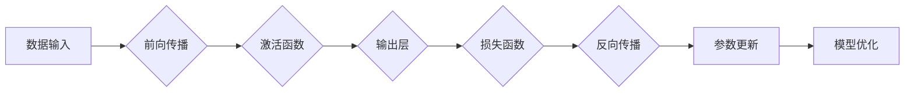

> 关键词：深度学习，反向传播，梯度下降，神经网络，优化，损失函数，数据流，反向传播算法，机器学习

# 一切皆是映射：深度学习中的反向传播和梯度下降

深度学习，作为人工智能领域的一大突破，已经深刻地影响了各行各业。在深度学习中，反向传播和梯度下降是两个核心概念，它们构成了神经网络训练的基础。本文将深入浅出地探讨这两个概念，揭示它们背后的原理和应用，并展望未来的发展趋势。

## 1. 背景介绍

### 1.1 深度学习的兴起

随着计算能力的提升和数据量的爆炸式增长，深度学习在图像识别、语音识别、自然语言处理等领域取得了显著的成果。深度学习模型，尤其是神经网络，通过学习数据中的复杂模式，实现了对数据的自动特征提取和分类。

### 1.2 反向传播和梯度下降

反向传播（Backpropagation）是一种计算神经网络输出层到输入层误差的算法。梯度下降（Gradient Descent）是一种优化算法，它通过迭代调整神经网络参数，最小化损失函数，从而优化模型性能。

### 1.3 本文结构

本文将首先介绍反向传播和梯度下降的核心概念，然后深入探讨它们的原理和具体操作步骤，接着分析数学模型和公式，并通过实际代码实例进行解释说明。最后，我们将讨论这些概念在实际应用场景中的表现，并展望未来的发展趋势和挑战。

## 2. 核心概念与联系

### 2.1 Mermaid 流程图



### 2.2 核心概念

- **数据输入**：深度学习模型开始处理的数据。
- **前向传播**：将数据通过神经网络层进行传递，计算出最终的预测值。
- **激活函数**：用于引入非线性，使神经网络能够学习复杂的非线性关系。
- **输出层**：神经网络的最后一层，输出最终的结果或预测值。
- **损失函数**：衡量预测值与真实值之间差异的函数，用于指导模型优化。
- **反向传播**：计算损失函数关于网络参数的梯度，用于更新参数。
- **参数更新**：根据梯度更新网络参数，以最小化损失函数。
- **模型优化**：通过迭代优化过程，改进模型的性能。

## 3. 核心算法原理 & 具体操作步骤

### 3.1 算法原理概述

反向传播是一种计算神经网络输出层到输入层误差的算法。它通过前向传播计算出预测值，然后通过损失函数计算预测值与真实值之间的差异。接着，反向传播算法计算损失函数关于网络参数的梯度，并通过梯度下降算法更新网络参数。

### 3.2 算法步骤详解

1. **初始化参数**：随机初始化网络参数。
2. **前向传播**：将输入数据通过神经网络，计算输出预测值。
3. **计算损失**：使用损失函数计算预测值与真实值之间的差异。
4. **反向传播**：计算损失函数关于网络参数的梯度。
5. **参数更新**：使用梯度下降算法更新网络参数。
6. **迭代**：重复步骤2-5，直到满足停止条件（如损失值达到最小值或迭代次数达到预设值）。

### 3.3 算法优缺点

#### 优点：

- **高效**：能够快速计算损失函数关于网络参数的梯度。
- **可扩展**：适用于各种神经网络结构。
- **通用**：可以应用于各种机器学习问题。

#### 缺点：

- **局部最小值**：可能陷入局部最小值，导致无法找到全局最小值。
- **计算量**：反向传播的计算量随着网络深度的增加而增加。

### 3.4 算法应用领域

反向传播和梯度下降算法广泛应用于以下领域：

- **图像识别**：用于识别图像中的对象和场景。
- **语音识别**：用于将语音信号转换为文本。
- **自然语言处理**：用于文本分类、机器翻译等。

## 4. 数学模型和公式 & 详细讲解 & 举例说明

### 4.1 数学模型构建

深度学习中的数学模型主要包括以下部分：

- **神经网络**：由多层神经元组成，每个神经元通过权重连接。
- **损失函数**：衡量预测值与真实值之间差异的函数。
- **梯度**：损失函数关于网络参数的导数。
- **参数更新**：根据梯度更新网络参数。

### 4.2 公式推导过程

以下以简单神经网络为例，推导损失函数关于网络参数的梯度。

假设神经网络有L层，第L层的输出为$\hat{y}^L$，真实标签为$y$，损失函数为$L(\hat{y}^L, y)$。则损失函数关于网络参数$\theta$的梯度为：

$$
\nabla_\theta L(\hat{y}^L, y) = \frac{\partial L}{\partial \hat{y}^L} \frac{\partial \hat{y}^L}{\partial \theta}
$$

其中，$\frac{\partial L}{\partial \hat{y}^L}$ 为损失函数关于输出的梯度，$\frac{\partial \hat{y}^L}{\partial \theta}$ 为输出关于参数的梯度。

### 4.3 案例分析与讲解

以下使用PyTorch框架实现一个简单的神经网络，并对其参数进行梯度下降优化。

```python
import torch
import torch.nn as nn
import torch.optim as optim

# 定义神经网络
class SimpleNet(nn.Module):
    def __init__(self):
        super(SimpleNet, self).__init__()
        self.fc1 = nn.Linear(10, 5)
        self.fc2 = nn.Linear(5, 1)

    def forward(self, x):
        x = self.fc1(x)
        x = torch.sigmoid(x)
        x = self.fc2(x)
        return x

# 创建模型和优化器
model = SimpleNet()
criterion = nn.MSELoss()
optimizer = optim.SGD(model.parameters(), lr=0.01)

# 创建随机数据
x_data = torch.randn(100, 10)
y_data = torch.randn(100, 1)

# 训练模型
for epoch in range(100):
    optimizer.zero_grad()
    outputs = model(x_data)
    loss = criterion(outputs, y_data)
    loss.backward()
    optimizer.step()
    if epoch % 10 == 0:
        print(f"Epoch {epoch}, Loss: {loss.item()}")

# 保存模型
torch.save(model.state_dict(), 'simple_net.pth')
```

以上代码定义了一个简单的神经网络，包含两个全连接层，并使用均方误差作为损失函数。通过梯度下降算法，模型在随机生成的数据上进行了100次迭代优化。最终，模型参数被保存到文件中。

## 5. 项目实践：代码实例和详细解释说明

### 5.1 开发环境搭建

1. 安装PyTorch：
```bash
pip install torch torchvision torchaudio
```

2. 安装Jupyter Notebook或其他Python开发环境。

### 5.2 源代码详细实现

以下代码使用PyTorch实现了一个简单的神经网络，并对其参数进行了梯度下降优化。

```python
# 省略之前的代码...

# 训练模型
for epoch in range(100):
    optimizer.zero_grad()
    outputs = model(x_data)
    loss = criterion(outputs, y_data)
    loss.backward()
    optimizer.step()
    if epoch % 10 == 0:
        print(f"Epoch {epoch}, Loss: {loss.item()}")

# 保存模型
torch.save(model.state_dict(), 'simple_net.pth')
```

### 5.3 代码解读与分析

以上代码定义了一个简单的神经网络，包含两个全连接层。在前向传播过程中，数据首先通过第一个全连接层，然后通过Sigmoid激活函数进行非线性变换。接着，数据通过第二个全连接层，输出最终的预测值。

在反向传播过程中，损失函数的梯度通过反向传播算法传递到网络参数。然后，优化器使用梯度下降算法更新网络参数，以最小化损失函数。

### 5.4 运行结果展示

运行以上代码后，将在控制台输出每10个epoch的损失值。最终，模型参数将被保存到`simple_net.pth`文件中。

## 6. 实际应用场景

### 6.1 图像识别

反向传播和梯度下降算法在图像识别领域得到了广泛应用。例如，卷积神经网络（CNN）通过学习图像特征，实现了对图像中对象的识别。

### 6.2 语音识别

反向传播和梯度下降算法在语音识别领域也发挥了重要作用。例如，循环神经网络（RNN）和长短期记忆网络（LSTM）通过学习语音特征，实现了对语音信号的识别。

### 6.3 自然语言处理

反向传播和梯度下降算法在自然语言处理领域也得到了广泛应用。例如，神经网络在文本分类、机器翻译等领域取得了显著的成果。

## 7. 工具和资源推荐

### 7.1 学习资源推荐

- 《深度学习》
- 《神经网络与深度学习》
- PyTorch官方文档

### 7.2 开发工具推荐

- PyTorch
- TensorFlow
- Jupyter Notebook

### 7.3 相关论文推荐

- "A Guide to Backpropagation"
- "Backpropagation"
- "Stochastic Gradient Descent"

## 8. 总结：未来发展趋势与挑战

### 8.1 研究成果总结

反向传播和梯度下降是深度学习中的核心概念，它们构成了神经网络训练的基础。本文从原理到实践，深入探讨了这两个概念，并通过实际代码实例进行了说明。

### 8.2 未来发展趋势

随着计算能力的提升和数据量的增长，反向传播和梯度下降算法将继续在深度学习中发挥重要作用。以下是一些未来发展趋势：

- **更有效的优化算法**：研究更有效的优化算法，如Adam、RMSprop等，以提高训练效率。
- **自适应学习率**：研究自适应学习率算法，以避免手动调整学习率。
- **分布式训练**：研究分布式训练技术，以利用多台计算机进行并行计算。

### 8.3 面临的挑战

反向传播和梯度下降算法也面临着一些挑战：

- **局部最小值**：可能陷入局部最小值，导致无法找到全局最小值。
- **计算量**：反向传播的计算量随着网络深度的增加而增加。
- **过拟合**：模型可能过拟合训练数据，导致泛化能力差。

### 8.4 研究展望

为了克服这些挑战，未来需要在以下方面进行深入研究：

- **新的优化算法**：研究新的优化算法，以提高训练效率和避免局部最小值。
- **新的训练方法**：研究新的训练方法，如迁移学习、主动学习等，以减少计算量和提高泛化能力。
- **可解释性**：提高模型的可解释性，以便更好地理解模型的决策过程。

## 9. 附录：常见问题与解答

**Q1：什么是反向传播？**

A：反向传播是一种计算神经网络输出层到输入层误差的算法。它通过前向传播计算出预测值，然后通过损失函数计算预测值与真实值之间的差异。接着，反向传播算法计算损失函数关于网络参数的梯度，用于更新网络参数。

**Q2：什么是梯度下降？**

A：梯度下降是一种优化算法，它通过迭代调整网络参数，最小化损失函数，从而优化模型性能。在深度学习中，梯度下降用于更新神经网络参数。

**Q3：反向传播和梯度下降在深度学习中有什么作用？**

A：反向传播和梯度下降是深度学习中的核心概念，它们构成了神经网络训练的基础。它们用于计算损失函数关于网络参数的梯度，并通过更新网络参数来优化模型性能。

**Q4：如何选择合适的优化算法？**

A：选择合适的优化算法需要考虑多个因素，如训练数据大小、网络结构、计算资源等。常见的优化算法包括Adam、RMSprop、SGD等。

**Q5：如何避免过拟合？**

A：避免过拟合可以通过以下方法：

- 使用数据增强技术，如随机翻转、裁剪等，增加训练数据的多样性。
- 使用正则化技术，如L1正则化、L2正则化等，惩罚过大的参数。
- 使用早停（Early Stopping）技术，在验证集上评估模型性能，当性能不再提升时停止训练。

---

作者：禅与计算机程序设计艺术 / Zen and the Art of Computer Programming