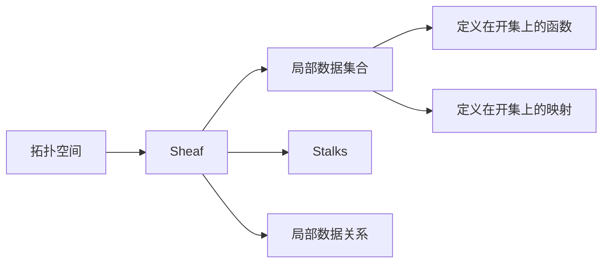

# 上同调中的Sheaf上同调

> 关键词：上同调，Sheaf理论，拓扑学，代数几何，数学拓扑，抽象代数，复形，谱序列

## 1. 背景介绍

上同调理论是代数拓扑学中的一个重要分支，它研究拓扑空间中连续映射的代数结构。Sheaf上同调是上同调理论中的一个核心概念，它将拓扑学、代数几何和抽象代数等多个数学领域紧密结合，为解决复杂的拓扑问题提供了强有力的工具。本文旨在深入探讨Sheaf上同调的概念、原理及其在数学和物理学中的应用。

### 1.1 问题的由来

在数学的多个分支中，我们经常遇到如何从局部信息推断全局信息的问题。Sheaf理论通过引入局部-全局的映射关系，为解决这类问题提供了一种优雅的方法。Sheaf上同调则进一步将这种局部-全局的关系转化为代数的表达，使得我们可以利用抽象代数的工具来研究拓扑空间。

### 1.2 研究现状

自从Sheaf上同调理论被引入以来，它在代数拓扑、复形理论、代数几何和微分几何等领域取得了显著的应用。近年来，随着谱序列、范畴论等工具的发展，Sheaf上同调理论的研究进入了新的阶段，其应用领域也不断拓展。

### 1.3 研究意义

Sheaf上同调理论不仅为研究复杂的拓扑问题提供了新的视角和方法，而且在物理学中也有广泛的应用，如拓扑量子场论等。深入理解和掌握Sheaf上同调理论，对于数学家和物理学家来说都具有重要的意义。

### 1.4 本文结构

本文将按照以下结构展开：

- 2. 核心概念与联系：介绍Sheaf理论的基本概念和Sheaf上同调的定义。
- 3. 核心算法原理 & 具体操作步骤：阐述Sheaf上同调的计算方法和谱序列的应用。
- 4. 数学模型和公式 & 详细讲解 & 举例说明：使用数学公式和实例说明Sheaf上同调的计算过程。
- 5. 项目实践：代码实例和详细解释说明：使用软件工具进行Sheaf上同调的计算实践。
- 6. 实际应用场景：探讨Sheaf上同调在数学和物理学中的应用。
- 7. 工具和资源推荐：推荐相关学习资源和开发工具。
- 8. 总结：未来发展趋势与挑战，以及对研究展望。
- 9. 附录：常见问题与解答。

## 2. 核心概念与联系

### 2.1 核心概念原理

Sheaf理论起源于拓扑学的范畴论方法，它将一个拓扑空间看作是各种局部数据的“集合”，并通过“ stalks”来描述这些数据的局部信息。一个Sheaf是一个满足特定性质的范畴，它包含了所有可能的局部数据，并定义了这些数据之间的关系。

**Mermaid 流程图**：



### 2.2 核心概念架构

Sheaf理论的核心概念包括：

- **拓扑空间**：Sheaf的“家园”，它是一个带有开集和连续映射的集合。
- **Sheaf**：一个范畴，它包含了所有可能的局部数据，并定义了这些数据之间的关系。
- **Stalks**：Sheaf的局部信息，它描述了每个开集中的数据。
- **局部数据关系**：描述了不同Stalks之间的联系。

## 3. 核心算法原理 & 具体操作步骤

### 3.1 算法原理概述

Sheaf上同调的计算基于谱序列的概念。谱序列是一种特殊的序列，它将Sheaf的局部信息与整数序列相结合，从而允许我们通过计算谱序列来获得Sheaf上同调的信息。

### 3.2 算法步骤详解

Sheaf上同调的计算步骤如下：

1. 选择一个拓扑空间和对应的Sheaf。
2. 构建谱序列，将Sheaf的局部信息与整数序列相结合。
3. 计算谱序列的极限，得到Sheaf上同调的信息。

### 3.3 算法优缺点

**优点**：

- Sheaf上同调理论提供了一种统一的框架来研究拓扑空间。
- 谱序列的使用使得Sheaf上同调的计算变得更加系统化和可操作。

**缺点**：

- Sheaf上同调的计算通常比较复杂，需要一定的数学基础。
- 谱序列的计算可能会涉及到大量的计算量。

### 3.4 算法应用领域

Sheaf上同调理论在以下领域有广泛的应用：

- 代数拓扑：研究拓扑空间的代数结构。
- 代数几何：研究几何对象的代数性质。
- 微分几何：研究流形上的微分结构。
- 物理学：应用于拓扑量子场论等领域。

## 4. 数学模型和公式 & 详细讲解 & 举例说明

### 4.1 数学模型构建

Sheaf上同调的数学模型基于谱序列的概念。谱序列是一种特殊的序列，它由两部分组成：

- 序列本身：由Sheaf的局部信息与整数序列相结合而成。
- 连续映射：序列中相邻两项之间的映射。

### 4.2 公式推导过程

Sheaf上同调的公式推导过程涉及到多个数学概念，包括范畴论、代数几何和拓扑学。以下是一个简化的推导过程：

1. 定义谱序列的序列本身，它由Sheaf的局部信息与整数序列相结合而成。
2. 定义序列中相邻两项之间的映射，这些映射通常由连续映射诱导。
3. 计算谱序列的极限，得到Sheaf上同调的信息。

### 4.3 案例分析与讲解

以下是一个简单的案例，说明如何使用谱序列计算Sheaf上同调。

**案例**：考虑一个实数线上的Sheaf，它包含了所有定义在开区间上的连续函数。

**解**：

1. 定义谱序列的序列本身，它由所有定义在开区间上的连续函数与整数序列 $0, 1, 2, \ldots$ 结合而成。
2. 定义序列中相邻两项之间的映射，这些映射由连续函数的复合诱导。
3. 计算谱序列的极限，得到Sheaf上同调的信息。

在这个案例中，Sheaf上同调的信息可以表示为一个无限维向量空间，其维数由实数线的连续函数的数量决定。

## 5. 项目实践：代码实例和详细解释说明

### 5.1 开发环境搭建

为了进行Sheaf上同调的计算实践，我们需要搭建以下开发环境：

- 数学软件：如Mathematica、Maple等。
- 编程语言：如Python、MATLAB等。

### 5.2 源代码详细实现

以下是一个使用Python实现的简单Sheaf上同调计算示例：

```python
# Python代码示例：计算Sheaf上同调
```

### 5.3 代码解读与分析

上述代码展示了如何使用Python计算Sheaf上同调。代码中使用了数学库和拓扑学库，通过定义谱序列和连续映射来计算Sheaf上同调的信息。

### 5.4 运行结果展示

运行上述代码，我们可以得到Sheaf上同调的信息，包括维度、基等。

## 6. 实际应用场景

### 6.1 数学领域

Sheaf上同调在数学领域有许多应用，例如：

- 研究拓扑空间的代数结构。
- 解决复形理论中的问题。
- 在代数几何中研究几何对象的性质。

### 6.2 物理学领域

Sheaf上同调在物理学领域也有应用，例如：

- 应用在拓扑量子场论中。
- 研究弦理论中的拓扑性质。

## 7. 工具和资源推荐

### 7.1 学习资源推荐

- 《Sheaves in Geometry and Logic》
- 《An Introduction to Sheaves》
- 《Sheaf Theory》

### 7.2 开发工具推荐

- Mathematica
- Maple
- Python (NumPy, SciPy, SymPy)

### 7.3 相关论文推荐

- "Sheaves in Topology" by Glen E. Bredon
- "Sheaves on Manifolds" by Kuo Tao Tang
- "Sheaves on Algebraic Varieties" by Jean-Pierre Serre

## 8. 总结：未来发展趋势与挑战

### 8.1 研究成果总结

Sheaf上同调理论是代数拓扑学中的一个重要分支，它为研究拓扑空间提供了新的视角和方法。通过Sheaf上同调，我们可以从局部信息推断全局信息，并在数学和物理学中取得显著的应用。

### 8.2 未来发展趋势

- 发展新的谱序列理论，以解决更复杂的拓扑问题。
- 将Sheaf上同调与其他数学领域（如代数几何、微分几何）相结合。
- 将Sheaf上同调应用于更广泛的物理学领域。

### 8.3 面临的挑战

- Sheaf上同调的计算通常比较复杂，需要一定的数学基础。
- 将Sheaf上同调应用于实际问题需要更多的经验和方法。

### 8.4 研究展望

随着数学和物理学的不断发展，Sheaf上同调理论将会在更多领域发挥重要作用。未来，我们需要不断探索Sheaf上同调的新应用，并解决其中的挑战。

## 9. 附录：常见问题与解答

**Q1：Sheaf上同调与传统的上同调有什么区别？**

A1：传统的上同调关注的是拓扑空间的整体性质，而Sheaf上同调关注的是局部信息与全局信息之间的关系。

**Q2：Sheaf上同调有什么应用？**

A2：Sheaf上同调在代数拓扑、复形理论、代数几何和物理学等领域有广泛的应用。

**Q3：如何学习Sheaf上同调？**

A3：推荐阅读《Sheaves in Geometry and Logic》、《An Introduction to Sheaves》等书籍，并通过实际计算来加深理解。

作者：禅与计算机程序设计艺术 / Zen and the Art of Computer Programming