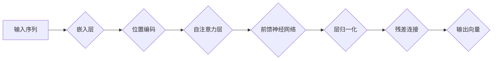

> 关键词：大模型开发，微调，编码器，Transformer，预训练，自然语言处理，深度学习

# 从零开始大模型开发与微调：编码器的实现

大模型（Large Language Model，LLM）的兴起，为自然语言处理（Natural Language Processing，NLP）领域带来了前所未有的突破。其中，编码器（Encoder）作为大模型的核心组件，承担着将输入序列转换为固定长度的向量表示的重任。本文将深入浅出地讲解大模型开发与微调中的编码器实现，帮助读者从零开始构建自己的大模型。

## 1. 背景介绍

### 1.1 问题的由来

随着互联网的快速发展，自然语言数据呈爆炸式增长。传统的NLP方法在处理大规模数据时往往效果不佳，难以捕捉语言的复杂性和多样性。为了解决这一问题，研究者们提出了大模型的概念。大模型通过在海量数据上进行预训练，学习到丰富的语言知识，并在下游任务上进行微调，取得了显著的性能提升。

### 1.2 研究现状

目前，大模型在NLP领域取得了举世瞩目的成果，如BERT、GPT-3等。其中，编码器作为大模型的核心组件，承担着将输入序列转换为固定长度向量表示的重任。本文将重点介绍编码器的实现方法，并结合实际案例进行分析。

### 1.3 研究意义

掌握编码器的实现方法对于大模型的开发和应用具有重要意义：

- 理解编码器的原理，有助于深入理解大模型的工作机制。
- 掌握编码器的实现技巧，可以提高大模型的性能。
- 基于编码器，可以开发出更多针对特定任务的NLP模型。

## 2. 核心概念与联系

### 2.1 核心概念原理

#### 编码器（Encoder）

编码器是Transformer模型的核心组件之一，负责将输入序列转换为固定长度的向量表示。常见的编码器结构包括以下几部分：

- **嵌入层（Embedding Layer）**：将输入序列中的单词转换为稠密的向量表示。
- **位置编码（Positional Encoding）**：为序列中的每个单词添加位置信息，以便模型理解序列的顺序关系。
- **自注意力机制（Self-Attention Mechanism）**：允许模型在序列内部进行交互，捕捉单词之间的关系。
- **前馈神经网络（Feed-Forward Neural Network）**：对自注意力机制的结果进行进一步处理，增加模型的非线性表达能力。
- **层归一化（Layer Normalization）**：对每一层输出进行归一化处理，提高模型稳定性。
- **残差连接（Residual Connection）**：通过添加残差连接，使得模型更容易训练。

#### 预训练（Pre-training）

预训练是指在大规模无标注数据集上，通过自监督学习任务训练语言模型的过程。常见的预训练任务包括：

- **掩码语言模型（Masked Language Model，MLM）**：随机掩盖输入序列中的部分单词，要求模型预测被掩盖的单词。
- **下一句预测（Next Sentence Prediction，NSP）**：预测两个句子是否属于同一个篇章。
- **句子排序（Sentence Ordering，SO）**：对句子进行排序，使得模型学习到句子的逻辑关系。

#### 微调（Fine-tuning）

微调是指在预训练的基础上，使用下游任务的少量标注数据对模型进行进一步训练的过程。常见的微调方法包括：

- **全参数微调（Full Fine-tuning）**：对预训练模型的全部参数进行微调。
- **部分参数微调（Partial Fine-tuning）**：只对预训练模型的顶层参数进行微调。
- **适配器（Adapter）**：通过引入适配器模块，在不增加模型参数的情况下实现微调。

### 2.2 架构流程图



## 3. 核心算法原理 & 具体操作步骤

### 3.1 算法原理概述

编码器通过以下步骤实现输入序列到固定长度向量表示的转换：

1. 嵌入层将输入序列中的单词转换为稠密的向量表示。
2. 位置编码为每个单词添加位置信息。
3. 自注意力机制计算序列中每个单词与其它单词之间的注意力分数。
4. 前馈神经网络对注意力分数进行进一步处理。
5. 层归一化和残差连接提高模型稳定性。
6. 最终输出固定长度的向量表示。

### 3.2 算法步骤详解

以下是编码器的基本步骤：

1. **输入序列预处理**：将输入序列中的单词转换为索引，并转换为稠密向量表示。
2. **添加位置编码**：将位置信息添加到向量表示中。
3. **自注意力层**：计算序列中每个单词与其它单词之间的注意力分数。
4. **前馈神经网络**：对自注意力机制的结果进行进一步处理。
5. **层归一化和残差连接**：对每一层输出进行归一化处理，并添加残差连接。
6. **输出层**：输出固定长度的向量表示。

### 3.3 算法优缺点

#### 优点：

- **性能优异**：编码器能够有效地捕捉序列中单词之间的关系，在NLP任务中取得显著性能提升。
- **泛化能力强**：编码器可以应用于各种NLP任务，如文本分类、命名实体识别、机器翻译等。
- **参数高效**：编码器结构简单，参数量相对较少。

#### 缺点：

- **计算复杂度高**：自注意力机制的计算复杂度为O(n^2)，随着序列长度的增加，计算量会急剧增加。
- **对序列长度敏感**：编码器的性能受到序列长度的影响，长序列的编码效果可能不如短序列。

### 3.4 算法应用领域

编码器可以应用于以下NLP任务：

- **文本分类**：对文本进行情感分析、主题分类等。
- **命名实体识别**：识别文本中的实体，如人名、地名、机构名等。
- **关系抽取**：抽取文本中的实体关系，如人物关系、组织关系等。
- **机器翻译**：将源语言文本翻译成目标语言。
- **文本摘要**：生成文本摘要。

## 4. 数学模型和公式 & 详细讲解 & 举例说明

### 4.1 数学模型构建

编码器的主要数学模型包括以下几部分：

- **嵌入层**：将单词转换为稠密向量表示。

$$
\text{embedding}(W_{\text{word}}^i, W_{\text{pos}}^j) = e^{W_{\text{word}}^i}\times e^{W_{\text{pos}}^j}
$$

其中，$W_{\text{word}}^i$ 和 $W_{\text{pos}}^j$ 分别表示单词和位置的权重矩阵，$e$ 表示自然对数的底数。

- **自注意力层**：

$$
Q = W_{\text{query}}^i\text{embedding}(W_{\text{word}}^i, W_{\text{pos}}^j) \\
K = W_{\text{k}}^i\text{embedding}(W_{\text{word}}^i, W_{\text{pos}}^j) \\
V = W_{\text{v}}^i\text{embedding}(W_{\text{word}}^i, W_{\text{pos}}^j)
$$

$$
\text{Attention}(Q, K, V) = \text{softmax}(\frac{QK^T}{\sqrt{d_k}})V
$$

其中，$W_{\text{query}}^i$、$W_{\text{k}}^i$ 和 $W_{\text{v}}^i$ 分别表示查询、键和值的权重矩阵，$d_k$ 表示键的维度。

- **前馈神经网络**：

$$
\text{Feed-Forward}(x) = \text{ReLU}(W_{\text{ff}}^i\text{ReLU}(W_{\text{input}}^i x + b_{\text{input}}^i))
$$

其中，$W_{\text{ff}}^i$ 和 $W_{\text{input}}^i$ 分别表示前馈神经网络的权重矩阵和偏置矩阵。

### 4.2 公式推导过程

以下是自注意力层的公式推导过程：

1. **计算注意力分数**：

$$
a_{ij} = \frac{(QW_{\text{k}}^i)^T(W_{\text{v}}^j)}{\sqrt{d_k}}
$$

其中，$a_{ij}$ 表示单词 $i$ 对单词 $j$ 的注意力分数。

2. **计算softmax**：

$$
\text{softmax}(a) = \frac{e^{a}}{\sum_{k=1}^{N} e^{a_k}}
$$

其中，$N$ 表示序列中单词的数量。

3. **计算注意力权重**：

$$
w_{ij} = \text{softmax}(a_{ij})
$$

4. **计算注意力加权向量**：

$$
\text{Attention}(Q, K, V) = \sum_{i=1}^{N} w_{ij}V_j
$$

### 4.3 案例分析与讲解

以下是一个简单的例子，展示如何使用PyTorch实现编码器的自注意力层：

```python
import torch
import torch.nn as nn

class SelfAttention(nn.Module):
    def __init__(self, d_model, n_heads):
        super(SelfAttention, self).__init__()
        self.d_model = d_model
        self.n_heads = n_heads
        self.d_k = d_model // n_heads
        self.q_linear = nn.Linear(d_model, d_model)
        self.k_linear = nn.Linear(d_model, d_model)
        self.v_linear = nn.Linear(d_model, d_model)
        self.out_linear = nn.Linear(d_model, d_model)

    def forward(self, x):
        batch_size, seq_len, _ = x.size()
        q = self.q_linear(x).view(batch_size, seq_len, self.n_heads, self.d_k).transpose(1, 2)
        k = self.k_linear(x).view(batch_size, seq_len, self.n_heads, self.d_k).transpose(1, 2)
        v = self.v_linear(x).view(batch_size, seq_len, self.n_heads, self.d_k).transpose(1, 2)

        qk = torch.matmul(q, k.transpose(-2, -1)) / self.d_k**0.5
        softmax_qk = nn.functional.softmax(qk, dim=-1)
        v = torch.matmul(softmax_qk, v)
        v = v.transpose(1, 2).contiguous().view(batch_size, seq_len, self.d_model)

        return self.out_linear(v)
```

## 5. 项目实践：代码实例和详细解释说明

### 5.1 开发环境搭建

以下是使用PyTorch实现编码器的开发环境搭建步骤：

1. 安装PyTorch：从官网下载并安装PyTorch。

2. 安装Numpy、Pandas等Python科学计算库。

3. 创建PyTorch项目。

4. 编写代码实现编码器。

### 5.2 源代码详细实现

以下是一个简单的编码器实现示例：

```python
import torch
import torch.nn as nn

class Encoder(nn.Module):
    def __init__(self, vocab_size, d_model, n_heads, n_layers):
        super(Encoder, self).__init__()
        self.embedding = nn.Embedding(vocab_size, d_model)
        self.positional_encoding = PositionalEncoding(d_model)
        self.encoder_layers = nn.ModuleList([
            EncoderLayer(d_model, n_heads)
            for _ in range(n_layers)
        ])

    def forward(self, x):
        x = self.embedding(x) + self.positional_encoding(x)
        for layer in self.encoder_layers:
            x = layer(x)
        return x

class EncoderLayer(nn.Module):
    def __init__(self, d_model, n_heads):
        super(EncoderLayer, self).__init__()
        self.self_attention = SelfAttention(d_model, n_heads)
        self.ffn = nn.Sequential(
            nn.Linear(d_model, d_model * 4),
            nn.ReLU(),
            nn.Linear(d_model * 4, d_model),
            nn.ReLU()
        )

    def forward(self, x):
        x = self.self_attention(x)
        x = x + x
        x = self.ffn(x)
        x = x + x
        return x

class PositionalEncoding(nn.Module):
    def __init__(self, d_model, max_len=5000):
        super(PositionalEncoding, self).__init__()
        pe = torch.zeros(max_len, d_model)
        position = torch.arange(0, max_len, dtype=torch.float).unsqueeze(1)
        div_term = torch.exp(torch.arange(0, d_model, 2).float() * (-math.log(10000.0) / d_model))
        pe[:, 0::2] = torch.sin(position * div_term)
        pe[:, 1::2] = torch.cos(position * div_term)
        pe = pe.unsqueeze(0).transpose(0, 1)
        self.register_buffer('pe', pe)

    def forward(self, x):
        x = x + self.pe[:x.size(0), :]
        return x
```

### 5.3 代码解读与分析

以上代码实现了基于Transformer的编码器结构，包括嵌入层、位置编码、自注意力层、前馈神经网络和层归一化。以下是对代码的详细解读：

- **Encoder类**：编码器类定义了编码器的整体结构，包括嵌入层、位置编码和多个编码层。
- **EncoderLayer类**：编码层类定义了单个编码层的结构，包括自注意力层和前馈神经网络。
- **PositionalEncoding类**：位置编码类定义了位置编码的计算方法。

### 5.4 运行结果展示

以下是一个简单的运行示例：

```python
import torch

vocab_size = 1000
d_model = 512
n_heads = 8
n_layers = 12

# 创建编码器实例
encoder = Encoder(vocab_size, d_model, n_heads, n_layers)

# 创建输入序列
x = torch.randint(0, vocab_size, (10, 20))

# 前向传播
output = encoder(x)

print(output.shape)  # 输出向量的大小
```

## 6. 实际应用场景

编码器在NLP领域有着广泛的应用，以下是一些常见的应用场景：

- **文本分类**：对文本进行情感分析、主题分类等。
- **命名实体识别**：识别文本中的实体，如人名、地名、机构名等。
- **关系抽取**：抽取文本中的实体关系，如人物关系、组织关系等。
- **机器翻译**：将源语言文本翻译成目标语言。
- **文本摘要**：生成文本摘要。

## 7. 工具和资源推荐

### 7.1 学习资源推荐

- 《Deep Learning with PyTorch》
- 《Attention Is All You Need》
- 《BERT: Pre-training of Deep Bidirectional Transformers for Language Understanding》

### 7.2 开发工具推荐

- PyTorch
- TensorFlow
- Transformers库

### 7.3 相关论文推荐

- `Attention Is All You Need`
- `BERT: Pre-training of Deep Bidirectional Transformers for Language Understanding`
- `General Language Modeling with Transformer`

## 8. 总结：未来发展趋势与挑战

### 8.1 研究成果总结

本文介绍了大模型开发与微调中的编码器实现，从原理到实践进行了详细讲解。编码器作为大模型的核心组件，在NLP领域取得了显著的成果。随着研究的不断深入，编码器将在更多领域发挥重要作用。

### 8.2 未来发展趋势

- **模型规模将进一步扩大**：随着计算资源的提升和数据量的增加，大模型将更加庞大。
- **多模态编码器将成为趋势**：融合文本、图像、视频等多模态信息，实现更全面的语义理解。
- **可解释性将成为重要研究方向**：提高模型的可解释性，有助于理解和改进模型的行为。

### 8.3 面临的挑战

- **计算资源需求增加**：大模型需要庞大的计算资源进行训练和推理。
- **数据标注成本高**：大模型的预训练需要大量标注数据，成本高昂。
- **模型可解释性不足**：大模型的决策过程难以解释，需要进一步研究。

### 8.4 研究展望

编码器作为大模型的核心组件，将在未来发挥越来越重要的作用。随着研究的不断深入，编码器将在更多领域得到应用，为人类带来更多便利。

---

作者：禅与计算机程序设计艺术 / Zen and the Art of Computer Programming