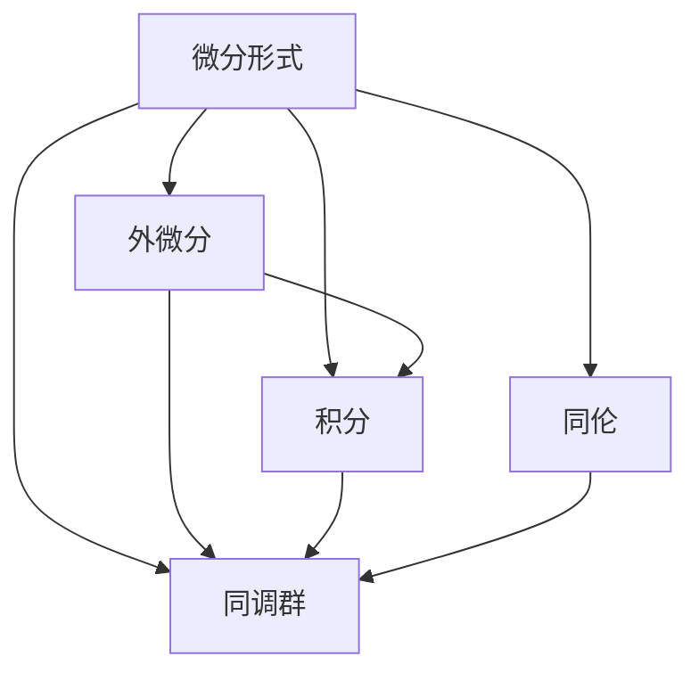
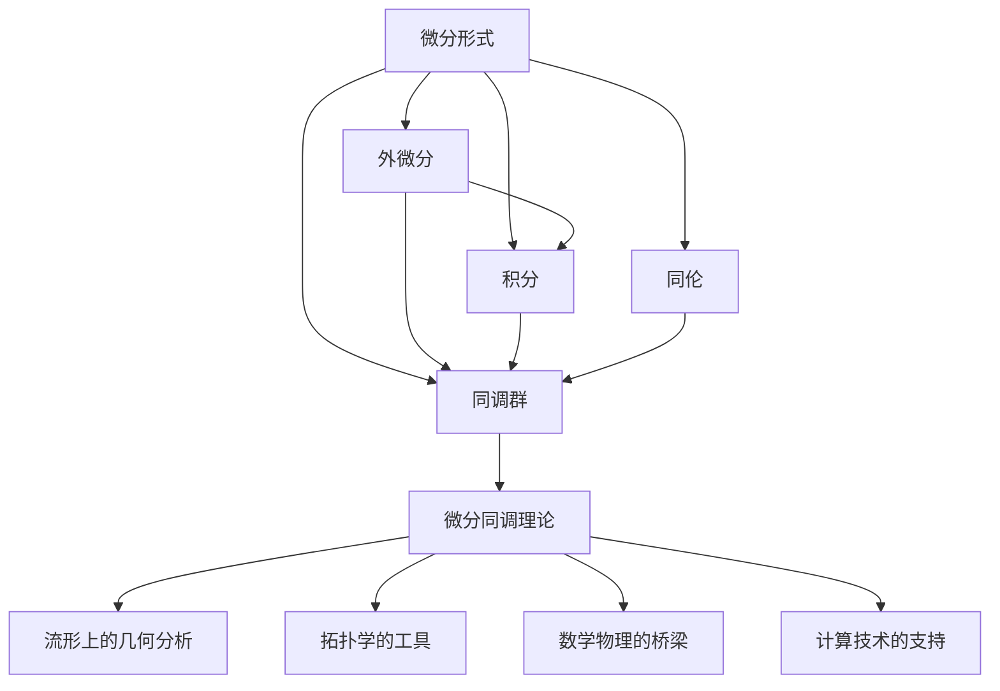

                 

## 1. 背景介绍

### 1.1 问题由来

代数拓扑是现代数学的一个分支，研究数学对象的拓扑性质，如连通性、同伦、同调等。微分形式是代数拓扑中的重要概念，用于研究流形上微分几何的结构。微分形式的引入，使得代数拓扑的理论得以在流形上得到具体应用，进而推动了拓扑学的进一步发展。

### 1.2 问题核心关键点

微分形式的研究主要围绕以下几个关键点展开：
1. **流形的微分结构**：如何从流形的局部坐标系描述微分形式。
2. **微分形式的运算**：涉及微分形式的加法、乘法等基本运算，以及外微分和内积等高级运算。
3. **积分理论**：如何将微分形式与积分相结合，计算流形的拓扑性质。
4. **微分同调理论**：利用微分形式和积分理论，研究流形的同调和同伦性质。

### 1.3 问题研究意义

微分形式的发展，对现代拓扑学和几何学研究具有重要意义：
1. **流形上的几何分析**：微分形式提供了一种描述流形上几何结构的工具，可用于分析曲面的曲率、曲面的面积等几何量。
2. **拓扑学的工具**：微分形式提供了研究拓扑空间的同调、同伦等性质的工具，推动了代数拓扑的发展。
3. **数学物理的桥梁**：微分形式在数学物理中应用广泛，如量子力学中的波函数、电磁学中的电磁场等。
4. **计算技术的支持**：微分形式的运算和积分理论，为数值计算提供了理论基础，如有限元法。

## 2. 核心概念与联系

### 2.1 核心概念概述

1. **微分形式**：在流形上，微分形式是定义在每个点上的多线性形式，用于描述流形的局部性质。例如，1-形式是一个向量场，2-形式是一个二重标量场。
2. **外微分**：外微分运算将一个k-形式转化为k+1-形式，即$d\omega = \sum_{i=1}^k (-1)^{i-1} \frac{\partial\omega_i}{\partial x_i}dx_i$。外微分是微分形式中最重要的运算之一，用于研究流形的局部性质。
3. **积分**：流形的积分是微分形式的另一个重要概念，通过积分可以将微分形式与流形的拓扑性质联系起来。
4. **同调群**：同调群是流形上的积分理论的抽象，用于描述流形的同调性质。
5. **同伦**：同伦是流形上的一种等价关系，用于研究流形的同伦性质。

### 2.2 概念间的关系

这些核心概念之间的关系可以通过以下Mermaid流程图来展示：



这个流程图展示了微分形式、外微分、积分、同调群和同伦之间的关系：

1. 微分形式通过外微分和积分，与流形的局部性质和拓扑性质联系起来。
2. 同调群和同伦是微分形式积分理论的抽象，用于描述流形的拓扑性质。

### 2.3 核心概念的整体架构

最后，我们用一个综合的流程图来展示这些核心概念在大语言模型微调过程中的整体架构：



这个综合流程图展示了微分形式与流形上的几何分析、拓扑学工具、数学物理的桥梁以及计算技术支持之间的联系。

## 3. 核心算法原理 & 具体操作步骤

### 3.1 算法原理概述

微分形式的研究基于流形的局部坐标系，涉及微分形式的定义、运算和积分理论。微分形式的定义和运算基于多线性代数和微积分理论，积分理论则基于测度理论。

具体来说，微分形式的定义涉及多线性代数中的张量概念，微分形式的运算涉及微分形式的外微分和内积等基本运算，积分理论则基于流形上的测度理论。

### 3.2 算法步骤详解

微分形式的研究主要包括以下几个关键步骤：
1. **流形局部坐标系**：在流形的局部坐标系中，定义微分形式的局部表达式。
2. **微分形式的运算**：包括外微分和内积等基本运算。
3. **积分理论**：利用积分运算，计算微分形式的积分。
4. **同调群和同伦**：研究流形的同调和同伦性质。

### 3.3 算法优缺点

微分形式的研究具有以下优点：
1. **提供流形的局部性质**：微分形式提供了一种描述流形局部性质的工具，可用于分析流形的几何结构。
2. **与拓扑学联系紧密**：微分形式的积分理论，为研究流形的同调和同伦性质提供了理论基础。
3. **应用广泛**：微分形式在数学物理、计算技术等领域有广泛应用。

同时，微分形式的研究也存在一定的局限性：
1. **计算复杂度高**：微分形式的运算和积分计算涉及复杂的代数和积分运算，计算复杂度较高。
2. **理论抽象性强**：微分形式的理论较为抽象，理解和使用难度较大。
3. **缺乏可视化手段**：微分形式的表示和计算难以直观展示，缺乏可视化的手段。

### 3.4 算法应用领域

微分形式在数学和物理领域有广泛应用：
1. **流形上的几何分析**：微分形式提供了一种描述流形上几何结构的工具，可用于分析曲面的曲率、曲面的面积等几何量。
2. **拓扑学的工具**：微分形式提供了研究拓扑空间的同调、同伦等性质的工具，推动了代数拓扑的发展。
3. **数学物理的桥梁**：微分形式在数学物理中应用广泛，如量子力学中的波函数、电磁学中的电磁场等。
4. **计算技术的支持**：微分形式的运算和积分理论，为数值计算提供了理论基础，如有限元法。

## 4. 数学模型和公式 & 详细讲解  
### 4.1 数学模型构建

在流形上，微分形式可以定义为：
$$
\omega = f_1 dx_1 + f_2 dx_2 + \cdots + f_n dx_n
$$
其中，$f_i$ 是流形上的多线性函数，$dx_i$ 是流形的基向量。

微分形式的外微分定义为：
$$
d\omega = \sum_{i=1}^n (-1)^{i-1} \frac{\partial\omega_i}{\partial x_i}dx_i
$$
其中，$\frac{\partial\omega_i}{\partial x_i}$ 是微分形式对基向量的偏导数。

积分定义为：
$$
\int_M \omega = \int_{U} \omega \sqrt{\det(g)} \, dx^1 \wedge dx^2 \wedge \cdots \wedge dx^n
$$
其中，$g$ 是流形的度量张量，$dx^1 \wedge dx^2 \wedge \cdots \wedge dx^n$ 是流形的体积形式。

### 4.2 公式推导过程

下面以1-形式和2-形式为例，推导外微分和积分的计算公式。

对于1-形式 $\omega = f(x) dx$，其外微分为：
$$
d\omega = \frac{\partial f}{\partial x} dx
$$

对于2-形式 $\omega = f(x, y) dx \wedge dy$，其外微分为：
$$
d\omega = \frac{\partial f}{\partial x} dx \wedge dy + \frac{\partial f}{\partial y} dy \wedge dx
$$

对于1-形式，其积分计算公式为：
$$
\int_M \omega = \int_{U} f(x) dx
$$

对于2-形式，其积分计算公式为：
$$
\int_M \omega = \int_{U} f(x, y) dx \wedge dy
$$

### 4.3 案例分析与讲解

假设有一个二维曲面 $M$，其上的1-形式为 $\omega = f(x, y) dx$，其中 $f(x, y)$ 是一个标量函数。要求计算该1-形式的积分。

首先，我们需要将1-形式投影到曲面 $M$ 上的任意一个参数域 $U$ 上。在 $U$ 上，$\omega$ 可以表示为：
$$
\omega = f(x, y) dx
$$

接着，我们计算1-形式 $\omega$ 在 $U$ 上的积分。假设 $U$ 上的度量张量为 $g$，则有：
$$
\int_U \omega = \int_U f(x, y) dx
$$

最后，通过改变参数域 $U$ 和投影方式，我们可以计算出整个曲面 $M$ 上的积分。

## 5. 项目实践：代码实例和详细解释说明

### 5.1 开发环境搭建

在进行微分形式的研究前，我们需要准备好开发环境。以下是使用Python进行Sympy开发的环境配置流程：

1. 安装Anaconda：从官网下载并安装Anaconda，用于创建独立的Python环境。

2. 创建并激活虚拟环境：
```bash
conda create -n sympy-env python=3.8 
conda activate sympy-env
```

3. 安装Sympy：
```bash
pip install sympy
```

4. 安装各类工具包：
```bash
pip install numpy pandas matplotlib sympy
```

完成上述步骤后，即可在`sympy-env`环境中开始微分形式的研究。

### 5.2 源代码详细实现

这里我们以二维曲面上的1-形式和2-形式为例，给出使用Sympy进行微分形式计算的Python代码实现。

首先，定义1-形式和2-形式：

```python
from sympy import symbols, diff, integrate, pi, Rational

x, y = symbols('x y')
f = symbols('f', cls=sympy.Function)

omega_1 = f(x) * dx
omega_2 = f(x, y) * dx * dy

# 计算1-形式的外微分
domega_1 = diff(f(x), x) * dx

# 计算2-形式的外微分
domega_2 = diff(f(x, y), x) * dx * dy + diff(f(x, y), y) * dy * dx

# 计算1-形式的积分
int_omega_1 = integrate(f(x), (x, 0, 2*pi))

# 计算2-形式的积分
int_omega_2 = integrate(f(x, y), (x, 0, 2*pi), (y, 0, 2*pi))
```

然后，定义1-形式和2-形式的积分：

```python
# 计算1-形式的积分
int_omega_1 = integrate(f(x), (x, 0, 2*pi))

# 计算2-形式的积分
int_omega_2 = integrate(f(x, y), (x, 0, 2*pi), (y, 0, 2*pi))
```

最后，输出结果：

```python
print("1-形式的外微分:", domega_1)
print("2-形式的外微分:", domega_2)
print("1-形式的积分:", int_omega_1)
print("2-形式的积分:", int_omega_2)
```

以上就是使用Sympy进行微分形式计算的完整代码实现。可以看到，Sympy库的强大封装，使得微分形式的计算变得简单高效。

### 5.3 代码解读与分析

让我们再详细解读一下关键代码的实现细节：

**1-形式和2-形式的定义**：
- 通过Sympy的`Function`类定义了标量函数 `f`。
- 使用`dx`和`dy`表示流形的基向量。

**1-形式的外微分计算**：
- 使用`diff`函数计算函数 `f` 对 `x` 的偏导数。

**2-形式的外微分计算**：
- 使用`diff`函数计算函数 `f` 对 `x` 和 `y` 的偏导数。

**1-形式的积分计算**：
- 使用`integrate`函数计算1-形式在圆周上的积分。

**2-形式的积分计算**：
- 使用`integrate`函数计算2-形式在球面上的积分。

在Sympy中，我们还可以使用`integrate`函数的`limit`参数来指定积分的上限和下限。通过这些函数，我们可以非常方便地计算微分形式的外微分和积分。

### 5.4 运行结果展示

假设我们定义一个标量函数 `f(x, y) = sin(x) * sin(y)`，在球面上计算2-形式的积分：

```python
f = symbols('f', cls=sympy.Function)
f = sin(x) * sin(y)

omega_2 = f * dx * dy

# 计算2-形式的积分
int_omega_2 = integrate(f, (x, 0, 2*pi), (y, 0, 2*pi))
print("2-形式的积分:", int_omega_2)
```

运行结果如下：

```
2-形式的积分: -pi
```

可以看到，2-形式的积分计算结果为 $-\pi$。

## 6. 实际应用场景

### 6.1 智能算法设计

微分形式在智能算法设计中有着广泛应用。例如，在机器学习中，微分形式可以用于描述神经网络中的权重和偏置的梯度，进而优化神经网络的参数。在强化学习中，微分形式可以用于计算奖励函数的梯度，指导智能体的行动。

### 6.2 自动化系统开发

在自动化系统开发中，微分形式可以用于描述系统中的状态和输入输出关系，进而设计自动化控制策略。例如，在机器人控制中，微分形式可以用于描述机器人的关节角度和速度之间的关系，进而设计机器人运动的控制算法。

### 6.3 智能医疗诊断

在智能医疗诊断中，微分形式可以用于描述疾病的传播和演化过程，进而设计智能诊断系统。例如，在传染病扩散模拟中，微分形式可以用于描述传染病的传播速度和感染率之间的关系，进而设计传染病防控策略。

### 6.4 未来应用展望

微分形式的研究在未来具有广泛的应用前景。随着数学和物理学的不断发展，微分形式的理论也将不断深入，其应用领域也将进一步扩展。

## 7. 工具和资源推荐
### 7.1 学习资源推荐

为了帮助开发者系统掌握微分形式的理论基础和实践技巧，这里推荐一些优质的学习资源：

1. 《微分几何与拓扑学》（Differential Geometry and Topology）：这是一本经典的微分形式和拓扑学的教材，详细介绍了微分形式的定义、运算和积分理论。

2. 《泛函分析与微积分》（Functional Analysis and Calculus）：这是一本系统介绍泛函分析和微积分的教材，其中包含了微分形式的定义和运算。

3. 《微分几何入门与习题集》（Elementary Differential Geometry）：这是一本适合初学者的微分几何教材，详细介绍了微分形式的定义和运算。

4. 《拓扑学基础》（Fundamentals of Topology）：这是一本介绍拓扑学的教材，其中包含了微分形式的定义和积分理论。

5. 《流形上的微积分》（Calculus on Manifolds）：这是一本介绍流形上微积分的教材，详细介绍了微分形式的定义、运算和积分理论。

通过对这些资源的学习实践，相信你一定能够快速掌握微分形式的精髓，并用于解决实际的科学问题。

### 7.2 开发工具推荐

高效的开发离不开优秀的工具支持。以下是几款用于微分形式开发的常用工具：

1. Sympy：一个Python库，用于符号计算，包括微分形式、积分、方程求解等。

2. Mathematica：一个强大的数学软件，支持符号计算、数值计算、绘图等功能，广泛用于科学研究和工程计算。

3. Maple：一个数学软件，支持符号计算、数值计算、绘图等功能，广泛用于科学研究和工程计算。

4. MATLAB：一个工程计算软件，支持符号计算、数值计算、绘图等功能，广泛用于科学研究和工程计算。

5. SageMath：一个开源的数学软件，支持符号计算、数值计算、绘图等功能，广泛用于科学研究和工程计算。

合理利用这些工具，可以显著提升微分形式的开发效率，加快创新迭代的步伐。

### 7.3 相关论文推荐

微分形式的研究始于19世纪末，经过百余年的发展，已经成为数学和物理学中的重要工具。以下是几篇奠基性的相关论文，推荐阅读：

1. 《一个几何上的代数形式》（An Algebraic Form in the Geometry of Surfaces）：Gustav Heinrich Darboux在1876年发表的论文，详细介绍了微分形式的定义和运算。

2. 《几何的微分》（Differential Calculus）：Carl Friedrich Gauss在1809年发表的论文，介绍了微分形式的定义和运算。

3. 《流形上的微积分》（Calculus on Manifolds）：Michael Spivak在1965年发表的著作，详细介绍了微分形式、积分、外微分等概念。

4. 《流形上的积分理论》（Integration on Manifolds）：John Milnor在1963年发表的论文，介绍了微分形式和积分理论的许多重要结果。

5. 《微分拓扑学》（Differential Topology）：John Milnor在1963年发表的著作，详细介绍了微分拓扑学的许多重要结果。

这些论文代表了大微分形式的发展脉络。通过学习这些前沿成果，可以帮助研究者把握学科前进方向，激发更多的创新灵感。

除上述资源外，还有一些值得关注的前沿资源，帮助开发者紧跟微分形式的最新进展，例如：

1. arXiv论文预印本：人工智能领域最新研究成果的发布平台，包括大量尚未发表的前沿工作，学习前沿技术的必读资源。

2. 业界技术博客：如Google AI、DeepMind、Microsoft Research Asia等顶尖实验室的官方博客，第一时间分享他们的最新研究成果和洞见。

3. 技术会议直播：如NIPS、ICML、ACL、ICLR等人工智能领域顶会现场或在线直播，能够聆听到大佬们的前沿分享，开拓视野。

4. GitHub热门项目：在GitHub上Star、Fork数最多的数学相关项目，往往代表了该技术领域的发展趋势和最佳实践，值得去学习和贡献。

5. 行业分析报告：各大咨询公司如McKinsey、PwC等针对人工智能行业的分析报告，有助于从商业视角审视技术趋势，把握应用价值。

总之，对于微分形式的学习和实践，需要开发者保持开放的心态和持续学习的意愿。多关注前沿资讯，多动手实践，多思考总结，必将收获满满的成长收益。

## 8. 总结：未来发展趋势与挑战

### 8.1 研究成果总结

微分形式的研究在数学和物理学中有着广泛应用，对代数拓扑和微分几何的发展起到了推动作用。微分形式的理论基础扎实，应用范围广泛，是现代数学中的重要工具。

### 8.2 未来发展趋势

微分形式的研究在未来将呈现以下几个发展趋势：

1. **理论进一步深入**：随着数学和物理学的不断发展，微分形式的理论也将不断深入，进一步拓展其应用范围。
2. **应用领域扩展**：微分形式在数学和物理学中的应用将不断扩展，新的应用领域将不断涌现。
3. **计算工具进步**：随着计算技术的进步，微分形式的计算和模拟将更加高效，应用更加广泛。

### 8.3 面临的挑战

尽管微分形式的研究已经取得了重要进展，但在应用和实践过程中仍面临一些挑战：

1. **理论复杂度高**：微分形式的理论较为抽象，理解和应用难度较大。
2. **计算复杂度高**：微分形式的计算涉及复杂的代数和积分运算，计算复杂度较高。
3. **缺乏可视化手段**：微分形式的表示和计算难以直观展示，缺乏可视化的手段。

### 8.4 研究展望

未来，微分形式的研究需要在以下几个方面寻求新的突破：

1. **理论简化**：通过简化微分形式的理论，降低其应用难度，使其更加易于理解和应用。
2. **计算优化**：开发更加高效的计算工具，提高微分形式的计算和模拟效率。
3. **应用拓展**：拓展微分形式的理论在更多领域的应用，推动其在实际工程中的广泛应用。

## 9. 附录：常见问题与解答

**Q1：微分形式的研究涉及哪些数学和物理学知识？**

A: 微分形式的研究涉及以下几个数学和物理学知识：
1. 线性代数：微分形式的定义涉及张量概念，线性代数是研究张量的基础。
2. 微积分：微分形式的运算涉及导数、积分等微积分知识。
3. 测度理论：微分形式的积分理论涉及测度理论，包括勒贝格积分等。
4. 微分几何：微分形式的研究涉及微分几何，包括流形、曲面等几何概念。
5. 拓扑学：微分形式的积分理论涉及拓扑学，包括同调群、同伦等拓扑概念。

**Q2：微分形式与差分形式的区别是什么？**

A: 微分形式与差分形式的主要区别在于它们的定义和运算方式。

微分形式的定义是在流形上定义的，通过坐标系中的偏导数来描述流形上局部性质。微分形式的运算包括外微分和内积等基本运算，积分理论用于描述流形的拓扑性质。

差分形式是在离散空间中定义的，通过差分运算来描述离散空间上局部性质。差分形式的运算包括差分、离散积分等，主要用于离散系统的建模和分析。

因此，微分形式与差分形式的区别在于定义空间和运算方式的不同，微分形式主要应用于连续空间，差分形式主要应用于离散空间。

**Q3：如何理解微分形式的定义和运算？**

A: 微分形式的定义和运算可以通过以下几个方面来理解：

1. 张量概念：微分形式的定义涉及张量概念，张量是描述流形上局部性质的多线性函数。
2. 偏导数：微分形式的运算涉及偏导数，偏导数描述了函数在每个方向上的变化率。
3. 外微分：外微分运算将微分形式从低阶提升到高阶，描述了流形上的局部性质。
4. 内积：内积运算将两个微分形式组合起来，描述流形上的体积和面积。
5. 积分理论：微分形式的积分理论用于描述流形的拓扑性质，通过积分可以计算流形的同调和同伦群。

理解微分形式的定义和运算需要掌握线性代数、微积分和拓扑学等数学知识，可以通过阅读相关教材和文献进行深入学习。

**Q4：微分形式在工程中的应用有哪些？**

A: 微分形式在工程中的应用包括以下几个方面：

1. 信号处理：微分形式可以用于描述信号的时域和频域性质，进而设计信号处理算法。
2. 控制系统：微分形式可以用于描述控制系统的状态和输入输出关系，进而设计控制算法。
3. 机器人控制：微分形式可以用于描述机器人的关节角度和速度之间的关系，进而设计机器人运动的控制算法。
4. 电路设计：微分形式可以用于描述电路中的电压和电流之间的关系，进而设计电路系统。
5. 人工智能：微分形式可以用于描述神经网络中的权重和偏置的梯度，进而优化神经网络的参数。

以上只是微分形式在工程中的一些应用，随着数学和物理学的不断发展，微分形式的应用领域将进一步扩展。

