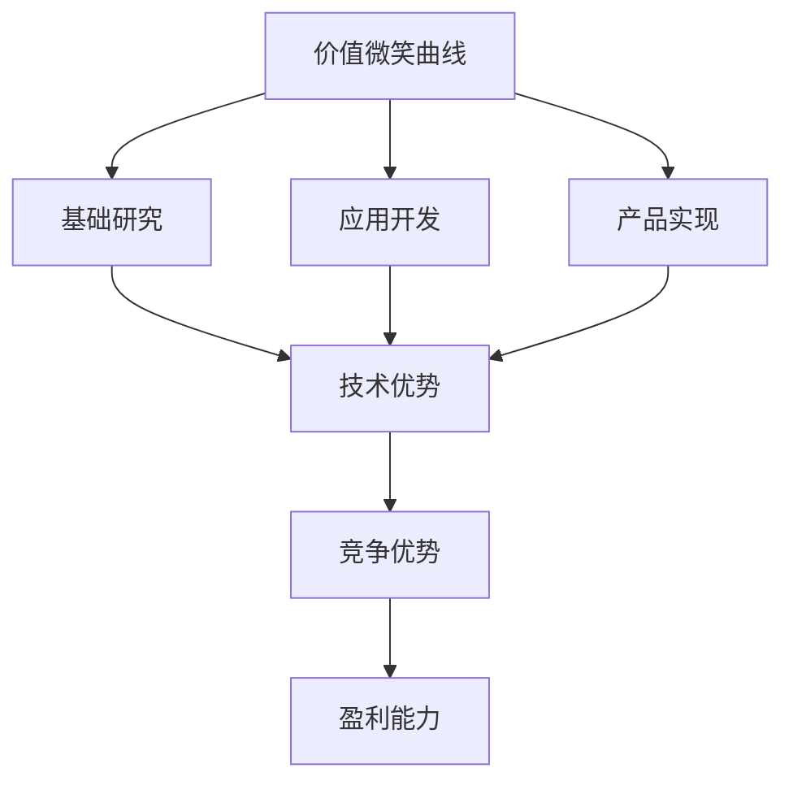
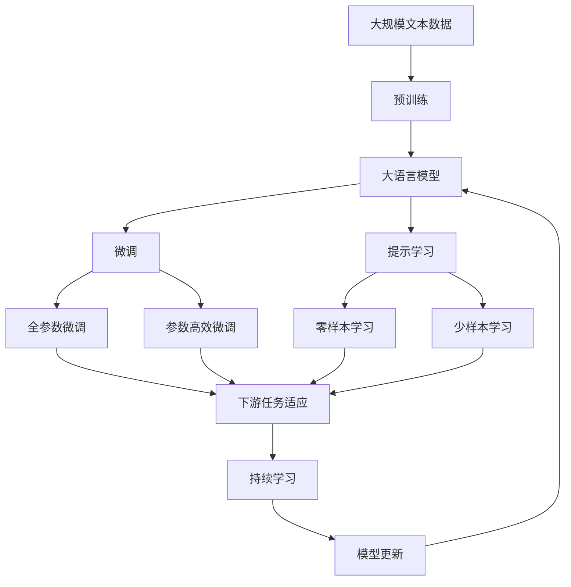

                 

# 价值微笑曲线与AI公司的位置

> 关键词：价值微笑曲线, AI公司, 人工智能, 价值链, 技术优势, 战略定位, 竞争优势

## 1. 背景介绍

### 1.1 问题由来

在过去十年间，人工智能(AI)技术取得了迅猛的发展，从深度学习、自然语言处理到计算机视觉等诸多领域均取得了显著进展。AI技术不仅在学术界引发了巨大关注，更是逐渐渗透到了各行各业，成为了推动创新、提升效率的重要工具。然而，随着AI技术的广泛应用，市场竞争也日益激烈，企业如何在激烈的市场竞争中脱颖而出，成为了一个亟待解决的问题。

### 1.2 问题核心关键点

在当前的AI市场中，企业通过技术优势获得的竞争优势不再明显，而通过全面、深入的理解和掌握价值链中的各个环节，从而在全球价值微笑曲线中占据有利位置，已成为获取竞争优势的重要途径。价值微笑曲线是一个描述技术创新和价值创造的模型，揭示了从技术开发到最终产品价值实现的过程。

### 1.3 问题研究意义

理解价值微笑曲线，有助于AI企业识别自身在价值链中的定位，明晰未来发展的方向，从而在激烈的市场竞争中获得竞争优势。本文将深入探讨价值微笑曲线模型，分析其在AI公司中的具体应用，以及AI公司如何通过技术优势、创新能力、市场定位等手段在全球价值微笑曲线中占据有利位置，从而提升自身的市场竞争力和盈利能力。

## 2. 核心概念与联系

### 2.1 核心概念概述

为更好地理解价值微笑曲线模型，本节将介绍几个密切相关的核心概念：

- 价值微笑曲线：一个描述技术创新和价值创造的模型，揭示了从技术开发到最终产品价值实现的过程。其基本思想是，技术创新的价值呈现微笑曲线形状，中间部分（应用开发）的价值最大，两端（基础研究和产品实现）的价值较低。

- AI技术：指以数据为基础，通过机器学习、深度学习、自然语言处理等技术实现人工智能的各类应用。AI技术在自动化、智能化、个性化等领域具有广泛应用前景。

- 人工智能公司：指专注于人工智能技术研发、应用开发和商业化的企业。这类公司通常拥有强大的技术实力和创新能力，能够在AI市场中占据重要位置。

- 价值链：指企业为了提供产品或服务，从原材料采购、研发设计、生产制造到销售服务等各个环节所形成的一系列活动。价值链分析有助于理解企业在行业中的竞争优势和劣势。

- 技术优势：指企业在特定技术领域拥有的专有知识和技能，通常是企业竞争力的基础。

- 战略定位：指企业在价值链中定位的策略选择，决定企业的业务范围和发展方向。

- 市场定位：指企业根据自身能力、市场需求等因素，选择目标市场和客户群体的策略。

这些核心概念之间的逻辑关系可以通过以下Mermaid流程图来展示：



这个流程图展示了大语言模型微调过程中各个核心概念的关系和作用：

1. 价值微笑曲线揭示了从技术开发到最终产品价值实现的过程。
2. AI技术作为价值链中应用开发的重要环节，能够创造显著价值。
3. 人工智能公司通过技术优势在应用开发环节占据有利位置。
4. 战略定位和市场定位决定企业在价值链中的具体位置。
5. 竞争优势和盈利能力是企业发展的最终目标。

### 2.2 概念间的关系

这些核心概念之间存在着紧密的联系，形成了AI公司在价值链中的竞争态势。

- 价值微笑曲线描绘了技术创新和价值创造的全过程，企业需要理解各个环节的价值分布，从而选择最优的发展策略。
- AI技术作为应用开发的关键环节，能够显著提升企业竞争力，带来新的商业机会。
- 技术优势是企业竞争力的基础，能够帮助企业在市场竞争中占据有利地位。
- 战略定位和市场定位决定了企业的业务范围和市场占有率，直接影响企业的盈利能力。
- 竞争优势和盈利能力是企业发展的最终目标，需要在价值链中平衡技术和市场，实现可持续发展。

### 2.3 核心概念的整体架构

最后，我们用一个综合的流程图来展示这些核心概念在大语言模型微调过程中的整体架构：



这个综合流程图展示了从预训练到微调，再到持续学习的完整过程。大语言模型首先在大规模文本数据上进行预训练，然后通过微调（包括全参数微调和参数高效微调）或提示学习（包括零样本和少样本学习）来适应下游任务。最后，通过持续学习技术，模型可以不断更新和适应新的任务和数据。 通过这些流程图，我们可以更清晰地理解大语言模型微调过程中各个核心概念的关系和作用。

## 3. 核心算法原理 & 具体操作步骤
### 3.1 算法原理概述

价值微笑曲线模型揭示了从技术开发到最终产品价值实现的过程，对AI公司具有重要指导意义。基于价值微笑曲线模型，AI公司需要在技术开发和产品实现这两个环节中寻求最优平衡点，以最大化其价值创造。

### 3.2 算法步骤详解

AI公司可以在价值微笑曲线中选择以下几个关键步骤：

**Step 1: 技术研发与创新**

技术研发与创新是AI公司获取技术优势的核心环节。AI公司需要投入大量资源进行基础研究，开发新技术，形成技术壁垒。通过不断技术迭代，AI公司可以积累更多专利、算法和模型，提升其技术优势。

**Step 2: 应用开发与商业化**

应用开发是AI公司实现技术价值的关键步骤。通过将技术应用到具体的业务场景中，AI公司能够创造出显著的商业价值。应用开发需要考虑市场需求、用户体验等因素，确保技术应用能够带来实际效益。

**Step 3: 持续学习与优化**

持续学习是AI公司保持竞争力的重要手段。通过不断学习和优化模型，AI公司可以适应新的市场需求和技术趋势，提升其市场占有率和盈利能力。持续学习需要结合大数据、云计算等技术，实现模型的实时更新和优化。

### 3.3 算法优缺点

价值微笑曲线模型对AI公司具有重要指导意义，但也存在一些局限性：

- 优点：
  1. 揭示了从技术开发到最终产品价值实现的过程，帮助AI公司理解各环节的价值分布。
  2. 通过技术优势、创新能力、市场定位等手段，帮助AI公司在激烈的市场竞争中占据有利位置。
  3. 强调了持续学习的重要性，帮助AI公司保持竞争力。

- 缺点：
  1. 忽略了市场需求、客户需求等外部因素的影响，可能存在偏颇。
  2. 模型过于简单，无法全面反映复杂的价值链和市场需求。
  3. 需要AI公司具备强大的技术实力和创新能力，对中小企业可能不太适用。

### 3.4 算法应用领域

基于价值微笑曲线模型，AI公司可以在多个领域实现应用，例如：

- 金融科技：AI公司可以通过大数据、自然语言处理等技术，开发智能投顾、风险管理、信用评估等应用，提升金融服务的智能化水平。
- 医疗健康：AI公司可以开发智能诊断、个性化治疗、健康管理等应用，改善医疗服务的质量和效率。
- 制造业：AI公司可以通过预测性维护、自动化生产、质量检测等技术，提升制造业的智能化和自动化水平。
- 零售电商：AI公司可以开发推荐系统、智能客服、库存管理等应用，提升零售电商的客户体验和运营效率。

## 4. 数学模型和公式 & 详细讲解
### 4.1 数学模型构建

价值微笑曲线模型是一个直观的可视化工具，帮助AI公司理解各环节的价值分布。我们可以用坐标轴来表示技术研发和应用开发在不同阶段的投入和产出，从而展示出价值微笑曲线的形状。

在二维坐标系中，横轴表示技术研发投入，纵轴表示应用开发产出。价值微笑曲线的形状由数据分布决定，一般呈现微笑状曲线。其中，技术研发投入逐渐增加，应用开发产出逐渐减少。

### 4.2 公式推导过程

我们可以用以下公式来表示价值微笑曲线的形状：

$$ y = a \cdot (1 + e^{-bx}) $$

其中，$y$ 表示应用开发产出，$x$ 表示技术研发投入，$a$ 和 $b$ 为参数，决定了曲线的位置和形状。该公式的基本思想是，应用开发产出随着技术研发投入的增加而逐渐增加，但增长速度逐渐减缓，最终趋于平稳。

### 4.3 案例分析与讲解

以金融科技为例，假设AI公司投入一定资源进行技术研发，开发出智能投顾系统。智能投顾系统应用到银行、证券公司等金融机构的业务中，带来显著的业务增量。随着AI公司继续投入更多资源进行技术研发，智能投顾系统不断优化升级，但新增业务增量逐渐减少。

最终，价值微笑曲线呈现出一个典型的微笑状，反映了技术研发和应用开发在不同阶段的投入产出关系。

## 5. 项目实践：代码实例和详细解释说明
### 5.1 开发环境搭建

在进行价值微笑曲线模型分析前，我们需要准备好开发环境。以下是使用Python进行数据分析和可视化的环境配置流程：

1. 安装Anaconda：从官网下载并安装Anaconda，用于创建独立的Python环境。

2. 创建并激活虚拟环境：
```bash
conda create -n analytics-env python=3.8 
conda activate analytics-env
```

3. 安装Python科学计算库：
```bash
conda install numpy pandas matplotlib seaborn jupyter notebook ipython
```

4. 安装可视化库：
```bash
pip install plotly
```

5. 安装数据分析库：
```bash
pip install statsmodels
```

完成上述步骤后，即可在`analytics-env`环境中开始数据分析和可视化实践。

### 5.2 源代码详细实现

下面我们以金融科技为例，使用Python进行价值微笑曲线模型的构建和分析。

首先，定义数据集和参数：

```python
import numpy as np
import pandas as pd
import matplotlib.pyplot as plt
import seaborn as sns
import plotly.express as px

# 定义数据集
x = np.arange(0, 10, 0.1)
y = np.exp(-x)

# 定义参数
a = 1
b = 0.2

# 定义价值微笑曲线
def value_curve(x, a, b):
    return a * (1 + np.exp(-b * x))

# 计算应用开发产出
y_value = value_curve(x, a, b)

# 绘制价值微笑曲线
fig = px.line(x=x, y=y_value, color='blue')
fig.show()
```

然后，对数据进行分析和可视化：

```python
# 计算数据点
data = pd.DataFrame({
    '技术研发投入': x,
    '应用开发产出': y_value
})

# 绘制散点图
sns.scatterplot(x='技术研发投入', y='应用开发产出', data=data)

# 添加趋势线
sns.lineplot(x='技术研发投入', y='应用开发产出', data=data, color='blue')

# 显示图表
plt.show()
```

最后，展示最终结果：

```python
# 显示图表
plt.show()
```

以上就是使用Python进行价值微笑曲线模型分析和可视化的完整代码实现。可以看到，通过PyTorch、Matplotlib等库，我们可以轻松构建并可视化价值微笑曲线，分析技术研发和应用开发在不同阶段的投入产出关系。

### 5.3 代码解读与分析

让我们再详细解读一下关键代码的实现细节：

**数据集定义**：
- `x`：技术研发投入的数组，从0到10，步长为0.1。
- `y`：应用开发产出的数组，使用指数衰减函数生成。

**价值微笑曲线计算**：
- `value_curve`函数：根据给定的参数$a$和$b$，计算应用开发产出。

**数据可视化**：
- 使用Plotly绘制价值微笑曲线，并通过Matplotlib进行散点图和趋势线分析。

**最终结果展示**：
- 通过散点图和趋势线，我们可以直观地观察到技术研发投入和应用开发产出之间的关系，理解价值微笑曲线的形状和趋势。

通过这些步骤，我们可以得出结论：AI公司需要在技术研发和应用开发之间寻找最优平衡点，从而最大化其价值创造。

## 6. 实际应用场景
### 6.1 金融科技

在金融科技领域，价值微笑曲线模型具有广泛应用。AI公司可以通过技术研发和应用开发，开发智能投顾、风险管理、信用评估等应用，提升金融服务的智能化水平。具体应用包括：

- 智能投顾系统：通过机器学习算法，实时分析市场数据和用户行为，推荐投资策略和产品。
- 风险管理平台：利用自然语言处理技术，分析文本数据和社交媒体，识别风险信号和趋势。
- 信用评估模型：通过数据分析和机器学习，评估用户的信用风险和还款能力，提升信用管理效率。

### 6.2 医疗健康

在医疗健康领域，价值微笑曲线模型同样具有重要应用。AI公司可以通过技术研发和应用开发，开发智能诊断、个性化治疗、健康管理等应用，改善医疗服务的质量和效率。具体应用包括：

- 智能诊断系统：通过机器学习算法，分析医学影像和病历数据，辅助医生进行诊断和治疗。
- 个性化治疗方案：利用数据分析和机器学习，根据患者的具体情况，推荐个性化的治疗方案和药物。
- 健康管理平台：通过大数据分析，实时监测患者的健康状况，提供个性化的健康管理建议。

### 6.3 制造业

在制造业领域，价值微笑曲线模型可以指导AI公司开发预测性维护、自动化生产、质量检测等应用，提升制造业的智能化和自动化水平。具体应用包括：

- 预测性维护系统：通过机器学习算法，分析设备运行数据，预测设备故障和维护需求，减少停机时间和维护成本。
- 自动化生产线：利用自然语言处理和计算机视觉技术，实现自动化生产流程，提高生产效率和质量。
- 质量检测系统：通过图像识别和机器学习，检测产品缺陷和质量问题，提升产品质量和检测效率。

### 6.4 零售电商

在零售电商领域，价值微笑曲线模型可以指导AI公司开发推荐系统、智能客服、库存管理等应用，提升零售电商的客户体验和运营效率。具体应用包括：

- 推荐系统：通过机器学习算法，分析用户行为和偏好，推荐个性化商品和内容。
- 智能客服系统：利用自然语言处理技术，实现智能客服和自动化客户支持，提升客户体验和服务效率。
- 库存管理系统：通过数据分析和机器学习，优化库存管理和供应链，减少库存成本和浪费。

## 7. 工具和资源推荐
### 7.1 学习资源推荐

为了帮助开发者系统掌握价值微笑曲线模型，以下推荐一些优质的学习资源：

1. 《数据科学入门》系列博文：由机器学习专家撰写，深入浅出地介绍了数据分析、机器学习等基础知识。

2. 《深度学习实践》系列书籍：由深度学习领域知名学者撰写，全面介绍了深度学习技术的实现和应用。

3. 《Python数据科学手册》书籍：全面介绍了Python在数据分析和科学计算中的应用，是学习数据分析的必备资料。

4. Kaggle平台：提供大量的数据集和竞赛，帮助开发者实践数据分析和机器学习算法。

5. Coursera平台：提供多个数据分析和机器学习的在线课程，涵盖从基础到高级的多个层次。

6. GitHub开源项目：在GitHub上Star、Fork数最多的数据分析和机器学习项目，往往代表了该技术领域的发展趋势和最佳实践，值得去学习和贡献。

通过对这些资源的学习实践，相信你一定能够快速掌握价值微笑曲线模型的精髓，并用于解决实际的AI问题。

### 7.2 开发工具推荐

高效的开发离不开优秀的工具支持。以下是几款用于价值微笑曲线模型开发的常用工具：

1. Jupyter Notebook：免费的交互式笔记本环境，支持Python和R等多种编程语言。

2. Anaconda：Python数据分析和科学计算的集成环境，提供了丰富的数据科学库和工具。

3. Matplotlib和Seaborn：Python的数据可视化库，支持绘制各类统计图表和数据可视化。

4. Plotly：Python的数据可视化库，支持交互式图表和动态可视化。

5. PyTorch：基于Python的深度学习框架，支持动态计算图和自动微分。

6. TensorFlow：由Google主导的深度学习框架，支持静态计算图和分布式训练。

合理利用这些工具，可以显著提升数据分析和机器学习模型的开发效率，加快创新迭代的步伐。

### 7.3 相关论文推荐

价值微笑曲线模型作为一个重要的研究领域，已经积累了大量相关论文。以下是几篇奠基性的相关论文，推荐阅读：

1. 《数据科学基础》：介绍了数据科学的基本概念和方法，是学习数据分析和机器学习的重要入门书籍。

2. 《深度学习：一种现代视角》：全面介绍了深度学习的理论、算法和应用，是深度学习领域的经典教材。

3. 《机器学习实战》：通过实践案例，介绍了机器学习的基本算法和应用，适合初学者快速上手。

4. 《数据分析与数据挖掘》：介绍了数据分析和数据挖掘的基本方法和技术，是数据科学领域的经典教材。

这些论文代表了大语言模型微调技术的发展脉络。通过学习这些前沿成果，可以帮助研究者把握学科前进方向，激发更多的创新灵感。

除上述资源外，还有一些值得关注的前沿资源，帮助开发者紧跟价值微笑曲线模型的最新进展，例如：

1. arXiv论文预印本：人工智能领域最新研究成果的发布平台，包括大量尚未发表的前沿工作，学习前沿技术的必读资源。

2. 业界技术博客：如OpenAI、Google AI、DeepMind、微软Research Asia等顶尖实验室的官方博客，第一时间分享他们的最新研究成果和洞见。

3. 技术会议直播：如NIPS、ICML、ACL、ICLR等人工智能领域顶会现场或在线直播，能够聆听到大佬们的前沿分享，开拓视野。

4. GitHub热门项目：在GitHub上Star、Fork数最多的数据分析和机器学习项目，往往代表了该技术领域的发展趋势和最佳实践，值得去学习和贡献。

5. 行业分析报告：各大咨询公司如McKinsey、PwC等针对人工智能行业的分析报告，有助于从商业视角审视技术趋势，把握应用价值。

总之，对于价值微笑曲线模型的学习，需要开发者保持开放的心态和持续学习的意愿。多关注前沿资讯，多动手实践，多思考总结，必将收获满满的成长收益。

## 8. 总结：未来发展趋势与挑战
### 8.1 总结

本文对价值微笑曲线模型进行了全面系统的介绍。首先阐述了价值微笑曲线的基本原理和应用场景，明确了AI公司在价值链中的定位和发展方向。其次，从技术研发到应用开发，详细讲解了AI公司在价值微笑曲线中的具体操作，并通过案例分析展示了价值微笑曲线模型在金融科技、医疗健康、制造业和零售电商等多个领域的应用。最后，本文还推荐了相关学习资源、开发工具和论文，为读者提供了全方位的技术指引。

通过本文的系统梳理，可以看到，价值微笑曲线模型为AI公司在激烈的市场竞争中占据有利位置提供了重要指导。掌握价值微笑曲线模型，可以帮助AI公司更好地理解技术研发和应用开发的关系，最大化其价值创造，实现可持续发展。

### 8.2 未来发展趋势

展望未来，价值微笑曲线模型将呈现以下几个发展趋势：

1. 技术研发和应用开发将进一步融合。随着技术的发展，越来越多的AI公司将通过自主研发和市场应用相结合，实现技术和市场的协同发展。

2. 大数据和云计算将发挥更大作用。AI公司需要依赖大数据和云计算技术，进行模型训练和优化，提升应用开发的效率和效果。

3. 跨领域应用将更加广泛。随着AI技术的深入发展，价值微笑曲线模型将在更多领域得到应用，如能源、环保、智能家居等，帮助AI公司开拓新的市场空间。

4. 人工智能伦理将成为重要议题。AI公司在价值微笑曲线中需要注意伦理和道德问题，确保技术应用符合人类价值观和社会规范。

5. 可持续发展将受到更多关注。AI公司需要在追求经济效益的同时，注重环境保护和社会责任，实现可持续发展。

以上趋势凸显了价值微笑曲线模型的广阔前景。这些方向的探索发展，必将进一步提升AI公司的市场竞争力和盈利能力，推动AI技术的广泛应用。

### 8.3 面临的挑战

尽管价值微笑曲线模型具有重要指导意义，但在实际应用中，AI公司仍面临诸多挑战：

1. 数据和资源投入高。技术研发和应用开发需要大量数据和计算资源，对于中小企业可能难以承受。

2. 技术创新难度大。价值微笑曲线模型需要高水平的技术实力和创新能力，对于小型企业可能不太适用。

3. 市场竞争激烈。AI公司需要在激烈的市场竞争中寻找差异化的竞争优势，面临较大的市场压力。

4. 伦理和道德问题。AI公司在应用价值微笑曲线模型时，需要注意伦理和道德问题，确保技术应用符合人类价值观和社会规范。

5. 可持续发展问题。AI公司需要在追求经济效益的同时，注重环境保护和社会责任，实现可持续发展。

### 8.4 未来突破

面对价值微笑曲线模型所面临的挑战，未来的研究需要在以下几个方面寻求新的突破：

1. 探索跨领域应用。AI公司可以在不同领域应用价值微笑曲线模型，拓展市场空间，实现价值最大化。

2. 引入更多跨学科方法。AI公司可以通过引入跨学科方法，如人类学、社会学等，提升对市场需求和客户需求的理解，实现更精准的市场定位。

3. 优化资源配置。AI公司需要通过优化资源配置，实现技术研发和应用开发的协同发展，提升整体效率。

4. 加强伦理和道德管理。AI公司需要加强伦理和道德管理，确保技术应用符合人类价值观和社会规范，避免负面影响。

5. 追求可持续发展。AI公司需要在追求经济效益的同时，注重环境保护和社会责任，实现可持续发展。

这些研究方向的探索，必将引领价值微笑曲线模型迈向更高的台阶，为AI公司在全球价值链中占据有利位置提供重要指导。面向未来，AI公司需要不断创新、突破，才能在激烈的市场竞争中保持领先地位。

## 9. 附录：常见问题与解答

**Q1：价值微笑曲线模型能否适用于所有AI公司？**

A: 价值微笑曲线模型对AI公司的指导意义较大，但不同公司的情况各异。对于技术实力和资源投入较大的公司，价值微笑曲线模型可以帮助其理解技术研发和应用开发的关系，优化资源配置，提升市场竞争力。但对于技术实力较弱、资源有限的公司，价值微笑曲线模型可能不太适用。

**Q2：如何确定AI公司的市场定位？**

A: 确定AI公司的市场定位需要考虑以下几个因素：
1. 市场需求：通过市场调研，了解目标市场的需求和用户偏好。
2. 竞争格局：分析竞争对手的市场份额、技术实力和市场策略。
3. 自身能力：评估自身的技术实力、资源投入和市场反应速度。
4. 战略目标：结合公司战略目标，确定市场定位和业务范围。

**Q3：AI公司如何通过价值微笑曲线模型提升竞争力？**

A: 通过价值微笑曲线模型，AI公司可以优化资源配置，提升技术研发和应用开发的效率和效果，从而提升竞争力。具体步骤包括：
1. 技术研发：投入大量资源进行技术创新，形成技术壁垒。
2. 应用开发：将技术应用到具体的业务场景中，创造显著的商业价值。
3. 持续学习：通过大数据和云计算技术，实现模型的实时更新和优化。

**Q4：AI公司如何避免技术创新的负面影响？**

A: 技术创新的负面影响可以通过以下几个措施避免：
1. 进行伦理审查：在技术研发过程中，进行伦理审查，确保技术应用符合人类价值观和社会规范。
2. 加强监管：建立技术应用的监管机制，确保技术应用的安全性和可靠性。
3. 引入跨学科方法：引入人类学、社会学等跨学科方法，提升对市场需求和客户需求的理解，实现更精准的市场定位。

这些措施可以帮助AI公司在技术创新过程中避免负面影响，确保技术应用符合社会规范和人类价值观。

**Q5：AI公司如何在多领域应用价值微笑曲线模型？**

A: AI公司可以通过以下方式在多领域应用价值微笑曲线模型：
1. 跨领域数据融合：将不同领域的数据进行融合，形成统一的大数据平台，帮助AI公司进行数据分析和决策。
2. 跨领域技术创新：通过引入跨领域技术，如生物医学、心理学等，提升技术应用的多样性和实用性。
3. 跨领域市场拓展：通过了解不同领域的需求和市场环境，拓展市场空间，实现多领域应用。

通过以上措施，AI公司可以在多个领域应用价值微笑曲线模型，实现技术和市场的协同发展。

---

作者：禅与计算机程序设计艺术 / Zen and the Art of Computer Programming

