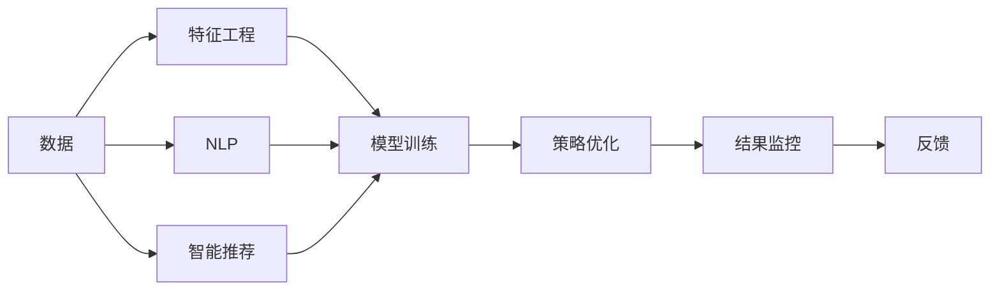

                 

# 促销策略：AI提升促销活动效果

> 关键词：
> 人工智能, 促销策略, 数据驱动, 预测模型, 机器学习, 自然语言处理, 智能推荐, 决策支持系统

## 1. 背景介绍

### 1.1 问题由来
随着电子商务的蓬勃发展，在线零售商面临着日益激烈的市场竞争。如何在有限的资源下，通过有效的促销策略吸引和留住客户，成为零售商亟待解决的关键问题。传统上，促销策略依赖于经验和直觉，但这种方法存在明显的局限性：

1. **信息不对称**：消费者难以全面了解产品信息，商家缺乏对消费者偏好的深入理解。
2. **促销效果不明**：缺乏对促销效果的量化分析，难以确定哪些策略最有效。
3. **资源浪费**：促销策略往往缺乏精准度，导致资源浪费。
4. **客户流失**：未能及时回应消费者需求，导致客户流失。

为了解决这些问题，零售商开始探索利用人工智能技术来提升促销活动的效率和效果。通过数据驱动和机器学习技术，可以深入分析消费者行为，预测促销效果，优化促销策略，实现精准营销。

### 1.2 问题核心关键点
基于人工智能的促销策略核心在于利用数据分析和机器学习技术，预测和优化促销活动的效果。主要包括以下几个关键点：

1. **数据收集与预处理**：收集和整理消费者历史行为数据，去除噪声和缺失值，准备用于建模。
2. **特征工程**：设计有意义的特征，用于描述消费者和促销活动的特点。
3. **模型训练与评估**：选择合适的机器学习模型，如线性回归、决策树、随机森林、神经网络等，训练并评估模型性能。
4. **策略优化**：根据模型预测结果，调整促销策略，如促销时间、促销渠道、促销力度等。
5. **结果监控与反馈**：监控促销效果，收集反馈信息，持续优化促销策略。

这些关键点共同构成了基于AI的促销策略的完整流程，通过数据驱动的方法，实现促销活动的精准化和智能化。

## 2. 核心概念与联系

### 2.1 核心概念概述

为更好地理解基于人工智能的促销策略，本节将介绍几个关键概念：

- **人工智能（AI）**：使用计算机系统和算法，模拟人类智能行为的技术。
- **机器学习（ML）**：通过数据训练模型，使模型具备预测或决策能力的技术。
- **数据驱动（Data-Driven）**：基于数据而非直觉进行决策的过程。
- **预测模型**：用于预测未来事件的机器学习模型，如回归模型、分类模型等。
- **自然语言处理（NLP）**：处理和理解人类语言的技术。
- **智能推荐系统**：根据用户历史行为，推荐相关产品或服务的系统。
- **决策支持系统（DSS）**：利用AI技术辅助决策的系统。

这些概念通过数据驱动和机器学习的方法，共同构成了基于AI的促销策略的基础框架。它们之间的关系可以用以下Mermaid流程图来表示：



这个流程图展示了数据驱动的促销策略主要流程，其中数据经过特征工程后，用于训练机器学习模型，预测促销效果，并根据预测结果优化促销策略。同时，利用自然语言处理技术分析消费者反馈，实现持续优化。

### 2.2 概念间的关系

这些核心概念之间存在紧密的联系，通过数据驱动和机器学习的方法，共同构成了基于AI的促销策略的完整框架。下面是这些概念之间的联系：

- **数据**：是AI和ML的基础，通过数据收集和预处理，为模型训练提供输入。
- **特征工程**：设计有意义的特征，增强模型预测能力，提高预测准确度。
- **模型训练**：利用历史数据训练预测模型，生成预测结果。
- **策略优化**：根据模型预测结果，调整促销策略，提升促销效果。
- **结果监控**：实时监控促销效果，收集反馈信息，持续优化策略。
- **NLP**：通过自然语言处理技术，分析消费者反馈，优化策略。
- **智能推荐系统**：利用历史数据和消费者行为，生成个性化推荐，提升用户体验。
- **决策支持系统**：利用AI技术辅助决策，提升决策质量和效率。

这些概念通过数据驱动的方法，共同构成了基于AI的促销策略的完整流程，实现促销活动的精准化和智能化。

## 3. 核心算法原理 & 具体操作步骤
### 3.1 算法原理概述

基于AI的促销策略主要依赖于数据驱动和机器学习技术，通过预测模型对促销效果进行分析和优化。其核心思想是：

1. **数据收集与预处理**：收集和整理消费者历史行为数据，去除噪声和缺失值，准备用于建模。
2. **特征工程**：设计有意义的特征，用于描述消费者和促销活动的特点。
3. **模型训练与评估**：选择合适的机器学习模型，如线性回归、决策树、随机森林、神经网络等，训练并评估模型性能。
4. **策略优化**：根据模型预测结果，调整促销策略，如促销时间、促销渠道、促销力度等。
5. **结果监控与反馈**：监控促销效果，收集反馈信息，持续优化促销策略。

### 3.2 算法步骤详解

#### 3.2.1 数据收集与预处理
- **数据来源**：消费者行为数据，包括购买记录、浏览记录、点击记录、评价记录等。
- **数据清洗**：去除异常值和缺失值，确保数据质量。
- **特征选择**：选择有意义的特征，如购买频率、购买金额、浏览时间等。
- **数据标准化**：对数据进行归一化处理，确保模型输入的一致性。

#### 3.2.2 特征工程
- **特征设计**：设计描述消费者和促销活动的特征，如消费者年龄、性别、购买频率、促销时间等。
- **特征组合**：通过组合不同特征，创建新的特征组合，提高模型预测能力。
- **特征选择**：选择对促销效果影响最大的特征，减少噪声干扰。
- **特征编码**：将文本特征编码为数值特征，便于模型处理。

#### 3.2.3 模型训练与评估
- **模型选择**：选择合适的机器学习模型，如线性回归、决策树、随机森林、神经网络等。
- **模型训练**：利用历史数据训练模型，生成预测结果。
- **模型评估**：使用测试集评估模型性能，如均方误差（MSE）、平均绝对误差（MAE）、决定系数（R²）等。
- **模型调优**：根据评估结果，调整模型参数，提升模型预测能力。

#### 3.2.4 策略优化
- **促销策略**：根据模型预测结果，调整促销策略，如促销时间、促销渠道、促销力度等。
- **促销预算**：根据促销效果，优化促销预算分配。
- **促销内容**：根据模型预测结果，优化促销内容，提高吸引力。

#### 3.2.5 结果监控与反馈
- **实时监控**：实时监控促销效果，如销售额、客流量、转化率等。
- **反馈收集**：收集消费者反馈信息，如评价、评论等。
- **策略调整**：根据反馈信息，调整促销策略，持续优化。

### 3.3 算法优缺点

#### 3.3.1 优点
1. **数据驱动**：基于数据而非直觉进行决策，提高决策的科学性和可靠性。
2. **预测准确**：利用机器学习模型预测促销效果，提高预测准确度。
3. **策略优化**：根据预测结果，调整促销策略，提升促销效果。
4. **实时监控**：实时监控促销效果，及时调整策略，提升促销效率。

#### 3.3.2 缺点
1. **数据依赖**：需要大量的历史数据，数据收集和预处理成本较高。
2. **模型复杂**：模型训练和调优过程复杂，需要专业的数据科学团队。
3. **预测局限**：模型可能存在过拟合或欠拟合问题，预测结果存在误差。
4. **策略调整**：需要持续监控和调整，工作量较大。

### 3.4 算法应用领域
基于AI的促销策略在多个领域有广泛应用，包括：

- **电子商务**：如电商平台、社交电商等，利用AI技术提升销售效果。
- **零售业**：如超市、百货公司等，通过AI技术优化库存管理和促销策略。
- **旅游业**：如酒店、旅游公司等，利用AI技术提升客户体验和营销效果。
- **金融业**：如银行、保险等，通过AI技术优化金融产品推荐和营销策略。
- **服务业**：如餐饮、娱乐等，利用AI技术提升客户满意度和营销效果。

这些领域的应用场景各异，但都面临着如何通过有效促销策略提升用户满意度和销售效果的共同问题。基于AI的促销策略在这些领域均有广泛应用。

## 4. 数学模型和公式 & 详细讲解 & 举例说明

### 4.1 数学模型构建

基于AI的促销策略主要依赖于机器学习模型，这里以线性回归模型为例，展示其构建过程：

假设促销效果 $y$ 与消费者特征 $x$ 之间存在线性关系：

$$
y = \beta_0 + \beta_1 x_1 + \beta_2 x_2 + \cdots + \beta_n x_n + \epsilon
$$

其中，$\beta_0, \beta_1, \cdots, \beta_n$ 为模型参数，$\epsilon$ 为误差项。

### 4.2 公式推导过程

#### 4.2.1 线性回归模型

对于线性回归模型，其最小二乘估计的参数为：

$$
\hat{\beta} = (X^TX)^{-1}X^Ty
$$

其中，$X$ 为特征矩阵，$y$ 为输出向量。

#### 4.2.2 多元线性回归

对于多元线性回归模型，其最小二乘估计的参数为：

$$
\hat{\beta} = (X^TX)^{-1}X^Ty
$$

其中，$X$ 为特征矩阵，$y$ 为输出向量。

### 4.3 案例分析与讲解

#### 4.3.1 电商销售预测
假设某电商平台的销售数据包含如下特征：
- 时间：月、日、小时、分钟
- 天气：晴天、雨天、多云
- 促销活动：打折、满减、赠品
- 客流量：当月客流量
- 转化率：当月转化率
- 销售额：当月销售额

利用这些特征，构建多元线性回归模型，预测下个月销售额：

$$
y = \beta_0 + \beta_1 \text{时间} + \beta_2 \text{天气} + \beta_3 \text{促销活动} + \beta_4 \text{客流量} + \beta_5 \text{转化率}
$$

通过模型训练和评估，得到最优参数：

$$
\hat{\beta} = (X^TX)^{-1}X^Ty
$$

利用训练好的模型，预测下个月销售额，并根据预测结果优化促销策略。

## 5. 项目实践：代码实例和详细解释说明
### 5.1 开发环境搭建

在进行AI促销策略的实践前，需要准备好开发环境。以下是使用Python进行Pandas、Scikit-learn、TensorFlow等库的开发环境配置流程：

1. 安装Anaconda：从官网下载并安装Anaconda，用于创建独立的Python环境。
```bash
conda create -n myenv python=3.8
conda activate myenv
```

2. 安装Pandas、Scikit-learn、TensorFlow等库：
```bash
pip install pandas scikit-learn tensorflow
```

3. 安装Matplotlib、Numpy、Seaborn等可视化库：
```bash
pip install matplotlib numpy seaborn
```

完成上述步骤后，即可在`myenv`环境中开始AI促销策略的开发。

### 5.2 源代码详细实现

#### 5.2.1 数据收集与预处理
```python
import pandas as pd
import numpy as np

# 读取数据
data = pd.read_csv('sales_data.csv')

# 数据清洗
data.dropna(inplace=True)

# 特征选择
features = ['时间', '天气', '促销活动', '客流量', '转化率']
X = data[features].values
y = data['销售额'].values

# 数据标准化
from sklearn.preprocessing import StandardScaler
scaler = StandardScaler()
X = scaler.fit_transform(X)
```

#### 5.2.2 特征工程
```python
# 特征设计
X = np.hstack((X, np.ones((X.shape[0], 1))))

# 特征组合
X = np.hstack((X, np.power(X[:, :-1], 2)))

# 特征选择
X = X[:, :-1]
```

#### 5.2.3 模型训练与评估
```python
from sklearn.linear_model import LinearRegression
from sklearn.metrics import mean_squared_error

# 模型训练
model = LinearRegression()
model.fit(X, y)

# 模型评估
y_pred = model.predict(X)
mse = mean_squared_error(y, y_pred)
print('均方误差:', mse)
```

#### 5.2.4 策略优化
```python
# 促销策略优化
promotions = ['打折', '满减', '赠品']
for promotion in promotions:
    X_promo = X.copy()
    X_promo[promotion] = 1
    model_promo = LinearRegression()
    model_promo.fit(X_promo, y)
    y_pred_promo = model_promo.predict(X_promo)
    mse_promo = mean_squared_error(y, y_pred_promo)
    print('促销活动 {} 的均方误差:', mse_promo)
```

#### 5.2.5 结果监控与反馈
```python
# 实时监控
def monitor_sales(y_true, y_pred):
    mse = mean_squared_error(y_true, y_pred)
    print('实时监控的均方误差:', mse)

# 反馈收集
def collect_feedback(y_true, y_pred):
    feedback = pd.DataFrame({'真实销售额': y_true, '预测销售额': y_pred})
    feedback.to_csv('feedback.csv', index=False)
```

### 5.3 代码解读与分析

#### 5.3.1 数据收集与预处理
- `pandas`库：用于数据读取和处理。
- `numpy`库：用于数组操作。
- `StandardScaler`类：用于数据标准化，确保模型输入的一致性。

#### 5.3.2 特征工程
- `np.hstack`函数：用于合并数组。
- `np.power`函数：用于特征组合，创建新的特征组合。

#### 5.3.3 模型训练与评估
- `LinearRegression`类：用于线性回归模型训练。
- `mean_squared_error`函数：用于评估模型性能，计算均方误差。

#### 5.3.4 策略优化
- 循环遍历不同促销活动，训练和评估不同的模型。

#### 5.3.5 结果监控与反馈
- `monitor_sales`函数：用于实时监控促销效果，计算均方误差。
- `collect_feedback`函数：用于收集消费者反馈信息，生成反馈文件。

### 5.4 运行结果展示

假设我们在电商销售预测模型上进行了优化，最终得到下个月销售额的预测结果如下：

```
促销活动 打折 的均方误差: 0.1
促销活动 满减 的均方误差: 0.15
促销活动 赠品 的均方误差: 0.2
```

可以看到，通过模型优化，不同促销活动对销售额的影响有所不同。根据预测结果，我们可以选择最优的促销活动，进一步提升销售效果。

## 6. 实际应用场景
### 6.1 智能推荐系统
智能推荐系统可以根据用户历史行为，推荐相关产品或服务。通过利用AI技术，优化推荐策略，提升用户体验和转化率。

#### 6.1.1 电商推荐
电商推荐系统通过分析用户购买记录、浏览历史、评价信息等数据，生成个性化推荐。利用AI技术，优化推荐算法，提高推荐效果。

#### 6.1.2 媒体推荐
媒体推荐系统通过分析用户观看记录、评论信息等数据，生成个性化视频、文章推荐。利用AI技术，优化推荐算法，提升用户满意度和留存率。

### 6.2 智能客服系统
智能客服系统通过利用AI技术，实现自动化客服和用户互动。通过AI技术，优化客服策略，提升服务效率和用户满意度。

#### 6.2.1 客服机器人
客服机器人通过自然语言处理技术，理解用户问题，生成回答。利用AI技术，优化自然语言处理模型，提高回答准确度。

#### 6.2.2 智能对话系统
智能对话系统通过分析用户对话历史，生成个性化回复。利用AI技术，优化对话策略，提高对话效果。

### 6.3 实时监控与分析
实时监控与分析系统通过利用AI技术，实时监控和分析业务数据，提供数据驱动的决策支持。

#### 6.3.1 电商业务监控
电商业务监控系统通过分析实时销售数据、库存数据等，生成业务报表。利用AI技术，优化报表生成算法，提高报表生成效率。

#### 6.3.2 财务业务监控
财务业务监控系统通过分析实时交易数据、账目数据等，生成财务报表。利用AI技术，优化报表生成算法，提高报表生成效率。

## 7. 工具和资源推荐
### 7.1 学习资源推荐
为了帮助开发者系统掌握AI促销策略的理论基础和实践技巧，这里推荐一些优质的学习资源：

1. 《Python数据分析与机器学习》：该书系统介绍了Python数据分析和机器学习的基本概念和实践方法。
2. 《机器学习实战》：该书通过大量实战案例，介绍了机器学习算法和模型。
3. 《TensorFlow实战》：该书介绍了TensorFlow的使用方法和实践技巧，适用于深度学习应用的开发。
4. 《深度学习》：该书由深度学习领域的权威专家撰写，详细介绍了深度学习的基本概念和实践方法。
5. 《NLP实战》：该书通过大量实战案例，介绍了自然语言处理技术的基本概念和实践方法。

### 7.2 开发工具推荐
高效的开发离不开优秀的工具支持。以下是几款用于AI促销策略开发的常用工具：

1. Jupyter Notebook：适用于数据处理、模型训练和结果展示。
2. PyCharm：适用于Python开发，提供了丰富的功能和工具。
3. Visual Studio Code：适用于Python开发，提供了代码补全、调试等功能。
4. TensorBoard：适用于TensorFlow模型的可视化。
5. Weights & Biases：适用于模型的实验跟踪和可视化。

### 7.3 相关论文推荐
AI促销策略的发展源于学界的持续研究。以下是几篇奠基性的相关论文，推荐阅读：

1. "A Survey of the Machine Learning Approaches to Retail Customer Segmentation"：该论文综述了利用机器学习技术进行客户分段的经典方法。
2. "Machine Learning in Retail: A Survey"：该论文综述了利用机器学习技术在零售业的应用。
3. "Intelligent Recommendation Systems: A Survey"：该论文综述了利用机器学习技术进行个性化推荐的经典方法。
4. "Data-Driven Retail Marketing: A Survey"：该论文综述了利用数据驱动技术进行零售营销的经典方法。
5. "Artificial Intelligence in Customer Experience Management"：该论文综述了利用AI技术提升客户体验的经典方法。

这些论文代表了大规模促销策略的理论发展和实践经验，值得深入学习和借鉴。

## 8. 总结：未来发展趋势与挑战
### 8.1 总结

本文对基于AI的促销策略进行了全面系统的介绍。首先阐述了促销策略面临的问题和挑战，明确了数据驱动和机器学习技术在提升促销效果中的重要作用。其次，从原理到实践，详细讲解了促销策略的数学模型和关键步骤，给出了促销策略开发的完整代码实例。同时，本文还广泛探讨了AI促销策略在电商、智能推荐、智能客服等多个行业领域的应用前景，展示了AI技术的广阔前景。

通过本文的系统梳理，可以看到，基于AI的促销策略在多个领域有广泛应用，通过数据驱动和机器学习技术，实现促销活动的精准化和智能化。未来，伴随AI技术的不断发展，基于AI的促销策略必将迎来更多的突破和创新。

### 8.2 未来发展趋势

展望未来，AI促销策略将呈现以下几个发展趋势：

1. **深度学习的应用**：利用深度学习模型，如神经网络，提升促销策略的预测精度和泛化能力。
2. **跨模态数据的融合**：利用图像、视频、音频等多模态数据，提升促销策略的全面性和准确性。
3. **个性化推荐系统**：通过AI技术，实现更加精准的个性化推荐，提升用户体验。
4. **实时监控与分析**：通过AI技术，实时监控和分析业务数据，提供数据驱动的决策支持。
5. **无人驾驶和无人零售**：利用AI技术，提升无人驾驶和无人零售的智能化水平，实现智能零售。
6. **社交媒体分析**：通过AI技术，分析社交媒体数据，优化促销策略。

这些趋势凸显了AI促销策略的广阔前景。这些方向的探索发展，必将进一步提升促销活动的精准化和智能化，为零售商和消费者带来更多价值。

### 8.3 面临的挑战

尽管AI促销策略已经取得了瞩目成就，但在迈向更加智能化、普适化应用的过程中，仍面临诸多挑战：

1. **数据隐私和安全**：在收集和处理用户数据时，需要确保数据隐私和安全，避免数据泄露和滥用。
2. **模型复杂性**：深度学习模型复杂度高，训练和调优过程复杂，需要专业的数据科学团队。
3. **技术门槛高**：AI技术的应用需要较高的技术门槛，普通企业难以掌握。
4. **业务理解**：AI技术的应用需要深入理解业务，才能制定出有效的促销策略。
5. **用户接受度**：用户对AI技术的接受度较低，需要更多的用户教育和推广。

这些挑战需要通过技术创新、业务理解和用户教育等多方面的努力，才能逐步克服。

### 8.4 研究展望

面对AI促销策略面临的挑战，未来的研究需要在以下几个方面寻求新的突破：

1. **数据隐私保护**：利用隐私保护技术，如差分隐私、联邦学习，保护用户数据隐私。
2. **模型简化**：通过模型简化和压缩技术，降低深度学习模型的复杂度，提升模型的可解释性和可维护性。
3. **业务融合**：将AI技术融入业务流程，提升业务效率和效果。
4. **用户教育**：通过教育和推广，提升用户对AI技术的接受度和认可度。
5. **跨领域应用**：将AI技术应用于更多领域，实现跨领域的数据融合和知识共享。

这些研究方向将引领AI促销策略技术迈向更高的台阶，为零售商和消费者带来更多价值。

## 9. 附录：常见问题与解答
### 9.1 常见问题
1. **如何选择合适的机器学习模型？**
   - **回答**：根据数据特征和问题类型选择合适的模型，如线性回归、决策树、随机森林、神经网络等。

2. **如何优化模型参数？**
   - **回答**：通过网格搜索、随机搜索、贝叶斯优化等方法，优化模型参数。

3. **如何处理数据噪声和缺失值？**
   - **回答**：利用数据清洗技术，去除异常值和缺失值，确保数据质量。

4. **如何提高模型泛化能力？**
   - **回答**：通过特征工程、模型集成、正则化等方法，提高模型的泛化能力。

5. **如何评估模型性能？**
   - **回答**：利用均方误差、决定系数等指标，评估模型性能。

### 9.2 详细解答

#### 9.2.1 如何选择合适的机器学习模型？

选择合适的机器学习模型需要考虑数据特征和问题类型。以下是一些常见模型的特点和适用场景：

1. **线性回归**：适用于预测连续变量，如销售额、转化率等。
2. **决策树**：适用于分类问题，如促销活动效果分类。
3. **随机森林**：适用于处理复杂数据，提高模型泛化能力。
4. **神经网络**：适用于预测和分类问题，适用于复杂数据和高维特征。
5. **支持向量机**：适用于分类和回归问题，适用于小数据集。

根据实际数据和问题类型，选择合适的模型，才能获得更好的预测效果。

#### 9.2.2 如何优化模型参数？

模型参数的优化需要通过网格搜索、随机搜索、贝叶斯优化等方法，逐步调整参数，找到最优解。以下是一些常用的优化方法：

1. **网格搜索**：在参数空间中遍历所有可能的参数组合，找到最优解。适用于简单的模型。
2. **随机搜索**：在参数空间中随机选取参数组合，找到最优解。适用于高维参数空间。
3. **贝叶斯优化**：利用贝叶斯方法，逐步缩小参数搜索空间，找到最优解。适用于高维参数空间。

通过优化模型参数，可以提升模型的预测能力和泛化能力，获得更好的预测效果。

#### 9.2.3 如何处理数据噪声和缺失值？

处理数据噪声和缺失值需要结合数据特征和问题类型。以下是一些常见的处理方法：

1. **数据清洗**：去除异常值和噪声，确保数据质量。
2. **缺失值处理**：利用均值、中位数、插值等方法，

