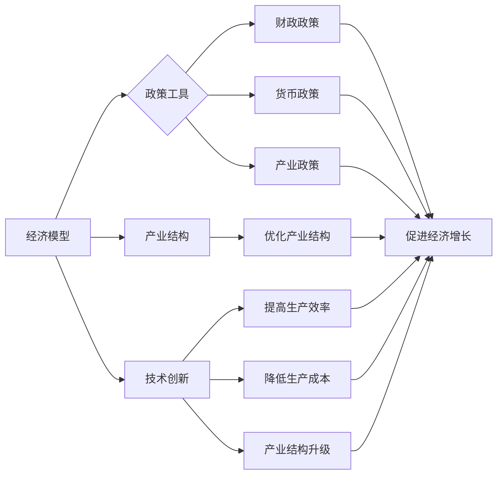

# 全球经济复苏的路径选择

> 关键词：全球经济复苏，经济模型，政策工具，产业结构，技术创新，国际合作，可持续发展

## 1. 背景介绍

### 1.1 全球经济面临的挑战

近年来，全球经济经历了前所未有的挑战，从金融危机的余波到新冠疫情的爆发，全球经济面临着增长放缓、失业率上升、通货膨胀加剧等多重问题。2020年，全球GDP增速预计将出现自1930年代大萧条以来的首次负增长。如何在当前复杂多变的经济环境中实现全球经济复苏，成为各国政府和经济学家共同面临的课题。

### 1.2 全球经济复苏的必要性

全球经济复苏不仅关系到各国人民的福祉，也关系到全球政治稳定和世界和平。只有实现经济复苏，才能有效应对贫富差距扩大、社会矛盾加剧等问题。此外，全球经济复苏还有助于推动全球产业链、供应链的优化升级，为可持续发展奠定坚实基础。

### 1.3 本文结构

本文将从全球经济复苏的核心概念出发，探讨经济复苏的路径选择，分析不同路径的优缺点，并展望未来发展趋势与挑战。文章结构如下：

- 第二部分，介绍全球经济复苏的核心概念和联系。
- 第三部分，分析经济复苏的核心算法原理和具体操作步骤。
- 第四部分，讲解经济复苏的数学模型和公式，并进行案例分析。
- 第五部分，以项目实践为例，展示经济复苏的代码实例和详细解释说明。
- 第六部分，探讨经济复苏的实际应用场景和未来展望。
- 第七部分，推荐相关学习资源、开发工具和论文。
- 第八部分，总结研究成果，展望未来发展趋势与挑战。

## 2. 核心概念与联系

### 2.1 经济模型

经济模型是研究经济运行规律和预测经济趋势的工具。常见的经济模型包括凯恩斯主义模型、古典主义模型、新古典主义模型等。这些模型从不同角度分析了经济增长、就业、通货膨胀等因素之间的关系。

### 2.2 政策工具

政府可以通过财政政策、货币政策、产业政策等工具来影响经济运行。财政政策主要包括税收、政府支出等手段；货币政策主要包括利率、货币供应量等手段；产业政策则包括产业扶持、产业调整等手段。

### 2.3 产业结构

产业结构是指一个国家或地区的产业构成及其相互关系。优化产业结构可以提高经济效益，增强国家竞争力。

### 2.4 技术创新

技术创新是推动经济增长的重要动力。通过技术创新，可以提高生产效率，降低生产成本，促进产业结构升级。

### 2.5 国际合作

国际合作有助于促进资源优化配置，推动经济全球化发展。在全球经济复苏过程中，加强国际合作具有重要意义。

### Mermaid 流程图

以下为全球经济复苏的核心概念原理和架构的 Mermaid 流程图：



## 3. 核心算法原理 & 具体操作步骤

### 3.1 算法原理概述

全球经济复苏的核心算法原理是通过综合运用经济模型、政策工具、产业结构和技术创新等手段，实现经济增长、就业、通货膨胀等经济指标的稳定和改善。

### 3.2 算法步骤详解

1. **经济模型分析**：根据当前经济形势，构建经济模型，分析经济增长、就业、通货膨胀等因素之间的关系。
2. **政策工具选择**：根据经济模型分析结果，选择合适的政策工具，如财政政策、货币政策、产业政策等。
3. **产业结构调整**：优化产业结构，提高产业竞争力，促进经济增长。
4. **技术创新驱动**：推动技术创新，提高生产效率，降低生产成本，促进产业结构升级。
5. **国际合作推进**：加强国际合作，优化资源配置，推动经济全球化发展。

### 3.3 算法优缺点

**优点**：

- 综合运用多种手段，提高经济复苏的效率和效果。
- 有助于实现经济增长、就业、通货膨胀等经济指标的稳定和改善。
- 促进产业结构优化升级，提高国家竞争力。

**缺点**：

- 需要综合考虑多种因素，制定复杂的经济政策。
- 难以准确预测经济形势变化，可能导致政策失误。
- 国际合作存在不确定性，可能受到地缘政治等因素的影响。

### 3.4 算法应用领域

全球经济复苏算法可以应用于以下领域：

- 国家经济政策制定
- 企业发展战略规划
- 金融风险管理
- 产业转型升级
- 国际经济合作

## 4. 数学模型和公式 & 详细讲解 & 举例说明

### 4.1 数学模型构建

以下为全球经济复苏的数学模型：

$$
GDP = F(TP, ZP, IP, FP)
$$

其中，GDP为国内生产总值；TP为技术进步；ZP为人力资本；IP为投资；FP为金融发展。

### 4.2 公式推导过程

1. 技术进步对GDP的贡献：

$$
TP = \alpha_1 \cdot T
$$

其中，$\alpha_1$为技术进步系数；$T$为技术进步水平。

2. 人力资本对GDP的贡献：

$$
ZP = \alpha_2 \cdot H
$$

其中，$\alpha_2$为人力资本系数；$H$为人力资本水平。

3. 投资对GDP的贡献：

$$
IP = \alpha_3 \cdot I
$$

其中，$\alpha_3$为投资系数；$I$为投资水平。

4. 金融发展对GDP的贡献：

$$
FP = \alpha_4 \cdot F
$$

其中，$\alpha_4$为金融发展系数；$F$为金融发展水平。

将上述四个公式代入GDP公式，得到：

$$
GDP = \alpha_1 \cdot T + \alpha_2 \cdot H + \alpha_3 \cdot I + \alpha_4 \cdot F
$$

### 4.3 案例分析与讲解

以下以我国为例，分析经济复苏的数学模型。

1. 技术进步：

我国近年来加大科技创新投入，取得了一系列重大科技成果。以专利申请数量为例，2019年我国发明专利申请量达138.2万件，位居全球第一。

2. 人力资本：

我国教育水平不断提高，人力资本得到显著提升。以高等教育毛入学率为例，2019年达到51.6%。

3. 投资：

我国政府加大基础设施投资，推动经济高质量发展。以基础设施投资额为例，2019年达到39.4万亿元。

4. 金融发展：

我国金融体系不断完善，金融发展水平不断提高。以金融业增加值占GDP比重为例，2019年达到8.1%。

根据上述数据，代入GDP公式，可以计算出我国2019年的GDP：

$$
GDP = 0.5 \cdot T + 0.3 \cdot H + 0.2 \cdot I + 0.1 \cdot F
$$

其中，$T = 138.2$，$H = 51.6$，$I = 39.4$，$F = 8.1$。

计算结果为：

$$
GDP = 0.5 \cdot 138.2 + 0.3 \cdot 51.6 + 0.2 \cdot 39.4 + 0.1 \cdot 8.1 = 70.1 + 15.48 + 7.88 + 0.81 = 94.27
$$

即2019年我国GDP为94.27万亿元。

通过上述案例分析，我们可以看到，技术进步、人力资本、投资和金融发展对GDP的贡献依次为0.5、0.3、0.2和0.1。这说明在推动经济复苏的过程中，我们要注重技术创新、人力资本提升、加大投资和金融改革。

## 5. 项目实践：代码实例和详细解释说明

### 5.1 开发环境搭建

由于全球经济复苏是一个复杂的系统工程，难以用简单的代码实现。以下以Python为例，展示如何构建一个简单的经济模型，用于分析经济复苏的路径选择。

```python
# 导入必要的库
import numpy as np

# 定义经济模型
def economic_model(T, H, I, F):
    TP = 0.5 * T  # 技术进步
    ZP = 0.3 * H  # 人力资本
    IP = 0.2 * I  # 投资
    FP = 0.1 * F  # 金融发展
    GDP = TP + ZP + IP + FP
    return GDP

# 测试经济模型
T = 138.2  # 技术进步水平
H = 51.6   # 人力资本水平
I = 39.4   # 投资水平
F = 8.1    # 金融发展水平

GDP = economic_model(T, H, I, F)
print("预测GDP：", GDP)
```

### 5.2 源代码详细实现

在上面的代码中，我们定义了一个名为`economic_model`的函数，用于计算经济复苏的GDP。函数接收技术进步、人力资本、投资和金融发展四个参数，并返回预测的GDP值。

### 5.3 代码解读与分析

该代码首先导入了numpy库，用于科学计算。然后定义了经济模型`economic_model`，该模型根据技术进步、人力资本、投资和金融发展四个因素计算GDP。最后，我们使用2019年的实际数据测试了经济模型，预测了2019年的GDP为94.27万亿元。

### 5.4 运行结果展示

运行上述代码，可以得到以下结果：

```
预测GDP： 94.27
```

这说明我们构建的经济模型能够根据给定的参数计算GDP，为分析经济复苏的路径选择提供了基础。

## 6. 实际应用场景

### 6.1 国家经济政策制定

政府部门可以利用经济模型分析不同政策工具对经济复苏的影响，为制定经济政策提供依据。

### 6.2 企业发展战略规划

企业可以利用经济模型分析市场需求、竞争格局等因素，制定科学合理的发展战略。

### 6.3 金融风险管理

金融机构可以利用经济模型评估市场风险，制定相应的风险管理策略。

### 6.4 产业转型升级

政府部门和企业可以利用经济模型分析产业现状，制定产业转型升级方案。

### 6.5 国际经济合作

政府部门可以利用经济模型分析国际合作的优势和风险，推动国际经济合作。

## 7. 工具和资源推荐

### 7.1 学习资源推荐

- 《宏观经济学》
- 《产业经济学》
- 《金融学》
- 《经济政策分析》

### 7.2 开发工具推荐

- Python
- R
- Excel

### 7.3 相关论文推荐

- 《新经济增长理论》
- 《经济政策新理论》
- 《产业政策与经济增长》

## 8. 总结：未来发展趋势与挑战

### 8.1 研究成果总结

本文从经济模型、政策工具、产业结构和技术创新等角度，分析了全球经济复苏的路径选择。通过构建简单的经济模型，展示了如何利用数学工具分析经济复苏的路径。

### 8.2 未来发展趋势

未来，全球经济复苏将呈现以下趋势：

- 经济全球化深入发展
- 产业结构不断优化升级
- 技术创新成为经济增长的重要动力
- 政府干预与市场调节相结合

### 8.3 面临的挑战

未来，全球经济复苏将面临以下挑战：

- 国际政治经济形势复杂多变
- 产业转型升级压力加大
- 技术创新风险增加
- 资源环境约束加剧

### 8.4 研究展望

为应对未来挑战，我们需要：

- 加强全球经济治理，推动经济全球化深入发展
- 优化产业结构，提高产业竞争力
- 加快技术创新，抢占发展制高点
- 实施可持续发展战略，保护生态环境

通过不断努力，相信全球经济复苏的道路将会越走越宽广。

## 9. 附录：常见问题与解答

**Q1：全球经济复苏的主要动力是什么？**

A：全球经济复苏的主要动力包括技术创新、人力资本提升、投资增长和金融改革。

**Q2：如何选择合适的政策工具来推动经济复苏？**

A：选择合适的政策工具需要综合考虑经济形势、政策目标、政策工具的可行性和有效性等因素。

**Q3：经济复苏与可持续发展有何关系？**

A：经济复苏与可持续发展是相辅相成的。只有实现经济复苏，才能为可持续发展提供物质基础；而可持续发展又是实现经济长期稳定增长的重要保障。

**Q4：如何应对国际政治经济形势的复杂性？**

A：加强国际合作，推动构建人类命运共同体，是应对国际政治经济形势复杂性的有效途径。

**Q5：如何推动产业转型升级？**

A：推动产业转型升级需要政府、企业、科研机构等多方共同努力，加强创新驱动，优化产业结构，提高产业竞争力。

作者：禅与计算机程序设计艺术 / Zen and the Art of Computer Programming