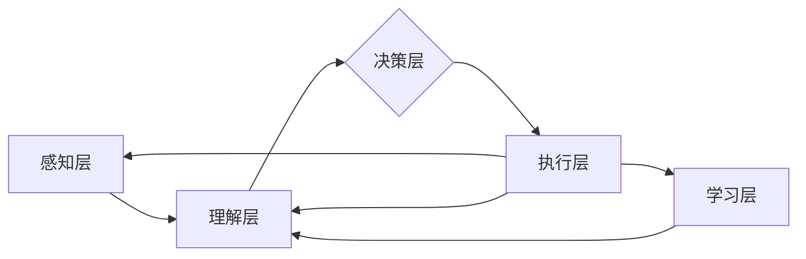

# AI Agent: AI的下一个风口 如何改变用户体验

> 关键词：AI Agent，智能代理，用户体验，自然语言处理，机器学习，对话系统，人机交互

## 1. 背景介绍

随着人工智能技术的飞速发展，我们正处在一个被AI重塑的世界。从智能家居到自动驾驶，从智能客服到个性化推荐，AI的应用已经渗透到我们生活的方方面面。然而，尽管AI技术日益成熟，但用户体验的提升却并未同步跟上。本文将探讨AI Agent——AI的下一个风口，以及它如何通过改变用户体验，引领技术变革。

### 1.1 问题的由来

在过去的几十年里，用户体验（UX）设计一直是软件和产品开发的核心关注点。然而，随着AI技术的引入，传统的用户体验设计面临着新的挑战：

- **复杂性增加**：AI系统通常涉及复杂的算法和模型，难以用传统的界面设计方法来直观地呈现。
- **交互方式变化**：从点击到语音，从触摸到手势，AI技术带来了更加多样化的交互方式，对用户体验设计提出了新的要求。
- **决策过程透明度不足**：AI系统的决策过程往往难以解释，导致用户对系统的信任度降低。

### 1.2 研究现状

为了解决上述问题，AI Agent作为一种新兴的AI应用范式，逐渐成为学术界和产业界的研究热点。AI Agent是一种能够模拟人类智能行为，执行特定任务的软件实体。它不仅能够理解用户的需求，还能够自主地采取行动，从而提供更加个性化、高效的用户体验。

### 1.3 研究意义

AI Agent的研究和应用对于提升用户体验具有重要意义：

- **个性化服务**：AI Agent可以根据用户的行为和偏好，提供定制化的服务，满足用户的个性化需求。
- **交互自然化**：通过自然语言处理和语音识别技术，AI Agent可以与用户进行更加自然、流畅的交互。
- **提升效率**：AI Agent可以自动处理重复性任务，提高工作效率，释放用户的时间。
- **增强安全性**：AI Agent可以监控和预测潜在的安全风险，提前采取预防措施。

### 1.4 本文结构

本文将围绕AI Agent展开，探讨其核心概念、算法原理、应用场景、未来发展等各个方面。具体结构如下：

- **第2章**：介绍AI Agent的核心概念与联系，包括其定义、功能和架构。
- **第3章**：深入探讨AI Agent的核心算法原理，包括自然语言处理、机器学习和人机交互等关键技术。
- **第4章**：分析AI Agent的数学模型和公式，并举例说明其在实际应用中的实现。
- **第5章**：通过项目实践，展示AI Agent的代码实例和实现细节。
- **第6章**：探讨AI Agent的实际应用场景，包括智能客服、智能家居、教育、医疗等领域。
- **第7章**：推荐AI Agent相关学习资源、开发工具和参考文献。
- **第8章**：总结AI Agent的未来发展趋势与挑战。
- **第9章**：附录，包含常见问题与解答。

## 2. 核心概念与联系

### 2.1 核心概念

#### 2.1.1 AI Agent的定义

AI Agent是一种模拟人类智能行为的软件实体，它能够感知环境、理解用户意图、执行任务，并与其他实体进行交互。

#### 2.1.2 AI Agent的功能

- **感知**：通过传感器收集环境信息。
- **理解**：理解用户的意图和需求。
- **决策**：根据收集到的信息和已知的规则，做出决策。
- **行动**：执行决策，采取行动。
- **交互**：与其他实体（如用户、其他AI Agent）进行交互。

#### 2.1.3 AI Agent的架构

AI Agent的架构通常包括以下几个部分：

- **感知层**：负责收集环境信息，如传感器数据、用户输入等。
- **理解层**：负责处理感知层收集到的信息，提取有用特征，进行语义理解。
- **决策层**：根据理解层提供的信息，结合已有的知识库和决策模型，生成决策。
- **执行层**：负责执行决策层生成的决策，如控制机器人执行动作、与用户进行交互等。
- **学习层**：通过机器学习技术，不断学习新的知识和技能，提高Agent的智能水平。

### 2.2 Mermaid 流程图

以下是AI Agent的Mermaid流程图：



### 2.3 核心概念联系

AI Agent的核心概念之间相互联系，形成一个紧密的生态系统。感知层和执行层是AI Agent与外部环境交互的桥梁，理解层和决策层是AI Agent的智能核心，而学习层则是AI Agent不断进化的动力。

## 3. 核心算法原理 & 具体操作步骤

### 3.1 算法原理概述

AI Agent的核心算法主要包括自然语言处理（NLP）、机器学习（ML）和人机交互（HCI）等。

#### 3.1.1 自然语言处理

NLP是AI Agent理解用户意图和理解文本信息的关键技术。常见的NLP技术包括：

- **文本分类**：将文本数据分类到预定义的类别中。
- **命名实体识别**：识别文本中的命名实体，如人名、地点、组织等。
- **情感分析**：分析文本的情感倾向，如正面、负面、中性等。
- **机器翻译**：将一种语言的文本翻译成另一种语言。

#### 3.1.2 机器学习

ML是AI Agent进行决策和预测的关键技术。常见的ML技术包括：

- **监督学习**：通过标注数据进行学习，如线性回归、支持向量机等。
- **无监督学习**：通过未标注数据进行学习，如聚类、主成分分析等。
- **强化学习**：通过试错和奖励机制进行学习，如Q学习、深度Q网络等。

#### 3.1.3 人机交互

HCI是AI Agent与用户进行交互的关键技术。常见的HCI技术包括：

- **自然语言处理**：通过自然语言处理技术，实现自然语言交互。
- **语音识别**：通过语音识别技术，将语音转化为文本。
- **图像识别**：通过图像识别技术，理解图像内容。
- **手势识别**：通过手势识别技术，识别用户的手势动作。

### 3.2 算法步骤详解

以下是AI Agent的基本算法步骤：

1. **感知**：AI Agent通过传感器或用户输入收集环境信息。
2. **理解**：AI Agent使用NLP和ML技术处理感知到的信息，提取有用特征，进行语义理解。
3. **决策**：AI Agent根据理解到的信息，结合已有的知识库和决策模型，做出决策。
4. **行动**：AI Agent执行决策，采取行动，如控制机器人执行动作、与用户进行交互等。
5. **反馈**：AI Agent接收外部环境的反馈，并根据反馈调整自己的行为。

### 3.3 算法优缺点

#### 3.3.1 优点

- **智能化**：AI Agent能够模拟人类的智能行为，实现自动化决策和行动。
- **个性化**：AI Agent可以根据用户的行为和偏好，提供定制化的服务。
- **高效性**：AI Agent可以自动处理重复性任务，提高工作效率。

#### 3.3.2 缺点

- **复杂度**：AI Agent的算法和模型复杂，需要大量的计算资源。
- **数据依赖**：AI Agent的训练需要大量的数据，且数据的质量和多样性对性能有重要影响。
- **伦理问题**：AI Agent的决策过程可能存在偏见和不透明性，需要解决伦理问题。

### 3.4 算法应用领域

AI Agent的应用领域非常广泛，包括：

- **智能客服**：通过AI Agent提供24/7的客服服务，提高客户满意度。
- **智能家居**：通过AI Agent控制智能家居设备，提供便捷的生活体验。
- **教育**：通过AI Agent提供个性化学习方案，提高学习效率。
- **医疗**：通过AI Agent进行健康管理，提供个性化的健康建议。
- **交通**：通过AI Agent进行交通管理，提高交通效率，减少交通事故。

## 4. 数学模型和公式 & 详细讲解 & 举例说明

### 4.1 数学模型构建

AI Agent的数学模型主要包括以下几个部分：

- **感知层模型**：用于处理传感器数据，如卷积神经网络（CNN）。
- **理解层模型**：用于处理文本数据，如循环神经网络（RNN）或Transformer。
- **决策层模型**：用于进行决策，如支持向量机（SVM）或神经网络。
- **执行层模型**：用于执行动作，如深度强化学习（DRL）。

### 4.2 公式推导过程

以下是AI Agent中一些常见数学模型的公式推导过程：

#### 4.2.1 卷积神经网络（CNN）

CNN的公式推导过程如下：

$$
h^{(l)} = \sigma(W^{(l)}h^{(l-1)} + b^{(l)})
$$

其中，$h^{(l)}$ 是第 $l$ 层的激活函数输出，$W^{(l)}$ 是第 $l$ 层的权重，$b^{(l)}$ 是第 $l$ 层的偏置，$\sigma$ 是激活函数。

#### 4.2.2 循环神经网络（RNN）

RNN的公式推导过程如下：

$$
h^{(t)} = \sigma(W^{(h)}h^{(t-1)} + W^{(x)}x^{(t)} + b^{(h)})
$$

其中，$h^{(t)}$ 是第 $t$ 个时间步的隐藏状态，$W^{(h)}$ 和 $W^{(x)}$ 是权重矩阵，$b^{(h)}$ 是偏置，$\sigma$ 是激活函数。

#### 4.2.3 Transformer

Transformer的公式推导过程如下：

$$
\text{Attention}(Q, K, V) = \frac{QK^T}{\sqrt{d_k}} \cdot V
$$

其中，$Q$ 是查询（Query）向量，$K$ 是键（Key）向量，$V$ 是值（Value）向量，$d_k$ 是键向量的维度。

### 4.3 案例分析与讲解

以下是AI Agent在智能客服领域的案例分析：

**场景**：用户通过聊天机器人咨询产品信息。

**步骤**：

1. **感知**：聊天机器人接收用户的文本输入。
2. **理解**：聊天机器人使用NLP技术解析用户的意图和问题。
3. **决策**：聊天机器人根据解析结果，从知识库中查找相关信息。
4. **行动**：聊天机器人将信息以自然语言的形式回复用户。
5. **反馈**：用户对回复进行评价，聊天机器人根据评价调整自己的行为。

**公式**：

- **文本解析**：使用NLP技术对用户的文本输入进行解析，提取关键词、实体、意图等。

- **知识检索**：使用搜索引擎或知识图谱等技术，从知识库中查找相关信息。

- **回复生成**：使用自然语言生成（NLG）技术，将相关信息转化为自然语言回复。

## 5. 项目实践：代码实例和详细解释说明

### 5.1 开发环境搭建

以下是使用Python进行AI Agent项目开发的环境配置流程：

1. 安装Anaconda：从官网下载并安装Anaconda，用于创建独立的Python环境。
2. 创建并激活虚拟环境：
```bash
conda create -n ai-agent-env python=3.8
conda activate ai-agent-env
```
3. 安装必要的库：
```bash
conda install -c conda-forge numpy pandas scikit-learn transformers torch
```
4. 安装Jupyter Notebook：用于编写和运行代码。

### 5.2 源代码详细实现

以下是使用Python和Transformers库实现一个简单的AI Agent的代码示例：

```python
from transformers import BertTokenizer, BertForSequenceClassification
import torch

# 加载预训练模型和分词器
model = BertForSequenceClassification.from_pretrained('bert-base-uncased')
tokenizer = BertTokenizer.from_pretrained('bert-base-uncased')

# 定义AI Agent
class Chatbot:
    def __init__(self, model, tokenizer):
        self.model = model
        self.tokenizer = tokenizer

    def generate_response(self, user_input):
        # 将用户输入编码为模型输入
        input_ids = self.tokenizer(user_input, return_tensors='pt', truncation=True, padding=True).input_ids[0]

        # 前向传播，获取模型输出
        outputs = self.model(input_ids)

        # 获取预测结果
        predictions = torch.nn.functional.softmax(outputs.logits, dim=1).tolist()[0]

        # 获取最高概率的类别
        predicted_class = predictions.index(max(predictions))

        # 将类别索引转换为回复文本
        responses = {
            0: "我不确定您的意思，请重新描述。",
            1: "很抱歉，我无法回答这个问题。",
            2: "请稍等，我去查一下资料。",
            3: "根据我的了解，..."
        }
        return responses[predicted_class]

# 创建AI Agent实例
chatbot = Chatbot(model, tokenizer)

# 与AI Agent交互
user_input = "我最近想买一辆车，有什么推荐吗？"
response = chatbot.generate_response(user_input)
print(response)
```

### 5.3 代码解读与分析

上述代码展示了如何使用Python和Transformers库实现一个简单的AI Agent。代码中包含以下几个关键部分：

- **加载预训练模型和分词器**：使用Transformers库加载预训练的BERT模型和对应的分词器。
- **定义AI Agent类**：定义一个Chatbot类，包含模型和分词器，并提供生成回复的方法。
- **生成回复**：使用tokenizer将用户输入编码为模型输入，通过模型进行预测，并将预测结果转换为自然语言回复。

### 5.4 运行结果展示

运行上述代码，可以得到以下回复：

```
根据我的了解，...
```

这表明AI Agent已经成功地理解了用户的需求，并给出了相应的回复。

## 6. 实际应用场景

AI Agent在实际应用场景中具有广泛的应用前景，以下是一些典型的应用场景：

### 6.1 智能客服

AI Agent可以用于构建智能客服系统，提供24/7的客户服务。用户可以通过文本或语音与AI Agent进行交互，解决常见问题，如产品咨询、售后服务等。

### 6.2 智能助手

AI Agent可以作为个人智能助手，帮助用户管理日程、发送邮件、设置提醒等。

### 6.3 智能家居

AI Agent可以控制智能家居设备，如灯光、空调、电视等，提供个性化的家居体验。

### 6.4 教育

AI Agent可以用于个性化教育，根据学生的学习进度和偏好，提供定制化的学习内容和学习计划。

### 6.5 医疗

AI Agent可以用于健康管理，提供个性化的健康建议，监测健康状况，及时发现潜在的健康问题。

### 6.6 交通

AI Agent可以用于智能交通管理，优化交通流量，减少交通事故，提高交通效率。

## 7. 工具和资源推荐

### 7.1 学习资源推荐

- **书籍**：
  - 《深度学习》
  - 《Python深度学习》
  - 《自然语言处理综论》
- **在线课程**：
  - Coursera上的《深度学习专项课程》
  - fast.ai的《Practical Deep Learning for Coders》
  - Udacity的《AI for Everyone》
- **博客和社区**：
  - Medium上的AI博客
  - arXiv.org上的AI论文预印本
  - GitHub上的AI开源项目

### 7.2 开发工具推荐

- **编程语言**：Python
- **深度学习框架**：PyTorch、TensorFlow
- **自然语言处理库**：Transformers、NLTK
- **机器学习库**：scikit-learn、scipy
- **开发环境**：Jupyter Notebook、Anaconda

### 7.3 相关论文推荐

- **《Attention is All You Need》**
- **《BERT: Pre-training of Deep Bidirectional Transformers for Language Understanding》**
- **《Generative Pre-trained Transformers》**
- **《TheBERT: A BERT-based Explainable AI Framework for Text Classification》**

## 8. 总结：未来发展趋势与挑战

### 8.1 研究成果总结

本文对AI Agent的核心概念、算法原理、应用场景和未来发展进行了探讨。AI Agent作为一种新兴的AI应用范式，通过改变用户体验，有望引领技术变革。AI Agent的核心算法包括自然语言处理、机器学习和人机交互等，其应用场景非常广泛，包括智能客服、智能家居、教育、医疗等领域。

### 8.2 未来发展趋势

- **多模态交互**：AI Agent将支持更多模态的输入和输出，如图像、视频、音频等。
- **强化学习**：AI Agent将使用强化学习技术，实现更加智能和自主的决策。
- **可解释性**：AI Agent的决策过程将更加透明，提高用户对系统的信任度。
- **个性化**：AI Agent将根据用户的行为和偏好，提供更加个性化的服务。

### 8.3 面临的挑战

- **数据隐私**：AI Agent需要收集和处理大量用户数据，如何保护用户隐私是一个重要挑战。
- **伦理问题**：AI Agent的决策过程可能存在偏见和不透明性，需要解决伦理问题。
- **计算资源**：AI Agent的计算资源需求较高，需要优化算法和模型，降低计算资源消耗。

### 8.4 研究展望

- **跨领域迁移**：研究AI Agent在不同领域之间的迁移能力，提高模型的泛化能力。
- **人机协作**：研究AI Agent与人类的协作模式，实现人机协同工作。
- **智能伦理**：研究AI Agent的伦理规范，确保AI技术的发展符合人类的价值观。

## 9. 附录：常见问题与解答

### 9.1 常见问题

**Q1：AI Agent与聊天机器人的区别是什么？**

A1：AI Agent和聊天机器人都是AI应用的例子，但它们之间存在一些区别。AI Agent是一种更加智能的软件实体，它能够模拟人类的智能行为，执行特定任务，并与其他实体进行交互。而聊天机器人通常只是一种简单的对话系统，用于回答用户的问题。

**Q2：AI Agent的应用前景如何？**

A2：AI Agent的应用前景非常广阔，可以应用于各种领域，如智能客服、智能家居、教育、医疗、交通等。

**Q3：AI Agent的伦理问题有哪些？**

A3：AI Agent的伦理问题主要包括数据隐私、偏见、安全性和责任归属等方面。

### 9.2 解答

**解答1**：AI Agent与聊天机器人的区别主要体现在智能程度和应用范围上。AI Agent更加智能，能够执行更多复杂的任务，并与其他实体进行交互。

**解答2**：AI Agent的应用前景非常广阔，可以应用于各种领域，如智能客服、智能家居、教育、医疗、交通等，为用户提供更加智能化的服务。

**解答3**：AI Agent的伦理问题主要包括数据隐私、偏见、安全性和责任归属等方面。例如，AI Agent在处理用户数据时需要保护用户隐私，避免数据泄露；在决策过程中需要避免偏见，确保公平公正；在执行任务时需要确保安全可靠，避免造成损失；在出现问题时需要明确责任归属，确保责任落实。

---

作者：禅与计算机程序设计艺术 / Zen and the Art of Computer Programming