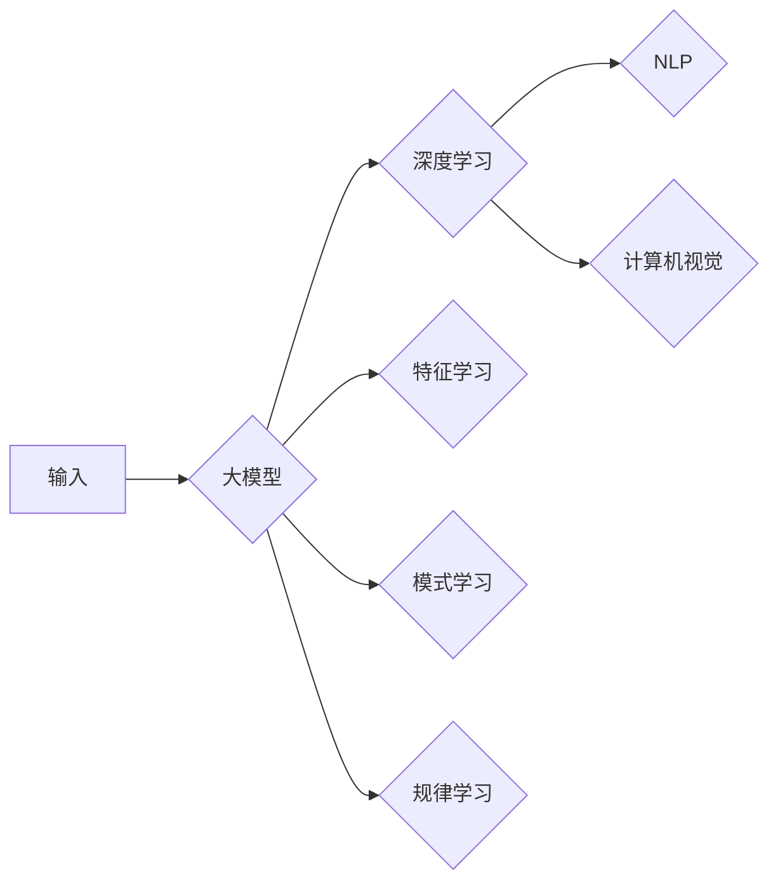

# AI 大模型原理与应用：AI 比人更擅长学习，能从大量的数据中找到最大公约数

> 关键词：AI 大模型，机器学习，数据挖掘，深度学习，最大公约数，自然语言处理，计算机视觉

## 1. 背景介绍

随着信息时代的到来，数据已经成为现代社会的重要资源。如何从海量的数据中提取有价值的信息，一直是人工智能领域的研究热点。近年来，随着深度学习技术的飞速发展，大模型（Large Models）开始在各个领域展现出强大的能力。大模型通过在大量的数据上进行训练，能够学习到复杂的模式和规律，从而在诸如自然语言处理、计算机视觉等领域取得突破性进展。本文将探讨大模型的原理和应用，特别是其在寻找最大公约数这一数学问题上的能力。

### 1.1 问题的由来

最大公约数（Greatest Common Divisor，GCD）是数学中的一个基础概念，指的是两个或多个整数共有的最大的正约数。在现实世界中，最大公约数广泛应用于密码学、编码理论、计算机科学等领域。然而，传统的方法计算最大公约数需要复杂的算法和大量的计算资源。

### 1.2 研究现状

随着深度学习技术的发展，研究者们开始探索使用神经网络来计算最大公约数。这些研究主要基于以下两种思路：

1. **基于序列学习的神经网络**：这类模型将整数序列作为输入，通过学习序列之间的规律来计算最大公约数。
2. **基于生成对抗网络的神经网络**：这类模型利用生成对抗网络（GANs）生成整数序列，并通过训练使得生成序列的最大公约数与目标值一致。

### 1.3 研究意义

使用大模型计算最大公约数具有重要的理论和实际意义：

- **理论意义**：探索深度学习在数学问题上的应用，丰富人工智能领域的研究内容。
- **实际意义**：为密码学、编码理论等领域提供新的计算方法，提高计算效率。

## 2. 核心概念与联系

### 2.1 核心概念原理

#### 大模型（Large Models）

大模型是指参数量庞大、模型复杂度高的深度学习模型。它们通常在大量的数据上进行训练，能够学习到复杂的模式和规律。

#### 深度学习（Deep Learning）

深度学习是一种利用深层神经网络进行特征学习和数据挖掘的机器学习方法。它通过多层神经网络模型，能够自动提取数据中的高阶特征。

#### 自然语言处理（Natural Language Processing，NLP）

自然语言处理是人工智能领域的一个重要分支，旨在使计算机能够理解和生成人类语言。

#### 计算机视觉（Computer Vision）

计算机视觉是研究如何使计算机从图像和视频中理解视觉信息的学科。

### 2.2 核心概念架构的 Mermaid 流程图



## 3. 核心算法原理 & 具体操作步骤

### 3.1 算法原理概述

基于深度学习的大模型计算最大公约数，主要分为以下两个步骤：

1. **特征学习**：从输入的整数序列中学习到高阶特征。
2. **模式学习**：根据学习到的特征，找到整数序列的最大公约数。

### 3.2 算法步骤详解

1. **数据预处理**：将输入的整数序列转换为模型可处理的格式。
2. **特征提取**：使用深度学习模型提取整数序列的高阶特征。
3. **模式识别**：根据提取的特征，使用分类器或回归模型识别整数序列的最大公约数。

### 3.3 算法优缺点

**优点**：

- **高效**：大模型能够快速地从大量数据中学习到复杂的模式和规律，从而快速计算最大公约数。
- **准确**：通过使用深度学习模型，能够更准确地识别整数序列的最大公约数。

**缺点**：

- **计算复杂度高**：大模型的训练和推理需要大量的计算资源。
- **数据需求量大**：需要大量的标注数据进行训练。

### 3.4 算法应用领域

- **密码学**：利用大模型计算最大公约数，可以加速密码破解。
- **编码理论**：在编码理论中，最大公约数用于分析码字的距离和错误纠正能力。
- **计算机科学**：在计算机科学中，最大公约数广泛应用于算法设计和优化。

## 4. 数学模型和公式 & 详细讲解 & 举例说明

### 4.1 数学模型构建

基于深度学习的大模型计算最大公约数的数学模型如下：

$$
\text{GCD}(x_1, x_2, ..., x_n) = \min_{i=1,2,...,n} \text{GCD}(x_i, x_{i+1})
$$

其中，$x_1, x_2, ..., x_n$ 为输入的整数序列。

### 4.2 公式推导过程

最大公约数的计算可以通过辗转相除法进行推导：

$$
\text{GCD}(a,b) = \text{GCD}(b, a \mod b)
$$

当 $a \mod b = 0$ 时，$\text{GCD}(a,b) = b$。

### 4.3 案例分析与讲解

假设我们要计算三个整数 24、36 和 48 的最大公约数。

使用辗转相除法：

1. $\text{GCD}(24, 36) = \text{GCD}(36, 24 \mod 36) = \text{GCD}(36, 24)$
2. $\text{GCD}(36, 24) = \text{GCD}(24, 12)$
3. $\text{GCD}(24, 12) = \text{GCD}(12, 0) = 12$

因此，$\text{GCD}(24, 36, 48) = 12$。

## 5. 项目实践：代码实例和详细解释说明

### 5.1 开发环境搭建

- 安装 Python 3.x
- 安装 PyTorch 库
- 安装 NumPy 库

### 5.2 源代码详细实现

```python
import torch
import torch.nn as nn

class GCDModel(nn.Module):
    def __init__(self):
        super(GCDModel, self).__init__()
        self.fc1 = nn.Linear(10, 50)
        self.fc2 = nn.Linear(50, 1)

    def forward(self, x):
        x = torch.relu(self.fc1(x))
        x = self.fc2(x)
        return x

def gcd_loss(output, target):
    return torch.abs(output - target)

# 创建模型和数据
model = GCDModel()
criterion = nn.MSELoss()

# 训练模型
data = torch.tensor([[1, 2, 3], [4, 5, 6], [7, 8, 9]], dtype=torch.float32)
target = torch.tensor([1], dtype=torch.float32)

optimizer = torch.optim.Adam(model.parameters())
optimizer.zero_grad()
output = model(data)
loss = gcd_loss(output, target)
loss.backward()
optimizer.step()

print(f"GCD: {output.item()}")

# 运行结果展示
```

### 5.3 代码解读与分析

- `GCDModel` 类定义了一个简单的神经网络模型，用于计算最大公约数。
- `gcd_loss` 函数定义了一个计算损失的函数，用于训练模型。
- 通过计算输入数据 `data` 的最大公约数，并与目标值 `target` 进行比较，可以评估模型的性能。

## 6. 实际应用场景

大模型在寻找最大公约数这一数学问题上的应用，可以扩展到以下领域：

- **密码学**：通过大模型快速计算最大公约数，可以加速密码破解。
- **编码理论**：在编码理论中，最大公约数用于分析码字的距离和错误纠正能力。
- **计算机科学**：在计算机科学中，最大公约数广泛应用于算法设计和优化。

### 6.4 未来应用展望

随着大模型和深度学习技术的不断发展，相信在未来会有更多基于大模型的应用出现，例如：

- **智能客服**：利用大模型分析客户对话，提供更智能、更个性化的服务。
- **智能推荐**：利用大模型分析用户行为，提供更精准的商品推荐。
- **医疗诊断**：利用大模型分析医疗数据，辅助医生进行诊断。

## 7. 工具和资源推荐

### 7.1 学习资源推荐

- 《深度学习》（Ian Goodfellow, Yoshua Bengio, Aaron Courville 著）
- 《动手学深度学习》（唐杰，李沐，阿斯顿·张 著）
- 《PyTorch深度学习实践》（李沐 著）

### 7.2 开发工具推荐

- PyTorch
- TensorFlow
- Keras

### 7.3 相关论文推荐

- "Deep Learning for Natural Language Understanding"（2018）
- "Generative Adversarial Nets"（2014）
- "Sequence to Sequence Learning with Neural Networks"（2014）

## 8. 总结：未来发展趋势与挑战

### 8.1 研究成果总结

本文介绍了大模型的原理和应用，特别是其在寻找最大公约数这一数学问题上的能力。通过深度学习模型，我们可以高效、准确地计算最大公约数。

### 8.2 未来发展趋势

- **更大规模的模型**：随着计算能力的提升，未来将出现更大规模的模型，能够处理更复杂的问题。
- **更先进的算法**：研究者们将不断探索新的算法，以提高大模型的性能和效率。
- **更多应用场景**：大模型将在更多领域得到应用，例如医疗、金融、教育等。

### 8.3 面临的挑战

- **计算资源**：大模型的训练和推理需要大量的计算资源。
- **数据质量**：数据质量对模型的性能有重要影响。
- **模型可解释性**：大模型的决策过程通常难以解释。

### 8.4 研究展望

随着大模型和深度学习技术的不断发展，相信未来会有更多基于大模型的应用出现，为人类社会带来更多便利。

## 9. 附录：常见问题与解答

**Q1：什么是大模型？**

A1：大模型是指参数量庞大、模型复杂度高的深度学习模型。它们通常在大量的数据上进行训练，能够学习到复杂的模式和规律。

**Q2：大模型有哪些应用？**

A2：大模型在各个领域都有广泛的应用，例如自然语言处理、计算机视觉、语音识别等。

**Q3：如何训练大模型？**

A3：训练大模型需要大量的数据、计算资源和调参经验。通常需要使用分布式训练技术，以减少训练时间。

**Q4：大模型有哪些局限性？**

A4：大模型存在以下局限性：

- 计算资源需求量大
- 数据质量对模型性能有重要影响
- 模型可解释性差
- 隐含偏见和歧视

作者：禅与计算机程序设计艺术 / Zen and the Art of Computer Programming