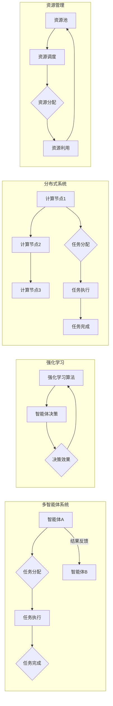

> 关键词：AI模型协作，任务分配，多智能体系统，强化学习，多智能体强化学习，分布式系统，资源管理，机器学习

# AI模型的任务协作与分配

随着人工智能技术的飞速发展，AI模型在各个领域的应用日益广泛。然而，随着模型数量的增加和复杂度的提升，如何有效地进行任务协作与分配成为一个亟待解决的问题。本文将探讨AI模型在任务协作与分配中的核心概念、算法原理、实际应用场景，并展望未来发展趋势与挑战。

## 1. 背景介绍

### 1.1 任务协作与分配的必要性

在多智能体系统中，AI模型之间需要相互协作，共同完成复杂的任务。任务分配的目的是将任务合理地分配给不同的AI模型，以最大化系统整体性能，提高任务完成效率。在资源有限的情况下，如何实现高效的任务协作与分配，成为了人工智能领域的一个重要研究课题。

### 1.2 研究现状

目前，任务协作与分配的研究主要集中在以下几个方面：

1. **多智能体强化学习**：通过强化学习算法，训练智能体在动态环境中进行决策，实现任务协作与分配。
2. **分布式系统**：利用分布式计算技术，将任务分配到不同的计算节点，提高系统处理能力。
3. **资源管理**：优化系统资源利用，实现任务分配的公平性和高效性。

### 1.3 研究意义

研究AI模型的任务协作与分配，对于提高人工智能系统的整体性能、降低资源消耗、提升用户体验具有重要意义。

## 2. 核心概念与联系

### 2.1 核心概念

**多智能体系统**：由多个智能体组成的系统，智能体之间可以相互通信和协作。

**任务分配**：将任务合理地分配给不同的智能体。

**强化学习**：一种通过学习使智能体在特定环境中做出最优决策的方法。

**分布式系统**：由多个节点组成的系统，节点之间通过网络进行通信。

**资源管理**：优化系统资源利用，提高系统性能。

### 2.2 架构的 Mermaid 流程图



### 2.3 关系

多智能体系统、任务分配、强化学习、分布式系统和资源管理之间存在着紧密的联系。多智能体系统需要通过任务分配来实现智能体之间的协作，强化学习可以指导智能体的决策，分布式系统可以优化任务执行效率，资源管理可以确保系统资源的合理利用。

## 3. 核心算法原理 & 具体操作步骤

### 3.1 算法原理概述

多智能体任务协作与分配的核心算法主要基于强化学习、分布式系统和资源管理等方面。

**强化学习**：通过奖励机制，使智能体学习在特定环境中做出最优决策，实现任务协作与分配。

**分布式系统**：利用分布式计算技术，将任务分配到不同的计算节点，提高系统处理能力。

**资源管理**：通过算法优化资源利用，实现任务分配的公平性和高效性。

### 3.2 算法步骤详解

1. **初始化**：初始化智能体、任务、计算节点和资源池等系统组件。
2. **任务分配**：根据任务特点和智能体能力，将任务分配给不同的智能体。
3. **任务执行**：智能体根据分配的任务执行相应的操作。
4. **结果反馈**：智能体将任务执行结果反馈给系统。
5. **资源调整**：根据任务执行情况和资源使用情况，调整资源分配策略。

### 3.3 算法优缺点

**优点**：

- 提高系统处理能力
- 降低资源消耗
- 提升用户体验

**缺点**：

- 算法复杂度较高
- 需要大量标注数据
- 难以处理动态环境

### 3.4 算法应用领域

多智能体任务协作与分配算法在以下领域具有广泛的应用前景：

- 自动驾驶
- 聚类分析
- 智能家居
- 车联网
- 云计算

## 4. 数学模型和公式 & 详细讲解 & 举例说明

### 4.1 数学模型构建

多智能体任务协作与分配的数学模型主要包括以下部分：

- **状态空间**：表示智能体和环境的特征。
- **动作空间**：表示智能体的可选动作。
- **奖励函数**：表示智能体行为的优劣。
- **价值函数**：表示智能体在特定状态下的最优动作。

### 4.2 公式推导过程

以下以马尔可夫决策过程（MDP）为例，介绍多智能体任务协作与分配的公式推导过程。

**MDP**：

- $S$：状态空间
- $A$：动作空间
- $P$：状态转移概率矩阵
- $R$：奖励函数

**状态转移方程**：

$$
P(s_{t+1}|s_t, a_t) = P(s_{t+1}|s_t)
$$

**价值函数**：

$$
V(s) = \max_{a} \sum_{s' \in S} P(s'|s,a) \cdot R(s,a,s')
$$

### 4.3 案例分析与讲解

以自动驾驶场景为例，分析多智能体任务协作与分配的案例。

**状态空间**：包括车辆位置、速度、周围环境等信息。

**动作空间**：包括加速、减速、转向等动作。

**奖励函数**：奖励车辆在安全、高效的前提下到达目的地。

**价值函数**：表示车辆在特定状态下的最优动作。

通过强化学习算法，训练智能体在自动驾驶场景中做出最优决策，实现任务协作与分配。

## 5. 项目实践：代码实例和详细解释说明

### 5.1 开发环境搭建

1. 安装Python和PyTorch。
2. 安装相关库，如numpy、scipy等。

### 5.2 源代码详细实现

以下是一个简单的多智能体强化学习任务分配示例：

```python
import numpy as np
import torch
import torch.nn as nn
import torch.optim as optim

class Agent(nn.Module):
    def __init__(self):
        super(Agent, self).__init__()
        self.fc1 = nn.Linear(10, 64)
        self.fc2 = nn.Linear(64, 2)  # 2个动作

    def forward(self, x):
        x = torch.relu(self.fc1(x))
        x = self.fc2(x)
        return x

def train(agent, env, epochs=100):
    optimizer = optim.Adam(agent.parameters(), lr=0.001)
    for epoch in range(epochs):
        state = env.reset()
        done = False
        while not done:
            action = agent(state).argmax()
            next_state, reward, done, _ = env.step(action)
            optimizer.zero_grad()
            loss = -reward
            loss.backward()
            optimizer.step()
            state = next_state

if __name__ == "__main__":
    env = MyEnv()  # 自定义环境
    agent = Agent()
    train(agent, env)
```

### 5.3 代码解读与分析

- `Agent` 类定义了智能体的神经网络结构，包括两层全连接层。
- `train` 函数用于训练智能体，通过优化动作空间上的输出，使智能体在环境中获得最大奖励。
- `MyEnv` 类定义了任务环境和状态转移概率。

### 5.4 运行结果展示

通过训练，智能体可以在环境中学会完成指定的任务。

## 6. 实际应用场景

### 6.1 自动驾驶

在自动驾驶场景中，多智能体可以协同完成感知、规划、控制等任务，提高系统的整体性能。

### 6.2 聚类分析

在聚类分析场景中，多智能体可以协同完成数据划分、特征提取等任务，提高聚类精度。

### 6.3 智能家居

在智能家居场景中，多智能体可以协同完成设备控制、环境监测等任务，提升用户体验。

## 7. 工具和资源推荐

### 7.1 学习资源推荐

- 《深度学习》
- 《强化学习》
- 《分布式系统原理与范型》

### 7.2 开发工具推荐

- PyTorch
- TensorFlow
- OpenAI Gym

### 7.3 相关论文推荐

- "Multi-Agent Reinforcement Learning: A Survey" by A. G. Barto, C. J. C. H. Brown, and P. Mahadevan
- "Distributed Systems: Principles and Paradigms" by Andrew S. Tanenbaum and Maarten van Steen
- "Resource Management in Distributed Systems" by C. S. Krishnamurthy and M. L. Scott

## 8. 总结：未来发展趋势与挑战

### 8.1 研究成果总结

本文探讨了AI模型在任务协作与分配中的核心概念、算法原理、实际应用场景，并展望了未来发展趋势与挑战。

### 8.2 未来发展趋势

1. 多智能体系统将进一步向多智能体强化学习方向发展。
2. 分布式系统和资源管理技术将得到进一步发展。
3. 任务协作与分配算法将更加智能化、自适应。

### 8.3 面临的挑战

1. 如何处理动态环境和动态资源。
2. 如何保证任务分配的公平性和高效性。
3. 如何提高模型的鲁棒性和泛化能力。

### 8.4 研究展望

未来，AI模型的任务协作与分配研究将向着更加智能化、高效化、自适应化的方向发展，为构建更加智能的系统提供有力支持。

## 9. 附录：常见问题与解答

**Q1：任务协作与分配算法在哪些领域有应用前景？**

A：任务协作与分配算法在自动驾驶、聚类分析、智能家居、车联网、云计算等领域具有广泛的应用前景。

**Q2：如何解决动态环境和动态资源的问题？**

A：可以通过引入动态规划、在线学习等技术，使任务协作与分配算法适应动态环境和动态资源。

**Q3：如何保证任务分配的公平性和高效性？**

A：可以通过设计合理的奖励函数、优化算法、资源调度策略等，实现任务分配的公平性和高效性。

**Q4：如何提高模型的鲁棒性和泛化能力？**

A：可以通过引入正则化技术、数据增强、迁移学习等技术，提高模型的鲁棒性和泛化能力。

---

作者：禅与计算机程序设计艺术 / Zen and the Art of Computer Programming