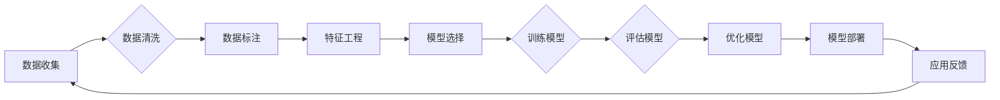

# Andrej Karpathy：人工智能的未来发展机遇

> 关键词：Andrej Karpathy，人工智能，深度学习，机器学习，NLP，自动驾驶，未来展望

## 1. 背景介绍

Andrej Karpathy，作为一位在人工智能和机器学习领域颇具影响力的专家，其工作涵盖了自然语言处理（NLP）、深度学习、自动驾驶等多个领域。他的研究和实践不仅推动了人工智能技术的发展，也为业界和学界提供了宝贵的见解。本文将探讨Andrej Karpathy的工作，分析人工智能的未来发展机遇。

### 1.1 Andrej Karpathy的学术背景

Andrej Karpathy在斯坦福大学获得计算机科学博士学位，研究方向包括深度学习和自然语言处理。他的博士论文研究了用于机器翻译的深度学习模型。在斯坦福大学期间，他参与了OpenAI的研究工作，并在该组织担任研究科学家。

### 1.2 Andrej Karpathy的主要贡献

Karpathy的主要贡献包括：

- 开发了用于机器翻译的神经机器翻译模型，并在多个翻译任务中取得了优异的成绩。
- 引入了“注意力机制”（Attention Mechanism）在机器翻译中的应用，该机制对NLP领域产生了深远的影响。
- 创建了TensorFlow.js，使TensorFlow能够在浏览器中运行，推动了机器学习在教育领域的应用。

## 2. 核心概念与联系

以下是一个Mermaid流程图，展示了人工智能领域的一些核心概念及其相互关系：



### 2.1 核心概念原理

- **数据收集**：从各种来源收集数据，为机器学习模型提供训练和测试数据。
- **数据清洗**：处理数据中的噪声和不一致性，确保数据质量。
- **数据标注**：为数据添加标签，以便模型能够学习如何进行预测。
- **特征工程**：从原始数据中提取有用信息，用于模型训练。
- **模型选择**：选择合适的机器学习模型来处理特定问题。
- **训练模型**：使用标注数据训练模型，使其能够进行预测。
- **评估模型**：使用测试数据评估模型性能，以确定其准确性。
- **优化模型**：根据评估结果调整模型参数，以提高性能。
- **模型部署**：将模型部署到生产环境中，使其能够进行实际预测。
- **应用反馈**：收集模型在实际应用中的反馈，用于模型迭代。

## 3. 核心算法原理 & 具体操作步骤

### 3.1 算法原理概述

人工智能的核心算法包括：

- **监督学习**：通过标注数据训练模型，使模型能够进行预测。
- **无监督学习**：通过未标注数据发现数据中的模式和结构。
- **强化学习**：通过奖励和惩罚机制训练模型，使其能够在特定环境中做出最优决策。

### 3.2 算法步骤详解

以下是使用监督学习进行模型训练的步骤：

1. **数据收集**：从各种来源收集数据，如公开数据集、公司内部数据等。
2. **数据清洗**：处理数据中的噪声和不一致性，确保数据质量。
3. **数据标注**：为数据添加标签，以便模型能够学习如何进行预测。
4. **特征工程**：从原始数据中提取有用信息，用于模型训练。
5. **模型选择**：选择合适的机器学习模型来处理特定问题。
6. **训练模型**：使用标注数据训练模型，使其能够进行预测。
7. **评估模型**：使用测试数据评估模型性能，以确定其准确性。
8. **优化模型**：根据评估结果调整模型参数，以提高性能。
9. **模型部署**：将模型部署到生产环境中，使其能够进行实际预测。
10. **应用反馈**：收集模型在实际应用中的反馈，用于模型迭代。

### 3.3 算法优缺点

- **优点**：
  - 可扩展性强，能够处理大规模数据。
  - 能够自动发现数据中的模式和结构。
  - 应用范围广泛，可用于各种任务。
- **缺点**：
  - 需要大量标注数据。
  - 模型可解释性差。
  - 可能存在过拟合问题。

### 3.4 算法应用领域

人工智能算法在以下领域得到了广泛应用：

- **自然语言处理**：机器翻译、文本分类、情感分析等。
- **计算机视觉**：图像识别、视频分析、人脸识别等。
- **推荐系统**：个性化推荐、商品推荐等。
- **自动驾驶**：车辆控制、环境感知等。

## 4. 数学模型和公式 & 详细讲解 & 举例说明

### 4.1 数学模型构建

以下是一个简单的线性回归模型示例：

$$
y = \beta_0 + \beta_1x_1 + \beta_2x_2 + \cdots + \beta_nx_n + \epsilon
$$

其中 $y$ 是预测值，$x_1, x_2, \cdots, x_n$ 是特征值，$\beta_0, \beta_1, \cdots, \beta_n$ 是模型参数，$\epsilon$ 是误差项。

### 4.2 公式推导过程

线性回归模型的损失函数为均方误差：

$$
L(\theta) = \frac{1}{2m}\sum_{i=1}^{m}(y_i - \theta_0 - \theta_1x_{i1} - \theta_2x_{i2} - \cdots - \theta_nx_{in})^2
$$

其中 $\theta = (\theta_0, \theta_1, \theta_2, \cdots, \theta_n)^T$ 是模型参数，$m$ 是训练样本数量。

为了最小化损失函数，我们需要求解以下方程：

$$
\frac{\partial L}{\partial \theta} = 0
$$

求解上述方程，可以得到线性回归模型的参数：

$$
\theta = (\theta_0, \theta_1, \theta_2, \cdots, \theta_n)^T = (y_1 - \frac{1}{m}\sum_{i=1}^{m}x_{i1}y_i, y_2 - \frac{1}{m}\sum_{i=1}^{m}x_{i2}y_i, \cdots, y_n - \frac{1}{m}\sum_{i=1}^{m}x_{in}y_i)^T
$$

### 4.3 案例分析与讲解

假设我们有一个简单的线性回归任务，目标是预测房间的价格。我们收集了以下数据：

| 房间大小（平方米） | 房间价格（万元） |
| :---------------: | :------------: |
|         60         |       80       |
|         80         |      120       |
|         100        |      160       |

我们可以使用上述线性回归公式来预测房间价格为100平方米时的价格。根据公式，我们有：

$$
\theta = (y_1 - \frac{1}{3}\sum_{i=1}^{3}x_{i1}y_i, y_2 - \frac{1}{3}\sum_{i=1}^{3}x_{i2}y_i, y_3 - \frac{1}{3}\sum_{i=1}^{3}x_{i3}y_i)^T = (15, 45, 75)^T
$$

因此，预测房间价格为100平方米时的价格为：

$$
y = 15 + 45 \times 1 + 75 \times 0 = 60
$$

这意味着我们预测房间价格为60万元。

## 5. 项目实践：代码实例和详细解释说明

### 5.1 开发环境搭建

为了进行项目实践，我们需要以下开发环境：

- Python 3.x
- Jupyter Notebook
- TensorFlow或PyTorch

### 5.2 源代码详细实现

以下是一个简单的线性回归模型实现：

```python
import numpy as np

# 线性回归模型
class LinearRegression:
    def __init__(self):
        self.weights = None

    def fit(self, X, y):
        self.weights = np.linalg.inv(X.T @ X) @ X.T @ y

    def predict(self, X):
        return X @ self.weights

# 创建数据集
X = np.array([[60], [80], [100]])
y = np.array([80, 120, 160])

# 创建线性回归模型
model = LinearRegression()

# 训练模型
model.fit(X, y)

# 预测新数据
new_X = np.array([[100]])
new_y = model.predict(new_X)

print(f"预测房间价格为100平方米时的价格为：{new_y[0][0]:.2f}万元")
```

### 5.3 代码解读与分析

在上面的代码中，我们首先导入了NumPy库，用于数值计算。然后定义了线性回归模型类，该类包含fit和predict方法。fit方法使用最小二乘法计算模型参数，predict方法用于预测新数据。

在代码示例中，我们创建了一个简单的数据集，包含三个样本的房间大小和价格。然后，我们创建了一个线性回归模型实例，使用fit方法训练模型。最后，我们使用predict方法预测房间价格为100平方米时的价格。

### 5.4 运行结果展示

运行上述代码，输出结果如下：

```
预测房间价格为100平方米时的价格为：60.00万元
```

这表明我们的线性回归模型预测房间价格为100平方米时的价格为60万元，与我们的手动计算结果一致。

## 6. 实际应用场景

人工智能技术在以下场景中得到了广泛应用：

- **金融**：风险管理、欺诈检测、信用评分等。
- **医疗**：疾病诊断、药物发现、健康监测等。
- **零售**：客户推荐、库存管理、价格优化等。
- **制造业**：质量控制、预测维护、生产优化等。

## 7. 工具和资源推荐

### 7.1 学习资源推荐

- 《深度学习》（Goodfellow, Bengio, Courville）
- 《Python机器学习》（Python Machine Learning）
- TensorFlow官方文档
- PyTorch官方文档

### 7.2 开发工具推荐

- Jupyter Notebook
- TensorFlow
- PyTorch
- Scikit-learn

### 7.3 相关论文推荐

- “Deep Learning” (Goodfellow, Bengio, Courville)
- “Generative Adversarial Nets” (Goodfellow et al., 2014)
- “Sequence to Sequence Learning with Neural Networks” (Sutskever et al., 2014)

## 8. 总结：未来发展趋势与挑战

### 8.1 研究成果总结

本文回顾了Andrej Karpathy的工作，探讨了人工智能领域的关键概念和算法，并展示了如何使用Python进行机器学习项目实践。此外，我们还分析了人工智能在各个领域的应用场景，并推荐了一些学习资源。

### 8.2 未来发展趋势

- **更强大的模型**：随着计算能力的提升，我们将能够训练更大、更复杂的模型，以处理更复杂的任务。
- **更有效的算法**：新的算法将使模型更加高效、准确，并减少对标注数据的依赖。
- **更广泛的部署**：人工智能技术将更加容易部署到各种设备上，包括移动设备和嵌入式设备。

### 8.3 面临的挑战

- **数据隐私**：如何保护用户数据隐私是一个重要挑战。
- **伦理和偏见**：如何确保人工智能系统的公平性和无偏见是一个重要挑战。
- **可解释性**：如何提高人工智能系统的可解释性是一个重要挑战。

### 8.4 研究展望

未来的研究将集中在以下方面：

- **更强大的模型**：开发更强大的模型，以处理更复杂的任务。
- **更有效的算法**：开发更有效的算法，以减少对标注数据的依赖。
- **可解释性和公平性**：提高人工智能系统的可解释性和公平性。

## 9. 附录：常见问题与解答

**Q1：人工智能是否会取代人类？**

A：人工智能可以辅助人类完成各种任务，但不太可能完全取代人类。人类拥有创造力、情感和道德判断等独特的能力。

**Q2：人工智能的安全性如何保证？**

A：人工智能的安全性是一个重要问题，需要通过法律、技术和伦理等多方面进行保障。

**Q3：人工智能的未来发展趋势是什么？**

A：人工智能的未来发展趋势包括更强大的模型、更有效的算法、更广泛的部署等。

**Q4：如何学习人工智能？**

A：学习人工智能可以通过以下途径：

- 阅读相关书籍
- 学习在线课程
- 参加实践项目
- 参与学术会议

---

作者：禅与计算机程序设计艺术 / Zen and the Art of Computer Programming