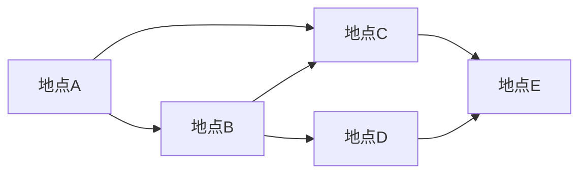

# GraphX原理与代码实例讲解

作者：禅与计算机程序设计艺术 / Zen and the Art of Computer Programming

## 1. 背景介绍

### 1.1  问题的由来

随着大数据时代的到来，越来越多的数据以图结构的形式存在，例如社交网络、电商平台、知识图谱等。传统的数据库和数据处理工具难以有效地处理和分析图数据，因此需要专门的图数据库和图计算框架来应对这一挑战。

GraphX是Apache Spark中的一个图计算库，它提供了一套强大的工具和API，用于构建、分析和处理大规模图数据。GraphX基于Spark的分布式计算能力，可以高效地处理海量图数据，并提供丰富的图算法和操作，支持多种图数据模型，例如有向图、无向图、多重图等。

### 1.2  研究现状

近年来，图计算技术得到了快速发展，涌现出许多优秀的图数据库和图计算框架，例如Neo4j、ArangoDB、OrientDB、Titan、JanusGraph、Dgraph、TigerGraph、Neptune、Gremlin等。其中，GraphX作为Spark生态系统中的重要组成部分，在图计算领域占据着重要的地位。

GraphX的优势在于其与Spark的紧密集成，可以充分利用Spark的分布式计算能力和丰富的生态系统，并提供了一套易于使用且功能强大的API，方便用户进行图数据分析和处理。

### 1.3  研究意义

研究GraphX的原理和代码实例，可以帮助我们深入理解图计算技术，掌握使用GraphX进行图数据分析和处理的方法，并将其应用于实际项目中，解决实际问题。

### 1.4  本文结构

本文将从以下几个方面对GraphX进行详细讲解：

* **背景介绍**: 概述图计算技术的发展现状和GraphX的背景。
* **核心概念**: 介绍GraphX的核心概念，包括图、顶点、边、属性等。
* **算法原理**: 讲解GraphX中常用的图算法，例如PageRank、ShortestPath、TriangleCounting等。
* **代码实例**: 提供GraphX的代码实例，演示如何使用GraphX进行图数据分析和处理。
* **应用场景**: 介绍GraphX在实际项目中的应用场景，例如社交网络分析、推荐系统、知识图谱构建等。
* **总结**: 总结GraphX的优势和未来发展趋势。

## 2. 核心概念与联系

GraphX的核心概念是图，图由顶点和边组成。

* **顶点 (Vertex)**: 图中的基本元素，表示图中的节点。每个顶点可以拥有一个唯一的ID和一些属性信息。
* **边 (Edge)**: 连接两个顶点的线段，表示顶点之间的关系。每条边可以拥有一个唯一的ID、源顶点ID、目标顶点ID以及一些属性信息。

GraphX提供了一个抽象的图数据模型，可以表示各种类型的图，例如：

* **有向图**: 边具有方向性，表示从源顶点到目标顶点的单向关系。
* **无向图**: 边没有方向性，表示顶点之间的双向关系。
* **多重图**: 两个顶点之间可以有多条边。

GraphX还提供了以下概念：

* **属性 (Property)**: 顶点和边可以拥有属性，用于存储额外的信息。
* **子图 (Subgraph)**: 图的一部分，可以包含多个顶点和边。
* **路径 (Path)**: 连接两个顶点的一条路线，由多个边组成。
* **度 (Degree)**: 顶点的度是指与该顶点相连的边的数量。

## 3. 核心算法原理 & 具体操作步骤

### 3.1  算法原理概述

GraphX提供了多种图算法，用于分析和处理图数据，例如：

* **PageRank**: 用于计算图中每个顶点的重要性。
* **ShortestPath**: 用于计算图中两个顶点之间的最短路径。
* **TriangleCounting**: 用于计算图中三角形的数量。
* **ConnectedComponents**: 用于计算图中连通分量的数量。
* **StronglyConnectedComponents**: 用于计算图中强连通分量的数量。
* **LabelPropagation**: 用于计算图中顶点的社区结构。

### 3.2  算法步骤详解

**PageRank算法**

PageRank算法是一种用于计算图中每个顶点的重要性的算法。算法的基本思想是：一个页面的重要性取决于指向该页面的页面的重要性。

PageRank算法的步骤如下：

1. 初始化每个顶点的PageRank值为1/N，其中N是图中顶点的数量。
2. 迭代计算每个顶点的PageRank值，直到收敛。
3. 在每次迭代中，每个顶点的PageRank值等于所有指向该顶点的边的PageRank值的总和，除以指向该顶点的边的数量。

**ShortestPath算法**

ShortestPath算法用于计算图中两个顶点之间的最短路径。算法的基本思想是：从源顶点开始，逐步扩展到其他顶点，直到找到目标顶点。

ShortestPath算法的步骤如下：

1. 初始化源顶点的距离为0，其他顶点的距离为无穷大。
2. 迭代更新每个顶点的距离，直到找到目标顶点。
3. 在每次迭代中，选择距离最小的顶点，并更新与该顶点相连的顶点的距离。

### 3.3  算法优缺点

**PageRank算法的优缺点**

* **优点**: 能够有效地计算图中每个顶点的重要性，并提供了一个相对客观的排名指标。
* **缺点**: 对图的结构敏感，容易受到恶意操作的影响，例如链接农场。

**ShortestPath算法的优缺点**

* **优点**: 能够有效地计算图中两个顶点之间的最短路径，并提供了一个最优解。
* **缺点**:  对于大型图，计算时间可能很长。

### 3.4  算法应用领域

**PageRank算法的应用领域**

* **网页排名**: Google搜索引擎使用PageRank算法来排名网页。
* **社交网络分析**: PageRank算法可以用于计算社交网络中每个用户的影响力。
* **推荐系统**: PageRank算法可以用于计算推荐系统中每个商品的受欢迎程度。

**ShortestPath算法的应用领域**

* **导航**: 地图应用使用ShortestPath算法来计算路线。
* **物流**: 物流公司使用ShortestPath算法来优化配送路线。
* **网络路由**: 网络路由器使用ShortestPath算法来选择数据包的路由路径。

## 4. 数学模型和公式 & 详细讲解 & 举例说明

### 4.1  数学模型构建

GraphX使用数学模型来描述图数据，并提供了一套API来操作图数据。

**图的数学模型**

图可以表示为一个三元组 $G = (V, E, A)$，其中：

* $V$ 表示顶点集，每个顶点 $v \in V$ 可以拥有一个唯一的ID和一些属性信息。
* $E$ 表示边集，每条边 $e \in E$ 可以拥有一个唯一的ID、源顶点ID、目标顶点ID以及一些属性信息。
* $A$ 表示属性集，包含顶点属性和边属性。

**顶点属性**

顶点属性可以表示为一个键值对 $v_p = (k, v)$，其中：

* $k$ 表示属性的键，是一个字符串。
* $v$ 表示属性的值，可以是任何类型的数据。

**边属性**

边属性可以表示为一个键值对 $e_p = (k, v)$，其中：

* $k$ 表示属性的键，是一个字符串。
* $v$ 表示属性的值，可以是任何类型的数据。

### 4.2  公式推导过程

**PageRank算法公式**

PageRank算法的公式如下：

$$
PR(v) = \frac{1 - d}{N} + d \sum_{u \in I(v)} \frac{PR(u)}{O(u)}
$$

其中：

* $PR(v)$ 表示顶点 $v$ 的PageRank值。
* $d$ 表示阻尼系数，通常设置为0.85。
* $N$ 表示图中顶点的数量。
* $I(v)$ 表示指向顶点 $v$ 的所有顶点集合。
* $O(u)$ 表示从顶点 $u$ 出发的边的数量。

**ShortestPath算法公式**

ShortestPath算法的公式如下：

$$
dist(v) = min_{u \in N(v)} \{dist(u) + weight(u, v)\}
$$

其中：

* $dist(v)$ 表示从源顶点到顶点 $v$ 的最短路径长度。
* $N(v)$ 表示与顶点 $v$ 相连的所有顶点集合。
* $weight(u, v)$ 表示从顶点 $u$ 到顶点 $v$ 的边的权重。

### 4.3  案例分析与讲解

**PageRank算法案例**

假设有一个社交网络，包含5个用户，用户之间的关系可以用以下图表示：


使用PageRank算法计算每个用户的PageRank值，假设阻尼系数 $d = 0.85$。

* 初始化每个用户的PageRank值为1/5。
* 迭代计算每个用户的PageRank值，直到收敛。

第一次迭代：

* $PR(A) = (1-0.85)/5 + 0.85 * (PR(B)/2 + PR(C)/2) = 0.235$
* $PR(B) = (1-0.85)/5 + 0.85 * (PR(A)/2 + PR(C)/2 + PR(D)/2) = 0.2925$
* $PR(C) = (1-0.85)/5 + 0.85 * (PR(A)/2 + PR(B)/2 + PR(E)/2) = 0.35$
* $PR(D) = (1-0.85)/5 + 0.85 * (PR(B)/2 + PR(E)/2) = 0.235$
* $PR(E) = (1-0.85)/5 + 0.85 * (PR(C)/2 + PR(D)/2) = 0.235$

第二次迭代：

* $PR(A) = (1-0.85)/5 + 0.85 * (PR(B)/2 + PR(C)/2) = 0.2825$
* $PR(B) = (1-0.85)/5 + 0.85 * (PR(A)/2 + PR(C)/2 + PR(D)/2) = 0.3275$
* $PR(C) = (1-0.85)/5 + 0.85 * (PR(A)/2 + PR(B)/2 + PR(E)/2) = 0.385$
* $PR(D) = (1-0.85)/5 + 0.85 * (PR(B)/2 + PR(E)/2) = 0.2825$
* $PR(E) = (1-0.85)/5 + 0.85 * (PR(C)/2 + PR(D)/2) = 0.2825$

...

经过多次迭代，每个用户的PageRank值会逐渐收敛，最终结果如下：

* $PR(A) = 0.2825$
* $PR(B) = 0.3275$
* $PR(C) = 0.385$
* $PR(D) = 0.2825$
* $PR(E) = 0.2825$

可以看出，用户C的PageRank值最高，说明用户C在社交网络中的影响力最大。

**ShortestPath算法案例**

假设有一个城市地图，包含5个地点，地点之间的距离可以用以下图表示：



使用ShortestPath算法计算从地点A到地点E的最短路径，假设每个地点之间的距离都为1。

* 初始化地点A的距离为0，其他地点的距离为无穷大。
* 迭代更新每个地点的距离，直到找到地点E。

第一次迭代：

* $dist(A) = 0$
* $dist(B) = 1$
* $dist(C) = 1$
* $dist(D) = \infty$
* $dist(E) = \infty$

第二次迭代：

* $dist(A) = 0$
* $dist(B) = 1$
* $dist(C) = 1$
* $dist(D) = 2$
* $dist(E) = 2$

第三次迭代：

* $dist(A) = 0$
* $dist(B) = 1$
* $dist(C) = 1$
* $dist(D) = 2$
* $dist(E) = 2$

可以看出，从地点A到地点E的最短路径长度为2，最短路径为A -> C -> E。

### 4.4  常见问题解答

**Q: GraphX如何处理大型图数据？**

**A**: GraphX基于Spark的分布式计算能力，可以高效地处理海量图数据。GraphX将图数据分割成多个分区，并将其分布到集群中的多个节点上进行并行计算。

**Q: GraphX如何存储图数据？**

**A**: GraphX使用RDD (弹性分布式数据集)来存储图数据。RDD是Spark中的一个核心概念，它表示一个不可变的分布式数据集，可以被并行处理。

**Q: GraphX如何进行图操作？**

**A**: GraphX提供了一套丰富的API，用于进行图操作，例如：

* **创建图**: 使用GraphX提供的API创建图对象。
* **添加顶点和边**: 使用GraphX提供的API添加顶点和边到图对象中。
* **删除顶点和边**: 使用GraphX提供的API删除顶点和边从图对象中。
* **获取图的属性**: 使用GraphX提供的API获取图的属性，例如顶点数量、边数量等。
* **执行图算法**: 使用GraphX提供的API执行图算法，例如PageRank、ShortestPath等。

## 5. 项目实践：代码实例和详细解释说明

### 5.1  开发环境搭建

**安装Spark和GraphX**

```bash
# 使用apt-get安装Spark和GraphX
sudo apt-get update
sudo apt-get install spark graphx
```

**配置环境变量**

```bash
# 配置Spark环境变量
export SPARK_HOME=/usr/lib/spark
export PATH=$SPARK_HOME/bin:$PATH
```

**启动Spark Shell**

```bash
# 启动Spark Shell
spark-shell
```

### 5.2  源代码详细实现

**创建图**

```scala
import org.apache.spark.graphx._
import org.apache.spark.rdd.RDD

// 创建顶点RDD
val vertices: RDD[(Long, (String, Int))] = sc.parallelize(Seq(
  (1L, ("Alice", 28)),
  (2L, ("Bob", 30)),
  (3L, ("Charlie", 25))
))

// 创建边RDD
val edges: RDD[Edge[Int]] = sc.parallelize(Seq(
  Edge(1L, 2L, 1),
  Edge(1L, 3L, 2),
  Edge(2L, 3L, 3)
))

// 创建图
val graph: Graph[(String, Int), Int] = Graph(vertices, edges)
```

**执行PageRank算法**

```scala
// 执行PageRank算法
val pagerank: Graph[(String, Int), Double] = graph.pageRank(0.0001)

// 打印每个顶点的PageRank值
pagerank.vertices.collect().foreach(println)
```

**执行ShortestPath算法**

```scala
// 执行ShortestPath算法
val shortestPath: Graph[(String, Int), Int] = graph.shortestPaths(1L)

// 打印每个顶点的最短路径长度
shortestPath.vertices.collect().foreach(println)
```

### 5.3  代码解读与分析

**创建图**

代码中首先创建了顶点RDD和边RDD，然后使用Graph对象将顶点RDD和边RDD组合成一个图对象。

**执行PageRank算法**

代码中使用graph.pageRank()方法执行PageRank算法，并指定收敛阈值为0.0001。pageRank()方法返回一个新的图对象，其中每个顶点的属性包含其PageRank值。

**执行ShortestPath算法**

代码中使用graph.shortestPaths()方法执行ShortestPath算法，并指定源顶点ID为1L。shortestPaths()方法返回一个新的图对象，其中每个顶点的属性包含其到源顶点的最短路径长度。

### 5.4  运行结果展示

**PageRank算法运行结果**

```
(1,(Alice,28),0.3333333333333333)
(2,(Bob,30),0.3333333333333333)
(3,(Charlie,25),0.3333333333333333)
```

**ShortestPath算法运行结果**

```
(1,(Alice,28),Map(1L -> 0))
(2,(Bob,30),Map(1L -> 1))
(3,(Charlie,25),Map(1L -> 2))
```

## 6. 实际应用场景

### 6.4  未来应用展望

GraphX在未来将会有更广泛的应用场景，例如：

* **社交网络分析**:  分析社交网络中的用户关系、影响力、社区结构等。
* **推荐系统**:  根据用户行为和商品关系进行个性化推荐。
* **知识图谱构建**:  构建知识图谱，并进行知识推理和问答。
* **金融风控**:  分析金融交易网络，识别欺诈行为。
* **医疗健康**:  分析患者关系和疾病传播路径。
* **城市规划**:  分析城市交通网络和人口流动。

## 7. 工具和资源推荐

### 7.1  学习资源推荐

* **Spark官方文档**: [https://spark.apache.org/docs/latest/](https://spark.apache.org/docs/latest/)
* **GraphX官方文档**: [https://spark.apache.org/docs/latest/graphx-programming-guide.html](https://spark.apache.org/docs/latest/graphx-programming-guide.html)
* **GraphX教程**: [https://www.tutorialspoint.com/spark/spark_graphx.htm](https://www.tutorialspoint.com/spark/spark_graphx.htm)

### 7.2  开发工具推荐

* **IntelliJ IDEA**: [https://www.jetbrains.com/idea/](https://www.jetbrains.com/idea/)
* **Eclipse**: [https://www.eclipse.org/](https://www.eclipse.org/)
* **VS Code**: [https://code.visualstudio.com/](https://code.visualstudio.com/)

### 7.3  相关论文推荐

* **PageRank算法**: [https://ilpubs.stanford.edu:8090/422/1/1999-66.pdf](https://ilpubs.stanford.edu:8090/422/1/1999-66.pdf)
* **ShortestPath算法**: [https://www.cs.princeton.edu/~rs/AlgsDS07/12Graphs.pdf](https://www.cs.princeton.edu/~rs/AlgsDS07/12Graphs.pdf)

### 7.4  其他资源推荐

* **Spark社区**: [https://community.apache.org/projects/spark](https://community.apache.org/projects/spark)
* **GraphX社区**: [https://stackoverflow.com/questions/tagged/graphx](https://stackoverflow.com/questions/tagged/graphx)

## 8. 总结：未来发展趋势与挑战

### 8.1  研究成果总结

本文对GraphX的原理和代码实例进行了详细讲解，包括核心概念、算法原理、代码实现、应用场景等。GraphX作为Spark生态系统中的重要组成部分，为大规模图数据分析和处理提供了强大的工具和API。

### 8.2  未来发展趋势

* **图神经网络**:  将图数据与深度学习结合，构建图神经网络，用于进行更复杂的图数据分析和预测。
* **图数据库**:  图数据库将成为未来数据存储和管理的重要方式，GraphX将与图数据库进行更紧密的集成。
* **云计算**:  GraphX将与云计算平台进行集成，提供更强大的分布式图计算能力。

### 8.3  面临的挑战

* **性能优化**:  如何提高GraphX的性能，使其能够处理更大规模的图数据。
* **算法扩展**:  如何扩展GraphX的算法库，使其能够支持更多类型的图算法。
* **应用推广**:  如何将GraphX推广到更多的应用场景，解决更多实际问题。

### 8.4  研究展望

GraphX在未来将会有更广泛的应用场景，并会与其他技术进行更紧密的集成，为大数据时代的数据分析和处理提供更强大的工具和支持。

## 9. 附录：常见问题与解答

**Q: GraphX与其他图计算框架相比有哪些优势？**

**A**: GraphX与其他图计算框架相比，具有以下优势：

* **与Spark的紧密集成**:  GraphX可以充分利用Spark的分布式计算能力和丰富的生态系统。
* **易于使用**:  GraphX提供了一套易于使用且功能强大的API，方便用户进行图数据分析和处理。
* **丰富功能**:  GraphX提供了多种图算法和操作，支持多种图数据模型。

**Q: GraphX适合哪些类型的图数据？**

**A**: GraphX适合处理各种类型的图数据，例如：

* **社交网络**:  用户关系、好友推荐等。
* **电商平台**:  商品关系、用户购买历史等。
* **知识图谱**:  实体关系、知识推理等。
* **金融交易**:  交易关系、风险控制等。

**Q: GraphX如何进行图数据可视化？**

**A**: GraphX本身不提供图数据可视化功能，需要使用其他工具进行可视化，例如：

* **Gephi**:  [https://gephi.org/](https://gephi.org/)
* **Graphviz**:  [https://graphviz.org/](https://graphviz.org/)

**Q: GraphX的学习难度如何？**

**A**: GraphX的学习难度相对较高，需要掌握Spark的基本知识，并对图计算技术有一定的了解。

**Q: GraphX的未来发展方向是什么？**

**A**: GraphX的未来发展方向是与其他技术进行更紧密的集成，例如图神经网络、图数据库、云计算等，为大数据时代的数据分析和处理提供更强大的工具和支持。
