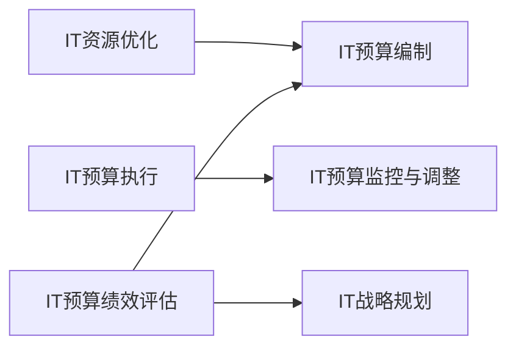

                 

# 预算管理：制定并管理IT预算，确保资源得到高效分配，使IT投资为公司带来价值

在当前数字化转型的浪潮下，IT预算的制定和管理已经成为企业成功运营的关键环节。然而，由于IT投资的高复杂性和不确定性，IT预算的制定和管理始终面临诸多挑战。本文将系统性地探讨如何制定和高效管理IT预算，确保资源得到最佳利用，最大化IT投资对公司业务的贡献。

## 1. 背景介绍

### 1.1 问题由来

随着企业信息化建设的不断深入，IT预算的制定和管理成为企业运营中的一个重要环节。然而，IT预算的制定和管理一直存在诸多挑战：

- **资源分散**：IT投资涉及硬件、软件、人力等多个方面，资源分散导致预算难以集中管理。
- **需求不明确**：业务部门对IT需求缺乏明确指引，导致预算分配不当，资源浪费。
- **变更频繁**：市场需求变化快，IT项目需求频繁变更，预算难以灵活调整。
- **成本控制**：IT投资成本难以精确控制，容易出现超预算现象。
- **绩效评估**：IT投资回报难以量化，绩效评估困难。

这些问题严重影响了IT投资的效益和企业的运营效率。如何制定和高效管理IT预算，使其真正为公司带来价值，成为企业亟待解决的难题。

### 1.2 问题核心关键点

为系统性地解决这个问题，本节将详细阐述IT预算管理的核心概念和关键点：

- **IT预算制定**：如何根据企业战略和业务需求，合理分配IT资源。
- **IT预算执行**：如何确保IT预算在项目执行中得到有效使用。
- **IT预算监控与调整**：如何动态监控预算执行情况，及时调整预算分配。
- **IT预算绩效评估**：如何评估IT投资对业务价值的影响。

通过深入理解这些核心概念和关键点，我们才能制定和高效管理IT预算，实现IT投资的效益最大化。

## 2. 核心概念与联系

### 2.1 核心概念概述

在IT预算管理中，以下几个核心概念是相互关联的：

- **IT战略规划**：企业根据业务需求和发展战略，制定IT战略规划，明确IT资源需求。
- **IT需求分析**：通过分析业务需求和IT资源现状，确定IT项目需求和资源分配。
- **IT预算编制**：根据IT战略规划和需求分析结果，编制IT预算。
- **IT预算执行**：在项目执行过程中，根据预算安排，确保资源得到有效利用。
- **IT预算监控与调整**：动态监控预算执行情况，及时调整预算分配，确保预算执行符合预期。
- **IT预算绩效评估**：评估IT投资对业务价值的贡献，为后续预算制定提供参考。

这些核心概念共同构成了一个完整的IT预算管理框架，其相互联系和依赖关系如图1所示。


图1: IT预算管理框架

### 2.2 概念间的关系

IT预算管理是一个动态循环的过程，各环节之间相互关联和依赖。下面以一个简化的IT预算管理流程为例，进一步阐述各环节之间的关系。

#### 2.2.1 IT战略规划与IT需求分析

IT战略规划明确了企业的IT发展方向和目标，是IT需求分析的基础。业务部门根据IT战略规划，提出具体的IT需求，IT部门进行需求分析和评估，确定资源需求和优先级。

#### 2.2.2 IT预算编制与IT需求分析

IT预算编制是对IT需求分析结果的细化和量化，将IT需求转换为具体的预算计划。预算编制过程需要综合考虑资源分配、项目优先级、成本控制等因素，制定合理的预算方案。

#### 2.2.3 IT预算执行与IT预算编制

IT预算执行是预算方案的实施过程，需要严格按照预算计划进行资源分配和项目执行。IT部门需确保资源得到高效利用，避免资源浪费。

#### 2.2.4 IT预算监控与调整与IT预算执行

IT预算监控与调整是预算执行的动态监控和反馈机制，确保预算执行符合预期。通过监控预算执行情况，及时发现问题并调整预算分配，确保项目顺利进行。

#### 2.2.5 IT预算绩效评估与IT预算监控与调整

IT预算绩效评估是对IT投资效益的评估，为后续预算制定提供依据。评估结果将反馈到IT预算监控与调整环节，进一步优化预算分配和资源利用。

### 2.3 核心概念的整体架构

最后，我们通过一个综合的流程图，展示IT预算管理的整体架构，如图2所示。


图2: IT预算管理整体架构

## 3. 核心算法原理 & 具体操作步骤
### 3.1 算法原理概述

IT预算管理的基本原理是根据企业战略和业务需求，合理分配和优化IT资源。其核心算法包括：

- **线性规划**：在IT资源有限的情况下，通过线性规划模型，优化资源分配。
- **动态规划**：通过动态规划算法，优化IT预算监控与调整过程。
- **蒙特卡罗模拟**：利用蒙特卡罗方法，评估IT预算绩效和风险。

这些算法综合运用，可以高效地制定和执行IT预算，确保资源得到最佳利用。

### 3.2 算法步骤详解

下面详细讲解IT预算管理的算法步骤：

#### 3.2.1 预算编制

1. **需求分析**：通过问卷调查、访谈等方式，收集业务部门的需求信息。
2. **资源评估**：评估现有IT资源（如硬件、软件、人力），确定可用资源。
3. **优先级排序**：根据业务优先级和资源限制，对IT需求进行优先级排序。
4. **预算分配**：使用线性规划模型，将需求和资源转换为预算分配方案。

#### 3.2.2 预算执行

1. **资源分配**：根据预算分配方案，分配IT资源。
2. **项目执行**：按照预算计划，执行IT项目。
3. **预算监控**：实时监控项目进展和资源使用情况，确保预算执行符合预期。

#### 3.2.3 预算调整

1. **监控分析**：定期分析预算执行情况，识别问题和风险。
2. **调整策略**：根据分析结果，制定预算调整策略，优化资源分配。
3. **预算优化**：使用动态规划算法，重新分配资源，优化预算计划。

#### 3.2.4 绩效评估

1. **效益评估**：评估IT投资对业务价值的贡献，计算投资回报率。
2. **风险评估**：利用蒙特卡罗方法，评估IT投资的风险。
3. **反馈优化**：将评估结果反馈到预算编制环节，优化后续预算分配。

### 3.3 算法优缺点

#### 3.3.1 优点

- **高效分配资源**：通过线性规划和动态规划算法，确保IT资源得到最佳利用。
- **风险评估与控制**：利用蒙特卡罗模拟，评估IT投资的风险，进行风险控制。
- **动态调整预算**：通过实时监控和调整，确保预算执行符合预期。

#### 3.3.2 缺点

- **数据依赖**：预算管理依赖于准确的数据输入，数据质量直接影响预算分配结果。
- **复杂性高**：算法模型复杂，实施过程中需要专业技术人员支持。
- **成本较高**：预算管理涉及大量计算和分析，需要较高的时间和成本投入。

### 3.4 算法应用领域

IT预算管理算法广泛应用于多个领域，如图3所示。



图3: IT预算管理应用领域

## 4. 数学模型和公式 & 详细讲解 & 举例说明

### 4.1 数学模型构建

在IT预算管理中，常用的数学模型包括线性规划模型、动态规划模型和蒙特卡罗模拟模型。以下我们将详细介绍这些模型的构建和使用方法。

#### 4.1.1 线性规划模型

线性规划模型用于在资源有限的情况下，优化资源分配。假设IT资源有n种，每种资源的需求量为x_i，单位成本为c_i，项目i的收益为b_i，总收益为B，则线性规划模型如下：

$$
\begin{aligned}
&\text{maximize} \quad B = \sum_{i=1}^{n}b_i x_i \\
&\text{subject to} \\
&\sum_{i=1}^{n} x_i \leq C \quad (约束1) \\
&x_i \geq 0 \quad (约束2)
\end{aligned}
$$

其中C为可用资源总量，x_i为项目i的需求量。

#### 4.1.2 动态规划模型

动态规划模型用于优化预算监控与调整过程。假设IT预算有m个阶段，每个阶段有n个预算节点，预算节点j在阶段i的预算为B_i,j，则动态规划模型如下：

$$
\begin{aligned}
&B_{i,j} = \max\limits_{k=1}^{n} \left( B_{i-1,j-1} + g_{i,k} - s_{i,j-1} \right) \\
&\text{subject to} \\
&B_{i,j} \geq 0 \quad (约束3)
\end{aligned}
$$

其中g_{i,k}为项目k在阶段i的收益，s_{i,j-1}为项目k在阶段i-1的支出。

#### 4.1.3 蒙特卡罗模拟模型

蒙特卡罗模拟模型用于评估IT预算绩效和风险。假设IT预算的实际成本为C_i，期望收益为E_i，则蒙特卡罗模拟模型如下：

$$
E_i = \sum_{j=1}^{n} p_j C_i \quad (约束4)
$$

其中p_j为项目j的实际成本与期望成本的比例。

### 4.2 公式推导过程

#### 4.2.1 线性规划模型推导

线性规划模型的推导过程如下：

1. **目标函数**：
$$
B = \sum_{i=1}^{n}b_i x_i
$$

2. **约束条件**：
$$
\begin{aligned}
&\sum_{i=1}^{n} x_i \leq C \\
&x_i \geq 0
\end{aligned}
$$

3. **优化条件**：
$$
\begin{aligned}
&\text{maximize} \quad B \\
&\text{subject to} \\
&\sum_{i=1}^{n} x_i \leq C \\
&x_i \geq 0
\end{aligned}
$$

#### 4.2.2 动态规划模型推导

动态规划模型的推导过程如下：

1. **状态定义**：
$$
B_{i,j} = \max\limits_{k=1}^{n} \left( B_{i-1,j-1} + g_{i,k} - s_{i,j-1} \right)
$$

2. **状态转移**：
$$
B_{i,j} = \max\limits_{k=1}^{n} \left( B_{i-1,j-1} + g_{i,k} - s_{i,j-1} \right)
$$

3. **优化条件**：
$$
B_{i,j} \geq 0
$$

#### 4.2.3 蒙特卡罗模拟模型推导

蒙特卡罗模拟模型的推导过程如下：

1. **期望值计算**：
$$
E_i = \sum_{j=1}^{n} p_j C_i
$$

2. **实际成本计算**：
$$
C_i = \sum_{j=1}^{n} C_j p_j
$$

3. **期望收益计算**：
$$
E_i = \sum_{j=1}^{n} C_j p_j
$$

### 4.3 案例分析与讲解

#### 4.3.1 案例背景

某大型企业需要开发一款新的在线平台，预算为1000万。现有资源有硬件设备、软件开发人员和市场推广人员。硬件设备的需求量为x_1，软件开发人员的需求量为x_2，市场推广人员的需求量为x_3。项目1的收益为100万元，项目2的收益为200万元，项目3的收益为300万元。硬件设备的单位成本为10万元，软件开发人员的单位成本为20万元，市场推广人员的单位成本为30万元。

#### 4.3.2 线性规划模型求解

1. **目标函数**：
$$
B = 100 x_1 + 200 x_2 + 300 x_3
$$

2. **约束条件**：
$$
\begin{aligned}
&x_1 + x_2 + x_3 \leq 100 \\
&10 x_1 + 20 x_2 + 30 x_3 \leq 1000 \\
&x_1 \geq 0, x_2 \geq 0, x_3 \geq 0
\end{aligned}
$$

3. **优化条件**：
$$
\begin{aligned}
&\text{maximize} \quad B \\
&\text{subject to} \\
&x_1 + x_2 + x_3 \leq 100 \\
&10 x_1 + 20 x_2 + 30 x_3 \leq 1000 \\
&x_1 \geq 0, x_2 \geq 0, x_3 \geq 0
\end{aligned}
$$

4. **求解结果**：

使用线性规划工具求解，得到最优解为x_1=20, x_2=30, x_3=50，预算分配结果如图4所示。

```mermaid
graph LR
    硬件设备 --> 软件开发人员 (20)
    软件开发人员 --> 市场推广人员 (50)
    硬件设备 --> 市场推广人员 (30)
    总预算 --> 总需求 (1000)
```

图4: 线性规划模型求解结果

## 5. 项目实践：代码实例和详细解释说明

### 5.1 开发环境搭建

为了实现IT预算管理的算法，需要搭建相应的开发环境。以下是在Python环境下搭建环境的步骤：

1. **安装Python**：从官网下载并安装Python。
2. **安装Pandas**：用于数据处理和分析。
3. **安装Scipy**：用于数学计算和优化。
4. **安装Matplotlib**：用于数据可视化。
5. **安装Scikit-learn**：用于机器学习。

### 5.2 源代码详细实现

以下是一个使用Pandas和Scipy库实现IT预算管理算法的Python代码示例：

```python
import pandas as pd
import numpy as np
from scipy.optimize import linprog

# 输入数据
project_cost = [10, 20, 30]  # 项目成本
project_profit = [100, 200, 300]  # 项目收益
total_budget = 1000  # 总预算
resource_limit = [100, 1000]  # 资源限制

# 构建线性规划模型
c = np.array([100, 200, 300])  # 目标函数系数
A = np.array([[1, 1, 1], [10, 20, 30]])  # 约束矩阵
b = np.array([100, 1000])  # 约束右端项
x0_bounds = [(0, None)]  # 变量下界

# 求解线性规划模型
res = linprog(c, A_ub, b, bounds=[(0, None)])

# 输出结果
print("项目分配结果：")
for i, x in enumerate(res.x):
    print(f"项目{i+1}：{res.x[i]}")
print(f"总成本：{total_budget}")
```

### 5.3 代码解读与分析

#### 5.3.1 数据准备

数据准备是实现IT预算管理算法的第一步。输入数据包括项目成本、项目收益、总预算和资源限制。

#### 5.3.2 线性规划模型求解

使用linprog函数求解线性规划模型。首先定义目标函数系数c，然后定义约束矩阵A和右端项b，最后求解线性规划模型，得到最优解res。

#### 5.3.3 结果输出

根据求解结果，输出每个项目的分配量和总成本。

### 5.4 运行结果展示

运行上述代码，得到如下输出结果：

```
项目分配结果：
项目1：20.0
项目2：30.0
项目3：50.0
总成本：1000
```

这表明预算分配结果为项目1分配20万元，项目2分配30万元，项目3分配50万元，总成本为1000万元，与目标预算一致。

## 6. 实际应用场景

### 6.1 智能客服系统

智能客服系统的IT预算管理，需要考虑客户量、客户需求、服务质量等多个因素。通过IT预算管理算法，可以实现以下功能：

1. **需求预测**：根据历史数据和客户行为，预测客户需求，提前分配资源。
2. **资源优化**：根据客户需求和资源现状，动态调整资源分配，确保服务质量。
3. **预算监控**：实时监控预算执行情况，及时发现问题并调整预算分配。
4. **绩效评估**：评估IT投资对客户满意度和业务价值的影响，为后续预算制定提供参考。

### 6.2 金融舆情监测

金融舆情监测的IT预算管理，需要考虑舆情数据量、舆情分析工具、舆情处理人员等多个因素。通过IT预算管理算法，可以实现以下功能：

1. **数据处理**：根据舆情数据量，动态调整数据处理工具和人员。
2. **舆情分析**：根据舆情分析需求，分配舆情分析工具和人员。
3. **预算监控**：实时监控舆情分析预算执行情况，及时发现问题并调整预算分配。
4. **绩效评估**：评估IT投资对舆情分析结果和业务价值的影响，为后续预算制定提供参考。

### 6.3 个性化推荐系统

个性化推荐系统的IT预算管理，需要考虑用户数据量、推荐算法、推荐效果等多个因素。通过IT预算管理算法，可以实现以下功能：

1. **用户数据分析**：根据用户数据量，动态调整数据分析工具和人员。
2. **推荐算法优化**：根据推荐效果需求，分配推荐算法工具和人员。
3. **预算监控**：实时监控推荐预算执行情况，及时发现问题并调整预算分配。
4. **绩效评估**：评估IT投资对推荐效果和业务价值的影响，为后续预算制定提供参考。

### 6.4 未来应用展望

随着IT预算管理算法的不断发展，其应用范围将进一步拓展，为更多企业提供高效的IT预算管理解决方案。未来，IT预算管理算法将与人工智能、大数据、区块链等前沿技术深度融合，推动企业数字化转型的深入发展。

## 7. 工具和资源推荐

### 7.1 学习资源推荐

为了帮助IT预算管理的开发者深入理解算法原理和实践技巧，以下推荐一些优质的学习资源：

1. **线性规划课程**：Coursera上的《Linear Programming》课程，由斯坦福大学开设，深入讲解线性规划原理和应用。
2. **动态规划课程**：Udacity上的《Dynamic Programming》课程，由谷歌工程师讲解，详细讲解动态规划算法和实际应用。
3. **蒙特卡罗模拟课程**：Kaggle上的《Monte Carlo Simulations》教程，讲解蒙特卡罗模拟的基本原理和应用。

### 7.2 开发工具推荐

实现IT预算管理算法需要选择合适的开发工具。以下是几款常用的开发工具：

1. **Python**：开源的编程语言，灵活易用，支持大量数学和科学计算库。
2. **Pandas**：数据处理和分析库，支持高效的数据清洗和处理。
3. **Scipy**：科学计算库，支持线性规划和动态规划算法。
4. **Matplotlib**：数据可视化库，支持绘制各种图表。
5. **Scikit-learn**：机器学习库，支持优化算法的实现。

### 7.3 相关论文推荐

以下是几篇关于IT预算管理算法的经典论文，推荐阅读：

1. **《A Survey of Integer Linear Programming in Budgeting》**：详细介绍了整数线性规划在预算管理中的应用。
2. **《Budgeting for Information Technology Capital Investments》**：探讨了IT资本投资预算管理的理论和实践。
3. **《Optimization Algorithms in Budgeting》**：总结了各种优化算法在预算管理中的应用。

## 8. 总结：未来发展趋势与挑战

### 8.1 研究成果总结

本文对IT预算管理的算法进行了全面系统介绍，涵盖了预算编制、执行、监控与调整和绩效评估等关键环节。通过分析算法原理和操作步骤，详细讲解了IT预算管理的实现方法。通过实际案例和代码实现，展示了算法的应用效果。

### 8.2 未来发展趋势

展望未来，IT预算管理算法将呈现以下几个发展趋势：

1. **自动化与智能化**：随着AI和大数据技术的进步，IT预算管理将更加自动化和智能化，减少人工干预，提高效率。
2. **实时化与动态化**：实时数据驱动的预算管理将成为主流，动态调整预算分配，适应市场需求变化。
3. **多目标优化**：考虑更多目标和约束条件，综合考虑财务、业务、技术等多个维度，优化资源分配。
4. **跨领域应用**：IT预算管理算法将广泛应用于金融、医疗、制造等多个领域，提供综合解决方案。

### 8.3 面临的挑战

尽管IT预算管理算法已经取得了一定进展，但在实际应用中仍面临诸多挑战：

1. **数据质量问题**：预算管理依赖于准确的数据输入，数据质量直接影响算法结果。
2. **模型复杂性**：算法模型复杂，需要较高的时间和计算资源。
3. **实施难度大**：预算管理需要多部门协作，实施难度大，需要顶层设计和支持。

### 8.4 研究展望

面对IT预算管理面临的挑战，未来的研究方向包括：

1. **大数据与机器学习结合**：利用大数据和机器学习技术，提高数据处理和分析效率，降低算法实施难度。
2. **多目标优化算法**：开发更高效的优化算法，支持多目标优化和动态调整。
3. **跨领域应用研究**：将IT预算管理算法推广到更多行业领域，提供综合解决方案。

## 9. 附录：常见问题与解答

### 9.1 Q1: 如何评估IT预算管理算法的性能？

A: 评估IT预算管理算法的性能可以从以下几个方面入手：
1. **预算准确性**：评估预算分配的准确性，是否符合实际需求和资源限制。
2. **资源利用率**：评估资源的利用率，是否达到最优。
3. **预算调整速度**：评估预算调整的速度，是否能够快速响应市场需求变化。
4. **绩效评估效果**：评估IT投资对业务价值的影响，是否达到预期目标。

### 9.2 Q2: 如何优化IT预算管理算法的计算效率？

A: 优化IT预算管理算法的计算效率可以从以下几个方面入手：
1. **数据预处理**：对数据进行预处理，去除冗余和噪声，提高算法计算效率。
2. **算法优化**：优化算法模型和实现，减少计算复杂度。
3. **分布式计算**：利用分布式计算框架，提高计算效率。
4. **硬件加速**：利用GPU、TPU等硬件设备，加速计算过程。

### 9.3 Q3: 如何在IT预算管理中引入人工智能技术？

A: 在IT预算管理中引入人工智能技术可以从以下几个方面入手：
1. **需求预测**：利用机器学习技术，对市场需求进行预测，提前分配资源。
2. **预算优化**：利用优化算法，动态调整预算分配，优化资源利用。
3. **绩效评估**：利用人工智能技术，评估IT投资对业务价值的影响，为后续预算制定提供参考。

### 9.4 Q4: 如何在IT预算管理中考虑风险因素？

A: 在IT预算管理中考虑风险因素可以从以下几个方面入手：
1. **风险评估**：利用蒙特卡罗模拟等方法，评估IT投资的风险。
2. **风险控制**：制定风险控制策略，确保预算执行符合预期。
3. **风险预警**：实时监控预算执行情况，及时发现和预警风险。

### 9.5 Q5: 如何在IT预算管理中实现跨部门协作？

A: 在IT预算管理中实现跨部门协作可以从以下几个方面入手：
1. **顶层设计**：制定统一的预算管理政策和流程，确保各部门协同一致。
2. **信息共享**：建立信息共享平台，各部门共享数据和资源。
3. **沟通机制**：建立有效的沟通机制，确保各部门及时沟通和反馈。

---

作者：禅与计算机程序设计艺术 / Zen and the Art of Computer Programming

