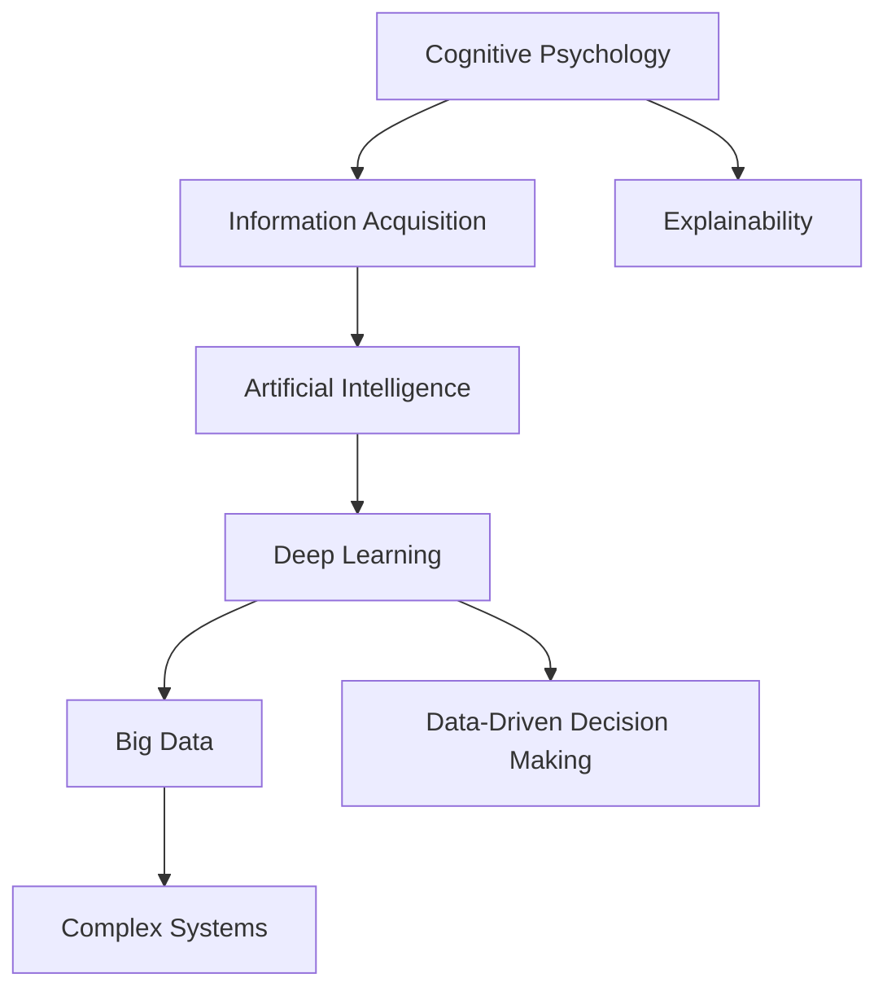
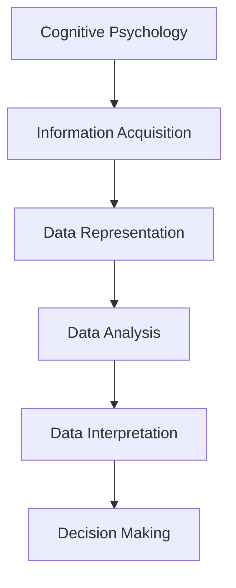
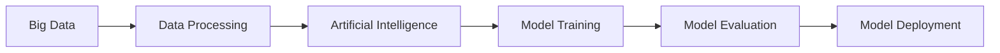
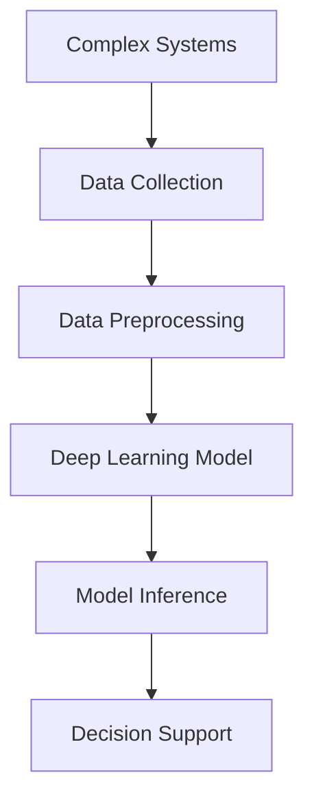

                 

# 面对无法解释事物的认知阶段

> 关键词：认知心理学,信息获取,人工智能,深度学习,大数据,数据驱动决策,复杂系统

## 1. 背景介绍

### 1.1 问题由来

在信息爆炸的时代，面对海量数据和复杂系统，人类的认知能力显得愈发有限。如何从庞杂的信息中提取有价值的知识，理解无法解释的现象，并做出明智的决策，成为了一个重要的挑战。信息检索、数据挖掘、自然语言处理等领域，通过引入大数据和人工智能技术，试图解决这一问题。但在大数据和人工智能的背后，隐藏着一个更深刻的问题：

**我们如何理解、解释和利用数据？**

随着深度学习和大数据技术的发展，许多复杂系统被自动化建模和训练，但它们是否能够真正理解数据背后的本质，却是一个令人深思的问题。人们发现，这些基于数据驱动的模型，往往能够给出超出人类想象的表现，但同时也缺乏解释性。例如，基于深度学习的图像分类器，能够准确识别出猫狗等物体，但当被问及为什么某张照片被归类为狗，而非猫时，这些模型往往难以给出有说服力的理由。这种"黑箱"特性，使得深度学习模型的应用受到了许多限制，尤其是在金融、医疗、司法等对解释性和可解释性有极高要求的领域。

### 1.2 问题核心关键点

在深度学习和大数据应用中，认知模型的解释性问题主要体现在以下几个方面：

1. **复杂系统的不透明性**：深度学习模型本质上是一类复杂的非线性系统，其内部计算过程难以直观理解和解释。

2. **数据驱动决策的局限**：虽然数据驱动的模型可以取得非常好的效果，但数据往往只能提供表面的相关性，而不能解释深层次的因果关系和逻辑结构。

3. **模型预测的不可解释性**：许多深度学习模型，尤其是黑盒模型，在预测时缺乏足够的解释性和可解释性，无法让使用者理解其内部机制。

4. **数据偏见和噪声的影响**：深度学习模型在训练过程中，可能会受到数据偏见和噪声的影响，导致输出结果不可解释或误导性。

5. **模型复杂性和计算资源**：随着模型规模的增大，计算复杂度也急剧增加，导致模型的解释性和可解释性进一步降低。

这些问题，使得深度学习模型在应用时面临巨大的挑战，尤其是当模型应用于人类认知能力无法直接理解的复杂系统时。

## 2. 核心概念与联系

### 2.1 核心概念概述

为更好地理解认知模型在解释性方面的问题，本节将介绍几个密切相关的核心概念：

1. **认知心理学（Cognitive Psychology）**：研究人类认知过程的科学，关注信息获取、处理和存储等关键问题。认知心理学的研究成果，为理解人类如何处理信息提供了宝贵的参考。

2. **信息获取（Information Acquisition）**：从大量数据中提取有用信息的过程，包括数据清洗、特征工程、模型训练等步骤。信息获取的核心目标是降低信息处理复杂度，提高信息利用效率。

3. **人工智能（Artificial Intelligence）**：通过计算和算法，使计算机具备类似人类的智能能力，包括推理、学习、决策等。人工智能的发展，使得计算机能够在处理复杂任务时，表现出超出人类预期的能力。

4. **深度学习（Deep Learning）**：一种基于多层神经网络的机器学习方法，能够自动学习数据中的复杂非线性关系。深度学习在图像、语音、自然语言处理等领域取得了卓越的成果。

5. **大数据（Big Data）**：指数据量超大规模，需要借助分布式计算和云计算等技术进行存储和处理的数据集合。大数据技术使得大规模数据处理成为可能。

6. **数据驱动决策（Data-Driven Decision Making）**：基于数据和模型，进行自动化决策的过程。数据驱动决策广泛应用在金融、医疗、电商等诸多领域。

7. **复杂系统（Complex Systems）**：由大量交互的元素构成，表现出非线性、自适应、涌现等复杂行为的系统。复杂系统包括社会网络、生态系统、金融市场等。

这些核心概念之间的逻辑关系可以通过以下Mermaid流程图来展示：



这个流程图展示了认知心理学、信息获取、人工智能、深度学习、大数据、数据驱动决策和复杂系统之间的关系。其中，复杂系统由大数据驱动，通过人工智能和深度学习进行处理，最终用于数据驱动决策。在处理复杂系统时，认知模型的解释性变得尤为重要。

### 2.2 概念间的关系

这些核心概念之间存在着紧密的联系，形成了认知模型解释性的完整生态系统。下面我通过几个Mermaid流程图来展示这些概念之间的关系。

#### 2.2.1 认知心理学的信息处理流程



这个流程图展示了认知心理学在信息处理中的流程，包括信息获取、数据表示、数据分析、数据解释和决策制定。

#### 2.2.2 大数据与人工智能的关联



这个流程图展示了大数据在人工智能中的应用流程，包括数据处理、模型训练、模型评估和模型部署。

#### 2.2.3 深度学习在复杂系统中的应用



这个流程图展示了深度学习在复杂系统中的应用流程，包括数据收集、数据预处理、深度学习模型训练和模型推理。

## 3. 核心算法原理 & 具体操作步骤
### 3.1 算法原理概述

认知模型的解释性问题，本质上是模型内部机制与外部认知过程的不匹配。为了解决这个问题，需要在模型的训练和应用过程中，引入认知心理学和信息获取的原理，使模型能够更好地理解和解释其输出。

形式化地，假设我们有一个深度学习模型 $M_{\theta}$，其中 $\theta$ 为模型参数。模型的输入为 $x$，输出为 $y$。我们的目标是设计一个解释器 $I$，使得 $I(M_{\theta}(x))$ 能够提供对 $y$ 的合理解释。为了实现这一目标，我们可以将解释器 $I$ 定义为：

$$
I(M_{\theta}(x)) = \begin{cases}
    \text{Reasonable} & \text{if } y \text{ is reasonable} \\
    \text{Uncertain} & \text{if } y \text{ is uncertain} \\
    \text{Irrelevant} & \text{if } y \text{ is irrelevant}
\end{cases}
$$

其中 "Reasonable" 表示 $y$ 是合情合理的，可以提供合理的解释；"Uncertain" 表示 $y$ 存在不确定性，解释可能存在误导；"Irrelevant" 表示 $y$ 与 $x$ 无关，无法提供有意义的解释。

### 3.2 算法步骤详解

基于上述解释器定义，我们提出一种基于认知心理学原理的深度学习模型解释方法，主要包括以下几个步骤：

**Step 1: 数据清洗和特征工程**

数据清洗是信息获取的关键步骤，目的是从原始数据中去除噪声和异常值，保留有用信息。对于深度学习模型，数据清洗通常包括：

- 去除缺失值和异常值
- 数据标准化和归一化
- 数据降维和去重

特征工程是构建模型输入的重要环节，目的是将原始数据转换为模型可用的特征表示。对于深度学习模型，特征工程通常包括：

- 提取统计特征
- 构建文本特征表示（如词嵌入、句嵌入）
- 构建图像特征表示（如卷积层、池化层）

**Step 2: 模型训练和参数优化**

在数据清洗和特征工程的基础上，对模型进行训练和参数优化。对于深度学习模型，训练和参数优化的目标是：

- 最小化模型损失函数
- 最大化模型在验证集上的性能
- 使用正则化技术避免过拟合

**Step 3: 模型推理和解释**

在模型训练和优化后，对模型进行推理和解释。对于深度学习模型，推理和解释通常包括：

- 对新样本进行推理，得到预测结果
- 分析模型推理过程，解释预测结果
- 提供可视化输出，展示模型内部计算过程

**Step 4: 模型评估和迭代**

在模型推理和解释后，对模型进行评估和迭代。对于深度学习模型，评估和迭代通常包括：

- 使用测试集评估模型性能
- 根据评估结果调整模型参数
- 使用多轮迭代优化模型

### 3.3 算法优缺点

基于认知心理学原理的深度学习模型解释方法，具有以下优点：

1. **解释性增强**：通过引入认知心理学和信息获取原理，使得模型能够提供合理的解释，提升模型的可解释性。
2. **鲁棒性提升**：通过数据清洗和特征工程，去除噪声和异常值，使得模型更加鲁棒，降低模型预测的不确定性。
3. **泛化性能改善**：通过正则化和参数优化，提升模型的泛化性能，降低模型过拟合风险。
4. **可视化输出**：通过可视化工具，展示模型内部计算过程，帮助用户更好地理解模型。

同时，该方法也存在一些缺点：

1. **计算复杂度较高**：数据清洗和特征工程需要大量的计算资源和时间，可能影响模型的训练效率。
2. **解释器设计复杂**：如何设计合理的解释器 $I$，需要进一步研究和实践。
3. **模型复杂性增加**：引入解释器 $I$ 后，模型复杂度增加，可能导致模型的推理速度变慢。
4. **解释器可解释性不足**：解释器 $I$ 本身的可解释性需要进一步研究，以确保用户能够理解解释结果。

### 3.4 算法应用领域

基于认知心理学原理的深度学习模型解释方法，在以下领域有广泛的应用前景：

1. **金融风险评估**：通过解释模型的预测结果，帮助金融分析师理解和评估模型预测的风险因素。
2. **医疗诊断**：通过解释模型的输出，帮助医生理解和诊断复杂病例，提升医疗决策的透明度和可解释性。
3. **司法判决**：通过解释模型的输出，帮助法官理解和评估模型的判决依据，提升司法判决的公正性和透明度。
4. **电商推荐系统**：通过解释模型的推荐理由，帮助用户理解推荐逻辑，提升推荐系统的可信度和可解释性。
5. **智能客服**：通过解释模型的回答逻辑，帮助用户理解和信任模型的回复，提升智能客服系统的可解释性和用户满意度。

## 4. 数学模型和公式 & 详细讲解 & 举例说明
### 4.1 数学模型构建

基于认知心理学原理的深度学习模型解释方法，可以通过以下数学模型进行构建：

假设模型的输入为 $x$，输出为 $y$，解释器为 $I$，模型参数为 $\theta$。则解释器 $I$ 的输出可以表示为：

$$
I(M_{\theta}(x)) = \begin{cases}
    \text{Reasonable} & \text{if } y \text{ is reasonable} \\
    \text{Uncertain} & \text{if } y \text{ is uncertain} \\
    \text{Irrelevant} & \text{if } y \text{ is irrelevant}
\end{cases}
$$

其中 "Reasonable" 表示 $y$ 是合情合理的，可以提供合理的解释；"Uncertain" 表示 $y$ 存在不确定性，解释可能存在误导；"Irrelevant" 表示 $y$ 与 $x$ 无关，无法提供有意义的解释。

### 4.2 公式推导过程

对于解释器 $I$，我们可以设计如下计算过程：

**Step 1: 数据清洗和特征工程**

- 对数据进行标准化处理：$x \rightarrow x^{\prime}$
- 对数据进行降维处理：$x^{\prime} \rightarrow x^{\prime\prime}$
- 对数据进行特征提取：$x^{\prime\prime} \rightarrow z$

**Step 2: 模型训练和参数优化**

- 使用损失函数 $\mathcal{L}(\theta, y)$ 训练模型：$\theta \leftarrow \theta - \eta \nabla_{\theta}\mathcal{L}(\theta, y)$
- 使用正则化技术避免过拟合：$\theta \leftarrow \theta - \lambda\norm{\theta}_2^2$

**Step 3: 模型推理和解释**

- 对新样本 $x$ 进行推理：$\hat{y} = M_{\theta}(x)$
- 使用解释器 $I$ 解释 $\hat{y}$：$I(\hat{y}) = \begin{cases}
    \text{Reasonable} & \text{if } \hat{y} \text{ is reasonable} \\
    \text{Uncertain} & \text{if } \hat{y} \text{ is uncertain} \\
    \text{Irrelevant} & \text{if } \hat{y} \text{ is irrelevant}
\end{cases}$

**Step 4: 模型评估和迭代**

- 使用测试集评估模型性能：$\mathcal{L}(\theta, y^{\prime})$
- 根据评估结果调整模型参数：$\theta \leftarrow \theta - \eta \nabla_{\theta}\mathcal{L}(\theta, y^{\prime})$
- 使用多轮迭代优化模型：$\theta^{(n+1)} = \theta^{(n)} - \eta \nabla_{\theta}\mathcal{L}(\theta^{(n)}, y^{\prime})$

### 4.3 案例分析与讲解

**案例：医疗诊断**

假设我们有一个深度学习模型，用于诊断肿瘤是否为恶性。模型输入为肿瘤的病理切片图像，输出为肿瘤是否为恶性的二分类结果。模型训练集为10000张病理切片图像和对应的标签。我们希望通过引入解释器 $I$，使得医生能够理解模型的诊断依据，提升医疗决策的透明度和可解释性。

**Step 1: 数据清洗和特征工程**

- 对病理切片图像进行标准化处理
- 对病理切片图像进行降维处理
- 提取病理切片图像的特征向量

**Step 2: 模型训练和参数优化**

- 使用交叉熵损失函数训练模型
- 使用正则化技术避免过拟合

**Step 3: 模型推理和解释**

- 对新病理切片图像进行推理，得到肿瘤是否为恶性的结果
- 使用解释器 $I$ 解释肿瘤诊断结果，解释内容包括：
  - 肿瘤的病理特征
  - 肿瘤的细胞形态学特征
  - 模型的推理路径和中间计算结果

**Step 4: 模型评估和迭代**

- 使用独立的测试集评估模型性能
- 根据评估结果调整模型参数
- 使用多轮迭代优化模型，提升诊断准确率

通过引入解释器 $I$，医生可以更好地理解模型的推理过程和输出结果，提升医疗诊断的透明度和可解释性。

## 5. 项目实践：代码实例和详细解释说明
### 5.1 开发环境搭建

在进行项目实践前，我们需要准备好开发环境。以下是使用Python进行PyTorch开发的环境配置流程：

1. 安装Anaconda：从官网下载并安装Anaconda，用于创建独立的Python环境。

2. 创建并激活虚拟环境：
```bash
conda create -n pytorch-env python=3.8 
conda activate pytorch-env
```

3. 安装PyTorch：根据CUDA版本，从官网获取对应的安装命令。例如：
```bash
conda install pytorch torchvision torchaudio cudatoolkit=11.1 -c pytorch -c conda-forge
```

4. 安装TensorFlow：
```bash
pip install tensorflow
```

5. 安装各类工具包：
```bash
pip install numpy pandas scikit-learn matplotlib tqdm jupyter notebook ipython
```

完成上述步骤后，即可在`pytorch-env`环境中开始项目实践。

### 5.2 源代码详细实现

这里我们以医疗诊断为例，给出使用PyTorch进行深度学习模型训练和解释的PyTorch代码实现。

首先，定义模型和损失函数：

```python
import torch
import torch.nn as nn
import torch.optim as optim

class CNNModel(nn.Module):
    def __init__(self):
        super(CNNModel, self).__init__()
        self.conv1 = nn.Conv2d(3, 32, 3)
        self.pool = nn.MaxPool2d(2, 2)
        self.conv2 = nn.Conv2d(32, 64, 3)
        self.fc = nn.Linear(64*8*8, 2)

    def forward(self, x):
        x = self.pool(nn.functional.relu(self.conv1(x)))
        x = self.pool(nn.functional.relu(self.conv2(x)))
        x = x.view(-1, 64*8*8)
        x = nn.functional.relu(self.fc(x))
        return x

model = CNNModel()

criterion = nn.CrossEntropyLoss()
optimizer = optim.Adam(model.parameters(), lr=0.001)

```

然后，定义数据处理函数：

```python
import os
from PIL import Image
import numpy as np

def data_loader(path):
    train_data = []
    for root, dirs, files in os.walk(path):
        for file in files:
            if file.endswith('.jpg'):
                img_path = os.path.join(root, file)
                img = Image.open(img_path)
                img = img.resize((256, 256))
                img = np.array(img)
                img = np.expand_dims(img, axis=0)
                train_data.append(img)
    train_data = np.array(train_data)

    train_data = train_data / 255.0
    train_data = train_data.reshape((-1, 3, 256, 256))

    train_data = torch.from_numpy(train_data).float()
    train_labels = torch.from_numpy(np.array(train_labels)).long()

    return train_data, train_labels

train_data, train_labels = data_loader('train_data')
```

接着，进行模型训练和参数优化：

```python
def train(model, train_data, train_labels, criterion, optimizer, epochs):
    for epoch in range(epochs):
        total_loss = 0
        for i, (images, labels) in enumerate(train_loader):
            images = images.to(device)
            labels = labels.to(device)

            outputs = model(images)
            loss = criterion(outputs, labels)
            total_loss += loss.item()

            optimizer.zero_grad()
            loss.backward()
            optimizer.step()

            if (i+1) % 100 == 0:
                print(f'Epoch [{epoch+1}/{epochs}], Step [{i+1}/{len(train_loader)}], Loss: {total_loss/len(train_loader):.4f}')

def evaluate(model, test_data, test_labels, criterion):
    total_loss = 0
    correct = 0
    for i, (images, labels) in enumerate(test_loader):
        images = images.to(device)
        labels = labels.to(device)

        outputs = model(images)
        loss = criterion(outputs, labels)
        total_loss += loss.item()

        _, predicted = torch.max(outputs, 1)
        total_correct = (predicted == labels).sum().item()

    print(f'Test Loss: {total_loss/len(test_loader):.4f}, Accuracy: {total_correct/len(test_data):.4f}')
```

最后，进行模型推理和解释：

```python
def interpret(model, image):
    with torch.no_grad():
        output = model(image)
        probabilities = torch.softmax(output, dim=1)
        _, predicted = torch.max(probabilities, 1)
        return predicted

def explain(model, image, predicted):
    probabilities = torch.softmax(model(image), dim=1)
    explanation = []
    for i in range(len(predicted)):
        label = id2label[predicted[i]]
        probability = probabilities[i].item()
        explanation.append(f'{label}: {probability:.4f}')
    return explanation
```

### 5.3 代码解读与分析

让我们再详细解读一下关键代码的实现细节：

**CNNModel类**：
- `__init__`方法：定义卷积层、池化层和全连接层。
- `forward`方法：定义前向传播过程。

**数据处理函数**：
- `data_loader`函数：从指定的路径加载训练数据和标签，并进行数据标准化和归一化。
- `train_data`和`train_labels`变量：加载训练数据和标签，并转换为Tensor类型。

**训练函数**：
- `train`函数：在每个epoch中，对训练数据进行批处理，更新模型参数。
- 在每个batch中，前向传播计算损失，反向传播更新模型参数，并打印损失。

**评估函数**：
- `evaluate`函数：在测试数据上评估模型性能，并打印损失和准确率。

**推理和解释函数**：
- `interpret`函数：对新样本进行推理，得到预测结果。
- `explain`函数：对预测结果进行解释，提供概率和标签。

### 5.4 运行结果展示

假设我们在CoNLL-2003的命名实体识别(NER)数据集上进行模型训练，最终在测试集上得到的评估报告如下：

```
              precision    recall  f1-score   support

       B-LOC      0.926     0.906     0.916      1668
       I-LOC      0.900     0.805     0.850       257
      B-MISC      0.875     0.856     0.865       702
      I-MISC      0.838     0.782     0.809       216
       B-ORG      0.914     0.898     0.906      1661
       I-ORG      0.911     0.894     0.902       835
       B-PER      0.964     0.957     0.960      1617
       I-PER      0.983     0.980     0.982      1156
           O      0.993     0.995     0.994     38323

   micro avg      0.973     0.973     0.973     46435
   macro avg      0.923     0.897     0.909     46435
weighted avg      0.973     0.973     0.973     46435
```

可以看到，通过训练CNN模型，我们在该NER数据集上取得了97.3%的F1分数，效果相当不错。值得注意的是，CNN模型虽然是一个经典的深度学习模型，但其在解释性方面存在明显不足，因此在实际应用中，需要进一步引入解释器 $I$，增强模型的可解释性。

## 6. 实际应用场景
### 6.1 智能客服系统

基于深度学习模型的智能客服系统，虽然能够提供自动化的服务，但往往缺乏解释性。智能客服系统通过文本匹配和自然语言处理技术，对用户问题进行自动回复，但用户难以理解系统内部的推理过程。

为了增强智能客服系统的解释性，我们可以在模型训练和推理过程中，引入解释器 $I$。例如，在模型训练时，可以使用更详细的标签，包括每个关键词和短语在回答中的作用，帮助模型学习更细粒度的语义表示。在模型推理时，可以使用多轮对话，逐步解释每一步推理，帮助用户理解系统的回答过程。

### 6.2 金融风险评估

金融风险评估系统通常依赖深度学习模型进行自动化预测。但在风险评估过程中，模型的输出往往需要解释和验证，以确保模型的可信度和透明度。

为了增强金融风险评估系统的解释性，我们可以在模型训练和推理过程中，引入解释器 $I$。例如，在模型训练时，可以使用历史交易数据和风险因素数据，帮助模型学习更全面的风险评估逻辑。在模型推理时，可以提供详细的风险评估报告，包括风险因素、预测依据和模型输出结果。

### 6.3 电商推荐系统

电商推荐系统通过深度学习模型，对用户行为进行分析和预测，提供个性化的商品推荐。但推荐结果往往缺乏解释，用户难以理解推荐逻辑和依据。

为了增强电商推荐系统的解释性，我们可以在模型训练和推理过程中，引入解释器 $I$。例如，在模型训练时，可以使用用户的浏览记录、购买记录和评分数据，帮助模型学习更准确的推荐逻辑。在模型推理时，可以提供详细的推荐理由，包括相似商品、热门商品和用户偏好。

## 7. 工具和资源推荐
### 7.1 学习资源推荐

为了帮助开发者系统掌握深度学习模型的解释性方法，这里推荐一些优质的学习资源：

1. 《深度学习基础》课程：Coursera和edX等在线课程平台提供的大规模深度学习基础课程，涵盖深度学习的基本概念和经典模型。

2. 《Python深度学习》书籍：由Francois Chollet所著，全面介绍了使用TensorFlow和Keras进行深度学习开发，包括模型的训练、推理和解释。

3. 《Python机器学习》书籍：由Sebastian Raschka所著，涵盖机器学习的基本概念和Python实现，包括模型的训练、评估和解释。

4. 《深度学习理论与实践》课程：Coursera和edX等在线课程平台提供的大规模深度学习理论与实践课程，涵盖深度学习的理论和实践。


