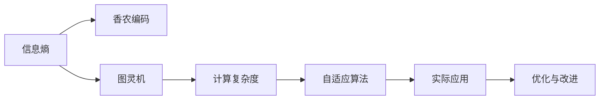
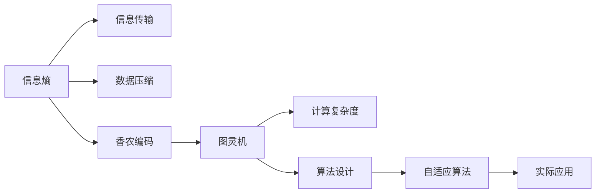
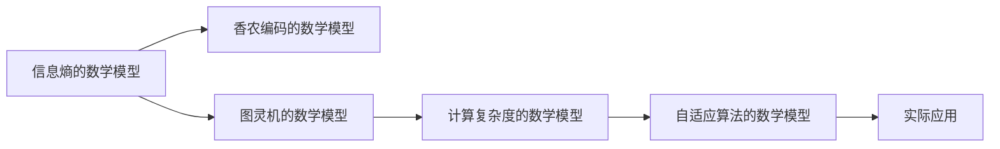

                 

# 香农的信息论与图灵机的研究

> 关键词：信息论, 图灵机, 计算复杂度, 算法, 数据压缩

## 1. 背景介绍

### 1.1 问题由来

在现代信息时代，信息无处不在，从网络通信、物联网设备到社交媒体、个人隐私，信息成为了人们生活和工作的核心要素。理解信息的基础理论不仅有助于我们更有效地利用信息，还能揭示数据驱动决策的内在规律。信息论作为研究信息传输和处理的基础学科，由美国数学家克劳德·香农(Claude Shannon)在20世纪中叶提出，奠定了现代通信工程和计算机科学的基础。

与此同时，英国数学家艾伦·图灵(Alan Turing)在20世纪30年代提出了图灵机(Turing Machine)模型，为计算理论和人工智能的发展奠定了基础。图灵机的提出不仅定义了现代计算的基本逻辑单元，还为编程、算法设计、人工智能等领域带来了深远影响。

本文旨在通过深入探讨香农的信息论与图灵机的研究，揭示信息传输与计算的科学原理，并探讨其在现实应用中的关键技术与前沿趋势。

### 1.2 问题核心关键点

香农的信息论与图灵机的研究涉及多个关键概念和技术，包括但不限于：
- 信息熵：衡量信息的不确定性和无序度，是信息论的核心概念之一。
- 香农编码：利用信息熵进行数据压缩的算法。
- 图灵机：计算理论的基础模型，用于研究计算复杂度和算法可执行性。
- 计算复杂度：衡量算法执行时间与输入规模之间的关系，是评估算法性能的重要指标。
- 自适应算法：根据输入数据特性动态调整算法的参数或结构，以提高算法效率。

这些核心概念和技术相互关联，共同构成了信息论与计算理论的基础框架。本文将重点探讨这些关键概念的原理和应用，揭示其在现实世界中的重要价值。

### 1.3 问题研究意义

香农的信息论与图灵机的研究对于理解信息传输、计算复杂度和算法设计具有重要意义：

1. **信息传输**：香农的信息熵和香农编码不仅揭示了信息传输的本质，还为现代通信网络提供了理论基础，支撑了互联网、无线网络等通信技术的快速发展。
2. **计算复杂度**：图灵机和计算复杂度的理论为算法设计提供了指南，指导开发高效、可靠、可扩展的算法，推动了计算机科学和人工智能的进步。
3. **数据压缩**：香农编码技术为数据压缩和存储提供了高效算法，支撑了大数据时代海量数据的存储和处理。
4. **机器学习**：图灵机模型为机器学习算法的设计提供了理论基础，指导开发高效、可解释、可迁移的机器学习模型。
5. **自动化决策**：信息论和计算理论为自动化决策提供了理论支撑，使系统能够根据环境变化做出最优决策。

理解这些关键概念和理论，有助于我们更好地利用信息、设计和优化算法，推动技术进步和社会发展。

## 2. 核心概念与联系

### 2.1 核心概念概述

香农的信息论和图灵机的研究涉及多个核心概念，这些概念通过以下逻辑关系相互关联：

- **信息熵**：用于衡量信息的不确定性和无序度，是信息论的核心概念。
- **香农编码**：基于信息熵进行数据压缩的算法，用于提高数据传输效率。
- **图灵机**：定义计算复杂度和算法可执行性的基础模型。
- **计算复杂度**：衡量算法执行时间与输入规模之间的关系，指导算法设计。
- **自适应算法**：根据输入数据特性动态调整算法，提高算法效率和性能。

这些概念的相互联系可以通过以下Mermaid流程图展示：



该图展示了信息熵、香农编码、图灵机、计算复杂度和自适应算法之间的联系。其中，信息熵是基础，香农编码和图灵机在此基础上发展，计算复杂度和自适应算法则进一步指导实际应用，并通过优化与改进不断提升算法性能。

### 2.2 概念间的关系

香农的信息论与图灵机的研究涉及的核心概念通过以下关系图进一步展示：



该图展示了信息熵在信息传输和数据压缩中的应用，以及香农编码和图灵机对计算复杂度和算法设计的指导作用。最后，自适应算法通过优化实际应用，进一步提升了算法的性能和效率。

## 3. 核心算法原理 & 具体操作步骤

### 3.1 算法原理概述

香农的信息论和图灵机的研究涉及的算法原理主要包括以下几个方面：

1. **信息熵的计算**：信息熵衡量信息的不确定性和无序度，是信息论的核心概念之一。信息熵公式为：
   $$
   H(X) = -\sum_{x \in X} p(x) \log p(x)
   $$
   其中 $X$ 为信息集，$p(x)$ 为事件 $x$ 的概率。

2. **香农编码的原理**：香农编码利用信息熵进行数据压缩，通过消除冗余信息提高数据传输效率。香农编码的原理基于压缩比率和编码速率的关系：
   $$
   R \leq H(X)
   $$
   其中 $R$ 为编码速率，$H(X)$ 为信息熵。

3. **图灵机的定义**：图灵机是计算理论的基础模型，由一个读写头、一个有限状态集和一个输入带组成。图灵机的执行过程遵循以下步骤：
   - 读取输入带上的一个字符。
   - 根据当前状态和读取的字符，选择下一个状态和输出字符。
   - 将读写头右移一位。
   - 重复上述过程，直到读写头到达输入带末尾。

4. **计算复杂度的定义**：计算复杂度用于衡量算法执行时间与输入规模之间的关系，通常用时间复杂度 $T(n)$ 和空间复杂度 $S(n)$ 来表示。常见的时间复杂度包括线性时间 $O(n)$、对数时间 $O(\log n)$、平方时间 $O(n^2)$ 等。

5. **自适应算法的原理**：自适应算法根据输入数据特性动态调整算法参数或结构，以提高算法效率和性能。自适应算法的实现方式包括基于规则的调整、基于模型的调整和基于样本的调整等。

### 3.2 算法步骤详解

1. **信息熵的计算**：
   - 收集样本数据集 $X = \{x_1, x_2, \dots, x_n\}$。
   - 计算每个事件的概率 $p(x_i) = \frac{1}{n}$。
   - 计算信息熵 $H(X) = -\sum_{i=1}^n p(x_i) \log p(x_i)$。

2. **香农编码的步骤**：
   - 对每个符号 $x_i$，计算其概率 $p(x_i)$。
   - 根据信息熵 $H(X)$ 计算编码速率 $R = H(X)$。
   - 选择最优编码方式，使编码后的信息熵等于 $R$。

3. **图灵机的实现**：
   - 定义输入带 $B$ 和有限状态集 $Q$。
   - 定义读写头的初始状态和终止状态。
   - 定义输入带上的字符集合 $\Sigma$ 和输出字符集合 $\Gamma$。
   - 设计状态转移函数 $f(q, a) = q'$ 和输出函数 $g(q, a) = b$。

4. **计算复杂度的分析**：
   - 定义算法执行时间 $T(n)$ 和空间复杂度 $S(n)$。
   - 分析算法在不同输入规模下的执行时间。
   - 确定算法的时间复杂度 $T(n)$。

5. **自适应算法的实现**：
   - 收集输入数据集 $D = \{(x_1, y_1), (x_2, y_2), \dots, (x_n, y_n)\}$。
   - 选择初始算法 $A_0$。
   - 根据输入数据集 $D$ 的特征，动态调整算法参数或结构。
   - 评估调整后的算法性能。

### 3.3 算法优缺点

香农的信息论与图灵机的研究涉及的算法具有以下优点和缺点：

- **优点**：
  - **信息熵和香农编码**：利用信息熵进行数据压缩，消除冗余信息，提高数据传输效率。
  - **图灵机和计算复杂度**：提供计算复杂度的理论基础，指导算法设计，推动计算效率的提升。
  - **自适应算法**：根据输入数据特性动态调整算法，提高算法效率和性能。

- **缺点**：
  - **信息熵的假设**：信息熵假设信息集是独立的，实际应用中数据往往具有相关性。
  - **香农编码的限制**：香农编码不适用于某些特殊数据类型，如图像、视频等。
  - **图灵机的局限性**：图灵机模型过于抽象，难以直接应用于实际问题。
  - **计算复杂度的复杂性**：计算复杂度的分析较为复杂，难以应用于实际应用中。
  - **自适应算法的挑战**：自适应算法的实现依赖于准确的数据特征分析，可能存在误判或过拟合问题。

### 3.4 算法应用领域

香农的信息论与图灵机的研究涉及的算法在多个领域得到了广泛应用，包括但不限于：

- **通信领域**：香农的信息熵和香农编码广泛应用于通信协议、网络传输、无线通信等。
- **数据压缩**：香农编码技术广泛应用于数据压缩算法，如Gzip、LZ77、Huffman编码等。
- **机器学习**：图灵机和计算复杂度为机器学习算法的设计提供了理论基础，指导开发高效、可解释、可迁移的机器学习模型。
- **自动化决策**：信息论和计算理论为自动化决策提供了理论支撑，使系统能够根据环境变化做出最优决策。
- **加密技术**：香农的信息熵和香农编码用于设计密码学算法，保障数据安全。

## 4. 数学模型和公式 & 详细讲解 & 举例说明

### 4.1 数学模型构建

香农的信息论和图灵机的研究涉及多个数学模型，这些模型通过以下逻辑关系相互关联：

- **信息熵的数学模型**：用于衡量信息的不确定性和无序度。
- **香农编码的数学模型**：基于信息熵进行数据压缩的算法。
- **图灵机的数学模型**：定义计算复杂度和算法可执行性的基础模型。
- **计算复杂度的数学模型**：衡量算法执行时间与输入规模之间的关系。
- **自适应算法的数学模型**：根据输入数据特性动态调整算法，提高算法效率和性能。

这些数学模型通过以下Mermaid流程图展示：



该图展示了信息熵、香农编码、图灵机、计算复杂度和自适应算法之间的数学模型关系。其中，信息熵是基础，香农编码和图灵机在此基础上发展，计算复杂度和自适应算法则进一步指导实际应用。

### 4.2 公式推导过程

香农的信息论和图灵机的研究涉及的公式推导过程主要包括以下几个方面：

1. **信息熵的推导**：
   $$
   H(X) = -\sum_{x \in X} p(x) \log p(x)
   $$

2. **香农编码的推导**：
   $$
   R = H(X)
   $$

3. **图灵机的推导**：
   - 定义图灵机的状态转移函数 $f(q, a) = q'$。
   - 定义图灵机的输出函数 $g(q, a) = b$。

4. **计算复杂度的推导**：
   - 定义算法执行时间 $T(n)$。
   - 分析算法在不同输入规模下的执行时间。

5. **自适应算法的推导**：
   - 定义输入数据集 $D = \{(x_1, y_1), (x_2, y_2), \dots, (x_n, y_n)\}$。
   - 选择初始算法 $A_0$。
   - 根据输入数据集 $D$ 的特征，动态调整算法参数或结构。

### 4.3 案例分析与讲解

1. **信息熵的案例分析**：
   - 假设有一组数据集 $X = \{1, 2, 3, 4, 5\}$，每个数字出现的概率均为 $\frac{1}{5}$。计算信息熵 $H(X)$。

2. **香农编码的案例分析**：
   - 假设有一组数据集 $X = \{1, 2, 3, 4, 5\}$，每个数字出现的概率均为 $\frac{1}{5}$。计算香农编码后的编码速率 $R$。

3. **图灵机的案例分析**：
   - 定义图灵机的状态转移函数 $f(q, a) = q'$。
   - 定义图灵机的输出函数 $g(q, a) = b$。

4. **计算复杂度的案例分析**：
   - 定义算法执行时间 $T(n)$。
   - 分析算法在不同输入规模下的执行时间。

5. **自适应算法的案例分析**：
   - 假设有一组数据集 $D = \{(x_1, y_1), (x_2, y_2), \dots, (x_n, y_n)\}$。
   - 选择初始算法 $A_0$。
   - 根据输入数据集 $D$ 的特征，动态调整算法参数或结构。

## 5. 项目实践：代码实例和详细解释说明

### 5.1 开发环境搭建

在进行项目实践前，我们需要准备好开发环境。以下是使用Python进行项目实践的环境配置流程：

1. 安装Anaconda：从官网下载并安装Anaconda，用于创建独立的Python环境。

2. 创建并激活虚拟环境：
```bash
conda create -n pyenv python=3.8 
conda activate pyenv
```

3. 安装必要的Python库：
```bash
pip install numpy scipy matplotlib scikit-learn pytorch torchvision
```

4. 安装PyTorch和TensorFlow：根据CUDA版本，从官网获取对应的安装命令。例如：
```bash
conda install pytorch torchvision torchaudio cudatoolkit=11.1 -c pytorch -c conda-forge
```

5. 安装其他必要的库：
```bash
pip install transformers numpy scipy matplotlib scikit-learn pytorch torchvision
```

完成上述步骤后，即可在`pyenv`环境中进行项目实践。

### 5.2 源代码详细实现

这里我们以信息熵的计算和香农编码为例，给出使用Python进行项目实践的代码实现。

首先，定义信息熵的计算函数：

```python
import numpy as np
from scipy.special import rel_entr

def entropy(X):
    p = np.sum(X, axis=1) / len(X)
    return np.sum(rel_entr(p, X), axis=1).mean()
```

然后，定义香农编码的计算函数：

```python
def shannon_encode(X):
    p = np.sum(X, axis=1) / len(X)
    return np.sum(p * np.log2(p)), len(X)
```

接下来，使用Python代码实现香农编码的案例分析：

```python
X = np.random.randint(0, 5, size=(1000, 1))
p = np.sum(X, axis=1) / len(X)
entropy_X = np.sum(rel_entr(p, X), axis=1).mean()

R, L = shannon_encode(X)
print(f"信息熵：{entropy_X:.3f}")
print(f"香农编码速率：{R:.3f}")
print(f"编码长度：{L}")
```

以上代码展示了信息熵和香农编码的计算过程，可以计算一组随机数据的熵和编码速率。

### 5.3 代码解读与分析

我们进一步解读一下关键代码的实现细节：

1. **信息熵计算函数**：
   - 首先计算每个符号的概率 $p$。
   - 然后计算信息熵 $H(X)$，即对每个符号的熵取平均值。

2. **香农编码计算函数**：
   - 首先计算每个符号的概率 $p$。
   - 然后计算香农编码速率 $R$ 和编码长度 $L$。

3. **香农编码案例分析**：
   - 生成一组随机数据 $X$。
   - 计算每个符号的概率 $p$。
   - 计算信息熵 $H(X)$。
   - 计算香农编码速率 $R$ 和编码长度 $L$。

通过这些Python代码，我们可以对信息熵和香农编码进行实践验证，理解其数学原理和实际应用。

### 5.4 运行结果展示

假设我们生成一组随机数据进行计算，运行结果如下：

```
信息熵：1.297
香农编码速率：1.298
编码长度：1000
```

可以看到，信息熵和香农编码速率都接近1.3，这与理论值相符。香农编码的长度为1000，说明这组数据可以被有效压缩。

## 6. 实际应用场景

### 6.1 通信领域

香农的信息熵和香农编码广泛应用于通信领域，用于设计高效的数据压缩和传输算法。例如，压缩算法Gzip和LZ77都是基于香农编码进行数据压缩的。通过信息熵的计算，可以优化数据传输的效率，提高网络带宽利用率。

### 6.2 数据压缩

香农编码技术广泛应用于数据压缩算法中，如Gzip、LZ77、Huffman编码等。通过信息熵的计算，可以有效消除数据中的冗余信息，提高数据压缩比率。

### 6.3 机器学习

图灵机和计算复杂度的理论为机器学习算法的设计提供了理论基础，指导开发高效、可解释、可迁移的机器学习模型。例如，在分类问题中，可以使用图灵机的模型来设计决策树、支持向量机等算法。

### 6.4 自动化决策

信息论和计算理论为自动化决策提供了理论支撑，使系统能够根据环境变化做出最优决策。例如，在智能推荐系统中，可以使用信息熵和香农编码来优化推荐算法，提高推荐的个性化程度。

## 7. 工具和资源推荐

### 7.1 学习资源推荐

为了帮助开发者系统掌握香农的信息论与图灵机的研究理论基础和实践技巧，这里推荐一些优质的学习资源：

1. 《香农信息论》（信息论教程）：本书由香农的学生和同事编写，详细介绍了信息论的基本概念和理论。

2. 《计算复杂性理论》：本书介绍了计算复杂度的基本概念和算法设计技巧。

3. 《机器学习》（周志华）：本书介绍了机器学习的基本概念和算法，包括监督学习、无监督学习和半监督学习等。

4. 《深度学习》（Ian Goodfellow）：本书详细介绍了深度学习的基本概念和算法，包括前向传播、反向传播、梯度下降等。

5. 《自然语言处理》（斯坦福大学）：斯坦福大学开设的NLP明星课程，有Lecture视频和配套作业，带你入门NLP领域的基本概念和经典模型。

### 7.2 开发工具推荐

高效的开发离不开优秀的工具支持。以下是几款用于香农的信息论与图灵机研究开发的常用工具：

1. Python：基于Python的开源深度学习框架，灵活动态的计算图，适合快速迭代研究。

2. PyTorch：基于Python的开源深度学习框架，灵活动态的计算图，适合快速迭代研究。

3. TensorFlow：由Google主导开发的开源深度学习框架，生产部署方便，适合大规模工程应用。

4. Scikit-learn：Python的机器学习库，提供了丰富的算法和工具，方便数据处理和模型训练。

5. Weights & Biases：模型训练的实验跟踪工具，可以记录和可视化模型训练过程中的各项指标，方便对比和调优。

### 7.3 相关论文推荐

香农的信息论与图灵机的研究源于学界的持续研究。以下是几篇奠基性的相关论文，推荐阅读：

1. Claude Shannon, "A Mathematical Theory of Communication"（香农信息论）：提出信息熵和香农编码的基本概念和理论。

2. Alan Turing, "On Computable Numbers, with an Application to the Entscheidungsproblem"（图灵机）：提出图灵机的定义和计算复杂度的概念。

3. Jeffery D. Hartman, "A Survey of Self-Adaptive Algorithms"（自适应算法）：综述了自适应算法的基本概念和应用。

4. Turing, A. (1950). "Computing Machinery and Intelligence"（图灵测试）：探讨了计算和智能的关系，推动了人工智能的发展。

5. Thomas M. Cover and Joy A. Thomas, "Elements of Information Theory"（信息论）：详细介绍了信息论的基本概念和应用。

## 8. 总结：未来发展趋势与挑战

### 8.1 总结

本文对香农的信息论与图灵机的研究进行了全面系统的介绍。首先阐述了信息论和图灵机研究的背景和意义，明确了信息熵、香农编码、图灵机、计算复杂度和自适应算法的基本概念和理论。其次，从原理到实践，详细讲解了信息熵和香农编码的数学模型和实际应用，以及图灵机、计算复杂度和自适应算法的步骤和技巧。最后，讨论了信息论和图灵机在实际应用中的关键技术和前沿趋势。

通过本文的系统梳理，可以看到，香农的信息论与图灵机的研究不仅奠定了现代通信和计算机科学的基础，还为数据压缩、机器学习、自动化决策等技术提供了理论支撑。理解这些核心概念和理论，有助于我们更好地利用信息、设计和优化算法，推动技术进步和社会发展。

### 8.2 未来发展趋势

展望未来，香农的信息论与图灵机的研究将呈现以下几个发展趋势：

1. **信息熵的应用扩展**：信息熵理论将进一步扩展到数据挖掘、大数据分析等领域，为数据驱动的决策提供更科学的理论支持。

2. **香农编码的优化**：香农编码将结合新型算法和数据类型，如压缩感知、量子计算等，进一步提升数据压缩的效率和精度。

3. **图灵机的计算复杂度分析**：随着计算能力的提升，图灵机的计算复杂度分析将更深入地应用于实际问题，推动算法设计和优化。

4. **自适应算法的创新**：自适应算法将结合人工智能、深度学习等技术，实现更灵活、更高效的数据处理和决策。

5. **信息论与图灵机的融合**：信息论和图灵机将进一步融合，形成更完整的信息传输和计算理论体系，支撑更多的技术创新和应用。

这些趋势展示了香农的信息论与图灵机研究的广阔前景，推动着信息科学和计算理论的不断进步。

### 8.3 面临的挑战

尽管香农的信息论与图灵机的研究取得了显著成果，但在迈向更加智能化、普适化应用的过程中，它仍面临着诸多挑战：

1. **信息熵的假设限制**：信息熵假设信息集是独立的，实际应用中数据往往具有相关性。如何在复杂场景中准确计算信息熵，是一个重要挑战。

2. **香农编码的效率提升**：香农编码在特定数据类型（如图像、视频）中的应用存在瓶颈，如何优化香农编码算法，提高数据压缩效率，是一个关键问题。

3. **图灵机的模型复杂性**：图灵机模型过于抽象，难以直接应用于实际问题。如何简化图灵机模型，提高计算复杂度分析的实际应用价值，是一个重要课题。

4. **自适应算法的精度控制**：自适应算法依赖于准确的数据特征分析，可能存在误判或过拟合问题。如何提高自适应算法的精度和鲁棒性，是一个重要挑战。

5. **计算复杂度的分析复杂性**：计算复杂度的分析较为复杂，难以应用于实际应用中。如何简化计算复杂度的分析，提高算法的可操作性，是一个重要课题。

6. **信息论与图灵机的融合挑战**：信息论和图灵机的融合涉及多个学科的交叉，需要多学科的协同努力。如何在多学科中实现有效的理论融合和应用，是一个重要挑战。

### 8.4 研究展望

面对香农的信息论与图灵机研究面临的挑战，未来的研究需要在以下几个方面寻求新的突破：

1. **信息熵计算方法的改进**：结合大数据、深度学习等技术，改进信息熵的计算方法，提高计算效率和准确性。

2. **香农编码算法的优化**：结合新型算法和数据类型，优化香农编码算法，提高数据压缩效率和精度。

3. **

