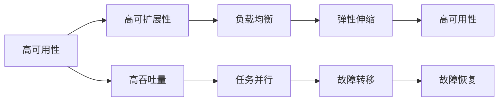

                 

# 高可用性、高可扩展性和高吞吐量系统设计

## 1. 背景介绍

在互联网时代，高可用性、高可扩展性和高吞吐量的系统设计是所有业务成功的基础。无论是大型电商网站、社交媒体平台，还是在线金融服务，高可用的系统架构是保持业务连续性、增强用户体验的关键。本文旨在探讨如何构建具有高可用性、高可扩展性和高吞吐量的系统，为读者提供实用的技术指导和理论支撑。

## 2. 核心概念与联系

### 2.1 核心概念概述

为了更好地理解高可用性、高可扩展性和高吞吐量系统的设计，本节将介绍几个关键概念：

- **高可用性(High Availability)**：指系统在面对硬件故障、网络异常等情况时，仍能持续提供服务的特性。
- **高可扩展性(Scalability)**：指系统能够根据业务需求动态增加或减少资源，保持性能稳定的特性。
- **高吞吐量(High Throughput)**：指系统在单位时间内处理事务或数据的能力，是衡量系统性能的重要指标。

这些概念紧密相连，相互影响。高可用性保证了服务的连续性，高可扩展性确保了性能的可控性，高吞吐量提升了用户体验和系统效率。

### 2.2 核心概念之间的关系

通过以下Mermaid流程图展示这些核心概念之间的关系：



这个流程图展示了高可用性、高可扩展性和高吞吐量之间是如何相互支持的：

- 高可用性通过负载均衡和故障转移等技术，确保系统在故障情况下仍能提供服务。
- 高可扩展性通过任务并行和弹性伸缩等手段，保证系统能够根据需求动态调整资源。
- 高吞吐量通过并行处理和负载均衡等机制，提升系统单位时间内的处理能力。

## 3. 核心算法原理 & 具体操作步骤

### 3.1 算法原理概述

高可用性、高可扩展性和高吞吐量的系统设计，涉及到多个层次的技术和策略，包括但不限于负载均衡、故障转移、水平扩展、垂直扩展、任务调度、容错机制等。其核心原理是围绕着系统资源的合理分配和动态调整，确保系统在各种情况下能够稳定运行。

### 3.2 算法步骤详解

基于上述原理，以下是构建高可用性、高可扩展性和高吞吐量系统的详细步骤：

**Step 1: 架构设计**
- 选择合适的技术栈和架构模式，如微服务、事件驱动等。
- 设计系统组件和服务之间的通信协议，确保信息流畅传递。
- 确定关键组件的冗余和备份策略，如数据库复制、缓存集群等。

**Step 2: 负载均衡**
- 使用负载均衡器如Nginx、HAProxy等，将请求分发到多个服务器或实例上。
- 设置负载均衡算法，如轮询、最少连接数等，提高资源利用率。
- 监控负载均衡器状态，及时调整配置，避免性能瓶颈。

**Step 3: 故障转移和恢复**
- 实现自动故障转移机制，如主从复制、心跳检测等，保证服务连续性。
- 设计备份策略，如冷备份、热备份等，防止数据丢失。
- 实现快速恢复机制，如自动重启、数据重建等，保证服务快速上线。

**Step 4: 水平扩展**
- 通过增加服务器或实例的数量，提高系统的处理能力。
- 设计水平扩展策略，如容器化、云服务弹性伸缩等，简化扩展流程。
- 测试扩展后的系统性能，确保扩展效果。

**Step 5: 垂直扩展**
- 根据资源需求调整单个服务器或实例的硬件配置，如CPU、内存等。
- 定期评估系统资源使用情况，优化硬件配置。
- 采用虚拟化技术，提高硬件资源的利用率。

**Step 6: 任务调度与并行处理**
- 使用任务调度框架如Kubernetes、Docker Swarm等，管理容器化应用的运行。
- 实现任务并行处理，如多进程、异步IO等，提升系统吞吐量。
- 优化任务调度算法，如轮询、优先级调度等，提高资源利用率。

**Step 7: 容错机制**
- 实现数据一致性协议，如Paxos、Raft等，确保数据的可靠性。
- 设计重试机制，如幂等重试、超时处理等，提高系统稳定性。
- 采用冗余设计，如分布式锁、数据副本等，避免单点故障。

### 3.3 算法优缺点

高可用性、高可扩展性和高吞吐量的系统设计，具有以下优点：
1. 提升系统可靠性和用户体验，确保业务连续性。
2. 提高系统处理能力，增强服务容量。
3. 优化资源利用率，降低成本。

但同时，也存在一些缺点：
1. 系统设计复杂，维护成本高。
2. 初期投入大，需大量硬件资源。
3. 故障处理复杂，需要快速响应和恢复机制。

### 3.4 算法应用领域

高可用性、高可扩展性和高吞吐量的系统设计，广泛应用于以下几个领域：

- **电商平台**：需要支持海量用户并发访问，确保订单处理和库存管理的高可用性。
- **金融服务**：对实时交易和数据安全要求高，需保证系统的稳定性和一致性。
- **社交媒体**：需支持高并发内容和用户互动，提升用户体验和系统性能。
- **在线游戏**：需支持高并发游戏会话和实时数据处理，保证游戏的流畅性。
- **视频流服务**：需支持高吞吐量视频传输和流媒体处理，提升用户体验。

## 4. 数学模型和公式 & 详细讲解 & 举例说明

### 4.1 数学模型构建

构建高可用性、高可扩展性和高吞吐量系统的数学模型，需要考虑多个维度的性能指标，如系统负载、资源利用率、吞吐量等。以下是一个简化的模型构建过程：

假设系统有$n$个服务器，每个服务器有$S$个CPU核心，每个核心每秒处理能力为$P$事务，系统每秒处理能力为$T$。

- 负载均衡模型：$L$为每秒处理的请求数，$L=P\times n\times S\times t$，其中$t$为负载均衡因子。
- 故障转移模型：$F$为每秒故障转移请求数，$F=k\times L$，其中$k$为故障转移概率。
- 扩展模型：$E$为每秒扩展请求数，$E=L-F$。
- 容错模型：$C$为每秒处理容错请求数，$C=P\times n\times S$。
- 吞吐量模型：$T=E-C$。

### 4.2 公式推导过程

以负载均衡模型为例，推导负载均衡的数学公式。

假设系统每秒请求数为$L$，每个服务器的处理能力为$P$，系统的负载均衡因子为$t$，则系统每秒处理的请求数$L$可以表示为：

$$
L = P \times n \times S \times t
$$

其中，$P$为每个服务器的每秒处理能力，$n$为服务器数量，$S$为每个服务器的CPU核心数，$t$为负载均衡因子。

### 4.3 案例分析与讲解

以电商平台为例，分析其高可用性、高可扩展性和高吞吐量系统的设计。

**需求分析**：
- 高可用性：保证订单处理和库存管理的不间断服务。
- 高可扩展性：根据业务增长动态调整服务器资源。
- 高吞吐量：支持海量用户并发访问和订单处理。

**系统设计**：
1. **架构设计**：采用微服务架构，将订单处理、库存管理等模块解耦。
2. **负载均衡**：使用Nginx作为负载均衡器，将请求分发到多个订单处理服务上。
3. **故障转移**：实现主从复制，当主节点故障时，从节点接管服务。
4. **水平扩展**：通过云服务弹性伸缩，根据订单数动态调整服务器数量。
5. **垂直扩展**：根据订单处理负载，调整单个服务器的CPU、内存等资源。
6. **任务调度**：使用Kubernetes管理容器化应用，实现任务并行处理。
7. **容错机制**：设计幂等重试和超时处理机制，确保订单处理的可靠性。

**效果评估**：
- **高可用性**：通过负载均衡和故障转移机制，确保订单处理服务在硬件故障和网络异常时仍能稳定运行。
- **高可扩展性**：通过云服务弹性伸缩，根据业务需求动态调整服务器资源，确保系统的稳定性。
- **高吞吐量**：通过任务并行处理和负载均衡，提升订单处理的吞吐量，支持海量用户并发访问。

## 5. 项目实践：代码实例和详细解释说明

### 5.1 开发环境搭建

在进行高可用性、高可扩展性和高吞吐量系统的开发前，我们需要准备好开发环境。以下是使用Python进行Django开发的环境配置流程：

1. 安装Anaconda：从官网下载并安装Anaconda，用于创建独立的Python环境。

2. 创建并激活虚拟环境：
```bash
conda create -n django-env python=3.8 
conda activate django-env
```

3. 安装Django：
```bash
pip install django
```

4. 安装各类工具包：
```bash
pip install numpy pandas scikit-learn matplotlib tqdm jupyter notebook ipython
```

完成上述步骤后，即可在`django-env`环境中开始项目实践。

### 5.2 源代码详细实现

这里以Django项目为例，展示高可用性、高可扩展性和高吞吐量系统的代码实现。

**views.py**

```python
from django.http import HttpResponse

def index(request):
    return HttpResponse("Hello, Django!")
```

**settings.py**

```python
DATABASES = {
    'default': {
        'ENGINE': 'django.db.backends.postgresql',
        'NAME': 'mydatabase',
        'USER': 'mydatabaseuser',
        'PASSWORD': 'mypassword',
        'HOST': 'localhost',
        'PORT': '5432',
    }
}
```

**urls.py**

```python
from django.urls import path
from . import views

urlpatterns = [
    path('', views.index, name='index'),
]
```

**models.py**

```python
from django.db import models

class Book(models.Model):
    title = models.CharField(max_length=100)
    author = models.CharField(max_length=100)
    published = models.DateField()

    def __str__(self):
        return self.title
```

**admin.py**

```python
from django.contrib import admin
from .models import Book

admin.site.register(Book)
```

**settings.py**

```python
INSTALLED_APPS = [
    'myapp',
    'django.contrib.admin',
    'django.contrib.auth',
    'django.contrib.contenttypes',
    'django.contrib.sessions',
    'django.contrib.messages',
    'django.contrib.staticfiles',
]
```

**views.py**

```python
from django.shortcuts import render
from .models import Book

def book_list(request):
    books = Book.objects.all()
    return render(request, 'book_list.html', {'books': books})
```

**urls.py**

```python
from django.urls import path
from . import views

urlpatterns = [
    path('', views.index, name='index'),
    path('books/', views.book_list, name='book_list'),
]
```

**templates/book_list.html**

```html



    <h1>Books</h1>
    <ul>
        
            <li>{{ book.title }} - {{ book.author }}</li>
        
    </ul>

```

**templates/base.html**

```html
<!DOCTYPE html>
<html>
<head>
    <title>My Django App</title>
</head>
<body>
    <h1>My Django App</h1>
    
    
</body>
</html>
```

**settings.py**

```python
INSTALLED_APPS = [
    'myapp',
    'django.contrib.admin',
    'django.contrib.auth',
    'django.contrib.contenttypes',
    'django.contrib.sessions',
    'django.contrib.messages',
    'django.contrib.staticfiles',
]
```

**settings.py**

```python
DEBUG = True
ALLOWED_HOSTS = ['*']
```

### 5.3 代码解读与分析

让我们再详细解读一下关键代码的实现细节：

**views.py**

- `index`函数：简单地返回一个Hello, Django的字符串。
- `book_list`函数：从数据库中获取所有书籍信息，并渲染到模板中。

**settings.py**

- `DATABASES`配置：指定PostgreSQL数据库的连接信息。
- `INSTALLED_APPS`配置：指定项目的依赖库。

**urls.py**

- 定义项目的路由规则，将请求转发到相应的视图函数。

**models.py**

- 定义Book模型，包含书籍的标题、作者和出版日期。

**admin.py**

- 将Book模型注册到Django管理员后台。

**templates**

- `book_list.html`：定义书籍列表的模板，通过循环遍历所有书籍并显示其标题和作者。
- `base.html`：定义项目的基模板，包含公共样式和布局。

### 5.4 运行结果展示

启动Django开发服务器，访问`http://localhost:8000`，即可看到Hello, Django的欢迎页面。访问`http://localhost:8000/books`，即可看到所有书籍的列表。

## 6. 实际应用场景

### 6.1 电商平台

高可用性、高可扩展性和高吞吐量的系统设计，在电商平台上具有重要应用。以某电商平台为例，其架构设计如下：

**系统架构**：
- **前端**：采用React技术栈，提供丰富的用户体验。
- **后端**：采用Django作为Web框架，提供API接口。
- **数据库**：采用MySQL，存储订单、库存等数据。
- **缓存**：采用Redis，提高数据访问速度。
- **负载均衡**：使用Nginx，将请求分发到多个Django服务上。
- **故障转移**：实现主从复制，当主节点故障时，从节点接管服务。
- **水平扩展**：通过云服务弹性伸缩，根据订单数动态调整服务器资源。
- **垂直扩展**：根据订单处理负载，调整单个服务器的CPU、内存等资源。
- **任务调度**：使用Kubernetes管理容器化应用，实现任务并行处理。
- **容错机制**：设计幂等重试和超时处理机制，确保订单处理的可靠性。

**系统特点**：
- **高可用性**：通过负载均衡和故障转移机制，确保订单处理服务在硬件故障和网络异常时仍能稳定运行。
- **高可扩展性**：通过云服务弹性伸缩，根据业务需求动态调整服务器资源，确保系统的稳定性。
- **高吞吐量**：通过任务并行处理和负载均衡，提升订单处理的吞吐量，支持海量用户并发访问。

**应用效果**：
- **订单处理**：每秒处理上万笔订单，保证订单处理的及时性和准确性。
- **库存管理**：实时更新库存信息，避免断货和超卖。
- **用户访问**：支持高并发用户访问，提升用户体验。

### 6.2 金融服务

金融服务对高可用性、高可扩展性和高吞吐量的要求极高，以某在线交易平台为例，其架构设计如下：

**系统架构**：
- **前端**：采用Vue.js技术栈，提供交互式金融产品页面。
- **后端**：采用Spring Boot作为Web框架，提供RESTful API接口。
- **数据库**：采用MySQL，存储交易记录和用户信息。
- **缓存**：采用Redis，提高数据访问速度。
- **负载均衡**：使用HAProxy，将请求分发到多个Spring Boot服务上。
- **故障转移**：实现主从复制，当主节点故障时，从节点接管服务。
- **水平扩展**：通过云服务弹性伸缩，根据交易量动态调整服务器资源。
- **垂直扩展**：根据交易负载，调整单个服务器的CPU、内存等资源。
- **任务调度**：使用Kubernetes管理容器化应用，实现任务并行处理。
- **容错机制**：设计幂等重试和超时处理机制，确保交易处理的可靠性。

**系统特点**：
- **高可用性**：通过负载均衡和故障转移机制，确保交易服务在硬件故障和网络异常时仍能稳定运行。
- **高可扩展性**：通过云服务弹性伸缩，根据交易量动态调整服务器资源，确保系统的稳定性。
- **高吞吐量**：通过任务并行处理和负载均衡，提升交易处理的吞吐量，支持高并发交易。

**应用效果**：
- **交易处理**：每秒处理上千笔交易，保证交易处理的及时性和准确性。
- **用户账户**：实时更新用户账户信息，保障用户资产安全。
- **数据安全**：采用加密传输和数据备份机制，保障交易数据的安全性。

## 7. 工具和资源推荐

### 7.1 学习资源推荐

为了帮助开发者掌握高可用性、高可扩展性和高吞吐量系统设计的理论基础和实践技巧，这里推荐一些优质的学习资源：

1. **《高可用性：构建和运行可扩展的分布式系统》**：这本书详细介绍了高可用性系统设计的各个方面，包括负载均衡、故障转移、容错机制等。
2. **《微服务架构设计》**：这本书介绍了微服务架构的原理和设计原则，适用于高可扩展性系统的设计。
3. **《Django实战》**：这本书是Django的权威指南，详细介绍了Django的各个模块和组件，适用于高吞吐量系统的开发。
4. **《Kubernetes权威指南》**：这本书介绍了Kubernetes的各个方面，包括容器编排、负载均衡、故障转移等，适用于任务调度和容错机制的实现。

### 7.2 开发工具推荐

高效的开发离不开优秀的工具支持。以下是几款用于高可用性、高可扩展性和高吞吐量系统开发的常用工具：

1. **Django**：Python的Web框架，简单易用，支持高吞吐量系统的开发。
2. **Nginx**：高性能的Web服务器和负载均衡器，适用于高可用性系统的设计。
3. **HAProxy**：高性能的负载均衡器，支持多种负载均衡算法，适用于高可用性系统的设计。
4. **Redis**：高性能的内存数据库，适用于高可扩展性系统的设计。
5. **Kubernetes**：开源的容器编排平台，支持高可扩展性系统的部署和运维。

### 7.3 相关论文推荐

高可用性、高可扩展性和高吞吐量系统设计的研究，源于学界的持续探索。以下是几篇奠基性的相关论文，推荐阅读：

1. **《Paxos Made Simple》**：介绍了Paxos算法的实现原理和应用场景，适用于高可用性系统的设计。
2. **《分布式一致性：构建高可用系统》**：详细介绍了分布式一致性的原理和实现，适用于高可用性系统的设计。
3. **《NoSQL数据库的分布式一致性》**：介绍了NoSQL数据库的分布式一致性算法，适用于高可扩展性系统的设计。
4. **《Kubernetes：构建可扩展的高可用分布式系统》**：介绍了Kubernetes的各个方面，适用于高可扩展性系统的部署和运维。
5. **《Towards Exascale Machine Learning with Efficient and Scalable Architectures》**：介绍了高吞吐量机器学习系统的设计和实现，适用于高吞吐量系统的设计。

## 8. 总结：未来发展趋势与挑战

### 8.1 研究成果总结

本文对高可用性、高可扩展性和高吞吐量系统设计进行了全面系统的探讨，为读者提供了实用的技术指导和理论支撑。具体总结如下：

- **高可用性**：通过负载均衡、故障转移、主从复制等技术，确保系统在硬件故障和网络异常时仍能稳定运行。
- **高可扩展性**：通过水平扩展、云服务弹性伸缩、任务并行处理等手段，保证系统能够根据业务需求动态调整资源，保持性能稳定。
- **高吞吐量**：通过任务并行处理、负载均衡、缓存机制等，提升系统单位时间内的处理能力，支持高并发访问和数据处理。

### 8.2 未来发展趋势

展望未来，高可用性、高可扩展性和高吞吐量系统设计将呈现以下几个发展趋势：

1. **容器化和微服务**：容器化和微服务技术将进一步普及，推动系统架构向模块化和微服务化方向发展。
2. **无服务器架构**：无服务器架构如AWS Lambda、Azure Functions等，将使系统开发和运维更加简便高效。
3. **边缘计算**：边缘计算技术将使系统响应速度更快，降低延迟，提升用户体验。
4. **自动化运维**：自动化运维工具如Ansible、Puppet等，将使系统运维更加自动化、规范化。
5. **分布式数据库**：分布式数据库如Cassandra、TiDB等，将使系统数据管理和处理更加高效可扩展。
6. **大数据和人工智能**：大数据和人工智能技术将使系统能够处理海量数据，提升业务洞察和决策支持能力。

### 8.3 面临的挑战

尽管高可用性、高可扩展性和高吞吐量系统设计已经取得了显著进展，但在迈向更加智能化、普适化应用的过程中，仍面临诸多挑战：

1. **系统复杂性**：高可用性、高可扩展性和高吞吐量系统设计涉及多个层面，系统复杂性高，维护成本大。
2. **初期投入大**：高可用性、高可扩展性和高吞吐量系统设计需要大量硬件资源和人力投入，初期成本高。
3. **故障处理复杂**：高可用性、高可扩展性和高吞吐量系统设计需要快速响应和恢复机制，故障处理复杂。
4. **数据安全**：高可用性、高可扩展性和高吞吐量系统设计需要保护数据安全和隐私，防止数据泄露和滥用。
5. **网络安全**：高可用性、高可扩展性和高吞吐量系统设计需要抵御网络攻击和恶意行为，确保系统安全。
6. **性能优化**：高可用性、高可扩展性和高吞吐量系统设计需要优化性能，提升用户体验。

### 8.4 研究展望

面对高可用性、高可扩展性和高吞吐量系统设计所面临的挑战，未来的研究需要在以下几个方面寻求新的突破：

1. **自动化运维**：开发更智能的自动化运维工具，自动检测和修复系统问题，提升运维效率。
2. **多云环境下的高可用性**：研究多云环境下的高可用性设计，使系统能够在多个云平台之间高效切换。
3. **容器和微服务的优化**：优化容器和微服务技术，提升系统性能和可扩展性。
4. **边缘计算与大数据结合**：研究边缘计算与大数据结合的技术，提升系统响应速度和处理能力。
5. **智能化监控与告警**：开发智能化的监控和告警系统，及时发现和处理系统故障。
6. **分布式系统的扩展**：研究分布式系统的扩展技术，提升系统可扩展性和性能。

总之，高可用性、高可扩展性和高吞吐量系统设计是构建可靠、高效、智能系统的基石。通过不断探索和创新，未来一定能够构建出更加强大、灵活、安全的高可用性、高可扩展性和高吞吐量系统，推动信息技术向更广泛、更深层次的渗透和发展。

## 9. 附录：常见问题与解答

**Q1：高可用性、高可扩展性和高吞吐量系统设计的关键点是什么？**

A: 高可用性、高可扩展性和高吞吐量系统设计的关键点在于以下几个方面：

1. **架构设计**：选择合适的技术栈和架构模式，设计合理的组件和服务。
2. **负载均衡**：使用负载均衡器将请求分发到多个服务器或实例上，提高资源利用率。
3. **故障转移**：实现主从复制、心跳检测等机制，保证服务的连续性。
4. **水平扩展**：根据业务需求动态调整服务器资源，提高系统的可扩展性。
5. **垂直扩展**：调整单个服务器的硬件配置，优化资源利用率。
6. **任务调度**：使用任务调度框架管理容器化应用，实现任务并行处理。
7. **容错机制**：设计数据一致性协议、幂等重试等机制，提高系统的稳定性和可靠性。

**Q2：高可用性、高可扩展性和高吞吐量系统设计需要考虑哪些因素？**

A: 高可用性、高可扩展性和高吞吐量系统设计需要考虑以下因素：

1. **硬件资源**：确保系统有足够的硬件资源支持，如CPU、内存、存储等。
2. **软件技术**：选择合适的技术和工具，如Django、Nginx、Kubernetes等。
3. **网络环境**：确保网络环境稳定可靠，避免网络异常影响

