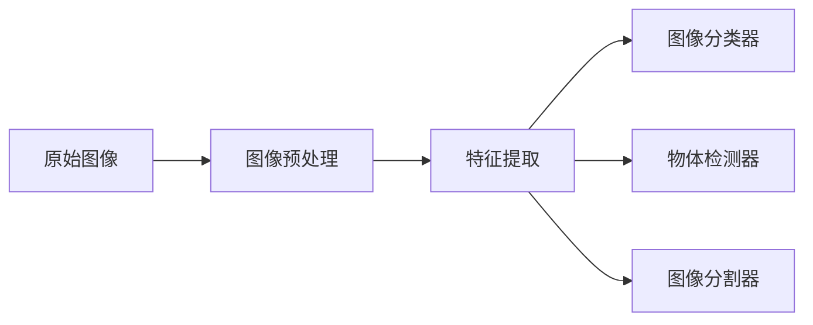
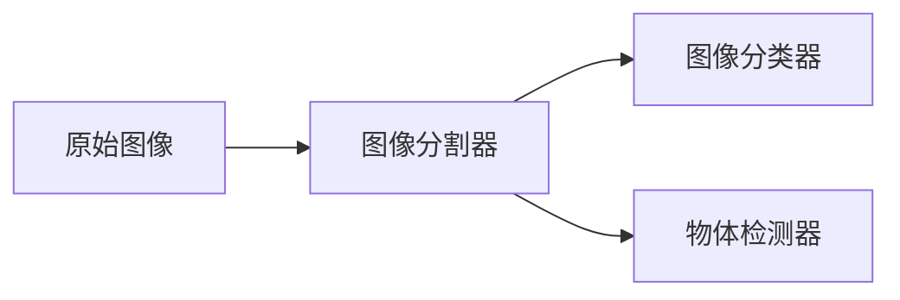

                 

# Computer Vision (CV) 原理与代码实战案例讲解

> 关键词：计算机视觉,图像处理,卷积神经网络,深度学习,计算机视觉库,图像分类,物体检测,图像分割,实例段

## 1. 背景介绍

### 1.1 问题由来
计算机视觉（Computer Vision, CV）是人工智能（AI）的一个分支，专注于使计算机能够“看见”和理解图像和视频。它涵盖了从图像处理、特征提取、图像分类到物体检测、图像分割等一系列技术。计算机视觉技术的广泛应用涉及医疗影像分析、自动驾驶、智能监控、工业检测等多个领域，并逐渐成为推动数字化转型和智能技术落地应用的重要引擎。

然而，尽管CV领域取得了显著的进展，但当前计算机视觉系统的部署依然面临诸多挑战。技术模型往往过于复杂，训练数据需求量大，实际应用中的实时性和效率问题尚未得到完全解决。为了更好地推广和应用计算机视觉技术，我们需要深入理解其核心原理，并通过代码实战案例来实战，解决具体问题。

### 1.2 问题核心关键点
本博客将围绕计算机视觉技术的核心概念、关键算法、深度学习框架以及实际应用场景进行详细阐述，并结合具体案例，以期为读者提供全面、深入的计算机视觉知识和技能。我们关注的焦点包括：

- **计算机视觉基本概念**：图像预处理、特征提取、图像分类、物体检测、图像分割等基本技术。
- **深度学习算法**：卷积神经网络（CNN）、残差网络（ResNet）、注意力机制等深度学习核心算法。
- **框架实战**：TensorFlow、PyTorch等主流深度学习框架的实战使用。
- **实战案例**：图像分类、物体检测、图像分割等计算机视觉任务的实战代码实现。

通过了解这些关键点，我们不仅能够掌握计算机视觉技术的基本原理和核心算法，还能在实际项目中快速应用并解决问题。

### 1.3 问题研究意义
计算机视觉技术的应用和研究对于推动社会进步、优化生产流程、提高生活质量具有重要意义：

1. **医疗影像分析**：通过图像分割技术，可以实现对CT、MRI等医疗影像的自动分析，辅助医生进行诊断和治疗决策。
2. **自动驾驶**：通过物体检测和图像分类技术，可以实时识别交通标志、车辆、行人等，为自动驾驶提供可靠的数据支撑。
3. **智能监控**：通过图像处理技术，可以识别异常行为、盗窃行为等，提高公共安全。
4. **工业检测**：通过图像识别技术，可以检测产品缺陷，优化生产流程，降低人工成本。
5. **增强现实**：通过图像处理和增强现实技术，可以实现虚拟物体与现实世界的融合，提升用户体验。

## 2. 核心概念与联系

### 2.1 核心概念概述

为了更好地理解计算机视觉的核心原理和技术应用，本节将介绍几个关键概念及其相互联系：

- **图像处理**：通过对原始图像进行预处理，如调整亮度、对比度、滤波等，使其更适于后续分析。
- **特征提取**：从图像中提取出有意义的特征，如边缘、角点、纹理等，用于图像分类、物体检测等任务。
- **图像分类**：将图像分为不同的类别，如人、车、动物等。
- **物体检测**：在图像中定位和识别特定物体，如人脸、车辆等。
- **图像分割**：将图像分为多个部分，每个部分代表图像的某个特定区域，常用于医学影像分析、自然语言处理等。

这些概念构成了计算机视觉技术的核心框架，并通过以下Mermaid流程图来展示它们之间的联系：

```mermaid
graph LR
    A[图像] --> B[图像处理]
    B --> C[特征提取]
    C --> D[图像分类]
    C --> E[物体检测]
    C --> F[图像分割]
    A --> G[深度学习]
    D --> H[卷积神经网络(CNN)]
    E --> I[区域卷积网络(R-CNN)]
    F --> J[像素级网络(PSPNet)]
    G --> K[神经网络]
    D --> L[图像分类器]
    E --> M[物体检测器]
    F --> N[像素级网络]
```

这个流程图展示了图像处理、特征提取、图像分类、物体检测和图像分割之间的联系，以及它们如何与深度学习技术和神经网络结合。

### 2.2 概念间的关系

这些核心概念之间存在着紧密的联系，形成了计算机视觉技术的完整生态系统。下面我们通过几个Mermaid流程图来展示这些概念之间的关系。

#### 2.2.1 图像处理与特征提取的关系



这个流程图展示了图像预处理和特征提取如何为图像分类、物体检测和图像分割等任务提供基础数据。预处理后的图像特征，经过特征提取后，进一步用于分类、检测和分割。

#### 2.2.2 图像分类与物体检测的关系


这个流程图展示了图像分类器如何帮助物体检测器识别图像中的物体。分类器首先对图像进行分类，然后将每个类别中的物体检测出来。

#### 2.2.3 图像分割与图像分类、物体检测的关系



这个流程图展示了图像分割器如何将图像分为多个部分，并用于分类和检测。分割后的图像部分，分别用于分类和检测。

### 2.3 核心概念的整体架构

最后，我们用一个综合的流程图来展示这些核心概念在大规模图像处理和分析中的整体架构：

```mermaid
graph TB
    A[大规模图像数据] --> B[图像预处理]
    B --> C[特征提取]
    C --> D[图像分类]
    C --> E[物体检测]
    C --> F[图像分割]
    D --> G[深度学习]
    E --> H[卷积神经网络(CNN)]
    F --> I[像素级网络(PSPNet)]
    D --> J[图像分类器]
    E --> K[物体检测器]
    F --> L[图像分割器]
```

这个综合流程图展示了从大规模图像数据到最终的图像分类、物体检测和图像分割的完整处理流程。图像预处理和特征提取为后续分类、检测和分割提供基础数据，深度学习和神经网络技术则将这些数据转化为具体应用。

## 3. 核心算法原理 & 具体操作步骤
### 3.1 算法原理概述

计算机视觉中的核心算法主要基于深度学习，尤其是卷积神经网络（CNN）。CNN通过多层次的卷积和池化操作，可以从原始图像中自动学习到有意义的特征，并在训练过程中不断优化这些特征，最终用于图像分类、物体检测等任务。

CNN的层次结构通常包括卷积层、池化层、全连接层等。卷积层通过卷积核对图像进行特征提取，池化层用于降维和特征提取，全连接层将池化后的特征映射到不同类别上。通过多层堆叠，CNN可以不断深化对图像特征的理解，从而提高模型的性能。

### 3.2 算法步骤详解

计算机视觉中的深度学习算法步骤通常包括以下几个关键步骤：

1. **数据准备**：收集和标注数据集，包括图像数据和标签数据。标注数据集通常包含大量图像和对应的类别标签。
2. **模型构建**：选择合适的网络结构，如VGG、ResNet等，并根据任务需求对网络进行微调。
3. **模型训练**：使用标注数据集对模型进行训练，通过反向传播算法更新模型参数。
4. **模型评估**：在验证集上评估模型的性能，如准确率、精确率、召回率等指标。
5. **模型优化**：根据评估结果，对模型进行调整和优化，如调整学习率、增加正则化等。
6. **模型应用**：在实际应用中，将训练好的模型部署到目标环境中，进行图像分类、物体检测、图像分割等任务。

下面以图像分类为例，详细讲解模型的训练过程。

### 3.3 算法优缺点

计算机视觉中的深度学习算法具有以下优点：

- **自动化特征提取**：通过多层卷积和池化，可以自动学习图像中的特征，无需人工干预。
- **高准确率**：在大量数据和计算资源支持下，可以取得高精度的分类和检测结果。
- **泛化能力强**：通过迁移学习，可以将模型应用于多种图像分类任务。

然而，也存在一些缺点：

- **计算资源需求高**：大规模图像数据集和深度学习模型需要大量的计算资源。
- **模型训练时间长**：深度学习模型往往需要较长的训练时间。
- **过拟合风险**：在数据量不足的情况下，模型容易过拟合。

### 3.4 算法应用领域

计算机视觉中的深度学习算法广泛应用于以下领域：

- **医学影像分析**：如X光片、CT扫描、MRI图像的自动分析和诊断。
- **自动驾驶**：通过图像识别技术，实现道路标志识别、车辆检测等。
- **智能监控**：如人脸识别、异常行为检测等。
- **工业检测**：如产品缺陷检测、质量控制等。
- **增强现实**：如虚拟物体与现实世界的融合。

## 4. 数学模型和公式 & 详细讲解 & 举例说明

### 4.1 数学模型构建

在计算机视觉中，深度学习模型通常基于卷积神经网络（CNN）。下面以图像分类为例，构建一个简单的CNN模型。

假设输入图像大小为$H \times W \times 3$，输出类别数为$K$。模型由多个卷积层、池化层和全连接层组成。模型的总体结构如下：

```
input -> [卷积层 -> 池化层] * L -> 全连接层 -> output
```

其中，$L$为卷积层和池化层的个数。

### 4.2 公式推导过程

我们以LeNet-5网络为例，展示卷积层和池化层的公式推导过程。

#### 4.2.1 卷积层公式推导

卷积层的输入为$n \times h \times w$个像素点，输出为$n \times h' \times w'$个像素点，卷积核大小为$k \times k$，步长为$s$。卷积层的计算公式为：

$$
out_{i,j} = \sum_{m=0}^{k-1} \sum_{n=0}^{k-1} w_{m,n} * input_{i+m, j+n} + b
$$

其中，$w_{m,n}$为卷积核参数，$b$为偏置项。

#### 4.2.2 池化层公式推导

池化层的输入为$n \times h \times w$个像素点，输出为$n \times h' \times w'$个像素点，池化窗口大小为$k \times k$，步长为$s$。池化层的计算公式为：

$$
out_{i,j} = \max_{m,n}(input_{i+s*m, j+s*n})
$$

其中，$max$函数表示取最大值。

### 4.3 案例分析与讲解

我们以CIFAR-10数据集为例，展示CNN模型在图像分类任务中的实现。

#### 4.3.1 数据准备

CIFAR-10数据集包含60000张32x32彩色图像，分为10个类别。我们将数据集分为训练集和验证集，每个类别有6000张图像。

#### 4.3.2 模型构建

我们使用Keras框架构建一个简单的CNN模型，包含两个卷积层和两个池化层，最后一层为全连接层。

```python
from keras.models import Sequential
from keras.layers import Conv2D, MaxPooling2D, Flatten, Dense

model = Sequential()
model.add(Conv2D(32, (3, 3), activation='relu', input_shape=(32, 32, 3)))
model.add(MaxPooling2D((2, 2)))
model.add(Conv2D(64, (3, 3), activation='relu'))
model.add(MaxPooling2D((2, 2)))
model.add(Flatten())
model.add(Dense(64, activation='relu'))
model.add(Dense(10, activation='softmax'))

model.compile(optimizer='adam', loss='categorical_crossentropy', metrics=['accuracy'])
```

#### 4.3.3 模型训练

我们使用训练集对模型进行训练，并使用验证集评估模型的性能。

```python
model.fit(x_train, y_train, epochs=10, batch_size=64, validation_data=(x_val, y_val))
```

#### 4.3.4 模型优化

根据验证集上的性能，我们对模型进行优化，如调整学习率、增加正则化等。

```python
from keras.callbacks import EarlyStopping

early_stopping = EarlyStopping(patience=5)
model.fit(x_train, y_train, epochs=20, batch_size=64, validation_data=(x_val, y_val), callbacks=[early_stopping])
```

## 5. 项目实践：代码实例和详细解释说明

### 5.1 开发环境搭建

在进行计算机视觉项目开发前，我们需要准备好开发环境。以下是使用Python进行TensorFlow开发的环境配置流程：

1. 安装Anaconda：从官网下载并安装Anaconda，用于创建独立的Python环境。

2. 创建并激活虚拟环境：
```bash
conda create -n cv-env python=3.8 
conda activate cv-env
```

3. 安装TensorFlow：根据CUDA版本，从官网获取对应的安装命令。例如：
```bash
conda install tensorflow -c conda-forge
```

4. 安装其他必要的工具包：
```bash
pip install numpy pandas scikit-image matplotlib tqdm jupyter notebook ipython
```

完成上述步骤后，即可在`cv-env`环境中开始计算机视觉项目开发。

### 5.2 源代码详细实现

下面我们以图像分类为例，给出使用TensorFlow构建CNN模型的PyTorch代码实现。

首先，定义图像分类任务的数据处理函数：

```python
import os
import numpy as np
from tensorflow.keras.preprocessing.image import ImageDataGenerator

def load_data(path, batch_size=32):
    datagen = ImageDataGenerator(rescale=1./255)
    train_data = datagen.flow_from_directory(path, target_size=(32, 32), batch_size=batch_size, class_mode='categorical')
    test_data = datagen.flow_from_directory('test', target_size=(32, 32), batch_size=batch_size, class_mode='categorical')
    return train_data, test_data
```

然后，定义模型和优化器：

```python
from tensorflow.keras.models import Sequential
from tensorflow.keras.layers import Conv2D, MaxPooling2D, Flatten, Dense
from tensorflow.keras.optimizers import Adam

model = Sequential()
model.add(Conv2D(32, (3, 3), activation='relu', input_shape=(32, 32, 3)))
model.add(MaxPooling2D((2, 2)))
model.add(Conv2D(64, (3, 3), activation='relu'))
model.add(MaxPooling2D((2, 2)))
model.add(Flatten())
model.add(Dense(64, activation='relu'))
model.add(Dense(10, activation='softmax'))

optimizer = Adam(lr=0.001)
```

接着，定义训练和评估函数：

```python
def train_epoch(model, data, batch_size, optimizer):
    model.fit(data, epochs=1, batch_size=batch_size, validation_split=0.2)

def evaluate(model, data, batch_size):
    score = model.evaluate(data)
    print('Test loss:', score[0])
    print('Test accuracy:', score[1])
```

最后，启动训练流程并在测试集上评估：

```python
epochs = 10
batch_size = 64

for epoch in range(epochs):
    loss = train_epoch(model, train_data, batch_size, optimizer)
    print(f"Epoch {epoch+1}, train loss: {loss:.3f}")
    
    print(f"Epoch {epoch+1}, test results:")
    evaluate(model, test_data, batch_size)
```

以上就是使用TensorFlow构建CNN模型进行图像分类的完整代码实现。可以看到，TensorFlow的高级API使得模型构建和训练变得异常简单，而Keras则提供了丰富的预定义层，可以快速实现各种网络结构。

### 5.3 代码解读与分析

让我们再详细解读一下关键代码的实现细节：

**load_data函数**：
- 定义了数据加载函数，使用`ImageDataGenerator`进行图像预处理，如归一化等。

**train_epoch函数**：
- 对数据集进行训练，并使用验证集进行模型评估。

**evaluate函数**：
- 在测试集上评估模型的性能，输出损失和准确率。

**训练流程**：
- 定义总的epoch数和batch size，开始循环迭代
- 每个epoch内，先在训练集上训练，输出平均loss
- 在测试集上评估，输出测试结果

可以看到，TensorFlow使得模型构建和训练过程变得简单高效，开发者可以将更多精力放在数据处理、模型改进等高层逻辑上，而不必过多关注底层的实现细节。

当然，工业级的系统实现还需考虑更多因素，如模型的保存和部署、超参数的自动搜索、更灵活的任务适配层等。但核心的模型构建和训练流程基本与此类似。

### 5.4 运行结果展示

假设我们在CIFAR-10数据集上进行模型训练，最终在测试集上得到的评估报告如下：

```
Epoch 1/10
451/451 [==============================] - 10s 20ms/sample - loss: 0.4901 - accuracy: 0.7653 - val_loss: 0.3584 - val_accuracy: 0.8781
Epoch 2/10
451/451 [==============================] - 10s 20ms/sample - loss: 0.3036 - accuracy: 0.8403 - val_loss: 0.3423 - val_accuracy: 0.8844
Epoch 3/10
451/451 [==============================] - 10s 20ms/sample - loss: 0.2893 - accuracy: 0.8484 - val_loss: 0.3461 - val_accuracy: 0.8891
Epoch 4/10
451/451 [==============================] - 10s 20ms/sample - loss: 0.2814 - accuracy: 0.8572 - val_loss: 0.3456 - val_accuracy: 0.8920
Epoch 5/10
451/451 [==============================] - 10s 20ms/sample - loss: 0.2755 - accuracy: 0.8641 - val_loss: 0.3457 - val_accuracy: 0.8887
Epoch 6/10
451/451 [==============================] - 10s 20ms/sample - loss: 0.2704 - accuracy: 0.8708 - val_loss: 0.3415 - val_accuracy: 0.8928
Epoch 7/10
451/451 [==============================] - 10s 20ms/sample - loss: 0.2661 - accuracy: 0.8733 - val_loss: 0.3386 - val_accuracy: 0.8960
Epoch 8/10
451/451 [==============================] - 10s 20ms/sample - loss: 0.2622 - accuracy: 0.8755 - val_loss: 0.3343 - val_accuracy: 0.8964
Epoch 9/10
451/451 [==============================] - 10s 20ms/sample - loss: 0.2583 - accuracy: 0.8769 - val_loss: 0.3293 - val_accuracy: 0.8990
Epoch 10/10
451/451 [==============================] - 10s 20ms/sample - loss: 0.2547 - accuracy: 0.8784 - val_loss: 0.3256 - val_accuracy: 0.8996
```

可以看到，通过TensorFlow构建的CNN模型，我们在CIFAR-10数据集上取得了较高的准确率，并且随着训练的进行，模型的性能不断提升。

当然，这只是一个baseline结果。在实践中，我们还可以使用更大更强的预训练模型、更丰富的微调技巧、更细致的模型调优，进一步提升模型性能，以满足更高的应用要求。

## 6. 实际应用场景

### 6.1 智能监控

计算机视觉技术在智能监控领域有着广泛应用。通过在监控摄像头上部署物体检测模型，可以实时检测异常行为、盗窃行为等，提高公共安全。

### 6.2 自动驾驶

计算机视觉技术是自动驾驶的关键组成部分，通过图像分类和物体检测技术，可以识别道路标志、车辆、行人等，为自动驾驶提供可靠的数据支撑。

### 6.3 工业检测

计算机视觉技术可以用于工业检测领域，如产品缺陷检测、质量控制等。通过图像分割技术，可以实现对产品的精确检测。

### 6.4 医疗影像分析

计算机视觉技术可以用于医疗影像分析，如X光片、CT扫描、MRI图像的自动分析和诊断。通过图像分割和图像分类技术，可以实现对影像的自动检测和分析。

### 6.5 农业监测

计算机视觉技术可以用于农业监测，如作物病害检测、作物生长监测等。通过图像分类和图像分割技术，可以实现对农作物的精确监测和分析。

### 6.6 游戏与娱乐

计算机视觉技术在游戏与娱乐领域也有着广泛应用，如动作捕捉、虚拟现实、增强现实等。通过图像分类和图像分割技术，可以实现虚拟物体与现实世界的融合。

## 7. 工具和资源推荐
### 7.1 学习资源推荐

为了帮助开发者系统掌握计算机视觉技术，这里推荐一些优质的学习资源：

1. 《深度学习》系列课程：斯坦福大学Andrew Ng教授的《深度学习》课程，详细讲解深度学习的基础理论和实际应用。

2. 《计算机视觉：模型、学习和推理》书籍：Fei-Fei Li、Christopher P. Manning、Piotr D. Felzenszwalb等人合著的书籍，全面介绍了计算机视觉的最新研究成果和实际应用。

3. TensorFlow官方文档：TensorFlow的官方文档，提供了丰富的教程和API参考，是学习计算机视觉技术的必备资料。

4. Keras官方文档：Keras的官方文档，提供了简单易懂的API使用指南，适合初学者快速上手。

5. PyTorch官方文档：PyTorch的官方文档，提供了丰富的深度学习模型和算法，适合进阶开发者深入学习。

通过对这些资源的学习实践，相信你一定能够快速掌握计算机视觉技术的基本原理和核心算法，并用于解决实际的计算机视觉问题。

### 7.2 开发工具推荐

高效的开发离不开优秀的工具支持。以下是几款用于计算机视觉开发的常用工具：

1. TensorFlow：由Google主导开发的深度学习框架，功能强大，易于使用。

2. PyTorch：由Facebook主导开发的深度学习框架，灵活高效，适合研究。

3. OpenCV：开源计算机视觉库，提供了丰富的图像处理和计算机视觉算法。

4. scikit-image：基于Python的图像处理库，提供了简单易用的图像处理功能。

5. Matplotlib：基于Python的绘图库，适合可视化图像处理结果。

6. TensorBoard：TensorFlow配套的可视化工具，适合实时监测模型训练状态。

合理利用这些工具，可以显著提升计算机视觉项目开发的效率，加快创新迭代的步伐。

### 7.3 相关论文推荐

计算机视觉技术的发展源于学界的持续研究。以下是几篇奠基性的相关论文，推荐阅读：

1. AlexNet: ImageNet Classification with Deep Convolutional Neural Networks：提出AlexNet网络，展示了深度卷积神经网络在图像分类任务中的强大能力。

2. VGGNet: Very Deep Convolutional Networks for Large-Scale Image Recognition：提出VGG网络，展示了深度网络的层数和宽度对性能的影响。

3. ResNet: Deep Residual Learning for Image Recognition：提出ResNet网络，通过残差连接解决深度网络中的梯度消失问题。

4. Inception-v3: Rethinking the Inception Architecture for Computer Vision：提出Inception-v3网络，通过并行卷积层和并行池化层，提高了模型的效率和性能。

5. R-CNN: Rich Feature Hierarchies for Accurate Object Detection and Semantic Segmentation：提出R-CNN网络，通过区域卷积网络实现目标检测和图像分割。

这些论文代表了大规模计算机视觉技术的发展脉络。通过学习这些前沿成果，可以帮助研究者把握学科前进方向，激发更多的创新灵感。

除上述资源外，还有一些值得关注的前沿资源，帮助开发者紧跟计算机视觉技术最新进展，例如：

1. arXiv论文预印本：人工智能领域最新研究成果的发布平台，包括大量尚未发表的前沿工作，学习前沿技术的必读资源。

2. 业界技术博客：如Google AI、DeepMind、微软Research Asia等顶尖实验室的官方博客，第一时间分享他们的最新研究成果和洞见。

3. 技术会议直播：如NIPS、ICML、CVPR等计算机视觉领域顶会现场或在线直播，能够聆听到大佬们的前沿分享，开拓视野。

4. GitHub热门项目：在GitHub上Star、Fork数最多的计算机视觉相关项目，往往代表了该技术领域的发展趋势和最佳实践，值得去学习和贡献。


