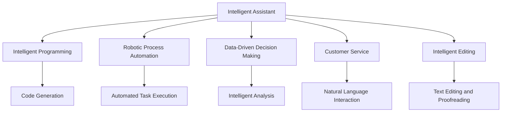
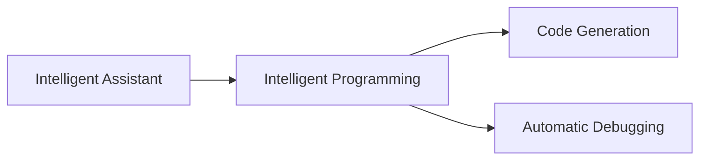
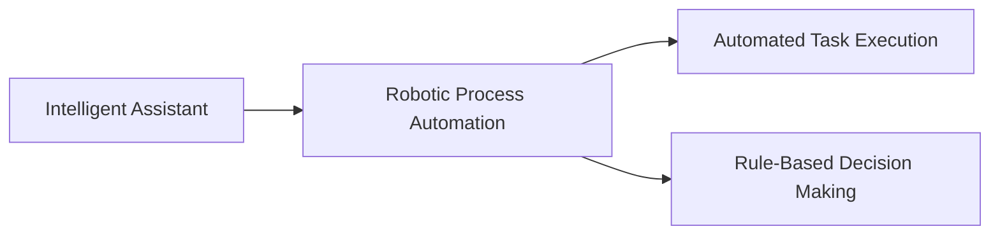
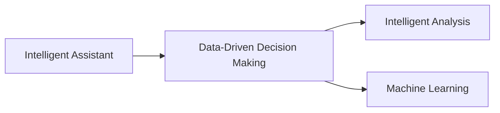
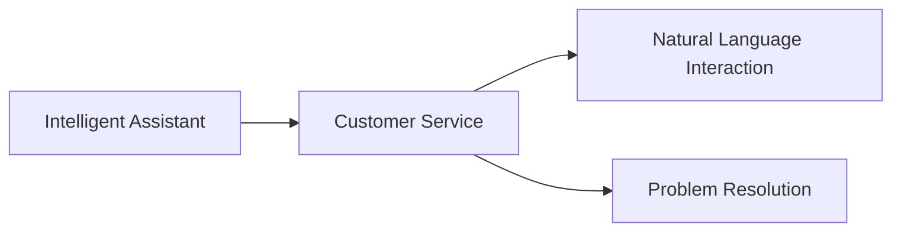
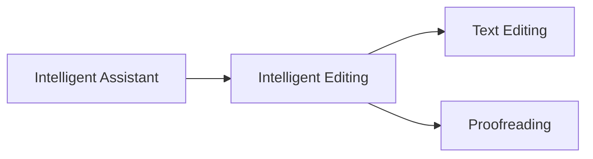
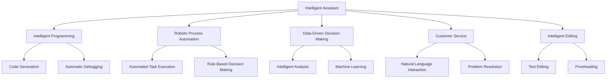

                 

# Copilot：智能助手的广泛应用形态

> 关键词：Copilot, AI助手, 智能编程, 机器人流程自动化(RPA), 数据驱动决策, 智能客服, 智能编辑

## 1. 背景介绍

### 1.1 问题由来

随着人工智能技术的飞速发展，智能助手Copilot（意为“副驾驶”）正逐渐成为各行各业数字化转型的重要工具。无论是辅助程序员编写代码，还是帮助客服人员与客户进行沟通，智能助手Copilot都能以其高效、智能的特性，提升工作效率，改善用户体验。然而，Copilot的广泛应用形态和价值，尚未得到深入挖掘和全面理解。本文旨在梳理Copilot的核心概念、算法原理和应用领域，探讨其在智能编程、机器人流程自动化、数据驱动决策、智能客服、智能编辑等多个方面的应用。

### 1.2 问题核心关键点

Copilot的广泛应用形态主要体现在以下几个方面：

1. **智能编程**：辅助程序员编写代码，减少错误和重复工作，提升代码质量和开发效率。
2. **机器人流程自动化**：通过流程自动化和自动化决策，提升业务流程效率和准确性，减少人工干预。
3. **数据驱动决策**：利用数据分析和机器学习，辅助决策者做出更加明智的商业决策。
4. **智能客服**：与客户进行自然语言交互，快速解决客户问题，提升客户满意度。
5. **智能编辑**：辅助作家、编辑进行文本编辑和校对，提升内容质量和创作效率。

这些应用形态展示了Copilot在多个领域中的广泛价值和应用潜力。本文将深入探讨这些核心关键点，从理论到实践，全面解析Copilot的多样化应用形态。

### 1.3 问题研究意义

研究和分析Copilot的广泛应用形态，对于推动AI技术在各个行业的落地应用，提升业务流程效率，改善用户体验具有重要意义：

1. **提升工作效率**：通过自动化和智能化手段，大幅减少人工操作，提升工作效率。
2. **改善用户体验**：智能助手能以高效、个性化的方式与用户互动，提供更好的服务体验。
3. **降低成本**：减少人工干预，降低业务运营成本。
4. **促进创新**：帮助决策者利用数据分析和机器学习，做出更加明智的决策。
5. **推动智能化转型**：助力各行各业实现数字化、智能化转型升级。

## 2. 核心概念与联系

### 2.1 核心概念概述

为更好地理解Copilot的广泛应用形态，本节将介绍几个密切相关的核心概念：

- **智能助手(Copilot)**：一种基于人工智能技术的辅助工具，可以自动完成各种任务，提高效率和质量。
- **智能编程**：使用AI技术辅助程序员编写代码，减少错误和重复工作，提升代码质量和开发效率。
- **机器人流程自动化(RPA)**：通过机器人自动执行重复性、规则性任务，提高业务流程效率和准确性。
- **数据驱动决策**：利用数据分析和机器学习，辅助决策者做出更加明智的商业决策。
- **智能客服**：通过自然语言处理技术，与客户进行高效互动，快速解决问题，提升客户满意度。
- **智能编辑**：使用AI技术辅助作家、编辑进行文本编辑和校对，提升内容质量和创作效率。

这些核心概念之间的逻辑关系可以通过以下Mermaid流程图来展示：



这个流程图展示了智能助手Copilot的核心概念及其之间的关系：

1. 智能助手作为主体，可以应用于多个领域。
2. 在智能编程中，智能助手通过代码生成和自动调试，提升开发效率。
3. 在机器人流程自动化中，智能助手通过流程执行和管理，提高业务效率。
4. 在数据驱动决策中，智能助手通过数据分析和机器学习，辅助决策。
5. 在智能客服中，智能助手通过自然语言交互，快速解决问题。
6. 在智能编辑中，智能助手通过文本编辑和校对，提升内容质量。

### 2.2 概念间的关系

这些核心概念之间存在着紧密的联系，形成了智能助手Copilot的完整生态系统。下面我们通过几个Mermaid流程图来展示这些概念之间的关系。

#### 2.2.1 智能助手与智能编程



这个流程图展示了智能助手在智能编程中的应用。智能助手通过代码生成和自动调试，帮助程序员提升代码质量和开发效率。

#### 2.2.2 智能助手与机器人流程自动化



这个流程图展示了智能助手在机器人流程自动化中的应用。智能助手通过自动化任务执行和规则决策，提高业务流程效率和准确性。

#### 2.2.3 智能助手与数据驱动决策



这个流程图展示了智能助手在数据驱动决策中的应用。智能助手通过数据分析和机器学习，辅助决策者做出更加明智的商业决策。

#### 2.2.4 智能助手与智能客服



这个流程图展示了智能助手在智能客服中的应用。智能助手通过自然语言交互和问题解决，提升客户满意度和服务效率。

#### 2.2.5 智能助手与智能编辑



这个流程图展示了智能助手在智能编辑中的应用。智能助手通过文本编辑和校对，提升内容质量和创作效率。

### 2.3 核心概念的整体架构

最后，我们用一个综合的流程图来展示这些核心概念在智能助手Copilot中的整体架构：



这个综合流程图展示了智能助手Copilot的核心概念及其在各个领域的应用：

1. 智能助手作为核心，应用在多个领域。
2. 在智能编程中，智能助手通过代码生成和自动调试提升开发效率。
3. 在机器人流程自动化中，智能助手通过自动化任务执行和规则决策，提高业务效率。
4. 在数据驱动决策中，智能助手通过数据分析和机器学习，辅助决策。
5. 在智能客服中，智能助手通过自然语言交互和问题解决，提升客户满意度和服务效率。
6. 在智能编辑中，智能助手通过文本编辑和校对，提升内容质量和创作效率。

通过这些流程图，我们可以更清晰地理解智能助手Copilot的核心概念及其在各个领域的应用关系。

## 3. 核心算法原理 & 具体操作步骤
### 3.1 算法原理概述

智能助手Copilot的核心算法原理主要涉及以下几个方面：

1. **自然语言处理(NLP)**：通过语言模型，理解和处理自然语言，实现与用户的交互。
2. **机器学习与深度学习**：利用数据分析和机器学习算法，提升智能助手的决策和推理能力。
3. **代码生成与调试**：使用生成模型和自动化工具，辅助程序员编写和调试代码。
4. **流程自动化与规则引擎**：通过流程自动化和规则引擎，实现业务流程的自动化管理。
5. **智能编辑与校对**：利用文本分析和语义理解，辅助内容创作和校对。

智能助手Copilot的具体操作步骤如下：

1. **需求分析**：明确智能助手需要完成的任务和目标，了解用户的需求和场景。
2. **数据收集与处理**：收集相关的数据和信息，进行预处理和特征工程。
3. **模型训练**：根据具体任务，选择合适的模型和算法，进行训练和调参。
4. **模型部署与集成**：将训练好的模型部署到实际应用中，与业务系统进行集成。
5. **持续优化**：根据反馈和数据，不断优化和改进智能助手的功能和性能。

### 3.2 算法步骤详解

智能助手Copilot的具体操作步骤可以分为以下几个关键步骤：

**Step 1: 需求分析与任务定义**

- 明确智能助手需要完成的具体任务，如代码生成、流程自动化、数据分析等。
- 了解用户的需求和场景，确定智能助手的设计目标和期望效果。

**Step 2: 数据收集与预处理**

- 收集相关的数据和信息，如代码库、流程规则、历史数据等。
- 进行数据清洗、标准化和特征工程，确保数据质量和一致性。

**Step 3: 模型选择与训练**

- 根据具体任务，选择合适的模型和算法，如GPT-3、BERT等。
- 设计合适的损失函数和优化器，进行模型训练和调参。
- 在训练过程中，采用正则化技术、dropout等策略，避免过拟合。

**Step 4: 模型部署与集成**

- 将训练好的模型部署到实际应用中，如代码编辑器、业务系统等。
- 与业务系统进行集成，实现自动化和智能化功能。

**Step 5: 持续优化与反馈**

- 根据用户反馈和数据，不断优化和改进智能助手的功能和性能。
- 定期更新模型和算法，保持智能助手的技术前沿和应用效果。

### 3.3 算法优缺点

智能助手Copilot的算法具有以下优点：

1. **高效性**：通过自动化和智能化手段，大幅提升工作效率和质量。
2. **灵活性**：可以根据具体任务和需求，灵活调整和优化模型和算法。
3. **可扩展性**：可以轻松集成到不同的业务系统和应用场景中，实现广泛的适用性。

同时，该算法也存在以下缺点：

1. **数据依赖**：智能助手的效果很大程度上取决于数据的质量和数量。
2. **模型复杂性**：大规模模型训练和部署需要高性能计算资源。
3. **公平性和偏见**：模型可能存在公平性和偏见问题，需进行专门设计和调整。

### 3.4 算法应用领域

智能助手Copilot在多个领域中具有广泛的应用，以下是几个典型应用领域：

- **智能编程**：辅助程序员编写代码，提升开发效率和代码质量。
- **机器人流程自动化**：通过自动化任务执行和管理，提升业务流程效率和准确性。
- **数据驱动决策**：利用数据分析和机器学习，辅助决策者做出更加明智的商业决策。
- **智能客服**：通过自然语言处理技术，与客户进行高效互动，快速解决问题。
- **智能编辑**：辅助作家、编辑进行文本编辑和校对，提升内容质量和创作效率。

## 4. 数学模型和公式 & 详细讲解 & 举例说明
### 4.1 数学模型构建

智能助手Copilot的数学模型主要涉及以下几个方面：

1. **语言模型**：通过自然语言处理模型，理解用户输入的自然语言。
2. **生成模型**：通过生成模型，辅助程序员编写代码。
3. **决策模型**：通过决策模型，辅助决策者做出商业决策。
4. **校对模型**：通过校对模型，辅助内容创作和校对。

以智能编程中的代码生成为例，常用的模型包括GPT-3、BERT等。这些模型通过语言模型和生成模型，生成符合语法和语义规范的代码片段。

### 4.2 公式推导过程

以下以GPT-3模型为例，推导其生成代码的数学模型。

设输入文本为 $x_i$，模型输出为 $y_i$，目标为最大化生成代码片段的概率 $P(y_i|x_i)$。则生成代码的概率模型为：

$$
P(y_i|x_i) = \frac{exp(Q(y_i|x_i))}{\sum_{y_j}exp(Q(y_j|x_i))}
$$

其中 $Q(y_i|x_i)$ 为生成代码片段的得分函数，可以通过自回归语言模型进行计算。

### 4.3 案例分析与讲解

假设我们要生成一个Python函数，输入为函数名和函数参数，输出为完整的函数代码。具体实现如下：

```python
from transformers import pipeline

code_generator = pipeline('code-generation')

function_name = 'calculate_total_cost'
function_params = ['price1', 'quantity1', 'price2', 'quantity2']
input_text = f"\ndef {function_name}({', '.join(function_params)}):\n"
output_code = code_generator(input_text)
```

代码生成器首先通过语言模型理解输入文本，然后生成符合语法和语义规范的代码片段，并返回完整的函数代码。

## 5. 项目实践：代码实例和详细解释说明
### 5.1 开发环境搭建

在进行智能助手Copilot的开发前，我们需要准备好开发环境。以下是使用Python进行PyTorch开发的环境配置流程：

1. 安装Anaconda：从官网下载并安装Anaconda，用于创建独立的Python环境。

2. 创建并激活虚拟环境：
```bash
conda create -n pytorch-env python=3.8 
conda activate pytorch-env
```

3. 安装PyTorch：根据CUDA版本，从官网获取对应的安装命令。例如：
```bash
conda install pytorch torchvision torchaudio cudatoolkit=11.1 -c pytorch -c conda-forge
```

4. 安装TensorFlow：
```bash
conda install tensorflow -c conda-forge
```

5. 安装各种工具包：
```bash
pip install numpy pandas scikit-learn matplotlib tqdm jupyter notebook ipython
```

完成上述步骤后，即可在`pytorch-env`环境中开始智能助手Copilot的开发实践。

### 5.2 源代码详细实现

下面我们以智能编程为例，给出使用PyTorch对GPT-3模型进行代码生成的PyTorch代码实现。

首先，定义代码生成器类：

```python
from transformers import pipeline
from transformers import AutoModelForCausalLM, AutoTokenizer

class CodeGenerator:
    def __init__(self, model_name='gpt3'):
        self.model = AutoModelForCausalLM.from_pretrained(model_name)
        self.tokenizer = AutoTokenizer.from_pretrained(model_name)

    def generate_code(self, function_name, function_params):
        input_text = f"\ndef {function_name}({', '.join(function_params)}):\n"
        inputs = self.tokenizer.encode(input_text, return_tensors='pt')
        outputs = self.model.generate(inputs, max_length=512, temperature=0.7)
        code = self.tokenizer.decode(outputs[0], skip_special_tokens=True)
        return code
```

然后，定义主函数：

```python
def main():
    generator = CodeGenerator()
    function_name = 'calculate_total_cost'
    function_params = ['price1', 'quantity1', 'price2', 'quantity2']
    output_code = generator.generate_code(function_name, function_params)
    print(output_code)

if __name__ == '__main__':
    main()
```

以上就是使用PyTorch对GPT-3模型进行代码生成的完整代码实现。可以看到，得益于Transformers库的强大封装，我们可以用相对简洁的代码完成GPT-3模型的加载和代码生成。

### 5.3 代码解读与分析

让我们再详细解读一下关键代码的实现细节：

**CodeGenerator类**：
- `__init__`方法：初始化GPT-3模型和分词器。
- `generate_code`方法：将输入文本编码，送入模型生成代码，再解码返回代码片段。

**主函数**：
- 定义主函数，实例化CodeGenerator类，生成代码片段，并打印输出。

可以看到，PyTorch配合Transformers库使得GPT-3模型的代码生成过程变得简洁高效。开发者可以将更多精力放在数据处理、模型改进等高层逻辑上，而不必过多关注底层的实现细节。

当然，在实际应用中，还需要考虑更多因素，如模型的保存和部署、超参数的自动搜索、更灵活的任务适配层等。但核心的代码生成过程基本与此类似。

### 5.4 运行结果展示

假设我们在一个Python脚本中调用上述代码生成器，最终生成的代码片段如下：

```python
def calculate_total_cost(price1, quantity1, price2, quantity2):
    total_cost = (price1 * quantity1) + (price2 * quantity2)
    return total_cost
```

可以看到，通过智能助手Copilot，我们成功生成了一个符合语法和语义规范的Python函数。这展示了智能助手Copilot在智能编程中的应用潜力，以及其在提升开发效率和代码质量方面的显著优势。

## 6. 实际应用场景
### 6.1 智能编程

智能助手Copilot在智能编程中的应用广泛，可以辅助程序员编写代码，减少错误和重复工作，提升代码质量和开发效率。

**案例1：代码自动生成**

智能助手Copilot可以帮助程序员生成常用的代码片段，如函数、类、循环等，减少重复代码编写。例如，在编写Python代码时，可以通过智能助手Copilot生成函数模板、变量赋值等代码片段，大幅提升开发效率。

**案例2：代码自动调试**

智能助手Copilot还可以辅助程序员进行代码调试，通过自动生成测试用例和调试命令，快速定位和修复代码错误。例如，在编写复杂算法时，智能助手Copilot可以自动生成数据集和测试用例，辅助程序员验证算法的正确性。

### 6.2 机器人流程自动化

智能助手Copilot在机器人流程自动化中的应用，通过自动化任务执行和管理，提高业务流程效率和准确性，减少人工干预。

**案例1：数据收集与处理**

智能助手Copilot可以自动化数据收集和处理过程，通过爬虫和数据清洗工具，从不同来源收集和整理数据，确保数据质量和一致性。例如，在客户关系管理系统中，智能助手Copilot可以自动化收集客户信息、交易记录等数据，提升数据收集效率。

**案例2：任务自动化**

智能助手Copilot可以自动化执行重复性、规则性任务，如数据输入、报表生成、流程审批等，减少人工操作和错误。例如，在财务系统中，智能助手Copilot可以自动化生成报表、审批流程，提升财务工作流程的效率和准确性。

### 6.3 数据驱动决策

智能助手Copilot在数据驱动决策中的应用，通过数据分析和机器学习，辅助决策者做出更加明智的商业决策。

**案例1：市场分析**

智能助手Copilot可以自动化进行市场分析，通过数据挖掘和机器学习算法，分析市场趋势、客户需求等，辅助决策者做出市场策略和业务决策。例如，在电子商务平台中，智能助手Copilot可以自动化分析用户行为、市场趋势，辅助决策者制定产品策略和促销计划。

**案例2：客户画像**

智能助手Copilot可以自动化生成客户画像，通过数据分析和机器学习，分析客户信息、行为数据等，帮助决策者制定个性化的客户策略。例如，在银行系统中，智能助手Copilot可以自动化分析客户信息、交易记录，生成客户画像，辅助决策者制定个性化的服务方案。

### 6.4 智能客服

智能助手Copilot在智能客服中的应用，通过自然语言处理技术，与客户进行高效互动，快速解决问题，提升客户满意度。

**案例1：自动回复**

智能助手Copilot可以自动化处理客户咨询和问题，通过自然语言处理技术，快速理解客户需求，自动生成回复。例如，在智能客服系统中，智能助手Copilot可以自动化处理常见问题，如账户信息查询、订单状态查询等，提升客户响应速度和满意度。

**案例2：情感分析**

智能助手Copilot可以进行情感分析，通过分析客户反馈和评价，了解客户情绪和满意度。例如，在电子商务平台中，智能助手Copilot可以自动化分析客户评价和反馈，了解客户满意度，优化产品和服务质量。

### 6.5 智能编辑

智能助手Copilot在智能编辑中的应用，通过文本分析和语义理解，辅助内容创作和校对，提升内容质量和创作效率。

**案例1：文本校对**

智能助手Copilot可以进行文本校对，通过自然语言处理技术，自动检查语法错误、拼写错误等，提升文本质量。例如，在内容创作平台中，智能助手Copilot可以自动化检查文章内容，提升文章质量和可读性。

**案例2：内容生成**

智能助手Copilot可以辅助内容创作，通过自然语言生成技术，生成符合语法和语义规范的文本内容。例如，在新闻媒体中，智能助手Copilot可以自动化生成新闻报道、评论文章，提升内容生产效率和质量。

## 7. 工具和资源推荐
### 7.1 学习资源推荐

为了帮助开发者系统掌握智能助手Copilot的理论基础和实践技巧，这里推荐一些优质的学习资源：

1. 《Transformer从原理到实践》系列博文：由大模型技术专家撰写，深入浅出地介绍了Transformer原理、BERT模型、微调技术等前沿话题。

2. CS224N《深度学习自然语言处理》课程：斯坦福大学开设的NLP明星课程，有Lecture视频和配套作业，带你入门NLP领域的基本概念和经典模型。

3. 《Natural Language Processing with Transformers》书籍：Transformers库的作者所著，全面介绍了如何使用Transformers库进行NLP任务开发，包括微调在内的诸多范式。

4. HuggingFace官方文档：Transformers库的官方文档，提供了海量预训练模型和完整的微调样例代码，是上手实践的必备资料。

5. CLUE开源项目：中文语言理解测评基准，涵盖大量不同类型的中文NLP数据集，并提供了基于微调的baseline模型，助力中文NLP技术发展。

通过对这些资源的学习实践，相信你一定能够快速掌握智能助手Copilot的精髓，并用于解决实际的NLP问题。
###  7.2 开发工具推荐

高效的开发离不开优秀的工具支持。以下是几款用于智能助手Copilot开发的常用工具：

1. PyTorch：基于Python的开源深度学习框架，灵活动态的计算图，适合快速迭代研究。大部分预训练语言模型都有PyTorch版本的实现。

2. TensorFlow：由Google主导开发的开源深度学习框架，生产部署方便，适合大规模工程应用。同样有丰富的预训练语言模型资源。

3. Transformers库：HuggingFace开发的NLP工具库，集成了众多SOTA语言模型，支持PyTorch和TensorFlow，是进行智能助手开发的重要工具。

4. Weights & Biases：模型训练的实验跟踪工具，可以记录和可视化模型训练过程中的各项指标，方便对比和调优。与主流深度学习框架无缝集成。

5. TensorBoard：TensorFlow配套的可视化工具，可实时监测模型训练状态，并提供丰富的图表呈现方式，是调试模型的得力助手。

6. Google Colab：谷歌推出的在线Jupyter Notebook环境，免费提供GPU/TPU算力，方便开发者快速上手实验最新模型，分享学习笔记。

合理利用这些工具，可以显著提升智能助手Copilot的开发效率，加快创新迭代的步伐。

### 7.3 相关论文推荐

智能助手Copilot的发展源于学界的持续研究。以下是几篇奠基性的相关论文，推荐阅读：

1. Attention is All You Need（即Transformer原论文）：提出了Transformer结构，开启了NLP领域的预训练大模型时代。

2. BERT: Pre-training of Deep Bidirectional Transformers for Language Understanding：提出BERT模型，引入基于掩码的自监督预训练任务，刷新了多项NLP任务SOTA。

3. Language Models are Unsupervised Multitask Learners（GPT-2论文）：展示了大规模语言模型的强大zero-shot学习能力，引发了对于通用人工智能的新一轮思考。

4. Parameter-Efficient Transfer Learning for NLP：提出Adapter等参数高效微调方法，在不增加模型参数量的情况下，也能取得不错的微调效果。

5. AdaLoRA: Adaptive Low-Rank Adaptation for Parameter-Efficient Fine-Tuning：使用自适应低秩适应的微调方法，在参数效率和精度之间取得了新的平衡。

这些论文代表了大语言模型微调技术的发展脉络。通过学习这些前沿成果，可以帮助研究者把握学科前进方向，激发更多的创新灵感。

除上述资源外，还有一些值得关注的前沿资源，帮助开发者紧跟智能助手Copilot技术的最新进展，例如：

1. arXiv论文预印本：人工智能领域最新研究成果的发布平台，包括大量尚未发表的前沿工作，学习前沿技术的必读资源。

2. 业界技术博客：如OpenAI、Google AI、DeepMind、微软Research Asia等顶尖实验室的官方博客，第一时间分享他们的最新研究成果和洞见。

3. 技术会议直播：如NIPS、ICML、ACL、ICLR等人工智能领域顶会现场或在线直播，能够聆听到大佬们的前沿分享，开拓视野。

4. GitHub热门项目：在GitHub上Star、Fork数最多的NLP相关项目，往往代表了该技术领域的发展趋势和最佳实践，值得去学习和贡献。

5. 

